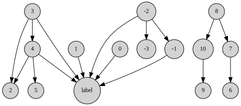
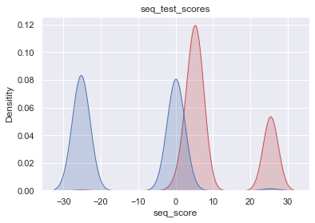
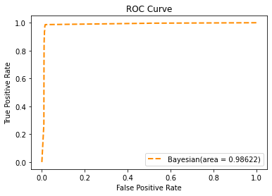
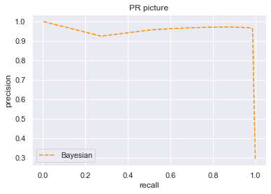

```python
import pandas as pd
import numpy as np
from pgmpy.estimators import BicScore
from pgmpy.models import BayesianModel
import random
file = open("C:\\Users\\Alan‘s Lenovo\\Desktop\\donor_seq_training2.txt")
seqs_1 = []
for line in file.readlines():
    seq = line.strip()
    seq = seq + str('1')
    seqs_1.append(list(seq))
file.close()
seqs_2 = []
file = open("C:\\Users\\Alan‘s Lenovo\\Desktop\\non_donor_seq_training2.txt")
for line in file.readlines():
    seq = line.strip()
    seq = seq + str('0')
    seqs_2.append(list(seq))
file.close()
seqs_2 = random.sample(seqs_2,2380)
seqs = seqs_1 + seqs_2
data = pd.DataFrame(seqs,columns = ('-9','-8','-7','-6','-5','-4','-3','-2','-1','0','1',
                                    '2','3','4','5','6','7','8','9','10','label'))
```


```python
len(seqs_1),len(seqs_2)
```


    (2379, 2380)


```python
from pgmpy.estimators import PC
c = PC(data)
model = c.estimate()
print(model.edges())
```

    Working for n conditional variables: 5: 100%|████████████████████████████████████████████| 5/5 [04:05<00:00, 52.22s/it]C:\ProgramData\Anaconda3\lib\site-packages\pgmpy\estimators\PC.py:369: UserWarning: Reached maximum number of allowed conditional variables. Exiting
      warn("Reached maximum number of allowed conditional variables. Exiting")
    Working for n conditional variables: 5: 100%|████████████████████████████████████████████| 5/5 [05:18<00:00, 63.64s/it]

    [('label', '0'), ('label', '1'), ('4', '2'), ('4', '5'), ('4', 'label'), ('-2', '-3'), ('-2', '-1'), ('-2', 'label'), ('3', 'label'), ('3', '2'), ('3', '4'), ('-1', 'label'), ('10', '9'), ('7', '6'), ('8', '7'), ('8', '10')]
    

    
    


```python
edges = model.edges
rm_edges = [i for i in edges if i[0] == 'label']
add_edges = [(i[1], i[0]) for i in rm_edges]
model.remove_edges_from(rm_edges)
model.add_edges_from(add_edges)
```


```python
def showBN(model,save=False):
    from graphviz import Digraph
    node_attr = dict(style='filled',shape='circle',align='left',fontsize='12',ranksep='0.1',height='0.2')
    dot = Digraph(node_attr=node_attr, graph_attr=dict(size="12,12"))
    seen = set()
    edges=model.edges()
    for a,b in edges:
        dot.edge(a,b)
    if save:
        dot.view(cleanup=True)
    return dot
showBN(model)
```


    

    


```python
%%time
from pgmpy.estimators import MaximumLikelihoodEstimator, BayesianEstimator
model = BayesianModel(model.edges)
model.fit(data, estimator = MaximumLikelihoodEstimator)
```

    Wall time: 984 ms
    


```python
for cpd in model.get_cpds():
    # 打印条件概率分布
    print("CPD of {variable}:".format(variable=cpd.variable))
    print(cpd)
```

    CPD of -1:
    +-------+---------------------+---------------------+---------------------+---------------------+
    | -2    | -2(a)               | -2(c)               | -2(g)               | -2(t)               |
    +-------+---------------------+---------------------+---------------------+---------------------+
    | -1(a) | 0.1530511811023622  | 0.24061032863849766 | 0.210989010989011   | 0.1305699481865285  |
    +-------+---------------------+---------------------+---------------------+---------------------+
    | -1(c) | 0.07381889763779527 | 0.23943661971830985 | 0.18021978021978022 | 0.13575129533678756 |
    +-------+---------------------+---------------------+---------------------+---------------------+
    | -1(g) | 0.6751968503937008  | 0.25704225352112675 | 0.4307692307692308  | 0.49533678756476685 |
    +-------+---------------------+---------------------+---------------------+---------------------+
    | -1(t) | 0.09793307086614174 | 0.26291079812206575 | 0.17802197802197803 | 0.23834196891191708 |
    +-------+---------------------+---------------------+---------------------+---------------------+
    CPD of -2:
    +-------+----------+
    | -2(a) | 0.42698  |
    +-------+----------+
    | -2(c) | 0.179029 |
    +-------+----------+
    | -2(g) | 0.191217 |
    +-------+----------+
    | -2(t) | 0.202774 |
    +-------+----------+
    CPD of -3:
    +-------+---------------------+---------------------+---------------------+---------------------+
    | -2    | -2(a)               | -2(c)               | -2(g)               | -2(t)               |
    +-------+---------------------+---------------------+---------------------+---------------------+
    | -3(a) | 0.33562992125984253 | 0.22300469483568075 | 0.34065934065934067 | 0.25803108808290154 |
    +-------+---------------------+---------------------+---------------------+---------------------+
    | -3(c) | 0.3676181102362205  | 0.2981220657276995  | 0.0978021978021978  | 0.3067357512953368  |
    +-------+---------------------+---------------------+---------------------+---------------------+
    | -3(g) | 0.20718503937007873 | 0.23591549295774647 | 0.25274725274725274 | 0.16476683937823836 |
    +-------+---------------------+---------------------+---------------------+---------------------+
    | -3(t) | 0.08956692913385826 | 0.24295774647887325 | 0.3087912087912088  | 0.2704663212435233  |
    +-------+---------------------+---------------------+---------------------+---------------------+
    CPD of 0:
    +------+----------+
    | 0(a) | 0.135323 |
    +------+----------+
    | 0(c) | 0.111788 |
    +------+----------+
    | 0(g) | 0.615465 |
    +------+----------+
    | 0(t) | 0.137424 |
    +------+----------+
    CPD of 1:
    +------+----------+
    | 1(a) | 0.128598 |
    +------+----------+
    | 1(c) | 0.117462 |
    +------+----------+
    | 1(g) | 0.119353 |
    +------+----------+
    | 1(t) | 0.634587 |
    +------+----------+
    CPD of 10:
    +-------+---------------------+---------------------+---------------------+---------------------+
    | 8     | 8(a)                | 8(c)                | 8(g)                | 8(t)                |
    +-------+---------------------+---------------------+---------------------+---------------------+
    | 10(a) | 0.30243445692883897 | 0.186401833460657   | 0.22194513715710723 | 0.20949957591178966 |
    +-------+---------------------+---------------------+---------------------+---------------------+
    | 10(c) | 0.199438202247191   | 0.2902979373567609  | 0.27514546965918535 | 0.2527565733672604  |
    +-------+---------------------+---------------------+---------------------+---------------------+
    | 10(g) | 0.2612359550561798  | 0.29640947288006114 | 0.31587697423108896 | 0.22307039864291772 |
    +-------+---------------------+---------------------+---------------------+---------------------+
    | 10(t) | 0.23689138576779026 | 0.226890756302521   | 0.18703241895261846 | 0.3146734520780322  |
    +-------+---------------------+---------------------+---------------------+---------------------+
    CPD of 2:
    +------+---------------------+---------------------+----------------------+---------------------+---------------------+---------------------+---------------------+--------------------+---------------------+----------------------+---------------------+---------------------+---------------------+---------------------+---------------------+---------------------+
    | 3    | 3(a)                | 3(a)                | 3(a)                 | 3(a)                | 3(c)                | 3(c)                | 3(c)                | 3(c)               | 3(g)                | 3(g)                 | 3(g)                | 3(g)                | 3(t)                | 3(t)                | 3(t)                | 3(t)                |
    +------+---------------------+---------------------+----------------------+---------------------+---------------------+---------------------+---------------------+--------------------+---------------------+----------------------+---------------------+---------------------+---------------------+---------------------+---------------------+---------------------+
    | 4    | 4(a)                | 4(c)                | 4(g)                 | 4(t)                | 4(a)                | 4(c)                | 4(g)                | 4(t)               | 4(a)                | 4(c)                 | 4(g)                | 4(t)                | 4(a)                | 4(c)                | 4(g)                | 4(t)                |
    +------+---------------------+---------------------+----------------------+---------------------+---------------------+---------------------+---------------------+--------------------+---------------------+----------------------+---------------------+---------------------+---------------------+---------------------+---------------------+---------------------+
    | 2(a) | 0.5487364620938628  | 0.4036144578313253  | 0.3746295198577356   | 0.4467005076142132  | 0.26570048309178745 | 0.34375             | 0.358974358974359   | 0.3380952380952381 | 0.3212121212121212  | 0.3884297520661157   | 0.42053789731051344 | 0.35064935064935066 | 0.3247863247863248  | 0.2608695652173913  | 0.4568245125348189  | 0.24545454545454545 |
    +------+---------------------+---------------------+----------------------+---------------------+---------------------+---------------------+---------------------+--------------------+---------------------+----------------------+---------------------+---------------------+---------------------+---------------------+---------------------+---------------------+
    | 2(c) | 0.148014440433213   | 0.2289156626506024  | 0.06342620035566093  | 0.18781725888324874 | 0.28502415458937197 | 0.23958333333333334 | 0.09401709401709402 | 0.2523809523809524 | 0.06666666666666667 | 0.049586776859504134 | 0.04156479217603912 | 0.03896103896103896 | 0.23076923076923078 | 0.30434782608695654 | 0.2116991643454039  | 0.2590909090909091  |
    +------+---------------------+---------------------+----------------------+---------------------+---------------------+---------------------+---------------------+--------------------+---------------------+----------------------+---------------------+---------------------+---------------------+---------------------+---------------------+---------------------+
    | 2(g) | 0.16967509025270758 | 0.24096385542168675 | 0.5376407824540604   | 0.2233502538071066  | 0.21256038647342995 | 0.25                | 0.4444444444444444  | 0.1523809523809524 | 0.3515151515151515  | 0.2727272727272727   | 0.3863080684596577  | 0.22727272727272727 | 0.1282051282051282  | 0.16770186335403728 | 0.2200557103064067  | 0.16363636363636364 |
    +------+---------------------+---------------------+----------------------+---------------------+---------------------+---------------------+---------------------+--------------------+---------------------+----------------------+---------------------+---------------------+---------------------+---------------------+---------------------+---------------------+
    | 2(t) | 0.13357400722021662 | 0.12650602409638553 | 0.024303497332542976 | 0.14213197969543148 | 0.23671497584541062 | 0.16666666666666666 | 0.10256410256410256 | 0.2571428571428571 | 0.2606060606060606  | 0.2892561983471074   | 0.15158924205378974 | 0.38311688311688313 | 0.3162393162393162  | 0.2670807453416149  | 0.11142061281337047 | 0.33181818181818185 |
    +------+---------------------+---------------------+----------------------+---------------------+---------------------+---------------------+---------------------+--------------------+---------------------+----------------------+---------------------+---------------------+---------------------+---------------------+---------------------+---------------------+
    CPD of 3:
    +------+----------+
    | 3(a) | 0.488968 |
    +------+----------+
    | 3(c) | 0.152553 |
    +------+----------+
    | 3(g) | 0.178399 |
    +------+----------+
    | 3(t) | 0.18008  |
    +------+----------+
    CPD of 4:
    +------+---------------------+---------------------+---------------------+---------------------+
    | 3    | 3(a)                | 3(c)                | 3(g)                | 3(t)                |
    +------+---------------------+---------------------+---------------------+---------------------+
    | 4(a) | 0.11903738719381178 | 0.28512396694214875 | 0.19434628975265017 | 0.13652275379229872 |
    +------+---------------------+---------------------+---------------------+---------------------+
    | 4(c) | 0.07133648474430597 | 0.2644628099173554  | 0.1425206124852768  | 0.18786464410735124 |
    +------+---------------------+---------------------+---------------------+---------------------+
    | 4(g) | 0.7249677696605071  | 0.16115702479338842 | 0.4817432273262662  | 0.41890315052508753 |
    +------+---------------------+---------------------+---------------------+---------------------+
    | 4(t) | 0.08465835840137516 | 0.2892561983471074  | 0.18138987043580684 | 0.25670945157526254 |
    +------+---------------------+---------------------+---------------------+---------------------+
    CPD of 5:
    +------+---------------------+-----------+---------------------+---------------------+
    | 4    | 4(a)                | 4(c)      | 4(g)                | 4(t)                |
    +------+---------------------+-----------+---------------------+---------------------+
    | 5(a) | 0.27023498694516973 | 0.309375  | 0.16990668740279938 | 0.18309859154929578 |
    +------+---------------------+-----------+---------------------+---------------------+
    | 5(c) | 0.17754569190600522 | 0.2921875 | 0.17457231726283048 | 0.2023047375160051  |
    +------+---------------------+-----------+---------------------+---------------------+
    | 5(g) | 0.30809399477806787 | 0.0875    | 0.21889580093312597 | 0.3047375160051216  |
    +------+---------------------+-----------+---------------------+---------------------+
    | 5(t) | 0.24412532637075718 | 0.3109375 | 0.43662519440124414 | 0.30985915492957744 |
    +------+---------------------+-----------+---------------------+---------------------+
    CPD of 6:
    +------+---------------------+---------------------+---------------------+---------------------+
    | 7    | 7(a)                | 7(c)                | 7(g)                | 7(t)                |
    +------+---------------------+---------------------+---------------------+---------------------+
    | 6(a) | 0.27926267281105993 | 0.2037037037037037  | 0.31526271893244373 | 0.24168694241686942 |
    +------+---------------------+---------------------+---------------------+---------------------+
    | 6(c) | 0.2654377880184332  | 0.30193236714975846 | 0.06672226855713094 | 0.26277372262773724 |
    +------+---------------------+---------------------+---------------------+---------------------+
    | 6(g) | 0.28663594470046083 | 0.2898550724637681  | 0.3603002502085071  | 0.2360097323600973  |
    +------+---------------------+---------------------+---------------------+---------------------+
    | 6(t) | 0.16866359447004609 | 0.20450885668276972 | 0.25771476230191825 | 0.259529602595296   |
    +------+---------------------+---------------------+---------------------+---------------------+
    CPD of 7:
    +------+---------------------+---------------------+---------------------+---------------------+
    | 8    | 8(a)                | 8(c)                | 8(g)                | 8(t)                |
    +------+---------------------+---------------------+---------------------+---------------------+
    | 7(a) | 0.27902621722846443 | 0.1703590527119939  | 0.2709891936824605  | 0.2018659881255301  |
    +------+---------------------+---------------------+---------------------+---------------------+
    | 7(c) | 0.2949438202247191  | 0.33460656990068754 | 0.09393183707398171 | 0.3189143341815098  |
    +------+---------------------+---------------------+---------------------+---------------------+
    | 7(g) | 0.24531835205992508 | 0.2505729564553094  | 0.3341645885286783  | 0.17557251908396945 |
    +------+---------------------+---------------------+---------------------+---------------------+
    | 7(t) | 0.18071161048689138 | 0.24446142093200918 | 0.30091438071487947 | 0.30364715860899066 |
    +------+---------------------+---------------------+---------------------+---------------------+
    CPD of 8:
    +------+----------+
    | 8(a) | 0.224417 |
    +------+----------+
    | 8(c) | 0.275058 |
    +------+----------+
    | 8(g) | 0.252784 |
    +------+----------+
    | 8(t) | 0.247741 |
    +------+----------+
    CPD of 9:
    +------+---------------------+---------------------+---------------------+---------------------+
    | 10   | 10(a)               | 10(c)               | 10(g)               | 10(t)               |
    +------+---------------------+---------------------+---------------------+---------------------+
    | 9(a) | 0.27567067530064754 | 0.176759410801964   | 0.2687022900763359  | 0.18586387434554974 |
    +------+---------------------+---------------------+---------------------+---------------------+
    | 9(c) | 0.2978723404255319  | 0.3265139116202946  | 0.07099236641221374 | 0.3263525305410122  |
    +------+---------------------+---------------------+---------------------+---------------------+
    | 9(g) | 0.25716928769657726 | 0.2692307692307692  | 0.37251908396946565 | 0.17888307155322863 |
    +------+---------------------+---------------------+---------------------+---------------------+
    | 9(t) | 0.1692876965772433  | 0.22749590834697217 | 0.2877862595419847  | 0.3089005235602094  |
    +------+---------------------+---------------------+---------------------+---------------------+
    CPD of label:
    +----------+-------+-------+-------+-------+-------+-------+-------+-------+-------+-------+-------+-------+-------+-------+-------+-------+-------+-------+-------+-------+-------+-------+-------+-------+-------+-------+-------+-------+-------+-------+-------+-------+-------+-------+-------+-------+-------+-------+-------+-------+-------+-------+-------+-------+-------+-------+-------+-------+-------+-------+-------+-------+-------+-------+-------+-------+-------+-------+-------+-------+-------+-------+-------+-------+-------+-------+-------+-------+-------+-------+-------+-------+-------+-------+-------+-------+-------+-------+-------+-------+-------+-------+-------+-------+-------+-------+-------+-------+-------+-------+-------+-------+-------+-------+-------+-------+-------+-------+-------+-------+-------+-------+-------+-------+-------+-------+-------+-------+-------+-------+-------+-------+-------+-------+-------+-------+-------+-------+-------+-------+-------+-------+-------+-------+-------+-------+-------+-------+-------+-------+-------+-------+-------+-------+-------+-------+-------+-------+-------+-------+-------+-------+-------+-------+-------+-------+-------+-------+-------+-------+-------+-------+-------+-------+-------+-------+-------+-------+-------+-------+-------+-------+-------+-------+-------+-------+-------+-------+-------+-------+-------+-------+-------+-------+-------+-------+-------+-------+--------+-------+-------+-------+-------+--------------------+-------+-------+-------+-------+-------+-------+---------------------+-------+-------+-------+-------+-------+-------+-------+-------+-------+-------+-------+-------+-------+-------+-------+-------+-------+-------+-------+-------+-------+-------+-------+-------+-------+-------+-------+-------+-------+-------+-------+-------+-------+-------+-------+-------+-------+-------+-------+-------+-------+-------+-------+-------+-------+-------+-------+-------+-------+-------+-------+-------+-------+-------+-------+-------+-------+-------+-------+-------+-------+-------+-------+-------+-------+-------+-------+-------+-------+-------+-------+-------+-------+-------+-------+-------+-------+-------+-------+-------+-------+-------+-------+-------+-------+-------+-------+-------+-------+-------+-------+-------+-------+-------+-------+-------+-------+-------+-------+-------+-------+-------+-------+-------+-------+-------+-------+-------+-------+-------+-------+-------+-------+-------+-------+-------+-------+-------+-------+-------+-------+-------+-------+-------+-------+-------+-------+-------+-------+-------+-------+-------+-------+-------+-------+-------+-------+-------+-------+-------+-------+-------+-------+-------+-------+-------+-------+-------+-------+-------+-------+-------+-------+-------+-------+-------+-------+-------+-------+-------+-------+-------+-------+-------+-------+-------+-------+-------+-------+-------+-------+-------+-------+-------+-------+-------+-------+-------+-------+-------+-------+-------+-------+-------+-------+-------+-------+-------+-------+-------+-------+-------+-------+-------+-------+-------+-------+-------+-------+-------+-------+-------+-------+-------+-------+-------+-------+-------+-------+-------+-------+-------+-------+-------+-------+-------+-------+-------+-------+-------+-------+-------+-------+-------+-------+-------+-------+-------+-------+-------+-------+-------+-------+-------+-------+-------+-------+-------+-------+-------+-------+-------+-------+----------------------+-------+-------+-------+-------+-------+-------+-------+-------+-------+-------+-------+-------+-------+-------+-------+-------+-------+-------+-------+-------+-------+-------+-------+-------+-------+-------+-------+-------+-------+-------+-------+-------+-------+-------+-------+-------+-------+-------+-------+-------+-------+-------+-------+-------+-------+-------+-------+-------+-------+-------+-------+-------+-------+-------+-------+-------+-------+-------+-------+-------+-------+-------+-------+-------+-------+-------+-------+-------+-------+-------+-------+-------+-------+-------+-------+-------+-------+-------+-------+-------+-------+-------+-------+-------+-------+-------+-------+-------+-------+-------+-------+-------+-------+-------+-------+-------+-------+-------+-------+-------+-------+-------+-------+-------+-------+-------+-------+-------+-------+-------+-------+-------+-------+-------+-------+-------+-------+-------+-------+-------+-------+-------+-------+-------+-------+-------+-------+-------+-------+-------+-------+-------+-------+-------+-------+-------+-------+-------+-------+-------+-------+-------+-------+-------+-------+-------+-------+-------+-------+-------+-------+-------+-------+-------+-------+-------+-------+-------+-------+-------+-------+-------+-------+-------+-------+-------+-------+-------+-------+-------+-------+-------+-------+-------+-------+-------+-------+-------+-------+-------+-------+-------+-------+-------+-------+-------+-------+-------+-------+-------+-------+-------+-------+-------+-------+-------+-------+-------+-------+-------+-------+-------+-------+-------+-------+-------+-------+-------+-------+-------+-------+-------+-------+-------+-------+-------+-------+-------+-------+-------+-------+-------+-------+-------+-------+-------+-------+-------+-------+-------+-------+-------+-------+-------+-------+-------+-------+-------+-------+-------+-------+-------+-------+-------+-------+-------+-------+-------+-------+-------+-------+-------+-------+-------+-------+-------+-------+-------+-------+-------+-------+-------+-------+-------+-------+-------+-------+-------+-------+-------+-------+-------+-------+-------+-------+-------+-------+-------+-------+-------+-------+-------+-------+-------+-------+-------+-------+-------+-------+-------+-------+-------+-------+-------+-------+-------+-------+-------+-------+-------+-------+-------+-------+-------+-------+-------+-------+-------+-------+-------+-------+-------+-------+-------+-------+-------+-------+-------+-------+-------+-------+-------+-------+-------+-------+-------+-------+-------+-------+-------+-------+-------+-------+-------+-------+-------+-------+-------+-------+-------+-------+-------+-------+-------+-------+-------+-------+-------+-------+-------+-------+-------+-------+-------+-------+-------+-------+-------+-------+-------+-------+-------+-------+-------+-------+-------+-------+-------+-------+-------+-------+-------+-------+-------+-------+-------+-------+-------+-------+-------+-------+-------+-------+-------+-------+-------+-------+-------+-------+-------+-------+-------+-------+-------+-------+-------+-------+-------+-------+-------+-------+-------+-------+-------+-------+-------+-------+-------+-------+-------+-------+-------+-------+-------+-------+-------+-------+-------+-------+-------+-------+-------+-------+-------+-------+-------+-------+-------+-------+-------+-------+-------+-------+-------+-------+-------+-------+-------+-------+-------+-------+-------+-------+-------+-------+-------+-------+-------+-------+-------+-------+-------+-------+-------+-------+-------+-------+-------+-------+-------+-------+-------+-------+-------+-------+-------+-------+-------+-------+-------+-------+-------+-------+-------+-------+-------+-------+-------+-------+-------+-------+-------+-------+-------+-------+-------+-------+-------+-------+-------+-------+-------+-------+-------+-------+-------+-------+-------+-------+-------+-------+-------+-------+-------+-------+-------+-------+-------+-------+-------+-------+-------+-------+-------+-------+-------+-------+-------+-------+-------+-------+-------+-------+-------+-------+-------+-------+-------+-------+-------+-------+-------+-------+-------+-------+-------+-------+-------+-------+-------+-------+-------+-------+-------+-------+-------+-------+-------+-------+-------+-------+-------+-------+-------+-------+-------+-------+-------+-------+-------+-------+-------+-------+-------+-------+-------+-------+-------+-------+-------+-------+-------+-------+-------+-------+-------+-------+-------+-------+-------+-------+-------+-------+-------+-------+-------+-------+-------+-------+-------+-------+-------+-------+-------+-------+-------+-------+-------+-------+-------+-------+-------+-------+-------+-------+-------+-------+-------+-------+-------+-------+-------+-------+-------+-------+-------+-------+-------+-------+-------+-------+-------+-------+-------+-------+-------+-------+-------+-------+-------+-------+-------+-------+-------+-------+-------+-------+-------+-------+-------+-------+-------+-------+-------+-------+-------+-------+-------+-------+-------+-------+-------+-------+-------+-------+-------+-------+-------+-------+-------+-------+-------+-------+-------+-------+-------+-------+-------+-------+-------+-------+-------+-------+-------+-------+-------+-------+-------+-------+-------+-------+-------+-------+-------+-------+-------+-------+-------+-------+-------+-------+-------+-------+-------+-------+-------+-------+-------+-------+-------+-------+-------+-------+-------+-------+-------+-------+-------+-------+-------+-------+-------+-------+-------+-------+-------+-------+-------+-------+-------+-------+-------+-------+-------+-------+-------+-------+-------+-------+-------+-------+-------+-------+-------+-------+-------+-------+-------+-------+-------+-------+-------+-------+-------+-------+-------+-------+-------+-------+-------+-------+-------+-------+-------+-------+-------+-------+-------+-------+-------+-------+-------+-------+-------+-------+-------+-------+-------+-------+-------+-------+-------+-------+-------+-------+-------+-------+-------+-------+-------+-------+-------+-------+-------+-------+-------+-------+-------+-------+-------+-------+-------+-------+-------+-------+-------+-------+-------+-------+-------+-------+-------+-------+-------+-------+-------+-------+-------+-------+-------+-------+-------+-------+-------+-------+-------+-------+-------+-------+-------+-------+-------+-------+-------+-------+-------+-------+-------+-------+-------+-------+-------+-------+-------+-------+-------+-------+-------+-------+-------+-------+-------+-------+-------+-------+-------+-------+-------+-------+-------+-------+-------+-------+-------+-------+-------+-------+-------+-------+-------+-------+-------+-------+-------+-------+-------+-------+-------+-------+-------+-------+-------+-------+-------+-------+-------+-------+-------+-------+-------+-------+-------+-------+-------+-------+-------+-------+-------+-------+-------+-------+-------+-------+-------+-------+-------+-------+-------+-------+-------+-------+-------+-------+-------+-------+-------+-------+-------+-------+-------+-------+-------+-------+-------+-------+-------+-------+-------+-------+-------+-------+-------+-------+-------+-------+-------+-------+-------+-------+-------+-------+-------+-------+-------+-------+-------+-------+-------+-------+-------+-------+-------+-------+-------+-------+-------+-------+-------+-------+-------+-------+-------+-------+-------+-------+-------+-------+-------+-------+-------+-------+-------+-------+-------+-------+-------+-------+-------+-------+-------+-------+-------+-------+-------+-------+-------+-------+-------+-------+-------+-------+-------+-------+-------+-------+-------+-------+-------+-------+-------+-------+-------+-------+-------+-------+-------+-------+-------+-------+-------+-------+-------+-------+-------+-------+-------+-------+-------+-------+-------+-------+-------+-------+-------+-------+-------+-------+-------+-------+-------+-------+-------+-------+-------+-------+-------+-------+-------+-------+-------+-------+-------+-------+-------+-------+-------+-------+-------+-------+-------+-------+-------+-------+-------+-------+-------+-------+-------+-------+-------+-------+-------+-------+-------+-------+-------+-------+-------+-------+-------+-------+-------+-------+-------+-------+-------+-------+-------+-------+-------+-------+-------+-------+-------+-------+-------+-------+-------+-------+-------+-------+-------+-------+-------+-------+-------+-------+-------+-------+-------+-------+-------+-------+-------+-------+-------+-------+-------+-------+-------+-------+-------+-------+-------+-------+-------+-------+-------+-------+-------+-------+-------+-------+-------+-------+-------+-------+-------+-------+-------+-------+-------+-------+-------+-------+-------+-------+-------+-------+-------+-------+-------+-------+-------+-------+-------+-------+-------+-------+-------+-------+-------+-------+-------+-------+-------+-------+-------+-------+-------+-------+-------+-------+-------+-------+-------+-------+-------+-------+-------+-------+-------+-------+-------+-------+-------+-------+-------+-------+-------+-------+-------+-------+-------+-------+-------+-------+-------+-------+-------+-------+-------+-------+-------+-------+-------+-------+-------+-------+-------+-------+-------+-------+-------+-------+-------+-------+-------+-------+-------+-------+-------+-------+-------+-------+-------+-------+-------+-------+-------+-------+-------+-------+-------+-------+-------+-------+-------+-------+-------+-------+-------+-------+-------+-------+-------+-------+-------+-------+-------+-------+-------+-------+-------+-------+-------+-------+-------+-------+-------+-------+-------+-------+-------+-------+-------+-------+-------+-------+-------+-------+-------+-------+-------+-------+-------+-------+-------+-------+-------+-------+-------+-------+-------+-------+-------+-------+-------+-------+-------+-------+-------+-------+-------+-------+-------+-------+-------+-------+---------------------+-------+-------+-------+-------+-------+-------+-------+-------+-------+-------+-------+-------+-------+-------+-------+-------+-------+-------+-------+-------+-------+-------+-------+-------+-------+-------+-------+-------+-------+-------+-------+-------+-------+-------+-------+-------+-------+-------+-------+-------+-------+-------+-------+-------+-------+-------+-------+-------+-------+-------+-------+-------+-------+-------+-------+-------+-------+-------+-------+-------+-------+-------+-------+-------+-------+-------+-------+-------+-------+-------+-------+-------+-------+-------+-------+-------+-------+-------+-------+-------+-------+-------+-------+-------+-------+-------+-------+-------+-------+-------+-------+-------+-------+-------+-------+-------+-------+-------+-------+-------+-------+-------+-------+-------+-------+-------+-------+-------+-------+-------+-------+-------+-------+-------+-------+-------+-------+-------+-------+-------+-------+-------+-------+-------+-------+-------+-------+-------+-------+-------+-------+-------+-------+-------+-------+-------+-------+-------+-------+-------+-------+-------+-------+-------+-------+-------+-------+-------+-------+-------+-------+-------+-------+-------+-------+-------+-------+-------+-------+-------+-------+-------+-------+-------+-------+-------+-------+-------+-------+-------+-------+-------+-------+-------+-------+-------+-------+-------+-------+-------+-------+-------+-------+-------+-------+-------+-------+-------+-------+-------+-------+-------+-------+-------+-------+-------+-------+-------+-------+-------+-------+-------+-------+-------+-------+-------+-------+-------+-------+-------+-------+-------+-------+-------+-------+-------+-------+-------+-------+-------+-------+-------+-------+-------+-------+-------+-------+-------+-------+-------+-------+-------+-------+-------+-------+-------+-------+-------+-------+-------+-------+-------+-------+-------+-------+-------+-------+-------+-------+-------+-------+-------+-------+-------+-------+-------+-------+-------+-------+-------+-------+-------+-------+-------+-------+-------+-------+-------+-------+-------+-------+-------+-------+-------+-------+-------+-------+-------+-------+-------+-------+-------+-------+-------+-------+-------+-------+-------+-------+-------+-------+-------+-------+-------+-------+-------+-------+-------+-------+-------+-------+-------+-------+-------+-------+-------+-------+-------+-------+-------+-------+-------+-------+-------+-------+-------+-------+-------+-------+-------+-------+-------+-------+-------+-------+-------+-------+-------+-------+-------+-------+-------+-------+-------+-------+-------+-------+-------+-------+-------+-------+-------+-------+-------+-------+-------+-------+-------+-------+-------+-------+-------+-------+-------+-------+-------+-------+-------+-------+-------+-------+-------+-------+-------+-------+-------+-------+-------+-------+-------+-------+-------+-------+-------+-------+-------+-------+-------+-------+-------+-------+-------+-------+-------+-------+-------+-------+-------+-------+-------+-------+-------+-------+-------+-------+-------+-------+-------+-------+-------+-------+-------+-------+-------+-------+-------+-------+-------+-------+-------+-------+-------+-------+-------+-------+-------+-------+-------+-------+-------+-------+-------+-------+-------+-------+-------+-------+-------+-------+-------+-------+-------+-------+-------+-------+-------+-------+-------+-------+-------+-------+-------+-------+-------+-------+-------+-------+-------+-------+-------+-------+-------+-------+-------+-------+-------+-------+-------+-------+-------+-------+-------+-------+-------+-------+-------+-------+-------+-------+-------+-------+-------+-------+-------+-------+-------+-------+-------+-------+-------+-------+-------+-------+-------+-------+-------+-------+-------+-------+-------+-------+-------+-------+-------+-------+-------+-------+-------+-------+-------+-------+-------+-------+-------+-------+-------+-------+-------+-------+--------------------+-------+-----------------------+----------------------+-------+----------------------+-------+---------------------+---------------------+-------+---------------------+--------------------+---------------------+-------+----------------------+---------------------+-------+-------+-------+-------+-------+-------+-------+-------+-------+-------+-------+-------+-------+-------+-------+-------+-------+-------+-------+-------+-------+-------+-------+-------+-------+-------+-------+-------+-------+-------+-------+-------+-------+-------+-------+-------+-------+-------+-------+-------+-------+-------+-------+-------+-------+-------+-------+-------+-------+-------+-------+-------+-------+-------+-------+-------+-------+-------+-------+-------+-------+-------+-------+-------+-------+-------+-------+-------+-------+-------+-------+-------+-------+-------+-------+-------+-------+-------+-------+-------+-------+-------+-------+-------+-------+-------+-------+-------+-------+-------+-------+-------+-------+-------+-------+-------+-------+-------+-------+-------+-------+-------+-------+-------+-------+-------+-------+-------+-------+-------+-------+-------+-------+-------+-------+-------+-------+-------+-------+-------+-------+-------+-------+-------+-------+-------+-------+-------+-------+-------+-------+-------+-------+-------+-------+-------+-------+-------+-------+-------+-------+-------+-------+-------+-------+-------+-------+-------+-------+-------+-------+-------+-------+-------+-------+-------+-------+-------+-------+-------+-------+-------+-------+-------+-------+-------+-------+-------+-------+-------+-------+-------+-------+-------+-------+-------+-------+-------+-------+-------+-------+-------+-------+-------+-------+-------+-------+-------+-------+-------+-------+-------+-------+-------+-------+-------+-------+-------+-------+-------+-------+-------+-------+-------+-------+-------+-------+-------+-------+-------+-------+-------+-------+-------+-------+-------+-------+-------+-------+-------+-------+-------+-------+-------+-------+-------+-------+-------+-------+-------+-------+-------+-------+-------+-------+-------+-------+-------+-------+-------+-------+-------+-------+-------+-------+-------+-------+-------+-------+-------+-------+-------+-------+-------+-------+-------+-------+-------+-------+-------+-------+-------+-------+-------+-------+-------+-------+-------+-------+-------+-------+-------+-------+-------+-------+-------+-------+-------+-------+-------+-------+-------+-------+-------+-------+-------+-------+-------+-------+-------+-------+-------+-------+-------+-------+-------+-------+-------+-------+-------+-------+-------+-------+-------+-------+-------+-------+-------+-------+-------+-------+-------+-------+-------+-------+-------+-------+-------+-------+-------+-------+-------+-------+-------+-------+-------+-------+-------+-------+-------+-------+-------+-------+-------+-------+-------+-------+-------+-------+-------+-------+-------+-------+-------+-------+-------+-------+-------+-------+-------+-------+-------+-------+-------+-------+-------+-------+-------+-------+-------+-------+-------+-------+-------+-------+-------+-------+-------+-------+-------+-------+-------+-------+-------+-------+-------+-------+-------+-------+-------+-------+-------+-------+-------+-------+-------+-------+-------+-------+-------+-------+-------+-------+-------+-------+-------+-------+-------+-------+-------+-------+-------+-------+-------+-------+-------+-------+-------+-------+-------+-------+-------+-------+-------+-------+-------+-------+-------+-------+-------+-------+-------+-------+-------+-------+-------+-------+-------+-------+-------+-------+-------+-------+-------+-------+-------+-------+-------+-------+-------+-------+-------+-------+-------+-------+-------+-------+-------+-------+-------+-------+-------+-------+-------+-------+-------+-------+-------+-------+-------+-------+-------+-------+-------+-------+-------+-------+-------+-------+-------+-------+-------+-------+-------+-------+-------+-------+-------+-------+-------+-------+-------+-------+-------+-------+-------+-------+-------+-------+-------+-------+-------+-------+-------+-------+-------+---------------------+-------+----------------------+-------+-------+-------+-------+-------+-------+-------+-------+-------+-------+-------+----------------------+-------+-------+-------+-------+-------+-------+-------+-------+-------+-------+-------+-------+-------+-------+-------+-------+-------+-------+-------+-------+-------+-------+-------+-------+-------+-------+-------+-------+-------+-------+-------+-------+-------+-------+-------+-------+-------+-------+-------+-------+-------+-------+-------+-------+-------+-------+-------+-------+-------+-------+-------+-------+-------+-------+-------+-------+-------+-------+-------+-------+-------+-------+-------+-------+-------+-------+-------+-------+-------+-------+-------+-------+-------+-------+-------+-------+-------+-------+-------+-------+-------+-------+-------+-------+-------+-------+-------+-------+-------+-------+-------+-------+-------+-------+-------+-------+-------+-------+-------+-------+-------+-------+-------+-------+-------+-------+-------+-------+-------+-------+-------+-------+-------+-------+-------+-------+-------+-------+-------+-------+-------+-------+-------+-------+-------+-------+-------+-------+-------+-------+-------+-------+-------+-------+-------+-------+-------+-------+-------+-------+-------+-------+-------+-------+-------+-------+-------+-------+-------+-------+-------+-------+-------+-------+-------+-------+-------+-------+-------+-------+-------+-------+-------+-------+-------+-------+-------+-------+-------+-------+-------+-------+-------+-------+-------+-------+-------+-------+-------+-------+-------+-------+-------+-------+-------+-------+-------+-------+-------+-------+-------+-------+-------+-------+-------+-------+-------+-------+-------+-------+-------+-------+-------+-------+-------+-------+-------+-------+-------+-------+-------+-------+-------+-------+-------+-------+-------+-------+-------+-------+-------+-------+-------+-------+-------+-------+-------+-------+-------+-------+-------+-------+-------+-------+-------+-------+-------+-------+-------+-------+-------+-------+-------+----------------------+-------+-------+-------+-------+-------+-------+-------+-------+-------+-------+-------+-------+-------+-------+-------+-------+-------+-------+-------+-------+-------+-------+-------+-------+-------+-------+-------+-------+-------+-------+-------+-------+-------+-------+-------+-------+-------+-------+-------+-------+-------+-------+-------+-------+-------+-------+-------+-------+-------+-------+-------+-------+-------+-------+-------+-------+-------+-------+-------+-------+-------+-------+-------+-------+-------+-------+-------+-------+-------+-------+-------+-------+-------+-------+-------+-------+-------+-------+-------+-------+-------+-------+-------+-------+-------+-------+-------+-------+-------+-------+-------+-------+-------+-------+-------+-------+-------+-------+-------+-------+-------+-------+-------+-------+-------+-------+-------+-------+-------+-------+-------+-------+-------+-------+-------+-------+-------+-------+-------+-------+-------+-------+-------+-------+-------+-------+-------+-------+-------+-------+-------+-------+-------+-------+-------+-------+-------+-------+-------+-------+-------+-------+-------+-------+-------+-------+-------+-------+-------+-------+-------+-------+-------+-------+-------+-------+-------+-------+-------+-------+-------+-------+-------+-------+-------+-------+-------+-------+-------+-------+-------+-------+-------+-------+-------+-------+-------+-------+-------+-------+-------+-------+-------+-------+-------+-------+-------+-------+-------+-------+-------+-------+-------+-------+-------+-------+-------+-------+-------+-------+-------+-------+-------+-------+-------+-------+-------+-------+-------+-------+-------+-------+-------+-------+-------+-------+-------+-------+-------+-------+-------+-------+-------+-------+-------+-------+-------+-------+-------+-------+-------+-------+-------+-------+-------+-------+-------+-------+-------+-------+-------+-------+-------+-------+-------+-------+-------+-------+-------+-------+-------+-------+-------+-------+-------+-------+-------+-------+-------+-------+-------+-------+-------+-------+-------+-------+-------+-------+-------+-------+-------+-------+-------+-------+-------+-------+-------+-------+-------+-------+-------+-------+-------+-------+-------+-------+-------+-------+-------+-------+-------+-------+-------+-------+-------+-------+-------+-------+-------+-------+-------+-------+-------+-------+-------+-------+-------+-------+-------+-------+-------+-------+-------+-------+-------+-------+-------+-------+-------+-------+-------+-------+-------+-------+-------+-------+-------+-------+-------+-------+-------+-------+-------+-------+-------+-------+-------+-------+-------+-------+-------+-------+-------+-------+-------+-------+-------+-------+-------+-------+-------+-------+-------+-------+-------+-------+-------+-------+-------+-------+-------+-------+-------+-------+-------+-------+-------+-------+-------+-------+-------+-------+-------+-------+-------+-------+-------+-------+-------+-------+-------+-------+-------+-------+-------+-------+-------+-------+-------+-------+-------+-------+-------+-------+-------+-------+-------+-------+-------+-------+-------+-------+-------+-------+-------+-------+-------+-------+-------+-------+-------+-------+-------+-------+-------+-------+-------+-------+-------+-------+-------+-------+-------+-------+-------+-------+-------+-------+-------+-------+-------+-------+-------+-------+-------+-------+-------+-------+-------+-------+-------+-------+-------+-------+-------+-------+-------+-------+-------+-------+-------+-------+-------+-------+-------+-------+-------+-------+-------+-------+-------+-------+-------+-------+-------+-------+-------+-------+-------+-------+-------+-------+-------+-------+-------+-------+-------+-------+-------+-------+-------+-------+-------+-------+-------+-------+-------+-------+-------+-------+-------+-------+-------+-------+-------+-------+-------+-------+-------+-------+-------+-------+-------+-------+-------+-------+-------+-------+-------+-------+-------+-------+-------+-------+-------+-------+-------+-------+-------+-------+-------+-------+-------+-------+-------+-------+-------+-------+-------+-------+-------+-------+-------+-------+-------+-------+-------+-------+-------+-------+-------+-------+-------+-------+-------+-------+-------+-------+-------+-------+-------+-------+-------+-------+-------+-------+-------+-------+-------+-------+-------+-------+-------+-------+-------+-------+-------+-------+-------+-------+-------+-------+-------+-------+-------+-------+-------+-------+-------+-------+-------+-------+-------+-------+-------+-------+-------+-------+-------+-------+-------+-------+-------+-------+-------+-------+-------+-------+-------+-------+-------+-------+-------+-------+-------+-------+-------+-------+-------+-------+-------+-------+-------+-------+-------+-------+-------+-------+-------+-------+-------+-------+-------+-------+-------+-------+-------+-------+-------+-------+-------+-------+-------+-------+-------+-------+-------+-------+-------+-------+-------+-------+-------+-------+-------+-------+-------+-------+-------+-------+-------+-------+-------+-------+-------+-------+-------+-------+-------+-------+-------+-------+-------+-------+-------+-------+-------+-------+-------+-------+-------+-------+-------+-------+-------+-------+-------+-------+-------+-------+-------+-------+-------+-------+-------+-------+-------+-------+-------+-------+-------+-------+-------+-------+-------+-------+-------+-------+-------+-------+-------+-------+-------+-------+-------+-------+-------+-------+-------+-------+-------+-------+-------+-------+-------+-------+-------+-------+-------+-------+-------+-------+-------+-------+-------+-------+-------+-------+-------+-------+-------+-------+-------+-------+-------+-------+-------+-------+-------+-------+-------+-------+-------+-------+-------+-------+-------+-------+-------+-------+-------+-------+-------+-------+-------+-------+-------+-------+-------+-------+-------+-------+-------+-------+-------+-------+-------+----------------------+-------+-------+-------+-------+-------+-------+-------+-------+-------+-------+-------+-------+-------+-------+-------+-------+-------+-------+-------+-------+-------+-------+-------+-------+-------+-------+-------+-------+-------+-------+-------+-------+-------+-------+-------+-------+-------+-------+-------+-------+-------+-------+-------+-------+-------+-------+-------+-------+-------+-------+-------+-------+-------+-------+-------+-------+-------+-------+-------+-------+-------+-------+-------+-------+-------+-------+-------+-------+-------+-------+-------+-------+-------+-------+-------+-------+-------+-------+-------+-------+-------+-------+-------+-------+-------+-------+-------+-------+-------+-------+-------+-------+-------+-------+-------+-------+-------+-------+-------+-------+-------+-------+-------+-------+-------+-------+-------+-------+-------+-------+-------+-------+-------+-------+-------+-------+-------+-------+-------+-------+-------+-------+-------+-------+-------+-------+-------+-------+-------+-------+-------+-------+-------+-------+-------+-------+-------+-------+-------+-------+-------+-------+-------+-------+-------+-------+-------+-------+-------+-------+-------+-------+-------+-------+-------+-------+-------+-------+-------+-------+-------+-------+-------+-------+-------+-------+-------+-------+-------+-------+-------+-------+-------+-------+-------+-------+-------+-------+-------+-------+-------+-------+-------+-------+-------+-------+-------+-------+-------+-------+-------+-------+-------+-------+-------+-------+-------+-------+-------+-------+-------+-------+-------+-------+-------+-------+-------+-------+-------+-------+-------+-------+-------+-------+-------+-------+-------+-------+-------+-------+-------+-------+-------+-------+-------+-------+-------+-------+-------+-------+-------+-------+-------+-------+-------+-------+-------+-------+-------+-------+-------+-------+-------+-------+-------+-------+-------+-------+-------+-------+-------+-------+-------+-------+-------+-------+-------+-------+-------+-------+-------+-------+-------+-------+-------+-------+-------+--------------------+-------+-------+-------+-------+-------+-------+-------+-------+-------+-------+-------+-------+-------+-------+-------+-------+-------+-------+-------+-------+-------+-------+-------+-------+-------+-------+-------+-------+-------+-------+-------+-------+-------+-------+-------+-------+-------+-------+-------+-------+-------+-------+-------+-------+-------+-------+-------+-------+-------+-------+-------+-------+-------+-------+-------+-------+-------+-------+-------+-------+-------+-------+-------+-------+-------+
    | -1       | -1(a) | -1(a) | -1(a) | -1(a) | -1(a) | -1(a) | -1(a) | -1(a) | -1(a) | -1(a) | -1(a) | -1(a) | -1(a) | -1(a) | -1(a) | -1(a) | -1(a) | -1(a) | -1(a) | -1(a) | -1(a) | -1(a) | -1(a) | -1(a) | -1(a) | -1(a) | -1(a) | -1(a) | -1(a) | -1(a) | -1(a) | -1(a) | -1(a) | -1(a) | -1(a) | -1(a) | -1(a) | -1(a) | -1(a) | -1(a) | -1(a) | -1(a) | -1(a) | -1(a) | -1(a) | -1(a) | -1(a) | -1(a) | -1(a) | -1(a) | -1(a) | -1(a) | -1(a) | -1(a) | -1(a) | -1(a) | -1(a) | -1(a) | -1(a) | -1(a) | -1(a) | -1(a) | -1(a) | -1(a) | -1(a) | -1(a) | -1(a) | -1(a) | -1(a) | -1(a) | -1(a) | -1(a) | -1(a) | -1(a) | -1(a) | -1(a) | -1(a) | -1(a) | -1(a) | -1(a) | -1(a) | -1(a) | -1(a) | -1(a) | -1(a) | -1(a) | -1(a) | -1(a) | -1(a) | -1(a) | -1(a) | -1(a) | -1(a) | -1(a) | -1(a) | -1(a) | -1(a) | -1(a) | -1(a) | -1(a) | -1(a) | -1(a) | -1(a) | -1(a) | -1(a) | -1(a) | -1(a) | -1(a) | -1(a) | -1(a) | -1(a) | -1(a) | -1(a) | -1(a) | -1(a) | -1(a) | -1(a) | -1(a) | -1(a) | -1(a) | -1(a) | -1(a) | -1(a) | -1(a) | -1(a) | -1(a) | -1(a) | -1(a) | -1(a) | -1(a) | -1(a) | -1(a) | -1(a) | -1(a) | -1(a) | -1(a) | -1(a) | -1(a) | -1(a) | -1(a) | -1(a) | -1(a) | -1(a) | -1(a) | -1(a) | -1(a) | -1(a) | -1(a) | -1(a) | -1(a) | -1(a) | -1(a) | -1(a) | -1(a) | -1(a) | -1(a) | -1(a) | -1(a) | -1(a) | -1(a) | -1(a) | -1(a) | -1(a) | -1(a) | -1(a) | -1(a) | -1(a) | -1(a) | -1(a) | -1(a) | -1(a) | -1(a) | -1(a) | -1(a) | -1(a) | -1(a) | -1(a) | -1(a) | -1(a)  | -1(a) | -1(a) | -1(a) | -1(a) | -1(a)              | -1(a) | -1(a) | -1(a) | -1(a) | -1(a) | -1(a) | -1(a)               | -1(a) | -1(a) | -1(a) | -1(a) | -1(a) | -1(a) | -1(a) | -1(a) | -1(a) | -1(a) | -1(a) | -1(a) | -1(a) | -1(a) | -1(a) | -1(a) | -1(a) | -1(a) | -1(a) | -1(a) | -1(a) | -1(a) | -1(a) | -1(a) | -1(a) | -1(a) | -1(a) | -1(a) | -1(a) | -1(a) | -1(a) | -1(a) | -1(a) | -1(a) | -1(a) | -1(a) | -1(a) | -1(a) | -1(a) | -1(a) | -1(a) | -1(a) | -1(a) | -1(a) | -1(a) | -1(a) | -1(a) | -1(a) | -1(a) | -1(a) | -1(a) | -1(a) | -1(a) | -1(a) | -1(a) | -1(a) | -1(a) | -1(a) | -1(a) | -1(a) | -1(a) | -1(a) | -1(a) | -1(a) | -1(a) | -1(a) | -1(a) | -1(a) | -1(a) | -1(a) | -1(a) | -1(a) | -1(a) | -1(a) | -1(a) | -1(a) | -1(a) | -1(a) | -1(a) | -1(a) | -1(a) | -1(a) | -1(a) | -1(a) | -1(a) | -1(a) | -1(a) | -1(a) | -1(a) | -1(a) | -1(a) | -1(a) | -1(a) | -1(a) | -1(a) | -1(a) | -1(a) | -1(a) | -1(a) | -1(a) | -1(a) | -1(a) | -1(a) | -1(a) | -1(a) | -1(a) | -1(a) | -1(a) | -1(a) | -1(a) | -1(a) | -1(a) | -1(a) | -1(a) | -1(a) | -1(a) | -1(a) | -1(a) | -1(a) | -1(a) | -1(a) | -1(a) | -1(a) | -1(a) | -1(a) | -1(a) | -1(a) | -1(a) | -1(a) | -1(a) | -1(a) | -1(a) | -1(a) | -1(a) | -1(a) | -1(a) | -1(a) | -1(a) | -1(a) | -1(a) | -1(a) | -1(a) | -1(a) | -1(a) | -1(a) | -1(a) | -1(a) | -1(a) | -1(a) | -1(a) | -1(a) | -1(a) | -1(a) | -1(a) | -1(a) | -1(a) | -1(a) | -1(a) | -1(a) | -1(a) | -1(a) | -1(a) | -1(a) | -1(a) | -1(a) | -1(a) | -1(a) | -1(a) | -1(a) | -1(a) | -1(a) | -1(a) | -1(a) | -1(a) | -1(a) | -1(a) | -1(a) | -1(a) | -1(a) | -1(a) | -1(a) | -1(a) | -1(a) | -1(a) | -1(a) | -1(a) | -1(a) | -1(a) | -1(a) | -1(a) | -1(a) | -1(a) | -1(a) | -1(a) | -1(a) | -1(a) | -1(a) | -1(a) | -1(a) | -1(a) | -1(a) | -1(a) | -1(a) | -1(a) | -1(a) | -1(a) | -1(a) | -1(a) | -1(a) | -1(a) | -1(a) | -1(a) | -1(a) | -1(a) | -1(a) | -1(a) | -1(a) | -1(a) | -1(a) | -1(a) | -1(a) | -1(a) | -1(a) | -1(a) | -1(a) | -1(a) | -1(a) | -1(a) | -1(a) | -1(a) | -1(a) | -1(a) | -1(a) | -1(a) | -1(a) | -1(a) | -1(a) | -1(a) | -1(a) | -1(a) | -1(a) | -1(a) | -1(a) | -1(a)                | -1(a) | -1(a) | -1(a) | -1(a) | -1(a) | -1(a) | -1(a) | -1(a) | -1(a) | -1(a) | -1(a) | -1(a) | -1(a) | -1(a) | -1(a) | -1(a) | -1(a) | -1(a) | -1(a) | -1(a) | -1(a) | -1(a) | -1(a) | -1(a) | -1(a) | -1(a) | -1(a) | -1(a) | -1(a) | -1(a) | -1(a) | -1(a) | -1(a) | -1(a) | -1(a) | -1(a) | -1(a) | -1(a) | -1(a) | -1(a) | -1(a) | -1(a) | -1(a) | -1(a) | -1(a) | -1(a) | -1(a) | -1(a) | -1(a) | -1(a) | -1(a) | -1(a) | -1(a) | -1(a) | -1(a) | -1(a) | -1(a) | -1(a) | -1(a) | -1(a) | -1(a) | -1(a) | -1(a) | -1(a) | -1(a) | -1(a) | -1(a) | -1(a) | -1(a) | -1(a) | -1(a) | -1(a) | -1(a) | -1(a) | -1(a) | -1(a) | -1(a) | -1(a) | -1(a) | -1(a) | -1(a) | -1(a) | -1(a) | -1(a) | -1(a) | -1(a) | -1(a) | -1(a) | -1(a) | -1(a) | -1(a) | -1(a) | -1(a) | -1(a) | -1(a) | -1(a) | -1(a) | -1(a) | -1(a) | -1(a) | -1(a) | -1(a) | -1(a) | -1(a) | -1(a) | -1(a) | -1(a) | -1(a) | -1(a) | -1(a) | -1(a) | -1(a) | -1(a) | -1(a) | -1(a) | -1(a) | -1(a) | -1(a) | -1(a) | -1(a) | -1(a) | -1(a) | -1(a) | -1(a) | -1(a) | -1(a) | -1(a) | -1(a) | -1(a) | -1(a) | -1(a) | -1(a) | -1(a) | -1(a) | -1(a) | -1(a) | -1(a) | -1(a) | -1(a) | -1(a) | -1(a) | -1(a) | -1(a) | -1(a) | -1(a) | -1(a) | -1(a) | -1(a) | -1(a) | -1(a) | -1(a) | -1(a) | -1(a) | -1(a) | -1(a) | -1(a) | -1(a) | -1(a) | -1(a) | -1(a) | -1(a) | -1(a) | -1(a) | -1(a) | -1(a) | -1(a) | -1(a) | -1(a) | -1(a) | -1(a) | -1(a) | -1(a) | -1(a) | -1(a) | -1(a) | -1(a) | -1(a) | -1(a) | -1(a) | -1(a) | -1(a) | -1(a) | -1(a) | -1(a) | -1(a) | -1(a) | -1(a) | -1(a) | -1(a) | -1(a) | -1(a) | -1(a) | -1(a) | -1(a) | -1(a) | -1(a) | -1(a) | -1(a) | -1(a) | -1(a) | -1(a) | -1(a) | -1(a) | -1(a) | -1(a) | -1(a) | -1(a) | -1(a) | -1(a) | -1(a) | -1(a) | -1(a) | -1(a) | -1(a) | -1(a) | -1(a) | -1(a) | -1(a) | -1(a) | -1(a) | -1(a) | -1(a) | -1(a) | -1(a) | -1(a) | -1(a) | -1(a) | -1(a) | -1(a) | -1(a) | -1(a) | -1(a) | -1(a) | -1(a) | -1(a) | -1(a) | -1(a) | -1(a) | -1(a) | -1(a) | -1(a) | -1(a) | -1(a) | -1(a) | -1(a) | -1(a) | -1(a) | -1(a) | -1(a) | -1(a) | -1(a) | -1(a) | -1(a) | -1(a) | -1(a) | -1(a) | -1(a) | -1(a) | -1(a) | -1(a) | -1(a) | -1(a) | -1(a) | -1(a) | -1(a) | -1(a) | -1(a) | -1(a) | -1(a) | -1(a) | -1(a) | -1(a) | -1(a) | -1(a) | -1(a) | -1(a) | -1(a) | -1(a) | -1(a) | -1(a) | -1(a) | -1(a) | -1(a) | -1(a) | -1(a) | -1(a) | -1(a) | -1(a) | -1(a) | -1(a) | -1(a) | -1(a) | -1(a) | -1(a) | -1(a) | -1(a) | -1(a) | -1(a) | -1(a) | -1(a) | -1(a) | -1(a) | -1(a) | -1(a) | -1(a) | -1(a) | -1(a) | -1(a) | -1(a) | -1(a) | -1(a) | -1(a) | -1(a) | -1(a) | -1(a) | -1(a) | -1(a) | -1(a) | -1(a) | -1(a) | -1(a) | -1(a) | -1(a) | -1(a) | -1(a) | -1(a) | -1(a) | -1(a) | -1(a) | -1(a) | -1(a) | -1(a) | -1(a) | -1(a) | -1(a) | -1(a) | -1(a) | -1(a) | -1(a) | -1(a) | -1(a) | -1(a) | -1(a) | -1(a) | -1(a) | -1(a) | -1(a) | -1(a) | -1(a) | -1(a) | -1(a) | -1(a) | -1(a) | -1(a) | -1(a) | -1(a) | -1(a) | -1(a) | -1(a) | -1(a) | -1(a) | -1(a) | -1(a) | -1(a) | -1(a) | -1(a) | -1(a) | -1(a) | -1(a) | -1(a) | -1(a) | -1(a) | -1(a) | -1(a) | -1(a) | -1(a) | -1(a) | -1(a) | -1(a) | -1(a) | -1(a) | -1(a) | -1(a) | -1(a) | -1(a) | -1(a) | -1(a) | -1(a) | -1(a) | -1(a) | -1(a) | -1(a) | -1(a) | -1(a) | -1(a) | -1(a) | -1(a) | -1(a) | -1(a) | -1(a) | -1(a) | -1(a) | -1(a) | -1(a) | -1(a) | -1(a) | -1(a) | -1(a) | -1(a) | -1(a) | -1(a) | -1(a) | -1(a) | -1(a) | -1(a) | -1(a) | -1(a) | -1(a) | -1(a) | -1(a) | -1(a) | -1(a) | -1(a) | -1(a) | -1(a) | -1(a) | -1(a) | -1(a) | -1(a) | -1(a) | -1(a) | -1(a) | -1(a) | -1(a) | -1(a) | -1(a) | -1(a) | -1(a) | -1(a) | -1(a) | -1(a) | -1(a) | -1(a) | -1(a) | -1(a) | -1(a) | -1(a) | -1(a) | -1(a) | -1(a) | -1(a) | -1(a) | -1(a) | -1(a) | -1(a) | -1(a) | -1(a) | -1(a) | -1(a) | -1(a) | -1(a) | -1(a) | -1(a) | -1(a) | -1(a) | -1(a) | -1(a) | -1(a) | -1(a) | -1(a) | -1(a) | -1(a) | -1(a) | -1(a) | -1(a) | -1(a) | -1(a) | -1(a) | -1(a) | -1(a) | -1(a) | -1(a) | -1(a) | -1(a) | -1(a) | -1(a) | -1(a) | -1(a) | -1(a) | -1(a) | -1(a) | -1(a) | -1(a) | -1(a) | -1(a) | -1(a) | -1(a) | -1(a) | -1(a) | -1(a) | -1(a) | -1(a) | -1(a) | -1(a) | -1(a) | -1(a) | -1(a) | -1(a) | -1(a) | -1(a) | -1(a) | -1(a) | -1(a) | -1(a) | -1(a) | -1(a) | -1(a) | -1(a) | -1(a) | -1(a) | -1(a) | -1(a) | -1(a) | -1(a) | -1(a) | -1(a) | -1(a) | -1(a) | -1(a) | -1(a) | -1(a) | -1(a) | -1(a) | -1(a) | -1(a) | -1(a) | -1(a) | -1(a) | -1(a) | -1(a) | -1(a) | -1(a) | -1(a) | -1(a) | -1(a) | -1(a) | -1(a) | -1(a) | -1(a) | -1(a) | -1(a) | -1(a) | -1(a) | -1(a) | -1(a) | -1(a) | -1(a) | -1(a) | -1(a) | -1(a) | -1(a) | -1(a) | -1(a) | -1(a) | -1(a) | -1(a) | -1(a) | -1(a) | -1(a) | -1(a) | -1(a) | -1(a) | -1(a) | -1(a) | -1(a) | -1(a) | -1(a) | -1(a) | -1(a) | -1(a) | -1(a) | -1(a) | -1(a) | -1(a) | -1(a) | -1(a) | -1(a) | -1(a) | -1(a) | -1(c) | -1(c) | -1(c) | -1(c) | -1(c) | -1(c) | -1(c) | -1(c) | -1(c) | -1(c) | -1(c) | -1(c) | -1(c) | -1(c) | -1(c) | -1(c) | -1(c) | -1(c) | -1(c) | -1(c) | -1(c) | -1(c) | -1(c) | -1(c) | -1(c) | -1(c) | -1(c) | -1(c) | -1(c) | -1(c) | -1(c) | -1(c) | -1(c) | -1(c) | -1(c) | -1(c) | -1(c) | -1(c) | -1(c) | -1(c) | -1(c) | -1(c) | -1(c) | -1(c) | -1(c) | -1(c) | -1(c) | -1(c) | -1(c) | -1(c) | -1(c) | -1(c) | -1(c) | -1(c) | -1(c) | -1(c) | -1(c) | -1(c) | -1(c) | -1(c) | -1(c) | -1(c) | -1(c) | -1(c) | -1(c) | -1(c) | -1(c) | -1(c) | -1(c) | -1(c) | -1(c) | -1(c) | -1(c) | -1(c) | -1(c) | -1(c) | -1(c) | -1(c) | -1(c) | -1(c) | -1(c) | -1(c) | -1(c) | -1(c) | -1(c) | -1(c) | -1(c) | -1(c) | -1(c) | -1(c) | -1(c) | -1(c) | -1(c) | -1(c) | -1(c) | -1(c) | -1(c) | -1(c) | -1(c) | -1(c) | -1(c) | -1(c) | -1(c) | -1(c) | -1(c) | -1(c) | -1(c) | -1(c) | -1(c) | -1(c) | -1(c) | -1(c) | -1(c) | -1(c) | -1(c) | -1(c) | -1(c) | -1(c) | -1(c) | -1(c) | -1(c) | -1(c) | -1(c) | -1(c) | -1(c) | -1(c) | -1(c) | -1(c) | -1(c) | -1(c) | -1(c) | -1(c) | -1(c) | -1(c) | -1(c) | -1(c) | -1(c) | -1(c) | -1(c) | -1(c) | -1(c) | -1(c) | -1(c) | -1(c) | -1(c) | -1(c) | -1(c) | -1(c) | -1(c) | -1(c) | -1(c) | -1(c) | -1(c) | -1(c) | -1(c) | -1(c) | -1(c) | -1(c) | -1(c) | -1(c) | -1(c) | -1(c) | -1(c) | -1(c) | -1(c) | -1(c) | -1(c) | -1(c) | -1(c) | -1(c) | -1(c) | -1(c) | -1(c) | -1(c) | -1(c) | -1(c) | -1(c) | -1(c) | -1(c) | -1(c) | -1(c) | -1(c) | -1(c) | -1(c) | -1(c) | -1(c) | -1(c) | -1(c) | -1(c) | -1(c) | -1(c) | -1(c) | -1(c) | -1(c) | -1(c) | -1(c) | -1(c) | -1(c) | -1(c) | -1(c) | -1(c) | -1(c) | -1(c) | -1(c) | -1(c) | -1(c) | -1(c) | -1(c) | -1(c) | -1(c) | -1(c) | -1(c) | -1(c) | -1(c) | -1(c) | -1(c) | -1(c) | -1(c) | -1(c) | -1(c) | -1(c) | -1(c) | -1(c) | -1(c) | -1(c) | -1(c) | -1(c) | -1(c) | -1(c) | -1(c) | -1(c) | -1(c) | -1(c) | -1(c) | -1(c) | -1(c) | -1(c) | -1(c) | -1(c) | -1(c) | -1(c) | -1(c) | -1(c) | -1(c) | -1(c) | -1(c) | -1(c) | -1(c) | -1(c) | -1(c) | -1(c) | -1(c) | -1(c) | -1(c) | -1(c) | -1(c) | -1(c) | -1(c) | -1(c) | -1(c) | -1(c) | -1(c) | -1(c) | -1(c) | -1(c) | -1(c) | -1(c) | -1(c) | -1(c) | -1(c) | -1(c) | -1(c) | -1(c) | -1(c) | -1(c) | -1(c) | -1(c) | -1(c) | -1(c) | -1(c) | -1(c) | -1(c) | -1(c) | -1(c) | -1(c) | -1(c) | -1(c) | -1(c) | -1(c) | -1(c) | -1(c) | -1(c) | -1(c) | -1(c) | -1(c) | -1(c) | -1(c) | -1(c) | -1(c) | -1(c) | -1(c) | -1(c) | -1(c) | -1(c) | -1(c) | -1(c) | -1(c) | -1(c) | -1(c) | -1(c) | -1(c) | -1(c) | -1(c) | -1(c) | -1(c) | -1(c) | -1(c) | -1(c) | -1(c) | -1(c) | -1(c) | -1(c) | -1(c) | -1(c) | -1(c) | -1(c) | -1(c) | -1(c) | -1(c) | -1(c) | -1(c) | -1(c) | -1(c) | -1(c) | -1(c) | -1(c) | -1(c) | -1(c) | -1(c) | -1(c) | -1(c) | -1(c) | -1(c) | -1(c) | -1(c) | -1(c) | -1(c) | -1(c) | -1(c) | -1(c) | -1(c) | -1(c) | -1(c) | -1(c) | -1(c) | -1(c) | -1(c) | -1(c) | -1(c) | -1(c) | -1(c) | -1(c) | -1(c) | -1(c) | -1(c) | -1(c) | -1(c) | -1(c) | -1(c) | -1(c) | -1(c) | -1(c) | -1(c) | -1(c) | -1(c) | -1(c) | -1(c) | -1(c) | -1(c) | -1(c) | -1(c) | -1(c) | -1(c) | -1(c) | -1(c) | -1(c) | -1(c) | -1(c) | -1(c) | -1(c) | -1(c) | -1(c) | -1(c) | -1(c) | -1(c) | -1(c) | -1(c) | -1(c) | -1(c) | -1(c) | -1(c) | -1(c) | -1(c) | -1(c) | -1(c) | -1(c) | -1(c) | -1(c) | -1(c) | -1(c) | -1(c) | -1(c) | -1(c) | -1(c) | -1(c) | -1(c) | -1(c) | -1(c) | -1(c) | -1(c) | -1(c) | -1(c) | -1(c) | -1(c) | -1(c) | -1(c) | -1(c) | -1(c) | -1(c) | -1(c) | -1(c) | -1(c) | -1(c) | -1(c) | -1(c) | -1(c) | -1(c) | -1(c) | -1(c) | -1(c) | -1(c) | -1(c) | -1(c) | -1(c) | -1(c) | -1(c) | -1(c) | -1(c) | -1(c) | -1(c) | -1(c) | -1(c) | -1(c) | -1(c) | -1(c) | -1(c) | -1(c) | -1(c) | -1(c) | -1(c) | -1(c) | -1(c) | -1(c) | -1(c) | -1(c) | -1(c) | -1(c) | -1(c) | -1(c) | -1(c) | -1(c) | -1(c) | -1(c) | -1(c) | -1(c) | -1(c) | -1(c) | -1(c) | -1(c) | -1(c) | -1(c) | -1(c) | -1(c) | -1(c) | -1(c) | -1(c) | -1(c) | -1(c) | -1(c) | -1(c) | -1(c) | -1(c) | -1(c) | -1(c) | -1(c) | -1(c) | -1(c) | -1(c) | -1(c) | -1(c) | -1(c) | -1(c) | -1(c) | -1(c) | -1(c) | -1(c) | -1(c) | -1(c) | -1(c) | -1(c) | -1(c) | -1(c) | -1(c) | -1(c) | -1(c) | -1(c) | -1(c) | -1(c) | -1(c) | -1(c) | -1(c) | -1(c) | -1(c) | -1(c) | -1(c) | -1(c) | -1(c) | -1(c) | -1(c) | -1(c) | -1(c) | -1(c) | -1(c) | -1(c) | -1(c) | -1(c) | -1(c) | -1(c) | -1(c) | -1(c) | -1(c) | -1(c) | -1(c) | -1(c) | -1(c) | -1(c) | -1(c) | -1(c) | -1(c) | -1(c) | -1(c) | -1(c) | -1(c) | -1(c) | -1(c) | -1(c) | -1(c) | -1(c) | -1(c) | -1(c) | -1(c) | -1(c) | -1(c) | -1(c) | -1(c) | -1(c) | -1(c) | -1(c) | -1(c) | -1(c) | -1(c) | -1(c) | -1(c) | -1(c) | -1(c) | -1(c) | -1(c) | -1(c) | -1(c) | -1(c) | -1(c) | -1(c) | -1(c) | -1(c) | -1(c) | -1(c) | -1(c) | -1(c) | -1(c) | -1(c) | -1(c) | -1(c) | -1(c) | -1(c) | -1(c) | -1(c) | -1(c) | -1(c) | -1(c) | -1(c) | -1(c) | -1(c) | -1(c) | -1(c) | -1(c) | -1(c) | -1(c) | -1(c) | -1(c) | -1(c) | -1(c) | -1(c) | -1(c) | -1(c) | -1(c) | -1(c) | -1(c) | -1(c) | -1(c) | -1(c) | -1(c) | -1(c) | -1(c) | -1(c) | -1(c) | -1(c) | -1(c) | -1(c) | -1(c) | -1(c) | -1(c) | -1(c) | -1(c) | -1(c) | -1(c) | -1(c) | -1(c) | -1(c) | -1(c) | -1(c) | -1(c) | -1(c) | -1(c) | -1(c) | -1(c) | -1(c) | -1(c) | -1(c) | -1(c) | -1(c) | -1(c) | -1(c) | -1(c) | -1(c) | -1(c) | -1(c) | -1(c) | -1(c) | -1(c) | -1(c) | -1(c) | -1(c) | -1(c) | -1(c) | -1(c) | -1(c) | -1(c) | -1(c) | -1(c) | -1(c) | -1(c) | -1(c) | -1(c) | -1(c) | -1(c) | -1(c) | -1(c) | -1(c) | -1(c) | -1(c) | -1(c) | -1(c) | -1(c) | -1(c) | -1(c) | -1(c) | -1(c) | -1(c) | -1(c) | -1(c) | -1(c)               | -1(c) | -1(c) | -1(c) | -1(c) | -1(c) | -1(c) | -1(c) | -1(c) | -1(c) | -1(c) | -1(c) | -1(c) | -1(c) | -1(c) | -1(c) | -1(c) | -1(c) | -1(c) | -1(c) | -1(c) | -1(c) | -1(c) | -1(c) | -1(c) | -1(c) | -1(c) | -1(c) | -1(c) | -1(c) | -1(c) | -1(c) | -1(c) | -1(c) | -1(c) | -1(c) | -1(c) | -1(c) | -1(c) | -1(c) | -1(c) | -1(c) | -1(c) | -1(c) | -1(c) | -1(c) | -1(c) | -1(c) | -1(c) | -1(c) | -1(c) | -1(c) | -1(c) | -1(c) | -1(c) | -1(c) | -1(c) | -1(c) | -1(c) | -1(c) | -1(c) | -1(c) | -1(c) | -1(c) | -1(c) | -1(c) | -1(c) | -1(c) | -1(c) | -1(c) | -1(c) | -1(c) | -1(c) | -1(c) | -1(c) | -1(c) | -1(c) | -1(c) | -1(c) | -1(c) | -1(c) | -1(c) | -1(c) | -1(c) | -1(c) | -1(c) | -1(c) | -1(c) | -1(c) | -1(c) | -1(c) | -1(c) | -1(c) | -1(c) | -1(c) | -1(c) | -1(c) | -1(c) | -1(c) | -1(c) | -1(c) | -1(c) | -1(c) | -1(c) | -1(c) | -1(c) | -1(c) | -1(c) | -1(c) | -1(c) | -1(c) | -1(c) | -1(c) | -1(c) | -1(c) | -1(c) | -1(c) | -1(c) | -1(c) | -1(c) | -1(c) | -1(c) | -1(c) | -1(c) | -1(c) | -1(c) | -1(c) | -1(c) | -1(c) | -1(c) | -1(c) | -1(c) | -1(c) | -1(c) | -1(c) | -1(c) | -1(c) | -1(c) | -1(c) | -1(c) | -1(c) | -1(c) | -1(c) | -1(c) | -1(c) | -1(c) | -1(c) | -1(c) | -1(c) | -1(c) | -1(c) | -1(c) | -1(c) | -1(c) | -1(c) | -1(c) | -1(c) | -1(c) | -1(c) | -1(c) | -1(c) | -1(c) | -1(c) | -1(c) | -1(c) | -1(c) | -1(c) | -1(c) | -1(c) | -1(c) | -1(c) | -1(c) | -1(c) | -1(c) | -1(c) | -1(c) | -1(c) | -1(c) | -1(c) | -1(c) | -1(c) | -1(c) | -1(c) | -1(c) | -1(c) | -1(c) | -1(c) | -1(c) | -1(c) | -1(c) | -1(c) | -1(c) | -1(c) | -1(c) | -1(c) | -1(c) | -1(c) | -1(c) | -1(c) | -1(c) | -1(c) | -1(c) | -1(c) | -1(c) | -1(c) | -1(c) | -1(c) | -1(c) | -1(c) | -1(c) | -1(c) | -1(c) | -1(c) | -1(c) | -1(c) | -1(c) | -1(c) | -1(c) | -1(c) | -1(c) | -1(c) | -1(c) | -1(c) | -1(c) | -1(c) | -1(c) | -1(c) | -1(c) | -1(c) | -1(c) | -1(c) | -1(c) | -1(c) | -1(c) | -1(c) | -1(c) | -1(c) | -1(c) | -1(c) | -1(c) | -1(c) | -1(c) | -1(c) | -1(c) | -1(c) | -1(c) | -1(c) | -1(c) | -1(c) | -1(c) | -1(c) | -1(c) | -1(c) | -1(c) | -1(c) | -1(c) | -1(c) | -1(c) | -1(c) | -1(c) | -1(c) | -1(c) | -1(c) | -1(c) | -1(c) | -1(c) | -1(c) | -1(c) | -1(c) | -1(c) | -1(c) | -1(c) | -1(c) | -1(c) | -1(c) | -1(c) | -1(c) | -1(c) | -1(c) | -1(c) | -1(c) | -1(c) | -1(c) | -1(c) | -1(c) | -1(c) | -1(c) | -1(c) | -1(c) | -1(c) | -1(c) | -1(c) | -1(c) | -1(c) | -1(c) | -1(c) | -1(c) | -1(c) | -1(c) | -1(c) | -1(c) | -1(c) | -1(c) | -1(c) | -1(c) | -1(c) | -1(c) | -1(c) | -1(c) | -1(c) | -1(c) | -1(c) | -1(c) | -1(c) | -1(c) | -1(c) | -1(c) | -1(c) | -1(c) | -1(c) | -1(c) | -1(c) | -1(c) | -1(c) | -1(c) | -1(c) | -1(c) | -1(c) | -1(c) | -1(c) | -1(c) | -1(c) | -1(c) | -1(c) | -1(g) | -1(g) | -1(g) | -1(g) | -1(g) | -1(g) | -1(g) | -1(g) | -1(g) | -1(g) | -1(g) | -1(g) | -1(g) | -1(g) | -1(g) | -1(g) | -1(g) | -1(g) | -1(g) | -1(g) | -1(g) | -1(g) | -1(g) | -1(g) | -1(g) | -1(g) | -1(g) | -1(g) | -1(g) | -1(g) | -1(g) | -1(g) | -1(g) | -1(g) | -1(g) | -1(g) | -1(g) | -1(g) | -1(g) | -1(g) | -1(g) | -1(g) | -1(g) | -1(g) | -1(g) | -1(g) | -1(g) | -1(g) | -1(g) | -1(g) | -1(g) | -1(g) | -1(g) | -1(g) | -1(g) | -1(g) | -1(g) | -1(g) | -1(g) | -1(g) | -1(g) | -1(g) | -1(g) | -1(g) | -1(g) | -1(g) | -1(g) | -1(g) | -1(g) | -1(g) | -1(g) | -1(g) | -1(g) | -1(g) | -1(g) | -1(g) | -1(g) | -1(g) | -1(g) | -1(g) | -1(g) | -1(g) | -1(g) | -1(g) | -1(g) | -1(g) | -1(g) | -1(g) | -1(g) | -1(g) | -1(g) | -1(g) | -1(g) | -1(g) | -1(g) | -1(g) | -1(g) | -1(g) | -1(g) | -1(g) | -1(g) | -1(g) | -1(g) | -1(g) | -1(g) | -1(g) | -1(g) | -1(g) | -1(g) | -1(g) | -1(g) | -1(g) | -1(g) | -1(g) | -1(g) | -1(g) | -1(g) | -1(g) | -1(g) | -1(g) | -1(g) | -1(g) | -1(g) | -1(g) | -1(g) | -1(g) | -1(g) | -1(g) | -1(g) | -1(g) | -1(g) | -1(g) | -1(g) | -1(g) | -1(g) | -1(g) | -1(g) | -1(g) | -1(g) | -1(g) | -1(g) | -1(g) | -1(g) | -1(g) | -1(g) | -1(g) | -1(g) | -1(g) | -1(g) | -1(g) | -1(g) | -1(g) | -1(g) | -1(g) | -1(g) | -1(g) | -1(g) | -1(g) | -1(g) | -1(g) | -1(g) | -1(g) | -1(g) | -1(g) | -1(g) | -1(g) | -1(g) | -1(g) | -1(g) | -1(g) | -1(g) | -1(g) | -1(g) | -1(g) | -1(g) | -1(g) | -1(g)              | -1(g) | -1(g)                 | -1(g)                | -1(g) | -1(g)                | -1(g) | -1(g)               | -1(g)               | -1(g) | -1(g)               | -1(g)              | -1(g)               | -1(g) | -1(g)                | -1(g)               | -1(g) | -1(g) | -1(g) | -1(g) | -1(g) | -1(g) | -1(g) | -1(g) | -1(g) | -1(g) | -1(g) | -1(g) | -1(g) | -1(g) | -1(g) | -1(g) | -1(g) | -1(g) | -1(g) | -1(g) | -1(g) | -1(g) | -1(g) | -1(g) | -1(g) | -1(g) | -1(g) | -1(g) | -1(g) | -1(g) | -1(g) | -1(g) | -1(g) | -1(g) | -1(g) | -1(g) | -1(g) | -1(g) | -1(g) | -1(g) | -1(g) | -1(g) | -1(g) | -1(g) | -1(g) | -1(g) | -1(g) | -1(g) | -1(g) | -1(g) | -1(g) | -1(g) | -1(g) | -1(g) | -1(g) | -1(g) | -1(g) | -1(g) | -1(g) | -1(g) | -1(g) | -1(g) | -1(g) | -1(g) | -1(g) | -1(g) | -1(g) | -1(g) | -1(g) | -1(g) | -1(g) | -1(g) | -1(g) | -1(g) | -1(g) | -1(g) | -1(g) | -1(g) | -1(g) | -1(g) | -1(g) | -1(g) | -1(g) | -1(g) | -1(g) | -1(g) | -1(g) | -1(g) | -1(g) | -1(g) | -1(g) | -1(g) | -1(g) | -1(g) | -1(g) | -1(g) | -1(g) | -1(g) | -1(g) | -1(g) | -1(g) | -1(g) | -1(g) | -1(g) | -1(g) | -1(g) | -1(g) | -1(g) | -1(g) | -1(g) | -1(g) | -1(g) | -1(g) | -1(g) | -1(g) | -1(g) | -1(g) | -1(g) | -1(g) | -1(g) | -1(g) | -1(g) | -1(g) | -1(g) | -1(g) | -1(g) | -1(g) | -1(g) | -1(g) | -1(g) | -1(g) | -1(g) | -1(g) | -1(g) | -1(g) | -1(g) | -1(g) | -1(g) | -1(g) | -1(g) | -1(g) | -1(g) | -1(g) | -1(g) | -1(g) | -1(g) | -1(g) | -1(g) | -1(g) | -1(g) | -1(g) | -1(g) | -1(g) | -1(g) | -1(g) | -1(g) | -1(g) | -1(g) | -1(g) | -1(g) | -1(g) | -1(g) | -1(g) | -1(g) | -1(g) | -1(g) | -1(g) | -1(g) | -1(g) | -1(g) | -1(g) | -1(g) | -1(g) | -1(g) | -1(g) | -1(g) | -1(g) | -1(g) | -1(g) | -1(g) | -1(g) | -1(g) | -1(g) | -1(g) | -1(g) | -1(g) | -1(g) | -1(g) | -1(g) | -1(g) | -1(g) | -1(g) | -1(g) | -1(g) | -1(g) | -1(g) | -1(g) | -1(g) | -1(g) | -1(g) | -1(g) | -1(g) | -1(g) | -1(g) | -1(g) | -1(g) | -1(g) | -1(g) | -1(g) | -1(g) | -1(g) | -1(g) | -1(g) | -1(g) | -1(g) | -1(g) | -1(g) | -1(g) | -1(g) | -1(g) | -1(g) | -1(g) | -1(g) | -1(g) | -1(g) | -1(g) | -1(g) | -1(g) | -1(g) | -1(g) | -1(g) | -1(g) | -1(g) | -1(g) | -1(g) | -1(g) | -1(g) | -1(g) | -1(g) | -1(g) | -1(g) | -1(g) | -1(g) | -1(g) | -1(g) | -1(g) | -1(g) | -1(g) | -1(g) | -1(g) | -1(g) | -1(g) | -1(g) | -1(g) | -1(g) | -1(g) | -1(g) | -1(g) | -1(g) | -1(g) | -1(g) | -1(g) | -1(g) | -1(g) | -1(g) | -1(g) | -1(g) | -1(g) | -1(g) | -1(g) | -1(g) | -1(g) | -1(g) | -1(g) | -1(g) | -1(g) | -1(g) | -1(g) | -1(g) | -1(g) | -1(g) | -1(g) | -1(g) | -1(g) | -1(g) | -1(g) | -1(g) | -1(g) | -1(g) | -1(g) | -1(g) | -1(g) | -1(g) | -1(g) | -1(g) | -1(g) | -1(g) | -1(g) | -1(g) | -1(g) | -1(g) | -1(g) | -1(g) | -1(g) | -1(g) | -1(g) | -1(g) | -1(g) | -1(g) | -1(g) | -1(g) | -1(g) | -1(g) | -1(g) | -1(g) | -1(g) | -1(g) | -1(g) | -1(g) | -1(g) | -1(g) | -1(g) | -1(g) | -1(g) | -1(g) | -1(g) | -1(g) | -1(g) | -1(g) | -1(g) | -1(g) | -1(g) | -1(g) | -1(g) | -1(g) | -1(g) | -1(g) | -1(g) | -1(g) | -1(g) | -1(g) | -1(g) | -1(g) | -1(g) | -1(g) | -1(g) | -1(g) | -1(g) | -1(g) | -1(g) | -1(g) | -1(g) | -1(g) | -1(g) | -1(g) | -1(g) | -1(g) | -1(g) | -1(g) | -1(g) | -1(g) | -1(g) | -1(g) | -1(g) | -1(g) | -1(g) | -1(g) | -1(g) | -1(g) | -1(g) | -1(g) | -1(g) | -1(g) | -1(g) | -1(g) | -1(g) | -1(g) | -1(g) | -1(g) | -1(g) | -1(g) | -1(g) | -1(g) | -1(g) | -1(g) | -1(g) | -1(g) | -1(g) | -1(g) | -1(g) | -1(g) | -1(g) | -1(g) | -1(g) | -1(g) | -1(g) | -1(g) | -1(g) | -1(g) | -1(g) | -1(g) | -1(g) | -1(g) | -1(g) | -1(g) | -1(g) | -1(g) | -1(g) | -1(g) | -1(g) | -1(g) | -1(g) | -1(g) | -1(g) | -1(g) | -1(g) | -1(g) | -1(g) | -1(g) | -1(g) | -1(g) | -1(g) | -1(g) | -1(g) | -1(g) | -1(g) | -1(g) | -1(g) | -1(g) | -1(g) | -1(g) | -1(g) | -1(g) | -1(g) | -1(g) | -1(g) | -1(g) | -1(g) | -1(g) | -1(g) | -1(g) | -1(g) | -1(g) | -1(g) | -1(g) | -1(g) | -1(g) | -1(g) | -1(g) | -1(g) | -1(g) | -1(g) | -1(g) | -1(g) | -1(g) | -1(g) | -1(g) | -1(g) | -1(g) | -1(g) | -1(g) | -1(g) | -1(g) | -1(g) | -1(g) | -1(g) | -1(g) | -1(g) | -1(g) | -1(g) | -1(g) | -1(g) | -1(g) | -1(g) | -1(g) | -1(g) | -1(g) | -1(g) | -1(g) | -1(g) | -1(g) | -1(g) | -1(g) | -1(g) | -1(g) | -1(g) | -1(g) | -1(g) | -1(g) | -1(g) | -1(g) | -1(g) | -1(g) | -1(g) | -1(g) | -1(g) | -1(g)               | -1(g) | -1(g)                | -1(g) | -1(g) | -1(g) | -1(g) | -1(g) | -1(g) | -1(g) | -1(g) | -1(g) | -1(g) | -1(g) | -1(g)                | -1(g) | -1(g) | -1(g) | -1(g) | -1(g) | -1(g) | -1(g) | -1(g) | -1(g) | -1(g) | -1(g) | -1(g) | -1(g) | -1(g) | -1(g) | -1(g) | -1(g) | -1(g) | -1(g) | -1(g) | -1(g) | -1(g) | -1(g) | -1(g) | -1(g) | -1(g) | -1(g) | -1(g) | -1(g) | -1(g) | -1(g) | -1(g) | -1(g) | -1(g) | -1(g) | -1(g) | -1(g) | -1(g) | -1(g) | -1(g) | -1(g) | -1(g) | -1(g) | -1(g) | -1(g) | -1(g) | -1(g) | -1(g) | -1(g) | -1(g) | -1(g) | -1(g) | -1(g) | -1(g) | -1(g) | -1(g) | -1(g) | -1(g) | -1(g) | -1(g) | -1(g) | -1(g) | -1(g) | -1(g) | -1(g) | -1(g) | -1(g) | -1(g) | -1(g) | -1(g) | -1(g) | -1(g) | -1(g) | -1(g) | -1(g) | -1(g) | -1(g) | -1(g) | -1(g) | -1(g) | -1(g) | -1(g) | -1(g) | -1(g) | -1(g) | -1(g) | -1(g) | -1(g) | -1(g) | -1(g) | -1(g) | -1(g) | -1(g) | -1(g) | -1(g) | -1(g) | -1(g) | -1(g) | -1(g) | -1(g) | -1(g) | -1(g) | -1(g) | -1(g) | -1(g) | -1(g) | -1(g) | -1(g) | -1(g) | -1(g) | -1(g) | -1(g) | -1(g) | -1(g) | -1(g) | -1(g) | -1(g) | -1(g) | -1(g) | -1(g) | -1(g) | -1(g) | -1(g) | -1(g) | -1(g) | -1(g) | -1(g) | -1(g) | -1(g) | -1(g) | -1(g) | -1(g) | -1(g) | -1(g) | -1(g) | -1(g) | -1(g) | -1(g) | -1(g) | -1(g) | -1(g) | -1(g) | -1(g) | -1(g) | -1(g) | -1(g) | -1(g) | -1(g) | -1(g) | -1(g) | -1(g) | -1(g) | -1(g) | -1(g) | -1(g) | -1(g) | -1(g) | -1(g) | -1(g) | -1(g) | -1(g) | -1(g) | -1(g) | -1(g) | -1(g) | -1(g) | -1(g) | -1(g) | -1(g) | -1(g) | -1(g) | -1(g) | -1(g) | -1(g) | -1(g) | -1(g) | -1(g) | -1(g) | -1(g) | -1(g) | -1(g) | -1(g) | -1(g) | -1(g) | -1(g) | -1(g) | -1(g) | -1(g) | -1(g) | -1(g) | -1(g) | -1(g) | -1(g) | -1(g) | -1(g) | -1(g) | -1(g) | -1(g) | -1(g) | -1(g) | -1(g) | -1(g) | -1(g) | -1(g) | -1(g) | -1(g) | -1(g) | -1(g) | -1(g) | -1(g) | -1(g) | -1(g) | -1(g) | -1(g) | -1(g) | -1(g) | -1(g) | -1(g) | -1(g) | -1(g) | -1(g) | -1(g) | -1(g) | -1(g) | -1(g) | -1(g) | -1(g) | -1(g) | -1(g) | -1(g) | -1(g) | -1(g) | -1(g) | -1(g) | -1(g) | -1(g) | -1(g) | -1(g) | -1(g) | -1(g) | -1(g) | -1(g) | -1(g) | -1(g)                | -1(g) | -1(g) | -1(g) | -1(g) | -1(g) | -1(g) | -1(g) | -1(g) | -1(g) | -1(g) | -1(g) | -1(g) | -1(g) | -1(g) | -1(g) | -1(g) | -1(g) | -1(g) | -1(g) | -1(g) | -1(g) | -1(g) | -1(g) | -1(g) | -1(g) | -1(g) | -1(g) | -1(g) | -1(g) | -1(g) | -1(g) | -1(g) | -1(g) | -1(g) | -1(g) | -1(g) | -1(g) | -1(g) | -1(g) | -1(g) | -1(g) | -1(g) | -1(g) | -1(g) | -1(g) | -1(g) | -1(g) | -1(g) | -1(g) | -1(g) | -1(g) | -1(g) | -1(g) | -1(g) | -1(g) | -1(g) | -1(g) | -1(g) | -1(g) | -1(g) | -1(g) | -1(g) | -1(g) | -1(g) | -1(g) | -1(g) | -1(g) | -1(g) | -1(g) | -1(g) | -1(g) | -1(g) | -1(g) | -1(g) | -1(g) | -1(g) | -1(g) | -1(t) | -1(t) | -1(t) | -1(t) | -1(t) | -1(t) | -1(t) | -1(t) | -1(t) | -1(t) | -1(t) | -1(t) | -1(t) | -1(t) | -1(t) | -1(t) | -1(t) | -1(t) | -1(t) | -1(t) | -1(t) | -1(t) | -1(t) | -1(t) | -1(t) | -1(t) | -1(t) | -1(t) | -1(t) | -1(t) | -1(t) | -1(t) | -1(t) | -1(t) | -1(t) | -1(t) | -1(t) | -1(t) | -1(t) | -1(t) | -1(t) | -1(t) | -1(t) | -1(t) | -1(t) | -1(t) | -1(t) | -1(t) | -1(t) | -1(t) | -1(t) | -1(t) | -1(t) | -1(t) | -1(t) | -1(t) | -1(t) | -1(t) | -1(t) | -1(t) | -1(t) | -1(t) | -1(t) | -1(t) | -1(t) | -1(t) | -1(t) | -1(t) | -1(t) | -1(t) | -1(t) | -1(t) | -1(t) | -1(t) | -1(t) | -1(t) | -1(t) | -1(t) | -1(t) | -1(t) | -1(t) | -1(t) | -1(t) | -1(t) | -1(t) | -1(t) | -1(t) | -1(t) | -1(t) | -1(t) | -1(t) | -1(t) | -1(t) | -1(t) | -1(t) | -1(t) | -1(t) | -1(t) | -1(t) | -1(t) | -1(t) | -1(t) | -1(t) | -1(t) | -1(t) | -1(t) | -1(t) | -1(t) | -1(t) | -1(t) | -1(t) | -1(t) | -1(t) | -1(t) | -1(t) | -1(t) | -1(t) | -1(t) | -1(t) | -1(t) | -1(t) | -1(t) | -1(t) | -1(t) | -1(t) | -1(t) | -1(t) | -1(t) | -1(t) | -1(t) | -1(t) | -1(t) | -1(t) | -1(t) | -1(t) | -1(t) | -1(t) | -1(t) | -1(t) | -1(t) | -1(t) | -1(t) | -1(t) | -1(t) | -1(t) | -1(t) | -1(t) | -1(t) | -1(t) | -1(t) | -1(t) | -1(t) | -1(t) | -1(t) | -1(t) | -1(t) | -1(t) | -1(t) | -1(t) | -1(t) | -1(t) | -1(t) | -1(t) | -1(t) | -1(t) | -1(t) | -1(t) | -1(t) | -1(t) | -1(t) | -1(t) | -1(t) | -1(t) | -1(t) | -1(t) | -1(t) | -1(t) | -1(t) | -1(t) | -1(t) | -1(t) | -1(t) | -1(t) | -1(t) | -1(t) | -1(t) | -1(t) | -1(t) | -1(t) | -1(t) | -1(t) | -1(t) | -1(t) | -1(t) | -1(t) | -1(t) | -1(t) | -1(t) | -1(t) | -1(t) | -1(t) | -1(t) | -1(t) | -1(t) | -1(t) | -1(t) | -1(t) | -1(t) | -1(t) | -1(t) | -1(t) | -1(t) | -1(t) | -1(t) | -1(t) | -1(t) | -1(t) | -1(t) | -1(t) | -1(t) | -1(t) | -1(t) | -1(t) | -1(t) | -1(t) | -1(t) | -1(t) | -1(t) | -1(t) | -1(t) | -1(t) | -1(t) | -1(t) | -1(t) | -1(t) | -1(t) | -1(t) | -1(t) | -1(t) | -1(t) | -1(t) | -1(t) | -1(t) | -1(t) | -1(t) | -1(t) | -1(t) | -1(t) | -1(t) | -1(t) | -1(t) | -1(t) | -1(t) | -1(t) | -1(t) | -1(t) | -1(t) | -1(t) | -1(t) | -1(t) | -1(t) | -1(t) | -1(t) | -1(t) | -1(t) | -1(t) | -1(t) | -1(t) | -1(t) | -1(t) | -1(t) | -1(t) | -1(t) | -1(t) | -1(t) | -1(t) | -1(t) | -1(t) | -1(t) | -1(t) | -1(t) | -1(t) | -1(t) | -1(t) | -1(t) | -1(t) | -1(t) | -1(t) | -1(t) | -1(t) | -1(t) | -1(t) | -1(t) | -1(t) | -1(t) | -1(t) | -1(t) | -1(t) | -1(t) | -1(t) | -1(t) | -1(t) | -1(t) | -1(t) | -1(t) | -1(t) | -1(t) | -1(t) | -1(t) | -1(t) | -1(t) | -1(t) | -1(t) | -1(t) | -1(t) | -1(t) | -1(t) | -1(t) | -1(t) | -1(t) | -1(t) | -1(t) | -1(t) | -1(t) | -1(t) | -1(t) | -1(t) | -1(t) | -1(t) | -1(t) | -1(t) | -1(t) | -1(t) | -1(t) | -1(t) | -1(t) | -1(t) | -1(t) | -1(t) | -1(t) | -1(t) | -1(t) | -1(t) | -1(t) | -1(t) | -1(t) | -1(t) | -1(t) | -1(t) | -1(t) | -1(t) | -1(t) | -1(t) | -1(t) | -1(t) | -1(t) | -1(t) | -1(t) | -1(t) | -1(t) | -1(t) | -1(t) | -1(t) | -1(t) | -1(t) | -1(t) | -1(t) | -1(t) | -1(t) | -1(t) | -1(t) | -1(t) | -1(t) | -1(t) | -1(t) | -1(t) | -1(t) | -1(t) | -1(t) | -1(t) | -1(t) | -1(t) | -1(t) | -1(t) | -1(t) | -1(t) | -1(t) | -1(t) | -1(t) | -1(t) | -1(t) | -1(t) | -1(t) | -1(t) | -1(t) | -1(t) | -1(t) | -1(t) | -1(t) | -1(t) | -1(t) | -1(t) | -1(t) | -1(t) | -1(t) | -1(t) | -1(t) | -1(t) | -1(t) | -1(t) | -1(t) | -1(t) | -1(t) | -1(t) | -1(t) | -1(t) | -1(t) | -1(t) | -1(t) | -1(t) | -1(t) | -1(t) | -1(t) | -1(t) | -1(t) | -1(t) | -1(t) | -1(t) | -1(t) | -1(t) | -1(t) | -1(t) | -1(t) | -1(t) | -1(t) | -1(t) | -1(t) | -1(t) | -1(t) | -1(t) | -1(t) | -1(t) | -1(t) | -1(t) | -1(t) | -1(t) | -1(t) | -1(t) | -1(t) | -1(t) | -1(t) | -1(t) | -1(t) | -1(t) | -1(t) | -1(t) | -1(t) | -1(t) | -1(t) | -1(t) | -1(t) | -1(t) | -1(t) | -1(t) | -1(t) | -1(t) | -1(t) | -1(t) | -1(t) | -1(t) | -1(t) | -1(t) | -1(t) | -1(t) | -1(t) | -1(t) | -1(t) | -1(t) | -1(t) | -1(t) | -1(t) | -1(t) | -1(t) | -1(t) | -1(t) | -1(t) | -1(t) | -1(t) | -1(t) | -1(t) | -1(t) | -1(t) | -1(t) | -1(t) | -1(t) | -1(t) | -1(t) | -1(t) | -1(t) | -1(t) | -1(t) | -1(t) | -1(t) | -1(t) | -1(t) | -1(t) | -1(t) | -1(t) | -1(t) | -1(t) | -1(t) | -1(t) | -1(t) | -1(t) | -1(t) | -1(t) | -1(t) | -1(t) | -1(t) | -1(t) | -1(t) | -1(t) | -1(t) | -1(t) | -1(t) | -1(t) | -1(t) | -1(t) | -1(t) | -1(t) | -1(t) | -1(t) | -1(t) | -1(t) | -1(t) | -1(t) | -1(t) | -1(t) | -1(t) | -1(t) | -1(t) | -1(t) | -1(t) | -1(t) | -1(t) | -1(t) | -1(t) | -1(t) | -1(t) | -1(t) | -1(t) | -1(t) | -1(t) | -1(t) | -1(t) | -1(t) | -1(t) | -1(t) | -1(t) | -1(t) | -1(t) | -1(t) | -1(t) | -1(t) | -1(t) | -1(t) | -1(t) | -1(t) | -1(t) | -1(t) | -1(t) | -1(t) | -1(t) | -1(t) | -1(t) | -1(t) | -1(t) | -1(t) | -1(t) | -1(t) | -1(t) | -1(t) | -1(t) | -1(t) | -1(t) | -1(t) | -1(t) | -1(t) | -1(t) | -1(t) | -1(t) | -1(t) | -1(t) | -1(t) | -1(t) | -1(t) | -1(t) | -1(t) | -1(t) | -1(t) | -1(t) | -1(t) | -1(t) | -1(t) | -1(t) | -1(t) | -1(t) | -1(t) | -1(t) | -1(t) | -1(t) | -1(t) | -1(t) | -1(t) | -1(t) | -1(t) | -1(t) | -1(t) | -1(t) | -1(t) | -1(t) | -1(t) | -1(t) | -1(t) | -1(t) | -1(t) | -1(t) | -1(t) | -1(t) | -1(t) | -1(t) | -1(t) | -1(t) | -1(t) | -1(t) | -1(t) | -1(t) | -1(t) | -1(t) | -1(t) | -1(t) | -1(t) | -1(t) | -1(t) | -1(t) | -1(t) | -1(t) | -1(t) | -1(t) | -1(t) | -1(t) | -1(t) | -1(t) | -1(t) | -1(t) | -1(t) | -1(t) | -1(t) | -1(t) | -1(t) | -1(t) | -1(t) | -1(t) | -1(t) | -1(t) | -1(t) | -1(t) | -1(t) | -1(t) | -1(t) | -1(t) | -1(t) | -1(t) | -1(t) | -1(t) | -1(t) | -1(t) | -1(t) | -1(t) | -1(t) | -1(t) | -1(t) | -1(t) | -1(t) | -1(t) | -1(t) | -1(t) | -1(t) | -1(t) | -1(t) | -1(t)                | -1(t) | -1(t) | -1(t) | -1(t) | -1(t) | -1(t) | -1(t) | -1(t) | -1(t) | -1(t) | -1(t) | -1(t) | -1(t) | -1(t) | -1(t) | -1(t) | -1(t) | -1(t) | -1(t) | -1(t) | -1(t) | -1(t) | -1(t) | -1(t) | -1(t) | -1(t) | -1(t) | -1(t) | -1(t) | -1(t) | -1(t) | -1(t) | -1(t) | -1(t) | -1(t) | -1(t) | -1(t) | -1(t) | -1(t) | -1(t) | -1(t) | -1(t) | -1(t) | -1(t) | -1(t) | -1(t) | -1(t) | -1(t) | -1(t) | -1(t) | -1(t) | -1(t) | -1(t) | -1(t) | -1(t) | -1(t) | -1(t) | -1(t) | -1(t) | -1(t) | -1(t) | -1(t) | -1(t) | -1(t) | -1(t) | -1(t) | -1(t) | -1(t) | -1(t) | -1(t) | -1(t) | -1(t) | -1(t) | -1(t) | -1(t) | -1(t) | -1(t) | -1(t) | -1(t) | -1(t) | -1(t) | -1(t) | -1(t) | -1(t) | -1(t) | -1(t) | -1(t) | -1(t) | -1(t) | -1(t) | -1(t) | -1(t) | -1(t) | -1(t) | -1(t) | -1(t) | -1(t) | -1(t) | -1(t) | -1(t) | -1(t) | -1(t) | -1(t) | -1(t) | -1(t) | -1(t) | -1(t) | -1(t) | -1(t) | -1(t) | -1(t) | -1(t) | -1(t) | -1(t) | -1(t) | -1(t) | -1(t) | -1(t) | -1(t) | -1(t) | -1(t) | -1(t) | -1(t) | -1(t) | -1(t) | -1(t) | -1(t) | -1(t) | -1(t) | -1(t) | -1(t) | -1(t) | -1(t) | -1(t) | -1(t) | -1(t) | -1(t) | -1(t) | -1(t) | -1(t) | -1(t) | -1(t) | -1(t) | -1(t) | -1(t) | -1(t) | -1(t) | -1(t) | -1(t) | -1(t) | -1(t) | -1(t) | -1(t) | -1(t) | -1(t) | -1(t) | -1(t) | -1(t) | -1(t) | -1(t) | -1(t) | -1(t) | -1(t) | -1(t) | -1(t) | -1(t) | -1(t) | -1(t) | -1(t) | -1(t) | -1(t) | -1(t) | -1(t) | -1(t) | -1(t) | -1(t) | -1(t) | -1(t) | -1(t) | -1(t) | -1(t) | -1(t) | -1(t) | -1(t) | -1(t) | -1(t) | -1(t) | -1(t) | -1(t) | -1(t) | -1(t) | -1(t) | -1(t) | -1(t) | -1(t) | -1(t) | -1(t) | -1(t) | -1(t) | -1(t) | -1(t) | -1(t) | -1(t) | -1(t) | -1(t) | -1(t) | -1(t) | -1(t) | -1(t) | -1(t) | -1(t) | -1(t) | -1(t) | -1(t) | -1(t) | -1(t) | -1(t) | -1(t) | -1(t) | -1(t) | -1(t) | -1(t) | -1(t) | -1(t) | -1(t) | -1(t) | -1(t) | -1(t) | -1(t) | -1(t) | -1(t) | -1(t) | -1(t) | -1(t) | -1(t) | -1(t) | -1(t) | -1(t) | -1(t) | -1(t) | -1(t) | -1(t) | -1(t) | -1(t) | -1(t) | -1(t) | -1(t) | -1(t) | -1(t) | -1(t) | -1(t) | -1(t) | -1(t) | -1(t) | -1(t) | -1(t) | -1(t) | -1(t) | -1(t) | -1(t) | -1(t) | -1(t) | -1(t) | -1(t) | -1(t) | -1(t) | -1(t) | -1(t)              | -1(t) | -1(t) | -1(t) | -1(t) | -1(t) | -1(t) | -1(t) | -1(t) | -1(t) | -1(t) | -1(t) | -1(t) | -1(t) | -1(t) | -1(t) | -1(t) | -1(t) | -1(t) | -1(t) | -1(t) | -1(t) | -1(t) | -1(t) | -1(t) | -1(t) | -1(t) | -1(t) | -1(t) | -1(t) | -1(t) | -1(t) | -1(t) | -1(t) | -1(t) | -1(t) | -1(t) | -1(t) | -1(t) | -1(t) | -1(t) | -1(t) | -1(t) | -1(t) | -1(t) | -1(t) | -1(t) | -1(t) | -1(t) | -1(t) | -1(t) | -1(t) | -1(t) | -1(t) | -1(t) | -1(t) | -1(t) | -1(t) | -1(t) | -1(t) | -1(t) | -1(t) | -1(t) | -1(t) | -1(t) | -1(t) |
    +----------+-------+-------+-------+-------+-------+-------+-------+-------+-------+-------+-------+-------+-------+-------+-------+-------+-------+-------+-------+-------+-------+-------+-------+-------+-------+-------+-------+-------+-------+-------+-------+-------+-------+-------+-------+-------+-------+-------+-------+-------+-------+-------+-------+-------+-------+-------+-------+-------+-------+-------+-------+-------+-------+-------+-------+-------+-------+-------+-------+-------+-------+-------+-------+-------+-------+-------+-------+-------+-------+-------+-------+-------+-------+-------+-------+-------+-------+-------+-------+-------+-------+-------+-------+-------+-------+-------+-------+-------+-------+-------+-------+-------+-------+-------+-------+-------+-------+-------+-------+-------+-------+-------+-------+-------+-------+-------+-------+-------+-------+-------+-------+-------+-------+-------+-------+-------+-------+-------+-------+-------+-------+-------+-------+-------+-------+-------+-------+-------+-------+-------+-------+-------+-------+-------+-------+-------+-------+-------+-------+-------+-------+-------+-------+-------+-------+-------+-------+-------+-------+-------+-------+-------+-------+-------+-------+-------+-------+-------+-------+-------+-------+-------+-------+-------+-------+-------+-------+-------+-------+-------+-------+-------+-------+-------+-------+-------+-------+-------+--------+-------+-------+-------+-------+--------------------+-------+-------+-------+-------+-------+-------+---------------------+-------+-------+-------+-------+-------+-------+-------+-------+-------+-------+-------+-------+-------+-------+-------+-------+-------+-------+-------+-------+-------+-------+-------+-------+-------+-------+-------+-------+-------+-------+-------+-------+-------+-------+-------+-------+-------+-------+-------+-------+-------+-------+-------+-------+-------+-------+-------+-------+-------+-------+-------+-------+-------+-------+-------+-------+-------+-------+-------+-------+-------+-------+-------+-------+-------+-------+-------+-------+-------+-------+-------+-------+-------+-------+-------+-------+-------+-------+-------+-------+-------+-------+-------+-------+-------+-------+-------+-------+-------+-------+-------+-------+-------+-------+-------+-------+-------+-------+-------+-------+-------+-------+-------+-------+-------+-------+-------+-------+-------+-------+-------+-------+-------+-------+-------+-------+-------+-------+-------+-------+-------+-------+-------+-------+-------+-------+-------+-------+-------+-------+-------+-------+-------+-------+-------+-------+-------+-------+-------+-------+-------+-------+-------+-------+-------+-------+-------+-------+-------+-------+-------+-------+-------+-------+-------+-------+-------+-------+-------+-------+-------+-------+-------+-------+-------+-------+-------+-------+-------+-------+-------+-------+-------+-------+-------+-------+-------+-------+-------+-------+-------+-------+-------+-------+-------+-------+-------+-------+-------+-------+-------+-------+-------+-------+-------+-------+-------+-------+-------+-------+-------+-------+-------+-------+-------+-------+-------+-------+-------+-------+-------+-------+-------+-------+-------+-------+-------+-------+-------+-------+-------+-------+-------+-------+-------+-------+-------+-------+-------+-------+-------+-------+-------+-------+-------+-------+-------+-------+-------+-------+-------+-------+-------+----------------------+-------+-------+-------+-------+-------+-------+-------+-------+-------+-------+-------+-------+-------+-------+-------+-------+-------+-------+-------+-------+-------+-------+-------+-------+-------+-------+-------+-------+-------+-------+-------+-------+-------+-------+-------+-------+-------+-------+-------+-------+-------+-------+-------+-------+-------+-------+-------+-------+-------+-------+-------+-------+-------+-------+-------+-------+-------+-------+-------+-------+-------+-------+-------+-------+-------+-------+-------+-------+-------+-------+-------+-------+-------+-------+-------+-------+-------+-------+-------+-------+-------+-------+-------+-------+-------+-------+-------+-------+-------+-------+-------+-------+-------+-------+-------+-------+-------+-------+-------+-------+-------+-------+-------+-------+-------+-------+-------+-------+-------+-------+-------+-------+-------+-------+-------+-------+-------+-------+-------+-------+-------+-------+-------+-------+-------+-------+-------+-------+-------+-------+-------+-------+-------+-------+-------+-------+-------+-------+-------+-------+-------+-------+-------+-------+-------+-------+-------+-------+-------+-------+-------+-------+-------+-------+-------+-------+-------+-------+-------+-------+-------+-------+-------+-------+-------+-------+-------+-------+-------+-------+-------+-------+-------+-------+-------+-------+-------+-------+-------+-------+-------+-------+-------+-------+-------+-------+-------+-------+-------+-------+-------+-------+-------+-------+-------+-------+-------+-------+-------+-------+-------+-------+-------+-------+-------+-------+-------+-------+-------+-------+-------+-------+-------+-------+-------+-------+-------+-------+-------+-------+-------+-------+-------+-------+-------+-------+-------+-------+-------+-------+-------+-------+-------+-------+-------+-------+-------+-------+-------+-------+-------+-------+-------+-------+-------+-------+-------+-------+-------+-------+-------+-------+-------+-------+-------+-------+-------+-------+-------+-------+-------+-------+-------+-------+-------+-------+-------+-------+-------+-------+-------+-------+-------+-------+-------+-------+-------+-------+-------+-------+-------+-------+-------+-------+-------+-------+-------+-------+-------+-------+-------+-------+-------+-------+-------+-------+-------+-------+-------+-------+-------+-------+-------+-------+-------+-------+-------+-------+-------+-------+-------+-------+-------+-------+-------+-------+-------+-------+-------+-------+-------+-------+-------+-------+-------+-------+-------+-------+-------+-------+-------+-------+-------+-------+-------+-------+-------+-------+-------+-------+-------+-------+-------+-------+-------+-------+-------+-------+-------+-------+-------+-------+-------+-------+-------+-------+-------+-------+-------+-------+-------+-------+-------+-------+-------+-------+-------+-------+-------+-------+-------+-------+-------+-------+-------+-------+-------+-------+-------+-------+-------+-------+-------+-------+-------+-------+-------+-------+-------+-------+-------+-------+-------+-------+-------+-------+-------+-------+-------+-------+-------+-------+-------+-------+-------+-------+-------+-------+-------+-------+-------+-------+-------+-------+-------+-------+-------+-------+-------+-------+-------+-------+-------+-------+-------+-------+-------+-------+-------+-------+-------+-------+-------+-------+-------+-------+-------+-------+-------+-------+-------+-------+-------+-------+-------+-------+-------+-------+-------+-------+-------+-------+-------+-------+-------+-------+-------+-------+-------+-------+-------+-------+-------+-------+-------+-------+-------+-------+-------+-------+-------+-------+-------+-------+-------+-------+-------+-------+-------+-------+-------+-------+-------+-------+-------+-------+-------+-------+-------+-------+-------+-------+-------+-------+-------+-------+-------+-------+-------+-------+-------+-------+-------+-------+-------+-------+-------+-------+-------+-------+-------+-------+-------+-------+-------+-------+-------+-------+-------+-------+-------+-------+-------+-------+-------+-------+-------+-------+-------+-------+-------+-------+-------+-------+-------+-------+-------+-------+-------+-------+-------+-------+-------+-------+-------+-------+-------+-------+-------+-------+-------+-------+-------+-------+-------+-------+-------+-------+-------+-------+-------+-------+-------+-------+-------+-------+-------+-------+-------+-------+-------+-------+-------+-------+-------+-------+-------+-------+-------+-------+-------+-------+-------+-------+-------+-------+-------+-------+-------+-------+-------+-------+-------+-------+-------+-------+-------+-------+-------+-------+-------+-------+-------+-------+-------+-------+-------+-------+-------+-------+-------+-------+-------+-------+-------+-------+-------+-------+-------+-------+-------+-------+-------+-------+-------+-------+-------+-------+-------+-------+-------+-------+-------+-------+-------+-------+-------+-------+-------+-------+-------+-------+-------+-------+-------+-------+-------+-------+-------+-------+-------+-------+-------+-------+-------+-------+-------+-------+-------+-------+-------+-------+-------+-------+-------+-------+-------+-------+-------+-------+-------+-------+-------+-------+-------+-------+-------+-------+-------+-------+-------+-------+-------+-------+-------+-------+-------+-------+-------+-------+-------+-------+-------+-------+-------+-------+-------+-------+-------+-------+-------+-------+-------+-------+-------+-------+-------+-------+-------+-------+-------+-------+-------+-------+-------+-------+-------+-------+-------+-------+-------+-------+-------+-------+-------+-------+-------+-------+-------+-------+-------+-------+-------+-------+-------+-------+-------+-------+-------+-------+-------+-------+-------+-------+-------+-------+-------+-------+-------+-------+-------+-------+-------+-------+-------+-------+-------+-------+-------+-------+-------+-------+-------+-------+-------+-------+-------+-------+-------+-------+-------+-------+-------+-------+-------+-------+-------+-------+-------+-------+-------+-------+-------+-------+-------+-------+-------+-------+-------+-------+-------+-------+-------+-------+-------+-------+-------+-------+-------+-------+-------+-------+-------+-------+-------+-------+-------+-------+-------+-------+-------+-------+-------+-------+-------+-------+-------+-------+-------+-------+-------+-------+-------+-------+-------+-------+-------+-------+-------+-------+-------+-------+-------+-------+-------+-------+-------+-------+-------+-------+-------+-------+-------+-------+-------+-------+-------+-------+-------+-------+-------+-------+-------+-------+-------+-------+-------+-------+-------+-------+-------+-------+-------+-------+-------+-------+-------+-------+-------+-------+-------+-------+-------+-------+-------+-------+-------+-------+-------+-------+-------+-------+-------+-------+-------+-------+-------+-------+-------+-------+-------+-------+-------+-------+-------+-------+-------+-------+-------+-------+-------+-------+-------+-------+-------+-------+-------+-------+-------+-------+-------+-------+-------+-------+-------+-------+-------+-------+-------+-------+-------+-------+-------+-------+-------+-------+-------+-------+-------+-------+-------+-------+-------+-------+-------+-------+-------+-------+-------+-------+-------+-------+-------+-------+-------+-------+-------+-------+-------+-------+-------+-------+-------+-------+-------+-------+-------+-------+-------+-------+-------+-------+-------+-------+-------+-------+-------+-------+-------+-------+-------+-------+-------+-------+-------+-------+-------+-------+-------+-------+-------+-------+-------+-------+-------+-------+-------+-------+-------+-------+-------+-------+-------+-------+-------+-------+-------+-------+-------+-------+-------+-------+-------+-------+-------+-------+-------+-------+-------+-------+-------+-------+-------+-------+-------+-------+-------+-------+-------+-------+-------+-------+-------+-------+-------+-------+-------+-------+-------+-------+-------+-------+-------+-------+-------+-------+-------+-------+-------+-------+-------+-------+-------+-------+-------+-------+-------+-------+-------+-------+-------+-------+-------+-------+-------+-------+-------+-------+-------+-------+-------+-------+-------+-------+-------+-------+-------+-------+-------+-------+-------+-------+-------+-------+-------+-------+-------+-------+-------+-------+-------+-------+-------+-------+-------+-------+-------+-------+-------+-------+-------+-------+-------+-------+-------+-------+-------+-------+-------+-------+-------+-------+-------+-------+-------+-------+-------+-------+-------+-------+-------+-------+-------+-------+-------+-------+-------+-------+-------+-------+-------+-------+-------+-------+-------+-------+-------+-------+-------+-------+-------+-------+-------+-------+-------+-------+-------+-------+-------+-------+-------+-------+-------+-------+-------+-------+-------+-------+-------+-------+-------+-------+-------+-------+-------+-------+-------+-------+-------+-------+-------+-------+-------+-------+-------+-------+-------+-------+-------+-------+-------+-------+-------+-------+-------+-------+-------+-------+-------+-------+-------+-------+-------+-------+-------+-------+-------+-------+-------+-------+-------+-------+-------+-------+-------+-------+-------+-------+-------+-------+-------+-------+-------+-------+-------+-------+-------+-------+-------+-------+-------+-------+-------+-------+-------+-------+-------+-------+-------+-------+-------+-------+-------+-------+-------+-------+-------+-------+-------+-------+-------+-------+-------+-------+-------+-------+-------+-------+-------+-------+-------+-------+-------+-------+-------+-------+-------+-------+-------+-------+-------+-------+-------+-------+-------+-------+-------+-------+-------+-------+-------+-------+-------+-------+-------+-------+-------+-------+-------+-------+-------+-------+-------+-------+-------+-------+-------+-------+-------+---------------------+-------+-------+-------+-------+-------+-------+-------+-------+-------+-------+-------+-------+-------+-------+-------+-------+-------+-------+-------+-------+-------+-------+-------+-------+-------+-------+-------+-------+-------+-------+-------+-------+-------+-------+-------+-------+-------+-------+-------+-------+-------+-------+-------+-------+-------+-------+-------+-------+-------+-------+-------+-------+-------+-------+-------+-------+-------+-------+-------+-------+-------+-------+-------+-------+-------+-------+-------+-------+-------+-------+-------+-------+-------+-------+-------+-------+-------+-------+-------+-------+-------+-------+-------+-------+-------+-------+-------+-------+-------+-------+-------+-------+-------+-------+-------+-------+-------+-------+-------+-------+-------+-------+-------+-------+-------+-------+-------+-------+-------+-------+-------+-------+-------+-------+-------+-------+-------+-------+-------+-------+-------+-------+-------+-------+-------+-------+-------+-------+-------+-------+-------+-------+-------+-------+-------+-------+-------+-------+-------+-------+-------+-------+-------+-------+-------+-------+-------+-------+-------+-------+-------+-------+-------+-------+-------+-------+-------+-------+-------+-------+-------+-------+-------+-------+-------+-------+-------+-------+-------+-------+-------+-------+-------+-------+-------+-------+-------+-------+-------+-------+-------+-------+-------+-------+-------+-------+-------+-------+-------+-------+-------+-------+-------+-------+-------+-------+-------+-------+-------+-------+-------+-------+-------+-------+-------+-------+-------+-------+-------+-------+-------+-------+-------+-------+-------+-------+-------+-------+-------+-------+-------+-------+-------+-------+-------+-------+-------+-------+-------+-------+-------+-------+-------+-------+-------+-------+-------+-------+-------+-------+-------+-------+-------+-------+-------+-------+-------+-------+-------+-------+-------+-------+-------+-------+-------+-------+-------+-------+-------+-------+-------+-------+-------+-------+-------+-------+-------+-------+-------+-------+-------+-------+-------+-------+-------+-------+-------+-------+-------+-------+-------+-------+-------+-------+-------+-------+-------+-------+-------+-------+-------+-------+-------+-------+-------+-------+-------+-------+-------+-------+-------+-------+-------+-------+-------+-------+-------+-------+-------+-------+-------+-------+-------+-------+-------+-------+-------+-------+-------+-------+-------+-------+-------+-------+-------+-------+-------+-------+-------+-------+-------+-------+-------+-------+-------+-------+-------+-------+-------+-------+-------+-------+-------+-------+-------+-------+-------+-------+-------+-------+-------+-------+-------+-------+-------+-------+-------+-------+-------+-------+-------+-------+-------+-------+-------+-------+-------+-------+-------+-------+-------+-------+-------+-------+-------+-------+-------+-------+-------+-------+-------+-------+-------+-------+-------+-------+-------+-------+-------+-------+-------+-------+-------+-------+-------+-------+-------+-------+-------+-------+-------+-------+-------+-------+-------+-------+-------+-------+-------+-------+-------+-------+-------+-------+-------+-------+-------+-------+-------+-------+-------+-------+-------+-------+-------+-------+-------+-------+-------+-------+-------+-------+-------+-------+-------+-------+-------+-------+-------+-------+-------+-------+-------+-------+-------+-------+-------+-------+-------+-------+-------+-------+-------+-------+-------+-------+-------+-------+-------+-------+-------+-------+-------+-------+-------+-------+-------+-------+-------+-------+-------+-------+-------+-------+-------+-------+-------+-------+-------+-------+-------+-------+-------+-------+-------+-------+-------+-------+-------+-------+-------+-------+-------+-------+-------+-------+-------+-------+-------+-------+-------+-------+-------+-------+-------+-------+-------+-------+-------+--------------------+-------+-----------------------+----------------------+-------+----------------------+-------+---------------------+---------------------+-------+---------------------+--------------------+---------------------+-------+----------------------+---------------------+-------+-------+-------+-------+-------+-------+-------+-------+-------+-------+-------+-------+-------+-------+-------+-------+-------+-------+-------+-------+-------+-------+-------+-------+-------+-------+-------+-------+-------+-------+-------+-------+-------+-------+-------+-------+-------+-------+-------+-------+-------+-------+-------+-------+-------+-------+-------+-------+-------+-------+-------+-------+-------+-------+-------+-------+-------+-------+-------+-------+-------+-------+-------+-------+-------+-------+-------+-------+-------+-------+-------+-------+-------+-------+-------+-------+-------+-------+-------+-------+-------+-------+-------+-------+-------+-------+-------+-------+-------+-------+-------+-------+-------+-------+-------+-------+-------+-------+-------+-------+-------+-------+-------+-------+-------+-------+-------+-------+-------+-------+-------+-------+-------+-------+-------+-------+-------+-------+-------+-------+-------+-------+-------+-------+-------+-------+-------+-------+-------+-------+-------+-------+-------+-------+-------+-------+-------+-------+-------+-------+-------+-------+-------+-------+-------+-------+-------+-------+-------+-------+-------+-------+-------+-------+-------+-------+-------+-------+-------+-------+-------+-------+-------+-------+-------+-------+-------+-------+-------+-------+-------+-------+-------+-------+-------+-------+-------+-------+-------+-------+-------+-------+-------+-------+-------+-------+-------+-------+-------+-------+-------+-------+-------+-------+-------+-------+-------+-------+-------+-------+-------+-------+-------+-------+-------+-------+-------+-------+-------+-------+-------+-------+-------+-------+-------+-------+-------+-------+-------+-------+-------+-------+-------+-------+-------+-------+-------+-------+-------+-------+-------+-------+-------+-------+-------+-------+-------+-------+-------+-------+-------+-------+-------+-------+-------+-------+-------+-------+-------+-------+-------+-------+-------+-------+-------+-------+-------+-------+-------+-------+-------+-------+-------+-------+-------+-------+-------+-------+-------+-------+-------+-------+-------+-------+-------+-------+-------+-------+-------+-------+-------+-------+-------+-------+-------+-------+-------+-------+-------+-------+-------+-------+-------+-------+-------+-------+-------+-------+-------+-------+-------+-------+-------+-------+-------+-------+-------+-------+-------+-------+-------+-------+-------+-------+-------+-------+-------+-------+-------+-------+-------+-------+-------+-------+-------+-------+-------+-------+-------+-------+-------+-------+-------+-------+-------+-------+-------+-------+-------+-------+-------+-------+-------+-------+-------+-------+-------+-------+-------+-------+-------+-------+-------+-------+-------+-------+-------+-------+-------+-------+-------+-------+-------+-------+-------+-------+-------+-------+-------+-------+-------+-------+-------+-------+-------+-------+-------+-------+-------+-------+-------+-------+-------+-------+-------+-------+-------+-------+-------+-------+-------+-------+-------+-------+-------+-------+-------+-------+-------+-------+-------+-------+-------+-------+-------+-------+-------+-------+-------+-------+-------+-------+-------+-------+-------+-------+-------+-------+-------+-------+-------+-------+-------+-------+-------+-------+-------+-------+-------+-------+-------+-------+-------+-------+-------+-------+-------+-------+-------+-------+-------+-------+-------+-------+-------+-------+-------+-------+-------+-------+-------+-------+-------+-------+-------+-------+-------+-------+-------+-------+-------+-------+-------+-------+-------+-------+-------+-------+-------+-------+-------+-------+-------+-------+-------+-------+-------+-------+-------+-------+-------+-------+-------+-------+-------+-------+-------+-------+-------+-------+-------+-------+-------+-------+-------+-------+---------------------+-------+----------------------+-------+-------+-------+-------+-------+-------+-------+-------+-------+-------+-------+----------------------+-------+-------+-------+-------+-------+-------+-------+-------+-------+-------+-------+-------+-------+-------+-------+-------+-------+-------+-------+-------+-------+-------+-------+-------+-------+-------+-------+-------+-------+-------+-------+-------+-------+-------+-------+-------+-------+-------+-------+-------+-------+-------+-------+-------+-------+-------+-------+-------+-------+-------+-------+-------+-------+-------+-------+-------+-------+-------+-------+-------+-------+-------+-------+-------+-------+-------+-------+-------+-------+-------+-------+-------+-------+-------+-------+-------+-------+-------+-------+-------+-------+-------+-------+-------+-------+-------+-------+-------+-------+-------+-------+-------+-------+-------+-------+-------+-------+-------+-------+-------+-------+-------+-------+-------+-------+-------+-------+-------+-------+-------+-------+-------+-------+-------+-------+-------+-------+-------+-------+-------+-------+-------+-------+-------+-------+-------+-------+-------+-------+-------+-------+-------+-------+-------+-------+-------+-------+-------+-------+-------+-------+-------+-------+-------+-------+-------+-------+-------+-------+-------+-------+-------+-------+-------+-------+-------+-------+-------+-------+-------+-------+-------+-------+-------+-------+-------+-------+-------+-------+-------+-------+-------+-------+-------+-------+-------+-------+-------+-------+-------+-------+-------+-------+-------+-------+-------+-------+-------+-------+-------+-------+-------+-------+-------+-------+-------+-------+-------+-------+-------+-------+-------+-------+-------+-------+-------+-------+-------+-------+-------+-------+-------+-------+-------+-------+-------+-------+-------+-------+-------+-------+-------+-------+-------+-------+-------+-------+-------+-------+-------+-------+-------+-------+-------+-------+-------+-------+-------+-------+-------+-------+-------+-------+----------------------+-------+-------+-------+-------+-------+-------+-------+-------+-------+-------+-------+-------+-------+-------+-------+-------+-------+-------+-------+-------+-------+-------+-------+-------+-------+-------+-------+-------+-------+-------+-------+-------+-------+-------+-------+-------+-------+-------+-------+-------+-------+-------+-------+-------+-------+-------+-------+-------+-------+-------+-------+-------+-------+-------+-------+-------+-------+-------+-------+-------+-------+-------+-------+-------+-------+-------+-------+-------+-------+-------+-------+-------+-------+-------+-------+-------+-------+-------+-------+-------+-------+-------+-------+-------+-------+-------+-------+-------+-------+-------+-------+-------+-------+-------+-------+-------+-------+-------+-------+-------+-------+-------+-------+-------+-------+-------+-------+-------+-------+-------+-------+-------+-------+-------+-------+-------+-------+-------+-------+-------+-------+-------+-------+-------+-------+-------+-------+-------+-------+-------+-------+-------+-------+-------+-------+-------+-------+-------+-------+-------+-------+-------+-------+-------+-------+-------+-------+-------+-------+-------+-------+-------+-------+-------+-------+-------+-------+-------+-------+-------+-------+-------+-------+-------+-------+-------+-------+-------+-------+-------+-------+-------+-------+-------+-------+-------+-------+-------+-------+-------+-------+-------+-------+-------+-------+-------+-------+-------+-------+-------+-------+-------+-------+-------+-------+-------+-------+-------+-------+-------+-------+-------+-------+-------+-------+-------+-------+-------+-------+-------+-------+-------+-------+-------+-------+-------+-------+-------+-------+-------+-------+-------+-------+-------+-------+-------+-------+-------+-------+-------+-------+-------+-------+-------+-------+-------+-------+-------+-------+-------+-------+-------+-------+-------+-------+-------+-------+-------+-------+-------+-------+-------+-------+-------+-------+-------+-------+-------+-------+-------+-------+-------+-------+-------+-------+-------+-------+-------+-------+-------+-------+-------+-------+-------+-------+-------+-------+-------+-------+-------+-------+-------+-------+-------+-------+-------+-------+-------+-------+-------+-------+-------+-------+-------+-------+-------+-------+-------+-------+-------+-------+-------+-------+-------+-------+-------+-------+-------+-------+-------+-------+-------+-------+-------+-------+-------+-------+-------+-------+-------+-------+-------+-------+-------+-------+-------+-------+-------+-------+-------+-------+-------+-------+-------+-------+-------+-------+-------+-------+-------+-------+-------+-------+-------+-------+-------+-------+-------+-------+-------+-------+-------+-------+-------+-------+-------+-------+-------+-------+-------+-------+-------+-------+-------+-------+-------+-------+-------+-------+-------+-------+-------+-------+-------+-------+-------+-------+-------+-------+-------+-------+-------+-------+-------+-------+-------+-------+-------+-------+-------+-------+-------+-------+-------+-------+-------+-------+-------+-------+-------+-------+-------+-------+-------+-------+-------+-------+-------+-------+-------+-------+-------+-------+-------+-------+-------+-------+-------+-------+-------+-------+-------+-------+-------+-------+-------+-------+-------+-------+-------+-------+-------+-------+-------+-------+-------+-------+-------+-------+-------+-------+-------+-------+-------+-------+-------+-------+-------+-------+-------+-------+-------+-------+-------+-------+-------+-------+-------+-------+-------+-------+-------+-------+-------+-------+-------+-------+-------+-------+-------+-------+-------+-------+-------+-------+-------+-------+-------+-------+-------+-------+-------+-------+-------+-------+-------+-------+-------+-------+-------+-------+-------+-------+-------+-------+-------+-------+-------+-------+-------+-------+-------+-------+-------+-------+-------+-------+-------+-------+-------+-------+-------+-------+-------+-------+-------+-------+-------+-------+-------+-------+-------+-------+-------+-------+-------+-------+-------+-------+-------+-------+-------+-------+-------+-------+-------+-------+-------+-------+-------+-------+-------+-------+-------+-------+-------+-------+-------+-------+-------+-------+-------+-------+-------+-------+-------+-------+-------+-------+-------+-------+-------+-------+-------+-------+-------+-------+-------+-------+-------+-------+-------+-------+-------+-------+-------+-------+-------+-------+-------+-------+-------+-------+-------+-------+-------+-------+-------+-------+-------+-------+-------+-------+-------+-------+-------+-------+-------+-------+-------+-------+-------+-------+-------+-------+-------+-------+-------+-------+-------+-------+-------+-------+-------+-------+-------+-------+-------+-------+-------+-------+-------+-------+-------+-------+-------+-------+-------+-------+-------+-------+-------+-------+-------+-------+-------+-------+-------+-------+-------+-------+-------+-------+-------+-------+-------+-------+-------+-------+-------+-------+-------+-------+-------+-------+-------+-------+-------+-------+-------+-------+-------+-------+-------+-------+-------+-------+-------+-------+-------+-------+-------+-------+-------+-------+-------+-------+-------+-------+-------+-------+-------+-------+-------+-------+-------+-------+-------+-------+-------+-------+-------+-------+-------+-------+-------+-------+-------+-------+-------+-------+-------+-------+-------+-------+-------+-------+-------+-------+-------+-------+-------+-------+-------+-------+-------+-------+-------+-------+-------+-------+-------+-------+-------+-------+-------+-------+-------+-------+-------+-------+-------+-------+-------+-------+-------+-------+-------+-------+-------+-------+-------+-------+-------+-------+-------+-------+-------+-------+-------+-------+-------+-------+-------+-------+-------+-------+-------+-------+-------+-------+-------+-------+-------+-------+-------+-------+----------------------+-------+-------+-------+-------+-------+-------+-------+-------+-------+-------+-------+-------+-------+-------+-------+-------+-------+-------+-------+-------+-------+-------+-------+-------+-------+-------+-------+-------+-------+-------+-------+-------+-------+-------+-------+-------+-------+-------+-------+-------+-------+-------+-------+-------+-------+-------+-------+-------+-------+-------+-------+-------+-------+-------+-------+-------+-------+-------+-------+-------+-------+-------+-------+-------+-------+-------+-------+-------+-------+-------+-------+-------+-------+-------+-------+-------+-------+-------+-------+-------+-------+-------+-------+-------+-------+-------+-------+-------+-------+-------+-------+-------+-------+-------+-------+-------+-------+-------+-------+-------+-------+-------+-------+-------+-------+-------+-------+-------+-------+-------+-------+-------+-------+-------+-------+-------+-------+-------+-------+-------+-------+-------+-------+-------+-------+-------+-------+-------+-------+-------+-------+-------+-------+-------+-------+-------+-------+-------+-------+-------+-------+-------+-------+-------+-------+-------+-------+-------+-------+-------+-------+-------+-------+-------+-------+-------+-------+-------+-------+-------+-------+-------+-------+-------+-------+-------+-------+-------+-------+-------+-------+-------+-------+-------+-------+-------+-------+-------+-------+-------+-------+-------+-------+-------+-------+-------+-------+-------+-------+-------+-------+-------+-------+-------+-------+-------+-------+-------+-------+-------+-------+-------+-------+-------+-------+-------+-------+-------+-------+-------+-------+-------+-------+-------+-------+-------+-------+-------+-------+-------+-------+-------+-------+-------+-------+-------+-------+-------+-------+-------+-------+-------+-------+-------+-------+-------+-------+-------+-------+-------+-------+-------+-------+-------+-------+-------+-------+-------+-------+-------+-------+-------+-------+-------+-------+-------+-------+-------+-------+-------+-------+-------+-------+-------+-------+-------+-------+--------------------+-------+-------+-------+-------+-------+-------+-------+-------+-------+-------+-------+-------+-------+-------+-------+-------+-------+-------+-------+-------+-------+-------+-------+-------+-------+-------+-------+-------+-------+-------+-------+-------+-------+-------+-------+-------+-------+-------+-------+-------+-------+-------+-------+-------+-------+-------+-------+-------+-------+-------+-------+-------+-------+-------+-------+-------+-------+-------+-------+-------+-------+-------+-------+-------+-------+
    | -2       | -2(a) | -2(a) | -2(a) | -2(a) | -2(a) | -2(a) | -2(a) | -2(a) | -2(a) | -2(a) | -2(a) | -2(a) | -2(a) | -2(a) | -2(a) | -2(a) | -2(a) | -2(a) | -2(a) | -2(a) | -2(a) | -2(a) | -2(a) | -2(a) | -2(a) | -2(a) | -2(a) | -2(a) | -2(a) | -2(a) | -2(a) | -2(a) | -2(a) | -2(a) | -2(a) | -2(a) | -2(a) | -2(a) | -2(a) | -2(a) | -2(a) | -2(a) | -2(a) | -2(a) | -2(a) | -2(a) | -2(a) | -2(a) | -2(a) | -2(a) | -2(a) | -2(a) | -2(a) | -2(a) | -2(a) | -2(a) | -2(a) | -2(a) | -2(a) | -2(a) | -2(a) | -2(a) | -2(a) | -2(a) | -2(a) | -2(a) | -2(a) | -2(a) | -2(a) | -2(a) | -2(a) | -2(a) | -2(a) | -2(a) | -2(a) | -2(a) | -2(a) | -2(a) | -2(a) | -2(a) | -2(a) | -2(a) | -2(a) | -2(a) | -2(a) | -2(a) | -2(a) | -2(a) | -2(a) | -2(a) | -2(a) | -2(a) | -2(a) | -2(a) | -2(a) | -2(a) | -2(a) | -2(a) | -2(a) | -2(a) | -2(a) | -2(a) | -2(a) | -2(a) | -2(a) | -2(a) | -2(a) | -2(a) | -2(a) | -2(a) | -2(a) | -2(a) | -2(a) | -2(a) | -2(a) | -2(a) | -2(a) | -2(a) | -2(a) | -2(a) | -2(a) | -2(a) | -2(a) | -2(a) | -2(a) | -2(a) | -2(a) | -2(a) | -2(a) | -2(a) | -2(a) | -2(a) | -2(a) | -2(a) | -2(a) | -2(a) | -2(a) | -2(a) | -2(a) | -2(a) | -2(a) | -2(a) | -2(a) | -2(a) | -2(a) | -2(a) | -2(a) | -2(a) | -2(a) | -2(a) | -2(a) | -2(a) | -2(a) | -2(a) | -2(a) | -2(a) | -2(a) | -2(a) | -2(a) | -2(a) | -2(a) | -2(a) | -2(a) | -2(a) | -2(a) | -2(a) | -2(a) | -2(a) | -2(a) | -2(a) | -2(a) | -2(a) | -2(a) | -2(a) | -2(a) | -2(a) | -2(a) | -2(a) | -2(a)  | -2(a) | -2(a) | -2(a) | -2(a) | -2(a)              | -2(a) | -2(a) | -2(a) | -2(a) | -2(a) | -2(a) | -2(a)               | -2(a) | -2(a) | -2(a) | -2(a) | -2(a) | -2(a) | -2(a) | -2(a) | -2(a) | -2(a) | -2(a) | -2(a) | -2(a) | -2(a) | -2(a) | -2(a) | -2(a) | -2(a) | -2(a) | -2(a) | -2(a) | -2(a) | -2(a) | -2(a) | -2(a) | -2(a) | -2(a) | -2(a) | -2(a) | -2(a) | -2(a) | -2(a) | -2(a) | -2(a) | -2(a) | -2(a) | -2(a) | -2(a) | -2(a) | -2(a) | -2(a) | -2(a) | -2(a) | -2(a) | -2(a) | -2(a) | -2(a) | -2(a) | -2(a) | -2(a) | -2(a) | -2(a) | -2(a) | -2(a) | -2(a) | -2(a) | -2(a) | -2(a) | -2(a) | -2(a) | -2(a) | -2(a) | -2(a) | -2(a) | -2(a) | -2(c) | -2(c) | -2(c) | -2(c) | -2(c) | -2(c) | -2(c) | -2(c) | -2(c) | -2(c) | -2(c) | -2(c) | -2(c) | -2(c) | -2(c) | -2(c) | -2(c) | -2(c) | -2(c) | -2(c) | -2(c) | -2(c) | -2(c) | -2(c) | -2(c) | -2(c) | -2(c) | -2(c) | -2(c) | -2(c) | -2(c) | -2(c) | -2(c) | -2(c) | -2(c) | -2(c) | -2(c) | -2(c) | -2(c) | -2(c) | -2(c) | -2(c) | -2(c) | -2(c) | -2(c) | -2(c) | -2(c) | -2(c) | -2(c) | -2(c) | -2(c) | -2(c) | -2(c) | -2(c) | -2(c) | -2(c) | -2(c) | -2(c) | -2(c) | -2(c) | -2(c) | -2(c) | -2(c) | -2(c) | -2(c) | -2(c) | -2(c) | -2(c) | -2(c) | -2(c) | -2(c) | -2(c) | -2(c) | -2(c) | -2(c) | -2(c) | -2(c) | -2(c) | -2(c) | -2(c) | -2(c) | -2(c) | -2(c) | -2(c) | -2(c) | -2(c) | -2(c) | -2(c) | -2(c) | -2(c) | -2(c) | -2(c) | -2(c) | -2(c) | -2(c) | -2(c) | -2(c) | -2(c) | -2(c) | -2(c) | -2(c) | -2(c) | -2(c) | -2(c) | -2(c) | -2(c) | -2(c) | -2(c) | -2(c) | -2(c) | -2(c) | -2(c) | -2(c) | -2(c) | -2(c) | -2(c) | -2(c) | -2(c) | -2(c) | -2(c) | -2(c) | -2(c) | -2(c) | -2(c) | -2(c) | -2(c) | -2(c) | -2(c) | -2(c) | -2(c) | -2(c) | -2(c) | -2(c) | -2(c) | -2(c) | -2(c) | -2(c) | -2(c) | -2(c) | -2(c) | -2(c) | -2(c) | -2(c) | -2(c) | -2(c) | -2(c) | -2(c) | -2(c) | -2(c) | -2(c) | -2(c) | -2(c) | -2(c) | -2(c) | -2(c) | -2(c) | -2(c) | -2(c) | -2(c) | -2(c) | -2(c) | -2(c) | -2(c) | -2(c) | -2(c) | -2(c) | -2(c) | -2(c) | -2(c) | -2(c) | -2(c) | -2(c) | -2(c) | -2(c) | -2(c) | -2(c) | -2(c) | -2(c) | -2(c)                | -2(c) | -2(c) | -2(c) | -2(c) | -2(c) | -2(c) | -2(c) | -2(c) | -2(c) | -2(c) | -2(c) | -2(c) | -2(c) | -2(c) | -2(c) | -2(c) | -2(c) | -2(c) | -2(c) | -2(c) | -2(c) | -2(c) | -2(c) | -2(c) | -2(c) | -2(c) | -2(c) | -2(c) | -2(c) | -2(c) | -2(c) | -2(c) | -2(c) | -2(c) | -2(c) | -2(c) | -2(c) | -2(c) | -2(c) | -2(c) | -2(c) | -2(c) | -2(c) | -2(c) | -2(c) | -2(c) | -2(c) | -2(c) | -2(c) | -2(c) | -2(c) | -2(c) | -2(c) | -2(c) | -2(c) | -2(c) | -2(c) | -2(c) | -2(c) | -2(c) | -2(c) | -2(c) | -2(c) | -2(c) | -2(c) | -2(c) | -2(c) | -2(c) | -2(c) | -2(c) | -2(c) | -2(c) | -2(c) | -2(c) | -2(c) | -2(c) | -2(c) | -2(g) | -2(g) | -2(g) | -2(g) | -2(g) | -2(g) | -2(g) | -2(g) | -2(g) | -2(g) | -2(g) | -2(g) | -2(g) | -2(g) | -2(g) | -2(g) | -2(g) | -2(g) | -2(g) | -2(g) | -2(g) | -2(g) | -2(g) | -2(g) | -2(g) | -2(g) | -2(g) | -2(g) | -2(g) | -2(g) | -2(g) | -2(g) | -2(g) | -2(g) | -2(g) | -2(g) | -2(g) | -2(g) | -2(g) | -2(g) | -2(g) | -2(g) | -2(g) | -2(g) | -2(g) | -2(g) | -2(g) | -2(g) | -2(g) | -2(g) | -2(g) | -2(g) | -2(g) | -2(g) | -2(g) | -2(g) | -2(g) | -2(g) | -2(g) | -2(g) | -2(g) | -2(g) | -2(g) | -2(g) | -2(g) | -2(g) | -2(g) | -2(g) | -2(g) | -2(g) | -2(g) | -2(g) | -2(g) | -2(g) | -2(g) | -2(g) | -2(g) | -2(g) | -2(g) | -2(g) | -2(g) | -2(g) | -2(g) | -2(g) | -2(g) | -2(g) | -2(g) | -2(g) | -2(g) | -2(g) | -2(g) | -2(g) | -2(g) | -2(g) | -2(g) | -2(g) | -2(g) | -2(g) | -2(g) | -2(g) | -2(g) | -2(g) | -2(g) | -2(g) | -2(g) | -2(g) | -2(g) | -2(g) | -2(g) | -2(g) | -2(g) | -2(g) | -2(g) | -2(g) | -2(g) | -2(g) | -2(g) | -2(g) | -2(g) | -2(g) | -2(g) | -2(g) | -2(g) | -2(g) | -2(g) | -2(g) | -2(g) | -2(g) | -2(g) | -2(g) | -2(g) | -2(g) | -2(g) | -2(g) | -2(g) | -2(g) | -2(g) | -2(g) | -2(g) | -2(g) | -2(g) | -2(g) | -2(g) | -2(g) | -2(g) | -2(g) | -2(g) | -2(g) | -2(g) | -2(g) | -2(g) | -2(g) | -2(g) | -2(g) | -2(g) | -2(g) | -2(g) | -2(g) | -2(g) | -2(g) | -2(g) | -2(g) | -2(g) | -2(g) | -2(g) | -2(g) | -2(g) | -2(g) | -2(g) | -2(g) | -2(g) | -2(g) | -2(g) | -2(g) | -2(g) | -2(g) | -2(g) | -2(g) | -2(g) | -2(g) | -2(g) | -2(g) | -2(g) | -2(g) | -2(g) | -2(g) | -2(g) | -2(g) | -2(g) | -2(g) | -2(g) | -2(g) | -2(g) | -2(g) | -2(g) | -2(g) | -2(g) | -2(g) | -2(g) | -2(g) | -2(g) | -2(g) | -2(g) | -2(g) | -2(g) | -2(g) | -2(g) | -2(g) | -2(g) | -2(g) | -2(g) | -2(g) | -2(g) | -2(g) | -2(g) | -2(g) | -2(g) | -2(g) | -2(g) | -2(g) | -2(g) | -2(g) | -2(g) | -2(g) | -2(g) | -2(g) | -2(g) | -2(g) | -2(g) | -2(g) | -2(g) | -2(g) | -2(g) | -2(g) | -2(g) | -2(g) | -2(g) | -2(g) | -2(g) | -2(g) | -2(g) | -2(g) | -2(g) | -2(g) | -2(g) | -2(g) | -2(g) | -2(g) | -2(g) | -2(g) | -2(g) | -2(g) | -2(g) | -2(g) | -2(g) | -2(g) | -2(t) | -2(t) | -2(t) | -2(t) | -2(t) | -2(t) | -2(t) | -2(t) | -2(t) | -2(t) | -2(t) | -2(t) | -2(t) | -2(t) | -2(t) | -2(t) | -2(t) | -2(t) | -2(t) | -2(t) | -2(t) | -2(t) | -2(t) | -2(t) | -2(t) | -2(t) | -2(t) | -2(t) | -2(t) | -2(t) | -2(t) | -2(t) | -2(t) | -2(t) | -2(t) | -2(t) | -2(t) | -2(t) | -2(t) | -2(t) | -2(t) | -2(t) | -2(t) | -2(t) | -2(t) | -2(t) | -2(t) | -2(t) | -2(t) | -2(t) | -2(t) | -2(t) | -2(t) | -2(t) | -2(t) | -2(t) | -2(t) | -2(t) | -2(t) | -2(t) | -2(t) | -2(t) | -2(t) | -2(t) | -2(t) | -2(t) | -2(t) | -2(t) | -2(t) | -2(t) | -2(t) | -2(t) | -2(t) | -2(t) | -2(t) | -2(t) | -2(t) | -2(t) | -2(t) | -2(t) | -2(t) | -2(t) | -2(t) | -2(t) | -2(t) | -2(t) | -2(t) | -2(t) | -2(t) | -2(t) | -2(t) | -2(t) | -2(t) | -2(t) | -2(t) | -2(t) | -2(t) | -2(t) | -2(t) | -2(t) | -2(t) | -2(t) | -2(t) | -2(t) | -2(t) | -2(t) | -2(t) | -2(t) | -2(t) | -2(t) | -2(t) | -2(t) | -2(t) | -2(t) | -2(t) | -2(t) | -2(t) | -2(t) | -2(t) | -2(t) | -2(t) | -2(t) | -2(t) | -2(t) | -2(t) | -2(t) | -2(t) | -2(t) | -2(t) | -2(t) | -2(t) | -2(t) | -2(t) | -2(t) | -2(t) | -2(t) | -2(t) | -2(t) | -2(t) | -2(t) | -2(t) | -2(t) | -2(t) | -2(t) | -2(t) | -2(t) | -2(t) | -2(t) | -2(t) | -2(t) | -2(t) | -2(t) | -2(t) | -2(t) | -2(t) | -2(t) | -2(t) | -2(t) | -2(t) | -2(t) | -2(t) | -2(t) | -2(t) | -2(t) | -2(t) | -2(t) | -2(t) | -2(t) | -2(t) | -2(t) | -2(t) | -2(t) | -2(t) | -2(t) | -2(t) | -2(t) | -2(t) | -2(t) | -2(t) | -2(t) | -2(t) | -2(t) | -2(t) | -2(t) | -2(t) | -2(t) | -2(t) | -2(t) | -2(t) | -2(t) | -2(t) | -2(t) | -2(t) | -2(t) | -2(t) | -2(t) | -2(t) | -2(t) | -2(t) | -2(t) | -2(t) | -2(t) | -2(t) | -2(t) | -2(t) | -2(t) | -2(t) | -2(t) | -2(t) | -2(t) | -2(t) | -2(t) | -2(t) | -2(t) | -2(t) | -2(t) | -2(t) | -2(t) | -2(t) | -2(t) | -2(t) | -2(t) | -2(t) | -2(t) | -2(t) | -2(t) | -2(t) | -2(t) | -2(t) | -2(t) | -2(t) | -2(t) | -2(t) | -2(t) | -2(t) | -2(t) | -2(t) | -2(t) | -2(t) | -2(t) | -2(t) | -2(t) | -2(t) | -2(t) | -2(t) | -2(t) | -2(t) | -2(t) | -2(t) | -2(t) | -2(t) | -2(t) | -2(t) | -2(t) | -2(t) | -2(t) | -2(a) | -2(a) | -2(a) | -2(a) | -2(a) | -2(a) | -2(a) | -2(a) | -2(a) | -2(a) | -2(a) | -2(a) | -2(a) | -2(a) | -2(a) | -2(a) | -2(a) | -2(a) | -2(a) | -2(a) | -2(a) | -2(a) | -2(a) | -2(a) | -2(a) | -2(a) | -2(a) | -2(a) | -2(a) | -2(a) | -2(a) | -2(a) | -2(a) | -2(a) | -2(a) | -2(a) | -2(a) | -2(a) | -2(a) | -2(a) | -2(a) | -2(a) | -2(a) | -2(a) | -2(a) | -2(a) | -2(a) | -2(a) | -2(a) | -2(a) | -2(a) | -2(a) | -2(a) | -2(a) | -2(a) | -2(a) | -2(a) | -2(a) | -2(a) | -2(a) | -2(a) | -2(a) | -2(a) | -2(a) | -2(a) | -2(a) | -2(a) | -2(a) | -2(a) | -2(a) | -2(a) | -2(a) | -2(a) | -2(a) | -2(a) | -2(a) | -2(a) | -2(a) | -2(a) | -2(a) | -2(a) | -2(a) | -2(a) | -2(a) | -2(a) | -2(a) | -2(a) | -2(a) | -2(a) | -2(a) | -2(a) | -2(a) | -2(a) | -2(a) | -2(a) | -2(a) | -2(a) | -2(a) | -2(a) | -2(a) | -2(a) | -2(a) | -2(a) | -2(a) | -2(a) | -2(a) | -2(a) | -2(a) | -2(a) | -2(a) | -2(a) | -2(a) | -2(a) | -2(a) | -2(a) | -2(a) | -2(a) | -2(a) | -2(a) | -2(a) | -2(a) | -2(a) | -2(a) | -2(a) | -2(a) | -2(a) | -2(a) | -2(a) | -2(a) | -2(a) | -2(a) | -2(a) | -2(a) | -2(a) | -2(a) | -2(a) | -2(a) | -2(a) | -2(a) | -2(a) | -2(a) | -2(a) | -2(a) | -2(a) | -2(a) | -2(a) | -2(a) | -2(a) | -2(a) | -2(a) | -2(a) | -2(a) | -2(a) | -2(a) | -2(a) | -2(a) | -2(a) | -2(a) | -2(a) | -2(a) | -2(a) | -2(a) | -2(a) | -2(a) | -2(a) | -2(a) | -2(a) | -2(a) | -2(a) | -2(a) | -2(a) | -2(a) | -2(a) | -2(a) | -2(a) | -2(a) | -2(a) | -2(a) | -2(a) | -2(a) | -2(a) | -2(a) | -2(a) | -2(a) | -2(a) | -2(a) | -2(a) | -2(a) | -2(a) | -2(a) | -2(a) | -2(a) | -2(a) | -2(a) | -2(a) | -2(a) | -2(a) | -2(a) | -2(a) | -2(a) | -2(a) | -2(a) | -2(a) | -2(a) | -2(a) | -2(a) | -2(a) | -2(a) | -2(a) | -2(a) | -2(a) | -2(a) | -2(a) | -2(a) | -2(a) | -2(a) | -2(a) | -2(a) | -2(a) | -2(a) | -2(a) | -2(a) | -2(a) | -2(a) | -2(a) | -2(a) | -2(a) | -2(a) | -2(a) | -2(a) | -2(a) | -2(a) | -2(a) | -2(a) | -2(a) | -2(a) | -2(a) | -2(a) | -2(a) | -2(a) | -2(a) | -2(a) | -2(a) | -2(a) | -2(a) | -2(a) | -2(a) | -2(a) | -2(a) | -2(a) | -2(a) | -2(a) | -2(a) | -2(a) | -2(a) | -2(a) | -2(c) | -2(c) | -2(c) | -2(c) | -2(c) | -2(c) | -2(c) | -2(c) | -2(c) | -2(c) | -2(c) | -2(c) | -2(c) | -2(c) | -2(c) | -2(c) | -2(c) | -2(c) | -2(c) | -2(c) | -2(c) | -2(c) | -2(c) | -2(c) | -2(c) | -2(c) | -2(c) | -2(c) | -2(c) | -2(c) | -2(c) | -2(c) | -2(c) | -2(c) | -2(c) | -2(c) | -2(c) | -2(c) | -2(c) | -2(c) | -2(c) | -2(c) | -2(c) | -2(c) | -2(c) | -2(c) | -2(c) | -2(c) | -2(c) | -2(c) | -2(c) | -2(c) | -2(c) | -2(c) | -2(c) | -2(c) | -2(c) | -2(c) | -2(c) | -2(c) | -2(c) | -2(c) | -2(c) | -2(c) | -2(c) | -2(c) | -2(c) | -2(c) | -2(c) | -2(c) | -2(c) | -2(c) | -2(c) | -2(c) | -2(c) | -2(c) | -2(c) | -2(c) | -2(c) | -2(c) | -2(c) | -2(c) | -2(c) | -2(c) | -2(c) | -2(c) | -2(c) | -2(c) | -2(c) | -2(c) | -2(c) | -2(c) | -2(c) | -2(c) | -2(c) | -2(c) | -2(c) | -2(c) | -2(c) | -2(c) | -2(c) | -2(c) | -2(c) | -2(c) | -2(c) | -2(c) | -2(c) | -2(c) | -2(c) | -2(c) | -2(c) | -2(c) | -2(c) | -2(c) | -2(c) | -2(c) | -2(c) | -2(c) | -2(c) | -2(c) | -2(c) | -2(c) | -2(c) | -2(c) | -2(c) | -2(c) | -2(c) | -2(c) | -2(c) | -2(c) | -2(c) | -2(c) | -2(c) | -2(c) | -2(c) | -2(c) | -2(c) | -2(c) | -2(c) | -2(c) | -2(c) | -2(c) | -2(c) | -2(c) | -2(c) | -2(c) | -2(c) | -2(c) | -2(c) | -2(c) | -2(c) | -2(c) | -2(c) | -2(c) | -2(c) | -2(c) | -2(c) | -2(c) | -2(c) | -2(c) | -2(c) | -2(c) | -2(c) | -2(c) | -2(c) | -2(c) | -2(c) | -2(c) | -2(c) | -2(c) | -2(c) | -2(c) | -2(c) | -2(c) | -2(c) | -2(c) | -2(c) | -2(c) | -2(c) | -2(c) | -2(c) | -2(c) | -2(c) | -2(c) | -2(c) | -2(c) | -2(c) | -2(c) | -2(c) | -2(c) | -2(c) | -2(c) | -2(c) | -2(c) | -2(c) | -2(c) | -2(c) | -2(c) | -2(c) | -2(c) | -2(c) | -2(c) | -2(c) | -2(c) | -2(c) | -2(c) | -2(c) | -2(c) | -2(c) | -2(c) | -2(c) | -2(c) | -2(c) | -2(c) | -2(c) | -2(c) | -2(c) | -2(c) | -2(c) | -2(c) | -2(c) | -2(c) | -2(c) | -2(c) | -2(c) | -2(c) | -2(c) | -2(c) | -2(c) | -2(c) | -2(c) | -2(c) | -2(c) | -2(c) | -2(c) | -2(c) | -2(c) | -2(c) | -2(c) | -2(c) | -2(c) | -2(c) | -2(c) | -2(c) | -2(c) | -2(c) | -2(c) | -2(c) | -2(c) | -2(c) | -2(c) | -2(c) | -2(c) | -2(c) | -2(c) | -2(c) | -2(g) | -2(g) | -2(g) | -2(g) | -2(g) | -2(g) | -2(g) | -2(g) | -2(g) | -2(g) | -2(g) | -2(g) | -2(g) | -2(g) | -2(g) | -2(g) | -2(g) | -2(g) | -2(g) | -2(g) | -2(g) | -2(g) | -2(g) | -2(g) | -2(g) | -2(g) | -2(g) | -2(g) | -2(g) | -2(g) | -2(g) | -2(g) | -2(g) | -2(g) | -2(g) | -2(g) | -2(g) | -2(g) | -2(g) | -2(g) | -2(g) | -2(g) | -2(g) | -2(g) | -2(g) | -2(g) | -2(g) | -2(g) | -2(g) | -2(g) | -2(g) | -2(g) | -2(g) | -2(g) | -2(g) | -2(g) | -2(g) | -2(g) | -2(g) | -2(g) | -2(g) | -2(g) | -2(g) | -2(g) | -2(g) | -2(g) | -2(g) | -2(g) | -2(g) | -2(g) | -2(g) | -2(g) | -2(g) | -2(g) | -2(g) | -2(g) | -2(g) | -2(g) | -2(g) | -2(g) | -2(g) | -2(g) | -2(g) | -2(g) | -2(g) | -2(g) | -2(g) | -2(g) | -2(g) | -2(g) | -2(g) | -2(g) | -2(g) | -2(g) | -2(g) | -2(g) | -2(g) | -2(g) | -2(g) | -2(g) | -2(g) | -2(g) | -2(g) | -2(g) | -2(g) | -2(g) | -2(g) | -2(g) | -2(g) | -2(g) | -2(g) | -2(g) | -2(g) | -2(g) | -2(g) | -2(g) | -2(g) | -2(g) | -2(g) | -2(g) | -2(g) | -2(g) | -2(g) | -2(g) | -2(g) | -2(g) | -2(g) | -2(g) | -2(g) | -2(g) | -2(g) | -2(g) | -2(g) | -2(g) | -2(g) | -2(g) | -2(g) | -2(g) | -2(g) | -2(g) | -2(g) | -2(g) | -2(g) | -2(g) | -2(g) | -2(g) | -2(g) | -2(g) | -2(g) | -2(g) | -2(g) | -2(g) | -2(g) | -2(g) | -2(g) | -2(g) | -2(g) | -2(g) | -2(g) | -2(g) | -2(g) | -2(g) | -2(g) | -2(g) | -2(g) | -2(g) | -2(g) | -2(g) | -2(g) | -2(g) | -2(g) | -2(g) | -2(g) | -2(g) | -2(g) | -2(g) | -2(g) | -2(g) | -2(g)               | -2(g) | -2(g) | -2(g) | -2(g) | -2(g) | -2(g) | -2(g) | -2(g) | -2(g) | -2(g) | -2(g) | -2(g) | -2(g) | -2(g) | -2(g) | -2(g) | -2(g) | -2(g) | -2(g) | -2(g) | -2(g) | -2(g) | -2(g) | -2(g) | -2(g) | -2(g) | -2(g) | -2(g) | -2(g) | -2(g) | -2(g) | -2(g) | -2(g) | -2(g) | -2(g) | -2(g) | -2(g) | -2(g) | -2(g) | -2(g) | -2(g) | -2(g) | -2(g) | -2(g) | -2(g) | -2(g) | -2(g) | -2(g) | -2(g) | -2(g) | -2(g) | -2(g) | -2(g) | -2(g) | -2(g) | -2(g) | -2(g) | -2(g) | -2(g) | -2(g) | -2(g) | -2(g) | -2(g) | -2(g) | -2(g) | -2(g) | -2(g) | -2(g) | -2(g) | -2(g) | -2(g) | -2(g) | -2(g) | -2(g) | -2(g) | -2(g) | -2(g) | -2(t) | -2(t) | -2(t) | -2(t) | -2(t) | -2(t) | -2(t) | -2(t) | -2(t) | -2(t) | -2(t) | -2(t) | -2(t) | -2(t) | -2(t) | -2(t) | -2(t) | -2(t) | -2(t) | -2(t) | -2(t) | -2(t) | -2(t) | -2(t) | -2(t) | -2(t) | -2(t) | -2(t) | -2(t) | -2(t) | -2(t) | -2(t) | -2(t) | -2(t) | -2(t) | -2(t) | -2(t) | -2(t) | -2(t) | -2(t) | -2(t) | -2(t) | -2(t) | -2(t) | -2(t) | -2(t) | -2(t) | -2(t) | -2(t) | -2(t) | -2(t) | -2(t) | -2(t) | -2(t) | -2(t) | -2(t) | -2(t) | -2(t) | -2(t) | -2(t) | -2(t) | -2(t) | -2(t) | -2(t) | -2(t) | -2(t) | -2(t) | -2(t) | -2(t) | -2(t) | -2(t) | -2(t) | -2(t) | -2(t) | -2(t) | -2(t) | -2(t) | -2(t) | -2(t) | -2(t) | -2(t) | -2(t) | -2(t) | -2(t) | -2(t) | -2(t) | -2(t) | -2(t) | -2(t) | -2(t) | -2(t) | -2(t) | -2(t) | -2(t) | -2(t) | -2(t) | -2(t) | -2(t) | -2(t) | -2(t) | -2(t) | -2(t) | -2(t) | -2(t) | -2(t) | -2(t) | -2(t) | -2(t) | -2(t) | -2(t) | -2(t) | -2(t) | -2(t) | -2(t) | -2(t) | -2(t) | -2(t) | -2(t) | -2(t) | -2(t) | -2(t) | -2(t) | -2(t) | -2(t) | -2(t) | -2(t) | -2(t) | -2(t) | -2(t) | -2(t) | -2(t) | -2(t) | -2(t) | -2(t) | -2(t) | -2(t) | -2(t) | -2(t) | -2(t) | -2(t) | -2(t) | -2(t) | -2(t) | -2(t) | -2(t) | -2(t) | -2(t) | -2(t) | -2(t) | -2(t) | -2(t) | -2(t) | -2(t) | -2(t) | -2(t) | -2(t) | -2(t) | -2(t) | -2(t) | -2(t) | -2(t) | -2(t) | -2(t) | -2(t) | -2(t) | -2(t) | -2(t) | -2(t) | -2(t) | -2(t) | -2(t) | -2(t) | -2(t) | -2(t) | -2(t) | -2(t) | -2(t) | -2(t) | -2(t) | -2(t) | -2(t) | -2(t) | -2(t) | -2(t) | -2(t) | -2(t) | -2(t) | -2(t) | -2(t) | -2(t) | -2(t) | -2(t) | -2(t) | -2(t) | -2(t) | -2(t) | -2(t) | -2(t) | -2(t) | -2(t) | -2(t) | -2(t) | -2(t) | -2(t) | -2(t) | -2(t) | -2(t) | -2(t) | -2(t) | -2(t) | -2(t) | -2(t) | -2(t) | -2(t) | -2(t) | -2(t) | -2(t) | -2(t) | -2(t) | -2(t) | -2(t) | -2(t) | -2(t) | -2(t) | -2(t) | -2(t) | -2(t) | -2(t) | -2(t) | -2(t) | -2(t) | -2(t) | -2(t) | -2(t) | -2(t) | -2(t) | -2(t) | -2(t) | -2(t) | -2(t) | -2(t) | -2(t) | -2(t) | -2(t) | -2(t) | -2(t) | -2(t) | -2(t) | -2(t) | -2(t) | -2(t) | -2(t) | -2(t) | -2(t) | -2(t) | -2(t) | -2(a) | -2(a) | -2(a) | -2(a) | -2(a) | -2(a) | -2(a) | -2(a) | -2(a) | -2(a) | -2(a) | -2(a) | -2(a) | -2(a) | -2(a) | -2(a) | -2(a) | -2(a) | -2(a) | -2(a) | -2(a) | -2(a) | -2(a) | -2(a) | -2(a) | -2(a) | -2(a) | -2(a) | -2(a) | -2(a) | -2(a) | -2(a) | -2(a) | -2(a) | -2(a) | -2(a) | -2(a) | -2(a) | -2(a) | -2(a) | -2(a) | -2(a) | -2(a) | -2(a) | -2(a) | -2(a) | -2(a) | -2(a) | -2(a) | -2(a) | -2(a) | -2(a) | -2(a) | -2(a) | -2(a) | -2(a) | -2(a) | -2(a) | -2(a) | -2(a) | -2(a) | -2(a) | -2(a) | -2(a) | -2(a) | -2(a) | -2(a) | -2(a) | -2(a) | -2(a) | -2(a) | -2(a) | -2(a) | -2(a) | -2(a) | -2(a) | -2(a) | -2(a) | -2(a) | -2(a) | -2(a) | -2(a) | -2(a) | -2(a) | -2(a) | -2(a) | -2(a) | -2(a) | -2(a) | -2(a) | -2(a) | -2(a) | -2(a) | -2(a) | -2(a) | -2(a) | -2(a) | -2(a) | -2(a) | -2(a) | -2(a) | -2(a) | -2(a) | -2(a) | -2(a) | -2(a) | -2(a) | -2(a) | -2(a) | -2(a) | -2(a) | -2(a) | -2(a) | -2(a) | -2(a) | -2(a) | -2(a) | -2(a) | -2(a) | -2(a) | -2(a) | -2(a) | -2(a) | -2(a) | -2(a) | -2(a) | -2(a) | -2(a) | -2(a) | -2(a) | -2(a) | -2(a) | -2(a) | -2(a) | -2(a) | -2(a) | -2(a) | -2(a) | -2(a) | -2(a) | -2(a) | -2(a) | -2(a) | -2(a) | -2(a) | -2(a) | -2(a) | -2(a) | -2(a) | -2(a) | -2(a) | -2(a) | -2(a) | -2(a) | -2(a) | -2(a) | -2(a) | -2(a) | -2(a) | -2(a) | -2(a) | -2(a) | -2(a) | -2(a) | -2(a) | -2(a) | -2(a) | -2(a) | -2(a) | -2(a) | -2(a) | -2(a) | -2(a) | -2(a) | -2(a) | -2(a) | -2(a)              | -2(a) | -2(a)                 | -2(a)                | -2(a) | -2(a)                | -2(a) | -2(a)               | -2(a)               | -2(a) | -2(a)               | -2(a)              | -2(a)               | -2(a) | -2(a)                | -2(a)               | -2(a) | -2(a) | -2(a) | -2(a) | -2(a) | -2(a) | -2(a) | -2(a) | -2(a) | -2(a) | -2(a) | -2(a) | -2(a) | -2(a) | -2(a) | -2(a) | -2(a) | -2(a) | -2(a) | -2(a) | -2(a) | -2(a) | -2(a) | -2(a) | -2(a) | -2(a) | -2(a) | -2(a) | -2(a) | -2(a) | -2(a) | -2(a) | -2(a) | -2(a) | -2(a) | -2(a) | -2(a) | -2(a) | -2(a) | -2(a) | -2(a) | -2(a) | -2(a) | -2(a) | -2(a) | -2(a) | -2(a) | -2(a) | -2(a) | -2(a) | -2(a) | -2(a) | -2(a) | -2(a) | -2(a) | -2(a) | -2(a) | -2(a) | -2(a) | -2(a) | -2(a) | -2(a) | -2(a) | -2(a) | -2(c) | -2(c) | -2(c) | -2(c) | -2(c) | -2(c) | -2(c) | -2(c) | -2(c) | -2(c) | -2(c) | -2(c) | -2(c) | -2(c) | -2(c) | -2(c) | -2(c) | -2(c) | -2(c) | -2(c) | -2(c) | -2(c) | -2(c) | -2(c) | -2(c) | -2(c) | -2(c) | -2(c) | -2(c) | -2(c) | -2(c) | -2(c) | -2(c) | -2(c) | -2(c) | -2(c) | -2(c) | -2(c) | -2(c) | -2(c) | -2(c) | -2(c) | -2(c) | -2(c) | -2(c) | -2(c) | -2(c) | -2(c) | -2(c) | -2(c) | -2(c) | -2(c) | -2(c) | -2(c) | -2(c) | -2(c) | -2(c) | -2(c) | -2(c) | -2(c) | -2(c) | -2(c) | -2(c) | -2(c) | -2(c) | -2(c) | -2(c) | -2(c) | -2(c) | -2(c) | -2(c) | -2(c) | -2(c) | -2(c) | -2(c) | -2(c) | -2(c) | -2(c) | -2(c) | -2(c) | -2(c) | -2(c) | -2(c) | -2(c) | -2(c) | -2(c) | -2(c) | -2(c) | -2(c) | -2(c) | -2(c) | -2(c) | -2(c) | -2(c) | -2(c) | -2(c) | -2(c) | -2(c) | -2(c) | -2(c) | -2(c) | -2(c) | -2(c) | -2(c) | -2(c) | -2(c) | -2(c) | -2(c) | -2(c) | -2(c) | -2(c) | -2(c) | -2(c) | -2(c) | -2(c) | -2(c) | -2(c) | -2(c) | -2(c) | -2(c) | -2(c) | -2(c) | -2(c) | -2(c) | -2(c) | -2(c) | -2(c) | -2(c) | -2(c) | -2(c) | -2(c) | -2(c) | -2(c) | -2(c) | -2(c) | -2(c) | -2(c) | -2(c) | -2(c) | -2(c) | -2(c) | -2(c) | -2(c) | -2(c) | -2(c) | -2(c) | -2(c) | -2(c) | -2(c) | -2(c) | -2(c) | -2(c) | -2(c) | -2(c) | -2(c) | -2(c) | -2(c) | -2(c) | -2(c) | -2(c) | -2(c) | -2(c) | -2(c) | -2(c) | -2(c) | -2(c) | -2(c) | -2(c) | -2(c) | -2(c) | -2(c) | -2(c) | -2(c) | -2(c) | -2(c) | -2(c) | -2(c) | -2(c) | -2(c) | -2(c) | -2(c) | -2(c) | -2(c) | -2(c) | -2(c) | -2(c) | -2(c) | -2(c) | -2(c) | -2(c) | -2(c) | -2(c) | -2(c) | -2(c) | -2(c) | -2(c) | -2(c) | -2(c) | -2(c) | -2(c) | -2(c) | -2(c) | -2(c) | -2(c) | -2(c) | -2(c) | -2(c) | -2(c) | -2(c) | -2(c) | -2(c) | -2(c) | -2(c) | -2(c) | -2(c) | -2(c) | -2(c) | -2(c) | -2(c) | -2(c) | -2(c) | -2(c) | -2(c) | -2(c) | -2(c) | -2(c) | -2(c) | -2(c) | -2(c) | -2(c) | -2(c) | -2(c) | -2(c) | -2(c) | -2(c) | -2(c) | -2(c) | -2(c) | -2(c) | -2(c) | -2(c) | -2(c) | -2(c) | -2(c) | -2(c) | -2(c) | -2(c) | -2(c) | -2(c) | -2(c) | -2(c) | -2(c) | -2(c) | -2(c) | -2(c) | -2(c) | -2(g) | -2(g) | -2(g) | -2(g) | -2(g) | -2(g) | -2(g) | -2(g) | -2(g) | -2(g) | -2(g) | -2(g) | -2(g) | -2(g) | -2(g) | -2(g) | -2(g) | -2(g) | -2(g) | -2(g) | -2(g) | -2(g) | -2(g) | -2(g) | -2(g) | -2(g) | -2(g) | -2(g) | -2(g) | -2(g) | -2(g) | -2(g) | -2(g) | -2(g) | -2(g) | -2(g) | -2(g) | -2(g) | -2(g) | -2(g) | -2(g) | -2(g) | -2(g) | -2(g) | -2(g) | -2(g) | -2(g) | -2(g) | -2(g) | -2(g) | -2(g) | -2(g) | -2(g) | -2(g) | -2(g) | -2(g) | -2(g) | -2(g) | -2(g) | -2(g) | -2(g) | -2(g) | -2(g) | -2(g) | -2(g) | -2(g) | -2(g) | -2(g) | -2(g) | -2(g) | -2(g) | -2(g) | -2(g) | -2(g) | -2(g) | -2(g) | -2(g) | -2(g) | -2(g) | -2(g) | -2(g) | -2(g) | -2(g) | -2(g) | -2(g) | -2(g) | -2(g) | -2(g) | -2(g) | -2(g) | -2(g) | -2(g) | -2(g) | -2(g) | -2(g) | -2(g) | -2(g) | -2(g) | -2(g) | -2(g) | -2(g) | -2(g) | -2(g) | -2(g) | -2(g) | -2(g) | -2(g) | -2(g) | -2(g) | -2(g) | -2(g) | -2(g) | -2(g) | -2(g) | -2(g) | -2(g) | -2(g) | -2(g) | -2(g) | -2(g) | -2(g) | -2(g) | -2(g) | -2(g) | -2(g) | -2(g) | -2(g) | -2(g) | -2(g) | -2(g) | -2(g) | -2(g) | -2(g) | -2(g) | -2(g) | -2(g) | -2(g) | -2(g) | -2(g) | -2(g) | -2(g) | -2(g) | -2(g) | -2(g) | -2(g) | -2(g) | -2(g) | -2(g) | -2(g) | -2(g) | -2(g) | -2(g) | -2(g) | -2(g) | -2(g) | -2(g) | -2(g) | -2(g) | -2(g) | -2(g) | -2(g) | -2(g) | -2(g) | -2(g) | -2(g) | -2(g) | -2(g) | -2(g) | -2(g) | -2(g) | -2(g) | -2(g) | -2(g) | -2(g) | -2(g) | -2(g) | -2(g)               | -2(g) | -2(g)                | -2(g) | -2(g) | -2(g) | -2(g) | -2(g) | -2(g) | -2(g) | -2(g) | -2(g) | -2(g) | -2(g) | -2(g)                | -2(g) | -2(g) | -2(g) | -2(g) | -2(g) | -2(g) | -2(g) | -2(g) | -2(g) | -2(g) | -2(g) | -2(g) | -2(g) | -2(g) | -2(g) | -2(g) | -2(g) | -2(g) | -2(g) | -2(g) | -2(g) | -2(g) | -2(g) | -2(g) | -2(g) | -2(g) | -2(g) | -2(g) | -2(g) | -2(g) | -2(g) | -2(g) | -2(g) | -2(g) | -2(g) | -2(g) | -2(g) | -2(g) | -2(g) | -2(g) | -2(g) | -2(g) | -2(g) | -2(g) | -2(g) | -2(g) | -2(g) | -2(g) | -2(g) | -2(g) | -2(g) | -2(g) | -2(g) | -2(g) | -2(g) | -2(g) | -2(g) | -2(g) | -2(g) | -2(g) | -2(g) | -2(g) | -2(g) | -2(g) | -2(g) | -2(t) | -2(t) | -2(t) | -2(t) | -2(t) | -2(t) | -2(t) | -2(t) | -2(t) | -2(t) | -2(t) | -2(t) | -2(t) | -2(t) | -2(t) | -2(t) | -2(t) | -2(t) | -2(t) | -2(t) | -2(t) | -2(t) | -2(t) | -2(t) | -2(t) | -2(t) | -2(t) | -2(t) | -2(t) | -2(t) | -2(t) | -2(t) | -2(t) | -2(t) | -2(t) | -2(t) | -2(t) | -2(t) | -2(t) | -2(t) | -2(t) | -2(t) | -2(t) | -2(t) | -2(t) | -2(t) | -2(t) | -2(t) | -2(t) | -2(t) | -2(t) | -2(t) | -2(t) | -2(t) | -2(t) | -2(t) | -2(t) | -2(t) | -2(t) | -2(t) | -2(t) | -2(t) | -2(t) | -2(t) | -2(t) | -2(t) | -2(t) | -2(t) | -2(t) | -2(t) | -2(t) | -2(t) | -2(t) | -2(t) | -2(t) | -2(t) | -2(t) | -2(t) | -2(t) | -2(t) | -2(t) | -2(t) | -2(t) | -2(t) | -2(t) | -2(t) | -2(t) | -2(t) | -2(t) | -2(t) | -2(t) | -2(t) | -2(t) | -2(t) | -2(t) | -2(t) | -2(t) | -2(t) | -2(t) | -2(t) | -2(t) | -2(t) | -2(t) | -2(t) | -2(t) | -2(t) | -2(t) | -2(t) | -2(t) | -2(t) | -2(t) | -2(t) | -2(t) | -2(t) | -2(t) | -2(t) | -2(t) | -2(t) | -2(t) | -2(t) | -2(t) | -2(t) | -2(t) | -2(t) | -2(t) | -2(t) | -2(t) | -2(t) | -2(t) | -2(t) | -2(t) | -2(t) | -2(t) | -2(t) | -2(t) | -2(t) | -2(t) | -2(t) | -2(t) | -2(t) | -2(t) | -2(t) | -2(t) | -2(t) | -2(t) | -2(t) | -2(t) | -2(t) | -2(t) | -2(t) | -2(t) | -2(t) | -2(t) | -2(t) | -2(t) | -2(t) | -2(t) | -2(t) | -2(t) | -2(t) | -2(t) | -2(t) | -2(t) | -2(t) | -2(t) | -2(t) | -2(t) | -2(t) | -2(t) | -2(t) | -2(t) | -2(t) | -2(t) | -2(t) | -2(t) | -2(t) | -2(t) | -2(t) | -2(t)                | -2(t) | -2(t) | -2(t) | -2(t) | -2(t) | -2(t) | -2(t) | -2(t) | -2(t) | -2(t) | -2(t) | -2(t) | -2(t) | -2(t) | -2(t) | -2(t) | -2(t) | -2(t) | -2(t) | -2(t) | -2(t) | -2(t) | -2(t) | -2(t) | -2(t) | -2(t) | -2(t) | -2(t) | -2(t) | -2(t) | -2(t) | -2(t) | -2(t) | -2(t) | -2(t) | -2(t) | -2(t) | -2(t) | -2(t) | -2(t) | -2(t) | -2(t) | -2(t) | -2(t) | -2(t) | -2(t) | -2(t) | -2(t) | -2(t) | -2(t) | -2(t) | -2(t) | -2(t) | -2(t) | -2(t) | -2(t) | -2(t) | -2(t) | -2(t) | -2(t) | -2(t) | -2(t) | -2(t) | -2(t) | -2(t) | -2(t) | -2(t) | -2(t) | -2(t) | -2(t) | -2(t) | -2(t) | -2(t) | -2(t) | -2(t) | -2(t) | -2(t) | -2(a) | -2(a) | -2(a) | -2(a) | -2(a) | -2(a) | -2(a) | -2(a) | -2(a) | -2(a) | -2(a) | -2(a) | -2(a) | -2(a) | -2(a) | -2(a) | -2(a) | -2(a) | -2(a) | -2(a) | -2(a) | -2(a) | -2(a) | -2(a) | -2(a) | -2(a) | -2(a) | -2(a) | -2(a) | -2(a) | -2(a) | -2(a) | -2(a) | -2(a) | -2(a) | -2(a) | -2(a) | -2(a) | -2(a) | -2(a) | -2(a) | -2(a) | -2(a) | -2(a) | -2(a) | -2(a) | -2(a) | -2(a) | -2(a) | -2(a) | -2(a) | -2(a) | -2(a) | -2(a) | -2(a) | -2(a) | -2(a) | -2(a) | -2(a) | -2(a) | -2(a) | -2(a) | -2(a) | -2(a) | -2(a) | -2(a) | -2(a) | -2(a) | -2(a) | -2(a) | -2(a) | -2(a) | -2(a) | -2(a) | -2(a) | -2(a) | -2(a) | -2(a) | -2(a) | -2(a) | -2(a) | -2(a) | -2(a) | -2(a) | -2(a) | -2(a) | -2(a) | -2(a) | -2(a) | -2(a) | -2(a) | -2(a) | -2(a) | -2(a) | -2(a) | -2(a) | -2(a) | -2(a) | -2(a) | -2(a) | -2(a) | -2(a) | -2(a) | -2(a) | -2(a) | -2(a) | -2(a) | -2(a) | -2(a) | -2(a) | -2(a) | -2(a) | -2(a) | -2(a) | -2(a) | -2(a) | -2(a) | -2(a) | -2(a) | -2(a) | -2(a) | -2(a) | -2(a) | -2(a) | -2(a) | -2(a) | -2(a) | -2(a) | -2(a) | -2(a) | -2(a) | -2(a) | -2(a) | -2(a) | -2(a) | -2(a) | -2(a) | -2(a) | -2(a) | -2(a) | -2(a) | -2(a) | -2(a) | -2(a) | -2(a) | -2(a) | -2(a) | -2(a) | -2(a) | -2(a) | -2(a) | -2(a) | -2(a) | -2(a) | -2(a) | -2(a) | -2(a) | -2(a) | -2(a) | -2(a) | -2(a) | -2(a) | -2(a) | -2(a) | -2(a) | -2(a) | -2(a) | -2(a) | -2(a) | -2(a) | -2(a) | -2(a) | -2(a) | -2(a) | -2(a) | -2(a) | -2(a) | -2(a) | -2(a) | -2(a) | -2(a) | -2(a) | -2(a) | -2(a) | -2(a) | -2(a) | -2(a) | -2(a) | -2(a) | -2(a) | -2(a) | -2(a) | -2(a) | -2(a) | -2(a) | -2(a) | -2(a) | -2(a) | -2(a) | -2(a) | -2(a) | -2(a) | -2(a) | -2(a) | -2(a) | -2(a) | -2(a) | -2(a) | -2(a) | -2(a) | -2(a) | -2(a) | -2(a) | -2(a) | -2(a) | -2(a) | -2(a) | -2(a) | -2(a) | -2(a) | -2(a) | -2(a) | -2(a) | -2(a) | -2(a) | -2(a) | -2(a) | -2(a) | -2(a) | -2(a) | -2(a) | -2(a) | -2(a) | -2(a) | -2(a) | -2(a) | -2(a) | -2(a) | -2(a) | -2(a) | -2(a) | -2(a) | -2(a) | -2(a) | -2(a) | -2(a) | -2(a) | -2(a) | -2(a) | -2(a) | -2(a) | -2(a) | -2(a) | -2(a) | -2(a) | -2(a) | -2(c) | -2(c) | -2(c) | -2(c) | -2(c) | -2(c) | -2(c) | -2(c) | -2(c) | -2(c) | -2(c) | -2(c) | -2(c) | -2(c) | -2(c) | -2(c) | -2(c) | -2(c) | -2(c) | -2(c) | -2(c) | -2(c) | -2(c) | -2(c) | -2(c) | -2(c) | -2(c) | -2(c) | -2(c) | -2(c) | -2(c) | -2(c) | -2(c) | -2(c) | -2(c) | -2(c) | -2(c) | -2(c) | -2(c) | -2(c) | -2(c) | -2(c) | -2(c) | -2(c) | -2(c) | -2(c) | -2(c) | -2(c) | -2(c) | -2(c) | -2(c) | -2(c) | -2(c) | -2(c) | -2(c) | -2(c) | -2(c) | -2(c) | -2(c) | -2(c) | -2(c) | -2(c) | -2(c) | -2(c) | -2(c) | -2(c) | -2(c) | -2(c) | -2(c) | -2(c) | -2(c) | -2(c) | -2(c) | -2(c) | -2(c) | -2(c) | -2(c) | -2(c) | -2(c) | -2(c) | -2(c) | -2(c) | -2(c) | -2(c) | -2(c) | -2(c) | -2(c) | -2(c) | -2(c) | -2(c) | -2(c) | -2(c) | -2(c) | -2(c) | -2(c) | -2(c) | -2(c) | -2(c) | -2(c) | -2(c) | -2(c) | -2(c) | -2(c) | -2(c) | -2(c) | -2(c) | -2(c) | -2(c) | -2(c) | -2(c) | -2(c) | -2(c) | -2(c) | -2(c) | -2(c) | -2(c) | -2(c) | -2(c) | -2(c) | -2(c) | -2(c) | -2(c) | -2(c) | -2(c) | -2(c) | -2(c) | -2(c) | -2(c) | -2(c) | -2(c) | -2(c) | -2(c) | -2(c) | -2(c) | -2(c) | -2(c) | -2(c) | -2(c) | -2(c) | -2(c) | -2(c) | -2(c) | -2(c) | -2(c) | -2(c) | -2(c) | -2(c) | -2(c) | -2(c) | -2(c) | -2(c) | -2(c) | -2(c) | -2(c) | -2(c) | -2(c) | -2(c) | -2(c) | -2(c) | -2(c) | -2(c) | -2(c) | -2(c) | -2(c) | -2(c) | -2(c) | -2(c) | -2(c) | -2(c) | -2(c) | -2(c) | -2(c) | -2(c) | -2(c) | -2(c) | -2(c) | -2(c) | -2(c) | -2(c) | -2(c) | -2(c) | -2(c) | -2(c) | -2(c) | -2(c) | -2(c) | -2(c) | -2(c) | -2(c) | -2(c) | -2(c) | -2(c) | -2(c) | -2(c) | -2(c) | -2(c) | -2(c) | -2(c) | -2(c) | -2(c) | -2(c) | -2(c) | -2(c) | -2(c) | -2(c) | -2(c) | -2(c) | -2(c) | -2(c) | -2(c) | -2(c) | -2(c) | -2(c) | -2(c) | -2(c) | -2(c) | -2(c) | -2(c) | -2(c) | -2(c) | -2(c) | -2(c) | -2(c) | -2(c) | -2(c) | -2(c) | -2(c) | -2(c) | -2(c) | -2(c) | -2(c) | -2(c) | -2(c) | -2(c) | -2(c) | -2(c) | -2(c) | -2(c) | -2(c) | -2(c) | -2(c) | -2(c) | -2(c) | -2(c) | -2(c) | -2(c) | -2(c) | -2(c) | -2(c) | -2(c) | -2(c) | -2(c) | -2(c) | -2(c) | -2(c) | -2(c) | -2(g) | -2(g) | -2(g) | -2(g) | -2(g) | -2(g) | -2(g) | -2(g) | -2(g) | -2(g) | -2(g) | -2(g) | -2(g) | -2(g) | -2(g) | -2(g) | -2(g) | -2(g) | -2(g) | -2(g) | -2(g) | -2(g) | -2(g) | -2(g) | -2(g) | -2(g) | -2(g) | -2(g) | -2(g) | -2(g) | -2(g) | -2(g) | -2(g) | -2(g) | -2(g) | -2(g) | -2(g) | -2(g) | -2(g) | -2(g) | -2(g) | -2(g) | -2(g) | -2(g) | -2(g) | -2(g) | -2(g) | -2(g) | -2(g) | -2(g) | -2(g) | -2(g) | -2(g) | -2(g) | -2(g) | -2(g) | -2(g) | -2(g) | -2(g) | -2(g) | -2(g) | -2(g) | -2(g) | -2(g) | -2(g) | -2(g) | -2(g) | -2(g) | -2(g) | -2(g) | -2(g) | -2(g) | -2(g) | -2(g) | -2(g) | -2(g) | -2(g) | -2(g) | -2(g) | -2(g) | -2(g) | -2(g) | -2(g) | -2(g) | -2(g) | -2(g) | -2(g) | -2(g) | -2(g) | -2(g) | -2(g) | -2(g) | -2(g) | -2(g) | -2(g) | -2(g) | -2(g) | -2(g) | -2(g) | -2(g) | -2(g) | -2(g) | -2(g) | -2(g) | -2(g) | -2(g) | -2(g) | -2(g) | -2(g) | -2(g) | -2(g) | -2(g) | -2(g) | -2(g) | -2(g) | -2(g) | -2(g) | -2(g) | -2(g) | -2(g) | -2(g) | -2(g) | -2(g) | -2(g) | -2(g) | -2(g) | -2(g) | -2(g) | -2(g) | -2(g) | -2(g) | -2(g) | -2(g) | -2(g) | -2(g) | -2(g) | -2(g) | -2(g) | -2(g) | -2(g) | -2(g) | -2(g) | -2(g) | -2(g) | -2(g) | -2(g) | -2(g) | -2(g) | -2(g) | -2(g) | -2(g) | -2(g) | -2(g) | -2(g) | -2(g) | -2(g) | -2(g) | -2(g) | -2(g) | -2(g) | -2(g) | -2(g) | -2(g) | -2(g) | -2(g) | -2(g) | -2(g) | -2(g) | -2(g) | -2(g) | -2(g) | -2(g) | -2(g) | -2(g) | -2(g) | -2(g) | -2(g) | -2(g) | -2(g)                | -2(g) | -2(g) | -2(g) | -2(g) | -2(g) | -2(g) | -2(g) | -2(g) | -2(g) | -2(g) | -2(g) | -2(g) | -2(g) | -2(g) | -2(g) | -2(g) | -2(g) | -2(g) | -2(g) | -2(g) | -2(g) | -2(g) | -2(g) | -2(g) | -2(g) | -2(g) | -2(g) | -2(g) | -2(g) | -2(g) | -2(g) | -2(g) | -2(g) | -2(g) | -2(g) | -2(g) | -2(g) | -2(g) | -2(g) | -2(g) | -2(g) | -2(g) | -2(g) | -2(g) | -2(g) | -2(g) | -2(g) | -2(g) | -2(g) | -2(g) | -2(g) | -2(g) | -2(g) | -2(g) | -2(g) | -2(g) | -2(g) | -2(g) | -2(g) | -2(g) | -2(g) | -2(g) | -2(g) | -2(g) | -2(g) | -2(g) | -2(g) | -2(g) | -2(g) | -2(g) | -2(g) | -2(g) | -2(g) | -2(g) | -2(g) | -2(g) | -2(g) | -2(t) | -2(t) | -2(t) | -2(t) | -2(t) | -2(t) | -2(t) | -2(t) | -2(t) | -2(t) | -2(t) | -2(t) | -2(t) | -2(t) | -2(t) | -2(t) | -2(t) | -2(t) | -2(t) | -2(t) | -2(t) | -2(t) | -2(t) | -2(t) | -2(t) | -2(t) | -2(t) | -2(t) | -2(t) | -2(t) | -2(t) | -2(t) | -2(t) | -2(t) | -2(t) | -2(t) | -2(t) | -2(t) | -2(t) | -2(t) | -2(t) | -2(t) | -2(t) | -2(t) | -2(t) | -2(t) | -2(t) | -2(t) | -2(t) | -2(t) | -2(t) | -2(t) | -2(t) | -2(t) | -2(t) | -2(t) | -2(t) | -2(t) | -2(t) | -2(t) | -2(t) | -2(t) | -2(t) | -2(t) | -2(t) | -2(t) | -2(t) | -2(t) | -2(t) | -2(t) | -2(t) | -2(t) | -2(t) | -2(t) | -2(t) | -2(t) | -2(t) | -2(t) | -2(t) | -2(t) | -2(t) | -2(t) | -2(t) | -2(t) | -2(t) | -2(t) | -2(t) | -2(t) | -2(t) | -2(t) | -2(t) | -2(t) | -2(t) | -2(t) | -2(t) | -2(t) | -2(t) | -2(t) | -2(t) | -2(t) | -2(t) | -2(t) | -2(t) | -2(t) | -2(t) | -2(t) | -2(t) | -2(t) | -2(t) | -2(t) | -2(t) | -2(t) | -2(t) | -2(t) | -2(t) | -2(t) | -2(t) | -2(t) | -2(t) | -2(t) | -2(t) | -2(t) | -2(t) | -2(t) | -2(t) | -2(t) | -2(t) | -2(t) | -2(t) | -2(t) | -2(t) | -2(t) | -2(t) | -2(t) | -2(t) | -2(t) | -2(t) | -2(t) | -2(t) | -2(t) | -2(t) | -2(t) | -2(t) | -2(t) | -2(t) | -2(t) | -2(t) | -2(t) | -2(t) | -2(t) | -2(t) | -2(t) | -2(t) | -2(t) | -2(t) | -2(t) | -2(t) | -2(t) | -2(t) | -2(t) | -2(t) | -2(t) | -2(t) | -2(t) | -2(t) | -2(t) | -2(t) | -2(t) | -2(t) | -2(t) | -2(t) | -2(t) | -2(t) | -2(t) | -2(t) | -2(t) | -2(t) | -2(t) | -2(t) | -2(t) | -2(t) | -2(t) | -2(t) | -2(t) | -2(t) | -2(t) | -2(t) | -2(t) | -2(t) | -2(t) | -2(t)              | -2(t) | -2(t) | -2(t) | -2(t) | -2(t) | -2(t) | -2(t) | -2(t) | -2(t) | -2(t) | -2(t) | -2(t) | -2(t) | -2(t) | -2(t) | -2(t) | -2(t) | -2(t) | -2(t) | -2(t) | -2(t) | -2(t) | -2(t) | -2(t) | -2(t) | -2(t) | -2(t) | -2(t) | -2(t) | -2(t) | -2(t) | -2(t) | -2(t) | -2(t) | -2(t) | -2(t) | -2(t) | -2(t) | -2(t) | -2(t) | -2(t) | -2(t) | -2(t) | -2(t) | -2(t) | -2(t) | -2(t) | -2(t) | -2(t) | -2(t) | -2(t) | -2(t) | -2(t) | -2(t) | -2(t) | -2(t) | -2(t) | -2(t) | -2(t) | -2(t) | -2(t) | -2(t) | -2(t) | -2(t) | -2(t) |
    +----------+-------+-------+-------+-------+-------+-------+-------+-------+-------+-------+-------+-------+-------+-------+-------+-------+-------+-------+-------+-------+-------+-------+-------+-------+-------+-------+-------+-------+-------+-------+-------+-------+-------+-------+-------+-------+-------+-------+-------+-------+-------+-------+-------+-------+-------+-------+-------+-------+-------+-------+-------+-------+-------+-------+-------+-------+-------+-------+-------+-------+-------+-------+-------+-------+-------+-------+-------+-------+-------+-------+-------+-------+-------+-------+-------+-------+-------+-------+-------+-------+-------+-------+-------+-------+-------+-------+-------+-------+-------+-------+-------+-------+-------+-------+-------+-------+-------+-------+-------+-------+-------+-------+-------+-------+-------+-------+-------+-------+-------+-------+-------+-------+-------+-------+-------+-------+-------+-------+-------+-------+-------+-------+-------+-------+-------+-------+-------+-------+-------+-------+-------+-------+-------+-------+-------+-------+-------+-------+-------+-------+-------+-------+-------+-------+-------+-------+-------+-------+-------+-------+-------+-------+-------+-------+-------+-------+-------+-------+-------+-------+-------+-------+-------+-------+-------+-------+-------+-------+-------+-------+-------+-------+-------+-------+-------+-------+-------+-------+--------+-------+-------+-------+-------+--------------------+-------+-------+-------+-------+-------+-------+---------------------+-------+-------+-------+-------+-------+-------+-------+-------+-------+-------+-------+-------+-------+-------+-------+-------+-------+-------+-------+-------+-------+-------+-------+-------+-------+-------+-------+-------+-------+-------+-------+-------+-------+-------+-------+-------+-------+-------+-------+-------+-------+-------+-------+-------+-------+-------+-------+-------+-------+-------+-------+-------+-------+-------+-------+-------+-------+-------+-------+-------+-------+-------+-------+-------+-------+-------+-------+-------+-------+-------+-------+-------+-------+-------+-------+-------+-------+-------+-------+-------+-------+-------+-------+-------+-------+-------+-------+-------+-------+-------+-------+-------+-------+-------+-------+-------+-------+-------+-------+-------+-------+-------+-------+-------+-------+-------+-------+-------+-------+-------+-------+-------+-------+-------+-------+-------+-------+-------+-------+-------+-------+-------+-------+-------+-------+-------+-------+-------+-------+-------+-------+-------+-------+-------+-------+-------+-------+-------+-------+-------+-------+-------+-------+-------+-------+-------+-------+-------+-------+-------+-------+-------+-------+-------+-------+-------+-------+-------+-------+-------+-------+-------+-------+-------+-------+-------+-------+-------+-------+-------+-------+-------+-------+-------+-------+-------+-------+-------+-------+-------+-------+-------+-------+-------+-------+-------+-------+-------+-------+-------+-------+-------+-------+-------+-------+-------+-------+-------+-------+-------+-------+-------+-------+-------+-------+-------+-------+-------+-------+-------+-------+-------+-------+-------+-------+-------+-------+-------+-------+-------+-------+-------+-------+-------+-------+-------+-------+-------+-------+-------+-------+-------+-------+-------+-------+-------+-------+-------+-------+-------+-------+-------+-------+----------------------+-------+-------+-------+-------+-------+-------+-------+-------+-------+-------+-------+-------+-------+-------+-------+-------+-------+-------+-------+-------+-------+-------+-------+-------+-------+-------+-------+-------+-------+-------+-------+-------+-------+-------+-------+-------+-------+-------+-------+-------+-------+-------+-------+-------+-------+-------+-------+-------+-------+-------+-------+-------+-------+-------+-------+-------+-------+-------+-------+-------+-------+-------+-------+-------+-------+-------+-------+-------+-------+-------+-------+-------+-------+-------+-------+-------+-------+-------+-------+-------+-------+-------+-------+-------+-------+-------+-------+-------+-------+-------+-------+-------+-------+-------+-------+-------+-------+-------+-------+-------+-------+-------+-------+-------+-------+-------+-------+-------+-------+-------+-------+-------+-------+-------+-------+-------+-------+-------+-------+-------+-------+-------+-------+-------+-------+-------+-------+-------+-------+-------+-------+-------+-------+-------+-------+-------+-------+-------+-------+-------+-------+-------+-------+-------+-------+-------+-------+-------+-------+-------+-------+-------+-------+-------+-------+-------+-------+-------+-------+-------+-------+-------+-------+-------+-------+-------+-------+-------+-------+-------+-------+-------+-------+-------+-------+-------+-------+-------+-------+-------+-------+-------+-------+-------+-------+-------+-------+-------+-------+-------+-------+-------+-------+-------+-------+-------+-------+-------+-------+-------+-------+-------+-------+-------+-------+-------+-------+-------+-------+-------+-------+-------+-------+-------+-------+-------+-------+-------+-------+-------+-------+-------+-------+-------+-------+-------+-------+-------+-------+-------+-------+-------+-------+-------+-------+-------+-------+-------+-------+-------+-------+-------+-------+-------+-------+-------+-------+-------+-------+-------+-------+-------+-------+-------+-------+-------+-------+-------+-------+-------+-------+-------+-------+-------+-------+-------+-------+-------+-------+-------+-------+-------+-------+-------+-------+-------+-------+-------+-------+-------+-------+-------+-------+-------+-------+-------+-------+-------+-------+-------+-------+-------+-------+-------+-------+-------+-------+-------+-------+-------+-------+-------+-------+-------+-------+-------+-------+-------+-------+-------+-------+-------+-------+-------+-------+-------+-------+-------+-------+-------+-------+-------+-------+-------+-------+-------+-------+-------+-------+-------+-------+-------+-------+-------+-------+-------+-------+-------+-------+-------+-------+-------+-------+-------+-------+-------+-------+-------+-------+-------+-------+-------+-------+-------+-------+-------+-------+-------+-------+-------+-------+-------+-------+-------+-------+-------+-------+-------+-------+-------+-------+-------+-------+-------+-------+-------+-------+-------+-------+-------+-------+-------+-------+-------+-------+-------+-------+-------+-------+-------+-------+-------+-------+-------+-------+-------+-------+-------+-------+-------+-------+-------+-------+-------+-------+-------+-------+-------+-------+-------+-------+-------+-------+-------+-------+-------+-------+-------+-------+-------+-------+-------+-------+-------+-------+-------+-------+-------+-------+-------+-------+-------+-------+-------+-------+-------+-------+-------+-------+-------+-------+-------+-------+-------+-------+-------+-------+-------+-------+-------+-------+-------+-------+-------+-------+-------+-------+-------+-------+-------+-------+-------+-------+-------+-------+-------+-------+-------+-------+-------+-------+-------+-------+-------+-------+-------+-------+-------+-------+-------+-------+-------+-------+-------+-------+-------+-------+-------+-------+-------+-------+-------+-------+-------+-------+-------+-------+-------+-------+-------+-------+-------+-------+-------+-------+-------+-------+-------+-------+-------+-------+-------+-------+-------+-------+-------+-------+-------+-------+-------+-------+-------+-------+-------+-------+-------+-------+-------+-------+-------+-------+-------+-------+-------+-------+-------+-------+-------+-------+-------+-------+-------+-------+-------+-------+-------+-------+-------+-------+-------+-------+-------+-------+-------+-------+-------+-------+-------+-------+-------+-------+-------+-------+-------+-------+-------+-------+-------+-------+-------+-------+-------+-------+-------+-------+-------+-------+-------+-------+-------+-------+-------+-------+-------+-------+-------+-------+-------+-------+-------+-------+-------+-------+-------+-------+-------+-------+-------+-------+-------+-------+-------+-------+-------+-------+-------+-------+-------+-------+-------+-------+-------+-------+-------+-------+-------+-------+-------+-------+-------+-------+-------+-------+-------+-------+-------+-------+-------+-------+-------+-------+-------+-------+-------+-------+-------+-------+-------+-------+-------+-------+-------+-------+-------+-------+-------+-------+-------+-------+-------+-------+-------+-------+-------+-------+-------+-------+-------+-------+-------+-------+-------+-------+-------+-------+-------+-------+-------+-------+-------+-------+-------+-------+-------+-------+-------+-------+-------+-------+-------+-------+-------+-------+-------+-------+-------+-------+-------+-------+-------+-------+-------+-------+-------+-------+-------+-------+-------+-------+-------+-------+-------+-------+-------+-------+-------+-------+-------+-------+-------+-------+-------+-------+-------+-------+-------+-------+-------+-------+-------+-------+-------+-------+-------+-------+-------+-------+-------+-------+-------+-------+-------+-------+-------+-------+-------+-------+-------+-------+-------+-------+-------+-------+-------+-------+-------+-------+-------+-------+-------+-------+-------+-------+-------+-------+-------+-------+-------+-------+-------+-------+-------+-------+-------+-------+-------+-------+-------+-------+-------+-------+-------+-------+-------+-------+-------+-------+-------+-------+-------+-------+-------+-------+-------+-------+-------+-------+-------+-------+-------+-------+-------+-------+-------+-------+-------+-------+-------+-------+-------+-------+-------+-------+-------+-------+-------+-------+-------+-------+-------+-------+-------+-------+-------+-------+-------+-------+-------+-------+-------+-------+-------+-------+-------+-------+-------+-------+-------+-------+-------+-------+-------+-------+-------+-------+-------+-------+-------+-------+-------+-------+-------+-------+-------+-------+-------+-------+-------+-------+-------+-------+-------+-------+-------+-------+-------+-------+-------+-------+-------+-------+-------+-------+-------+-------+-------+-------+-------+-------+-------+-------+-------+-------+-------+-------+-------+-------+-------+-------+-------+-------+-------+-------+-------+-------+-------+-------+-------+-------+-------+-------+-------+-------+-------+-------+-------+-------+-------+-------+-------+-------+-------+-------+-------+-------+-------+-------+-------+-------+-------+-------+-------+-------+-------+-------+-------+-------+-------+-------+-------+-------+-------+-------+-------+-------+-------+-------+-------+-------+-------+-------+-------+-------+-------+-------+-------+-------+-------+-------+-------+-------+-------+-------+-------+-------+-------+-------+-------+-------+-------+-------+-------+-------+-------+-------+-------+-------+-------+-------+-------+-------+-------+-------+-------+-------+-------+-------+-------+-------+-------+-------+-------+-------+-------+-------+-------+-------+-------+-------+-------+-------+-------+-------+-------+-------+-------+-------+-------+-------+-------+-------+-------+-------+-------+-------+-------+-------+-------+-------+-------+-------+-------+-------+-------+-------+-------+-------+-------+-------+-------+-------+-------+-------+-------+-------+-------+-------+-------+-------+-------+-------+-------+-------+-------+-------+-------+-------+-------+-------+-------+-------+-------+-------+-------+-------+-------+-------+-------+-------+-------+-------+-------+-------+-------+-------+-------+-------+-------+-------+-------+-------+-------+-------+-------+-------+-------+-------+-------+-------+-------+-------+-------+-------+-------+-------+-------+-------+-------+-------+-------+-------+-------+-------+-------+-------+-------+-------+-------+-------+-------+-------+-------+-------+-------+-------+-------+-------+-------+-------+-------+-------+-------+-------+-------+-------+-------+-------+-------+-------+-------+-------+-------+-------+-------+-------+-------+-------+-------+-------+-------+-------+-------+-------+-------+-------+-------+-------+-------+-------+-------+-------+-------+-------+-------+-------+-------+-------+-------+-------+-------+-------+-------+-------+-------+-------+-------+-------+-------+-------+-------+-------+-------+-------+-------+-------+-------+-------+-------+-------+-------+-------+-------+-------+-------+-------+-------+-------+-------+-------+-------+-------+-------+-------+-------+-------+-------+-------+-------+-------+-------+-------+-------+-------+-------+-------+-------+-------+-------+-------+-------+-------+-------+-------+-------+-------+-------+-------+-------+-------+-------+-------+-------+-------+-------+-------+-------+-------+-------+-------+-------+-------+-------+-------+-------+-------+-------+-------+-------+-------+-------+-------+-------+-------+-------+-------+-------+-------+-------+-------+-------+-------+-------+-------+-------+-------+-------+-------+-------+-------+-------+-------+-------+-------+-------+-------+-------+-------+-------+-------+-------+-------+-------+-------+-------+-------+-------+-------+-------+-------+-------+-------+-------+-------+-------+-------+-------+-------+-------+-------+-------+-------+-------+-------+-------+-------+-------+-------+-------+-------+-------+-------+-------+-------+-------+-------+-------+-------+-------+-------+---------------------+-------+-------+-------+-------+-------+-------+-------+-------+-------+-------+-------+-------+-------+-------+-------+-------+-------+-------+-------+-------+-------+-------+-------+-------+-------+-------+-------+-------+-------+-------+-------+-------+-------+-------+-------+-------+-------+-------+-------+-------+-------+-------+-------+-------+-------+-------+-------+-------+-------+-------+-------+-------+-------+-------+-------+-------+-------+-------+-------+-------+-------+-------+-------+-------+-------+-------+-------+-------+-------+-------+-------+-------+-------+-------+-------+-------+-------+-------+-------+-------+-------+-------+-------+-------+-------+-------+-------+-------+-------+-------+-------+-------+-------+-------+-------+-------+-------+-------+-------+-------+-------+-------+-------+-------+-------+-------+-------+-------+-------+-------+-------+-------+-------+-------+-------+-------+-------+-------+-------+-------+-------+-------+-------+-------+-------+-------+-------+-------+-------+-------+-------+-------+-------+-------+-------+-------+-------+-------+-------+-------+-------+-------+-------+-------+-------+-------+-------+-------+-------+-------+-------+-------+-------+-------+-------+-------+-------+-------+-------+-------+-------+-------+-------+-------+-------+-------+-------+-------+-------+-------+-------+-------+-------+-------+-------+-------+-------+-------+-------+-------+-------+-------+-------+-------+-------+-------+-------+-------+-------+-------+-------+-------+-------+-------+-------+-------+-------+-------+-------+-------+-------+-------+-------+-------+-------+-------+-------+-------+-------+-------+-------+-------+-------+-------+-------+-------+-------+-------+-------+-------+-------+-------+-------+-------+-------+-------+-------+-------+-------+-------+-------+-------+-------+-------+-------+-------+-------+-------+-------+-------+-------+-------+-------+-------+-------+-------+-------+-------+-------+-------+-------+-------+-------+-------+-------+-------+-------+-------+-------+-------+-------+-------+-------+-------+-------+-------+-------+-------+-------+-------+-------+-------+-------+-------+-------+-------+-------+-------+-------+-------+-------+-------+-------+-------+-------+-------+-------+-------+-------+-------+-------+-------+-------+-------+-------+-------+-------+-------+-------+-------+-------+-------+-------+-------+-------+-------+-------+-------+-------+-------+-------+-------+-------+-------+-------+-------+-------+-------+-------+-------+-------+-------+-------+-------+-------+-------+-------+-------+-------+-------+-------+-------+-------+-------+-------+-------+-------+-------+-------+-------+-------+-------+-------+-------+-------+-------+-------+-------+-------+-------+-------+-------+-------+-------+-------+-------+-------+-------+-------+-------+-------+-------+-------+-------+-------+-------+-------+-------+-------+-------+-------+-------+-------+-------+-------+-------+-------+-------+-------+-------+-------+-------+-------+-------+-------+-------+-------+-------+-------+-------+-------+-------+-------+-------+-------+-------+-------+-------+-------+-------+-------+-------+-------+-------+-------+-------+-------+-------+-------+-------+-------+-------+-------+-------+-------+-------+-------+-------+-------+-------+-------+-------+-------+-------+-------+-------+-------+-------+-------+-------+-------+-------+-------+-------+-------+-------+-------+-------+-------+-------+-------+-------+-------+-------+-------+-------+-------+-------+-------+-------+-------+-------+-------+-------+-------+-------+-------+-------+-------+-------+-------+-------+-------+-------+-------+-------+-------+-------+-------+-------+-------+-------+-------+-------+-------+-------+-------+-------+-------+-------+-------+-------+-------+-------+-------+-------+-------+-------+-------+-------+-------+-------+-------+-------+-------+-------+-------+-------+-------+-------+-------+-------+-------+-------+-------+-------+-------+-------+-------+--------------------+-------+-----------------------+----------------------+-------+----------------------+-------+---------------------+---------------------+-------+---------------------+--------------------+---------------------+-------+----------------------+---------------------+-------+-------+-------+-------+-------+-------+-------+-------+-------+-------+-------+-------+-------+-------+-------+-------+-------+-------+-------+-------+-------+-------+-------+-------+-------+-------+-------+-------+-------+-------+-------+-------+-------+-------+-------+-------+-------+-------+-------+-------+-------+-------+-------+-------+-------+-------+-------+-------+-------+-------+-------+-------+-------+-------+-------+-------+-------+-------+-------+-------+-------+-------+-------+-------+-------+-------+-------+-------+-------+-------+-------+-------+-------+-------+-------+-------+-------+-------+-------+-------+-------+-------+-------+-------+-------+-------+-------+-------+-------+-------+-------+-------+-------+-------+-------+-------+-------+-------+-------+-------+-------+-------+-------+-------+-------+-------+-------+-------+-------+-------+-------+-------+-------+-------+-------+-------+-------+-------+-------+-------+-------+-------+-------+-------+-------+-------+-------+-------+-------+-------+-------+-------+-------+-------+-------+-------+-------+-------+-------+-------+-------+-------+-------+-------+-------+-------+-------+-------+-------+-------+-------+-------+-------+-------+-------+-------+-------+-------+-------+-------+-------+-------+-------+-------+-------+-------+-------+-------+-------+-------+-------+-------+-------+-------+-------+-------+-------+-------+-------+-------+-------+-------+-------+-------+-------+-------+-------+-------+-------+-------+-------+-------+-------+-------+-------+-------+-------+-------+-------+-------+-------+-------+-------+-------+-------+-------+-------+-------+-------+-------+-------+-------+-------+-------+-------+-------+-------+-------+-------+-------+-------+-------+-------+-------+-------+-------+-------+-------+-------+-------+-------+-------+-------+-------+-------+-------+-------+-------+-------+-------+-------+-------+-------+-------+-------+-------+-------+-------+-------+-------+-------+-------+-------+-------+-------+-------+-------+-------+-------+-------+-------+-------+-------+-------+-------+-------+-------+-------+-------+-------+-------+-------+-------+-------+-------+-------+-------+-------+-------+-------+-------+-------+-------+-------+-------+-------+-------+-------+-------+-------+-------+-------+-------+-------+-------+-------+-------+-------+-------+-------+-------+-------+-------+-------+-------+-------+-------+-------+-------+-------+-------+-------+-------+-------+-------+-------+-------+-------+-------+-------+-------+-------+-------+-------+-------+-------+-------+-------+-------+-------+-------+-------+-------+-------+-------+-------+-------+-------+-------+-------+-------+-------+-------+-------+-------+-------+-------+-------+-------+-------+-------+-------+-------+-------+-------+-------+-------+-------+-------+-------+-------+-------+-------+-------+-------+-------+-------+-------+-------+-------+-------+-------+-------+-------+-------+-------+-------+-------+-------+-------+-------+-------+-------+-------+-------+-------+-------+-------+-------+-------+-------+-------+-------+-------+-------+-------+-------+-------+-------+-------+-------+-------+-------+-------+-------+-------+-------+-------+-------+-------+-------+-------+-------+-------+-------+-------+-------+-------+-------+-------+-------+-------+-------+-------+-------+-------+-------+-------+-------+-------+-------+-------+-------+-------+-------+-------+-------+-------+-------+-------+-------+-------+-------+-------+-------+-------+-------+-------+-------+-------+-------+-------+-------+-------+-------+-------+-------+-------+-------+-------+-------+-------+-------+-------+-------+-------+-------+-------+-------+-------+-------+-------+-------+-------+-------+-------+-------+-------+-------+-------+-------+-------+-------+-------+-------+-------+-------+-------+-------+-------+-------+-------+-------+-------+-------+-------+---------------------+-------+----------------------+-------+-------+-------+-------+-------+-------+-------+-------+-------+-------+-------+----------------------+-------+-------+-------+-------+-------+-------+-------+-------+-------+-------+-------+-------+-------+-------+-------+-------+-------+-------+-------+-------+-------+-------+-------+-------+-------+-------+-------+-------+-------+-------+-------+-------+-------+-------+-------+-------+-------+-------+-------+-------+-------+-------+-------+-------+-------+-------+-------+-------+-------+-------+-------+-------+-------+-------+-------+-------+-------+-------+-------+-------+-------+-------+-------+-------+-------+-------+-------+-------+-------+-------+-------+-------+-------+-------+-------+-------+-------+-------+-------+-------+-------+-------+-------+-------+-------+-------+-------+-------+-------+-------+-------+-------+-------+-------+-------+-------+-------+-------+-------+-------+-------+-------+-------+-------+-------+-------+-------+-------+-------+-------+-------+-------+-------+-------+-------+-------+-------+-------+-------+-------+-------+-------+-------+-------+-------+-------+-------+-------+-------+-------+-------+-------+-------+-------+-------+-------+-------+-------+-------+-------+-------+-------+-------+-------+-------+-------+-------+-------+-------+-------+-------+-------+-------+-------+-------+-------+-------+-------+-------+-------+-------+-------+-------+-------+-------+-------+-------+-------+-------+-------+-------+-------+-------+-------+-------+-------+-------+-------+-------+-------+-------+-------+-------+-------+-------+-------+-------+-------+-------+-------+-------+-------+-------+-------+-------+-------+-------+-------+-------+-------+-------+-------+-------+-------+-------+-------+-------+-------+-------+-------+-------+-------+-------+-------+-------+-------+-------+-------+-------+-------+-------+-------+-------+-------+-------+-------+-------+-------+-------+-------+-------+-------+-------+-------+-------+-------+-------+-------+-------+-------+-------+-------+-------+----------------------+-------+-------+-------+-------+-------+-------+-------+-------+-------+-------+-------+-------+-------+-------+-------+-------+-------+-------+-------+-------+-------+-------+-------+-------+-------+-------+-------+-------+-------+-------+-------+-------+-------+-------+-------+-------+-------+-------+-------+-------+-------+-------+-------+-------+-------+-------+-------+-------+-------+-------+-------+-------+-------+-------+-------+-------+-------+-------+-------+-------+-------+-------+-------+-------+-------+-------+-------+-------+-------+-------+-------+-------+-------+-------+-------+-------+-------+-------+-------+-------+-------+-------+-------+-------+-------+-------+-------+-------+-------+-------+-------+-------+-------+-------+-------+-------+-------+-------+-------+-------+-------+-------+-------+-------+-------+-------+-------+-------+-------+-------+-------+-------+-------+-------+-------+-------+-------+-------+-------+-------+-------+-------+-------+-------+-------+-------+-------+-------+-------+-------+-------+-------+-------+-------+-------+-------+-------+-------+-------+-------+-------+-------+-------+-------+-------+-------+-------+-------+-------+-------+-------+-------+-------+-------+-------+-------+-------+-------+-------+-------+-------+-------+-------+-------+-------+-------+-------+-------+-------+-------+-------+-------+-------+-------+-------+-------+-------+-------+-------+-------+-------+-------+-------+-------+-------+-------+-------+-------+-------+-------+-------+-------+-------+-------+-------+-------+-------+-------+-------+-------+-------+-------+-------+-------+-------+-------+-------+-------+-------+-------+-------+-------+-------+-------+-------+-------+-------+-------+-------+-------+-------+-------+-------+-------+-------+-------+-------+-------+-------+-------+-------+-------+-------+-------+-------+-------+-------+-------+-------+-------+-------+-------+-------+-------+-------+-------+-------+-------+-------+-------+-------+-------+-------+-------+-------+-------+-------+-------+-------+-------+-------+-------+-------+-------+-------+-------+-------+-------+-------+-------+-------+-------+-------+-------+-------+-------+-------+-------+-------+-------+-------+-------+-------+-------+-------+-------+-------+-------+-------+-------+-------+-------+-------+-------+-------+-------+-------+-------+-------+-------+-------+-------+-------+-------+-------+-------+-------+-------+-------+-------+-------+-------+-------+-------+-------+-------+-------+-------+-------+-------+-------+-------+-------+-------+-------+-------+-------+-------+-------+-------+-------+-------+-------+-------+-------+-------+-------+-------+-------+-------+-------+-------+-------+-------+-------+-------+-------+-------+-------+-------+-------+-------+-------+-------+-------+-------+-------+-------+-------+-------+-------+-------+-------+-------+-------+-------+-------+-------+-------+-------+-------+-------+-------+-------+-------+-------+-------+-------+-------+-------+-------+-------+-------+-------+-------+-------+-------+-------+-------+-------+-------+-------+-------+-------+-------+-------+-------+-------+-------+-------+-------+-------+-------+-------+-------+-------+-------+-------+-------+-------+-------+-------+-------+-------+-------+-------+-------+-------+-------+-------+-------+-------+-------+-------+-------+-------+-------+-------+-------+-------+-------+-------+-------+-------+-------+-------+-------+-------+-------+-------+-------+-------+-------+-------+-------+-------+-------+-------+-------+-------+-------+-------+-------+-------+-------+-------+-------+-------+-------+-------+-------+-------+-------+-------+-------+-------+-------+-------+-------+-------+-------+-------+-------+-------+-------+-------+-------+-------+-------+-------+-------+-------+-------+-------+-------+-------+-------+-------+-------+-------+-------+-------+-------+-------+-------+-------+-------+-------+-------+-------+-------+-------+-------+-------+-------+-------+-------+-------+-------+-------+-------+-------+-------+-------+-------+-------+-------+-------+-------+-------+-------+-------+-------+-------+-------+-------+-------+-------+-------+-------+-------+-------+-------+-------+-------+-------+-------+-------+-------+-------+-------+-------+-------+-------+-------+-------+-------+-------+-------+-------+-------+-------+-------+-------+-------+-------+-------+-------+-------+-------+-------+-------+-------+-------+-------+-------+-------+-------+-------+-------+-------+-------+-------+-------+-------+-------+-------+-------+-------+-------+-------+-------+-------+-------+-------+-------+-------+-------+-------+-------+-------+-------+-------+-------+-------+-------+-------+-------+-------+-------+-------+-------+-------+-------+-------+-------+-------+-------+-------+-------+-------+-------+-------+-------+-------+-------+-------+-------+-------+-------+-------+-------+-------+-------+-------+-------+-------+-------+-------+-------+-------+-------+-------+-------+-------+-------+-------+-------+-------+-------+-------+-------+-------+-------+-------+-------+-------+-------+-------+-------+-------+-------+-------+-------+-------+-------+-------+-------+-------+-------+-------+-------+-------+-------+-------+-------+-------+-------+-------+-------+-------+-------+-------+-------+-------+-------+-------+-------+-------+-------+-------+-------+-------+-------+-------+-------+-------+-------+-------+-------+-------+-------+-------+-------+-------+-------+-------+-------+-------+-------+-------+-------+-------+-------+-------+-------+-------+-------+-------+-------+-------+-------+-------+-------+-------+-------+-------+-------+-------+-------+-------+-------+-------+-------+-------+-------+-------+-------+-------+-------+-------+-------+-------+-------+-------+-------+-------+-------+-------+-------+-------+-------+-------+-------+-------+-------+-------+-------+-------+-------+-------+-------+-------+-------+-------+-------+-------+-------+-------+-------+-------+-------+-------+-------+-------+-------+-------+----------------------+-------+-------+-------+-------+-------+-------+-------+-------+-------+-------+-------+-------+-------+-------+-------+-------+-------+-------+-------+-------+-------+-------+-------+-------+-------+-------+-------+-------+-------+-------+-------+-------+-------+-------+-------+-------+-------+-------+-------+-------+-------+-------+-------+-------+-------+-------+-------+-------+-------+-------+-------+-------+-------+-------+-------+-------+-------+-------+-------+-------+-------+-------+-------+-------+-------+-------+-------+-------+-------+-------+-------+-------+-------+-------+-------+-------+-------+-------+-------+-------+-------+-------+-------+-------+-------+-------+-------+-------+-------+-------+-------+-------+-------+-------+-------+-------+-------+-------+-------+-------+-------+-------+-------+-------+-------+-------+-------+-------+-------+-------+-------+-------+-------+-------+-------+-------+-------+-------+-------+-------+-------+-------+-------+-------+-------+-------+-------+-------+-------+-------+-------+-------+-------+-------+-------+-------+-------+-------+-------+-------+-------+-------+-------+-------+-------+-------+-------+-------+-------+-------+-------+-------+-------+-------+-------+-------+-------+-------+-------+-------+-------+-------+-------+-------+-------+-------+-------+-------+-------+-------+-------+-------+-------+-------+-------+-------+-------+-------+-------+-------+-------+-------+-------+-------+-------+-------+-------+-------+-------+-------+-------+-------+-------+-------+-------+-------+-------+-------+-------+-------+-------+-------+-------+-------+-------+-------+-------+-------+-------+-------+-------+-------+-------+-------+-------+-------+-------+-------+-------+-------+-------+-------+-------+-------+-------+-------+-------+-------+-------+-------+-------+-------+-------+-------+-------+-------+-------+-------+-------+-------+-------+-------+-------+-------+-------+-------+-------+-------+-------+-------+-------+-------+-------+-------+-------+-------+-------+-------+-------+-------+-------+-------+-------+-------+-------+-------+-------+--------------------+-------+-------+-------+-------+-------+-------+-------+-------+-------+-------+-------+-------+-------+-------+-------+-------+-------+-------+-------+-------+-------+-------+-------+-------+-------+-------+-------+-------+-------+-------+-------+-------+-------+-------+-------+-------+-------+-------+-------+-------+-------+-------+-------+-------+-------+-------+-------+-------+-------+-------+-------+-------+-------+-------+-------+-------+-------+-------+-------+-------+-------+-------+-------+-------+-------+
    | 0        | 0(a)  | 0(a)  | 0(a)  | 0(a)  | 0(a)  | 0(a)  | 0(a)  | 0(a)  | 0(a)  | 0(a)  | 0(a)  | 0(a)  | 0(a)  | 0(a)  | 0(a)  | 0(a)  | 0(a)  | 0(a)  | 0(a)  | 0(a)  | 0(a)  | 0(a)  | 0(a)  | 0(a)  | 0(a)  | 0(a)  | 0(a)  | 0(a)  | 0(a)  | 0(a)  | 0(a)  | 0(a)  | 0(a)  | 0(a)  | 0(a)  | 0(a)  | 0(a)  | 0(a)  | 0(a)  | 0(a)  | 0(a)  | 0(a)  | 0(a)  | 0(a)  | 0(a)  | 0(a)  | 0(a)  | 0(a)  | 0(a)  | 0(a)  | 0(a)  | 0(a)  | 0(a)  | 0(a)  | 0(a)  | 0(a)  | 0(a)  | 0(a)  | 0(a)  | 0(a)  | 0(a)  | 0(a)  | 0(a)  | 0(a)  | 0(c)  | 0(c)  | 0(c)  | 0(c)  | 0(c)  | 0(c)  | 0(c)  | 0(c)  | 0(c)  | 0(c)  | 0(c)  | 0(c)  | 0(c)  | 0(c)  | 0(c)  | 0(c)  | 0(c)  | 0(c)  | 0(c)  | 0(c)  | 0(c)  | 0(c)  | 0(c)  | 0(c)  | 0(c)  | 0(c)  | 0(c)  | 0(c)  | 0(c)  | 0(c)  | 0(c)  | 0(c)  | 0(c)  | 0(c)  | 0(c)  | 0(c)  | 0(c)  | 0(c)  | 0(c)  | 0(c)  | 0(c)  | 0(c)  | 0(c)  | 0(c)  | 0(c)  | 0(c)  | 0(c)  | 0(c)  | 0(c)  | 0(c)  | 0(c)  | 0(c)  | 0(c)  | 0(c)  | 0(c)  | 0(c)  | 0(c)  | 0(c)  | 0(c)  | 0(c)  | 0(c)  | 0(c)  | 0(c)  | 0(c)  | 0(g)  | 0(g)  | 0(g)  | 0(g)  | 0(g)  | 0(g)  | 0(g)  | 0(g)  | 0(g)  | 0(g)  | 0(g)  | 0(g)  | 0(g)  | 0(g)  | 0(g)  | 0(g)  | 0(g)  | 0(g)  | 0(g)  | 0(g)  | 0(g)  | 0(g)  | 0(g)  | 0(g)  | 0(g)  | 0(g)  | 0(g)  | 0(g)  | 0(g)  | 0(g)  | 0(g)  | 0(g)  | 0(g)  | 0(g)  | 0(g)  | 0(g)  | 0(g)  | 0(g)  | 0(g)  | 0(g)  | 0(g)  | 0(g)  | 0(g)  | 0(g)  | 0(g)  | 0(g)  | 0(g)  | 0(g)  | 0(g)  | 0(g)  | 0(g)   | 0(g)  | 0(g)  | 0(g)  | 0(g)  | 0(g)               | 0(g)  | 0(g)  | 0(g)  | 0(g)  | 0(g)  | 0(g)  | 0(g)                | 0(g)  | 0(t)  | 0(t)  | 0(t)  | 0(t)  | 0(t)  | 0(t)  | 0(t)  | 0(t)  | 0(t)  | 0(t)  | 0(t)  | 0(t)  | 0(t)  | 0(t)  | 0(t)  | 0(t)  | 0(t)  | 0(t)  | 0(t)  | 0(t)  | 0(t)  | 0(t)  | 0(t)  | 0(t)  | 0(t)  | 0(t)  | 0(t)  | 0(t)  | 0(t)  | 0(t)  | 0(t)  | 0(t)  | 0(t)  | 0(t)  | 0(t)  | 0(t)  | 0(t)  | 0(t)  | 0(t)  | 0(t)  | 0(t)  | 0(t)  | 0(t)  | 0(t)  | 0(t)  | 0(t)  | 0(t)  | 0(t)  | 0(t)  | 0(t)  | 0(t)  | 0(t)  | 0(t)  | 0(t)  | 0(t)  | 0(t)  | 0(t)  | 0(t)  | 0(t)  | 0(t)  | 0(t)  | 0(t)  | 0(t)  | 0(t)  | 0(a)  | 0(a)  | 0(a)  | 0(a)  | 0(a)  | 0(a)  | 0(a)  | 0(a)  | 0(a)  | 0(a)  | 0(a)  | 0(a)  | 0(a)  | 0(a)  | 0(a)  | 0(a)  | 0(a)  | 0(a)  | 0(a)  | 0(a)  | 0(a)  | 0(a)  | 0(a)  | 0(a)  | 0(a)  | 0(a)  | 0(a)  | 0(a)  | 0(a)  | 0(a)  | 0(a)  | 0(a)  | 0(a)  | 0(a)  | 0(a)  | 0(a)  | 0(a)  | 0(a)  | 0(a)  | 0(a)  | 0(a)  | 0(a)  | 0(a)  | 0(a)  | 0(a)  | 0(a)  | 0(a)  | 0(a)  | 0(a)  | 0(a)  | 0(a)  | 0(a)  | 0(a)  | 0(a)  | 0(a)  | 0(a)  | 0(a)  | 0(a)  | 0(a)  | 0(a)  | 0(a)  | 0(a)  | 0(a)  | 0(a)  | 0(c)  | 0(c)  | 0(c)  | 0(c)  | 0(c)  | 0(c)  | 0(c)  | 0(c)  | 0(c)  | 0(c)  | 0(c)  | 0(c)  | 0(c)  | 0(c)  | 0(c)  | 0(c)  | 0(c)  | 0(c)  | 0(c)  | 0(c)  | 0(c)  | 0(c)  | 0(c)  | 0(c)  | 0(c)  | 0(c)  | 0(c)  | 0(c)  | 0(c)  | 0(c)  | 0(c)  | 0(c)  | 0(c)  | 0(c)  | 0(c)  | 0(c)  | 0(c)  | 0(c)  | 0(c)  | 0(c)  | 0(c)  | 0(c)  | 0(c)  | 0(c)  | 0(c)  | 0(c)  | 0(c)  | 0(c)  | 0(c)  | 0(c)  | 0(c)  | 0(c)  | 0(c)  | 0(c)  | 0(c)  | 0(c)  | 0(c)  | 0(c)  | 0(c)  | 0(c)  | 0(c)  | 0(c)  | 0(c)  | 0(c)  | 0(g)  | 0(g)  | 0(g)  | 0(g)  | 0(g)  | 0(g)  | 0(g)  | 0(g)  | 0(g)  | 0(g)  | 0(g)  | 0(g)  | 0(g)  | 0(g)  | 0(g)  | 0(g)  | 0(g)  | 0(g)  | 0(g)  | 0(g)  | 0(g)  | 0(g)  | 0(g)  | 0(g)  | 0(g)  | 0(g)  | 0(g)  | 0(g)  | 0(g)  | 0(g)  | 0(g)  | 0(g)  | 0(g)  | 0(g)  | 0(g)  | 0(g)  | 0(g)  | 0(g)  | 0(g)  | 0(g)  | 0(g)  | 0(g)  | 0(g)  | 0(g)  | 0(g)  | 0(g)  | 0(g)  | 0(g)  | 0(g)  | 0(g)  | 0(g)                 | 0(g)  | 0(g)  | 0(g)  | 0(g)  | 0(g)  | 0(g)  | 0(g)  | 0(g)  | 0(g)  | 0(g)  | 0(g)  | 0(g)  | 0(g)  | 0(t)  | 0(t)  | 0(t)  | 0(t)  | 0(t)  | 0(t)  | 0(t)  | 0(t)  | 0(t)  | 0(t)  | 0(t)  | 0(t)  | 0(t)  | 0(t)  | 0(t)  | 0(t)  | 0(t)  | 0(t)  | 0(t)  | 0(t)  | 0(t)  | 0(t)  | 0(t)  | 0(t)  | 0(t)  | 0(t)  | 0(t)  | 0(t)  | 0(t)  | 0(t)  | 0(t)  | 0(t)  | 0(t)  | 0(t)  | 0(t)  | 0(t)  | 0(t)  | 0(t)  | 0(t)  | 0(t)  | 0(t)  | 0(t)  | 0(t)  | 0(t)  | 0(t)  | 0(t)  | 0(t)  | 0(t)  | 0(t)  | 0(t)  | 0(t)  | 0(t)  | 0(t)  | 0(t)  | 0(t)  | 0(t)  | 0(t)  | 0(t)  | 0(t)  | 0(t)  | 0(t)  | 0(t)  | 0(t)  | 0(t)  | 0(a)  | 0(a)  | 0(a)  | 0(a)  | 0(a)  | 0(a)  | 0(a)  | 0(a)  | 0(a)  | 0(a)  | 0(a)  | 0(a)  | 0(a)  | 0(a)  | 0(a)  | 0(a)  | 0(a)  | 0(a)  | 0(a)  | 0(a)  | 0(a)  | 0(a)  | 0(a)  | 0(a)  | 0(a)  | 0(a)  | 0(a)  | 0(a)  | 0(a)  | 0(a)  | 0(a)  | 0(a)  | 0(a)  | 0(a)  | 0(a)  | 0(a)  | 0(a)  | 0(a)  | 0(a)  | 0(a)  | 0(a)  | 0(a)  | 0(a)  | 0(a)  | 0(a)  | 0(a)  | 0(a)  | 0(a)  | 0(a)  | 0(a)  | 0(a)  | 0(a)  | 0(a)  | 0(a)  | 0(a)  | 0(a)  | 0(a)  | 0(a)  | 0(a)  | 0(a)  | 0(a)  | 0(a)  | 0(a)  | 0(a)  | 0(c)  | 0(c)  | 0(c)  | 0(c)  | 0(c)  | 0(c)  | 0(c)  | 0(c)  | 0(c)  | 0(c)  | 0(c)  | 0(c)  | 0(c)  | 0(c)  | 0(c)  | 0(c)  | 0(c)  | 0(c)  | 0(c)  | 0(c)  | 0(c)  | 0(c)  | 0(c)  | 0(c)  | 0(c)  | 0(c)  | 0(c)  | 0(c)  | 0(c)  | 0(c)  | 0(c)  | 0(c)  | 0(c)  | 0(c)  | 0(c)  | 0(c)  | 0(c)  | 0(c)  | 0(c)  | 0(c)  | 0(c)  | 0(c)  | 0(c)  | 0(c)  | 0(c)  | 0(c)  | 0(c)  | 0(c)  | 0(c)  | 0(c)  | 0(c)  | 0(c)  | 0(c)  | 0(c)  | 0(c)  | 0(c)  | 0(c)  | 0(c)  | 0(c)  | 0(c)  | 0(c)  | 0(c)  | 0(c)  | 0(c)  | 0(g)  | 0(g)  | 0(g)  | 0(g)  | 0(g)  | 0(g)  | 0(g)  | 0(g)  | 0(g)  | 0(g)  | 0(g)  | 0(g)  | 0(g)  | 0(g)  | 0(g)  | 0(g)  | 0(g)  | 0(g)  | 0(g)  | 0(g)  | 0(g)  | 0(g)  | 0(g)  | 0(g)  | 0(g)  | 0(g)  | 0(g)  | 0(g)  | 0(g)  | 0(g)  | 0(g)  | 0(g)  | 0(g)  | 0(g)  | 0(g)  | 0(g)  | 0(g)  | 0(g)  | 0(g)  | 0(g)  | 0(g)  | 0(g)  | 0(g)  | 0(g)  | 0(g)  | 0(g)  | 0(g)  | 0(g)  | 0(g)  | 0(g)  | 0(g)  | 0(g)  | 0(g)  | 0(g)  | 0(g)  | 0(g)  | 0(g)  | 0(g)  | 0(g)  | 0(g)  | 0(g)  | 0(g)  | 0(g)  | 0(g)  | 0(t)  | 0(t)  | 0(t)  | 0(t)  | 0(t)  | 0(t)  | 0(t)  | 0(t)  | 0(t)  | 0(t)  | 0(t)  | 0(t)  | 0(t)  | 0(t)  | 0(t)  | 0(t)  | 0(t)  | 0(t)  | 0(t)  | 0(t)  | 0(t)  | 0(t)  | 0(t)  | 0(t)  | 0(t)  | 0(t)  | 0(t)  | 0(t)  | 0(t)  | 0(t)  | 0(t)  | 0(t)  | 0(t)  | 0(t)  | 0(t)  | 0(t)  | 0(t)  | 0(t)  | 0(t)  | 0(t)  | 0(t)  | 0(t)  | 0(t)  | 0(t)  | 0(t)  | 0(t)  | 0(t)  | 0(t)  | 0(t)  | 0(t)  | 0(t)  | 0(t)  | 0(t)  | 0(t)  | 0(t)  | 0(t)  | 0(t)  | 0(t)  | 0(t)  | 0(t)  | 0(t)  | 0(t)  | 0(t)  | 0(t)  | 0(a)  | 0(a)  | 0(a)  | 0(a)  | 0(a)  | 0(a)  | 0(a)  | 0(a)  | 0(a)  | 0(a)  | 0(a)  | 0(a)  | 0(a)  | 0(a)  | 0(a)  | 0(a)  | 0(a)  | 0(a)  | 0(a)  | 0(a)  | 0(a)  | 0(a)  | 0(a)  | 0(a)  | 0(a)  | 0(a)  | 0(a)  | 0(a)  | 0(a)  | 0(a)  | 0(a)  | 0(a)  | 0(a)  | 0(a)  | 0(a)  | 0(a)  | 0(a)  | 0(a)  | 0(a)  | 0(a)  | 0(a)  | 0(a)  | 0(a)  | 0(a)  | 0(a)  | 0(a)  | 0(a)  | 0(a)  | 0(a)  | 0(a)  | 0(a)  | 0(a)  | 0(a)  | 0(a)  | 0(a)  | 0(a)  | 0(a)  | 0(a)  | 0(a)  | 0(a)  | 0(a)  | 0(a)  | 0(a)  | 0(a)  | 0(c)  | 0(c)  | 0(c)  | 0(c)  | 0(c)  | 0(c)  | 0(c)  | 0(c)  | 0(c)  | 0(c)  | 0(c)  | 0(c)  | 0(c)  | 0(c)  | 0(c)  | 0(c)  | 0(c)  | 0(c)  | 0(c)  | 0(c)  | 0(c)  | 0(c)  | 0(c)  | 0(c)  | 0(c)  | 0(c)  | 0(c)  | 0(c)  | 0(c)  | 0(c)  | 0(c)  | 0(c)  | 0(c)  | 0(c)  | 0(c)  | 0(c)  | 0(c)  | 0(c)  | 0(c)  | 0(c)  | 0(c)  | 0(c)  | 0(c)  | 0(c)  | 0(c)  | 0(c)  | 0(c)  | 0(c)  | 0(c)  | 0(c)  | 0(c)  | 0(c)  | 0(c)  | 0(c)  | 0(c)  | 0(c)  | 0(c)  | 0(c)  | 0(c)  | 0(c)  | 0(c)  | 0(c)  | 0(c)  | 0(c)  | 0(g)  | 0(g)  | 0(g)  | 0(g)  | 0(g)  | 0(g)  | 0(g)  | 0(g)  | 0(g)  | 0(g)  | 0(g)  | 0(g)  | 0(g)  | 0(g)  | 0(g)  | 0(g)  | 0(g)  | 0(g)  | 0(g)  | 0(g)  | 0(g)  | 0(g)  | 0(g)  | 0(g)  | 0(g)  | 0(g)  | 0(g)  | 0(g)  | 0(g)  | 0(g)  | 0(g)  | 0(g)  | 0(g)  | 0(g)  | 0(g)  | 0(g)  | 0(g)  | 0(g)  | 0(g)  | 0(g)  | 0(g)  | 0(g)  | 0(g)  | 0(g)  | 0(g)  | 0(g)  | 0(g)  | 0(g)  | 0(g)  | 0(g)  | 0(g)  | 0(g)  | 0(g)  | 0(g)  | 0(g)  | 0(g)  | 0(g)  | 0(g)  | 0(g)  | 0(g)  | 0(g)  | 0(g)  | 0(g)  | 0(g)  | 0(t)  | 0(t)  | 0(t)  | 0(t)  | 0(t)  | 0(t)  | 0(t)  | 0(t)  | 0(t)  | 0(t)  | 0(t)  | 0(t)  | 0(t)  | 0(t)  | 0(t)  | 0(t)  | 0(t)  | 0(t)  | 0(t)  | 0(t)  | 0(t)  | 0(t)  | 0(t)  | 0(t)  | 0(t)  | 0(t)  | 0(t)  | 0(t)  | 0(t)  | 0(t)  | 0(t)  | 0(t)  | 0(t)  | 0(t)  | 0(t)  | 0(t)  | 0(t)  | 0(t)  | 0(t)  | 0(t)  | 0(t)  | 0(t)  | 0(t)  | 0(t)  | 0(t)  | 0(t)  | 0(t)  | 0(t)  | 0(t)  | 0(t)  | 0(t)  | 0(t)  | 0(t)  | 0(t)  | 0(t)  | 0(t)  | 0(t)  | 0(t)  | 0(t)  | 0(t)  | 0(t)  | 0(t)  | 0(t)  | 0(t)  | 0(a)  | 0(a)  | 0(a)  | 0(a)  | 0(a)  | 0(a)  | 0(a)  | 0(a)  | 0(a)  | 0(a)  | 0(a)  | 0(a)  | 0(a)  | 0(a)  | 0(a)  | 0(a)  | 0(a)  | 0(a)  | 0(a)  | 0(a)  | 0(a)  | 0(a)  | 0(a)  | 0(a)  | 0(a)  | 0(a)  | 0(a)  | 0(a)  | 0(a)  | 0(a)  | 0(a)  | 0(a)  | 0(a)  | 0(a)  | 0(a)  | 0(a)  | 0(a)  | 0(a)  | 0(a)  | 0(a)  | 0(a)  | 0(a)  | 0(a)  | 0(a)  | 0(a)  | 0(a)  | 0(a)  | 0(a)  | 0(a)  | 0(a)  | 0(a)  | 0(a)  | 0(a)  | 0(a)  | 0(a)  | 0(a)  | 0(a)  | 0(a)  | 0(a)  | 0(a)  | 0(a)  | 0(a)  | 0(a)  | 0(a)  | 0(c)  | 0(c)  | 0(c)  | 0(c)  | 0(c)  | 0(c)  | 0(c)  | 0(c)  | 0(c)  | 0(c)  | 0(c)  | 0(c)  | 0(c)  | 0(c)  | 0(c)  | 0(c)  | 0(c)  | 0(c)  | 0(c)  | 0(c)  | 0(c)  | 0(c)  | 0(c)  | 0(c)  | 0(c)  | 0(c)  | 0(c)  | 0(c)  | 0(c)  | 0(c)  | 0(c)  | 0(c)  | 0(c)  | 0(c)  | 0(c)  | 0(c)  | 0(c)  | 0(c)  | 0(c)  | 0(c)  | 0(c)  | 0(c)  | 0(c)  | 0(c)  | 0(c)  | 0(c)  | 0(c)  | 0(c)  | 0(c)  | 0(c)  | 0(c)  | 0(c)  | 0(c)  | 0(c)  | 0(c)  | 0(c)  | 0(c)  | 0(c)  | 0(c)  | 0(c)  | 0(c)  | 0(c)  | 0(c)  | 0(c)  | 0(g)  | 0(g)  | 0(g)  | 0(g)  | 0(g)  | 0(g)  | 0(g)  | 0(g)  | 0(g)  | 0(g)  | 0(g)  | 0(g)  | 0(g)  | 0(g)  | 0(g)  | 0(g)  | 0(g)  | 0(g)  | 0(g)  | 0(g)  | 0(g)  | 0(g)  | 0(g)  | 0(g)  | 0(g)  | 0(g)  | 0(g)  | 0(g)  | 0(g)  | 0(g)  | 0(g)  | 0(g)  | 0(g)  | 0(g)  | 0(g)  | 0(g)  | 0(g)  | 0(g)  | 0(g)  | 0(g)  | 0(g)  | 0(g)  | 0(g)  | 0(g)  | 0(g)  | 0(g)  | 0(g)  | 0(g)  | 0(g)  | 0(g)  | 0(g)  | 0(g)  | 0(g)  | 0(g)  | 0(g)  | 0(g)  | 0(g)  | 0(g)  | 0(g)  | 0(g)  | 0(g)  | 0(g)  | 0(g)  | 0(g)  | 0(t)  | 0(t)  | 0(t)  | 0(t)  | 0(t)  | 0(t)  | 0(t)  | 0(t)  | 0(t)  | 0(t)  | 0(t)  | 0(t)  | 0(t)  | 0(t)  | 0(t)  | 0(t)  | 0(t)  | 0(t)  | 0(t)  | 0(t)  | 0(t)  | 0(t)  | 0(t)  | 0(t)  | 0(t)  | 0(t)  | 0(t)  | 0(t)  | 0(t)  | 0(t)  | 0(t)  | 0(t)  | 0(t)  | 0(t)  | 0(t)  | 0(t)  | 0(t)  | 0(t)  | 0(t)  | 0(t)  | 0(t)  | 0(t)  | 0(t)  | 0(t)  | 0(t)  | 0(t)  | 0(t)  | 0(t)  | 0(t)  | 0(t)  | 0(t)  | 0(t)  | 0(t)  | 0(t)  | 0(t)  | 0(t)  | 0(t)  | 0(t)  | 0(t)  | 0(t)  | 0(t)  | 0(t)  | 0(t)  | 0(t)  | 0(a)  | 0(a)  | 0(a)  | 0(a)  | 0(a)  | 0(a)  | 0(a)  | 0(a)  | 0(a)  | 0(a)  | 0(a)  | 0(a)  | 0(a)  | 0(a)  | 0(a)  | 0(a)  | 0(a)  | 0(a)  | 0(a)  | 0(a)  | 0(a)  | 0(a)  | 0(a)  | 0(a)  | 0(a)  | 0(a)  | 0(a)  | 0(a)  | 0(a)  | 0(a)  | 0(a)  | 0(a)  | 0(a)  | 0(a)  | 0(a)  | 0(a)  | 0(a)  | 0(a)  | 0(a)  | 0(a)  | 0(a)  | 0(a)  | 0(a)  | 0(a)  | 0(a)  | 0(a)  | 0(a)  | 0(a)  | 0(a)  | 0(a)  | 0(a)  | 0(a)  | 0(a)  | 0(a)  | 0(a)  | 0(a)  | 0(a)  | 0(a)  | 0(a)  | 0(a)  | 0(a)  | 0(a)  | 0(a)  | 0(a)  | 0(c)  | 0(c)  | 0(c)  | 0(c)  | 0(c)  | 0(c)  | 0(c)  | 0(c)  | 0(c)  | 0(c)  | 0(c)  | 0(c)  | 0(c)  | 0(c)  | 0(c)  | 0(c)  | 0(c)  | 0(c)  | 0(c)  | 0(c)  | 0(c)  | 0(c)  | 0(c)  | 0(c)  | 0(c)  | 0(c)  | 0(c)  | 0(c)  | 0(c)  | 0(c)  | 0(c)  | 0(c)  | 0(c)  | 0(c)  | 0(c)  | 0(c)  | 0(c)  | 0(c)  | 0(c)  | 0(c)  | 0(c)  | 0(c)  | 0(c)  | 0(c)  | 0(c)  | 0(c)  | 0(c)  | 0(c)  | 0(c)  | 0(c)  | 0(c)  | 0(c)  | 0(c)  | 0(c)  | 0(c)  | 0(c)  | 0(c)  | 0(c)  | 0(c)  | 0(c)  | 0(c)  | 0(c)  | 0(c)  | 0(c)  | 0(g)  | 0(g)  | 0(g)  | 0(g)  | 0(g)  | 0(g)  | 0(g)  | 0(g)  | 0(g)  | 0(g)  | 0(g)  | 0(g)  | 0(g)  | 0(g)  | 0(g)  | 0(g)  | 0(g)  | 0(g)  | 0(g)  | 0(g)  | 0(g)  | 0(g)  | 0(g)  | 0(g)  | 0(g)  | 0(g)  | 0(g)  | 0(g)  | 0(g)  | 0(g)  | 0(g)  | 0(g)  | 0(g)  | 0(g)  | 0(g)  | 0(g)  | 0(g)  | 0(g)  | 0(g)  | 0(g)  | 0(g)  | 0(g)  | 0(g)  | 0(g)  | 0(g)  | 0(g)  | 0(g)  | 0(g)  | 0(g)  | 0(g)  | 0(g)  | 0(g)  | 0(g)  | 0(g)  | 0(g)  | 0(g)  | 0(g)  | 0(g)  | 0(g)  | 0(g)  | 0(g)  | 0(g)  | 0(g)  | 0(g)  | 0(t)  | 0(t)  | 0(t)  | 0(t)  | 0(t)  | 0(t)  | 0(t)  | 0(t)  | 0(t)  | 0(t)  | 0(t)  | 0(t)  | 0(t)  | 0(t)  | 0(t)  | 0(t)  | 0(t)  | 0(t)  | 0(t)  | 0(t)  | 0(t)  | 0(t)  | 0(t)  | 0(t)  | 0(t)  | 0(t)  | 0(t)  | 0(t)  | 0(t)  | 0(t)  | 0(t)  | 0(t)  | 0(t)  | 0(t)  | 0(t)  | 0(t)  | 0(t)  | 0(t)  | 0(t)  | 0(t)  | 0(t)  | 0(t)  | 0(t)  | 0(t)  | 0(t)  | 0(t)  | 0(t)  | 0(t)  | 0(t)  | 0(t)  | 0(t)  | 0(t)  | 0(t)  | 0(t)  | 0(t)  | 0(t)  | 0(t)  | 0(t)  | 0(t)  | 0(t)  | 0(t)  | 0(t)  | 0(t)  | 0(t)  | 0(a)  | 0(a)  | 0(a)  | 0(a)  | 0(a)  | 0(a)  | 0(a)  | 0(a)  | 0(a)  | 0(a)  | 0(a)  | 0(a)  | 0(a)  | 0(a)  | 0(a)  | 0(a)  | 0(a)  | 0(a)  | 0(a)  | 0(a)  | 0(a)  | 0(a)  | 0(a)  | 0(a)  | 0(a)  | 0(a)  | 0(a)  | 0(a)  | 0(a)  | 0(a)  | 0(a)  | 0(a)  | 0(a)  | 0(a)  | 0(a)  | 0(a)  | 0(a)  | 0(a)  | 0(a)  | 0(a)  | 0(a)  | 0(a)  | 0(a)  | 0(a)  | 0(a)  | 0(a)  | 0(a)  | 0(a)  | 0(a)  | 0(a)  | 0(a)  | 0(a)  | 0(a)  | 0(a)  | 0(a)  | 0(a)  | 0(a)  | 0(a)  | 0(a)  | 0(a)  | 0(a)  | 0(a)  | 0(a)  | 0(a)  | 0(c)  | 0(c)  | 0(c)  | 0(c)  | 0(c)  | 0(c)  | 0(c)  | 0(c)  | 0(c)  | 0(c)  | 0(c)  | 0(c)  | 0(c)  | 0(c)  | 0(c)  | 0(c)  | 0(c)  | 0(c)  | 0(c)  | 0(c)  | 0(c)  | 0(c)  | 0(c)  | 0(c)  | 0(c)  | 0(c)  | 0(c)  | 0(c)  | 0(c)  | 0(c)  | 0(c)  | 0(c)  | 0(c)  | 0(c)  | 0(c)  | 0(c)  | 0(c)  | 0(c)  | 0(c)  | 0(c)  | 0(c)  | 0(c)  | 0(c)  | 0(c)  | 0(c)  | 0(c)  | 0(c)  | 0(c)  | 0(c)  | 0(c)  | 0(c)  | 0(c)  | 0(c)  | 0(c)  | 0(c)  | 0(c)  | 0(c)  | 0(c)  | 0(c)  | 0(c)  | 0(c)  | 0(c)  | 0(c)  | 0(c)  | 0(g)  | 0(g)  | 0(g)  | 0(g)  | 0(g)  | 0(g)  | 0(g)  | 0(g)  | 0(g)  | 0(g)  | 0(g)  | 0(g)  | 0(g)  | 0(g)  | 0(g)  | 0(g)  | 0(g)  | 0(g)  | 0(g)  | 0(g)  | 0(g)  | 0(g)  | 0(g)  | 0(g)  | 0(g)  | 0(g)  | 0(g)  | 0(g)  | 0(g)  | 0(g)  | 0(g)  | 0(g)  | 0(g)  | 0(g)  | 0(g)  | 0(g)  | 0(g)  | 0(g)  | 0(g)  | 0(g)  | 0(g)  | 0(g)  | 0(g)  | 0(g)  | 0(g)  | 0(g)  | 0(g)  | 0(g)  | 0(g)  | 0(g)  | 0(g)                | 0(g)  | 0(g)  | 0(g)  | 0(g)  | 0(g)  | 0(g)  | 0(g)  | 0(g)  | 0(g)  | 0(g)  | 0(g)  | 0(g)  | 0(g)  | 0(t)  | 0(t)  | 0(t)  | 0(t)  | 0(t)  | 0(t)  | 0(t)  | 0(t)  | 0(t)  | 0(t)  | 0(t)  | 0(t)  | 0(t)  | 0(t)  | 0(t)  | 0(t)  | 0(t)  | 0(t)  | 0(t)  | 0(t)  | 0(t)  | 0(t)  | 0(t)  | 0(t)  | 0(t)  | 0(t)  | 0(t)  | 0(t)  | 0(t)  | 0(t)  | 0(t)  | 0(t)  | 0(t)  | 0(t)  | 0(t)  | 0(t)  | 0(t)  | 0(t)  | 0(t)  | 0(t)  | 0(t)  | 0(t)  | 0(t)  | 0(t)  | 0(t)  | 0(t)  | 0(t)  | 0(t)  | 0(t)  | 0(t)  | 0(t)  | 0(t)  | 0(t)  | 0(t)  | 0(t)  | 0(t)  | 0(t)  | 0(t)  | 0(t)  | 0(t)  | 0(t)  | 0(t)  | 0(t)  | 0(t)  | 0(a)  | 0(a)  | 0(a)  | 0(a)  | 0(a)  | 0(a)  | 0(a)  | 0(a)  | 0(a)  | 0(a)  | 0(a)  | 0(a)  | 0(a)  | 0(a)  | 0(a)  | 0(a)  | 0(a)  | 0(a)  | 0(a)  | 0(a)  | 0(a)  | 0(a)  | 0(a)  | 0(a)  | 0(a)  | 0(a)  | 0(a)  | 0(a)  | 0(a)  | 0(a)  | 0(a)  | 0(a)  | 0(a)  | 0(a)  | 0(a)  | 0(a)  | 0(a)  | 0(a)  | 0(a)  | 0(a)  | 0(a)  | 0(a)  | 0(a)  | 0(a)  | 0(a)  | 0(a)  | 0(a)  | 0(a)  | 0(a)  | 0(a)  | 0(a)  | 0(a)  | 0(a)  | 0(a)  | 0(a)  | 0(a)  | 0(a)  | 0(a)  | 0(a)  | 0(a)  | 0(a)  | 0(a)  | 0(a)  | 0(a)  | 0(c)  | 0(c)  | 0(c)  | 0(c)  | 0(c)  | 0(c)  | 0(c)  | 0(c)  | 0(c)  | 0(c)  | 0(c)  | 0(c)  | 0(c)  | 0(c)  | 0(c)  | 0(c)  | 0(c)  | 0(c)  | 0(c)  | 0(c)  | 0(c)  | 0(c)  | 0(c)  | 0(c)  | 0(c)  | 0(c)  | 0(c)  | 0(c)  | 0(c)  | 0(c)  | 0(c)  | 0(c)  | 0(c)  | 0(c)  | 0(c)  | 0(c)  | 0(c)  | 0(c)  | 0(c)  | 0(c)  | 0(c)  | 0(c)  | 0(c)  | 0(c)  | 0(c)  | 0(c)  | 0(c)  | 0(c)  | 0(c)  | 0(c)  | 0(c)  | 0(c)  | 0(c)  | 0(c)  | 0(c)  | 0(c)  | 0(c)  | 0(c)  | 0(c)  | 0(c)  | 0(c)  | 0(c)  | 0(c)  | 0(c)  | 0(g)  | 0(g)  | 0(g)  | 0(g)  | 0(g)  | 0(g)  | 0(g)  | 0(g)  | 0(g)  | 0(g)  | 0(g)  | 0(g)  | 0(g)  | 0(g)  | 0(g)  | 0(g)  | 0(g)  | 0(g)  | 0(g)  | 0(g)  | 0(g)  | 0(g)  | 0(g)  | 0(g)  | 0(g)  | 0(g)  | 0(g)  | 0(g)  | 0(g)  | 0(g)  | 0(g)  | 0(g)  | 0(g)  | 0(g)  | 0(g)  | 0(g)  | 0(g)  | 0(g)  | 0(g)  | 0(g)  | 0(g)  | 0(g)  | 0(g)  | 0(g)  | 0(g)  | 0(g)  | 0(g)  | 0(g)  | 0(g)  | 0(g)  | 0(g)  | 0(g)  | 0(g)  | 0(g)  | 0(g)  | 0(g)  | 0(g)  | 0(g)  | 0(g)  | 0(g)  | 0(g)  | 0(g)  | 0(g)  | 0(g)  | 0(t)  | 0(t)  | 0(t)  | 0(t)  | 0(t)  | 0(t)  | 0(t)  | 0(t)  | 0(t)  | 0(t)  | 0(t)  | 0(t)  | 0(t)  | 0(t)  | 0(t)  | 0(t)  | 0(t)  | 0(t)  | 0(t)  | 0(t)  | 0(t)  | 0(t)  | 0(t)  | 0(t)  | 0(t)  | 0(t)  | 0(t)  | 0(t)  | 0(t)  | 0(t)  | 0(t)  | 0(t)  | 0(t)  | 0(t)  | 0(t)  | 0(t)  | 0(t)  | 0(t)  | 0(t)  | 0(t)  | 0(t)  | 0(t)  | 0(t)  | 0(t)  | 0(t)  | 0(t)  | 0(t)  | 0(t)  | 0(t)  | 0(t)  | 0(t)  | 0(t)  | 0(t)  | 0(t)  | 0(t)  | 0(t)  | 0(t)  | 0(t)  | 0(t)  | 0(t)  | 0(t)  | 0(t)  | 0(t)  | 0(t)  | 0(a)  | 0(a)  | 0(a)  | 0(a)  | 0(a)  | 0(a)  | 0(a)  | 0(a)  | 0(a)  | 0(a)  | 0(a)  | 0(a)  | 0(a)  | 0(a)  | 0(a)  | 0(a)  | 0(a)  | 0(a)  | 0(a)  | 0(a)  | 0(a)  | 0(a)  | 0(a)  | 0(a)  | 0(a)  | 0(a)  | 0(a)  | 0(a)  | 0(a)  | 0(a)  | 0(a)  | 0(a)  | 0(a)  | 0(a)  | 0(a)  | 0(a)  | 0(a)  | 0(a)  | 0(a)  | 0(a)  | 0(a)  | 0(a)  | 0(a)  | 0(a)  | 0(a)  | 0(a)  | 0(a)  | 0(a)  | 0(a)  | 0(a)  | 0(a)  | 0(a)  | 0(a)  | 0(a)  | 0(a)  | 0(a)  | 0(a)  | 0(a)  | 0(a)  | 0(a)  | 0(a)  | 0(a)  | 0(a)  | 0(a)  | 0(c)  | 0(c)  | 0(c)  | 0(c)  | 0(c)  | 0(c)  | 0(c)  | 0(c)  | 0(c)  | 0(c)  | 0(c)  | 0(c)  | 0(c)  | 0(c)  | 0(c)  | 0(c)  | 0(c)  | 0(c)  | 0(c)  | 0(c)  | 0(c)  | 0(c)  | 0(c)  | 0(c)  | 0(c)  | 0(c)  | 0(c)  | 0(c)  | 0(c)  | 0(c)  | 0(c)  | 0(c)  | 0(c)  | 0(c)  | 0(c)  | 0(c)  | 0(c)  | 0(c)  | 0(c)  | 0(c)  | 0(c)  | 0(c)  | 0(c)  | 0(c)  | 0(c)  | 0(c)  | 0(c)  | 0(c)  | 0(c)  | 0(c)  | 0(c)  | 0(c)  | 0(c)  | 0(c)  | 0(c)  | 0(c)  | 0(c)  | 0(c)  | 0(c)  | 0(c)  | 0(c)  | 0(c)  | 0(c)  | 0(c)  | 0(g)  | 0(g)  | 0(g)  | 0(g)  | 0(g)  | 0(g)  | 0(g)  | 0(g)  | 0(g)  | 0(g)  | 0(g)  | 0(g)  | 0(g)  | 0(g)  | 0(g)  | 0(g)  | 0(g)  | 0(g)  | 0(g)  | 0(g)  | 0(g)  | 0(g)  | 0(g)  | 0(g)  | 0(g)  | 0(g)  | 0(g)  | 0(g)  | 0(g)  | 0(g)  | 0(g)  | 0(g)  | 0(g)  | 0(g)  | 0(g)  | 0(g)  | 0(g)  | 0(g)  | 0(g)  | 0(g)  | 0(g)  | 0(g)  | 0(g)  | 0(g)  | 0(g)  | 0(g)  | 0(g)  | 0(g)  | 0(g)               | 0(g)  | 0(g)                  | 0(g)                 | 0(g)  | 0(g)                 | 0(g)  | 0(g)                | 0(g)                | 0(g)  | 0(g)                | 0(g)               | 0(g)                | 0(g)  | 0(g)                 | 0(g)                | 0(t)  | 0(t)  | 0(t)  | 0(t)  | 0(t)  | 0(t)  | 0(t)  | 0(t)  | 0(t)  | 0(t)  | 0(t)  | 0(t)  | 0(t)  | 0(t)  | 0(t)  | 0(t)  | 0(t)  | 0(t)  | 0(t)  | 0(t)  | 0(t)  | 0(t)  | 0(t)  | 0(t)  | 0(t)  | 0(t)  | 0(t)  | 0(t)  | 0(t)  | 0(t)  | 0(t)  | 0(t)  | 0(t)  | 0(t)  | 0(t)  | 0(t)  | 0(t)  | 0(t)  | 0(t)  | 0(t)  | 0(t)  | 0(t)  | 0(t)  | 0(t)  | 0(t)  | 0(t)  | 0(t)  | 0(t)  | 0(t)  | 0(t)  | 0(t)  | 0(t)  | 0(t)  | 0(t)  | 0(t)  | 0(t)  | 0(t)  | 0(t)  | 0(t)  | 0(t)  | 0(t)  | 0(t)  | 0(t)  | 0(t)  | 0(a)  | 0(a)  | 0(a)  | 0(a)  | 0(a)  | 0(a)  | 0(a)  | 0(a)  | 0(a)  | 0(a)  | 0(a)  | 0(a)  | 0(a)  | 0(a)  | 0(a)  | 0(a)  | 0(a)  | 0(a)  | 0(a)  | 0(a)  | 0(a)  | 0(a)  | 0(a)  | 0(a)  | 0(a)  | 0(a)  | 0(a)  | 0(a)  | 0(a)  | 0(a)  | 0(a)  | 0(a)  | 0(a)  | 0(a)  | 0(a)  | 0(a)  | 0(a)  | 0(a)  | 0(a)  | 0(a)  | 0(a)  | 0(a)  | 0(a)  | 0(a)  | 0(a)  | 0(a)  | 0(a)  | 0(a)  | 0(a)  | 0(a)  | 0(a)  | 0(a)  | 0(a)  | 0(a)  | 0(a)  | 0(a)  | 0(a)  | 0(a)  | 0(a)  | 0(a)  | 0(a)  | 0(a)  | 0(a)  | 0(a)  | 0(c)  | 0(c)  | 0(c)  | 0(c)  | 0(c)  | 0(c)  | 0(c)  | 0(c)  | 0(c)  | 0(c)  | 0(c)  | 0(c)  | 0(c)  | 0(c)  | 0(c)  | 0(c)  | 0(c)  | 0(c)  | 0(c)  | 0(c)  | 0(c)  | 0(c)  | 0(c)  | 0(c)  | 0(c)  | 0(c)  | 0(c)  | 0(c)  | 0(c)  | 0(c)  | 0(c)  | 0(c)  | 0(c)  | 0(c)  | 0(c)  | 0(c)  | 0(c)  | 0(c)  | 0(c)  | 0(c)  | 0(c)  | 0(c)  | 0(c)  | 0(c)  | 0(c)  | 0(c)  | 0(c)  | 0(c)  | 0(c)  | 0(c)  | 0(c)  | 0(c)  | 0(c)  | 0(c)  | 0(c)  | 0(c)  | 0(c)  | 0(c)  | 0(c)  | 0(c)  | 0(c)  | 0(c)  | 0(c)  | 0(c)  | 0(g)  | 0(g)  | 0(g)  | 0(g)  | 0(g)  | 0(g)  | 0(g)  | 0(g)  | 0(g)  | 0(g)  | 0(g)  | 0(g)  | 0(g)  | 0(g)  | 0(g)  | 0(g)  | 0(g)  | 0(g)  | 0(g)  | 0(g)  | 0(g)  | 0(g)  | 0(g)  | 0(g)  | 0(g)  | 0(g)  | 0(g)  | 0(g)  | 0(g)  | 0(g)  | 0(g)  | 0(g)  | 0(g)  | 0(g)  | 0(g)  | 0(g)  | 0(g)  | 0(g)  | 0(g)  | 0(g)  | 0(g)  | 0(g)  | 0(g)  | 0(g)  | 0(g)  | 0(g)  | 0(g)  | 0(g)  | 0(g)  | 0(g)  | 0(g)  | 0(g)  | 0(g)  | 0(g)  | 0(g)  | 0(g)  | 0(g)  | 0(g)  | 0(g)  | 0(g)  | 0(g)  | 0(g)  | 0(g)  | 0(g)  | 0(t)  | 0(t)  | 0(t)  | 0(t)  | 0(t)  | 0(t)  | 0(t)  | 0(t)  | 0(t)  | 0(t)  | 0(t)  | 0(t)  | 0(t)  | 0(t)  | 0(t)  | 0(t)  | 0(t)  | 0(t)  | 0(t)  | 0(t)  | 0(t)  | 0(t)  | 0(t)  | 0(t)  | 0(t)  | 0(t)  | 0(t)  | 0(t)  | 0(t)  | 0(t)  | 0(t)  | 0(t)  | 0(t)  | 0(t)  | 0(t)  | 0(t)  | 0(t)  | 0(t)  | 0(t)  | 0(t)  | 0(t)  | 0(t)  | 0(t)  | 0(t)  | 0(t)  | 0(t)  | 0(t)  | 0(t)  | 0(t)  | 0(t)  | 0(t)  | 0(t)  | 0(t)  | 0(t)  | 0(t)  | 0(t)  | 0(t)  | 0(t)  | 0(t)  | 0(t)  | 0(t)  | 0(t)  | 0(t)  | 0(t)  | 0(a)  | 0(a)  | 0(a)  | 0(a)  | 0(a)  | 0(a)  | 0(a)  | 0(a)  | 0(a)  | 0(a)  | 0(a)  | 0(a)  | 0(a)  | 0(a)  | 0(a)  | 0(a)  | 0(a)  | 0(a)  | 0(a)  | 0(a)  | 0(a)  | 0(a)  | 0(a)  | 0(a)  | 0(a)  | 0(a)  | 0(a)  | 0(a)  | 0(a)  | 0(a)  | 0(a)  | 0(a)  | 0(a)  | 0(a)  | 0(a)  | 0(a)  | 0(a)  | 0(a)  | 0(a)  | 0(a)  | 0(a)  | 0(a)  | 0(a)  | 0(a)  | 0(a)  | 0(a)  | 0(a)  | 0(a)  | 0(a)  | 0(a)  | 0(a)  | 0(a)  | 0(a)  | 0(a)  | 0(a)  | 0(a)  | 0(a)  | 0(a)  | 0(a)  | 0(a)  | 0(a)  | 0(a)  | 0(a)  | 0(a)  | 0(c)  | 0(c)  | 0(c)  | 0(c)  | 0(c)  | 0(c)  | 0(c)  | 0(c)  | 0(c)  | 0(c)  | 0(c)  | 0(c)  | 0(c)  | 0(c)  | 0(c)  | 0(c)  | 0(c)  | 0(c)  | 0(c)  | 0(c)  | 0(c)  | 0(c)  | 0(c)  | 0(c)  | 0(c)  | 0(c)  | 0(c)  | 0(c)  | 0(c)  | 0(c)  | 0(c)  | 0(c)  | 0(c)  | 0(c)  | 0(c)  | 0(c)  | 0(c)  | 0(c)  | 0(c)  | 0(c)  | 0(c)  | 0(c)  | 0(c)  | 0(c)  | 0(c)  | 0(c)  | 0(c)  | 0(c)  | 0(c)  | 0(c)  | 0(c)  | 0(c)  | 0(c)  | 0(c)  | 0(c)  | 0(c)  | 0(c)  | 0(c)  | 0(c)  | 0(c)  | 0(c)  | 0(c)  | 0(c)  | 0(c)  | 0(g)  | 0(g)  | 0(g)  | 0(g)  | 0(g)  | 0(g)  | 0(g)  | 0(g)  | 0(g)  | 0(g)  | 0(g)  | 0(g)  | 0(g)  | 0(g)  | 0(g)  | 0(g)  | 0(g)  | 0(g)  | 0(g)  | 0(g)  | 0(g)  | 0(g)  | 0(g)  | 0(g)  | 0(g)  | 0(g)  | 0(g)  | 0(g)  | 0(g)  | 0(g)  | 0(g)  | 0(g)  | 0(g)  | 0(g)  | 0(g)  | 0(g)  | 0(g)  | 0(g)  | 0(g)  | 0(g)  | 0(g)  | 0(g)  | 0(g)  | 0(g)  | 0(g)  | 0(g)  | 0(g)  | 0(g)  | 0(g)                | 0(g)  | 0(g)                 | 0(g)  | 0(g)  | 0(g)  | 0(g)  | 0(g)  | 0(g)  | 0(g)  | 0(g)  | 0(g)  | 0(g)  | 0(g)  | 0(g)                 | 0(g)  | 0(t)  | 0(t)  | 0(t)  | 0(t)  | 0(t)  | 0(t)  | 0(t)  | 0(t)  | 0(t)  | 0(t)  | 0(t)  | 0(t)  | 0(t)  | 0(t)  | 0(t)  | 0(t)  | 0(t)  | 0(t)  | 0(t)  | 0(t)  | 0(t)  | 0(t)  | 0(t)  | 0(t)  | 0(t)  | 0(t)  | 0(t)  | 0(t)  | 0(t)  | 0(t)  | 0(t)  | 0(t)  | 0(t)  | 0(t)  | 0(t)  | 0(t)  | 0(t)  | 0(t)  | 0(t)  | 0(t)  | 0(t)  | 0(t)  | 0(t)  | 0(t)  | 0(t)  | 0(t)  | 0(t)  | 0(t)  | 0(t)  | 0(t)  | 0(t)  | 0(t)  | 0(t)  | 0(t)  | 0(t)  | 0(t)  | 0(t)  | 0(t)  | 0(t)  | 0(t)  | 0(t)  | 0(t)  | 0(t)  | 0(t)  | 0(a)  | 0(a)  | 0(a)  | 0(a)  | 0(a)  | 0(a)  | 0(a)  | 0(a)  | 0(a)  | 0(a)  | 0(a)  | 0(a)  | 0(a)  | 0(a)  | 0(a)  | 0(a)  | 0(a)  | 0(a)  | 0(a)  | 0(a)  | 0(a)  | 0(a)  | 0(a)  | 0(a)  | 0(a)  | 0(a)  | 0(a)  | 0(a)  | 0(a)  | 0(a)  | 0(a)  | 0(a)  | 0(a)  | 0(a)  | 0(a)  | 0(a)  | 0(a)  | 0(a)  | 0(a)  | 0(a)  | 0(a)  | 0(a)  | 0(a)  | 0(a)  | 0(a)  | 0(a)  | 0(a)  | 0(a)  | 0(a)  | 0(a)  | 0(a)  | 0(a)  | 0(a)  | 0(a)  | 0(a)  | 0(a)  | 0(a)  | 0(a)  | 0(a)  | 0(a)  | 0(a)  | 0(a)  | 0(a)  | 0(a)  | 0(c)  | 0(c)  | 0(c)  | 0(c)  | 0(c)  | 0(c)  | 0(c)  | 0(c)  | 0(c)  | 0(c)  | 0(c)  | 0(c)  | 0(c)  | 0(c)  | 0(c)  | 0(c)  | 0(c)  | 0(c)  | 0(c)  | 0(c)  | 0(c)  | 0(c)  | 0(c)  | 0(c)  | 0(c)  | 0(c)  | 0(c)  | 0(c)  | 0(c)  | 0(c)  | 0(c)  | 0(c)  | 0(c)  | 0(c)  | 0(c)  | 0(c)  | 0(c)  | 0(c)  | 0(c)  | 0(c)  | 0(c)  | 0(c)  | 0(c)  | 0(c)  | 0(c)  | 0(c)  | 0(c)  | 0(c)  | 0(c)  | 0(c)  | 0(c)  | 0(c)  | 0(c)  | 0(c)  | 0(c)  | 0(c)  | 0(c)  | 0(c)  | 0(c)  | 0(c)  | 0(c)  | 0(c)  | 0(c)  | 0(c)  | 0(g)  | 0(g)  | 0(g)  | 0(g)  | 0(g)  | 0(g)  | 0(g)  | 0(g)  | 0(g)  | 0(g)  | 0(g)  | 0(g)  | 0(g)  | 0(g)  | 0(g)  | 0(g)  | 0(g)  | 0(g)  | 0(g)  | 0(g)  | 0(g)  | 0(g)  | 0(g)  | 0(g)  | 0(g)  | 0(g)  | 0(g)  | 0(g)  | 0(g)  | 0(g)  | 0(g)  | 0(g)  | 0(g)  | 0(g)  | 0(g)  | 0(g)  | 0(g)  | 0(g)  | 0(g)  | 0(g)  | 0(g)  | 0(g)  | 0(g)  | 0(g)  | 0(g)  | 0(g)  | 0(g)  | 0(g)  | 0(g)  | 0(g)  | 0(g)                 | 0(g)  | 0(g)  | 0(g)  | 0(g)  | 0(g)  | 0(g)  | 0(g)  | 0(g)  | 0(g)  | 0(g)  | 0(g)  | 0(g)  | 0(g)  | 0(t)  | 0(t)  | 0(t)  | 0(t)  | 0(t)  | 0(t)  | 0(t)  | 0(t)  | 0(t)  | 0(t)  | 0(t)  | 0(t)  | 0(t)  | 0(t)  | 0(t)  | 0(t)  | 0(t)  | 0(t)  | 0(t)  | 0(t)  | 0(t)  | 0(t)  | 0(t)  | 0(t)  | 0(t)  | 0(t)  | 0(t)  | 0(t)  | 0(t)  | 0(t)  | 0(t)  | 0(t)  | 0(t)  | 0(t)  | 0(t)  | 0(t)  | 0(t)  | 0(t)  | 0(t)  | 0(t)  | 0(t)  | 0(t)  | 0(t)  | 0(t)  | 0(t)  | 0(t)  | 0(t)  | 0(t)  | 0(t)  | 0(t)  | 0(t)  | 0(t)  | 0(t)  | 0(t)  | 0(t)  | 0(t)  | 0(t)  | 0(t)  | 0(t)  | 0(t)  | 0(t)  | 0(t)  | 0(t)  | 0(t)  | 0(a)  | 0(a)  | 0(a)  | 0(a)  | 0(a)  | 0(a)  | 0(a)  | 0(a)  | 0(a)  | 0(a)  | 0(a)  | 0(a)  | 0(a)  | 0(a)  | 0(a)  | 0(a)  | 0(a)  | 0(a)  | 0(a)  | 0(a)  | 0(a)  | 0(a)  | 0(a)  | 0(a)  | 0(a)  | 0(a)  | 0(a)  | 0(a)  | 0(a)  | 0(a)  | 0(a)  | 0(a)  | 0(a)  | 0(a)  | 0(a)  | 0(a)  | 0(a)  | 0(a)  | 0(a)  | 0(a)  | 0(a)  | 0(a)  | 0(a)  | 0(a)  | 0(a)  | 0(a)  | 0(a)  | 0(a)  | 0(a)  | 0(a)  | 0(a)  | 0(a)  | 0(a)  | 0(a)  | 0(a)  | 0(a)  | 0(a)  | 0(a)  | 0(a)  | 0(a)  | 0(a)  | 0(a)  | 0(a)  | 0(a)  | 0(c)  | 0(c)  | 0(c)  | 0(c)  | 0(c)  | 0(c)  | 0(c)  | 0(c)  | 0(c)  | 0(c)  | 0(c)  | 0(c)  | 0(c)  | 0(c)  | 0(c)  | 0(c)  | 0(c)  | 0(c)  | 0(c)  | 0(c)  | 0(c)  | 0(c)  | 0(c)  | 0(c)  | 0(c)  | 0(c)  | 0(c)  | 0(c)  | 0(c)  | 0(c)  | 0(c)  | 0(c)  | 0(c)  | 0(c)  | 0(c)  | 0(c)  | 0(c)  | 0(c)  | 0(c)  | 0(c)  | 0(c)  | 0(c)  | 0(c)  | 0(c)  | 0(c)  | 0(c)  | 0(c)  | 0(c)  | 0(c)  | 0(c)  | 0(c)  | 0(c)  | 0(c)  | 0(c)  | 0(c)  | 0(c)  | 0(c)  | 0(c)  | 0(c)  | 0(c)  | 0(c)  | 0(c)  | 0(c)  | 0(c)  | 0(g)  | 0(g)  | 0(g)  | 0(g)  | 0(g)  | 0(g)  | 0(g)  | 0(g)  | 0(g)  | 0(g)  | 0(g)  | 0(g)  | 0(g)  | 0(g)  | 0(g)  | 0(g)  | 0(g)  | 0(g)  | 0(g)  | 0(g)  | 0(g)  | 0(g)  | 0(g)  | 0(g)  | 0(g)  | 0(g)  | 0(g)  | 0(g)  | 0(g)  | 0(g)  | 0(g)  | 0(g)  | 0(g)  | 0(g)  | 0(g)  | 0(g)  | 0(g)  | 0(g)  | 0(g)  | 0(g)  | 0(g)  | 0(g)  | 0(g)  | 0(g)  | 0(g)  | 0(g)  | 0(g)  | 0(g)  | 0(g)  | 0(g)  | 0(g)  | 0(g)  | 0(g)  | 0(g)  | 0(g)  | 0(g)  | 0(g)  | 0(g)  | 0(g)  | 0(g)  | 0(g)  | 0(g)  | 0(g)  | 0(g)  | 0(t)  | 0(t)  | 0(t)  | 0(t)  | 0(t)  | 0(t)  | 0(t)  | 0(t)  | 0(t)  | 0(t)  | 0(t)  | 0(t)  | 0(t)  | 0(t)  | 0(t)  | 0(t)  | 0(t)  | 0(t)  | 0(t)  | 0(t)  | 0(t)  | 0(t)  | 0(t)  | 0(t)  | 0(t)  | 0(t)  | 0(t)  | 0(t)  | 0(t)  | 0(t)  | 0(t)  | 0(t)  | 0(t)  | 0(t)  | 0(t)  | 0(t)  | 0(t)  | 0(t)  | 0(t)  | 0(t)  | 0(t)  | 0(t)  | 0(t)  | 0(t)  | 0(t)  | 0(t)  | 0(t)  | 0(t)  | 0(t)  | 0(t)  | 0(t)  | 0(t)  | 0(t)  | 0(t)  | 0(t)  | 0(t)  | 0(t)  | 0(t)  | 0(t)  | 0(t)  | 0(t)  | 0(t)  | 0(t)  | 0(t)  | 0(a)  | 0(a)  | 0(a)  | 0(a)  | 0(a)  | 0(a)  | 0(a)  | 0(a)  | 0(a)  | 0(a)  | 0(a)  | 0(a)  | 0(a)  | 0(a)  | 0(a)  | 0(a)  | 0(a)  | 0(a)  | 0(a)  | 0(a)  | 0(a)  | 0(a)  | 0(a)  | 0(a)  | 0(a)  | 0(a)  | 0(a)  | 0(a)  | 0(a)  | 0(a)  | 0(a)  | 0(a)  | 0(a)  | 0(a)  | 0(a)  | 0(a)  | 0(a)  | 0(a)  | 0(a)  | 0(a)  | 0(a)  | 0(a)  | 0(a)  | 0(a)  | 0(a)  | 0(a)  | 0(a)  | 0(a)  | 0(a)  | 0(a)  | 0(a)  | 0(a)  | 0(a)  | 0(a)  | 0(a)  | 0(a)  | 0(a)  | 0(a)  | 0(a)  | 0(a)  | 0(a)  | 0(a)  | 0(a)  | 0(a)  | 0(c)  | 0(c)  | 0(c)  | 0(c)  | 0(c)  | 0(c)  | 0(c)  | 0(c)  | 0(c)  | 0(c)  | 0(c)  | 0(c)  | 0(c)  | 0(c)  | 0(c)  | 0(c)  | 0(c)  | 0(c)  | 0(c)  | 0(c)  | 0(c)  | 0(c)  | 0(c)  | 0(c)  | 0(c)  | 0(c)  | 0(c)  | 0(c)  | 0(c)  | 0(c)  | 0(c)  | 0(c)  | 0(c)  | 0(c)  | 0(c)  | 0(c)  | 0(c)  | 0(c)  | 0(c)  | 0(c)  | 0(c)  | 0(c)  | 0(c)  | 0(c)  | 0(c)  | 0(c)  | 0(c)  | 0(c)  | 0(c)  | 0(c)  | 0(c)  | 0(c)  | 0(c)  | 0(c)  | 0(c)  | 0(c)  | 0(c)  | 0(c)  | 0(c)  | 0(c)  | 0(c)  | 0(c)  | 0(c)  | 0(c)  | 0(g)  | 0(g)  | 0(g)  | 0(g)  | 0(g)  | 0(g)  | 0(g)  | 0(g)  | 0(g)  | 0(g)  | 0(g)  | 0(g)  | 0(g)  | 0(g)  | 0(g)  | 0(g)  | 0(g)  | 0(g)  | 0(g)  | 0(g)  | 0(g)  | 0(g)  | 0(g)  | 0(g)  | 0(g)  | 0(g)  | 0(g)  | 0(g)  | 0(g)  | 0(g)  | 0(g)  | 0(g)  | 0(g)  | 0(g)  | 0(g)  | 0(g)  | 0(g)  | 0(g)  | 0(g)  | 0(g)  | 0(g)  | 0(g)  | 0(g)  | 0(g)  | 0(g)  | 0(g)  | 0(g)  | 0(g)  | 0(g)  | 0(g)  | 0(g)  | 0(g)  | 0(g)  | 0(g)  | 0(g)  | 0(g)  | 0(g)  | 0(g)  | 0(g)  | 0(g)  | 0(g)  | 0(g)  | 0(g)  | 0(g)  | 0(t)  | 0(t)  | 0(t)  | 0(t)  | 0(t)  | 0(t)  | 0(t)  | 0(t)  | 0(t)  | 0(t)  | 0(t)  | 0(t)  | 0(t)  | 0(t)  | 0(t)  | 0(t)  | 0(t)  | 0(t)  | 0(t)  | 0(t)  | 0(t)  | 0(t)  | 0(t)  | 0(t)  | 0(t)  | 0(t)  | 0(t)  | 0(t)  | 0(t)  | 0(t)  | 0(t)  | 0(t)  | 0(t)  | 0(t)  | 0(t)  | 0(t)  | 0(t)  | 0(t)  | 0(t)  | 0(t)  | 0(t)  | 0(t)  | 0(t)  | 0(t)  | 0(t)  | 0(t)  | 0(t)  | 0(t)  | 0(t)  | 0(t)  | 0(t)  | 0(t)  | 0(t)  | 0(t)  | 0(t)  | 0(t)  | 0(t)  | 0(t)  | 0(t)  | 0(t)  | 0(t)  | 0(t)  | 0(t)  | 0(t)  | 0(a)  | 0(a)  | 0(a)  | 0(a)  | 0(a)  | 0(a)  | 0(a)  | 0(a)  | 0(a)  | 0(a)  | 0(a)  | 0(a)  | 0(a)  | 0(a)  | 0(a)  | 0(a)  | 0(a)  | 0(a)  | 0(a)  | 0(a)  | 0(a)  | 0(a)  | 0(a)  | 0(a)  | 0(a)  | 0(a)  | 0(a)  | 0(a)  | 0(a)  | 0(a)  | 0(a)  | 0(a)  | 0(a)  | 0(a)  | 0(a)  | 0(a)  | 0(a)  | 0(a)  | 0(a)  | 0(a)  | 0(a)  | 0(a)  | 0(a)  | 0(a)  | 0(a)  | 0(a)  | 0(a)  | 0(a)  | 0(a)  | 0(a)  | 0(a)  | 0(a)  | 0(a)  | 0(a)  | 0(a)  | 0(a)  | 0(a)  | 0(a)  | 0(a)  | 0(a)  | 0(a)  | 0(a)  | 0(a)  | 0(a)  | 0(c)  | 0(c)  | 0(c)  | 0(c)  | 0(c)  | 0(c)  | 0(c)  | 0(c)  | 0(c)  | 0(c)  | 0(c)  | 0(c)  | 0(c)  | 0(c)  | 0(c)  | 0(c)  | 0(c)  | 0(c)  | 0(c)  | 0(c)  | 0(c)  | 0(c)  | 0(c)  | 0(c)  | 0(c)  | 0(c)  | 0(c)  | 0(c)  | 0(c)  | 0(c)  | 0(c)  | 0(c)  | 0(c)  | 0(c)  | 0(c)  | 0(c)  | 0(c)  | 0(c)  | 0(c)  | 0(c)  | 0(c)  | 0(c)  | 0(c)  | 0(c)  | 0(c)  | 0(c)  | 0(c)  | 0(c)  | 0(c)  | 0(c)  | 0(c)  | 0(c)  | 0(c)  | 0(c)  | 0(c)  | 0(c)  | 0(c)  | 0(c)  | 0(c)  | 0(c)  | 0(c)  | 0(c)  | 0(c)  | 0(c)  | 0(g)  | 0(g)  | 0(g)  | 0(g)  | 0(g)  | 0(g)  | 0(g)  | 0(g)  | 0(g)  | 0(g)  | 0(g)  | 0(g)  | 0(g)  | 0(g)  | 0(g)  | 0(g)  | 0(g)  | 0(g)  | 0(g)  | 0(g)  | 0(g)  | 0(g)  | 0(g)  | 0(g)  | 0(g)  | 0(g)  | 0(g)  | 0(g)  | 0(g)  | 0(g)  | 0(g)  | 0(g)  | 0(g)  | 0(g)  | 0(g)  | 0(g)  | 0(g)  | 0(g)  | 0(g)  | 0(g)  | 0(g)  | 0(g)  | 0(g)  | 0(g)  | 0(g)  | 0(g)  | 0(g)  | 0(g)  | 0(g)  | 0(g)  | 0(g)                 | 0(g)  | 0(g)  | 0(g)  | 0(g)  | 0(g)  | 0(g)  | 0(g)  | 0(g)  | 0(g)  | 0(g)  | 0(g)  | 0(g)  | 0(g)  | 0(t)  | 0(t)  | 0(t)  | 0(t)  | 0(t)  | 0(t)  | 0(t)  | 0(t)  | 0(t)  | 0(t)  | 0(t)  | 0(t)  | 0(t)  | 0(t)  | 0(t)  | 0(t)  | 0(t)  | 0(t)  | 0(t)  | 0(t)  | 0(t)  | 0(t)  | 0(t)  | 0(t)  | 0(t)  | 0(t)  | 0(t)  | 0(t)  | 0(t)  | 0(t)  | 0(t)  | 0(t)  | 0(t)  | 0(t)  | 0(t)  | 0(t)  | 0(t)  | 0(t)  | 0(t)  | 0(t)  | 0(t)  | 0(t)  | 0(t)  | 0(t)  | 0(t)  | 0(t)  | 0(t)  | 0(t)  | 0(t)  | 0(t)  | 0(t)  | 0(t)  | 0(t)  | 0(t)  | 0(t)  | 0(t)  | 0(t)  | 0(t)  | 0(t)  | 0(t)  | 0(t)  | 0(t)  | 0(t)  | 0(t)  | 0(a)  | 0(a)  | 0(a)  | 0(a)  | 0(a)  | 0(a)  | 0(a)  | 0(a)  | 0(a)  | 0(a)  | 0(a)  | 0(a)  | 0(a)  | 0(a)  | 0(a)  | 0(a)  | 0(a)  | 0(a)  | 0(a)  | 0(a)  | 0(a)  | 0(a)  | 0(a)  | 0(a)  | 0(a)  | 0(a)  | 0(a)  | 0(a)  | 0(a)  | 0(a)  | 0(a)  | 0(a)  | 0(a)  | 0(a)  | 0(a)  | 0(a)  | 0(a)  | 0(a)  | 0(a)  | 0(a)  | 0(a)  | 0(a)  | 0(a)  | 0(a)  | 0(a)  | 0(a)  | 0(a)  | 0(a)  | 0(a)  | 0(a)  | 0(a)  | 0(a)  | 0(a)  | 0(a)  | 0(a)  | 0(a)  | 0(a)  | 0(a)  | 0(a)  | 0(a)  | 0(a)  | 0(a)  | 0(a)  | 0(a)  | 0(c)  | 0(c)  | 0(c)  | 0(c)  | 0(c)  | 0(c)  | 0(c)  | 0(c)  | 0(c)  | 0(c)  | 0(c)  | 0(c)  | 0(c)  | 0(c)  | 0(c)  | 0(c)  | 0(c)  | 0(c)  | 0(c)  | 0(c)  | 0(c)  | 0(c)  | 0(c)  | 0(c)  | 0(c)  | 0(c)  | 0(c)  | 0(c)  | 0(c)  | 0(c)  | 0(c)  | 0(c)  | 0(c)  | 0(c)  | 0(c)  | 0(c)  | 0(c)  | 0(c)  | 0(c)  | 0(c)  | 0(c)  | 0(c)  | 0(c)  | 0(c)  | 0(c)  | 0(c)  | 0(c)  | 0(c)  | 0(c)  | 0(c)  | 0(c)  | 0(c)  | 0(c)  | 0(c)  | 0(c)  | 0(c)  | 0(c)  | 0(c)  | 0(c)  | 0(c)  | 0(c)  | 0(c)  | 0(c)  | 0(c)  | 0(g)  | 0(g)  | 0(g)  | 0(g)  | 0(g)  | 0(g)  | 0(g)  | 0(g)  | 0(g)  | 0(g)  | 0(g)  | 0(g)  | 0(g)  | 0(g)  | 0(g)  | 0(g)  | 0(g)  | 0(g)  | 0(g)  | 0(g)  | 0(g)  | 0(g)  | 0(g)  | 0(g)  | 0(g)  | 0(g)  | 0(g)  | 0(g)  | 0(g)  | 0(g)  | 0(g)  | 0(g)  | 0(g)  | 0(g)  | 0(g)  | 0(g)  | 0(g)  | 0(g)  | 0(g)  | 0(g)  | 0(g)  | 0(g)  | 0(g)  | 0(g)  | 0(g)  | 0(g)  | 0(g)  | 0(g)  | 0(g)  | 0(g)  | 0(g)  | 0(g)  | 0(g)  | 0(g)  | 0(g)  | 0(g)  | 0(g)  | 0(g)  | 0(g)  | 0(g)  | 0(g)  | 0(g)  | 0(g)               | 0(g)  | 0(t)  | 0(t)  | 0(t)  | 0(t)  | 0(t)  | 0(t)  | 0(t)  | 0(t)  | 0(t)  | 0(t)  | 0(t)  | 0(t)  | 0(t)  | 0(t)  | 0(t)  | 0(t)  | 0(t)  | 0(t)  | 0(t)  | 0(t)  | 0(t)  | 0(t)  | 0(t)  | 0(t)  | 0(t)  | 0(t)  | 0(t)  | 0(t)  | 0(t)  | 0(t)  | 0(t)  | 0(t)  | 0(t)  | 0(t)  | 0(t)  | 0(t)  | 0(t)  | 0(t)  | 0(t)  | 0(t)  | 0(t)  | 0(t)  | 0(t)  | 0(t)  | 0(t)  | 0(t)  | 0(t)  | 0(t)  | 0(t)  | 0(t)  | 0(t)  | 0(t)  | 0(t)  | 0(t)  | 0(t)  | 0(t)  | 0(t)  | 0(t)  | 0(t)  | 0(t)  | 0(t)  | 0(t)  | 0(t)  | 0(t)  |
    +----------+-------+-------+-------+-------+-------+-------+-------+-------+-------+-------+-------+-------+-------+-------+-------+-------+-------+-------+-------+-------+-------+-------+-------+-------+-------+-------+-------+-------+-------+-------+-------+-------+-------+-------+-------+-------+-------+-------+-------+-------+-------+-------+-------+-------+-------+-------+-------+-------+-------+-------+-------+-------+-------+-------+-------+-------+-------+-------+-------+-------+-------+-------+-------+-------+-------+-------+-------+-------+-------+-------+-------+-------+-------+-------+-------+-------+-------+-------+-------+-------+-------+-------+-------+-------+-------+-------+-------+-------+-------+-------+-------+-------+-------+-------+-------+-------+-------+-------+-------+-------+-------+-------+-------+-------+-------+-------+-------+-------+-------+-------+-------+-------+-------+-------+-------+-------+-------+-------+-------+-------+-------+-------+-------+-------+-------+-------+-------+-------+-------+-------+-------+-------+-------+-------+-------+-------+-------+-------+-------+-------+-------+-------+-------+-------+-------+-------+-------+-------+-------+-------+-------+-------+-------+-------+-------+-------+-------+-------+-------+-------+-------+-------+-------+-------+-------+-------+-------+-------+-------+-------+-------+-------+-------+-------+-------+-------+-------+-------+--------+-------+-------+-------+-------+--------------------+-------+-------+-------+-------+-------+-------+---------------------+-------+-------+-------+-------+-------+-------+-------+-------+-------+-------+-------+-------+-------+-------+-------+-------+-------+-------+-------+-------+-------+-------+-------+-------+-------+-------+-------+-------+-------+-------+-------+-------+-------+-------+-------+-------+-------+-------+-------+-------+-------+-------+-------+-------+-------+-------+-------+-------+-------+-------+-------+-------+-------+-------+-------+-------+-------+-------+-------+-------+-------+-------+-------+-------+-------+-------+-------+-------+-------+-------+-------+-------+-------+-------+-------+-------+-------+-------+-------+-------+-------+-------+-------+-------+-------+-------+-------+-------+-------+-------+-------+-------+-------+-------+-------+-------+-------+-------+-------+-------+-------+-------+-------+-------+-------+-------+-------+-------+-------+-------+-------+-------+-------+-------+-------+-------+-------+-------+-------+-------+-------+-------+-------+-------+-------+-------+-------+-------+-------+-------+-------+-------+-------+-------+-------+-------+-------+-------+-------+-------+-------+-------+-------+-------+-------+-------+-------+-------+-------+-------+-------+-------+-------+-------+-------+-------+-------+-------+-------+-------+-------+-------+-------+-------+-------+-------+-------+-------+-------+-------+-------+-------+-------+-------+-------+-------+-------+-------+-------+-------+-------+-------+-------+-------+-------+-------+-------+-------+-------+-------+-------+-------+-------+-------+-------+-------+-------+-------+-------+-------+-------+-------+-------+-------+-------+-------+-------+-------+-------+-------+-------+-------+-------+-------+-------+-------+-------+-------+-------+-------+-------+-------+-------+-------+-------+-------+-------+-------+-------+-------+-------+-------+-------+-------+-------+-------+-------+-------+-------+-------+-------+-------+-------+----------------------+-------+-------+-------+-------+-------+-------+-------+-------+-------+-------+-------+-------+-------+-------+-------+-------+-------+-------+-------+-------+-------+-------+-------+-------+-------+-------+-------+-------+-------+-------+-------+-------+-------+-------+-------+-------+-------+-------+-------+-------+-------+-------+-------+-------+-------+-------+-------+-------+-------+-------+-------+-------+-------+-------+-------+-------+-------+-------+-------+-------+-------+-------+-------+-------+-------+-------+-------+-------+-------+-------+-------+-------+-------+-------+-------+-------+-------+-------+-------+-------+-------+-------+-------+-------+-------+-------+-------+-------+-------+-------+-------+-------+-------+-------+-------+-------+-------+-------+-------+-------+-------+-------+-------+-------+-------+-------+-------+-------+-------+-------+-------+-------+-------+-------+-------+-------+-------+-------+-------+-------+-------+-------+-------+-------+-------+-------+-------+-------+-------+-------+-------+-------+-------+-------+-------+-------+-------+-------+-------+-------+-------+-------+-------+-------+-------+-------+-------+-------+-------+-------+-------+-------+-------+-------+-------+-------+-------+-------+-------+-------+-------+-------+-------+-------+-------+-------+-------+-------+-------+-------+-------+-------+-------+-------+-------+-------+-------+-------+-------+-------+-------+-------+-------+-------+-------+-------+-------+-------+-------+-------+-------+-------+-------+-------+-------+-------+-------+-------+-------+-------+-------+-------+-------+-------+-------+-------+-------+-------+-------+-------+-------+-------+-------+-------+-------+-------+-------+-------+-------+-------+-------+-------+-------+-------+-------+-------+-------+-------+-------+-------+-------+-------+-------+-------+-------+-------+-------+-------+-------+-------+-------+-------+-------+-------+-------+-------+-------+-------+-------+-------+-------+-------+-------+-------+-------+-------+-------+-------+-------+-------+-------+-------+-------+-------+-------+-------+-------+-------+-------+-------+-------+-------+-------+-------+-------+-------+-------+-------+-------+-------+-------+-------+-------+-------+-------+-------+-------+-------+-------+-------+-------+-------+-------+-------+-------+-------+-------+-------+-------+-------+-------+-------+-------+-------+-------+-------+-------+-------+-------+-------+-------+-------+-------+-------+-------+-------+-------+-------+-------+-------+-------+-------+-------+-------+-------+-------+-------+-------+-------+-------+-------+-------+-------+-------+-------+-------+-------+-------+-------+-------+-------+-------+-------+-------+-------+-------+-------+-------+-------+-------+-------+-------+-------+-------+-------+-------+-------+-------+-------+-------+-------+-------+-------+-------+-------+-------+-------+-------+-------+-------+-------+-------+-------+-------+-------+-------+-------+-------+-------+-------+-------+-------+-------+-------+-------+-------+-------+-------+-------+-------+-------+-------+-------+-------+-------+-------+-------+-------+-------+-------+-------+-------+-------+-------+-------+-------+-------+-------+-------+-------+-------+-------+-------+-------+-------+-------+-------+-------+-------+-------+-------+-------+-------+-------+-------+-------+-------+-------+-------+-------+-------+-------+-------+-------+-------+-------+-------+-------+-------+-------+-------+-------+-------+-------+-------+-------+-------+-------+-------+-------+-------+-------+-------+-------+-------+-------+-------+-------+-------+-------+-------+-------+-------+-------+-------+-------+-------+-------+-------+-------+-------+-------+-------+-------+-------+-------+-------+-------+-------+-------+-------+-------+-------+-------+-------+-------+-------+-------+-------+-------+-------+-------+-------+-------+-------+-------+-------+-------+-------+-------+-------+-------+-------+-------+-------+-------+-------+-------+-------+-------+-------+-------+-------+-------+-------+-------+-------+-------+-------+-------+-------+-------+-------+-------+-------+-------+-------+-------+-------+-------+-------+-------+-------+-------+-------+-------+-------+-------+-------+-------+-------+-------+-------+-------+-------+-------+-------+-------+-------+-------+-------+-------+-------+-------+-------+-------+-------+-------+-------+-------+-------+-------+-------+-------+-------+-------+-------+-------+-------+-------+-------+-------+-------+-------+-------+-------+-------+-------+-------+-------+-------+-------+-------+-------+-------+-------+-------+-------+-------+-------+-------+-------+-------+-------+-------+-------+-------+-------+-------+-------+-------+-------+-------+-------+-------+-------+-------+-------+-------+-------+-------+-------+-------+-------+-------+-------+-------+-------+-------+-------+-------+-------+-------+-------+-------+-------+-------+-------+-------+-------+-------+-------+-------+-------+-------+-------+-------+-------+-------+-------+-------+-------+-------+-------+-------+-------+-------+-------+-------+-------+-------+-------+-------+-------+-------+-------+-------+-------+-------+-------+-------+-------+-------+-------+-------+-------+-------+-------+-------+-------+-------+-------+-------+-------+-------+-------+-------+-------+-------+-------+-------+-------+-------+-------+-------+-------+-------+-------+-------+-------+-------+-------+-------+-------+-------+-------+-------+-------+-------+-------+-------+-------+-------+-------+-------+-------+-------+-------+-------+-------+-------+-------+-------+-------+-------+-------+-------+-------+-------+-------+-------+-------+-------+-------+-------+-------+-------+-------+-------+-------+-------+-------+-------+-------+-------+-------+-------+-------+-------+-------+-------+-------+-------+-------+-------+-------+-------+-------+-------+-------+-------+-------+-------+-------+-------+-------+-------+-------+-------+-------+-------+-------+-------+-------+-------+-------+-------+-------+-------+-------+-------+-------+-------+-------+-------+-------+-------+-------+-------+-------+-------+-------+-------+-------+-------+-------+-------+-------+-------+-------+-------+-------+-------+-------+-------+-------+-------+-------+-------+-------+-------+-------+-------+-------+-------+-------+-------+-------+-------+-------+-------+-------+-------+-------+-------+-------+-------+-------+-------+-------+-------+-------+-------+-------+-------+-------+-------+-------+-------+-------+-------+-------+-------+-------+-------+-------+-------+-------+-------+-------+-------+-------+-------+-------+-------+-------+-------+-------+-------+-------+-------+-------+-------+-------+-------+-------+-------+-------+-------+-------+-------+-------+-------+-------+-------+-------+-------+-------+-------+-------+-------+-------+-------+-------+-------+-------+-------+-------+-------+-------+-------+-------+-------+-------+-------+-------+-------+-------+-------+-------+-------+-------+-------+-------+-------+-------+-------+-------+-------+-------+-------+-------+-------+-------+-------+-------+-------+-------+-------+-------+-------+-------+-------+-------+-------+-------+-------+-------+-------+-------+-------+-------+-------+-------+-------+-------+-------+-------+-------+-------+-------+-------+-------+-------+-------+-------+-------+-------+-------+-------+-------+-------+-------+-------+-------+-------+-------+-------+-------+-------+-------+-------+-------+-------+-------+-------+-------+-------+-------+-------+-------+-------+-------+-------+-------+-------+-------+-------+-------+-------+-------+-------+-------+-------+-------+-------+-------+-------+-------+-------+-------+-------+-------+-------+-------+-------+-------+-------+-------+-------+-------+-------+-------+-------+-------+-------+-------+-------+-------+-------+-------+-------+-------+-------+-------+-------+-------+-------+-------+-------+-------+-------+-------+-------+-------+-------+-------+-------+-------+-------+-------+-------+-------+-------+-------+-------+-------+-------+-------+-------+-------+-------+-------+-------+-------+-------+-------+-------+-------+-------+-------+-------+-------+-------+-------+-------+-------+-------+-------+-------+-------+-------+-------+-------+-------+-------+-------+-------+-------+-------+-------+-------+-------+-------+-------+-------+-------+-------+-------+-------+-------+-------+-------+-------+-------+-------+-------+-------+-------+-------+-------+-------+-------+-------+-------+-------+-------+-------+-------+-------+-------+-------+-------+-------+-------+-------+-------+-------+-------+-------+-------+-------+-------+-------+-------+-------+-------+-------+-------+-------+-------+-------+-------+-------+-------+-------+-------+-------+-------+-------+-------+-------+-------+-------+-------+-------+-------+-------+-------+-------+-------+-------+-------+-------+-------+-------+-------+-------+-------+-------+-------+-------+-------+-------+-------+-------+-------+-------+-------+-------+-------+-------+-------+-------+-------+-------+-------+-------+-------+-------+-------+-------+-------+-------+-------+-------+-------+-------+-------+-------+-------+-------+-------+-------+-------+-------+-------+-------+-------+-------+-------+-------+-------+-------+-------+-------+-------+-------+-------+-------+-------+-------+-------+-------+-------+-------+-------+-------+-------+-------+-------+-------+-------+-------+-------+-------+-------+-------+-------+-------+-------+-------+-------+-------+-------+-------+-------+-------+-------+-------+-------+-------+-------+-------+-------+-------+-------+-------+-------+-------+-------+-------+-------+-------+-------+-------+-------+-------+-------+-------+-------+-------+-------+-------+-------+-------+-------+-------+-------+-------+-------+-------+-------+-------+-------+-------+-------+-------+-------+-------+-------+-------+-------+-------+-------+-------+-------+-------+-------+-------+-------+-------+-------+-------+-------+-------+-------+-------+-------+---------------------+-------+-------+-------+-------+-------+-------+-------+-------+-------+-------+-------+-------+-------+-------+-------+-------+-------+-------+-------+-------+-------+-------+-------+-------+-------+-------+-------+-------+-------+-------+-------+-------+-------+-------+-------+-------+-------+-------+-------+-------+-------+-------+-------+-------+-------+-------+-------+-------+-------+-------+-------+-------+-------+-------+-------+-------+-------+-------+-------+-------+-------+-------+-------+-------+-------+-------+-------+-------+-------+-------+-------+-------+-------+-------+-------+-------+-------+-------+-------+-------+-------+-------+-------+-------+-------+-------+-------+-------+-------+-------+-------+-------+-------+-------+-------+-------+-------+-------+-------+-------+-------+-------+-------+-------+-------+-------+-------+-------+-------+-------+-------+-------+-------+-------+-------+-------+-------+-------+-------+-------+-------+-------+-------+-------+-------+-------+-------+-------+-------+-------+-------+-------+-------+-------+-------+-------+-------+-------+-------+-------+-------+-------+-------+-------+-------+-------+-------+-------+-------+-------+-------+-------+-------+-------+-------+-------+-------+-------+-------+-------+-------+-------+-------+-------+-------+-------+-------+-------+-------+-------+-------+-------+-------+-------+-------+-------+-------+-------+-------+-------+-------+-------+-------+-------+-------+-------+-------+-------+-------+-------+-------+-------+-------+-------+-------+-------+-------+-------+-------+-------+-------+-------+-------+-------+-------+-------+-------+-------+-------+-------+-------+-------+-------+-------+-------+-------+-------+-------+-------+-------+-------+-------+-------+-------+-------+-------+-------+-------+-------+-------+-------+-------+-------+-------+-------+-------+-------+-------+-------+-------+-------+-------+-------+-------+-------+-------+-------+-------+-------+-------+-------+-------+-------+-------+-------+-------+-------+-------+-------+-------+-------+-------+-------+-------+-------+-------+-------+-------+-------+-------+-------+-------+-------+-------+-------+-------+-------+-------+-------+-------+-------+-------+-------+-------+-------+-------+-------+-------+-------+-------+-------+-------+-------+-------+-------+-------+-------+-------+-------+-------+-------+-------+-------+-------+-------+-------+-------+-------+-------+-------+-------+-------+-------+-------+-------+-------+-------+-------+-------+-------+-------+-------+-------+-------+-------+-------+-------+-------+-------+-------+-------+-------+-------+-------+-------+-------+-------+-------+-------+-------+-------+-------+-------+-------+-------+-------+-------+-------+-------+-------+-------+-------+-------+-------+-------+-------+-------+-------+-------+-------+-------+-------+-------+-------+-------+-------+-------+-------+-------+-------+-------+-------+-------+-------+-------+-------+-------+-------+-------+-------+-------+-------+-------+-------+-------+-------+-------+-------+-------+-------+-------+-------+-------+-------+-------+-------+-------+-------+-------+-------+-------+-------+-------+-------+-------+-------+-------+-------+-------+-------+-------+-------+-------+-------+-------+-------+-------+-------+-------+-------+-------+-------+-------+-------+-------+-------+-------+-------+-------+-------+-------+-------+-------+-------+-------+-------+-------+-------+-------+-------+-------+-------+-------+-------+-------+-------+-------+-------+-------+-------+-------+-------+-------+-------+-------+-------+-------+-------+-------+-------+-------+-------+-------+-------+-------+-------+-------+-------+-------+-------+-------+-------+-------+-------+-------+-------+-------+-------+-------+-------+-------+-------+-------+-------+-------+-------+-------+-------+-------+-------+-------+-------+-------+-------+-------+-------+-------+-------+-------+-------+-------+-------+-------+-------+-------+-------+-------+-------+-------+--------------------+-------+-----------------------+----------------------+-------+----------------------+-------+---------------------+---------------------+-------+---------------------+--------------------+---------------------+-------+----------------------+---------------------+-------+-------+-------+-------+-------+-------+-------+-------+-------+-------+-------+-------+-------+-------+-------+-------+-------+-------+-------+-------+-------+-------+-------+-------+-------+-------+-------+-------+-------+-------+-------+-------+-------+-------+-------+-------+-------+-------+-------+-------+-------+-------+-------+-------+-------+-------+-------+-------+-------+-------+-------+-------+-------+-------+-------+-------+-------+-------+-------+-------+-------+-------+-------+-------+-------+-------+-------+-------+-------+-------+-------+-------+-------+-------+-------+-------+-------+-------+-------+-------+-------+-------+-------+-------+-------+-------+-------+-------+-------+-------+-------+-------+-------+-------+-------+-------+-------+-------+-------+-------+-------+-------+-------+-------+-------+-------+-------+-------+-------+-------+-------+-------+-------+-------+-------+-------+-------+-------+-------+-------+-------+-------+-------+-------+-------+-------+-------+-------+-------+-------+-------+-------+-------+-------+-------+-------+-------+-------+-------+-------+-------+-------+-------+-------+-------+-------+-------+-------+-------+-------+-------+-------+-------+-------+-------+-------+-------+-------+-------+-------+-------+-------+-------+-------+-------+-------+-------+-------+-------+-------+-------+-------+-------+-------+-------+-------+-------+-------+-------+-------+-------+-------+-------+-------+-------+-------+-------+-------+-------+-------+-------+-------+-------+-------+-------+-------+-------+-------+-------+-------+-------+-------+-------+-------+-------+-------+-------+-------+-------+-------+-------+-------+-------+-------+-------+-------+-------+-------+-------+-------+-------+-------+-------+-------+-------+-------+-------+-------+-------+-------+-------+-------+-------+-------+-------+-------+-------+-------+-------+-------+-------+-------+-------+-------+-------+-------+-------+-------+-------+-------+-------+-------+-------+-------+-------+-------+-------+-------+-------+-------+-------+-------+-------+-------+-------+-------+-------+-------+-------+-------+-------+-------+-------+-------+-------+-------+-------+-------+-------+-------+-------+-------+-------+-------+-------+-------+-------+-------+-------+-------+-------+-------+-------+-------+-------+-------+-------+-------+-------+-------+-------+-------+-------+-------+-------+-------+-------+-------+-------+-------+-------+-------+-------+-------+-------+-------+-------+-------+-------+-------+-------+-------+-------+-------+-------+-------+-------+-------+-------+-------+-------+-------+-------+-------+-------+-------+-------+-------+-------+-------+-------+-------+-------+-------+-------+-------+-------+-------+-------+-------+-------+-------+-------+-------+-------+-------+-------+-------+-------+-------+-------+-------+-------+-------+-------+-------+-------+-------+-------+-------+-------+-------+-------+-------+-------+-------+-------+-------+-------+-------+-------+-------+-------+-------+-------+-------+-------+-------+-------+-------+-------+-------+-------+-------+-------+-------+-------+-------+-------+-------+-------+-------+-------+-------+-------+-------+-------+-------+-------+-------+-------+-------+-------+-------+-------+-------+-------+-------+-------+-------+-------+-------+-------+-------+-------+-------+-------+-------+-------+-------+-------+-------+-------+-------+-------+-------+-------+-------+-------+-------+-------+-------+-------+-------+-------+-------+-------+-------+-------+-------+-------+-------+-------+-------+-------+-------+-------+-------+-------+-------+-------+-------+-------+-------+-------+-------+-------+-------+-------+-------+-------+-------+-------+-------+-------+-------+-------+-------+-------+-------+-------+-------+-------+-------+-------+-------+-------+-------+-------+-------+-------+-------+-------+-------+-------+-------+---------------------+-------+----------------------+-------+-------+-------+-------+-------+-------+-------+-------+-------+-------+-------+----------------------+-------+-------+-------+-------+-------+-------+-------+-------+-------+-------+-------+-------+-------+-------+-------+-------+-------+-------+-------+-------+-------+-------+-------+-------+-------+-------+-------+-------+-------+-------+-------+-------+-------+-------+-------+-------+-------+-------+-------+-------+-------+-------+-------+-------+-------+-------+-------+-------+-------+-------+-------+-------+-------+-------+-------+-------+-------+-------+-------+-------+-------+-------+-------+-------+-------+-------+-------+-------+-------+-------+-------+-------+-------+-------+-------+-------+-------+-------+-------+-------+-------+-------+-------+-------+-------+-------+-------+-------+-------+-------+-------+-------+-------+-------+-------+-------+-------+-------+-------+-------+-------+-------+-------+-------+-------+-------+-------+-------+-------+-------+-------+-------+-------+-------+-------+-------+-------+-------+-------+-------+-------+-------+-------+-------+-------+-------+-------+-------+-------+-------+-------+-------+-------+-------+-------+-------+-------+-------+-------+-------+-------+-------+-------+-------+-------+-------+-------+-------+-------+-------+-------+-------+-------+-------+-------+-------+-------+-------+-------+-------+-------+-------+-------+-------+-------+-------+-------+-------+-------+-------+-------+-------+-------+-------+-------+-------+-------+-------+-------+-------+-------+-------+-------+-------+-------+-------+-------+-------+-------+-------+-------+-------+-------+-------+-------+-------+-------+-------+-------+-------+-------+-------+-------+-------+-------+-------+-------+-------+-------+-------+-------+-------+-------+-------+-------+-------+-------+-------+-------+-------+-------+-------+-------+-------+-------+-------+-------+-------+-------+-------+-------+-------+-------+-------+-------+-------+-------+-------+-------+-------+-------+-------+-------+----------------------+-------+-------+-------+-------+-------+-------+-------+-------+-------+-------+-------+-------+-------+-------+-------+-------+-------+-------+-------+-------+-------+-------+-------+-------+-------+-------+-------+-------+-------+-------+-------+-------+-------+-------+-------+-------+-------+-------+-------+-------+-------+-------+-------+-------+-------+-------+-------+-------+-------+-------+-------+-------+-------+-------+-------+-------+-------+-------+-------+-------+-------+-------+-------+-------+-------+-------+-------+-------+-------+-------+-------+-------+-------+-------+-------+-------+-------+-------+-------+-------+-------+-------+-------+-------+-------+-------+-------+-------+-------+-------+-------+-------+-------+-------+-------+-------+-------+-------+-------+-------+-------+-------+-------+-------+-------+-------+-------+-------+-------+-------+-------+-------+-------+-------+-------+-------+-------+-------+-------+-------+-------+-------+-------+-------+-------+-------+-------+-------+-------+-------+-------+-------+-------+-------+-------+-------+-------+-------+-------+-------+-------+-------+-------+-------+-------+-------+-------+-------+-------+-------+-------+-------+-------+-------+-------+-------+-------+-------+-------+-------+-------+-------+-------+-------+-------+-------+-------+-------+-------+-------+-------+-------+-------+-------+-------+-------+-------+-------+-------+-------+-------+-------+-------+-------+-------+-------+-------+-------+-------+-------+-------+-------+-------+-------+-------+-------+-------+-------+-------+-------+-------+-------+-------+-------+-------+-------+-------+-------+-------+-------+-------+-------+-------+-------+-------+-------+-------+-------+-------+-------+-------+-------+-------+-------+-------+-------+-------+-------+-------+-------+-------+-------+-------+-------+-------+-------+-------+-------+-------+-------+-------+-------+-------+-------+-------+-------+-------+-------+-------+-------+-------+-------+-------+-------+-------+-------+-------+-------+-------+-------+-------+-------+-------+-------+-------+-------+-------+-------+-------+-------+-------+-------+-------+-------+-------+-------+-------+-------+-------+-------+-------+-------+-------+-------+-------+-------+-------+-------+-------+-------+-------+-------+-------+-------+-------+-------+-------+-------+-------+-------+-------+-------+-------+-------+-------+-------+-------+-------+-------+-------+-------+-------+-------+-------+-------+-------+-------+-------+-------+-------+-------+-------+-------+-------+-------+-------+-------+-------+-------+-------+-------+-------+-------+-------+-------+-------+-------+-------+-------+-------+-------+-------+-------+-------+-------+-------+-------+-------+-------+-------+-------+-------+-------+-------+-------+-------+-------+-------+-------+-------+-------+-------+-------+-------+-------+-------+-------+-------+-------+-------+-------+-------+-------+-------+-------+-------+-------+-------+-------+-------+-------+-------+-------+-------+-------+-------+-------+-------+-------+-------+-------+-------+-------+-------+-------+-------+-------+-------+-------+-------+-------+-------+-------+-------+-------+-------+-------+-------+-------+-------+-------+-------+-------+-------+-------+-------+-------+-------+-------+-------+-------+-------+-------+-------+-------+-------+-------+-------+-------+-------+-------+-------+-------+-------+-------+-------+-------+-------+-------+-------+-------+-------+-------+-------+-------+-------+-------+-------+-------+-------+-------+-------+-------+-------+-------+-------+-------+-------+-------+-------+-------+-------+-------+-------+-------+-------+-------+-------+-------+-------+-------+-------+-------+-------+-------+-------+-------+-------+-------+-------+-------+-------+-------+-------+-------+-------+-------+-------+-------+-------+-------+-------+-------+-------+-------+-------+-------+-------+-------+-------+-------+-------+-------+-------+-------+-------+-------+-------+-------+-------+-------+-------+-------+-------+-------+-------+-------+-------+-------+-------+-------+-------+-------+-------+-------+-------+-------+-------+-------+-------+-------+-------+-------+-------+-------+-------+-------+-------+-------+-------+-------+-------+-------+-------+-------+-------+-------+-------+-------+-------+-------+-------+-------+-------+-------+-------+-------+-------+-------+-------+-------+-------+-------+-------+-------+-------+-------+-------+-------+-------+-------+-------+-------+-------+-------+-------+-------+-------+-------+-------+-------+-------+-------+-------+-------+-------+-------+-------+-------+-------+-------+-------+-------+-------+-------+-------+-------+-------+-------+-------+-------+-------+-------+-------+-------+-------+-------+-------+-------+-------+-------+-------+-------+-------+-------+-------+-------+-------+-------+-------+-------+-------+-------+-------+-------+-------+-------+-------+-------+-------+-------+-------+-------+-------+-------+-------+-------+-------+-------+-------+-------+-------+-------+-------+-------+-------+-------+-------+-------+-------+-------+-------+-------+-------+-------+-------+-------+-------+-------+-------+-------+-------+-------+-------+-------+-------+-------+-------+-------+-------+-------+-------+-------+-------+-------+-------+-------+-------+-------+-------+-------+-------+-------+-------+-------+-------+-------+-------+-------+-------+-------+-------+-------+-------+-------+-------+-------+-------+-------+-------+-------+-------+-------+-------+-------+-------+-------+-------+-------+-------+-------+-------+-------+-------+-------+-------+-------+-------+-------+-------+-------+-------+-------+-------+-------+-------+-------+-------+-------+-------+-------+-------+-------+-------+-------+-------+-------+-------+-------+-------+-------+-------+-------+-------+-------+-------+-------+-------+-------+-------+-------+-------+-------+-------+-------+-------+-------+-------+-------+-------+-------+-------+-------+-------+-------+-------+-------+----------------------+-------+-------+-------+-------+-------+-------+-------+-------+-------+-------+-------+-------+-------+-------+-------+-------+-------+-------+-------+-------+-------+-------+-------+-------+-------+-------+-------+-------+-------+-------+-------+-------+-------+-------+-------+-------+-------+-------+-------+-------+-------+-------+-------+-------+-------+-------+-------+-------+-------+-------+-------+-------+-------+-------+-------+-------+-------+-------+-------+-------+-------+-------+-------+-------+-------+-------+-------+-------+-------+-------+-------+-------+-------+-------+-------+-------+-------+-------+-------+-------+-------+-------+-------+-------+-------+-------+-------+-------+-------+-------+-------+-------+-------+-------+-------+-------+-------+-------+-------+-------+-------+-------+-------+-------+-------+-------+-------+-------+-------+-------+-------+-------+-------+-------+-------+-------+-------+-------+-------+-------+-------+-------+-------+-------+-------+-------+-------+-------+-------+-------+-------+-------+-------+-------+-------+-------+-------+-------+-------+-------+-------+-------+-------+-------+-------+-------+-------+-------+-------+-------+-------+-------+-------+-------+-------+-------+-------+-------+-------+-------+-------+-------+-------+-------+-------+-------+-------+-------+-------+-------+-------+-------+-------+-------+-------+-------+-------+-------+-------+-------+-------+-------+-------+-------+-------+-------+-------+-------+-------+-------+-------+-------+-------+-------+-------+-------+-------+-------+-------+-------+-------+-------+-------+-------+-------+-------+-------+-------+-------+-------+-------+-------+-------+-------+-------+-------+-------+-------+-------+-------+-------+-------+-------+-------+-------+-------+-------+-------+-------+-------+-------+-------+-------+-------+-------+-------+-------+-------+-------+-------+-------+-------+-------+-------+-------+-------+-------+-------+-------+-------+-------+-------+-------+-------+-------+-------+-------+-------+-------+-------+-------+-------+-------+-------+-------+-------+-------+--------------------+-------+-------+-------+-------+-------+-------+-------+-------+-------+-------+-------+-------+-------+-------+-------+-------+-------+-------+-------+-------+-------+-------+-------+-------+-------+-------+-------+-------+-------+-------+-------+-------+-------+-------+-------+-------+-------+-------+-------+-------+-------+-------+-------+-------+-------+-------+-------+-------+-------+-------+-------+-------+-------+-------+-------+-------+-------+-------+-------+-------+-------+-------+-------+-------+-------+
    | 1        | 1(a)  | 1(a)  | 1(a)  | 1(a)  | 1(a)  | 1(a)  | 1(a)  | 1(a)  | 1(a)  | 1(a)  | 1(a)  | 1(a)  | 1(a)  | 1(a)  | 1(a)  | 1(a)  | 1(c)  | 1(c)  | 1(c)  | 1(c)  | 1(c)  | 1(c)  | 1(c)  | 1(c)  | 1(c)  | 1(c)  | 1(c)  | 1(c)  | 1(c)  | 1(c)  | 1(c)  | 1(c)  | 1(g)  | 1(g)  | 1(g)  | 1(g)  | 1(g)  | 1(g)  | 1(g)  | 1(g)  | 1(g)  | 1(g)  | 1(g)  | 1(g)  | 1(g)  | 1(g)  | 1(g)  | 1(g)  | 1(t)  | 1(t)  | 1(t)  | 1(t)  | 1(t)  | 1(t)  | 1(t)  | 1(t)  | 1(t)  | 1(t)  | 1(t)  | 1(t)  | 1(t)  | 1(t)  | 1(t)  | 1(t)  | 1(a)  | 1(a)  | 1(a)  | 1(a)  | 1(a)  | 1(a)  | 1(a)  | 1(a)  | 1(a)  | 1(a)  | 1(a)  | 1(a)  | 1(a)  | 1(a)  | 1(a)  | 1(a)  | 1(c)  | 1(c)  | 1(c)  | 1(c)  | 1(c)  | 1(c)  | 1(c)  | 1(c)  | 1(c)  | 1(c)  | 1(c)  | 1(c)  | 1(c)  | 1(c)  | 1(c)  | 1(c)  | 1(g)  | 1(g)  | 1(g)  | 1(g)  | 1(g)  | 1(g)  | 1(g)  | 1(g)  | 1(g)  | 1(g)  | 1(g)  | 1(g)  | 1(g)  | 1(g)  | 1(g)  | 1(g)  | 1(t)  | 1(t)  | 1(t)  | 1(t)  | 1(t)  | 1(t)  | 1(t)  | 1(t)  | 1(t)  | 1(t)  | 1(t)  | 1(t)  | 1(t)  | 1(t)  | 1(t)  | 1(t)  | 1(a)  | 1(a)  | 1(a)  | 1(a)  | 1(a)  | 1(a)  | 1(a)  | 1(a)  | 1(a)  | 1(a)  | 1(a)  | 1(a)  | 1(a)  | 1(a)  | 1(a)  | 1(a)  | 1(c)  | 1(c)  | 1(c)  | 1(c)  | 1(c)  | 1(c)  | 1(c)  | 1(c)  | 1(c)  | 1(c)  | 1(c)  | 1(c)  | 1(c)  | 1(c)  | 1(c)  | 1(c)  | 1(g)  | 1(g)  | 1(g)  | 1(g)  | 1(g)  | 1(g)  | 1(g)  | 1(g)  | 1(g)  | 1(g)  | 1(g)  | 1(g)  | 1(g)  | 1(g)  | 1(g)  | 1(g)  | 1(t)  | 1(t)  | 1(t)   | 1(t)  | 1(t)  | 1(t)  | 1(t)  | 1(t)               | 1(t)  | 1(t)  | 1(t)  | 1(t)  | 1(t)  | 1(t)  | 1(t)                | 1(t)  | 1(a)  | 1(a)  | 1(a)  | 1(a)  | 1(a)  | 1(a)  | 1(a)  | 1(a)  | 1(a)  | 1(a)  | 1(a)  | 1(a)  | 1(a)  | 1(a)  | 1(a)  | 1(a)  | 1(c)  | 1(c)  | 1(c)  | 1(c)  | 1(c)  | 1(c)  | 1(c)  | 1(c)  | 1(c)  | 1(c)  | 1(c)  | 1(c)  | 1(c)  | 1(c)  | 1(c)  | 1(c)  | 1(g)  | 1(g)  | 1(g)  | 1(g)  | 1(g)  | 1(g)  | 1(g)  | 1(g)  | 1(g)  | 1(g)  | 1(g)  | 1(g)  | 1(g)  | 1(g)  | 1(g)  | 1(g)  | 1(t)  | 1(t)  | 1(t)  | 1(t)  | 1(t)  | 1(t)  | 1(t)  | 1(t)  | 1(t)  | 1(t)  | 1(t)  | 1(t)  | 1(t)  | 1(t)  | 1(t)  | 1(t)  | 1(a)  | 1(a)  | 1(a)  | 1(a)  | 1(a)  | 1(a)  | 1(a)  | 1(a)  | 1(a)  | 1(a)  | 1(a)  | 1(a)  | 1(a)  | 1(a)  | 1(a)  | 1(a)  | 1(c)  | 1(c)  | 1(c)  | 1(c)  | 1(c)  | 1(c)  | 1(c)  | 1(c)  | 1(c)  | 1(c)  | 1(c)  | 1(c)  | 1(c)  | 1(c)  | 1(c)  | 1(c)  | 1(g)  | 1(g)  | 1(g)  | 1(g)  | 1(g)  | 1(g)  | 1(g)  | 1(g)  | 1(g)  | 1(g)  | 1(g)  | 1(g)  | 1(g)  | 1(g)  | 1(g)  | 1(g)  | 1(t)  | 1(t)  | 1(t)  | 1(t)  | 1(t)  | 1(t)  | 1(t)  | 1(t)  | 1(t)  | 1(t)  | 1(t)  | 1(t)  | 1(t)  | 1(t)  | 1(t)  | 1(t)  | 1(a)  | 1(a)  | 1(a)  | 1(a)  | 1(a)  | 1(a)  | 1(a)  | 1(a)  | 1(a)  | 1(a)  | 1(a)  | 1(a)  | 1(a)  | 1(a)  | 1(a)  | 1(a)  | 1(c)  | 1(c)  | 1(c)  | 1(c)  | 1(c)  | 1(c)  | 1(c)  | 1(c)  | 1(c)  | 1(c)  | 1(c)  | 1(c)  | 1(c)  | 1(c)  | 1(c)  | 1(c)  | 1(g)  | 1(g)  | 1(g)  | 1(g)  | 1(g)  | 1(g)  | 1(g)  | 1(g)  | 1(g)  | 1(g)  | 1(g)  | 1(g)  | 1(g)  | 1(g)  | 1(g)  | 1(g)  | 1(t)  | 1(t)  | 1(t)  | 1(t)  | 1(t)  | 1(t)  | 1(t)  | 1(t)  | 1(t)  | 1(t)  | 1(t)  | 1(t)  | 1(t)  | 1(t)  | 1(t)  | 1(t)  | 1(a)  | 1(a)  | 1(a)  | 1(a)  | 1(a)  | 1(a)  | 1(a)  | 1(a)  | 1(a)  | 1(a)  | 1(a)  | 1(a)  | 1(a)  | 1(a)  | 1(a)  | 1(a)  | 1(c)  | 1(c)  | 1(c)  | 1(c)  | 1(c)  | 1(c)  | 1(c)  | 1(c)  | 1(c)  | 1(c)  | 1(c)  | 1(c)  | 1(c)  | 1(c)  | 1(c)  | 1(c)  | 1(g)  | 1(g)  | 1(g)  | 1(g)  | 1(g)  | 1(g)  | 1(g)  | 1(g)  | 1(g)  | 1(g)  | 1(g)  | 1(g)  | 1(g)  | 1(g)  | 1(g)  | 1(g)  | 1(t)  | 1(t)  | 1(t)                 | 1(t)  | 1(t)  | 1(t)  | 1(t)  | 1(t)  | 1(t)  | 1(t)  | 1(t)  | 1(t)  | 1(t)  | 1(t)  | 1(t)  | 1(t)  | 1(a)  | 1(a)  | 1(a)  | 1(a)  | 1(a)  | 1(a)  | 1(a)  | 1(a)  | 1(a)  | 1(a)  | 1(a)  | 1(a)  | 1(a)  | 1(a)  | 1(a)  | 1(a)  | 1(c)  | 1(c)  | 1(c)  | 1(c)  | 1(c)  | 1(c)  | 1(c)  | 1(c)  | 1(c)  | 1(c)  | 1(c)  | 1(c)  | 1(c)  | 1(c)  | 1(c)  | 1(c)  | 1(g)  | 1(g)  | 1(g)  | 1(g)  | 1(g)  | 1(g)  | 1(g)  | 1(g)  | 1(g)  | 1(g)  | 1(g)  | 1(g)  | 1(g)  | 1(g)  | 1(g)  | 1(g)  | 1(t)  | 1(t)  | 1(t)  | 1(t)  | 1(t)  | 1(t)  | 1(t)  | 1(t)  | 1(t)  | 1(t)  | 1(t)  | 1(t)  | 1(t)  | 1(t)  | 1(t)  | 1(t)  | 1(a)  | 1(a)  | 1(a)  | 1(a)  | 1(a)  | 1(a)  | 1(a)  | 1(a)  | 1(a)  | 1(a)  | 1(a)  | 1(a)  | 1(a)  | 1(a)  | 1(a)  | 1(a)  | 1(c)  | 1(c)  | 1(c)  | 1(c)  | 1(c)  | 1(c)  | 1(c)  | 1(c)  | 1(c)  | 1(c)  | 1(c)  | 1(c)  | 1(c)  | 1(c)  | 1(c)  | 1(c)  | 1(g)  | 1(g)  | 1(g)  | 1(g)  | 1(g)  | 1(g)  | 1(g)  | 1(g)  | 1(g)  | 1(g)  | 1(g)  | 1(g)  | 1(g)  | 1(g)  | 1(g)  | 1(g)  | 1(t)  | 1(t)  | 1(t)  | 1(t)  | 1(t)  | 1(t)  | 1(t)  | 1(t)  | 1(t)  | 1(t)  | 1(t)  | 1(t)  | 1(t)  | 1(t)  | 1(t)  | 1(t)  | 1(a)  | 1(a)  | 1(a)  | 1(a)  | 1(a)  | 1(a)  | 1(a)  | 1(a)  | 1(a)  | 1(a)  | 1(a)  | 1(a)  | 1(a)  | 1(a)  | 1(a)  | 1(a)  | 1(c)  | 1(c)  | 1(c)  | 1(c)  | 1(c)  | 1(c)  | 1(c)  | 1(c)  | 1(c)  | 1(c)  | 1(c)  | 1(c)  | 1(c)  | 1(c)  | 1(c)  | 1(c)  | 1(g)  | 1(g)  | 1(g)  | 1(g)  | 1(g)  | 1(g)  | 1(g)  | 1(g)  | 1(g)  | 1(g)  | 1(g)  | 1(g)  | 1(g)  | 1(g)  | 1(g)  | 1(g)  | 1(t)  | 1(t)  | 1(t)  | 1(t)  | 1(t)  | 1(t)  | 1(t)  | 1(t)  | 1(t)  | 1(t)  | 1(t)  | 1(t)  | 1(t)  | 1(t)  | 1(t)  | 1(t)  | 1(a)  | 1(a)  | 1(a)  | 1(a)  | 1(a)  | 1(a)  | 1(a)  | 1(a)  | 1(a)  | 1(a)  | 1(a)  | 1(a)  | 1(a)  | 1(a)  | 1(a)  | 1(a)  | 1(c)  | 1(c)  | 1(c)  | 1(c)  | 1(c)  | 1(c)  | 1(c)  | 1(c)  | 1(c)  | 1(c)  | 1(c)  | 1(c)  | 1(c)  | 1(c)  | 1(c)  | 1(c)  | 1(g)  | 1(g)  | 1(g)  | 1(g)  | 1(g)  | 1(g)  | 1(g)  | 1(g)  | 1(g)  | 1(g)  | 1(g)  | 1(g)  | 1(g)  | 1(g)  | 1(g)  | 1(g)  | 1(t)  | 1(t)  | 1(t)  | 1(t)  | 1(t)  | 1(t)  | 1(t)  | 1(t)  | 1(t)  | 1(t)  | 1(t)  | 1(t)  | 1(t)  | 1(t)  | 1(t)  | 1(t)  | 1(a)  | 1(a)  | 1(a)  | 1(a)  | 1(a)  | 1(a)  | 1(a)  | 1(a)  | 1(a)  | 1(a)  | 1(a)  | 1(a)  | 1(a)  | 1(a)  | 1(a)  | 1(a)  | 1(c)  | 1(c)  | 1(c)  | 1(c)  | 1(c)  | 1(c)  | 1(c)  | 1(c)  | 1(c)  | 1(c)  | 1(c)  | 1(c)  | 1(c)  | 1(c)  | 1(c)  | 1(c)  | 1(g)  | 1(g)  | 1(g)  | 1(g)  | 1(g)  | 1(g)  | 1(g)  | 1(g)  | 1(g)  | 1(g)  | 1(g)  | 1(g)  | 1(g)  | 1(g)  | 1(g)  | 1(g)  | 1(t)  | 1(t)  | 1(t)  | 1(t)  | 1(t)  | 1(t)  | 1(t)  | 1(t)  | 1(t)  | 1(t)  | 1(t)  | 1(t)  | 1(t)  | 1(t)  | 1(t)  | 1(t)  | 1(a)  | 1(a)  | 1(a)  | 1(a)  | 1(a)  | 1(a)  | 1(a)  | 1(a)  | 1(a)  | 1(a)  | 1(a)  | 1(a)  | 1(a)  | 1(a)  | 1(a)  | 1(a)  | 1(c)  | 1(c)  | 1(c)  | 1(c)  | 1(c)  | 1(c)  | 1(c)  | 1(c)  | 1(c)  | 1(c)  | 1(c)  | 1(c)  | 1(c)  | 1(c)  | 1(c)  | 1(c)  | 1(g)  | 1(g)  | 1(g)  | 1(g)  | 1(g)  | 1(g)  | 1(g)  | 1(g)  | 1(g)  | 1(g)  | 1(g)  | 1(g)  | 1(g)  | 1(g)  | 1(g)  | 1(g)  | 1(t)  | 1(t)  | 1(t)  | 1(t)  | 1(t)  | 1(t)  | 1(t)  | 1(t)  | 1(t)  | 1(t)  | 1(t)  | 1(t)  | 1(t)  | 1(t)  | 1(t)  | 1(t)  | 1(a)  | 1(a)  | 1(a)  | 1(a)  | 1(a)  | 1(a)  | 1(a)  | 1(a)  | 1(a)  | 1(a)  | 1(a)  | 1(a)  | 1(a)  | 1(a)  | 1(a)  | 1(a)  | 1(c)  | 1(c)  | 1(c)  | 1(c)  | 1(c)  | 1(c)  | 1(c)  | 1(c)  | 1(c)  | 1(c)  | 1(c)  | 1(c)  | 1(c)  | 1(c)  | 1(c)  | 1(c)  | 1(g)  | 1(g)  | 1(g)  | 1(g)  | 1(g)  | 1(g)  | 1(g)  | 1(g)  | 1(g)  | 1(g)  | 1(g)  | 1(g)  | 1(g)  | 1(g)  | 1(g)  | 1(g)  | 1(t)  | 1(t)  | 1(t)  | 1(t)  | 1(t)  | 1(t)  | 1(t)  | 1(t)  | 1(t)  | 1(t)  | 1(t)  | 1(t)  | 1(t)  | 1(t)  | 1(t)  | 1(t)  | 1(a)  | 1(a)  | 1(a)  | 1(a)  | 1(a)  | 1(a)  | 1(a)  | 1(a)  | 1(a)  | 1(a)  | 1(a)  | 1(a)  | 1(a)  | 1(a)  | 1(a)  | 1(a)  | 1(c)  | 1(c)  | 1(c)  | 1(c)  | 1(c)  | 1(c)  | 1(c)  | 1(c)  | 1(c)  | 1(c)  | 1(c)  | 1(c)  | 1(c)  | 1(c)  | 1(c)  | 1(c)  | 1(g)  | 1(g)  | 1(g)  | 1(g)  | 1(g)  | 1(g)  | 1(g)  | 1(g)  | 1(g)  | 1(g)  | 1(g)  | 1(g)  | 1(g)  | 1(g)  | 1(g)  | 1(g)  | 1(t)  | 1(t)  | 1(t)  | 1(t)  | 1(t)  | 1(t)  | 1(t)  | 1(t)  | 1(t)  | 1(t)  | 1(t)  | 1(t)  | 1(t)  | 1(t)  | 1(t)  | 1(t)  | 1(a)  | 1(a)  | 1(a)  | 1(a)  | 1(a)  | 1(a)  | 1(a)  | 1(a)  | 1(a)  | 1(a)  | 1(a)  | 1(a)  | 1(a)  | 1(a)  | 1(a)  | 1(a)  | 1(c)  | 1(c)  | 1(c)  | 1(c)  | 1(c)  | 1(c)  | 1(c)  | 1(c)  | 1(c)  | 1(c)  | 1(c)  | 1(c)  | 1(c)  | 1(c)  | 1(c)  | 1(c)  | 1(g)  | 1(g)  | 1(g)  | 1(g)  | 1(g)  | 1(g)  | 1(g)  | 1(g)  | 1(g)  | 1(g)  | 1(g)  | 1(g)  | 1(g)  | 1(g)  | 1(g)  | 1(g)  | 1(t)  | 1(t)  | 1(t)  | 1(t)  | 1(t)  | 1(t)  | 1(t)  | 1(t)  | 1(t)  | 1(t)  | 1(t)  | 1(t)  | 1(t)  | 1(t)  | 1(t)  | 1(t)  | 1(a)  | 1(a)  | 1(a)  | 1(a)  | 1(a)  | 1(a)  | 1(a)  | 1(a)  | 1(a)  | 1(a)  | 1(a)  | 1(a)  | 1(a)  | 1(a)  | 1(a)  | 1(a)  | 1(c)  | 1(c)  | 1(c)  | 1(c)  | 1(c)  | 1(c)  | 1(c)  | 1(c)  | 1(c)  | 1(c)  | 1(c)  | 1(c)  | 1(c)  | 1(c)  | 1(c)  | 1(c)  | 1(g)  | 1(g)  | 1(g)  | 1(g)  | 1(g)  | 1(g)  | 1(g)  | 1(g)  | 1(g)  | 1(g)  | 1(g)  | 1(g)  | 1(g)  | 1(g)  | 1(g)  | 1(g)  | 1(t)  | 1(t)  | 1(t)  | 1(t)  | 1(t)  | 1(t)  | 1(t)  | 1(t)  | 1(t)  | 1(t)  | 1(t)  | 1(t)  | 1(t)  | 1(t)  | 1(t)  | 1(t)  | 1(a)  | 1(a)  | 1(a)  | 1(a)  | 1(a)  | 1(a)  | 1(a)  | 1(a)  | 1(a)  | 1(a)  | 1(a)  | 1(a)  | 1(a)  | 1(a)  | 1(a)  | 1(a)  | 1(c)  | 1(c)  | 1(c)  | 1(c)  | 1(c)  | 1(c)  | 1(c)  | 1(c)  | 1(c)  | 1(c)  | 1(c)  | 1(c)  | 1(c)  | 1(c)  | 1(c)  | 1(c)  | 1(g)  | 1(g)  | 1(g)  | 1(g)  | 1(g)  | 1(g)  | 1(g)  | 1(g)  | 1(g)  | 1(g)  | 1(g)  | 1(g)  | 1(g)  | 1(g)  | 1(g)  | 1(g)  | 1(t)  | 1(t)  | 1(t)  | 1(t)  | 1(t)  | 1(t)  | 1(t)  | 1(t)  | 1(t)  | 1(t)  | 1(t)  | 1(t)  | 1(t)  | 1(t)  | 1(t)  | 1(t)  | 1(a)  | 1(a)  | 1(a)  | 1(a)  | 1(a)  | 1(a)  | 1(a)  | 1(a)  | 1(a)  | 1(a)  | 1(a)  | 1(a)  | 1(a)  | 1(a)  | 1(a)  | 1(a)  | 1(c)  | 1(c)  | 1(c)  | 1(c)  | 1(c)  | 1(c)  | 1(c)  | 1(c)  | 1(c)  | 1(c)  | 1(c)  | 1(c)  | 1(c)  | 1(c)  | 1(c)  | 1(c)  | 1(g)  | 1(g)  | 1(g)  | 1(g)  | 1(g)  | 1(g)  | 1(g)  | 1(g)  | 1(g)  | 1(g)  | 1(g)  | 1(g)  | 1(g)  | 1(g)  | 1(g)  | 1(g)  | 1(t)  | 1(t)  | 1(t)  | 1(t)  | 1(t)  | 1(t)  | 1(t)  | 1(t)  | 1(t)  | 1(t)  | 1(t)  | 1(t)  | 1(t)  | 1(t)  | 1(t)  | 1(t)  | 1(a)  | 1(a)  | 1(a)  | 1(a)  | 1(a)  | 1(a)  | 1(a)  | 1(a)  | 1(a)  | 1(a)  | 1(a)  | 1(a)  | 1(a)  | 1(a)  | 1(a)  | 1(a)  | 1(c)  | 1(c)  | 1(c)  | 1(c)  | 1(c)  | 1(c)  | 1(c)  | 1(c)  | 1(c)  | 1(c)  | 1(c)  | 1(c)  | 1(c)  | 1(c)  | 1(c)  | 1(c)  | 1(g)  | 1(g)  | 1(g)  | 1(g)  | 1(g)  | 1(g)  | 1(g)  | 1(g)  | 1(g)  | 1(g)  | 1(g)  | 1(g)  | 1(g)  | 1(g)  | 1(g)  | 1(g)  | 1(t)  | 1(t)  | 1(t)  | 1(t)  | 1(t)  | 1(t)  | 1(t)  | 1(t)  | 1(t)  | 1(t)  | 1(t)  | 1(t)  | 1(t)  | 1(t)  | 1(t)  | 1(t)  | 1(a)  | 1(a)  | 1(a)  | 1(a)  | 1(a)  | 1(a)  | 1(a)  | 1(a)  | 1(a)  | 1(a)  | 1(a)  | 1(a)  | 1(a)  | 1(a)  | 1(a)  | 1(a)  | 1(c)  | 1(c)  | 1(c)  | 1(c)  | 1(c)  | 1(c)  | 1(c)  | 1(c)  | 1(c)  | 1(c)  | 1(c)  | 1(c)  | 1(c)  | 1(c)  | 1(c)  | 1(c)  | 1(g)  | 1(g)  | 1(g)  | 1(g)  | 1(g)  | 1(g)  | 1(g)  | 1(g)  | 1(g)  | 1(g)  | 1(g)  | 1(g)  | 1(g)  | 1(g)  | 1(g)  | 1(g)  | 1(t)  | 1(t)  | 1(t)  | 1(t)  | 1(t)  | 1(t)  | 1(t)  | 1(t)  | 1(t)  | 1(t)  | 1(t)  | 1(t)  | 1(t)  | 1(t)  | 1(t)  | 1(t)  | 1(a)  | 1(a)  | 1(a)  | 1(a)  | 1(a)  | 1(a)  | 1(a)  | 1(a)  | 1(a)  | 1(a)  | 1(a)  | 1(a)  | 1(a)  | 1(a)  | 1(a)  | 1(a)  | 1(c)  | 1(c)  | 1(c)  | 1(c)  | 1(c)  | 1(c)  | 1(c)  | 1(c)  | 1(c)  | 1(c)  | 1(c)  | 1(c)  | 1(c)  | 1(c)  | 1(c)  | 1(c)  | 1(g)  | 1(g)  | 1(g)  | 1(g)  | 1(g)  | 1(g)  | 1(g)  | 1(g)  | 1(g)  | 1(g)  | 1(g)  | 1(g)  | 1(g)  | 1(g)  | 1(g)  | 1(g)  | 1(t)  | 1(t)  | 1(t)  | 1(t)  | 1(t)  | 1(t)  | 1(t)  | 1(t)  | 1(t)  | 1(t)  | 1(t)  | 1(t)  | 1(t)  | 1(t)  | 1(t)  | 1(t)  | 1(a)  | 1(a)  | 1(a)  | 1(a)  | 1(a)  | 1(a)  | 1(a)  | 1(a)  | 1(a)  | 1(a)  | 1(a)  | 1(a)  | 1(a)  | 1(a)  | 1(a)  | 1(a)  | 1(c)  | 1(c)  | 1(c)  | 1(c)  | 1(c)  | 1(c)  | 1(c)  | 1(c)  | 1(c)  | 1(c)  | 1(c)  | 1(c)  | 1(c)  | 1(c)  | 1(c)  | 1(c)  | 1(g)  | 1(g)  | 1(g)  | 1(g)  | 1(g)  | 1(g)  | 1(g)  | 1(g)  | 1(g)  | 1(g)  | 1(g)  | 1(g)  | 1(g)  | 1(g)  | 1(g)  | 1(g)  | 1(t)  | 1(t)  | 1(t)  | 1(t)  | 1(t)  | 1(t)  | 1(t)  | 1(t)  | 1(t)  | 1(t)  | 1(t)  | 1(t)  | 1(t)  | 1(t)  | 1(t)  | 1(t)  | 1(a)  | 1(a)  | 1(a)  | 1(a)  | 1(a)  | 1(a)  | 1(a)  | 1(a)  | 1(a)  | 1(a)  | 1(a)  | 1(a)  | 1(a)  | 1(a)  | 1(a)  | 1(a)  | 1(c)  | 1(c)  | 1(c)  | 1(c)  | 1(c)  | 1(c)  | 1(c)  | 1(c)  | 1(c)  | 1(c)  | 1(c)  | 1(c)  | 1(c)  | 1(c)  | 1(c)  | 1(c)  | 1(g)  | 1(g)  | 1(g)  | 1(g)  | 1(g)  | 1(g)  | 1(g)  | 1(g)  | 1(g)  | 1(g)  | 1(g)  | 1(g)  | 1(g)  | 1(g)  | 1(g)  | 1(g)  | 1(t)  | 1(t)  | 1(t)  | 1(t)  | 1(t)  | 1(t)  | 1(t)  | 1(t)  | 1(t)  | 1(t)  | 1(t)  | 1(t)  | 1(t)  | 1(t)  | 1(t)  | 1(t)  | 1(a)  | 1(a)  | 1(a)  | 1(a)  | 1(a)  | 1(a)  | 1(a)  | 1(a)  | 1(a)  | 1(a)  | 1(a)  | 1(a)  | 1(a)  | 1(a)  | 1(a)  | 1(a)  | 1(c)  | 1(c)  | 1(c)  | 1(c)  | 1(c)  | 1(c)  | 1(c)  | 1(c)  | 1(c)  | 1(c)  | 1(c)  | 1(c)  | 1(c)  | 1(c)  | 1(c)  | 1(c)  | 1(g)  | 1(g)  | 1(g)  | 1(g)  | 1(g)  | 1(g)  | 1(g)  | 1(g)  | 1(g)  | 1(g)  | 1(g)  | 1(g)  | 1(g)  | 1(g)  | 1(g)  | 1(g)  | 1(t)  | 1(t)  | 1(t)  | 1(t)  | 1(t)  | 1(t)  | 1(t)  | 1(t)  | 1(t)  | 1(t)  | 1(t)  | 1(t)  | 1(t)  | 1(t)  | 1(t)  | 1(t)  | 1(a)  | 1(a)  | 1(a)  | 1(a)  | 1(a)  | 1(a)  | 1(a)  | 1(a)  | 1(a)  | 1(a)  | 1(a)  | 1(a)  | 1(a)  | 1(a)  | 1(a)  | 1(a)  | 1(c)  | 1(c)  | 1(c)  | 1(c)  | 1(c)  | 1(c)  | 1(c)  | 1(c)  | 1(c)  | 1(c)  | 1(c)  | 1(c)  | 1(c)  | 1(c)  | 1(c)  | 1(c)  | 1(g)  | 1(g)  | 1(g)  | 1(g)  | 1(g)  | 1(g)  | 1(g)  | 1(g)  | 1(g)  | 1(g)  | 1(g)  | 1(g)  | 1(g)  | 1(g)  | 1(g)  | 1(g)  | 1(t)  | 1(t)  | 1(t)  | 1(t)  | 1(t)  | 1(t)  | 1(t)  | 1(t)  | 1(t)  | 1(t)  | 1(t)  | 1(t)  | 1(t)  | 1(t)  | 1(t)  | 1(t)  | 1(a)  | 1(a)  | 1(a)  | 1(a)  | 1(a)  | 1(a)  | 1(a)  | 1(a)  | 1(a)  | 1(a)  | 1(a)  | 1(a)  | 1(a)  | 1(a)  | 1(a)  | 1(a)  | 1(c)  | 1(c)  | 1(c)  | 1(c)  | 1(c)  | 1(c)  | 1(c)  | 1(c)  | 1(c)  | 1(c)  | 1(c)  | 1(c)  | 1(c)  | 1(c)  | 1(c)  | 1(c)  | 1(g)  | 1(g)  | 1(g)  | 1(g)  | 1(g)  | 1(g)  | 1(g)  | 1(g)  | 1(g)  | 1(g)  | 1(g)  | 1(g)  | 1(g)  | 1(g)  | 1(g)  | 1(g)  | 1(t)  | 1(t)  | 1(t)                | 1(t)  | 1(t)  | 1(t)  | 1(t)  | 1(t)  | 1(t)  | 1(t)  | 1(t)  | 1(t)  | 1(t)  | 1(t)  | 1(t)  | 1(t)  | 1(a)  | 1(a)  | 1(a)  | 1(a)  | 1(a)  | 1(a)  | 1(a)  | 1(a)  | 1(a)  | 1(a)  | 1(a)  | 1(a)  | 1(a)  | 1(a)  | 1(a)  | 1(a)  | 1(c)  | 1(c)  | 1(c)  | 1(c)  | 1(c)  | 1(c)  | 1(c)  | 1(c)  | 1(c)  | 1(c)  | 1(c)  | 1(c)  | 1(c)  | 1(c)  | 1(c)  | 1(c)  | 1(g)  | 1(g)  | 1(g)  | 1(g)  | 1(g)  | 1(g)  | 1(g)  | 1(g)  | 1(g)  | 1(g)  | 1(g)  | 1(g)  | 1(g)  | 1(g)  | 1(g)  | 1(g)  | 1(t)  | 1(t)  | 1(t)  | 1(t)  | 1(t)  | 1(t)  | 1(t)  | 1(t)  | 1(t)  | 1(t)  | 1(t)  | 1(t)  | 1(t)  | 1(t)  | 1(t)  | 1(t)  | 1(a)  | 1(a)  | 1(a)  | 1(a)  | 1(a)  | 1(a)  | 1(a)  | 1(a)  | 1(a)  | 1(a)  | 1(a)  | 1(a)  | 1(a)  | 1(a)  | 1(a)  | 1(a)  | 1(c)  | 1(c)  | 1(c)  | 1(c)  | 1(c)  | 1(c)  | 1(c)  | 1(c)  | 1(c)  | 1(c)  | 1(c)  | 1(c)  | 1(c)  | 1(c)  | 1(c)  | 1(c)  | 1(g)  | 1(g)  | 1(g)  | 1(g)  | 1(g)  | 1(g)  | 1(g)  | 1(g)  | 1(g)  | 1(g)  | 1(g)  | 1(g)  | 1(g)  | 1(g)  | 1(g)  | 1(g)  | 1(t)  | 1(t)  | 1(t)  | 1(t)  | 1(t)  | 1(t)  | 1(t)  | 1(t)  | 1(t)  | 1(t)  | 1(t)  | 1(t)  | 1(t)  | 1(t)  | 1(t)  | 1(t)  | 1(a)  | 1(a)  | 1(a)  | 1(a)  | 1(a)  | 1(a)  | 1(a)  | 1(a)  | 1(a)  | 1(a)  | 1(a)  | 1(a)  | 1(a)  | 1(a)  | 1(a)  | 1(a)  | 1(c)  | 1(c)  | 1(c)  | 1(c)  | 1(c)  | 1(c)  | 1(c)  | 1(c)  | 1(c)  | 1(c)  | 1(c)  | 1(c)  | 1(c)  | 1(c)  | 1(c)  | 1(c)  | 1(g)  | 1(g)  | 1(g)  | 1(g)  | 1(g)  | 1(g)  | 1(g)  | 1(g)  | 1(g)  | 1(g)  | 1(g)  | 1(g)  | 1(g)  | 1(g)  | 1(g)  | 1(g)  | 1(t)  | 1(t)  | 1(t)  | 1(t)  | 1(t)  | 1(t)  | 1(t)  | 1(t)  | 1(t)  | 1(t)  | 1(t)  | 1(t)  | 1(t)  | 1(t)  | 1(t)  | 1(t)  | 1(a)  | 1(a)  | 1(a)  | 1(a)  | 1(a)  | 1(a)  | 1(a)  | 1(a)  | 1(a)  | 1(a)  | 1(a)  | 1(a)  | 1(a)  | 1(a)  | 1(a)  | 1(a)  | 1(c)  | 1(c)  | 1(c)  | 1(c)  | 1(c)  | 1(c)  | 1(c)  | 1(c)  | 1(c)  | 1(c)  | 1(c)  | 1(c)  | 1(c)  | 1(c)  | 1(c)  | 1(c)  | 1(g)  | 1(g)  | 1(g)  | 1(g)  | 1(g)  | 1(g)  | 1(g)  | 1(g)  | 1(g)  | 1(g)  | 1(g)  | 1(g)  | 1(g)  | 1(g)  | 1(g)  | 1(g)  | 1(t)  | 1(t)  | 1(t)  | 1(t)  | 1(t)  | 1(t)  | 1(t)  | 1(t)  | 1(t)  | 1(t)  | 1(t)  | 1(t)  | 1(t)  | 1(t)  | 1(t)  | 1(t)  | 1(a)  | 1(a)  | 1(a)  | 1(a)  | 1(a)  | 1(a)  | 1(a)  | 1(a)  | 1(a)  | 1(a)  | 1(a)  | 1(a)  | 1(a)  | 1(a)  | 1(a)  | 1(a)  | 1(c)  | 1(c)  | 1(c)  | 1(c)  | 1(c)  | 1(c)  | 1(c)  | 1(c)  | 1(c)  | 1(c)  | 1(c)  | 1(c)  | 1(c)  | 1(c)  | 1(c)  | 1(c)  | 1(g)  | 1(g)  | 1(g)  | 1(g)  | 1(g)  | 1(g)  | 1(g)  | 1(g)  | 1(g)  | 1(g)  | 1(g)  | 1(g)  | 1(g)  | 1(g)  | 1(g)  | 1(g)  | 1(t)  | 1(t)  | 1(t)  | 1(t)  | 1(t)  | 1(t)  | 1(t)  | 1(t)  | 1(t)  | 1(t)  | 1(t)  | 1(t)  | 1(t)  | 1(t)  | 1(t)  | 1(t)  | 1(a)  | 1(a)  | 1(a)  | 1(a)  | 1(a)  | 1(a)  | 1(a)  | 1(a)  | 1(a)  | 1(a)  | 1(a)  | 1(a)  | 1(a)  | 1(a)  | 1(a)  | 1(a)  | 1(c)  | 1(c)  | 1(c)  | 1(c)  | 1(c)  | 1(c)  | 1(c)  | 1(c)  | 1(c)  | 1(c)  | 1(c)  | 1(c)  | 1(c)  | 1(c)  | 1(c)  | 1(c)  | 1(g)  | 1(g)  | 1(g)  | 1(g)  | 1(g)  | 1(g)  | 1(g)  | 1(g)  | 1(g)  | 1(g)  | 1(g)  | 1(g)  | 1(g)  | 1(g)  | 1(g)  | 1(g)  | 1(t)  | 1(t)  | 1(t)  | 1(t)  | 1(t)  | 1(t)  | 1(t)  | 1(t)  | 1(t)  | 1(t)  | 1(t)  | 1(t)  | 1(t)  | 1(t)  | 1(t)  | 1(t)  | 1(a)  | 1(a)  | 1(a)  | 1(a)  | 1(a)  | 1(a)  | 1(a)  | 1(a)  | 1(a)  | 1(a)  | 1(a)  | 1(a)  | 1(a)  | 1(a)  | 1(a)  | 1(a)  | 1(c)  | 1(c)  | 1(c)  | 1(c)  | 1(c)  | 1(c)  | 1(c)  | 1(c)  | 1(c)  | 1(c)  | 1(c)  | 1(c)  | 1(c)  | 1(c)  | 1(c)  | 1(c)  | 1(g)  | 1(g)  | 1(g)  | 1(g)  | 1(g)  | 1(g)  | 1(g)  | 1(g)  | 1(g)  | 1(g)  | 1(g)  | 1(g)  | 1(g)  | 1(g)  | 1(g)  | 1(g)  | 1(t)  | 1(t)  | 1(t)  | 1(t)  | 1(t)  | 1(t)  | 1(t)  | 1(t)  | 1(t)  | 1(t)  | 1(t)  | 1(t)  | 1(t)  | 1(t)  | 1(t)  | 1(t)  | 1(a)  | 1(a)  | 1(a)  | 1(a)  | 1(a)  | 1(a)  | 1(a)  | 1(a)  | 1(a)  | 1(a)  | 1(a)  | 1(a)  | 1(a)  | 1(a)  | 1(a)  | 1(a)  | 1(c)  | 1(c)  | 1(c)  | 1(c)  | 1(c)  | 1(c)  | 1(c)  | 1(c)  | 1(c)  | 1(c)  | 1(c)  | 1(c)  | 1(c)  | 1(c)  | 1(c)  | 1(c)  | 1(g)  | 1(g)  | 1(g)  | 1(g)  | 1(g)  | 1(g)  | 1(g)  | 1(g)  | 1(g)  | 1(g)  | 1(g)  | 1(g)  | 1(g)  | 1(g)  | 1(g)  | 1(g)  | 1(t)               | 1(t)  | 1(t)                  | 1(t)                 | 1(t)  | 1(t)                 | 1(t)  | 1(t)                | 1(t)                | 1(t)  | 1(t)                | 1(t)               | 1(t)                | 1(t)  | 1(t)                 | 1(t)                | 1(a)  | 1(a)  | 1(a)  | 1(a)  | 1(a)  | 1(a)  | 1(a)  | 1(a)  | 1(a)  | 1(a)  | 1(a)  | 1(a)  | 1(a)  | 1(a)  | 1(a)  | 1(a)  | 1(c)  | 1(c)  | 1(c)  | 1(c)  | 1(c)  | 1(c)  | 1(c)  | 1(c)  | 1(c)  | 1(c)  | 1(c)  | 1(c)  | 1(c)  | 1(c)  | 1(c)  | 1(c)  | 1(g)  | 1(g)  | 1(g)  | 1(g)  | 1(g)  | 1(g)  | 1(g)  | 1(g)  | 1(g)  | 1(g)  | 1(g)  | 1(g)  | 1(g)  | 1(g)  | 1(g)  | 1(g)  | 1(t)  | 1(t)  | 1(t)  | 1(t)  | 1(t)  | 1(t)  | 1(t)  | 1(t)  | 1(t)  | 1(t)  | 1(t)  | 1(t)  | 1(t)  | 1(t)  | 1(t)  | 1(t)  | 1(a)  | 1(a)  | 1(a)  | 1(a)  | 1(a)  | 1(a)  | 1(a)  | 1(a)  | 1(a)  | 1(a)  | 1(a)  | 1(a)  | 1(a)  | 1(a)  | 1(a)  | 1(a)  | 1(c)  | 1(c)  | 1(c)  | 1(c)  | 1(c)  | 1(c)  | 1(c)  | 1(c)  | 1(c)  | 1(c)  | 1(c)  | 1(c)  | 1(c)  | 1(c)  | 1(c)  | 1(c)  | 1(g)  | 1(g)  | 1(g)  | 1(g)  | 1(g)  | 1(g)  | 1(g)  | 1(g)  | 1(g)  | 1(g)  | 1(g)  | 1(g)  | 1(g)  | 1(g)  | 1(g)  | 1(g)  | 1(t)  | 1(t)  | 1(t)  | 1(t)  | 1(t)  | 1(t)  | 1(t)  | 1(t)  | 1(t)  | 1(t)  | 1(t)  | 1(t)  | 1(t)  | 1(t)  | 1(t)  | 1(t)  | 1(a)  | 1(a)  | 1(a)  | 1(a)  | 1(a)  | 1(a)  | 1(a)  | 1(a)  | 1(a)  | 1(a)  | 1(a)  | 1(a)  | 1(a)  | 1(a)  | 1(a)  | 1(a)  | 1(c)  | 1(c)  | 1(c)  | 1(c)  | 1(c)  | 1(c)  | 1(c)  | 1(c)  | 1(c)  | 1(c)  | 1(c)  | 1(c)  | 1(c)  | 1(c)  | 1(c)  | 1(c)  | 1(g)  | 1(g)  | 1(g)  | 1(g)  | 1(g)  | 1(g)  | 1(g)  | 1(g)  | 1(g)  | 1(g)  | 1(g)  | 1(g)  | 1(g)  | 1(g)  | 1(g)  | 1(g)  | 1(t)  | 1(t)  | 1(t)  | 1(t)  | 1(t)  | 1(t)  | 1(t)  | 1(t)  | 1(t)  | 1(t)  | 1(t)  | 1(t)  | 1(t)  | 1(t)  | 1(t)  | 1(t)  | 1(a)  | 1(a)  | 1(a)  | 1(a)  | 1(a)  | 1(a)  | 1(a)  | 1(a)  | 1(a)  | 1(a)  | 1(a)  | 1(a)  | 1(a)  | 1(a)  | 1(a)  | 1(a)  | 1(c)  | 1(c)  | 1(c)  | 1(c)  | 1(c)  | 1(c)  | 1(c)  | 1(c)  | 1(c)  | 1(c)  | 1(c)  | 1(c)  | 1(c)  | 1(c)  | 1(c)  | 1(c)  | 1(g)  | 1(g)  | 1(g)  | 1(g)  | 1(g)  | 1(g)  | 1(g)  | 1(g)  | 1(g)  | 1(g)  | 1(g)  | 1(g)  | 1(g)  | 1(g)  | 1(g)  | 1(g)  | 1(t)  | 1(t)  | 1(t)  | 1(t)  | 1(t)  | 1(t)  | 1(t)  | 1(t)  | 1(t)  | 1(t)  | 1(t)  | 1(t)  | 1(t)  | 1(t)  | 1(t)  | 1(t)  | 1(a)  | 1(a)  | 1(a)  | 1(a)  | 1(a)  | 1(a)  | 1(a)  | 1(a)  | 1(a)  | 1(a)  | 1(a)  | 1(a)  | 1(a)  | 1(a)  | 1(a)  | 1(a)  | 1(c)  | 1(c)  | 1(c)  | 1(c)  | 1(c)  | 1(c)  | 1(c)  | 1(c)  | 1(c)  | 1(c)  | 1(c)  | 1(c)  | 1(c)  | 1(c)  | 1(c)  | 1(c)  | 1(g)  | 1(g)  | 1(g)  | 1(g)  | 1(g)  | 1(g)  | 1(g)  | 1(g)  | 1(g)  | 1(g)  | 1(g)  | 1(g)  | 1(g)  | 1(g)  | 1(g)  | 1(g)  | 1(t)  | 1(t)  | 1(t)  | 1(t)  | 1(t)  | 1(t)  | 1(t)  | 1(t)  | 1(t)  | 1(t)  | 1(t)  | 1(t)  | 1(t)  | 1(t)  | 1(t)  | 1(t)  | 1(a)  | 1(a)  | 1(a)  | 1(a)  | 1(a)  | 1(a)  | 1(a)  | 1(a)  | 1(a)  | 1(a)  | 1(a)  | 1(a)  | 1(a)  | 1(a)  | 1(a)  | 1(a)  | 1(c)  | 1(c)  | 1(c)  | 1(c)  | 1(c)  | 1(c)  | 1(c)  | 1(c)  | 1(c)  | 1(c)  | 1(c)  | 1(c)  | 1(c)  | 1(c)  | 1(c)  | 1(c)  | 1(g)  | 1(g)  | 1(g)  | 1(g)  | 1(g)  | 1(g)  | 1(g)  | 1(g)  | 1(g)  | 1(g)  | 1(g)  | 1(g)  | 1(g)  | 1(g)  | 1(g)  | 1(g)  | 1(t)  | 1(t)  | 1(t)  | 1(t)  | 1(t)  | 1(t)  | 1(t)  | 1(t)  | 1(t)  | 1(t)  | 1(t)  | 1(t)  | 1(t)  | 1(t)  | 1(t)  | 1(t)  | 1(a)  | 1(a)  | 1(a)  | 1(a)  | 1(a)  | 1(a)  | 1(a)  | 1(a)  | 1(a)  | 1(a)  | 1(a)  | 1(a)  | 1(a)  | 1(a)  | 1(a)  | 1(a)  | 1(c)  | 1(c)  | 1(c)  | 1(c)  | 1(c)  | 1(c)  | 1(c)  | 1(c)  | 1(c)  | 1(c)  | 1(c)  | 1(c)  | 1(c)  | 1(c)  | 1(c)  | 1(c)  | 1(g)  | 1(g)  | 1(g)  | 1(g)  | 1(g)  | 1(g)  | 1(g)  | 1(g)  | 1(g)  | 1(g)  | 1(g)  | 1(g)  | 1(g)  | 1(g)  | 1(g)  | 1(g)  | 1(t)  | 1(t)  | 1(t)  | 1(t)  | 1(t)  | 1(t)  | 1(t)  | 1(t)  | 1(t)  | 1(t)  | 1(t)  | 1(t)  | 1(t)  | 1(t)  | 1(t)  | 1(t)  | 1(a)  | 1(a)  | 1(a)  | 1(a)  | 1(a)  | 1(a)  | 1(a)  | 1(a)  | 1(a)  | 1(a)  | 1(a)  | 1(a)  | 1(a)  | 1(a)  | 1(a)  | 1(a)  | 1(c)  | 1(c)  | 1(c)  | 1(c)  | 1(c)  | 1(c)  | 1(c)  | 1(c)  | 1(c)  | 1(c)  | 1(c)  | 1(c)  | 1(c)  | 1(c)  | 1(c)  | 1(c)  | 1(g)  | 1(g)  | 1(g)  | 1(g)  | 1(g)  | 1(g)  | 1(g)  | 1(g)  | 1(g)  | 1(g)  | 1(g)  | 1(g)  | 1(g)  | 1(g)  | 1(g)  | 1(g)  | 1(t)                | 1(t)  | 1(t)                 | 1(t)  | 1(t)  | 1(t)  | 1(t)  | 1(t)  | 1(t)  | 1(t)  | 1(t)  | 1(t)  | 1(t)  | 1(t)  | 1(t)                 | 1(t)  | 1(a)  | 1(a)  | 1(a)  | 1(a)  | 1(a)  | 1(a)  | 1(a)  | 1(a)  | 1(a)  | 1(a)  | 1(a)  | 1(a)  | 1(a)  | 1(a)  | 1(a)  | 1(a)  | 1(c)  | 1(c)  | 1(c)  | 1(c)  | 1(c)  | 1(c)  | 1(c)  | 1(c)  | 1(c)  | 1(c)  | 1(c)  | 1(c)  | 1(c)  | 1(c)  | 1(c)  | 1(c)  | 1(g)  | 1(g)  | 1(g)  | 1(g)  | 1(g)  | 1(g)  | 1(g)  | 1(g)  | 1(g)  | 1(g)  | 1(g)  | 1(g)  | 1(g)  | 1(g)  | 1(g)  | 1(g)  | 1(t)  | 1(t)  | 1(t)  | 1(t)  | 1(t)  | 1(t)  | 1(t)  | 1(t)  | 1(t)  | 1(t)  | 1(t)  | 1(t)  | 1(t)  | 1(t)  | 1(t)  | 1(t)  | 1(a)  | 1(a)  | 1(a)  | 1(a)  | 1(a)  | 1(a)  | 1(a)  | 1(a)  | 1(a)  | 1(a)  | 1(a)  | 1(a)  | 1(a)  | 1(a)  | 1(a)  | 1(a)  | 1(c)  | 1(c)  | 1(c)  | 1(c)  | 1(c)  | 1(c)  | 1(c)  | 1(c)  | 1(c)  | 1(c)  | 1(c)  | 1(c)  | 1(c)  | 1(c)  | 1(c)  | 1(c)  | 1(g)  | 1(g)  | 1(g)  | 1(g)  | 1(g)  | 1(g)  | 1(g)  | 1(g)  | 1(g)  | 1(g)  | 1(g)  | 1(g)  | 1(g)  | 1(g)  | 1(g)  | 1(g)  | 1(t)  | 1(t)  | 1(t)  | 1(t)  | 1(t)  | 1(t)  | 1(t)  | 1(t)  | 1(t)  | 1(t)  | 1(t)  | 1(t)  | 1(t)  | 1(t)  | 1(t)  | 1(t)  | 1(a)  | 1(a)  | 1(a)  | 1(a)  | 1(a)  | 1(a)  | 1(a)  | 1(a)  | 1(a)  | 1(a)  | 1(a)  | 1(a)  | 1(a)  | 1(a)  | 1(a)  | 1(a)  | 1(c)  | 1(c)  | 1(c)  | 1(c)  | 1(c)  | 1(c)  | 1(c)  | 1(c)  | 1(c)  | 1(c)  | 1(c)  | 1(c)  | 1(c)  | 1(c)  | 1(c)  | 1(c)  | 1(g)  | 1(g)  | 1(g)  | 1(g)  | 1(g)  | 1(g)  | 1(g)  | 1(g)  | 1(g)  | 1(g)  | 1(g)  | 1(g)  | 1(g)  | 1(g)  | 1(g)  | 1(g)  | 1(t)  | 1(t)  | 1(t)  | 1(t)  | 1(t)  | 1(t)  | 1(t)  | 1(t)  | 1(t)  | 1(t)  | 1(t)  | 1(t)  | 1(t)  | 1(t)  | 1(t)  | 1(t)  | 1(a)  | 1(a)  | 1(a)  | 1(a)  | 1(a)  | 1(a)  | 1(a)  | 1(a)  | 1(a)  | 1(a)  | 1(a)  | 1(a)  | 1(a)  | 1(a)  | 1(a)  | 1(a)  | 1(c)  | 1(c)  | 1(c)  | 1(c)  | 1(c)  | 1(c)  | 1(c)  | 1(c)  | 1(c)  | 1(c)  | 1(c)  | 1(c)  | 1(c)  | 1(c)  | 1(c)  | 1(c)  | 1(g)  | 1(g)  | 1(g)  | 1(g)  | 1(g)  | 1(g)  | 1(g)  | 1(g)  | 1(g)  | 1(g)  | 1(g)  | 1(g)  | 1(g)  | 1(g)  | 1(g)  | 1(g)  | 1(t)  | 1(t)  | 1(t)                 | 1(t)  | 1(t)  | 1(t)  | 1(t)  | 1(t)  | 1(t)  | 1(t)  | 1(t)  | 1(t)  | 1(t)  | 1(t)  | 1(t)  | 1(t)  | 1(a)  | 1(a)  | 1(a)  | 1(a)  | 1(a)  | 1(a)  | 1(a)  | 1(a)  | 1(a)  | 1(a)  | 1(a)  | 1(a)  | 1(a)  | 1(a)  | 1(a)  | 1(a)  | 1(c)  | 1(c)  | 1(c)  | 1(c)  | 1(c)  | 1(c)  | 1(c)  | 1(c)  | 1(c)  | 1(c)  | 1(c)  | 1(c)  | 1(c)  | 1(c)  | 1(c)  | 1(c)  | 1(g)  | 1(g)  | 1(g)  | 1(g)  | 1(g)  | 1(g)  | 1(g)  | 1(g)  | 1(g)  | 1(g)  | 1(g)  | 1(g)  | 1(g)  | 1(g)  | 1(g)  | 1(g)  | 1(t)  | 1(t)  | 1(t)  | 1(t)  | 1(t)  | 1(t)  | 1(t)  | 1(t)  | 1(t)  | 1(t)  | 1(t)  | 1(t)  | 1(t)  | 1(t)  | 1(t)  | 1(t)  | 1(a)  | 1(a)  | 1(a)  | 1(a)  | 1(a)  | 1(a)  | 1(a)  | 1(a)  | 1(a)  | 1(a)  | 1(a)  | 1(a)  | 1(a)  | 1(a)  | 1(a)  | 1(a)  | 1(c)  | 1(c)  | 1(c)  | 1(c)  | 1(c)  | 1(c)  | 1(c)  | 1(c)  | 1(c)  | 1(c)  | 1(c)  | 1(c)  | 1(c)  | 1(c)  | 1(c)  | 1(c)  | 1(g)  | 1(g)  | 1(g)  | 1(g)  | 1(g)  | 1(g)  | 1(g)  | 1(g)  | 1(g)  | 1(g)  | 1(g)  | 1(g)  | 1(g)  | 1(g)  | 1(g)  | 1(g)  | 1(t)  | 1(t)  | 1(t)  | 1(t)  | 1(t)  | 1(t)  | 1(t)  | 1(t)  | 1(t)  | 1(t)  | 1(t)  | 1(t)  | 1(t)  | 1(t)  | 1(t)  | 1(t)  | 1(a)  | 1(a)  | 1(a)  | 1(a)  | 1(a)  | 1(a)  | 1(a)  | 1(a)  | 1(a)  | 1(a)  | 1(a)  | 1(a)  | 1(a)  | 1(a)  | 1(a)  | 1(a)  | 1(c)  | 1(c)  | 1(c)  | 1(c)  | 1(c)  | 1(c)  | 1(c)  | 1(c)  | 1(c)  | 1(c)  | 1(c)  | 1(c)  | 1(c)  | 1(c)  | 1(c)  | 1(c)  | 1(g)  | 1(g)  | 1(g)  | 1(g)  | 1(g)  | 1(g)  | 1(g)  | 1(g)  | 1(g)  | 1(g)  | 1(g)  | 1(g)  | 1(g)  | 1(g)  | 1(g)  | 1(g)  | 1(t)  | 1(t)  | 1(t)  | 1(t)  | 1(t)  | 1(t)  | 1(t)  | 1(t)  | 1(t)  | 1(t)  | 1(t)  | 1(t)  | 1(t)  | 1(t)  | 1(t)  | 1(t)  | 1(a)  | 1(a)  | 1(a)  | 1(a)  | 1(a)  | 1(a)  | 1(a)  | 1(a)  | 1(a)  | 1(a)  | 1(a)  | 1(a)  | 1(a)  | 1(a)  | 1(a)  | 1(a)  | 1(c)  | 1(c)  | 1(c)  | 1(c)  | 1(c)  | 1(c)  | 1(c)  | 1(c)  | 1(c)  | 1(c)  | 1(c)  | 1(c)  | 1(c)  | 1(c)  | 1(c)  | 1(c)  | 1(g)  | 1(g)  | 1(g)  | 1(g)  | 1(g)  | 1(g)  | 1(g)  | 1(g)  | 1(g)  | 1(g)  | 1(g)  | 1(g)  | 1(g)  | 1(g)  | 1(g)  | 1(g)  | 1(t)  | 1(t)  | 1(t)  | 1(t)  | 1(t)  | 1(t)  | 1(t)  | 1(t)  | 1(t)  | 1(t)  | 1(t)  | 1(t)  | 1(t)  | 1(t)  | 1(t)  | 1(t)  | 1(a)  | 1(a)  | 1(a)  | 1(a)  | 1(a)  | 1(a)  | 1(a)  | 1(a)  | 1(a)  | 1(a)  | 1(a)  | 1(a)  | 1(a)  | 1(a)  | 1(a)  | 1(a)  | 1(c)  | 1(c)  | 1(c)  | 1(c)  | 1(c)  | 1(c)  | 1(c)  | 1(c)  | 1(c)  | 1(c)  | 1(c)  | 1(c)  | 1(c)  | 1(c)  | 1(c)  | 1(c)  | 1(g)  | 1(g)  | 1(g)  | 1(g)  | 1(g)  | 1(g)  | 1(g)  | 1(g)  | 1(g)  | 1(g)  | 1(g)  | 1(g)  | 1(g)  | 1(g)  | 1(g)  | 1(g)  | 1(t)  | 1(t)  | 1(t)  | 1(t)  | 1(t)  | 1(t)  | 1(t)  | 1(t)  | 1(t)  | 1(t)  | 1(t)  | 1(t)  | 1(t)  | 1(t)  | 1(t)  | 1(t)  | 1(a)  | 1(a)  | 1(a)  | 1(a)  | 1(a)  | 1(a)  | 1(a)  | 1(a)  | 1(a)  | 1(a)  | 1(a)  | 1(a)  | 1(a)  | 1(a)  | 1(a)  | 1(a)  | 1(c)  | 1(c)  | 1(c)  | 1(c)  | 1(c)  | 1(c)  | 1(c)  | 1(c)  | 1(c)  | 1(c)  | 1(c)  | 1(c)  | 1(c)  | 1(c)  | 1(c)  | 1(c)  | 1(g)  | 1(g)  | 1(g)  | 1(g)  | 1(g)  | 1(g)  | 1(g)  | 1(g)  | 1(g)  | 1(g)  | 1(g)  | 1(g)  | 1(g)  | 1(g)  | 1(g)  | 1(g)  | 1(t)  | 1(t)  | 1(t)  | 1(t)  | 1(t)  | 1(t)  | 1(t)  | 1(t)  | 1(t)  | 1(t)  | 1(t)  | 1(t)  | 1(t)  | 1(t)  | 1(t)  | 1(t)  | 1(a)  | 1(a)  | 1(a)  | 1(a)  | 1(a)  | 1(a)  | 1(a)  | 1(a)  | 1(a)  | 1(a)  | 1(a)  | 1(a)  | 1(a)  | 1(a)  | 1(a)  | 1(a)  | 1(c)  | 1(c)  | 1(c)  | 1(c)  | 1(c)  | 1(c)  | 1(c)  | 1(c)  | 1(c)  | 1(c)  | 1(c)  | 1(c)  | 1(c)  | 1(c)  | 1(c)  | 1(c)  | 1(g)  | 1(g)  | 1(g)  | 1(g)  | 1(g)  | 1(g)  | 1(g)  | 1(g)  | 1(g)  | 1(g)  | 1(g)  | 1(g)  | 1(g)  | 1(g)  | 1(g)  | 1(g)  | 1(t)  | 1(t)  | 1(t)  | 1(t)  | 1(t)  | 1(t)  | 1(t)  | 1(t)  | 1(t)  | 1(t)  | 1(t)  | 1(t)  | 1(t)  | 1(t)  | 1(t)  | 1(t)  | 1(a)  | 1(a)  | 1(a)  | 1(a)  | 1(a)  | 1(a)  | 1(a)  | 1(a)  | 1(a)  | 1(a)  | 1(a)  | 1(a)  | 1(a)  | 1(a)  | 1(a)  | 1(a)  | 1(c)  | 1(c)  | 1(c)  | 1(c)  | 1(c)  | 1(c)  | 1(c)  | 1(c)  | 1(c)  | 1(c)  | 1(c)  | 1(c)  | 1(c)  | 1(c)  | 1(c)  | 1(c)  | 1(g)  | 1(g)  | 1(g)  | 1(g)  | 1(g)  | 1(g)  | 1(g)  | 1(g)  | 1(g)  | 1(g)  | 1(g)  | 1(g)  | 1(g)  | 1(g)  | 1(g)  | 1(g)  | 1(t)  | 1(t)  | 1(t)  | 1(t)  | 1(t)  | 1(t)  | 1(t)  | 1(t)  | 1(t)  | 1(t)  | 1(t)  | 1(t)  | 1(t)  | 1(t)  | 1(t)  | 1(t)  | 1(a)  | 1(a)  | 1(a)  | 1(a)  | 1(a)  | 1(a)  | 1(a)  | 1(a)  | 1(a)  | 1(a)  | 1(a)  | 1(a)  | 1(a)  | 1(a)  | 1(a)  | 1(a)  | 1(c)  | 1(c)  | 1(c)  | 1(c)  | 1(c)  | 1(c)  | 1(c)  | 1(c)  | 1(c)  | 1(c)  | 1(c)  | 1(c)  | 1(c)  | 1(c)  | 1(c)  | 1(c)  | 1(g)  | 1(g)  | 1(g)  | 1(g)  | 1(g)  | 1(g)  | 1(g)  | 1(g)  | 1(g)  | 1(g)  | 1(g)  | 1(g)  | 1(g)  | 1(g)  | 1(g)  | 1(g)  | 1(t)  | 1(t)  | 1(t)  | 1(t)  | 1(t)  | 1(t)  | 1(t)  | 1(t)  | 1(t)  | 1(t)  | 1(t)  | 1(t)  | 1(t)  | 1(t)  | 1(t)  | 1(t)  | 1(a)  | 1(a)  | 1(a)  | 1(a)  | 1(a)  | 1(a)  | 1(a)  | 1(a)  | 1(a)  | 1(a)  | 1(a)  | 1(a)  | 1(a)  | 1(a)  | 1(a)  | 1(a)  | 1(c)  | 1(c)  | 1(c)  | 1(c)  | 1(c)  | 1(c)  | 1(c)  | 1(c)  | 1(c)  | 1(c)  | 1(c)  | 1(c)  | 1(c)  | 1(c)  | 1(c)  | 1(c)  | 1(g)  | 1(g)  | 1(g)  | 1(g)  | 1(g)  | 1(g)  | 1(g)  | 1(g)  | 1(g)  | 1(g)  | 1(g)  | 1(g)  | 1(g)  | 1(g)  | 1(g)  | 1(g)  | 1(t)  | 1(t)  | 1(t)  | 1(t)  | 1(t)  | 1(t)  | 1(t)  | 1(t)  | 1(t)  | 1(t)  | 1(t)  | 1(t)  | 1(t)  | 1(t)  | 1(t)  | 1(t)  | 1(a)  | 1(a)  | 1(a)  | 1(a)  | 1(a)  | 1(a)  | 1(a)  | 1(a)  | 1(a)  | 1(a)  | 1(a)  | 1(a)  | 1(a)  | 1(a)  | 1(a)  | 1(a)  | 1(c)  | 1(c)  | 1(c)  | 1(c)  | 1(c)  | 1(c)  | 1(c)  | 1(c)  | 1(c)  | 1(c)  | 1(c)  | 1(c)  | 1(c)  | 1(c)  | 1(c)  | 1(c)  | 1(g)  | 1(g)  | 1(g)  | 1(g)  | 1(g)  | 1(g)  | 1(g)  | 1(g)  | 1(g)  | 1(g)  | 1(g)  | 1(g)  | 1(g)  | 1(g)  | 1(g)  | 1(g)  | 1(t)  | 1(t)  | 1(t)  | 1(t)  | 1(t)  | 1(t)  | 1(t)  | 1(t)  | 1(t)  | 1(t)  | 1(t)  | 1(t)  | 1(t)  | 1(t)  | 1(t)  | 1(t)  | 1(a)  | 1(a)  | 1(a)  | 1(a)  | 1(a)  | 1(a)  | 1(a)  | 1(a)  | 1(a)  | 1(a)  | 1(a)  | 1(a)  | 1(a)  | 1(a)  | 1(a)  | 1(a)  | 1(c)  | 1(c)  | 1(c)  | 1(c)  | 1(c)  | 1(c)  | 1(c)  | 1(c)  | 1(c)  | 1(c)  | 1(c)  | 1(c)  | 1(c)  | 1(c)  | 1(c)  | 1(c)  | 1(g)  | 1(g)  | 1(g)  | 1(g)  | 1(g)  | 1(g)  | 1(g)  | 1(g)  | 1(g)  | 1(g)  | 1(g)  | 1(g)  | 1(g)  | 1(g)  | 1(g)  | 1(g)  | 1(t)  | 1(t)  | 1(t)                 | 1(t)  | 1(t)  | 1(t)  | 1(t)  | 1(t)  | 1(t)  | 1(t)  | 1(t)  | 1(t)  | 1(t)  | 1(t)  | 1(t)  | 1(t)  | 1(a)  | 1(a)  | 1(a)  | 1(a)  | 1(a)  | 1(a)  | 1(a)  | 1(a)  | 1(a)  | 1(a)  | 1(a)  | 1(a)  | 1(a)  | 1(a)  | 1(a)  | 1(a)  | 1(c)  | 1(c)  | 1(c)  | 1(c)  | 1(c)  | 1(c)  | 1(c)  | 1(c)  | 1(c)  | 1(c)  | 1(c)  | 1(c)  | 1(c)  | 1(c)  | 1(c)  | 1(c)  | 1(g)  | 1(g)  | 1(g)  | 1(g)  | 1(g)  | 1(g)  | 1(g)  | 1(g)  | 1(g)  | 1(g)  | 1(g)  | 1(g)  | 1(g)  | 1(g)  | 1(g)  | 1(g)  | 1(t)  | 1(t)  | 1(t)  | 1(t)  | 1(t)  | 1(t)  | 1(t)  | 1(t)  | 1(t)  | 1(t)  | 1(t)  | 1(t)  | 1(t)  | 1(t)  | 1(t)  | 1(t)  | 1(a)  | 1(a)  | 1(a)  | 1(a)  | 1(a)  | 1(a)  | 1(a)  | 1(a)  | 1(a)  | 1(a)  | 1(a)  | 1(a)  | 1(a)  | 1(a)  | 1(a)  | 1(a)  | 1(c)  | 1(c)  | 1(c)  | 1(c)  | 1(c)  | 1(c)  | 1(c)  | 1(c)  | 1(c)  | 1(c)  | 1(c)  | 1(c)  | 1(c)  | 1(c)  | 1(c)  | 1(c)  | 1(g)  | 1(g)  | 1(g)  | 1(g)  | 1(g)  | 1(g)  | 1(g)  | 1(g)  | 1(g)  | 1(g)  | 1(g)  | 1(g)  | 1(g)  | 1(g)  | 1(g)  | 1(g)  | 1(t)  | 1(t)  | 1(t)  | 1(t)  | 1(t)  | 1(t)  | 1(t)  | 1(t)  | 1(t)  | 1(t)  | 1(t)  | 1(t)  | 1(t)  | 1(t)  | 1(t)  | 1(t)  | 1(a)  | 1(a)  | 1(a)  | 1(a)  | 1(a)  | 1(a)  | 1(a)  | 1(a)  | 1(a)  | 1(a)  | 1(a)  | 1(a)  | 1(a)  | 1(a)  | 1(a)  | 1(a)  | 1(c)  | 1(c)  | 1(c)  | 1(c)  | 1(c)  | 1(c)  | 1(c)  | 1(c)  | 1(c)  | 1(c)  | 1(c)  | 1(c)  | 1(c)  | 1(c)  | 1(c)  | 1(c)  | 1(g)  | 1(g)  | 1(g)  | 1(g)  | 1(g)  | 1(g)  | 1(g)  | 1(g)  | 1(g)  | 1(g)  | 1(g)  | 1(g)  | 1(g)  | 1(g)  | 1(g)  | 1(g)  | 1(t)  | 1(t)  | 1(t)  | 1(t)  | 1(t)  | 1(t)  | 1(t)  | 1(t)  | 1(t)  | 1(t)  | 1(t)  | 1(t)  | 1(t)  | 1(t)  | 1(t)  | 1(t)  | 1(a)  | 1(a)  | 1(a)  | 1(a)  | 1(a)  | 1(a)  | 1(a)  | 1(a)  | 1(a)  | 1(a)  | 1(a)  | 1(a)  | 1(a)  | 1(a)  | 1(a)  | 1(a)  | 1(c)  | 1(c)  | 1(c)  | 1(c)  | 1(c)  | 1(c)  | 1(c)  | 1(c)  | 1(c)  | 1(c)  | 1(c)  | 1(c)  | 1(c)  | 1(c)  | 1(c)  | 1(c)  | 1(g)  | 1(g)  | 1(g)  | 1(g)  | 1(g)  | 1(g)  | 1(g)  | 1(g)  | 1(g)  | 1(g)  | 1(g)  | 1(g)  | 1(g)  | 1(g)  | 1(g)  | 1(g)  | 1(t)  | 1(t)  | 1(t)  | 1(t)  | 1(t)  | 1(t)  | 1(t)  | 1(t)  | 1(t)  | 1(t)  | 1(t)  | 1(t)  | 1(t)  | 1(t)  | 1(t)               | 1(t)  | 1(a)  | 1(a)  | 1(a)  | 1(a)  | 1(a)  | 1(a)  | 1(a)  | 1(a)  | 1(a)  | 1(a)  | 1(a)  | 1(a)  | 1(a)  | 1(a)  | 1(a)  | 1(a)  | 1(c)  | 1(c)  | 1(c)  | 1(c)  | 1(c)  | 1(c)  | 1(c)  | 1(c)  | 1(c)  | 1(c)  | 1(c)  | 1(c)  | 1(c)  | 1(c)  | 1(c)  | 1(c)  | 1(g)  | 1(g)  | 1(g)  | 1(g)  | 1(g)  | 1(g)  | 1(g)  | 1(g)  | 1(g)  | 1(g)  | 1(g)  | 1(g)  | 1(g)  | 1(g)  | 1(g)  | 1(g)  | 1(t)  | 1(t)  | 1(t)  | 1(t)  | 1(t)  | 1(t)  | 1(t)  | 1(t)  | 1(t)  | 1(t)  | 1(t)  | 1(t)  | 1(t)  | 1(t)  | 1(t)  | 1(t)  |
    +----------+-------+-------+-------+-------+-------+-------+-------+-------+-------+-------+-------+-------+-------+-------+-------+-------+-------+-------+-------+-------+-------+-------+-------+-------+-------+-------+-------+-------+-------+-------+-------+-------+-------+-------+-------+-------+-------+-------+-------+-------+-------+-------+-------+-------+-------+-------+-------+-------+-------+-------+-------+-------+-------+-------+-------+-------+-------+-------+-------+-------+-------+-------+-------+-------+-------+-------+-------+-------+-------+-------+-------+-------+-------+-------+-------+-------+-------+-------+-------+-------+-------+-------+-------+-------+-------+-------+-------+-------+-------+-------+-------+-------+-------+-------+-------+-------+-------+-------+-------+-------+-------+-------+-------+-------+-------+-------+-------+-------+-------+-------+-------+-------+-------+-------+-------+-------+-------+-------+-------+-------+-------+-------+-------+-------+-------+-------+-------+-------+-------+-------+-------+-------+-------+-------+-------+-------+-------+-------+-------+-------+-------+-------+-------+-------+-------+-------+-------+-------+-------+-------+-------+-------+-------+-------+-------+-------+-------+-------+-------+-------+-------+-------+-------+-------+-------+-------+-------+-------+-------+-------+-------+-------+-------+-------+-------+-------+-------+-------+--------+-------+-------+-------+-------+--------------------+-------+-------+-------+-------+-------+-------+---------------------+-------+-------+-------+-------+-------+-------+-------+-------+-------+-------+-------+-------+-------+-------+-------+-------+-------+-------+-------+-------+-------+-------+-------+-------+-------+-------+-------+-------+-------+-------+-------+-------+-------+-------+-------+-------+-------+-------+-------+-------+-------+-------+-------+-------+-------+-------+-------+-------+-------+-------+-------+-------+-------+-------+-------+-------+-------+-------+-------+-------+-------+-------+-------+-------+-------+-------+-------+-------+-------+-------+-------+-------+-------+-------+-------+-------+-------+-------+-------+-------+-------+-------+-------+-------+-------+-------+-------+-------+-------+-------+-------+-------+-------+-------+-------+-------+-------+-------+-------+-------+-------+-------+-------+-------+-------+-------+-------+-------+-------+-------+-------+-------+-------+-------+-------+-------+-------+-------+-------+-------+-------+-------+-------+-------+-------+-------+-------+-------+-------+-------+-------+-------+-------+-------+-------+-------+-------+-------+-------+-------+-------+-------+-------+-------+-------+-------+-------+-------+-------+-------+-------+-------+-------+-------+-------+-------+-------+-------+-------+-------+-------+-------+-------+-------+-------+-------+-------+-------+-------+-------+-------+-------+-------+-------+-------+-------+-------+-------+-------+-------+-------+-------+-------+-------+-------+-------+-------+-------+-------+-------+-------+-------+-------+-------+-------+-------+-------+-------+-------+-------+-------+-------+-------+-------+-------+-------+-------+-------+-------+-------+-------+-------+-------+-------+-------+-------+-------+-------+-------+-------+-------+-------+-------+-------+-------+-------+-------+-------+-------+-------+-------+-------+-------+-------+-------+-------+-------+-------+-------+-------+-------+-------+-------+----------------------+-------+-------+-------+-------+-------+-------+-------+-------+-------+-------+-------+-------+-------+-------+-------+-------+-------+-------+-------+-------+-------+-------+-------+-------+-------+-------+-------+-------+-------+-------+-------+-------+-------+-------+-------+-------+-------+-------+-------+-------+-------+-------+-------+-------+-------+-------+-------+-------+-------+-------+-------+-------+-------+-------+-------+-------+-------+-------+-------+-------+-------+-------+-------+-------+-------+-------+-------+-------+-------+-------+-------+-------+-------+-------+-------+-------+-------+-------+-------+-------+-------+-------+-------+-------+-------+-------+-------+-------+-------+-------+-------+-------+-------+-------+-------+-------+-------+-------+-------+-------+-------+-------+-------+-------+-------+-------+-------+-------+-------+-------+-------+-------+-------+-------+-------+-------+-------+-------+-------+-------+-------+-------+-------+-------+-------+-------+-------+-------+-------+-------+-------+-------+-------+-------+-------+-------+-------+-------+-------+-------+-------+-------+-------+-------+-------+-------+-------+-------+-------+-------+-------+-------+-------+-------+-------+-------+-------+-------+-------+-------+-------+-------+-------+-------+-------+-------+-------+-------+-------+-------+-------+-------+-------+-------+-------+-------+-------+-------+-------+-------+-------+-------+-------+-------+-------+-------+-------+-------+-------+-------+-------+-------+-------+-------+-------+-------+-------+-------+-------+-------+-------+-------+-------+-------+-------+-------+-------+-------+-------+-------+-------+-------+-------+-------+-------+-------+-------+-------+-------+-------+-------+-------+-------+-------+-------+-------+-------+-------+-------+-------+-------+-------+-------+-------+-------+-------+-------+-------+-------+-------+-------+-------+-------+-------+-------+-------+-------+-------+-------+-------+-------+-------+-------+-------+-------+-------+-------+-------+-------+-------+-------+-------+-------+-------+-------+-------+-------+-------+-------+-------+-------+-------+-------+-------+-------+-------+-------+-------+-------+-------+-------+-------+-------+-------+-------+-------+-------+-------+-------+-------+-------+-------+-------+-------+-------+-------+-------+-------+-------+-------+-------+-------+-------+-------+-------+-------+-------+-------+-------+-------+-------+-------+-------+-------+-------+-------+-------+-------+-------+-------+-------+-------+-------+-------+-------+-------+-------+-------+-------+-------+-------+-------+-------+-------+-------+-------+-------+-------+-------+-------+-------+-------+-------+-------+-------+-------+-------+-------+-------+-------+-------+-------+-------+-------+-------+-------+-------+-------+-------+-------+-------+-------+-------+-------+-------+-------+-------+-------+-------+-------+-------+-------+-------+-------+-------+-------+-------+-------+-------+-------+-------+-------+-------+-------+-------+-------+-------+-------+-------+-------+-------+-------+-------+-------+-------+-------+-------+-------+-------+-------+-------+-------+-------+-------+-------+-------+-------+-------+-------+-------+-------+-------+-------+-------+-------+-------+-------+-------+-------+-------+-------+-------+-------+-------+-------+-------+-------+-------+-------+-------+-------+-------+-------+-------+-------+-------+-------+-------+-------+-------+-------+-------+-------+-------+-------+-------+-------+-------+-------+-------+-------+-------+-------+-------+-------+-------+-------+-------+-------+-------+-------+-------+-------+-------+-------+-------+-------+-------+-------+-------+-------+-------+-------+-------+-------+-------+-------+-------+-------+-------+-------+-------+-------+-------+-------+-------+-------+-------+-------+-------+-------+-------+-------+-------+-------+-------+-------+-------+-------+-------+-------+-------+-------+-------+-------+-------+-------+-------+-------+-------+-------+-------+-------+-------+-------+-------+-------+-------+-------+-------+-------+-------+-------+-------+-------+-------+-------+-------+-------+-------+-------+-------+-------+-------+-------+-------+-------+-------+-------+-------+-------+-------+-------+-------+-------+-------+-------+-------+-------+-------+-------+-------+-------+-------+-------+-------+-------+-------+-------+-------+-------+-------+-------+-------+-------+-------+-------+-------+-------+-------+-------+-------+-------+-------+-------+-------+-------+-------+-------+-------+-------+-------+-------+-------+-------+-------+-------+-------+-------+-------+-------+-------+-------+-------+-------+-------+-------+-------+-------+-------+-------+-------+-------+-------+-------+-------+-------+-------+-------+-------+-------+-------+-------+-------+-------+-------+-------+-------+-------+-------+-------+-------+-------+-------+-------+-------+-------+-------+-------+-------+-------+-------+-------+-------+-------+-------+-------+-------+-------+-------+-------+-------+-------+-------+-------+-------+-------+-------+-------+-------+-------+-------+-------+-------+-------+-------+-------+-------+-------+-------+-------+-------+-------+-------+-------+-------+-------+-------+-------+-------+-------+-------+-------+-------+-------+-------+-------+-------+-------+-------+-------+-------+-------+-------+-------+-------+-------+-------+-------+-------+-------+-------+-------+-------+-------+-------+-------+-------+-------+-------+-------+-------+-------+-------+-------+-------+-------+-------+-------+-------+-------+-------+-------+-------+-------+-------+-------+-------+-------+-------+-------+-------+-------+-------+-------+-------+-------+-------+-------+-------+-------+-------+-------+-------+-------+-------+-------+-------+-------+-------+-------+-------+-------+-------+-------+-------+-------+-------+-------+-------+-------+-------+-------+-------+-------+-------+-------+-------+-------+-------+-------+-------+-------+-------+-------+-------+-------+-------+-------+-------+-------+-------+-------+-------+-------+-------+-------+-------+-------+-------+-------+-------+-------+-------+-------+-------+-------+-------+-------+-------+-------+-------+-------+-------+-------+-------+-------+-------+-------+-------+-------+-------+-------+-------+-------+-------+-------+-------+-------+-------+-------+-------+-------+-------+-------+-------+-------+-------+-------+-------+-------+-------+-------+-------+-------+-------+-------+-------+-------+-------+-------+-------+-------+-------+-------+-------+-------+-------+-------+-------+-------+-------+-------+-------+-------+-------+-------+-------+-------+-------+-------+-------+-------+-------+-------+-------+-------+-------+-------+-------+-------+-------+-------+-------+-------+-------+-------+-------+-------+-------+-------+-------+-------+-------+-------+-------+-------+-------+-------+-------+-------+-------+-------+-------+-------+-------+-------+-------+-------+-------+-------+-------+-------+-------+-------+-------+-------+-------+-------+-------+-------+-------+-------+-------+-------+-------+-------+-------+-------+-------+-------+-------+-------+-------+-------+-------+-------+-------+-------+-------+-------+-------+-------+-------+-------+-------+-------+-------+-------+-------+-------+-------+-------+-------+-------+-------+-------+-------+-------+-------+-------+-------+-------+-------+-------+-------+-------+-------+-------+-------+-------+-------+-------+-------+-------+-------+-------+-------+-------+-------+-------+-------+-------+-------+-------+-------+-------+-------+-------+-------+-------+-------+-------+-------+-------+-------+-------+-------+-------+-------+-------+-------+-------+-------+-------+-------+-------+-------+-------+-------+-------+-------+-------+-------+-------+-------+-------+-------+-------+-------+-------+-------+-------+-------+-------+-------+-------+-------+-------+-------+-------+-------+-------+-------+-------+-------+-------+-------+-------+-------+-------+-------+-------+-------+-------+-------+-------+-------+-------+-------+-------+-------+-------+-------+-------+-------+-------+-------+-------+-------+-------+-------+-------+-------+-------+-------+-------+-------+-------+-------+-------+-------+-------+-------+-------+-------+-------+-------+-------+-------+-------+-------+-------+-------+-------+-------+-------+-------+-------+-------+-------+-------+-------+-------+-------+-------+-------+-------+-------+-------+-------+-------+-------+-------+-------+-------+-------+-------+-------+-------+-------+-------+-------+-------+-------+-------+-------+-------+-------+-------+-------+-------+-------+-------+-------+-------+-------+-------+-------+-------+-------+-------+-------+-------+-------+-------+-------+-------+-------+-------+-------+-------+-------+-------+-------+-------+-------+-------+-------+-------+-------+-------+-------+-------+-------+-------+-------+-------+-------+-------+-------+-------+-------+-------+-------+-------+-------+-------+-------+-------+-------+-------+-------+-------+-------+-------+-------+-------+-------+-------+-------+-------+-------+-------+-------+-------+-------+-------+-------+-------+-------+-------+-------+-------+-------+-------+-------+-------+-------+-------+-------+-------+-------+-------+-------+-------+-------+-------+-------+-------+-------+-------+-------+-------+-------+-------+-------+-------+-------+-------+-------+-------+-------+-------+-------+-------+-------+-------+-------+-------+-------+-------+-------+-------+-------+-------+-------+-------+-------+-------+-------+-------+-------+-------+-------+-------+-------+-------+-------+-------+-------+-------+-------+-------+-------+-------+-------+-------+-------+-------+-------+-------+-------+-------+-------+-------+-------+-------+-------+-------+-------+-------+-------+-------+-------+-------+-------+-------+-------+-------+-------+-------+-------+-------+-------+-------+-------+-------+-------+-------+-------+-------+-------+-------+-------+-------+-------+-------+-------+---------------------+-------+-------+-------+-------+-------+-------+-------+-------+-------+-------+-------+-------+-------+-------+-------+-------+-------+-------+-------+-------+-------+-------+-------+-------+-------+-------+-------+-------+-------+-------+-------+-------+-------+-------+-------+-------+-------+-------+-------+-------+-------+-------+-------+-------+-------+-------+-------+-------+-------+-------+-------+-------+-------+-------+-------+-------+-------+-------+-------+-------+-------+-------+-------+-------+-------+-------+-------+-------+-------+-------+-------+-------+-------+-------+-------+-------+-------+-------+-------+-------+-------+-------+-------+-------+-------+-------+-------+-------+-------+-------+-------+-------+-------+-------+-------+-------+-------+-------+-------+-------+-------+-------+-------+-------+-------+-------+-------+-------+-------+-------+-------+-------+-------+-------+-------+-------+-------+-------+-------+-------+-------+-------+-------+-------+-------+-------+-------+-------+-------+-------+-------+-------+-------+-------+-------+-------+-------+-------+-------+-------+-------+-------+-------+-------+-------+-------+-------+-------+-------+-------+-------+-------+-------+-------+-------+-------+-------+-------+-------+-------+-------+-------+-------+-------+-------+-------+-------+-------+-------+-------+-------+-------+-------+-------+-------+-------+-------+-------+-------+-------+-------+-------+-------+-------+-------+-------+-------+-------+-------+-------+-------+-------+-------+-------+-------+-------+-------+-------+-------+-------+-------+-------+-------+-------+-------+-------+-------+-------+-------+-------+-------+-------+-------+-------+-------+-------+-------+-------+-------+-------+-------+-------+-------+-------+-------+-------+-------+-------+-------+-------+-------+-------+-------+-------+-------+-------+-------+-------+-------+-------+-------+-------+-------+-------+-------+-------+-------+-------+-------+-------+-------+-------+-------+-------+-------+-------+-------+-------+-------+-------+-------+-------+-------+-------+-------+-------+-------+-------+-------+-------+-------+-------+-------+-------+-------+-------+-------+-------+-------+-------+-------+-------+-------+-------+-------+-------+-------+-------+-------+-------+-------+-------+-------+-------+-------+-------+-------+-------+-------+-------+-------+-------+-------+-------+-------+-------+-------+-------+-------+-------+-------+-------+-------+-------+-------+-------+-------+-------+-------+-------+-------+-------+-------+-------+-------+-------+-------+-------+-------+-------+-------+-------+-------+-------+-------+-------+-------+-------+-------+-------+-------+-------+-------+-------+-------+-------+-------+-------+-------+-------+-------+-------+-------+-------+-------+-------+-------+-------+-------+-------+-------+-------+-------+-------+-------+-------+-------+-------+-------+-------+-------+-------+-------+-------+-------+-------+-------+-------+-------+-------+-------+-------+-------+-------+-------+-------+-------+-------+-------+-------+-------+-------+-------+-------+-------+-------+-------+-------+-------+-------+-------+-------+-------+-------+-------+-------+-------+-------+-------+-------+-------+-------+-------+-------+-------+-------+-------+-------+-------+-------+-------+-------+-------+-------+-------+-------+-------+-------+-------+-------+-------+-------+-------+-------+-------+-------+-------+-------+-------+-------+-------+-------+-------+-------+-------+-------+-------+-------+-------+-------+-------+-------+-------+-------+-------+-------+-------+-------+-------+-------+-------+-------+-------+-------+-------+-------+-------+-------+-------+-------+-------+-------+-------+-------+-------+-------+-------+-------+-------+-------+-------+-------+-------+-------+-------+-------+-------+-------+-------+-------+-------+-------+-------+-------+-------+-------+-------+-------+-------+-------+-------+-------+-------+-------+-------+-------+-------+-------+-------+--------------------+-------+-----------------------+----------------------+-------+----------------------+-------+---------------------+---------------------+-------+---------------------+--------------------+---------------------+-------+----------------------+---------------------+-------+-------+-------+-------+-------+-------+-------+-------+-------+-------+-------+-------+-------+-------+-------+-------+-------+-------+-------+-------+-------+-------+-------+-------+-------+-------+-------+-------+-------+-------+-------+-------+-------+-------+-------+-------+-------+-------+-------+-------+-------+-------+-------+-------+-------+-------+-------+-------+-------+-------+-------+-------+-------+-------+-------+-------+-------+-------+-------+-------+-------+-------+-------+-------+-------+-------+-------+-------+-------+-------+-------+-------+-------+-------+-------+-------+-------+-------+-------+-------+-------+-------+-------+-------+-------+-------+-------+-------+-------+-------+-------+-------+-------+-------+-------+-------+-------+-------+-------+-------+-------+-------+-------+-------+-------+-------+-------+-------+-------+-------+-------+-------+-------+-------+-------+-------+-------+-------+-------+-------+-------+-------+-------+-------+-------+-------+-------+-------+-------+-------+-------+-------+-------+-------+-------+-------+-------+-------+-------+-------+-------+-------+-------+-------+-------+-------+-------+-------+-------+-------+-------+-------+-------+-------+-------+-------+-------+-------+-------+-------+-------+-------+-------+-------+-------+-------+-------+-------+-------+-------+-------+-------+-------+-------+-------+-------+-------+-------+-------+-------+-------+-------+-------+-------+-------+-------+-------+-------+-------+-------+-------+-------+-------+-------+-------+-------+-------+-------+-------+-------+-------+-------+-------+-------+-------+-------+-------+-------+-------+-------+-------+-------+-------+-------+-------+-------+-------+-------+-------+-------+-------+-------+-------+-------+-------+-------+-------+-------+-------+-------+-------+-------+-------+-------+-------+-------+-------+-------+-------+-------+-------+-------+-------+-------+-------+-------+-------+-------+-------+-------+-------+-------+-------+-------+-------+-------+-------+-------+-------+-------+-------+-------+-------+-------+-------+-------+-------+-------+-------+-------+-------+-------+-------+-------+-------+-------+-------+-------+-------+-------+-------+-------+-------+-------+-------+-------+-------+-------+-------+-------+-------+-------+-------+-------+-------+-------+-------+-------+-------+-------+-------+-------+-------+-------+-------+-------+-------+-------+-------+-------+-------+-------+-------+-------+-------+-------+-------+-------+-------+-------+-------+-------+-------+-------+-------+-------+-------+-------+-------+-------+-------+-------+-------+-------+-------+-------+-------+-------+-------+-------+-------+-------+-------+-------+-------+-------+-------+-------+-------+-------+-------+-------+-------+-------+-------+-------+-------+-------+-------+-------+-------+-------+-------+-------+-------+-------+-------+-------+-------+-------+-------+-------+-------+-------+-------+-------+-------+-------+-------+-------+-------+-------+-------+-------+-------+-------+-------+-------+-------+-------+-------+-------+-------+-------+-------+-------+-------+-------+-------+-------+-------+-------+-------+-------+-------+-------+-------+-------+-------+-------+-------+-------+-------+-------+-------+-------+-------+-------+-------+-------+-------+-------+-------+-------+-------+-------+-------+-------+-------+-------+-------+-------+-------+-------+-------+-------+-------+-------+-------+-------+-------+-------+-------+-------+-------+-------+-------+-------+-------+-------+-------+-------+-------+-------+-------+-------+-------+-------+-------+-------+-------+-------+-------+-------+-------+-------+-------+-------+-------+-------+-------+-------+-------+-------+-------+-------+-------+-------+-------+-------+-------+-------+-------+-------+-------+-------+-------+-------+-------+-------+-------+-------+-------+-------+-------+-------+---------------------+-------+----------------------+-------+-------+-------+-------+-------+-------+-------+-------+-------+-------+-------+----------------------+-------+-------+-------+-------+-------+-------+-------+-------+-------+-------+-------+-------+-------+-------+-------+-------+-------+-------+-------+-------+-------+-------+-------+-------+-------+-------+-------+-------+-------+-------+-------+-------+-------+-------+-------+-------+-------+-------+-------+-------+-------+-------+-------+-------+-------+-------+-------+-------+-------+-------+-------+-------+-------+-------+-------+-------+-------+-------+-------+-------+-------+-------+-------+-------+-------+-------+-------+-------+-------+-------+-------+-------+-------+-------+-------+-------+-------+-------+-------+-------+-------+-------+-------+-------+-------+-------+-------+-------+-------+-------+-------+-------+-------+-------+-------+-------+-------+-------+-------+-------+-------+-------+-------+-------+-------+-------+-------+-------+-------+-------+-------+-------+-------+-------+-------+-------+-------+-------+-------+-------+-------+-------+-------+-------+-------+-------+-------+-------+-------+-------+-------+-------+-------+-------+-------+-------+-------+-------+-------+-------+-------+-------+-------+-------+-------+-------+-------+-------+-------+-------+-------+-------+-------+-------+-------+-------+-------+-------+-------+-------+-------+-------+-------+-------+-------+-------+-------+-------+-------+-------+-------+-------+-------+-------+-------+-------+-------+-------+-------+-------+-------+-------+-------+-------+-------+-------+-------+-------+-------+-------+-------+-------+-------+-------+-------+-------+-------+-------+-------+-------+-------+-------+-------+-------+-------+-------+-------+-------+-------+-------+-------+-------+-------+-------+-------+-------+-------+-------+-------+-------+-------+-------+-------+-------+-------+-------+-------+-------+-------+-------+-------+-------+-------+-------+-------+-------+-------+-------+-------+-------+-------+-------+-------+----------------------+-------+-------+-------+-------+-------+-------+-------+-------+-------+-------+-------+-------+-------+-------+-------+-------+-------+-------+-------+-------+-------+-------+-------+-------+-------+-------+-------+-------+-------+-------+-------+-------+-------+-------+-------+-------+-------+-------+-------+-------+-------+-------+-------+-------+-------+-------+-------+-------+-------+-------+-------+-------+-------+-------+-------+-------+-------+-------+-------+-------+-------+-------+-------+-------+-------+-------+-------+-------+-------+-------+-------+-------+-------+-------+-------+-------+-------+-------+-------+-------+-------+-------+-------+-------+-------+-------+-------+-------+-------+-------+-------+-------+-------+-------+-------+-------+-------+-------+-------+-------+-------+-------+-------+-------+-------+-------+-------+-------+-------+-------+-------+-------+-------+-------+-------+-------+-------+-------+-------+-------+-------+-------+-------+-------+-------+-------+-------+-------+-------+-------+-------+-------+-------+-------+-------+-------+-------+-------+-------+-------+-------+-------+-------+-------+-------+-------+-------+-------+-------+-------+-------+-------+-------+-------+-------+-------+-------+-------+-------+-------+-------+-------+-------+-------+-------+-------+-------+-------+-------+-------+-------+-------+-------+-------+-------+-------+-------+-------+-------+-------+-------+-------+-------+-------+-------+-------+-------+-------+-------+-------+-------+-------+-------+-------+-------+-------+-------+-------+-------+-------+-------+-------+-------+-------+-------+-------+-------+-------+-------+-------+-------+-------+-------+-------+-------+-------+-------+-------+-------+-------+-------+-------+-------+-------+-------+-------+-------+-------+-------+-------+-------+-------+-------+-------+-------+-------+-------+-------+-------+-------+-------+-------+-------+-------+-------+-------+-------+-------+-------+-------+-------+-------+-------+-------+-------+-------+-------+-------+-------+-------+-------+-------+-------+-------+-------+-------+-------+-------+-------+-------+-------+-------+-------+-------+-------+-------+-------+-------+-------+-------+-------+-------+-------+-------+-------+-------+-------+-------+-------+-------+-------+-------+-------+-------+-------+-------+-------+-------+-------+-------+-------+-------+-------+-------+-------+-------+-------+-------+-------+-------+-------+-------+-------+-------+-------+-------+-------+-------+-------+-------+-------+-------+-------+-------+-------+-------+-------+-------+-------+-------+-------+-------+-------+-------+-------+-------+-------+-------+-------+-------+-------+-------+-------+-------+-------+-------+-------+-------+-------+-------+-------+-------+-------+-------+-------+-------+-------+-------+-------+-------+-------+-------+-------+-------+-------+-------+-------+-------+-------+-------+-------+-------+-------+-------+-------+-------+-------+-------+-------+-------+-------+-------+-------+-------+-------+-------+-------+-------+-------+-------+-------+-------+-------+-------+-------+-------+-------+-------+-------+-------+-------+-------+-------+-------+-------+-------+-------+-------+-------+-------+-------+-------+-------+-------+-------+-------+-------+-------+-------+-------+-------+-------+-------+-------+-------+-------+-------+-------+-------+-------+-------+-------+-------+-------+-------+-------+-------+-------+-------+-------+-------+-------+-------+-------+-------+-------+-------+-------+-------+-------+-------+-------+-------+-------+-------+-------+-------+-------+-------+-------+-------+-------+-------+-------+-------+-------+-------+-------+-------+-------+-------+-------+-------+-------+-------+-------+-------+-------+-------+-------+-------+-------+-------+-------+-------+-------+-------+-------+-------+-------+-------+-------+-------+-------+-------+-------+-------+-------+-------+-------+-------+-------+-------+-------+-------+-------+-------+-------+-------+-------+-------+-------+-------+-------+-------+-------+-------+-------+-------+-------+-------+-------+-------+-------+-------+-------+-------+-------+-------+-------+-------+-------+-------+-------+-------+-------+-------+-------+-------+-------+-------+-------+-------+-------+-------+-------+-------+-------+-------+-------+-------+-------+-------+-------+-------+-------+-------+-------+-------+-------+-------+-------+-------+-------+-------+-------+-------+-------+-------+-------+-------+-------+-------+-------+-------+-------+-------+-------+-------+-------+-------+-------+-------+-------+-------+-------+-------+-------+-------+-------+-------+-------+-------+-------+-------+-------+-------+-------+-------+-------+-------+-------+-------+-------+-------+-------+-------+-------+-------+-------+-------+-------+-------+-------+-------+-------+-------+-------+-------+-------+-------+-------+-------+-------+-------+-------+-------+-------+-------+-------+-------+-------+-------+-------+-------+-------+-------+-------+-------+-------+-------+-------+-------+-------+-------+-------+-------+-------+-------+-------+-------+-------+-------+-------+-------+-------+-------+-------+-------+-------+-------+-------+-------+-------+-------+-------+-------+-------+-------+-------+-------+-------+-------+-------+-------+-------+-------+-------+-------+-------+-------+-------+-------+-------+-------+-------+-------+-------+-------+-------+-------+-------+-------+-------+-------+-------+-------+-------+-------+-------+-------+-------+-------+-------+-------+-------+-------+-------+-------+-------+-------+-------+-------+-------+-------+-------+-------+-------+-------+-------+-------+-------+-------+-------+-------+-------+-------+-------+-------+-------+-------+-------+-------+-------+-------+-------+-------+-------+-------+-------+-------+-------+-------+-------+-------+-------+-------+-------+-------+-------+-------+-------+-------+-------+-------+-------+-------+-------+-------+-------+-------+-------+-------+-------+-------+-------+-------+----------------------+-------+-------+-------+-------+-------+-------+-------+-------+-------+-------+-------+-------+-------+-------+-------+-------+-------+-------+-------+-------+-------+-------+-------+-------+-------+-------+-------+-------+-------+-------+-------+-------+-------+-------+-------+-------+-------+-------+-------+-------+-------+-------+-------+-------+-------+-------+-------+-------+-------+-------+-------+-------+-------+-------+-------+-------+-------+-------+-------+-------+-------+-------+-------+-------+-------+-------+-------+-------+-------+-------+-------+-------+-------+-------+-------+-------+-------+-------+-------+-------+-------+-------+-------+-------+-------+-------+-------+-------+-------+-------+-------+-------+-------+-------+-------+-------+-------+-------+-------+-------+-------+-------+-------+-------+-------+-------+-------+-------+-------+-------+-------+-------+-------+-------+-------+-------+-------+-------+-------+-------+-------+-------+-------+-------+-------+-------+-------+-------+-------+-------+-------+-------+-------+-------+-------+-------+-------+-------+-------+-------+-------+-------+-------+-------+-------+-------+-------+-------+-------+-------+-------+-------+-------+-------+-------+-------+-------+-------+-------+-------+-------+-------+-------+-------+-------+-------+-------+-------+-------+-------+-------+-------+-------+-------+-------+-------+-------+-------+-------+-------+-------+-------+-------+-------+-------+-------+-------+-------+-------+-------+-------+-------+-------+-------+-------+-------+-------+-------+-------+-------+-------+-------+-------+-------+-------+-------+-------+-------+-------+-------+-------+-------+-------+-------+-------+-------+-------+-------+-------+-------+-------+-------+-------+-------+-------+-------+-------+-------+-------+-------+-------+-------+-------+-------+-------+-------+-------+-------+-------+-------+-------+-------+-------+-------+-------+-------+-------+-------+-------+-------+-------+-------+-------+-------+-------+-------+-------+-------+-------+-------+-------+-------+-------+-------+-------+-------+-------+--------------------+-------+-------+-------+-------+-------+-------+-------+-------+-------+-------+-------+-------+-------+-------+-------+-------+-------+-------+-------+-------+-------+-------+-------+-------+-------+-------+-------+-------+-------+-------+-------+-------+-------+-------+-------+-------+-------+-------+-------+-------+-------+-------+-------+-------+-------+-------+-------+-------+-------+-------+-------+-------+-------+-------+-------+-------+-------+-------+-------+-------+-------+-------+-------+-------+-------+
    | 3        | 3(a)  | 3(a)  | 3(a)  | 3(a)  | 3(c)  | 3(c)  | 3(c)  | 3(c)  | 3(g)  | 3(g)  | 3(g)  | 3(g)  | 3(t)  | 3(t)  | 3(t)  | 3(t)  | 3(a)  | 3(a)  | 3(a)  | 3(a)  | 3(c)  | 3(c)  | 3(c)  | 3(c)  | 3(g)  | 3(g)  | 3(g)  | 3(g)  | 3(t)  | 3(t)  | 3(t)  | 3(t)  | 3(a)  | 3(a)  | 3(a)  | 3(a)  | 3(c)  | 3(c)  | 3(c)  | 3(c)  | 3(g)  | 3(g)  | 3(g)  | 3(g)  | 3(t)  | 3(t)  | 3(t)  | 3(t)  | 3(a)  | 3(a)  | 3(a)  | 3(a)  | 3(c)  | 3(c)  | 3(c)  | 3(c)  | 3(g)  | 3(g)  | 3(g)  | 3(g)  | 3(t)  | 3(t)  | 3(t)  | 3(t)  | 3(a)  | 3(a)  | 3(a)  | 3(a)  | 3(c)  | 3(c)  | 3(c)  | 3(c)  | 3(g)  | 3(g)  | 3(g)  | 3(g)  | 3(t)  | 3(t)  | 3(t)  | 3(t)  | 3(a)  | 3(a)  | 3(a)  | 3(a)  | 3(c)  | 3(c)  | 3(c)  | 3(c)  | 3(g)  | 3(g)  | 3(g)  | 3(g)  | 3(t)  | 3(t)  | 3(t)  | 3(t)  | 3(a)  | 3(a)  | 3(a)  | 3(a)  | 3(c)  | 3(c)  | 3(c)  | 3(c)  | 3(g)  | 3(g)  | 3(g)  | 3(g)  | 3(t)  | 3(t)  | 3(t)  | 3(t)  | 3(a)  | 3(a)  | 3(a)  | 3(a)  | 3(c)  | 3(c)  | 3(c)  | 3(c)  | 3(g)  | 3(g)  | 3(g)  | 3(g)  | 3(t)  | 3(t)  | 3(t)  | 3(t)  | 3(a)  | 3(a)  | 3(a)  | 3(a)  | 3(c)  | 3(c)  | 3(c)  | 3(c)  | 3(g)  | 3(g)  | 3(g)  | 3(g)  | 3(t)  | 3(t)  | 3(t)  | 3(t)  | 3(a)  | 3(a)  | 3(a)  | 3(a)  | 3(c)  | 3(c)  | 3(c)  | 3(c)  | 3(g)  | 3(g)  | 3(g)  | 3(g)  | 3(t)  | 3(t)  | 3(t)  | 3(t)  | 3(a)  | 3(a)  | 3(a)  | 3(a)  | 3(c)  | 3(c)  | 3(c)  | 3(c)  | 3(g)  | 3(g)  | 3(g)  | 3(g)  | 3(t)  | 3(t)  | 3(t)  | 3(t)  | 3(a)  | 3(a)  | 3(a)   | 3(a)  | 3(c)  | 3(c)  | 3(c)  | 3(c)               | 3(g)  | 3(g)  | 3(g)  | 3(g)  | 3(t)  | 3(t)  | 3(t)                | 3(t)  | 3(a)  | 3(a)  | 3(a)  | 3(a)  | 3(c)  | 3(c)  | 3(c)  | 3(c)  | 3(g)  | 3(g)  | 3(g)  | 3(g)  | 3(t)  | 3(t)  | 3(t)  | 3(t)  | 3(a)  | 3(a)  | 3(a)  | 3(a)  | 3(c)  | 3(c)  | 3(c)  | 3(c)  | 3(g)  | 3(g)  | 3(g)  | 3(g)  | 3(t)  | 3(t)  | 3(t)  | 3(t)  | 3(a)  | 3(a)  | 3(a)  | 3(a)  | 3(c)  | 3(c)  | 3(c)  | 3(c)  | 3(g)  | 3(g)  | 3(g)  | 3(g)  | 3(t)  | 3(t)  | 3(t)  | 3(t)  | 3(a)  | 3(a)  | 3(a)  | 3(a)  | 3(c)  | 3(c)  | 3(c)  | 3(c)  | 3(g)  | 3(g)  | 3(g)  | 3(g)  | 3(t)  | 3(t)  | 3(t)  | 3(t)  | 3(a)  | 3(a)  | 3(a)  | 3(a)  | 3(c)  | 3(c)  | 3(c)  | 3(c)  | 3(g)  | 3(g)  | 3(g)  | 3(g)  | 3(t)  | 3(t)  | 3(t)  | 3(t)  | 3(a)  | 3(a)  | 3(a)  | 3(a)  | 3(c)  | 3(c)  | 3(c)  | 3(c)  | 3(g)  | 3(g)  | 3(g)  | 3(g)  | 3(t)  | 3(t)  | 3(t)  | 3(t)  | 3(a)  | 3(a)  | 3(a)  | 3(a)  | 3(c)  | 3(c)  | 3(c)  | 3(c)  | 3(g)  | 3(g)  | 3(g)  | 3(g)  | 3(t)  | 3(t)  | 3(t)  | 3(t)  | 3(a)  | 3(a)  | 3(a)  | 3(a)  | 3(c)  | 3(c)  | 3(c)  | 3(c)  | 3(g)  | 3(g)  | 3(g)  | 3(g)  | 3(t)  | 3(t)  | 3(t)  | 3(t)  | 3(a)  | 3(a)  | 3(a)  | 3(a)  | 3(c)  | 3(c)  | 3(c)  | 3(c)  | 3(g)  | 3(g)  | 3(g)  | 3(g)  | 3(t)  | 3(t)  | 3(t)  | 3(t)  | 3(a)  | 3(a)  | 3(a)  | 3(a)  | 3(c)  | 3(c)  | 3(c)  | 3(c)  | 3(g)  | 3(g)  | 3(g)  | 3(g)  | 3(t)  | 3(t)  | 3(t)  | 3(t)  | 3(a)  | 3(a)  | 3(a)  | 3(a)  | 3(c)  | 3(c)  | 3(c)  | 3(c)  | 3(g)  | 3(g)  | 3(g)  | 3(g)  | 3(t)  | 3(t)  | 3(t)  | 3(t)  | 3(a)  | 3(a)  | 3(a)  | 3(a)  | 3(c)  | 3(c)  | 3(c)  | 3(c)  | 3(g)  | 3(g)  | 3(g)  | 3(g)  | 3(t)  | 3(t)  | 3(t)  | 3(t)  | 3(a)  | 3(a)  | 3(a)  | 3(a)  | 3(c)  | 3(c)  | 3(c)  | 3(c)  | 3(g)  | 3(g)  | 3(g)  | 3(g)  | 3(t)  | 3(t)  | 3(t)  | 3(t)  | 3(a)  | 3(a)  | 3(a)  | 3(a)  | 3(c)  | 3(c)  | 3(c)  | 3(c)  | 3(g)  | 3(g)  | 3(g)  | 3(g)  | 3(t)  | 3(t)  | 3(t)  | 3(t)  | 3(a)  | 3(a)  | 3(a)  | 3(a)  | 3(c)  | 3(c)  | 3(c)  | 3(c)  | 3(g)  | 3(g)  | 3(g)  | 3(g)  | 3(t)  | 3(t)  | 3(t)  | 3(t)  | 3(a)  | 3(a)  | 3(a)                 | 3(a)  | 3(c)  | 3(c)  | 3(c)  | 3(c)  | 3(g)  | 3(g)  | 3(g)  | 3(g)  | 3(t)  | 3(t)  | 3(t)  | 3(t)  | 3(a)  | 3(a)  | 3(a)  | 3(a)  | 3(c)  | 3(c)  | 3(c)  | 3(c)  | 3(g)  | 3(g)  | 3(g)  | 3(g)  | 3(t)  | 3(t)  | 3(t)  | 3(t)  | 3(a)  | 3(a)  | 3(a)  | 3(a)  | 3(c)  | 3(c)  | 3(c)  | 3(c)  | 3(g)  | 3(g)  | 3(g)  | 3(g)  | 3(t)  | 3(t)  | 3(t)  | 3(t)  | 3(a)  | 3(a)  | 3(a)  | 3(a)  | 3(c)  | 3(c)  | 3(c)  | 3(c)  | 3(g)  | 3(g)  | 3(g)  | 3(g)  | 3(t)  | 3(t)  | 3(t)  | 3(t)  | 3(a)  | 3(a)  | 3(a)  | 3(a)  | 3(c)  | 3(c)  | 3(c)  | 3(c)  | 3(g)  | 3(g)  | 3(g)  | 3(g)  | 3(t)  | 3(t)  | 3(t)  | 3(t)  | 3(a)  | 3(a)  | 3(a)  | 3(a)  | 3(c)  | 3(c)  | 3(c)  | 3(c)  | 3(g)  | 3(g)  | 3(g)  | 3(g)  | 3(t)  | 3(t)  | 3(t)  | 3(t)  | 3(a)  | 3(a)  | 3(a)  | 3(a)  | 3(c)  | 3(c)  | 3(c)  | 3(c)  | 3(g)  | 3(g)  | 3(g)  | 3(g)  | 3(t)  | 3(t)  | 3(t)  | 3(t)  | 3(a)  | 3(a)  | 3(a)  | 3(a)  | 3(c)  | 3(c)  | 3(c)  | 3(c)  | 3(g)  | 3(g)  | 3(g)  | 3(g)  | 3(t)  | 3(t)  | 3(t)  | 3(t)  | 3(a)  | 3(a)  | 3(a)  | 3(a)  | 3(c)  | 3(c)  | 3(c)  | 3(c)  | 3(g)  | 3(g)  | 3(g)  | 3(g)  | 3(t)  | 3(t)  | 3(t)  | 3(t)  | 3(a)  | 3(a)  | 3(a)  | 3(a)  | 3(c)  | 3(c)  | 3(c)  | 3(c)  | 3(g)  | 3(g)  | 3(g)  | 3(g)  | 3(t)  | 3(t)  | 3(t)  | 3(t)  | 3(a)  | 3(a)  | 3(a)  | 3(a)  | 3(c)  | 3(c)  | 3(c)  | 3(c)  | 3(g)  | 3(g)  | 3(g)  | 3(g)  | 3(t)  | 3(t)  | 3(t)  | 3(t)  | 3(a)  | 3(a)  | 3(a)  | 3(a)  | 3(c)  | 3(c)  | 3(c)  | 3(c)  | 3(g)  | 3(g)  | 3(g)  | 3(g)  | 3(t)  | 3(t)  | 3(t)  | 3(t)  | 3(a)  | 3(a)  | 3(a)  | 3(a)  | 3(c)  | 3(c)  | 3(c)  | 3(c)  | 3(g)  | 3(g)  | 3(g)  | 3(g)  | 3(t)  | 3(t)  | 3(t)  | 3(t)  | 3(a)  | 3(a)  | 3(a)  | 3(a)  | 3(c)  | 3(c)  | 3(c)  | 3(c)  | 3(g)  | 3(g)  | 3(g)  | 3(g)  | 3(t)  | 3(t)  | 3(t)  | 3(t)  | 3(a)  | 3(a)  | 3(a)  | 3(a)  | 3(c)  | 3(c)  | 3(c)  | 3(c)  | 3(g)  | 3(g)  | 3(g)  | 3(g)  | 3(t)  | 3(t)  | 3(t)  | 3(t)  | 3(a)  | 3(a)  | 3(a)  | 3(a)  | 3(c)  | 3(c)  | 3(c)  | 3(c)  | 3(g)  | 3(g)  | 3(g)  | 3(g)  | 3(t)  | 3(t)  | 3(t)  | 3(t)  | 3(a)  | 3(a)  | 3(a)  | 3(a)  | 3(c)  | 3(c)  | 3(c)  | 3(c)  | 3(g)  | 3(g)  | 3(g)  | 3(g)  | 3(t)  | 3(t)  | 3(t)  | 3(t)  | 3(a)  | 3(a)  | 3(a)  | 3(a)  | 3(c)  | 3(c)  | 3(c)  | 3(c)  | 3(g)  | 3(g)  | 3(g)  | 3(g)  | 3(t)  | 3(t)  | 3(t)  | 3(t)  | 3(a)  | 3(a)  | 3(a)  | 3(a)  | 3(c)  | 3(c)  | 3(c)  | 3(c)  | 3(g)  | 3(g)  | 3(g)  | 3(g)  | 3(t)  | 3(t)  | 3(t)  | 3(t)  | 3(a)  | 3(a)  | 3(a)  | 3(a)  | 3(c)  | 3(c)  | 3(c)  | 3(c)  | 3(g)  | 3(g)  | 3(g)  | 3(g)  | 3(t)  | 3(t)  | 3(t)  | 3(t)  | 3(a)  | 3(a)  | 3(a)  | 3(a)  | 3(c)  | 3(c)  | 3(c)  | 3(c)  | 3(g)  | 3(g)  | 3(g)  | 3(g)  | 3(t)  | 3(t)  | 3(t)  | 3(t)  | 3(a)  | 3(a)  | 3(a)  | 3(a)  | 3(c)  | 3(c)  | 3(c)  | 3(c)  | 3(g)  | 3(g)  | 3(g)  | 3(g)  | 3(t)  | 3(t)  | 3(t)  | 3(t)  | 3(a)  | 3(a)  | 3(a)  | 3(a)  | 3(c)  | 3(c)  | 3(c)  | 3(c)  | 3(g)  | 3(g)  | 3(g)  | 3(g)  | 3(t)  | 3(t)  | 3(t)  | 3(t)  | 3(a)  | 3(a)  | 3(a)  | 3(a)  | 3(c)  | 3(c)  | 3(c)  | 3(c)  | 3(g)  | 3(g)  | 3(g)  | 3(g)  | 3(t)  | 3(t)  | 3(t)  | 3(t)  | 3(a)  | 3(a)  | 3(a)  | 3(a)  | 3(c)  | 3(c)  | 3(c)  | 3(c)  | 3(g)  | 3(g)  | 3(g)  | 3(g)  | 3(t)  | 3(t)  | 3(t)  | 3(t)  | 3(a)  | 3(a)  | 3(a)  | 3(a)  | 3(c)  | 3(c)  | 3(c)  | 3(c)  | 3(g)  | 3(g)  | 3(g)  | 3(g)  | 3(t)  | 3(t)  | 3(t)  | 3(t)  | 3(a)  | 3(a)  | 3(a)  | 3(a)  | 3(c)  | 3(c)  | 3(c)  | 3(c)  | 3(g)  | 3(g)  | 3(g)  | 3(g)  | 3(t)  | 3(t)  | 3(t)  | 3(t)  | 3(a)  | 3(a)  | 3(a)  | 3(a)  | 3(c)  | 3(c)  | 3(c)  | 3(c)  | 3(g)  | 3(g)  | 3(g)  | 3(g)  | 3(t)  | 3(t)  | 3(t)  | 3(t)  | 3(a)  | 3(a)  | 3(a)  | 3(a)  | 3(c)  | 3(c)  | 3(c)  | 3(c)  | 3(g)  | 3(g)  | 3(g)  | 3(g)  | 3(t)  | 3(t)  | 3(t)  | 3(t)  | 3(a)  | 3(a)  | 3(a)  | 3(a)  | 3(c)  | 3(c)  | 3(c)  | 3(c)  | 3(g)  | 3(g)  | 3(g)  | 3(g)  | 3(t)  | 3(t)  | 3(t)  | 3(t)  | 3(a)  | 3(a)  | 3(a)  | 3(a)  | 3(c)  | 3(c)  | 3(c)  | 3(c)  | 3(g)  | 3(g)  | 3(g)  | 3(g)  | 3(t)  | 3(t)  | 3(t)  | 3(t)  | 3(a)  | 3(a)  | 3(a)  | 3(a)  | 3(c)  | 3(c)  | 3(c)  | 3(c)  | 3(g)  | 3(g)  | 3(g)  | 3(g)  | 3(t)  | 3(t)  | 3(t)  | 3(t)  | 3(a)  | 3(a)  | 3(a)  | 3(a)  | 3(c)  | 3(c)  | 3(c)  | 3(c)  | 3(g)  | 3(g)  | 3(g)  | 3(g)  | 3(t)  | 3(t)  | 3(t)  | 3(t)  | 3(a)  | 3(a)  | 3(a)  | 3(a)  | 3(c)  | 3(c)  | 3(c)  | 3(c)  | 3(g)  | 3(g)  | 3(g)  | 3(g)  | 3(t)  | 3(t)  | 3(t)  | 3(t)  | 3(a)  | 3(a)  | 3(a)  | 3(a)  | 3(c)  | 3(c)  | 3(c)  | 3(c)  | 3(g)  | 3(g)  | 3(g)  | 3(g)  | 3(t)  | 3(t)  | 3(t)  | 3(t)  | 3(a)  | 3(a)  | 3(a)  | 3(a)  | 3(c)  | 3(c)  | 3(c)  | 3(c)  | 3(g)  | 3(g)  | 3(g)  | 3(g)  | 3(t)  | 3(t)  | 3(t)  | 3(t)  | 3(a)  | 3(a)  | 3(a)  | 3(a)  | 3(c)  | 3(c)  | 3(c)  | 3(c)  | 3(g)  | 3(g)  | 3(g)  | 3(g)  | 3(t)  | 3(t)  | 3(t)  | 3(t)  | 3(a)  | 3(a)  | 3(a)  | 3(a)  | 3(c)  | 3(c)  | 3(c)  | 3(c)  | 3(g)  | 3(g)  | 3(g)  | 3(g)  | 3(t)  | 3(t)  | 3(t)  | 3(t)  | 3(a)  | 3(a)  | 3(a)  | 3(a)  | 3(c)  | 3(c)  | 3(c)  | 3(c)  | 3(g)  | 3(g)  | 3(g)  | 3(g)  | 3(t)  | 3(t)  | 3(t)  | 3(t)  | 3(a)  | 3(a)  | 3(a)  | 3(a)  | 3(c)  | 3(c)  | 3(c)  | 3(c)  | 3(g)  | 3(g)  | 3(g)  | 3(g)  | 3(t)  | 3(t)  | 3(t)  | 3(t)  | 3(a)  | 3(a)  | 3(a)  | 3(a)  | 3(c)  | 3(c)  | 3(c)  | 3(c)  | 3(g)  | 3(g)  | 3(g)  | 3(g)  | 3(t)  | 3(t)  | 3(t)  | 3(t)  | 3(a)  | 3(a)  | 3(a)  | 3(a)  | 3(c)  | 3(c)  | 3(c)  | 3(c)  | 3(g)  | 3(g)  | 3(g)  | 3(g)  | 3(t)  | 3(t)  | 3(t)  | 3(t)  | 3(a)  | 3(a)  | 3(a)  | 3(a)  | 3(c)  | 3(c)  | 3(c)  | 3(c)  | 3(g)  | 3(g)  | 3(g)  | 3(g)  | 3(t)  | 3(t)  | 3(t)  | 3(t)  | 3(a)  | 3(a)  | 3(a)  | 3(a)  | 3(c)  | 3(c)  | 3(c)  | 3(c)  | 3(g)  | 3(g)  | 3(g)  | 3(g)  | 3(t)  | 3(t)  | 3(t)  | 3(t)  | 3(a)  | 3(a)  | 3(a)  | 3(a)  | 3(c)  | 3(c)  | 3(c)  | 3(c)  | 3(g)  | 3(g)  | 3(g)  | 3(g)  | 3(t)  | 3(t)  | 3(t)  | 3(t)  | 3(a)  | 3(a)  | 3(a)  | 3(a)  | 3(c)  | 3(c)  | 3(c)  | 3(c)  | 3(g)  | 3(g)  | 3(g)  | 3(g)  | 3(t)  | 3(t)  | 3(t)  | 3(t)  | 3(a)  | 3(a)  | 3(a)  | 3(a)  | 3(c)  | 3(c)  | 3(c)  | 3(c)  | 3(g)  | 3(g)  | 3(g)  | 3(g)  | 3(t)  | 3(t)  | 3(t)  | 3(t)  | 3(a)  | 3(a)  | 3(a)  | 3(a)  | 3(c)  | 3(c)  | 3(c)  | 3(c)  | 3(g)  | 3(g)  | 3(g)  | 3(g)  | 3(t)  | 3(t)  | 3(t)  | 3(t)  | 3(a)  | 3(a)  | 3(a)  | 3(a)  | 3(c)  | 3(c)  | 3(c)  | 3(c)  | 3(g)  | 3(g)  | 3(g)  | 3(g)  | 3(t)  | 3(t)  | 3(t)  | 3(t)  | 3(a)  | 3(a)  | 3(a)  | 3(a)  | 3(c)  | 3(c)  | 3(c)  | 3(c)  | 3(g)  | 3(g)  | 3(g)  | 3(g)  | 3(t)  | 3(t)  | 3(t)  | 3(t)  | 3(a)  | 3(a)  | 3(a)  | 3(a)  | 3(c)  | 3(c)  | 3(c)  | 3(c)  | 3(g)  | 3(g)  | 3(g)  | 3(g)  | 3(t)  | 3(t)  | 3(t)  | 3(t)  | 3(a)  | 3(a)  | 3(a)  | 3(a)  | 3(c)  | 3(c)  | 3(c)  | 3(c)  | 3(g)  | 3(g)  | 3(g)  | 3(g)  | 3(t)  | 3(t)  | 3(t)  | 3(t)  | 3(a)  | 3(a)  | 3(a)  | 3(a)  | 3(c)  | 3(c)  | 3(c)  | 3(c)  | 3(g)  | 3(g)  | 3(g)  | 3(g)  | 3(t)  | 3(t)  | 3(t)  | 3(t)  | 3(a)  | 3(a)  | 3(a)  | 3(a)  | 3(c)  | 3(c)  | 3(c)  | 3(c)  | 3(g)  | 3(g)  | 3(g)  | 3(g)  | 3(t)  | 3(t)  | 3(t)  | 3(t)  | 3(a)  | 3(a)  | 3(a)  | 3(a)  | 3(c)  | 3(c)  | 3(c)  | 3(c)  | 3(g)  | 3(g)  | 3(g)  | 3(g)  | 3(t)  | 3(t)  | 3(t)  | 3(t)  | 3(a)  | 3(a)  | 3(a)  | 3(a)  | 3(c)  | 3(c)  | 3(c)  | 3(c)  | 3(g)  | 3(g)  | 3(g)  | 3(g)  | 3(t)  | 3(t)  | 3(t)  | 3(t)  | 3(a)  | 3(a)  | 3(a)  | 3(a)  | 3(c)  | 3(c)  | 3(c)  | 3(c)  | 3(g)  | 3(g)  | 3(g)  | 3(g)  | 3(t)  | 3(t)  | 3(t)  | 3(t)  | 3(a)  | 3(a)  | 3(a)  | 3(a)  | 3(c)  | 3(c)  | 3(c)  | 3(c)  | 3(g)  | 3(g)  | 3(g)  | 3(g)  | 3(t)  | 3(t)  | 3(t)  | 3(t)  | 3(a)  | 3(a)  | 3(a)  | 3(a)  | 3(c)  | 3(c)  | 3(c)  | 3(c)  | 3(g)  | 3(g)  | 3(g)  | 3(g)  | 3(t)  | 3(t)  | 3(t)  | 3(t)  | 3(a)  | 3(a)  | 3(a)  | 3(a)  | 3(c)  | 3(c)  | 3(c)  | 3(c)  | 3(g)  | 3(g)  | 3(g)  | 3(g)  | 3(t)  | 3(t)  | 3(t)  | 3(t)  | 3(a)  | 3(a)  | 3(a)  | 3(a)  | 3(c)  | 3(c)  | 3(c)  | 3(c)  | 3(g)  | 3(g)  | 3(g)  | 3(g)  | 3(t)  | 3(t)  | 3(t)  | 3(t)  | 3(a)  | 3(a)  | 3(a)  | 3(a)  | 3(c)  | 3(c)  | 3(c)  | 3(c)  | 3(g)  | 3(g)  | 3(g)  | 3(g)  | 3(t)  | 3(t)  | 3(t)  | 3(t)  | 3(a)  | 3(a)  | 3(a)  | 3(a)  | 3(c)  | 3(c)  | 3(c)  | 3(c)  | 3(g)  | 3(g)  | 3(g)  | 3(g)  | 3(t)  | 3(t)  | 3(t)  | 3(t)  | 3(a)  | 3(a)  | 3(a)  | 3(a)  | 3(c)  | 3(c)  | 3(c)  | 3(c)  | 3(g)  | 3(g)  | 3(g)  | 3(g)  | 3(t)  | 3(t)  | 3(t)  | 3(t)  | 3(a)  | 3(a)  | 3(a)  | 3(a)  | 3(c)  | 3(c)  | 3(c)  | 3(c)  | 3(g)  | 3(g)  | 3(g)  | 3(g)  | 3(t)  | 3(t)  | 3(t)  | 3(t)  | 3(a)  | 3(a)  | 3(a)  | 3(a)  | 3(c)  | 3(c)  | 3(c)  | 3(c)  | 3(g)  | 3(g)  | 3(g)  | 3(g)  | 3(t)  | 3(t)  | 3(t)  | 3(t)  | 3(a)  | 3(a)  | 3(a)  | 3(a)  | 3(c)  | 3(c)  | 3(c)  | 3(c)  | 3(g)  | 3(g)  | 3(g)  | 3(g)  | 3(t)  | 3(t)  | 3(t)  | 3(t)  | 3(a)  | 3(a)  | 3(a)  | 3(a)  | 3(c)  | 3(c)  | 3(c)  | 3(c)  | 3(g)  | 3(g)  | 3(g)  | 3(g)  | 3(t)  | 3(t)  | 3(t)  | 3(t)  | 3(a)  | 3(a)  | 3(a)  | 3(a)  | 3(c)  | 3(c)  | 3(c)  | 3(c)  | 3(g)  | 3(g)  | 3(g)  | 3(g)  | 3(t)  | 3(t)  | 3(t)  | 3(t)  | 3(a)  | 3(a)  | 3(a)  | 3(a)  | 3(c)  | 3(c)  | 3(c)  | 3(c)  | 3(g)  | 3(g)  | 3(g)  | 3(g)  | 3(t)  | 3(t)  | 3(t)  | 3(t)  | 3(a)  | 3(a)  | 3(a)  | 3(a)  | 3(c)  | 3(c)  | 3(c)  | 3(c)  | 3(g)  | 3(g)  | 3(g)  | 3(g)  | 3(t)  | 3(t)  | 3(t)  | 3(t)  | 3(a)  | 3(a)  | 3(a)  | 3(a)  | 3(c)  | 3(c)  | 3(c)  | 3(c)  | 3(g)  | 3(g)  | 3(g)  | 3(g)  | 3(t)  | 3(t)  | 3(t)  | 3(t)  | 3(a)  | 3(a)  | 3(a)  | 3(a)  | 3(c)  | 3(c)  | 3(c)  | 3(c)  | 3(g)  | 3(g)  | 3(g)  | 3(g)  | 3(t)  | 3(t)  | 3(t)  | 3(t)  | 3(a)  | 3(a)  | 3(a)  | 3(a)  | 3(c)  | 3(c)  | 3(c)  | 3(c)  | 3(g)  | 3(g)  | 3(g)  | 3(g)  | 3(t)  | 3(t)  | 3(t)  | 3(t)  | 3(a)  | 3(a)  | 3(a)  | 3(a)  | 3(c)  | 3(c)  | 3(c)  | 3(c)  | 3(g)  | 3(g)  | 3(g)  | 3(g)  | 3(t)  | 3(t)  | 3(t)  | 3(t)  | 3(a)  | 3(a)  | 3(a)  | 3(a)  | 3(c)  | 3(c)  | 3(c)  | 3(c)  | 3(g)  | 3(g)  | 3(g)  | 3(g)  | 3(t)  | 3(t)  | 3(t)  | 3(t)  | 3(a)  | 3(a)  | 3(a)  | 3(a)  | 3(c)  | 3(c)  | 3(c)  | 3(c)  | 3(g)  | 3(g)  | 3(g)  | 3(g)  | 3(t)  | 3(t)  | 3(t)  | 3(t)  | 3(a)  | 3(a)  | 3(a)  | 3(a)  | 3(c)  | 3(c)  | 3(c)  | 3(c)  | 3(g)  | 3(g)  | 3(g)  | 3(g)  | 3(t)  | 3(t)  | 3(t)  | 3(t)  | 3(a)  | 3(a)  | 3(a)  | 3(a)  | 3(c)  | 3(c)  | 3(c)  | 3(c)  | 3(g)  | 3(g)  | 3(g)  | 3(g)  | 3(t)  | 3(t)  | 3(t)  | 3(t)  | 3(a)  | 3(a)  | 3(a)  | 3(a)  | 3(c)  | 3(c)  | 3(c)  | 3(c)  | 3(g)  | 3(g)  | 3(g)  | 3(g)  | 3(t)  | 3(t)  | 3(t)  | 3(t)  | 3(a)  | 3(a)  | 3(a)                | 3(a)  | 3(c)  | 3(c)  | 3(c)  | 3(c)  | 3(g)  | 3(g)  | 3(g)  | 3(g)  | 3(t)  | 3(t)  | 3(t)  | 3(t)  | 3(a)  | 3(a)  | 3(a)  | 3(a)  | 3(c)  | 3(c)  | 3(c)  | 3(c)  | 3(g)  | 3(g)  | 3(g)  | 3(g)  | 3(t)  | 3(t)  | 3(t)  | 3(t)  | 3(a)  | 3(a)  | 3(a)  | 3(a)  | 3(c)  | 3(c)  | 3(c)  | 3(c)  | 3(g)  | 3(g)  | 3(g)  | 3(g)  | 3(t)  | 3(t)  | 3(t)  | 3(t)  | 3(a)  | 3(a)  | 3(a)  | 3(a)  | 3(c)  | 3(c)  | 3(c)  | 3(c)  | 3(g)  | 3(g)  | 3(g)  | 3(g)  | 3(t)  | 3(t)  | 3(t)  | 3(t)  | 3(a)  | 3(a)  | 3(a)  | 3(a)  | 3(c)  | 3(c)  | 3(c)  | 3(c)  | 3(g)  | 3(g)  | 3(g)  | 3(g)  | 3(t)  | 3(t)  | 3(t)  | 3(t)  | 3(a)  | 3(a)  | 3(a)  | 3(a)  | 3(c)  | 3(c)  | 3(c)  | 3(c)  | 3(g)  | 3(g)  | 3(g)  | 3(g)  | 3(t)  | 3(t)  | 3(t)  | 3(t)  | 3(a)  | 3(a)  | 3(a)  | 3(a)  | 3(c)  | 3(c)  | 3(c)  | 3(c)  | 3(g)  | 3(g)  | 3(g)  | 3(g)  | 3(t)  | 3(t)  | 3(t)  | 3(t)  | 3(a)  | 3(a)  | 3(a)  | 3(a)  | 3(c)  | 3(c)  | 3(c)  | 3(c)  | 3(g)  | 3(g)  | 3(g)  | 3(g)  | 3(t)  | 3(t)  | 3(t)  | 3(t)  | 3(a)  | 3(a)  | 3(a)  | 3(a)  | 3(c)  | 3(c)  | 3(c)  | 3(c)  | 3(g)  | 3(g)  | 3(g)  | 3(g)  | 3(t)  | 3(t)  | 3(t)  | 3(t)  | 3(a)  | 3(a)  | 3(a)  | 3(a)  | 3(c)  | 3(c)  | 3(c)  | 3(c)  | 3(g)  | 3(g)  | 3(g)  | 3(g)  | 3(t)  | 3(t)  | 3(t)  | 3(t)  | 3(a)  | 3(a)  | 3(a)  | 3(a)  | 3(c)  | 3(c)  | 3(c)  | 3(c)  | 3(g)  | 3(g)  | 3(g)  | 3(g)  | 3(t)  | 3(t)  | 3(t)  | 3(t)  | 3(a)  | 3(a)  | 3(a)  | 3(a)  | 3(c)  | 3(c)  | 3(c)  | 3(c)  | 3(g)  | 3(g)  | 3(g)  | 3(g)  | 3(t)  | 3(t)  | 3(t)  | 3(t)  | 3(a)  | 3(a)  | 3(a)  | 3(a)  | 3(c)  | 3(c)  | 3(c)  | 3(c)  | 3(g)  | 3(g)  | 3(g)  | 3(g)  | 3(t)  | 3(t)  | 3(t)  | 3(t)  | 3(a)  | 3(a)  | 3(a)  | 3(a)  | 3(c)  | 3(c)  | 3(c)  | 3(c)  | 3(g)  | 3(g)  | 3(g)  | 3(g)  | 3(t)  | 3(t)  | 3(t)  | 3(t)  | 3(a)  | 3(a)  | 3(a)  | 3(a)  | 3(c)  | 3(c)  | 3(c)  | 3(c)  | 3(g)  | 3(g)  | 3(g)  | 3(g)  | 3(t)  | 3(t)  | 3(t)  | 3(t)  | 3(a)  | 3(a)  | 3(a)  | 3(a)  | 3(c)  | 3(c)  | 3(c)  | 3(c)  | 3(g)  | 3(g)  | 3(g)  | 3(g)  | 3(t)  | 3(t)  | 3(t)  | 3(t)  | 3(a)  | 3(a)  | 3(a)  | 3(a)  | 3(c)  | 3(c)  | 3(c)  | 3(c)  | 3(g)  | 3(g)  | 3(g)  | 3(g)  | 3(t)  | 3(t)  | 3(t)  | 3(t)  | 3(a)  | 3(a)  | 3(a)  | 3(a)  | 3(c)  | 3(c)  | 3(c)  | 3(c)  | 3(g)  | 3(g)  | 3(g)  | 3(g)  | 3(t)  | 3(t)  | 3(t)  | 3(t)  | 3(a)  | 3(a)  | 3(a)  | 3(a)  | 3(c)  | 3(c)  | 3(c)  | 3(c)  | 3(g)  | 3(g)  | 3(g)  | 3(g)  | 3(t)  | 3(t)  | 3(t)  | 3(t)  | 3(a)  | 3(a)  | 3(a)  | 3(a)  | 3(c)  | 3(c)  | 3(c)  | 3(c)  | 3(g)  | 3(g)  | 3(g)  | 3(g)  | 3(t)  | 3(t)  | 3(t)  | 3(t)  | 3(a)  | 3(a)  | 3(a)  | 3(a)  | 3(c)  | 3(c)  | 3(c)  | 3(c)  | 3(g)  | 3(g)  | 3(g)  | 3(g)  | 3(t)  | 3(t)  | 3(t)  | 3(t)  | 3(a)  | 3(a)  | 3(a)  | 3(a)  | 3(c)  | 3(c)  | 3(c)  | 3(c)  | 3(g)  | 3(g)  | 3(g)  | 3(g)  | 3(t)  | 3(t)  | 3(t)  | 3(t)  | 3(a)  | 3(a)  | 3(a)  | 3(a)  | 3(c)  | 3(c)  | 3(c)  | 3(c)  | 3(g)  | 3(g)  | 3(g)  | 3(g)  | 3(t)  | 3(t)  | 3(t)  | 3(t)  | 3(a)  | 3(a)  | 3(a)  | 3(a)  | 3(c)  | 3(c)  | 3(c)  | 3(c)  | 3(g)  | 3(g)  | 3(g)  | 3(g)  | 3(t)  | 3(t)  | 3(t)  | 3(t)  | 3(a)  | 3(a)  | 3(a)  | 3(a)  | 3(c)  | 3(c)  | 3(c)  | 3(c)  | 3(g)  | 3(g)  | 3(g)  | 3(g)  | 3(t)  | 3(t)  | 3(t)  | 3(t)  | 3(a)  | 3(a)  | 3(a)  | 3(a)  | 3(c)  | 3(c)  | 3(c)  | 3(c)  | 3(g)  | 3(g)  | 3(g)  | 3(g)  | 3(t)  | 3(t)  | 3(t)  | 3(t)  | 3(a)  | 3(a)  | 3(a)  | 3(a)  | 3(c)  | 3(c)  | 3(c)  | 3(c)  | 3(g)  | 3(g)  | 3(g)  | 3(g)  | 3(t)  | 3(t)  | 3(t)  | 3(t)  | 3(a)  | 3(a)  | 3(a)  | 3(a)  | 3(c)  | 3(c)  | 3(c)  | 3(c)  | 3(g)  | 3(g)  | 3(g)  | 3(g)  | 3(t)  | 3(t)  | 3(t)  | 3(t)  | 3(a)  | 3(a)  | 3(a)  | 3(a)  | 3(c)  | 3(c)  | 3(c)  | 3(c)  | 3(g)  | 3(g)  | 3(g)  | 3(g)  | 3(t)  | 3(t)  | 3(t)  | 3(t)  | 3(a)  | 3(a)  | 3(a)  | 3(a)  | 3(c)  | 3(c)  | 3(c)  | 3(c)  | 3(g)  | 3(g)  | 3(g)  | 3(g)  | 3(t)  | 3(t)  | 3(t)  | 3(t)  | 3(a)  | 3(a)  | 3(a)  | 3(a)  | 3(c)  | 3(c)  | 3(c)  | 3(c)  | 3(g)  | 3(g)  | 3(g)  | 3(g)  | 3(t)  | 3(t)  | 3(t)  | 3(t)  | 3(a)  | 3(a)  | 3(a)  | 3(a)  | 3(c)  | 3(c)  | 3(c)  | 3(c)  | 3(g)  | 3(g)  | 3(g)  | 3(g)  | 3(t)  | 3(t)  | 3(t)  | 3(t)  | 3(a)               | 3(a)  | 3(a)                  | 3(a)                 | 3(c)  | 3(c)                 | 3(c)  | 3(c)                | 3(g)                | 3(g)  | 3(g)                | 3(g)               | 3(t)                | 3(t)  | 3(t)                 | 3(t)                | 3(a)  | 3(a)  | 3(a)  | 3(a)  | 3(c)  | 3(c)  | 3(c)  | 3(c)  | 3(g)  | 3(g)  | 3(g)  | 3(g)  | 3(t)  | 3(t)  | 3(t)  | 3(t)  | 3(a)  | 3(a)  | 3(a)  | 3(a)  | 3(c)  | 3(c)  | 3(c)  | 3(c)  | 3(g)  | 3(g)  | 3(g)  | 3(g)  | 3(t)  | 3(t)  | 3(t)  | 3(t)  | 3(a)  | 3(a)  | 3(a)  | 3(a)  | 3(c)  | 3(c)  | 3(c)  | 3(c)  | 3(g)  | 3(g)  | 3(g)  | 3(g)  | 3(t)  | 3(t)  | 3(t)  | 3(t)  | 3(a)  | 3(a)  | 3(a)  | 3(a)  | 3(c)  | 3(c)  | 3(c)  | 3(c)  | 3(g)  | 3(g)  | 3(g)  | 3(g)  | 3(t)  | 3(t)  | 3(t)  | 3(t)  | 3(a)  | 3(a)  | 3(a)  | 3(a)  | 3(c)  | 3(c)  | 3(c)  | 3(c)  | 3(g)  | 3(g)  | 3(g)  | 3(g)  | 3(t)  | 3(t)  | 3(t)  | 3(t)  | 3(a)  | 3(a)  | 3(a)  | 3(a)  | 3(c)  | 3(c)  | 3(c)  | 3(c)  | 3(g)  | 3(g)  | 3(g)  | 3(g)  | 3(t)  | 3(t)  | 3(t)  | 3(t)  | 3(a)  | 3(a)  | 3(a)  | 3(a)  | 3(c)  | 3(c)  | 3(c)  | 3(c)  | 3(g)  | 3(g)  | 3(g)  | 3(g)  | 3(t)  | 3(t)  | 3(t)  | 3(t)  | 3(a)  | 3(a)  | 3(a)  | 3(a)  | 3(c)  | 3(c)  | 3(c)  | 3(c)  | 3(g)  | 3(g)  | 3(g)  | 3(g)  | 3(t)  | 3(t)  | 3(t)  | 3(t)  | 3(a)  | 3(a)  | 3(a)  | 3(a)  | 3(c)  | 3(c)  | 3(c)  | 3(c)  | 3(g)  | 3(g)  | 3(g)  | 3(g)  | 3(t)  | 3(t)  | 3(t)  | 3(t)  | 3(a)  | 3(a)  | 3(a)  | 3(a)  | 3(c)  | 3(c)  | 3(c)  | 3(c)  | 3(g)  | 3(g)  | 3(g)  | 3(g)  | 3(t)  | 3(t)  | 3(t)  | 3(t)  | 3(a)  | 3(a)  | 3(a)  | 3(a)  | 3(c)  | 3(c)  | 3(c)  | 3(c)  | 3(g)  | 3(g)  | 3(g)  | 3(g)  | 3(t)  | 3(t)  | 3(t)  | 3(t)  | 3(a)  | 3(a)  | 3(a)  | 3(a)  | 3(c)  | 3(c)  | 3(c)  | 3(c)  | 3(g)  | 3(g)  | 3(g)  | 3(g)  | 3(t)  | 3(t)  | 3(t)  | 3(t)  | 3(a)  | 3(a)  | 3(a)  | 3(a)  | 3(c)  | 3(c)  | 3(c)  | 3(c)  | 3(g)  | 3(g)  | 3(g)  | 3(g)  | 3(t)  | 3(t)  | 3(t)  | 3(t)  | 3(a)  | 3(a)  | 3(a)  | 3(a)  | 3(c)  | 3(c)  | 3(c)  | 3(c)  | 3(g)  | 3(g)  | 3(g)  | 3(g)  | 3(t)  | 3(t)  | 3(t)  | 3(t)  | 3(a)  | 3(a)  | 3(a)  | 3(a)  | 3(c)  | 3(c)  | 3(c)  | 3(c)  | 3(g)  | 3(g)  | 3(g)  | 3(g)  | 3(t)  | 3(t)  | 3(t)  | 3(t)  | 3(a)  | 3(a)  | 3(a)  | 3(a)  | 3(c)  | 3(c)  | 3(c)  | 3(c)  | 3(g)  | 3(g)  | 3(g)  | 3(g)  | 3(t)  | 3(t)  | 3(t)  | 3(t)  | 3(a)  | 3(a)  | 3(a)  | 3(a)  | 3(c)  | 3(c)  | 3(c)  | 3(c)  | 3(g)  | 3(g)  | 3(g)  | 3(g)  | 3(t)  | 3(t)  | 3(t)  | 3(t)  | 3(a)  | 3(a)  | 3(a)  | 3(a)  | 3(c)  | 3(c)  | 3(c)  | 3(c)  | 3(g)  | 3(g)  | 3(g)  | 3(g)  | 3(t)  | 3(t)  | 3(t)  | 3(t)  | 3(a)  | 3(a)  | 3(a)  | 3(a)  | 3(c)  | 3(c)  | 3(c)  | 3(c)  | 3(g)  | 3(g)  | 3(g)  | 3(g)  | 3(t)  | 3(t)  | 3(t)  | 3(t)  | 3(a)  | 3(a)  | 3(a)  | 3(a)  | 3(c)  | 3(c)  | 3(c)  | 3(c)  | 3(g)  | 3(g)  | 3(g)  | 3(g)  | 3(t)  | 3(t)  | 3(t)  | 3(t)  | 3(a)  | 3(a)  | 3(a)  | 3(a)  | 3(c)  | 3(c)  | 3(c)  | 3(c)  | 3(g)  | 3(g)  | 3(g)  | 3(g)  | 3(t)  | 3(t)  | 3(t)  | 3(t)  | 3(a)  | 3(a)  | 3(a)  | 3(a)  | 3(c)  | 3(c)  | 3(c)  | 3(c)  | 3(g)  | 3(g)  | 3(g)  | 3(g)  | 3(t)  | 3(t)  | 3(t)  | 3(t)  | 3(a)  | 3(a)  | 3(a)  | 3(a)  | 3(c)  | 3(c)  | 3(c)  | 3(c)  | 3(g)  | 3(g)  | 3(g)  | 3(g)  | 3(t)  | 3(t)  | 3(t)  | 3(t)  | 3(a)  | 3(a)  | 3(a)  | 3(a)  | 3(c)  | 3(c)  | 3(c)  | 3(c)  | 3(g)  | 3(g)  | 3(g)  | 3(g)  | 3(t)  | 3(t)  | 3(t)  | 3(t)  | 3(a)  | 3(a)  | 3(a)  | 3(a)  | 3(c)  | 3(c)  | 3(c)  | 3(c)  | 3(g)  | 3(g)  | 3(g)  | 3(g)  | 3(t)  | 3(t)  | 3(t)  | 3(t)  | 3(a)  | 3(a)  | 3(a)  | 3(a)  | 3(c)  | 3(c)  | 3(c)  | 3(c)  | 3(g)  | 3(g)  | 3(g)  | 3(g)  | 3(t)  | 3(t)  | 3(t)  | 3(t)  | 3(a)  | 3(a)  | 3(a)  | 3(a)  | 3(c)  | 3(c)  | 3(c)  | 3(c)  | 3(g)  | 3(g)  | 3(g)  | 3(g)  | 3(t)  | 3(t)  | 3(t)  | 3(t)  | 3(a)  | 3(a)  | 3(a)  | 3(a)  | 3(c)  | 3(c)  | 3(c)  | 3(c)  | 3(g)  | 3(g)  | 3(g)  | 3(g)  | 3(t)  | 3(t)  | 3(t)  | 3(t)  | 3(a)  | 3(a)  | 3(a)  | 3(a)  | 3(c)  | 3(c)  | 3(c)  | 3(c)  | 3(g)  | 3(g)  | 3(g)  | 3(g)  | 3(t)  | 3(t)  | 3(t)  | 3(t)  | 3(a)  | 3(a)  | 3(a)  | 3(a)  | 3(c)  | 3(c)  | 3(c)  | 3(c)  | 3(g)  | 3(g)  | 3(g)  | 3(g)  | 3(t)  | 3(t)  | 3(t)  | 3(t)  | 3(a)  | 3(a)  | 3(a)  | 3(a)  | 3(c)  | 3(c)  | 3(c)  | 3(c)  | 3(g)  | 3(g)  | 3(g)  | 3(g)  | 3(t)  | 3(t)  | 3(t)  | 3(t)  | 3(a)                | 3(a)  | 3(a)                 | 3(a)  | 3(c)  | 3(c)  | 3(c)  | 3(c)  | 3(g)  | 3(g)  | 3(g)  | 3(g)  | 3(t)  | 3(t)  | 3(t)                 | 3(t)  | 3(a)  | 3(a)  | 3(a)  | 3(a)  | 3(c)  | 3(c)  | 3(c)  | 3(c)  | 3(g)  | 3(g)  | 3(g)  | 3(g)  | 3(t)  | 3(t)  | 3(t)  | 3(t)  | 3(a)  | 3(a)  | 3(a)  | 3(a)  | 3(c)  | 3(c)  | 3(c)  | 3(c)  | 3(g)  | 3(g)  | 3(g)  | 3(g)  | 3(t)  | 3(t)  | 3(t)  | 3(t)  | 3(a)  | 3(a)  | 3(a)  | 3(a)  | 3(c)  | 3(c)  | 3(c)  | 3(c)  | 3(g)  | 3(g)  | 3(g)  | 3(g)  | 3(t)  | 3(t)  | 3(t)  | 3(t)  | 3(a)  | 3(a)  | 3(a)  | 3(a)  | 3(c)  | 3(c)  | 3(c)  | 3(c)  | 3(g)  | 3(g)  | 3(g)  | 3(g)  | 3(t)  | 3(t)  | 3(t)  | 3(t)  | 3(a)  | 3(a)  | 3(a)  | 3(a)  | 3(c)  | 3(c)  | 3(c)  | 3(c)  | 3(g)  | 3(g)  | 3(g)  | 3(g)  | 3(t)  | 3(t)  | 3(t)  | 3(t)  | 3(a)  | 3(a)  | 3(a)  | 3(a)  | 3(c)  | 3(c)  | 3(c)  | 3(c)  | 3(g)  | 3(g)  | 3(g)  | 3(g)  | 3(t)  | 3(t)  | 3(t)  | 3(t)  | 3(a)  | 3(a)  | 3(a)  | 3(a)  | 3(c)  | 3(c)  | 3(c)  | 3(c)  | 3(g)  | 3(g)  | 3(g)  | 3(g)  | 3(t)  | 3(t)  | 3(t)  | 3(t)  | 3(a)  | 3(a)  | 3(a)  | 3(a)  | 3(c)  | 3(c)  | 3(c)  | 3(c)  | 3(g)  | 3(g)  | 3(g)  | 3(g)  | 3(t)  | 3(t)  | 3(t)  | 3(t)  | 3(a)  | 3(a)  | 3(a)  | 3(a)  | 3(c)  | 3(c)  | 3(c)  | 3(c)  | 3(g)  | 3(g)  | 3(g)  | 3(g)  | 3(t)  | 3(t)  | 3(t)  | 3(t)  | 3(a)  | 3(a)  | 3(a)  | 3(a)  | 3(c)  | 3(c)  | 3(c)  | 3(c)  | 3(g)  | 3(g)  | 3(g)  | 3(g)  | 3(t)  | 3(t)  | 3(t)  | 3(t)  | 3(a)  | 3(a)  | 3(a)  | 3(a)  | 3(c)  | 3(c)  | 3(c)  | 3(c)  | 3(g)  | 3(g)  | 3(g)  | 3(g)  | 3(t)  | 3(t)  | 3(t)  | 3(t)  | 3(a)  | 3(a)  | 3(a)  | 3(a)  | 3(c)  | 3(c)  | 3(c)  | 3(c)  | 3(g)  | 3(g)  | 3(g)  | 3(g)  | 3(t)  | 3(t)  | 3(t)  | 3(t)  | 3(a)  | 3(a)  | 3(a)  | 3(a)  | 3(c)  | 3(c)  | 3(c)  | 3(c)  | 3(g)  | 3(g)  | 3(g)  | 3(g)  | 3(t)  | 3(t)  | 3(t)  | 3(t)  | 3(a)  | 3(a)  | 3(a)  | 3(a)  | 3(c)  | 3(c)  | 3(c)  | 3(c)  | 3(g)  | 3(g)  | 3(g)  | 3(g)  | 3(t)  | 3(t)  | 3(t)  | 3(t)  | 3(a)  | 3(a)  | 3(a)  | 3(a)  | 3(c)  | 3(c)  | 3(c)  | 3(c)  | 3(g)  | 3(g)  | 3(g)  | 3(g)  | 3(t)  | 3(t)  | 3(t)  | 3(t)  | 3(a)  | 3(a)  | 3(a)                 | 3(a)  | 3(c)  | 3(c)  | 3(c)  | 3(c)  | 3(g)  | 3(g)  | 3(g)  | 3(g)  | 3(t)  | 3(t)  | 3(t)  | 3(t)  | 3(a)  | 3(a)  | 3(a)  | 3(a)  | 3(c)  | 3(c)  | 3(c)  | 3(c)  | 3(g)  | 3(g)  | 3(g)  | 3(g)  | 3(t)  | 3(t)  | 3(t)  | 3(t)  | 3(a)  | 3(a)  | 3(a)  | 3(a)  | 3(c)  | 3(c)  | 3(c)  | 3(c)  | 3(g)  | 3(g)  | 3(g)  | 3(g)  | 3(t)  | 3(t)  | 3(t)  | 3(t)  | 3(a)  | 3(a)  | 3(a)  | 3(a)  | 3(c)  | 3(c)  | 3(c)  | 3(c)  | 3(g)  | 3(g)  | 3(g)  | 3(g)  | 3(t)  | 3(t)  | 3(t)  | 3(t)  | 3(a)  | 3(a)  | 3(a)  | 3(a)  | 3(c)  | 3(c)  | 3(c)  | 3(c)  | 3(g)  | 3(g)  | 3(g)  | 3(g)  | 3(t)  | 3(t)  | 3(t)  | 3(t)  | 3(a)  | 3(a)  | 3(a)  | 3(a)  | 3(c)  | 3(c)  | 3(c)  | 3(c)  | 3(g)  | 3(g)  | 3(g)  | 3(g)  | 3(t)  | 3(t)  | 3(t)  | 3(t)  | 3(a)  | 3(a)  | 3(a)  | 3(a)  | 3(c)  | 3(c)  | 3(c)  | 3(c)  | 3(g)  | 3(g)  | 3(g)  | 3(g)  | 3(t)  | 3(t)  | 3(t)  | 3(t)  | 3(a)  | 3(a)  | 3(a)  | 3(a)  | 3(c)  | 3(c)  | 3(c)  | 3(c)  | 3(g)  | 3(g)  | 3(g)  | 3(g)  | 3(t)  | 3(t)  | 3(t)  | 3(t)  | 3(a)  | 3(a)  | 3(a)  | 3(a)  | 3(c)  | 3(c)  | 3(c)  | 3(c)  | 3(g)  | 3(g)  | 3(g)  | 3(g)  | 3(t)  | 3(t)  | 3(t)  | 3(t)  | 3(a)  | 3(a)  | 3(a)  | 3(a)  | 3(c)  | 3(c)  | 3(c)  | 3(c)  | 3(g)  | 3(g)  | 3(g)  | 3(g)  | 3(t)  | 3(t)  | 3(t)  | 3(t)  | 3(a)  | 3(a)  | 3(a)  | 3(a)  | 3(c)  | 3(c)  | 3(c)  | 3(c)  | 3(g)  | 3(g)  | 3(g)  | 3(g)  | 3(t)  | 3(t)  | 3(t)  | 3(t)  | 3(a)  | 3(a)  | 3(a)  | 3(a)  | 3(c)  | 3(c)  | 3(c)  | 3(c)  | 3(g)  | 3(g)  | 3(g)  | 3(g)  | 3(t)  | 3(t)  | 3(t)  | 3(t)  | 3(a)  | 3(a)  | 3(a)  | 3(a)  | 3(c)  | 3(c)  | 3(c)  | 3(c)  | 3(g)  | 3(g)  | 3(g)  | 3(g)  | 3(t)  | 3(t)  | 3(t)  | 3(t)  | 3(a)  | 3(a)  | 3(a)  | 3(a)  | 3(c)  | 3(c)  | 3(c)  | 3(c)  | 3(g)  | 3(g)  | 3(g)  | 3(g)  | 3(t)  | 3(t)  | 3(t)  | 3(t)  | 3(a)  | 3(a)  | 3(a)  | 3(a)  | 3(c)  | 3(c)  | 3(c)  | 3(c)  | 3(g)  | 3(g)  | 3(g)  | 3(g)  | 3(t)  | 3(t)  | 3(t)  | 3(t)  | 3(a)  | 3(a)  | 3(a)  | 3(a)  | 3(c)  | 3(c)  | 3(c)  | 3(c)  | 3(g)  | 3(g)  | 3(g)  | 3(g)  | 3(t)  | 3(t)  | 3(t)  | 3(t)  | 3(a)  | 3(a)  | 3(a)  | 3(a)  | 3(c)  | 3(c)  | 3(c)  | 3(c)  | 3(g)  | 3(g)  | 3(g)  | 3(g)  | 3(t)  | 3(t)  | 3(t)  | 3(t)  | 3(a)  | 3(a)  | 3(a)  | 3(a)  | 3(c)  | 3(c)  | 3(c)  | 3(c)  | 3(g)  | 3(g)  | 3(g)  | 3(g)  | 3(t)  | 3(t)  | 3(t)  | 3(t)  | 3(a)  | 3(a)  | 3(a)  | 3(a)  | 3(c)  | 3(c)  | 3(c)  | 3(c)  | 3(g)  | 3(g)  | 3(g)  | 3(g)  | 3(t)  | 3(t)  | 3(t)  | 3(t)  | 3(a)  | 3(a)  | 3(a)  | 3(a)  | 3(c)  | 3(c)  | 3(c)  | 3(c)  | 3(g)  | 3(g)  | 3(g)  | 3(g)  | 3(t)  | 3(t)  | 3(t)  | 3(t)  | 3(a)  | 3(a)  | 3(a)  | 3(a)  | 3(c)  | 3(c)  | 3(c)  | 3(c)  | 3(g)  | 3(g)  | 3(g)  | 3(g)  | 3(t)  | 3(t)  | 3(t)  | 3(t)  | 3(a)  | 3(a)  | 3(a)  | 3(a)  | 3(c)  | 3(c)  | 3(c)  | 3(c)  | 3(g)  | 3(g)  | 3(g)  | 3(g)  | 3(t)  | 3(t)  | 3(t)  | 3(t)  | 3(a)  | 3(a)  | 3(a)  | 3(a)  | 3(c)  | 3(c)  | 3(c)  | 3(c)  | 3(g)  | 3(g)  | 3(g)  | 3(g)  | 3(t)  | 3(t)  | 3(t)  | 3(t)  | 3(a)  | 3(a)  | 3(a)  | 3(a)  | 3(c)  | 3(c)  | 3(c)  | 3(c)  | 3(g)  | 3(g)  | 3(g)  | 3(g)  | 3(t)  | 3(t)  | 3(t)  | 3(t)  | 3(a)  | 3(a)  | 3(a)  | 3(a)  | 3(c)  | 3(c)  | 3(c)  | 3(c)  | 3(g)  | 3(g)  | 3(g)  | 3(g)  | 3(t)  | 3(t)  | 3(t)  | 3(t)  | 3(a)  | 3(a)  | 3(a)  | 3(a)  | 3(c)  | 3(c)  | 3(c)  | 3(c)  | 3(g)  | 3(g)  | 3(g)  | 3(g)  | 3(t)  | 3(t)  | 3(t)  | 3(t)  | 3(a)  | 3(a)  | 3(a)  | 3(a)  | 3(c)  | 3(c)  | 3(c)  | 3(c)  | 3(g)  | 3(g)  | 3(g)  | 3(g)  | 3(t)  | 3(t)  | 3(t)  | 3(t)  | 3(a)  | 3(a)  | 3(a)  | 3(a)  | 3(c)  | 3(c)  | 3(c)  | 3(c)  | 3(g)  | 3(g)  | 3(g)  | 3(g)  | 3(t)  | 3(t)  | 3(t)  | 3(t)  | 3(a)  | 3(a)  | 3(a)  | 3(a)  | 3(c)  | 3(c)  | 3(c)  | 3(c)  | 3(g)  | 3(g)  | 3(g)  | 3(g)  | 3(t)  | 3(t)  | 3(t)  | 3(t)  | 3(a)  | 3(a)  | 3(a)  | 3(a)  | 3(c)  | 3(c)  | 3(c)  | 3(c)  | 3(g)  | 3(g)  | 3(g)  | 3(g)  | 3(t)  | 3(t)  | 3(t)  | 3(t)  | 3(a)  | 3(a)  | 3(a)  | 3(a)  | 3(c)  | 3(c)  | 3(c)  | 3(c)  | 3(g)  | 3(g)  | 3(g)  | 3(g)  | 3(t)  | 3(t)  | 3(t)  | 3(t)  | 3(a)  | 3(a)  | 3(a)  | 3(a)  | 3(c)  | 3(c)  | 3(c)  | 3(c)  | 3(g)  | 3(g)  | 3(g)  | 3(g)  | 3(t)  | 3(t)  | 3(t)  | 3(t)  | 3(a)  | 3(a)  | 3(a)  | 3(a)  | 3(c)  | 3(c)  | 3(c)  | 3(c)  | 3(g)  | 3(g)  | 3(g)  | 3(g)  | 3(t)  | 3(t)  | 3(t)  | 3(t)  | 3(a)  | 3(a)  | 3(a)  | 3(a)  | 3(c)  | 3(c)  | 3(c)  | 3(c)  | 3(g)  | 3(g)  | 3(g)  | 3(g)  | 3(t)  | 3(t)  | 3(t)  | 3(t)  | 3(a)  | 3(a)  | 3(a)  | 3(a)  | 3(c)  | 3(c)  | 3(c)  | 3(c)  | 3(g)  | 3(g)  | 3(g)  | 3(g)  | 3(t)  | 3(t)  | 3(t)  | 3(t)  | 3(a)  | 3(a)  | 3(a)  | 3(a)  | 3(c)  | 3(c)  | 3(c)  | 3(c)  | 3(g)  | 3(g)  | 3(g)  | 3(g)  | 3(t)  | 3(t)  | 3(t)  | 3(t)  | 3(a)  | 3(a)  | 3(a)  | 3(a)  | 3(c)  | 3(c)  | 3(c)  | 3(c)  | 3(g)  | 3(g)  | 3(g)  | 3(g)  | 3(t)  | 3(t)  | 3(t)  | 3(t)  | 3(a)  | 3(a)  | 3(a)  | 3(a)  | 3(c)  | 3(c)  | 3(c)  | 3(c)  | 3(g)  | 3(g)  | 3(g)  | 3(g)  | 3(t)  | 3(t)  | 3(t)  | 3(t)  | 3(a)  | 3(a)  | 3(a)  | 3(a)  | 3(c)  | 3(c)  | 3(c)  | 3(c)  | 3(g)  | 3(g)  | 3(g)  | 3(g)  | 3(t)  | 3(t)  | 3(t)  | 3(t)  | 3(a)  | 3(a)  | 3(a)  | 3(a)  | 3(c)  | 3(c)  | 3(c)  | 3(c)  | 3(g)  | 3(g)  | 3(g)  | 3(g)  | 3(t)  | 3(t)  | 3(t)  | 3(t)  | 3(a)  | 3(a)  | 3(a)  | 3(a)  | 3(c)  | 3(c)  | 3(c)  | 3(c)  | 3(g)  | 3(g)  | 3(g)  | 3(g)  | 3(t)  | 3(t)  | 3(t)  | 3(t)  | 3(a)  | 3(a)  | 3(a)  | 3(a)  | 3(c)  | 3(c)  | 3(c)  | 3(c)  | 3(g)  | 3(g)  | 3(g)  | 3(g)  | 3(t)  | 3(t)  | 3(t)  | 3(t)  | 3(a)  | 3(a)  | 3(a)  | 3(a)  | 3(c)  | 3(c)  | 3(c)  | 3(c)  | 3(g)  | 3(g)  | 3(g)  | 3(g)  | 3(t)  | 3(t)  | 3(t)  | 3(t)  | 3(a)  | 3(a)  | 3(a)  | 3(a)  | 3(c)  | 3(c)  | 3(c)  | 3(c)  | 3(g)  | 3(g)  | 3(g)  | 3(g)  | 3(t)  | 3(t)  | 3(t)  | 3(t)  | 3(a)  | 3(a)  | 3(a)  | 3(a)  | 3(c)  | 3(c)  | 3(c)  | 3(c)  | 3(g)  | 3(g)  | 3(g)  | 3(g)  | 3(t)  | 3(t)  | 3(t)  | 3(t)  | 3(a)  | 3(a)  | 3(a)  | 3(a)  | 3(c)  | 3(c)  | 3(c)  | 3(c)  | 3(g)  | 3(g)  | 3(g)  | 3(g)  | 3(t)  | 3(t)  | 3(t)  | 3(t)  | 3(a)  | 3(a)  | 3(a)  | 3(a)  | 3(c)  | 3(c)  | 3(c)  | 3(c)  | 3(g)  | 3(g)  | 3(g)  | 3(g)  | 3(t)  | 3(t)  | 3(t)  | 3(t)  | 3(a)  | 3(a)  | 3(a)  | 3(a)  | 3(c)  | 3(c)  | 3(c)  | 3(c)  | 3(g)  | 3(g)  | 3(g)  | 3(g)  | 3(t)  | 3(t)  | 3(t)  | 3(t)  | 3(a)  | 3(a)  | 3(a)                 | 3(a)  | 3(c)  | 3(c)  | 3(c)  | 3(c)  | 3(g)  | 3(g)  | 3(g)  | 3(g)  | 3(t)  | 3(t)  | 3(t)  | 3(t)  | 3(a)  | 3(a)  | 3(a)  | 3(a)  | 3(c)  | 3(c)  | 3(c)  | 3(c)  | 3(g)  | 3(g)  | 3(g)  | 3(g)  | 3(t)  | 3(t)  | 3(t)  | 3(t)  | 3(a)  | 3(a)  | 3(a)  | 3(a)  | 3(c)  | 3(c)  | 3(c)  | 3(c)  | 3(g)  | 3(g)  | 3(g)  | 3(g)  | 3(t)  | 3(t)  | 3(t)  | 3(t)  | 3(a)  | 3(a)  | 3(a)  | 3(a)  | 3(c)  | 3(c)  | 3(c)  | 3(c)  | 3(g)  | 3(g)  | 3(g)  | 3(g)  | 3(t)  | 3(t)  | 3(t)  | 3(t)  | 3(a)  | 3(a)  | 3(a)  | 3(a)  | 3(c)  | 3(c)  | 3(c)  | 3(c)  | 3(g)  | 3(g)  | 3(g)  | 3(g)  | 3(t)  | 3(t)  | 3(t)  | 3(t)  | 3(a)  | 3(a)  | 3(a)  | 3(a)  | 3(c)  | 3(c)  | 3(c)  | 3(c)  | 3(g)  | 3(g)  | 3(g)  | 3(g)  | 3(t)  | 3(t)  | 3(t)  | 3(t)  | 3(a)  | 3(a)  | 3(a)  | 3(a)  | 3(c)  | 3(c)  | 3(c)  | 3(c)  | 3(g)  | 3(g)  | 3(g)  | 3(g)  | 3(t)  | 3(t)  | 3(t)  | 3(t)  | 3(a)  | 3(a)  | 3(a)  | 3(a)  | 3(c)  | 3(c)  | 3(c)  | 3(c)  | 3(g)  | 3(g)  | 3(g)  | 3(g)  | 3(t)  | 3(t)  | 3(t)  | 3(t)  | 3(a)  | 3(a)  | 3(a)  | 3(a)  | 3(c)  | 3(c)  | 3(c)  | 3(c)  | 3(g)  | 3(g)  | 3(g)  | 3(g)  | 3(t)  | 3(t)  | 3(t)  | 3(t)  | 3(a)  | 3(a)  | 3(a)  | 3(a)  | 3(c)  | 3(c)  | 3(c)  | 3(c)  | 3(g)  | 3(g)  | 3(g)  | 3(g)  | 3(t)  | 3(t)  | 3(t)  | 3(t)  | 3(a)  | 3(a)  | 3(a)  | 3(a)  | 3(c)  | 3(c)  | 3(c)  | 3(c)  | 3(g)  | 3(g)  | 3(g)  | 3(g)  | 3(t)  | 3(t)  | 3(t)  | 3(t)  | 3(a)  | 3(a)  | 3(a)  | 3(a)  | 3(c)  | 3(c)  | 3(c)  | 3(c)  | 3(g)  | 3(g)  | 3(g)  | 3(g)  | 3(t)  | 3(t)  | 3(t)  | 3(t)  | 3(a)  | 3(a)  | 3(a)  | 3(a)  | 3(c)  | 3(c)  | 3(c)  | 3(c)  | 3(g)  | 3(g)  | 3(g)  | 3(g)  | 3(t)  | 3(t)  | 3(t)  | 3(t)  | 3(a)  | 3(a)  | 3(a)  | 3(a)  | 3(c)  | 3(c)  | 3(c)  | 3(c)  | 3(g)  | 3(g)  | 3(g)  | 3(g)  | 3(t)  | 3(t)  | 3(t)  | 3(t)  | 3(a)  | 3(a)  | 3(a)  | 3(a)  | 3(c)  | 3(c)  | 3(c)  | 3(c)  | 3(g)  | 3(g)  | 3(g)  | 3(g)  | 3(t)  | 3(t)  | 3(t)  | 3(t)  | 3(a)  | 3(a)  | 3(a)  | 3(a)  | 3(c)  | 3(c)  | 3(c)  | 3(c)  | 3(g)  | 3(g)  | 3(g)  | 3(g)  | 3(t)  | 3(t)  | 3(t)  | 3(t)  | 3(a)  | 3(a)  | 3(a)  | 3(a)  | 3(c)  | 3(c)  | 3(c)  | 3(c)  | 3(g)  | 3(g)  | 3(g)  | 3(g)  | 3(t)  | 3(t)  | 3(t)               | 3(t)  | 3(a)  | 3(a)  | 3(a)  | 3(a)  | 3(c)  | 3(c)  | 3(c)  | 3(c)  | 3(g)  | 3(g)  | 3(g)  | 3(g)  | 3(t)  | 3(t)  | 3(t)  | 3(t)  | 3(a)  | 3(a)  | 3(a)  | 3(a)  | 3(c)  | 3(c)  | 3(c)  | 3(c)  | 3(g)  | 3(g)  | 3(g)  | 3(g)  | 3(t)  | 3(t)  | 3(t)  | 3(t)  | 3(a)  | 3(a)  | 3(a)  | 3(a)  | 3(c)  | 3(c)  | 3(c)  | 3(c)  | 3(g)  | 3(g)  | 3(g)  | 3(g)  | 3(t)  | 3(t)  | 3(t)  | 3(t)  | 3(a)  | 3(a)  | 3(a)  | 3(a)  | 3(c)  | 3(c)  | 3(c)  | 3(c)  | 3(g)  | 3(g)  | 3(g)  | 3(g)  | 3(t)  | 3(t)  | 3(t)  | 3(t)  |
    +----------+-------+-------+-------+-------+-------+-------+-------+-------+-------+-------+-------+-------+-------+-------+-------+-------+-------+-------+-------+-------+-------+-------+-------+-------+-------+-------+-------+-------+-------+-------+-------+-------+-------+-------+-------+-------+-------+-------+-------+-------+-------+-------+-------+-------+-------+-------+-------+-------+-------+-------+-------+-------+-------+-------+-------+-------+-------+-------+-------+-------+-------+-------+-------+-------+-------+-------+-------+-------+-------+-------+-------+-------+-------+-------+-------+-------+-------+-------+-------+-------+-------+-------+-------+-------+-------+-------+-------+-------+-------+-------+-------+-------+-------+-------+-------+-------+-------+-------+-------+-------+-------+-------+-------+-------+-------+-------+-------+-------+-------+-------+-------+-------+-------+-------+-------+-------+-------+-------+-------+-------+-------+-------+-------+-------+-------+-------+-------+-------+-------+-------+-------+-------+-------+-------+-------+-------+-------+-------+-------+-------+-------+-------+-------+-------+-------+-------+-------+-------+-------+-------+-------+-------+-------+-------+-------+-------+-------+-------+-------+-------+-------+-------+-------+-------+-------+-------+-------+-------+-------+-------+-------+-------+-------+-------+-------+-------+-------+-------+--------+-------+-------+-------+-------+--------------------+-------+-------+-------+-------+-------+-------+---------------------+-------+-------+-------+-------+-------+-------+-------+-------+-------+-------+-------+-------+-------+-------+-------+-------+-------+-------+-------+-------+-------+-------+-------+-------+-------+-------+-------+-------+-------+-------+-------+-------+-------+-------+-------+-------+-------+-------+-------+-------+-------+-------+-------+-------+-------+-------+-------+-------+-------+-------+-------+-------+-------+-------+-------+-------+-------+-------+-------+-------+-------+-------+-------+-------+-------+-------+-------+-------+-------+-------+-------+-------+-------+-------+-------+-------+-------+-------+-------+-------+-------+-------+-------+-------+-------+-------+-------+-------+-------+-------+-------+-------+-------+-------+-------+-------+-------+-------+-------+-------+-------+-------+-------+-------+-------+-------+-------+-------+-------+-------+-------+-------+-------+-------+-------+-------+-------+-------+-------+-------+-------+-------+-------+-------+-------+-------+-------+-------+-------+-------+-------+-------+-------+-------+-------+-------+-------+-------+-------+-------+-------+-------+-------+-------+-------+-------+-------+-------+-------+-------+-------+-------+-------+-------+-------+-------+-------+-------+-------+-------+-------+-------+-------+-------+-------+-------+-------+-------+-------+-------+-------+-------+-------+-------+-------+-------+-------+-------+-------+-------+-------+-------+-------+-------+-------+-------+-------+-------+-------+-------+-------+-------+-------+-------+-------+-------+-------+-------+-------+-------+-------+-------+-------+-------+-------+-------+-------+-------+-------+-------+-------+-------+-------+-------+-------+-------+-------+-------+-------+-------+-------+-------+-------+-------+-------+-------+-------+-------+-------+-------+-------+-------+-------+-------+-------+-------+-------+-------+-------+-------+-------+-------+-------+----------------------+-------+-------+-------+-------+-------+-------+-------+-------+-------+-------+-------+-------+-------+-------+-------+-------+-------+-------+-------+-------+-------+-------+-------+-------+-------+-------+-------+-------+-------+-------+-------+-------+-------+-------+-------+-------+-------+-------+-------+-------+-------+-------+-------+-------+-------+-------+-------+-------+-------+-------+-------+-------+-------+-------+-------+-------+-------+-------+-------+-------+-------+-------+-------+-------+-------+-------+-------+-------+-------+-------+-------+-------+-------+-------+-------+-------+-------+-------+-------+-------+-------+-------+-------+-------+-------+-------+-------+-------+-------+-------+-------+-------+-------+-------+-------+-------+-------+-------+-------+-------+-------+-------+-------+-------+-------+-------+-------+-------+-------+-------+-------+-------+-------+-------+-------+-------+-------+-------+-------+-------+-------+-------+-------+-------+-------+-------+-------+-------+-------+-------+-------+-------+-------+-------+-------+-------+-------+-------+-------+-------+-------+-------+-------+-------+-------+-------+-------+-------+-------+-------+-------+-------+-------+-------+-------+-------+-------+-------+-------+-------+-------+-------+-------+-------+-------+-------+-------+-------+-------+-------+-------+-------+-------+-------+-------+-------+-------+-------+-------+-------+-------+-------+-------+-------+-------+-------+-------+-------+-------+-------+-------+-------+-------+-------+-------+-------+-------+-------+-------+-------+-------+-------+-------+-------+-------+-------+-------+-------+-------+-------+-------+-------+-------+-------+-------+-------+-------+-------+-------+-------+-------+-------+-------+-------+-------+-------+-------+-------+-------+-------+-------+-------+-------+-------+-------+-------+-------+-------+-------+-------+-------+-------+-------+-------+-------+-------+-------+-------+-------+-------+-------+-------+-------+-------+-------+-------+-------+-------+-------+-------+-------+-------+-------+-------+-------+-------+-------+-------+-------+-------+-------+-------+-------+-------+-------+-------+-------+-------+-------+-------+-------+-------+-------+-------+-------+-------+-------+-------+-------+-------+-------+-------+-------+-------+-------+-------+-------+-------+-------+-------+-------+-------+-------+-------+-------+-------+-------+-------+-------+-------+-------+-------+-------+-------+-------+-------+-------+-------+-------+-------+-------+-------+-------+-------+-------+-------+-------+-------+-------+-------+-------+-------+-------+-------+-------+-------+-------+-------+-------+-------+-------+-------+-------+-------+-------+-------+-------+-------+-------+-------+-------+-------+-------+-------+-------+-------+-------+-------+-------+-------+-------+-------+-------+-------+-------+-------+-------+-------+-------+-------+-------+-------+-------+-------+-------+-------+-------+-------+-------+-------+-------+-------+-------+-------+-------+-------+-------+-------+-------+-------+-------+-------+-------+-------+-------+-------+-------+-------+-------+-------+-------+-------+-------+-------+-------+-------+-------+-------+-------+-------+-------+-------+-------+-------+-------+-------+-------+-------+-------+-------+-------+-------+-------+-------+-------+-------+-------+-------+-------+-------+-------+-------+-------+-------+-------+-------+-------+-------+-------+-------+-------+-------+-------+-------+-------+-------+-------+-------+-------+-------+-------+-------+-------+-------+-------+-------+-------+-------+-------+-------+-------+-------+-------+-------+-------+-------+-------+-------+-------+-------+-------+-------+-------+-------+-------+-------+-------+-------+-------+-------+-------+-------+-------+-------+-------+-------+-------+-------+-------+-------+-------+-------+-------+-------+-------+-------+-------+-------+-------+-------+-------+-------+-------+-------+-------+-------+-------+-------+-------+-------+-------+-------+-------+-------+-------+-------+-------+-------+-------+-------+-------+-------+-------+-------+-------+-------+-------+-------+-------+-------+-------+-------+-------+-------+-------+-------+-------+-------+-------+-------+-------+-------+-------+-------+-------+-------+-------+-------+-------+-------+-------+-------+-------+-------+-------+-------+-------+-------+-------+-------+-------+-------+-------+-------+-------+-------+-------+-------+-------+-------+-------+-------+-------+-------+-------+-------+-------+-------+-------+-------+-------+-------+-------+-------+-------+-------+-------+-------+-------+-------+-------+-------+-------+-------+-------+-------+-------+-------+-------+-------+-------+-------+-------+-------+-------+-------+-------+-------+-------+-------+-------+-------+-------+-------+-------+-------+-------+-------+-------+-------+-------+-------+-------+-------+-------+-------+-------+-------+-------+-------+-------+-------+-------+-------+-------+-------+-------+-------+-------+-------+-------+-------+-------+-------+-------+-------+-------+-------+-------+-------+-------+-------+-------+-------+-------+-------+-------+-------+-------+-------+-------+-------+-------+-------+-------+-------+-------+-------+-------+-------+-------+-------+-------+-------+-------+-------+-------+-------+-------+-------+-------+-------+-------+-------+-------+-------+-------+-------+-------+-------+-------+-------+-------+-------+-------+-------+-------+-------+-------+-------+-------+-------+-------+-------+-------+-------+-------+-------+-------+-------+-------+-------+-------+-------+-------+-------+-------+-------+-------+-------+-------+-------+-------+-------+-------+-------+-------+-------+-------+-------+-------+-------+-------+-------+-------+-------+-------+-------+-------+-------+-------+-------+-------+-------+-------+-------+-------+-------+-------+-------+-------+-------+-------+-------+-------+-------+-------+-------+-------+-------+-------+-------+-------+-------+-------+-------+-------+-------+-------+-------+-------+-------+-------+-------+-------+-------+-------+-------+-------+-------+-------+-------+-------+-------+-------+-------+-------+-------+-------+-------+-------+-------+-------+-------+-------+-------+-------+-------+-------+-------+-------+-------+-------+-------+-------+-------+-------+-------+-------+-------+-------+-------+-------+-------+-------+-------+-------+-------+-------+-------+-------+-------+-------+-------+-------+-------+-------+-------+-------+-------+-------+-------+-------+-------+-------+-------+-------+-------+-------+-------+-------+-------+-------+-------+-------+-------+-------+-------+-------+-------+-------+-------+-------+-------+-------+-------+-------+-------+-------+-------+-------+-------+-------+-------+-------+-------+-------+-------+-------+-------+-------+-------+-------+-------+-------+-------+-------+-------+-------+-------+-------+-------+-------+-------+-------+-------+-------+-------+-------+-------+-------+-------+-------+-------+-------+-------+-------+-------+-------+-------+-------+-------+-------+-------+-------+-------+-------+-------+-------+-------+-------+-------+-------+-------+-------+-------+-------+-------+-------+-------+-------+-------+-------+-------+-------+-------+-------+-------+-------+-------+-------+-------+-------+-------+-------+-------+-------+-------+-------+-------+-------+-------+-------+-------+-------+-------+-------+-------+-------+-------+-------+-------+-------+-------+-------+-------+-------+-------+-------+-------+-------+-------+-------+-------+-------+-------+-------+-------+-------+-------+-------+-------+-------+-------+-------+-------+-------+-------+-------+-------+-------+-------+-------+-------+-------+-------+-------+-------+-------+-------+-------+-------+-------+-------+-------+-------+-------+-------+-------+-------+-------+-------+-------+-------+-------+-------+-------+-------+-------+-------+-------+-------+-------+-------+-------+-------+-------+-------+-------+-------+-------+-------+-------+-------+-------+-------+-------+-------+-------+-------+-------+-------+-------+-------+-------+-------+-------+-------+-------+-------+-------+-------+-------+-------+-------+-------+-------+-------+-------+-------+-------+-------+-------+-------+-------+-------+-------+-------+-------+-------+-------+-------+-------+-------+-------+-------+-------+-------+-------+-------+-------+-------+-------+-------+-------+-------+-------+-------+-------+-------+-------+-------+-------+-------+-------+-------+-------+-------+-------+-------+-------+-------+-------+-------+-------+-------+-------+-------+-------+-------+-------+-------+-------+-------+-------+-------+-------+-------+-------+-------+-------+-------+-------+-------+-------+-------+-------+-------+-------+-------+-------+-------+-------+-------+-------+-------+-------+-------+-------+-------+-------+-------+-------+-------+-------+-------+-------+-------+-------+-------+-------+-------+-------+-------+-------+-------+-------+-------+-------+-------+-------+-------+-------+-------+-------+-------+-------+-------+-------+-------+-------+-------+-------+-------+-------+-------+-------+-------+-------+-------+-------+-------+-------+-------+-------+-------+-------+-------+-------+-------+-------+-------+-------+-------+-------+-------+-------+-------+-------+-------+-------+-------+-------+-------+-------+-------+-------+-------+-------+-------+-------+-------+-------+-------+-------+-------+-------+-------+-------+-------+-------+-------+-------+-------+-------+-------+-------+-------+-------+-------+-------+-------+-------+-------+-------+-------+-------+-------+-------+-------+-------+-------+-------+-------+-------+-------+-------+-------+-------+-------+-------+-------+-------+-------+-------+-------+-------+-------+-------+-------+-------+-------+-------+-------+-------+-------+-------+-------+-------+-------+-------+-------+-------+-------+-------+-------+-------+-------+-------+-------+-------+-------+-------+-------+-------+-------+-------+-------+-------+---------------------+-------+-------+-------+-------+-------+-------+-------+-------+-------+-------+-------+-------+-------+-------+-------+-------+-------+-------+-------+-------+-------+-------+-------+-------+-------+-------+-------+-------+-------+-------+-------+-------+-------+-------+-------+-------+-------+-------+-------+-------+-------+-------+-------+-------+-------+-------+-------+-------+-------+-------+-------+-------+-------+-------+-------+-------+-------+-------+-------+-------+-------+-------+-------+-------+-------+-------+-------+-------+-------+-------+-------+-------+-------+-------+-------+-------+-------+-------+-------+-------+-------+-------+-------+-------+-------+-------+-------+-------+-------+-------+-------+-------+-------+-------+-------+-------+-------+-------+-------+-------+-------+-------+-------+-------+-------+-------+-------+-------+-------+-------+-------+-------+-------+-------+-------+-------+-------+-------+-------+-------+-------+-------+-------+-------+-------+-------+-------+-------+-------+-------+-------+-------+-------+-------+-------+-------+-------+-------+-------+-------+-------+-------+-------+-------+-------+-------+-------+-------+-------+-------+-------+-------+-------+-------+-------+-------+-------+-------+-------+-------+-------+-------+-------+-------+-------+-------+-------+-------+-------+-------+-------+-------+-------+-------+-------+-------+-------+-------+-------+-------+-------+-------+-------+-------+-------+-------+-------+-------+-------+-------+-------+-------+-------+-------+-------+-------+-------+-------+-------+-------+-------+-------+-------+-------+-------+-------+-------+-------+-------+-------+-------+-------+-------+-------+-------+-------+-------+-------+-------+-------+-------+-------+-------+-------+-------+-------+-------+-------+-------+-------+-------+-------+-------+-------+-------+-------+-------+-------+-------+-------+-------+-------+-------+-------+-------+-------+-------+-------+-------+-------+-------+-------+-------+-------+-------+-------+-------+-------+-------+-------+-------+-------+-------+-------+-------+-------+-------+-------+-------+-------+-------+-------+-------+-------+-------+-------+-------+-------+-------+-------+-------+-------+-------+-------+-------+-------+-------+-------+-------+-------+-------+-------+-------+-------+-------+-------+-------+-------+-------+-------+-------+-------+-------+-------+-------+-------+-------+-------+-------+-------+-------+-------+-------+-------+-------+-------+-------+-------+-------+-------+-------+-------+-------+-------+-------+-------+-------+-------+-------+-------+-------+-------+-------+-------+-------+-------+-------+-------+-------+-------+-------+-------+-------+-------+-------+-------+-------+-------+-------+-------+-------+-------+-------+-------+-------+-------+-------+-------+-------+-------+-------+-------+-------+-------+-------+-------+-------+-------+-------+-------+-------+-------+-------+-------+-------+-------+-------+-------+-------+-------+-------+-------+-------+-------+-------+-------+-------+-------+-------+-------+-------+-------+-------+-------+-------+-------+-------+-------+-------+-------+-------+-------+-------+-------+-------+-------+-------+-------+-------+-------+-------+-------+-------+-------+-------+-------+-------+-------+-------+-------+-------+-------+-------+-------+-------+-------+-------+-------+-------+-------+-------+-------+-------+-------+-------+-------+-------+-------+-------+-------+-------+-------+-------+-------+-------+-------+-------+-------+-------+-------+-------+-------+-------+-------+-------+-------+-------+-------+-------+-------+-------+-------+-------+-------+-------+-------+-------+-------+-------+-------+-------+-------+-------+-------+-------+-------+-------+-------+-------+-------+-------+-------+-------+-------+-------+-------+-------+-------+-------+-------+-------+-------+-------+-------+-------+-------+-------+-------+-------+-------+-------+-------+-------+-------+-------+-------+-------+-------+-------+--------------------+-------+-----------------------+----------------------+-------+----------------------+-------+---------------------+---------------------+-------+---------------------+--------------------+---------------------+-------+----------------------+---------------------+-------+-------+-------+-------+-------+-------+-------+-------+-------+-------+-------+-------+-------+-------+-------+-------+-------+-------+-------+-------+-------+-------+-------+-------+-------+-------+-------+-------+-------+-------+-------+-------+-------+-------+-------+-------+-------+-------+-------+-------+-------+-------+-------+-------+-------+-------+-------+-------+-------+-------+-------+-------+-------+-------+-------+-------+-------+-------+-------+-------+-------+-------+-------+-------+-------+-------+-------+-------+-------+-------+-------+-------+-------+-------+-------+-------+-------+-------+-------+-------+-------+-------+-------+-------+-------+-------+-------+-------+-------+-------+-------+-------+-------+-------+-------+-------+-------+-------+-------+-------+-------+-------+-------+-------+-------+-------+-------+-------+-------+-------+-------+-------+-------+-------+-------+-------+-------+-------+-------+-------+-------+-------+-------+-------+-------+-------+-------+-------+-------+-------+-------+-------+-------+-------+-------+-------+-------+-------+-------+-------+-------+-------+-------+-------+-------+-------+-------+-------+-------+-------+-------+-------+-------+-------+-------+-------+-------+-------+-------+-------+-------+-------+-------+-------+-------+-------+-------+-------+-------+-------+-------+-------+-------+-------+-------+-------+-------+-------+-------+-------+-------+-------+-------+-------+-------+-------+-------+-------+-------+-------+-------+-------+-------+-------+-------+-------+-------+-------+-------+-------+-------+-------+-------+-------+-------+-------+-------+-------+-------+-------+-------+-------+-------+-------+-------+-------+-------+-------+-------+-------+-------+-------+-------+-------+-------+-------+-------+-------+-------+-------+-------+-------+-------+-------+-------+-------+-------+-------+-------+-------+-------+-------+-------+-------+-------+-------+-------+-------+-------+-------+-------+-------+-------+-------+-------+-------+-------+-------+-------+-------+-------+-------+-------+-------+-------+-------+-------+-------+-------+-------+-------+-------+-------+-------+-------+-------+-------+-------+-------+-------+-------+-------+-------+-------+-------+-------+-------+-------+-------+-------+-------+-------+-------+-------+-------+-------+-------+-------+-------+-------+-------+-------+-------+-------+-------+-------+-------+-------+-------+-------+-------+-------+-------+-------+-------+-------+-------+-------+-------+-------+-------+-------+-------+-------+-------+-------+-------+-------+-------+-------+-------+-------+-------+-------+-------+-------+-------+-------+-------+-------+-------+-------+-------+-------+-------+-------+-------+-------+-------+-------+-------+-------+-------+-------+-------+-------+-------+-------+-------+-------+-------+-------+-------+-------+-------+-------+-------+-------+-------+-------+-------+-------+-------+-------+-------+-------+-------+-------+-------+-------+-------+-------+-------+-------+-------+-------+-------+-------+-------+-------+-------+-------+-------+-------+-------+-------+-------+-------+-------+-------+-------+-------+-------+-------+-------+-------+-------+-------+-------+-------+-------+-------+-------+-------+-------+-------+-------+-------+-------+-------+-------+-------+-------+-------+-------+-------+-------+-------+-------+-------+-------+-------+-------+-------+-------+-------+-------+-------+-------+-------+-------+-------+-------+-------+-------+-------+-------+-------+-------+-------+-------+-------+-------+-------+-------+-------+-------+-------+-------+-------+-------+-------+-------+-------+-------+-------+-------+-------+-------+-------+-------+-------+-------+-------+-------+-------+-------+-------+-------+-------+-------+-------+-------+-------+-------+-------+-------+-------+-------+-------+-------+-------+-------+-------+-------+-------+---------------------+-------+----------------------+-------+-------+-------+-------+-------+-------+-------+-------+-------+-------+-------+----------------------+-------+-------+-------+-------+-------+-------+-------+-------+-------+-------+-------+-------+-------+-------+-------+-------+-------+-------+-------+-------+-------+-------+-------+-------+-------+-------+-------+-------+-------+-------+-------+-------+-------+-------+-------+-------+-------+-------+-------+-------+-------+-------+-------+-------+-------+-------+-------+-------+-------+-------+-------+-------+-------+-------+-------+-------+-------+-------+-------+-------+-------+-------+-------+-------+-------+-------+-------+-------+-------+-------+-------+-------+-------+-------+-------+-------+-------+-------+-------+-------+-------+-------+-------+-------+-------+-------+-------+-------+-------+-------+-------+-------+-------+-------+-------+-------+-------+-------+-------+-------+-------+-------+-------+-------+-------+-------+-------+-------+-------+-------+-------+-------+-------+-------+-------+-------+-------+-------+-------+-------+-------+-------+-------+-------+-------+-------+-------+-------+-------+-------+-------+-------+-------+-------+-------+-------+-------+-------+-------+-------+-------+-------+-------+-------+-------+-------+-------+-------+-------+-------+-------+-------+-------+-------+-------+-------+-------+-------+-------+-------+-------+-------+-------+-------+-------+-------+-------+-------+-------+-------+-------+-------+-------+-------+-------+-------+-------+-------+-------+-------+-------+-------+-------+-------+-------+-------+-------+-------+-------+-------+-------+-------+-------+-------+-------+-------+-------+-------+-------+-------+-------+-------+-------+-------+-------+-------+-------+-------+-------+-------+-------+-------+-------+-------+-------+-------+-------+-------+-------+-------+-------+-------+-------+-------+-------+-------+-------+-------+-------+-------+-------+-------+-------+-------+-------+-------+-------+-------+-------+-------+-------+-------+-------+----------------------+-------+-------+-------+-------+-------+-------+-------+-------+-------+-------+-------+-------+-------+-------+-------+-------+-------+-------+-------+-------+-------+-------+-------+-------+-------+-------+-------+-------+-------+-------+-------+-------+-------+-------+-------+-------+-------+-------+-------+-------+-------+-------+-------+-------+-------+-------+-------+-------+-------+-------+-------+-------+-------+-------+-------+-------+-------+-------+-------+-------+-------+-------+-------+-------+-------+-------+-------+-------+-------+-------+-------+-------+-------+-------+-------+-------+-------+-------+-------+-------+-------+-------+-------+-------+-------+-------+-------+-------+-------+-------+-------+-------+-------+-------+-------+-------+-------+-------+-------+-------+-------+-------+-------+-------+-------+-------+-------+-------+-------+-------+-------+-------+-------+-------+-------+-------+-------+-------+-------+-------+-------+-------+-------+-------+-------+-------+-------+-------+-------+-------+-------+-------+-------+-------+-------+-------+-------+-------+-------+-------+-------+-------+-------+-------+-------+-------+-------+-------+-------+-------+-------+-------+-------+-------+-------+-------+-------+-------+-------+-------+-------+-------+-------+-------+-------+-------+-------+-------+-------+-------+-------+-------+-------+-------+-------+-------+-------+-------+-------+-------+-------+-------+-------+-------+-------+-------+-------+-------+-------+-------+-------+-------+-------+-------+-------+-------+-------+-------+-------+-------+-------+-------+-------+-------+-------+-------+-------+-------+-------+-------+-------+-------+-------+-------+-------+-------+-------+-------+-------+-------+-------+-------+-------+-------+-------+-------+-------+-------+-------+-------+-------+-------+-------+-------+-------+-------+-------+-------+-------+-------+-------+-------+-------+-------+-------+-------+-------+-------+-------+-------+-------+-------+-------+-------+-------+-------+-------+-------+-------+-------+-------+-------+-------+-------+-------+-------+-------+-------+-------+-------+-------+-------+-------+-------+-------+-------+-------+-------+-------+-------+-------+-------+-------+-------+-------+-------+-------+-------+-------+-------+-------+-------+-------+-------+-------+-------+-------+-------+-------+-------+-------+-------+-------+-------+-------+-------+-------+-------+-------+-------+-------+-------+-------+-------+-------+-------+-------+-------+-------+-------+-------+-------+-------+-------+-------+-------+-------+-------+-------+-------+-------+-------+-------+-------+-------+-------+-------+-------+-------+-------+-------+-------+-------+-------+-------+-------+-------+-------+-------+-------+-------+-------+-------+-------+-------+-------+-------+-------+-------+-------+-------+-------+-------+-------+-------+-------+-------+-------+-------+-------+-------+-------+-------+-------+-------+-------+-------+-------+-------+-------+-------+-------+-------+-------+-------+-------+-------+-------+-------+-------+-------+-------+-------+-------+-------+-------+-------+-------+-------+-------+-------+-------+-------+-------+-------+-------+-------+-------+-------+-------+-------+-------+-------+-------+-------+-------+-------+-------+-------+-------+-------+-------+-------+-------+-------+-------+-------+-------+-------+-------+-------+-------+-------+-------+-------+-------+-------+-------+-------+-------+-------+-------+-------+-------+-------+-------+-------+-------+-------+-------+-------+-------+-------+-------+-------+-------+-------+-------+-------+-------+-------+-------+-------+-------+-------+-------+-------+-------+-------+-------+-------+-------+-------+-------+-------+-------+-------+-------+-------+-------+-------+-------+-------+-------+-------+-------+-------+-------+-------+-------+-------+-------+-------+-------+-------+-------+-------+-------+-------+-------+-------+-------+-------+-------+-------+-------+-------+-------+-------+-------+-------+-------+-------+-------+-------+-------+-------+-------+-------+-------+-------+-------+-------+-------+-------+-------+-------+-------+-------+-------+-------+-------+-------+-------+-------+-------+-------+-------+-------+-------+-------+-------+-------+-------+-------+-------+-------+-------+-------+-------+-------+-------+-------+-------+-------+-------+-------+-------+-------+-------+-------+-------+-------+-------+-------+-------+-------+-------+-------+-------+-------+-------+-------+-------+-------+-------+-------+-------+-------+-------+-------+-------+-------+-------+-------+-------+-------+-------+-------+-------+-------+-------+-------+-------+-------+-------+-------+-------+-------+-------+-------+-------+-------+-------+-------+-------+-------+-------+-------+-------+-------+-------+-------+-------+-------+-------+-------+-------+-------+-------+-------+-------+-------+-------+-------+-------+-------+-------+-------+-------+-------+-------+-------+-------+-------+-------+-------+-------+-------+-------+-------+-------+-------+-------+-------+-------+-------+-------+-------+-------+-------+-------+-------+-------+-------+-------+-------+-------+-------+-------+-------+-------+-------+-------+-------+-------+-------+-------+-------+-------+-------+-------+-------+-------+-------+-------+-------+-------+-------+-------+-------+-------+-------+-------+-------+-------+-------+-------+-------+-------+-------+-------+-------+-------+-------+-------+-------+-------+-------+-------+-------+-------+-------+-------+-------+-------+-------+-------+-------+-------+-------+-------+-------+-------+-------+-------+-------+-------+-------+-------+-------+-------+-------+-------+-------+-------+-------+-------+-------+-------+-------+-------+-------+-------+-------+-------+-------+-------+-------+-------+-------+-------+-------+-------+-------+-------+-------+-------+-------+-------+-------+-------+-------+-------+-------+-------+-------+-------+-------+-------+-------+-------+-------+-------+-------+-------+-------+----------------------+-------+-------+-------+-------+-------+-------+-------+-------+-------+-------+-------+-------+-------+-------+-------+-------+-------+-------+-------+-------+-------+-------+-------+-------+-------+-------+-------+-------+-------+-------+-------+-------+-------+-------+-------+-------+-------+-------+-------+-------+-------+-------+-------+-------+-------+-------+-------+-------+-------+-------+-------+-------+-------+-------+-------+-------+-------+-------+-------+-------+-------+-------+-------+-------+-------+-------+-------+-------+-------+-------+-------+-------+-------+-------+-------+-------+-------+-------+-------+-------+-------+-------+-------+-------+-------+-------+-------+-------+-------+-------+-------+-------+-------+-------+-------+-------+-------+-------+-------+-------+-------+-------+-------+-------+-------+-------+-------+-------+-------+-------+-------+-------+-------+-------+-------+-------+-------+-------+-------+-------+-------+-------+-------+-------+-------+-------+-------+-------+-------+-------+-------+-------+-------+-------+-------+-------+-------+-------+-------+-------+-------+-------+-------+-------+-------+-------+-------+-------+-------+-------+-------+-------+-------+-------+-------+-------+-------+-------+-------+-------+-------+-------+-------+-------+-------+-------+-------+-------+-------+-------+-------+-------+-------+-------+-------+-------+-------+-------+-------+-------+-------+-------+-------+-------+-------+-------+-------+-------+-------+-------+-------+-------+-------+-------+-------+-------+-------+-------+-------+-------+-------+-------+-------+-------+-------+-------+-------+-------+-------+-------+-------+-------+-------+-------+-------+-------+-------+-------+-------+-------+-------+-------+-------+-------+-------+-------+-------+-------+-------+-------+-------+-------+-------+-------+-------+-------+-------+-------+-------+-------+-------+-------+-------+-------+-------+-------+-------+-------+-------+-------+-------+-------+-------+-------+-------+-------+-------+-------+-------+-------+-------+-------+-------+-------+-------+-------+-------+--------------------+-------+-------+-------+-------+-------+-------+-------+-------+-------+-------+-------+-------+-------+-------+-------+-------+-------+-------+-------+-------+-------+-------+-------+-------+-------+-------+-------+-------+-------+-------+-------+-------+-------+-------+-------+-------+-------+-------+-------+-------+-------+-------+-------+-------+-------+-------+-------+-------+-------+-------+-------+-------+-------+-------+-------+-------+-------+-------+-------+-------+-------+-------+-------+-------+-------+
    | 4        | 4(a)  | 4(c)  | 4(g)  | 4(t)  | 4(a)  | 4(c)  | 4(g)  | 4(t)  | 4(a)  | 4(c)  | 4(g)  | 4(t)  | 4(a)  | 4(c)  | 4(g)  | 4(t)  | 4(a)  | 4(c)  | 4(g)  | 4(t)  | 4(a)  | 4(c)  | 4(g)  | 4(t)  | 4(a)  | 4(c)  | 4(g)  | 4(t)  | 4(a)  | 4(c)  | 4(g)  | 4(t)  | 4(a)  | 4(c)  | 4(g)  | 4(t)  | 4(a)  | 4(c)  | 4(g)  | 4(t)  | 4(a)  | 4(c)  | 4(g)  | 4(t)  | 4(a)  | 4(c)  | 4(g)  | 4(t)  | 4(a)  | 4(c)  | 4(g)  | 4(t)  | 4(a)  | 4(c)  | 4(g)  | 4(t)  | 4(a)  | 4(c)  | 4(g)  | 4(t)  | 4(a)  | 4(c)  | 4(g)  | 4(t)  | 4(a)  | 4(c)  | 4(g)  | 4(t)  | 4(a)  | 4(c)  | 4(g)  | 4(t)  | 4(a)  | 4(c)  | 4(g)  | 4(t)  | 4(a)  | 4(c)  | 4(g)  | 4(t)  | 4(a)  | 4(c)  | 4(g)  | 4(t)  | 4(a)  | 4(c)  | 4(g)  | 4(t)  | 4(a)  | 4(c)  | 4(g)  | 4(t)  | 4(a)  | 4(c)  | 4(g)  | 4(t)  | 4(a)  | 4(c)  | 4(g)  | 4(t)  | 4(a)  | 4(c)  | 4(g)  | 4(t)  | 4(a)  | 4(c)  | 4(g)  | 4(t)  | 4(a)  | 4(c)  | 4(g)  | 4(t)  | 4(a)  | 4(c)  | 4(g)  | 4(t)  | 4(a)  | 4(c)  | 4(g)  | 4(t)  | 4(a)  | 4(c)  | 4(g)  | 4(t)  | 4(a)  | 4(c)  | 4(g)  | 4(t)  | 4(a)  | 4(c)  | 4(g)  | 4(t)  | 4(a)  | 4(c)  | 4(g)  | 4(t)  | 4(a)  | 4(c)  | 4(g)  | 4(t)  | 4(a)  | 4(c)  | 4(g)  | 4(t)  | 4(a)  | 4(c)  | 4(g)  | 4(t)  | 4(a)  | 4(c)  | 4(g)  | 4(t)  | 4(a)  | 4(c)  | 4(g)  | 4(t)  | 4(a)  | 4(c)  | 4(g)  | 4(t)  | 4(a)  | 4(c)  | 4(g)  | 4(t)  | 4(a)  | 4(c)  | 4(g)  | 4(t)  | 4(a)  | 4(c)  | 4(g)  | 4(t)  | 4(a)  | 4(c)  | 4(g)  | 4(t)  | 4(a)  | 4(c)  | 4(g)   | 4(t)  | 4(a)  | 4(c)  | 4(g)  | 4(t)               | 4(a)  | 4(c)  | 4(g)  | 4(t)  | 4(a)  | 4(c)  | 4(g)                | 4(t)  | 4(a)  | 4(c)  | 4(g)  | 4(t)  | 4(a)  | 4(c)  | 4(g)  | 4(t)  | 4(a)  | 4(c)  | 4(g)  | 4(t)  | 4(a)  | 4(c)  | 4(g)  | 4(t)  | 4(a)  | 4(c)  | 4(g)  | 4(t)  | 4(a)  | 4(c)  | 4(g)  | 4(t)  | 4(a)  | 4(c)  | 4(g)  | 4(t)  | 4(a)  | 4(c)  | 4(g)  | 4(t)  | 4(a)  | 4(c)  | 4(g)  | 4(t)  | 4(a)  | 4(c)  | 4(g)  | 4(t)  | 4(a)  | 4(c)  | 4(g)  | 4(t)  | 4(a)  | 4(c)  | 4(g)  | 4(t)  | 4(a)  | 4(c)  | 4(g)  | 4(t)  | 4(a)  | 4(c)  | 4(g)  | 4(t)  | 4(a)  | 4(c)  | 4(g)  | 4(t)  | 4(a)  | 4(c)  | 4(g)  | 4(t)  | 4(a)  | 4(c)  | 4(g)  | 4(t)  | 4(a)  | 4(c)  | 4(g)  | 4(t)  | 4(a)  | 4(c)  | 4(g)  | 4(t)  | 4(a)  | 4(c)  | 4(g)  | 4(t)  | 4(a)  | 4(c)  | 4(g)  | 4(t)  | 4(a)  | 4(c)  | 4(g)  | 4(t)  | 4(a)  | 4(c)  | 4(g)  | 4(t)  | 4(a)  | 4(c)  | 4(g)  | 4(t)  | 4(a)  | 4(c)  | 4(g)  | 4(t)  | 4(a)  | 4(c)  | 4(g)  | 4(t)  | 4(a)  | 4(c)  | 4(g)  | 4(t)  | 4(a)  | 4(c)  | 4(g)  | 4(t)  | 4(a)  | 4(c)  | 4(g)  | 4(t)  | 4(a)  | 4(c)  | 4(g)  | 4(t)  | 4(a)  | 4(c)  | 4(g)  | 4(t)  | 4(a)  | 4(c)  | 4(g)  | 4(t)  | 4(a)  | 4(c)  | 4(g)  | 4(t)  | 4(a)  | 4(c)  | 4(g)  | 4(t)  | 4(a)  | 4(c)  | 4(g)  | 4(t)  | 4(a)  | 4(c)  | 4(g)  | 4(t)  | 4(a)  | 4(c)  | 4(g)  | 4(t)  | 4(a)  | 4(c)  | 4(g)  | 4(t)  | 4(a)  | 4(c)  | 4(g)  | 4(t)  | 4(a)  | 4(c)  | 4(g)  | 4(t)  | 4(a)  | 4(c)  | 4(g)  | 4(t)  | 4(a)  | 4(c)  | 4(g)  | 4(t)  | 4(a)  | 4(c)  | 4(g)  | 4(t)  | 4(a)  | 4(c)  | 4(g)  | 4(t)  | 4(a)  | 4(c)  | 4(g)  | 4(t)  | 4(a)  | 4(c)  | 4(g)  | 4(t)  | 4(a)  | 4(c)  | 4(g)  | 4(t)  | 4(a)  | 4(c)  | 4(g)  | 4(t)  | 4(a)  | 4(c)  | 4(g)  | 4(t)  | 4(a)  | 4(c)  | 4(g)  | 4(t)  | 4(a)  | 4(c)  | 4(g)  | 4(t)  | 4(a)  | 4(c)  | 4(g)  | 4(t)  | 4(a)  | 4(c)  | 4(g)  | 4(t)  | 4(a)  | 4(c)  | 4(g)  | 4(t)  | 4(a)  | 4(c)  | 4(g)  | 4(t)  | 4(a)  | 4(c)  | 4(g)  | 4(t)  | 4(a)  | 4(c)  | 4(g)  | 4(t)  | 4(a)  | 4(c)  | 4(g)  | 4(t)  | 4(a)  | 4(c)  | 4(g)  | 4(t)  | 4(a)  | 4(c)  | 4(g)  | 4(t)  | 4(a)  | 4(c)  | 4(g)                 | 4(t)  | 4(a)  | 4(c)  | 4(g)  | 4(t)  | 4(a)  | 4(c)  | 4(g)  | 4(t)  | 4(a)  | 4(c)  | 4(g)  | 4(t)  | 4(a)  | 4(c)  | 4(g)  | 4(t)  | 4(a)  | 4(c)  | 4(g)  | 4(t)  | 4(a)  | 4(c)  | 4(g)  | 4(t)  | 4(a)  | 4(c)  | 4(g)  | 4(t)  | 4(a)  | 4(c)  | 4(g)  | 4(t)  | 4(a)  | 4(c)  | 4(g)  | 4(t)  | 4(a)  | 4(c)  | 4(g)  | 4(t)  | 4(a)  | 4(c)  | 4(g)  | 4(t)  | 4(a)  | 4(c)  | 4(g)  | 4(t)  | 4(a)  | 4(c)  | 4(g)  | 4(t)  | 4(a)  | 4(c)  | 4(g)  | 4(t)  | 4(a)  | 4(c)  | 4(g)  | 4(t)  | 4(a)  | 4(c)  | 4(g)  | 4(t)  | 4(a)  | 4(c)  | 4(g)  | 4(t)  | 4(a)  | 4(c)  | 4(g)  | 4(t)  | 4(a)  | 4(c)  | 4(g)  | 4(t)  | 4(a)  | 4(c)  | 4(g)  | 4(t)  | 4(a)  | 4(c)  | 4(g)  | 4(t)  | 4(a)  | 4(c)  | 4(g)  | 4(t)  | 4(a)  | 4(c)  | 4(g)  | 4(t)  | 4(a)  | 4(c)  | 4(g)  | 4(t)  | 4(a)  | 4(c)  | 4(g)  | 4(t)  | 4(a)  | 4(c)  | 4(g)  | 4(t)  | 4(a)  | 4(c)  | 4(g)  | 4(t)  | 4(a)  | 4(c)  | 4(g)  | 4(t)  | 4(a)  | 4(c)  | 4(g)  | 4(t)  | 4(a)  | 4(c)  | 4(g)  | 4(t)  | 4(a)  | 4(c)  | 4(g)  | 4(t)  | 4(a)  | 4(c)  | 4(g)  | 4(t)  | 4(a)  | 4(c)  | 4(g)  | 4(t)  | 4(a)  | 4(c)  | 4(g)  | 4(t)  | 4(a)  | 4(c)  | 4(g)  | 4(t)  | 4(a)  | 4(c)  | 4(g)  | 4(t)  | 4(a)  | 4(c)  | 4(g)  | 4(t)  | 4(a)  | 4(c)  | 4(g)  | 4(t)  | 4(a)  | 4(c)  | 4(g)  | 4(t)  | 4(a)  | 4(c)  | 4(g)  | 4(t)  | 4(a)  | 4(c)  | 4(g)  | 4(t)  | 4(a)  | 4(c)  | 4(g)  | 4(t)  | 4(a)  | 4(c)  | 4(g)  | 4(t)  | 4(a)  | 4(c)  | 4(g)  | 4(t)  | 4(a)  | 4(c)  | 4(g)  | 4(t)  | 4(a)  | 4(c)  | 4(g)  | 4(t)  | 4(a)  | 4(c)  | 4(g)  | 4(t)  | 4(a)  | 4(c)  | 4(g)  | 4(t)  | 4(a)  | 4(c)  | 4(g)  | 4(t)  | 4(a)  | 4(c)  | 4(g)  | 4(t)  | 4(a)  | 4(c)  | 4(g)  | 4(t)  | 4(a)  | 4(c)  | 4(g)  | 4(t)  | 4(a)  | 4(c)  | 4(g)  | 4(t)  | 4(a)  | 4(c)  | 4(g)  | 4(t)  | 4(a)  | 4(c)  | 4(g)  | 4(t)  | 4(a)  | 4(c)  | 4(g)  | 4(t)  | 4(a)  | 4(c)  | 4(g)  | 4(t)  | 4(a)  | 4(c)  | 4(g)  | 4(t)  | 4(a)  | 4(c)  | 4(g)  | 4(t)  | 4(a)  | 4(c)  | 4(g)  | 4(t)  | 4(a)  | 4(c)  | 4(g)  | 4(t)  | 4(a)  | 4(c)  | 4(g)  | 4(t)  | 4(a)  | 4(c)  | 4(g)  | 4(t)  | 4(a)  | 4(c)  | 4(g)  | 4(t)  | 4(a)  | 4(c)  | 4(g)  | 4(t)  | 4(a)  | 4(c)  | 4(g)  | 4(t)  | 4(a)  | 4(c)  | 4(g)  | 4(t)  | 4(a)  | 4(c)  | 4(g)  | 4(t)  | 4(a)  | 4(c)  | 4(g)  | 4(t)  | 4(a)  | 4(c)  | 4(g)  | 4(t)  | 4(a)  | 4(c)  | 4(g)  | 4(t)  | 4(a)  | 4(c)  | 4(g)  | 4(t)  | 4(a)  | 4(c)  | 4(g)  | 4(t)  | 4(a)  | 4(c)  | 4(g)  | 4(t)  | 4(a)  | 4(c)  | 4(g)  | 4(t)  | 4(a)  | 4(c)  | 4(g)  | 4(t)  | 4(a)  | 4(c)  | 4(g)  | 4(t)  | 4(a)  | 4(c)  | 4(g)  | 4(t)  | 4(a)  | 4(c)  | 4(g)  | 4(t)  | 4(a)  | 4(c)  | 4(g)  | 4(t)  | 4(a)  | 4(c)  | 4(g)  | 4(t)  | 4(a)  | 4(c)  | 4(g)  | 4(t)  | 4(a)  | 4(c)  | 4(g)  | 4(t)  | 4(a)  | 4(c)  | 4(g)  | 4(t)  | 4(a)  | 4(c)  | 4(g)  | 4(t)  | 4(a)  | 4(c)  | 4(g)  | 4(t)  | 4(a)  | 4(c)  | 4(g)  | 4(t)  | 4(a)  | 4(c)  | 4(g)  | 4(t)  | 4(a)  | 4(c)  | 4(g)  | 4(t)  | 4(a)  | 4(c)  | 4(g)  | 4(t)  | 4(a)  | 4(c)  | 4(g)  | 4(t)  | 4(a)  | 4(c)  | 4(g)  | 4(t)  | 4(a)  | 4(c)  | 4(g)  | 4(t)  | 4(a)  | 4(c)  | 4(g)  | 4(t)  | 4(a)  | 4(c)  | 4(g)  | 4(t)  | 4(a)  | 4(c)  | 4(g)  | 4(t)  | 4(a)  | 4(c)  | 4(g)  | 4(t)  | 4(a)  | 4(c)  | 4(g)  | 4(t)  | 4(a)  | 4(c)  | 4(g)  | 4(t)  | 4(a)  | 4(c)  | 4(g)  | 4(t)  | 4(a)  | 4(c)  | 4(g)  | 4(t)  | 4(a)  | 4(c)  | 4(g)  | 4(t)  | 4(a)  | 4(c)  | 4(g)  | 4(t)  | 4(a)  | 4(c)  | 4(g)  | 4(t)  | 4(a)  | 4(c)  | 4(g)  | 4(t)  | 4(a)  | 4(c)  | 4(g)  | 4(t)  | 4(a)  | 4(c)  | 4(g)  | 4(t)  | 4(a)  | 4(c)  | 4(g)  | 4(t)  | 4(a)  | 4(c)  | 4(g)  | 4(t)  | 4(a)  | 4(c)  | 4(g)  | 4(t)  | 4(a)  | 4(c)  | 4(g)  | 4(t)  | 4(a)  | 4(c)  | 4(g)  | 4(t)  | 4(a)  | 4(c)  | 4(g)  | 4(t)  | 4(a)  | 4(c)  | 4(g)  | 4(t)  | 4(a)  | 4(c)  | 4(g)  | 4(t)  | 4(a)  | 4(c)  | 4(g)  | 4(t)  | 4(a)  | 4(c)  | 4(g)  | 4(t)  | 4(a)  | 4(c)  | 4(g)  | 4(t)  | 4(a)  | 4(c)  | 4(g)  | 4(t)  | 4(a)  | 4(c)  | 4(g)  | 4(t)  | 4(a)  | 4(c)  | 4(g)  | 4(t)  | 4(a)  | 4(c)  | 4(g)  | 4(t)  | 4(a)  | 4(c)  | 4(g)  | 4(t)  | 4(a)  | 4(c)  | 4(g)  | 4(t)  | 4(a)  | 4(c)  | 4(g)  | 4(t)  | 4(a)  | 4(c)  | 4(g)  | 4(t)  | 4(a)  | 4(c)  | 4(g)  | 4(t)  | 4(a)  | 4(c)  | 4(g)  | 4(t)  | 4(a)  | 4(c)  | 4(g)  | 4(t)  | 4(a)  | 4(c)  | 4(g)  | 4(t)  | 4(a)  | 4(c)  | 4(g)  | 4(t)  | 4(a)  | 4(c)  | 4(g)  | 4(t)  | 4(a)  | 4(c)  | 4(g)  | 4(t)  | 4(a)  | 4(c)  | 4(g)  | 4(t)  | 4(a)  | 4(c)  | 4(g)  | 4(t)  | 4(a)  | 4(c)  | 4(g)  | 4(t)  | 4(a)  | 4(c)  | 4(g)  | 4(t)  | 4(a)  | 4(c)  | 4(g)  | 4(t)  | 4(a)  | 4(c)  | 4(g)  | 4(t)  | 4(a)  | 4(c)  | 4(g)  | 4(t)  | 4(a)  | 4(c)  | 4(g)  | 4(t)  | 4(a)  | 4(c)  | 4(g)  | 4(t)  | 4(a)  | 4(c)  | 4(g)  | 4(t)  | 4(a)  | 4(c)  | 4(g)  | 4(t)  | 4(a)  | 4(c)  | 4(g)  | 4(t)  | 4(a)  | 4(c)  | 4(g)  | 4(t)  | 4(a)  | 4(c)  | 4(g)  | 4(t)  | 4(a)  | 4(c)  | 4(g)  | 4(t)  | 4(a)  | 4(c)  | 4(g)  | 4(t)  | 4(a)  | 4(c)  | 4(g)  | 4(t)  | 4(a)  | 4(c)  | 4(g)  | 4(t)  | 4(a)  | 4(c)  | 4(g)  | 4(t)  | 4(a)  | 4(c)  | 4(g)  | 4(t)  | 4(a)  | 4(c)  | 4(g)  | 4(t)  | 4(a)  | 4(c)  | 4(g)  | 4(t)  | 4(a)  | 4(c)  | 4(g)  | 4(t)  | 4(a)  | 4(c)  | 4(g)  | 4(t)  | 4(a)  | 4(c)  | 4(g)  | 4(t)  | 4(a)  | 4(c)  | 4(g)  | 4(t)  | 4(a)  | 4(c)  | 4(g)  | 4(t)  | 4(a)  | 4(c)  | 4(g)  | 4(t)  | 4(a)  | 4(c)  | 4(g)  | 4(t)  | 4(a)  | 4(c)  | 4(g)  | 4(t)  | 4(a)  | 4(c)  | 4(g)  | 4(t)  | 4(a)  | 4(c)  | 4(g)  | 4(t)  | 4(a)  | 4(c)  | 4(g)  | 4(t)  | 4(a)  | 4(c)  | 4(g)  | 4(t)  | 4(a)  | 4(c)  | 4(g)  | 4(t)  | 4(a)  | 4(c)  | 4(g)  | 4(t)  | 4(a)  | 4(c)  | 4(g)  | 4(t)  | 4(a)  | 4(c)  | 4(g)  | 4(t)  | 4(a)  | 4(c)  | 4(g)  | 4(t)  | 4(a)  | 4(c)  | 4(g)  | 4(t)  | 4(a)  | 4(c)  | 4(g)  | 4(t)  | 4(a)  | 4(c)  | 4(g)  | 4(t)  | 4(a)  | 4(c)  | 4(g)  | 4(t)  | 4(a)  | 4(c)  | 4(g)  | 4(t)  | 4(a)  | 4(c)  | 4(g)  | 4(t)  | 4(a)  | 4(c)  | 4(g)  | 4(t)  | 4(a)  | 4(c)  | 4(g)  | 4(t)  | 4(a)  | 4(c)  | 4(g)  | 4(t)  | 4(a)  | 4(c)  | 4(g)  | 4(t)  | 4(a)  | 4(c)  | 4(g)  | 4(t)  | 4(a)  | 4(c)  | 4(g)  | 4(t)  | 4(a)  | 4(c)  | 4(g)  | 4(t)  | 4(a)  | 4(c)  | 4(g)  | 4(t)  | 4(a)  | 4(c)  | 4(g)  | 4(t)  | 4(a)  | 4(c)  | 4(g)  | 4(t)  | 4(a)  | 4(c)  | 4(g)  | 4(t)  | 4(a)  | 4(c)  | 4(g)  | 4(t)  | 4(a)  | 4(c)  | 4(g)  | 4(t)  | 4(a)  | 4(c)  | 4(g)  | 4(t)  | 4(a)  | 4(c)  | 4(g)  | 4(t)  | 4(a)  | 4(c)  | 4(g)  | 4(t)  | 4(a)  | 4(c)  | 4(g)  | 4(t)  | 4(a)  | 4(c)  | 4(g)  | 4(t)  | 4(a)  | 4(c)  | 4(g)  | 4(t)  | 4(a)  | 4(c)  | 4(g)  | 4(t)  | 4(a)  | 4(c)  | 4(g)  | 4(t)  | 4(a)  | 4(c)  | 4(g)  | 4(t)  | 4(a)  | 4(c)  | 4(g)  | 4(t)  | 4(a)  | 4(c)  | 4(g)  | 4(t)  | 4(a)  | 4(c)  | 4(g)  | 4(t)  | 4(a)  | 4(c)  | 4(g)  | 4(t)  | 4(a)  | 4(c)  | 4(g)  | 4(t)  | 4(a)  | 4(c)  | 4(g)  | 4(t)  | 4(a)  | 4(c)  | 4(g)  | 4(t)  | 4(a)  | 4(c)  | 4(g)  | 4(t)  | 4(a)  | 4(c)  | 4(g)  | 4(t)  | 4(a)  | 4(c)  | 4(g)  | 4(t)  | 4(a)  | 4(c)  | 4(g)  | 4(t)  | 4(a)  | 4(c)  | 4(g)  | 4(t)  | 4(a)  | 4(c)  | 4(g)  | 4(t)  | 4(a)  | 4(c)  | 4(g)  | 4(t)  | 4(a)  | 4(c)  | 4(g)  | 4(t)  | 4(a)  | 4(c)  | 4(g)  | 4(t)  | 4(a)  | 4(c)  | 4(g)  | 4(t)  | 4(a)  | 4(c)  | 4(g)  | 4(t)  | 4(a)  | 4(c)  | 4(g)  | 4(t)  | 4(a)  | 4(c)  | 4(g)  | 4(t)  | 4(a)  | 4(c)  | 4(g)  | 4(t)  | 4(a)  | 4(c)  | 4(g)  | 4(t)  | 4(a)  | 4(c)  | 4(g)  | 4(t)  | 4(a)  | 4(c)  | 4(g)  | 4(t)  | 4(a)  | 4(c)  | 4(g)  | 4(t)  | 4(a)  | 4(c)  | 4(g)  | 4(t)  | 4(a)  | 4(c)  | 4(g)  | 4(t)  | 4(a)  | 4(c)  | 4(g)  | 4(t)  | 4(a)  | 4(c)  | 4(g)  | 4(t)  | 4(a)  | 4(c)  | 4(g)  | 4(t)  | 4(a)  | 4(c)  | 4(g)  | 4(t)  | 4(a)  | 4(c)  | 4(g)  | 4(t)  | 4(a)  | 4(c)  | 4(g)  | 4(t)  | 4(a)  | 4(c)  | 4(g)  | 4(t)  | 4(a)  | 4(c)  | 4(g)  | 4(t)  | 4(a)  | 4(c)  | 4(g)  | 4(t)  | 4(a)  | 4(c)  | 4(g)  | 4(t)  | 4(a)  | 4(c)  | 4(g)  | 4(t)  | 4(a)  | 4(c)  | 4(g)  | 4(t)  | 4(a)  | 4(c)  | 4(g)  | 4(t)  | 4(a)  | 4(c)  | 4(g)  | 4(t)  | 4(a)  | 4(c)  | 4(g)  | 4(t)  | 4(a)  | 4(c)  | 4(g)  | 4(t)  | 4(a)  | 4(c)  | 4(g)  | 4(t)  | 4(a)  | 4(c)  | 4(g)  | 4(t)  | 4(a)  | 4(c)  | 4(g)  | 4(t)  | 4(a)  | 4(c)  | 4(g)  | 4(t)  | 4(a)  | 4(c)  | 4(g)  | 4(t)  | 4(a)  | 4(c)  | 4(g)  | 4(t)  | 4(a)  | 4(c)  | 4(g)  | 4(t)  | 4(a)  | 4(c)  | 4(g)  | 4(t)  | 4(a)  | 4(c)  | 4(g)  | 4(t)  | 4(a)  | 4(c)  | 4(g)  | 4(t)  | 4(a)  | 4(c)  | 4(g)  | 4(t)  | 4(a)  | 4(c)  | 4(g)  | 4(t)  | 4(a)  | 4(c)  | 4(g)  | 4(t)  | 4(a)  | 4(c)  | 4(g)  | 4(t)  | 4(a)  | 4(c)  | 4(g)  | 4(t)  | 4(a)  | 4(c)  | 4(g)  | 4(t)  | 4(a)  | 4(c)  | 4(g)  | 4(t)  | 4(a)  | 4(c)  | 4(g)  | 4(t)  | 4(a)  | 4(c)  | 4(g)  | 4(t)  | 4(a)  | 4(c)  | 4(g)  | 4(t)  | 4(a)  | 4(c)  | 4(g)  | 4(t)  | 4(a)  | 4(c)  | 4(g)  | 4(t)  | 4(a)  | 4(c)  | 4(g)  | 4(t)  | 4(a)  | 4(c)  | 4(g)  | 4(t)  | 4(a)  | 4(c)  | 4(g)  | 4(t)  | 4(a)  | 4(c)  | 4(g)  | 4(t)  | 4(a)  | 4(c)  | 4(g)  | 4(t)  | 4(a)  | 4(c)  | 4(g)  | 4(t)  | 4(a)  | 4(c)  | 4(g)  | 4(t)  | 4(a)  | 4(c)  | 4(g)  | 4(t)  | 4(a)  | 4(c)  | 4(g)  | 4(t)  | 4(a)  | 4(c)  | 4(g)  | 4(t)  | 4(a)  | 4(c)  | 4(g)  | 4(t)  | 4(a)  | 4(c)  | 4(g)  | 4(t)  | 4(a)  | 4(c)  | 4(g)  | 4(t)  | 4(a)  | 4(c)  | 4(g)  | 4(t)  | 4(a)  | 4(c)  | 4(g)  | 4(t)  | 4(a)  | 4(c)  | 4(g)  | 4(t)  | 4(a)  | 4(c)  | 4(g)  | 4(t)  | 4(a)  | 4(c)  | 4(g)  | 4(t)  | 4(a)  | 4(c)  | 4(g)  | 4(t)  | 4(a)  | 4(c)  | 4(g)  | 4(t)  | 4(a)  | 4(c)  | 4(g)  | 4(t)  | 4(a)  | 4(c)  | 4(g)  | 4(t)  | 4(a)  | 4(c)  | 4(g)  | 4(t)  | 4(a)  | 4(c)  | 4(g)  | 4(t)  | 4(a)  | 4(c)  | 4(g)  | 4(t)  | 4(a)  | 4(c)  | 4(g)  | 4(t)  | 4(a)  | 4(c)  | 4(g)  | 4(t)  | 4(a)  | 4(c)  | 4(g)  | 4(t)  | 4(a)  | 4(c)  | 4(g)  | 4(t)  | 4(a)  | 4(c)  | 4(g)  | 4(t)  | 4(a)  | 4(c)  | 4(g)  | 4(t)  | 4(a)  | 4(c)  | 4(g)  | 4(t)  | 4(a)  | 4(c)  | 4(g)  | 4(t)  | 4(a)  | 4(c)  | 4(g)  | 4(t)  | 4(a)  | 4(c)  | 4(g)  | 4(t)  | 4(a)  | 4(c)  | 4(g)  | 4(t)  | 4(a)  | 4(c)  | 4(g)  | 4(t)  | 4(a)  | 4(c)  | 4(g)  | 4(t)  | 4(a)  | 4(c)  | 4(g)  | 4(t)  | 4(a)  | 4(c)  | 4(g)  | 4(t)  | 4(a)  | 4(c)  | 4(g)  | 4(t)  | 4(a)  | 4(c)  | 4(g)  | 4(t)  | 4(a)  | 4(c)  | 4(g)  | 4(t)  | 4(a)  | 4(c)  | 4(g)  | 4(t)  | 4(a)  | 4(c)  | 4(g)  | 4(t)  | 4(a)  | 4(c)  | 4(g)  | 4(t)  | 4(a)  | 4(c)  | 4(g)  | 4(t)  | 4(a)  | 4(c)  | 4(g)  | 4(t)  | 4(a)  | 4(c)  | 4(g)  | 4(t)  | 4(a)  | 4(c)  | 4(g)  | 4(t)  | 4(a)  | 4(c)  | 4(g)  | 4(t)  | 4(a)  | 4(c)  | 4(g)  | 4(t)  | 4(a)  | 4(c)  | 4(g)  | 4(t)  | 4(a)  | 4(c)  | 4(g)  | 4(t)  | 4(a)  | 4(c)  | 4(g)                | 4(t)  | 4(a)  | 4(c)  | 4(g)  | 4(t)  | 4(a)  | 4(c)  | 4(g)  | 4(t)  | 4(a)  | 4(c)  | 4(g)  | 4(t)  | 4(a)  | 4(c)  | 4(g)  | 4(t)  | 4(a)  | 4(c)  | 4(g)  | 4(t)  | 4(a)  | 4(c)  | 4(g)  | 4(t)  | 4(a)  | 4(c)  | 4(g)  | 4(t)  | 4(a)  | 4(c)  | 4(g)  | 4(t)  | 4(a)  | 4(c)  | 4(g)  | 4(t)  | 4(a)  | 4(c)  | 4(g)  | 4(t)  | 4(a)  | 4(c)  | 4(g)  | 4(t)  | 4(a)  | 4(c)  | 4(g)  | 4(t)  | 4(a)  | 4(c)  | 4(g)  | 4(t)  | 4(a)  | 4(c)  | 4(g)  | 4(t)  | 4(a)  | 4(c)  | 4(g)  | 4(t)  | 4(a)  | 4(c)  | 4(g)  | 4(t)  | 4(a)  | 4(c)  | 4(g)  | 4(t)  | 4(a)  | 4(c)  | 4(g)  | 4(t)  | 4(a)  | 4(c)  | 4(g)  | 4(t)  | 4(a)  | 4(c)  | 4(g)  | 4(t)  | 4(a)  | 4(c)  | 4(g)  | 4(t)  | 4(a)  | 4(c)  | 4(g)  | 4(t)  | 4(a)  | 4(c)  | 4(g)  | 4(t)  | 4(a)  | 4(c)  | 4(g)  | 4(t)  | 4(a)  | 4(c)  | 4(g)  | 4(t)  | 4(a)  | 4(c)  | 4(g)  | 4(t)  | 4(a)  | 4(c)  | 4(g)  | 4(t)  | 4(a)  | 4(c)  | 4(g)  | 4(t)  | 4(a)  | 4(c)  | 4(g)  | 4(t)  | 4(a)  | 4(c)  | 4(g)  | 4(t)  | 4(a)  | 4(c)  | 4(g)  | 4(t)  | 4(a)  | 4(c)  | 4(g)  | 4(t)  | 4(a)  | 4(c)  | 4(g)  | 4(t)  | 4(a)  | 4(c)  | 4(g)  | 4(t)  | 4(a)  | 4(c)  | 4(g)  | 4(t)  | 4(a)  | 4(c)  | 4(g)  | 4(t)  | 4(a)  | 4(c)  | 4(g)  | 4(t)  | 4(a)  | 4(c)  | 4(g)  | 4(t)  | 4(a)  | 4(c)  | 4(g)  | 4(t)  | 4(a)  | 4(c)  | 4(g)  | 4(t)  | 4(a)  | 4(c)  | 4(g)  | 4(t)  | 4(a)  | 4(c)  | 4(g)  | 4(t)  | 4(a)  | 4(c)  | 4(g)  | 4(t)  | 4(a)  | 4(c)  | 4(g)  | 4(t)  | 4(a)  | 4(c)  | 4(g)  | 4(t)  | 4(a)  | 4(c)  | 4(g)  | 4(t)  | 4(a)  | 4(c)  | 4(g)  | 4(t)  | 4(a)  | 4(c)  | 4(g)  | 4(t)  | 4(a)  | 4(c)  | 4(g)  | 4(t)  | 4(a)  | 4(c)  | 4(g)  | 4(t)  | 4(a)  | 4(c)  | 4(g)  | 4(t)  | 4(a)  | 4(c)  | 4(g)  | 4(t)  | 4(a)  | 4(c)  | 4(g)  | 4(t)  | 4(a)  | 4(c)  | 4(g)  | 4(t)  | 4(a)  | 4(c)  | 4(g)  | 4(t)  | 4(a)  | 4(c)  | 4(g)  | 4(t)  | 4(a)  | 4(c)  | 4(g)  | 4(t)  | 4(a)  | 4(c)  | 4(g)  | 4(t)  | 4(a)  | 4(c)  | 4(g)  | 4(t)  | 4(a)  | 4(c)  | 4(g)  | 4(t)  | 4(a)  | 4(c)  | 4(g)  | 4(t)  | 4(a)  | 4(c)  | 4(g)  | 4(t)  | 4(a)  | 4(c)  | 4(g)  | 4(t)  | 4(a)  | 4(c)  | 4(g)  | 4(t)  | 4(a)  | 4(c)  | 4(g)  | 4(t)  | 4(a)  | 4(c)  | 4(g)  | 4(t)  | 4(a)  | 4(c)  | 4(g)  | 4(t)  | 4(a)  | 4(c)  | 4(g)  | 4(t)  | 4(a)  | 4(c)  | 4(g)  | 4(t)  | 4(a)  | 4(c)  | 4(g)  | 4(t)  | 4(a)  | 4(c)  | 4(g)  | 4(t)  | 4(a)  | 4(c)  | 4(g)  | 4(t)  | 4(a)  | 4(c)  | 4(g)  | 4(t)  | 4(a)  | 4(c)  | 4(g)  | 4(t)  | 4(a)  | 4(c)  | 4(g)  | 4(t)  | 4(a)  | 4(c)  | 4(g)  | 4(t)  | 4(a)  | 4(c)  | 4(g)  | 4(t)  | 4(a)  | 4(c)  | 4(g)  | 4(t)  | 4(a)  | 4(c)  | 4(g)  | 4(t)  | 4(a)  | 4(c)  | 4(g)  | 4(t)  | 4(a)  | 4(c)  | 4(g)  | 4(t)  | 4(a)  | 4(c)  | 4(g)  | 4(t)  | 4(a)  | 4(c)  | 4(g)  | 4(t)  | 4(a)  | 4(c)  | 4(g)  | 4(t)  | 4(a)  | 4(c)  | 4(g)  | 4(t)  | 4(a)  | 4(c)  | 4(g)  | 4(t)  | 4(a)  | 4(c)  | 4(g)  | 4(t)  | 4(a)  | 4(c)  | 4(g)  | 4(t)  | 4(a)  | 4(c)  | 4(g)  | 4(t)  | 4(a)  | 4(c)  | 4(g)  | 4(t)  | 4(a)  | 4(c)  | 4(g)  | 4(t)  | 4(a)  | 4(c)  | 4(g)  | 4(t)  | 4(a)  | 4(c)  | 4(g)  | 4(t)  | 4(a)  | 4(c)  | 4(g)  | 4(t)  | 4(a)  | 4(c)  | 4(g)  | 4(t)  | 4(a)  | 4(c)  | 4(g)  | 4(t)  | 4(a)  | 4(c)  | 4(g)  | 4(t)  | 4(a)  | 4(c)  | 4(g)  | 4(t)  | 4(a)  | 4(c)  | 4(g)  | 4(t)  | 4(a)  | 4(c)  | 4(g)  | 4(t)  | 4(a)  | 4(c)  | 4(g)  | 4(t)  | 4(a)  | 4(c)  | 4(g)  | 4(t)  | 4(a)  | 4(c)  | 4(g)  | 4(t)  | 4(a)  | 4(c)  | 4(g)  | 4(t)  | 4(a)  | 4(c)  | 4(g)  | 4(t)  | 4(a)  | 4(c)  | 4(g)  | 4(t)  | 4(a)  | 4(c)  | 4(g)  | 4(t)  | 4(a)  | 4(c)  | 4(g)  | 4(t)  | 4(a)  | 4(c)  | 4(g)  | 4(t)  | 4(a)  | 4(c)  | 4(g)  | 4(t)  | 4(a)  | 4(c)  | 4(g)  | 4(t)  | 4(a)  | 4(c)  | 4(g)  | 4(t)  | 4(a)  | 4(c)  | 4(g)  | 4(t)  | 4(a)  | 4(c)  | 4(g)  | 4(t)  | 4(a)  | 4(c)  | 4(g)  | 4(t)  | 4(a)  | 4(c)  | 4(g)  | 4(t)  | 4(a)  | 4(c)  | 4(g)  | 4(t)  | 4(a)  | 4(c)  | 4(g)  | 4(t)  | 4(a)  | 4(c)  | 4(g)  | 4(t)  | 4(a)  | 4(c)  | 4(g)  | 4(t)  | 4(a)  | 4(c)  | 4(g)  | 4(t)  | 4(a)  | 4(c)  | 4(g)  | 4(t)  | 4(a)  | 4(c)  | 4(g)  | 4(t)  | 4(a)  | 4(c)  | 4(g)  | 4(t)  | 4(a)  | 4(c)  | 4(g)  | 4(t)  | 4(a)  | 4(c)  | 4(g)  | 4(t)  | 4(a)  | 4(c)  | 4(g)  | 4(t)  | 4(a)               | 4(c)  | 4(g)                  | 4(t)                 | 4(a)  | 4(c)                 | 4(g)  | 4(t)                | 4(a)                | 4(c)  | 4(g)                | 4(t)               | 4(a)                | 4(c)  | 4(g)                 | 4(t)                | 4(a)  | 4(c)  | 4(g)  | 4(t)  | 4(a)  | 4(c)  | 4(g)  | 4(t)  | 4(a)  | 4(c)  | 4(g)  | 4(t)  | 4(a)  | 4(c)  | 4(g)  | 4(t)  | 4(a)  | 4(c)  | 4(g)  | 4(t)  | 4(a)  | 4(c)  | 4(g)  | 4(t)  | 4(a)  | 4(c)  | 4(g)  | 4(t)  | 4(a)  | 4(c)  | 4(g)  | 4(t)  | 4(a)  | 4(c)  | 4(g)  | 4(t)  | 4(a)  | 4(c)  | 4(g)  | 4(t)  | 4(a)  | 4(c)  | 4(g)  | 4(t)  | 4(a)  | 4(c)  | 4(g)  | 4(t)  | 4(a)  | 4(c)  | 4(g)  | 4(t)  | 4(a)  | 4(c)  | 4(g)  | 4(t)  | 4(a)  | 4(c)  | 4(g)  | 4(t)  | 4(a)  | 4(c)  | 4(g)  | 4(t)  | 4(a)  | 4(c)  | 4(g)  | 4(t)  | 4(a)  | 4(c)  | 4(g)  | 4(t)  | 4(a)  | 4(c)  | 4(g)  | 4(t)  | 4(a)  | 4(c)  | 4(g)  | 4(t)  | 4(a)  | 4(c)  | 4(g)  | 4(t)  | 4(a)  | 4(c)  | 4(g)  | 4(t)  | 4(a)  | 4(c)  | 4(g)  | 4(t)  | 4(a)  | 4(c)  | 4(g)  | 4(t)  | 4(a)  | 4(c)  | 4(g)  | 4(t)  | 4(a)  | 4(c)  | 4(g)  | 4(t)  | 4(a)  | 4(c)  | 4(g)  | 4(t)  | 4(a)  | 4(c)  | 4(g)  | 4(t)  | 4(a)  | 4(c)  | 4(g)  | 4(t)  | 4(a)  | 4(c)  | 4(g)  | 4(t)  | 4(a)  | 4(c)  | 4(g)  | 4(t)  | 4(a)  | 4(c)  | 4(g)  | 4(t)  | 4(a)  | 4(c)  | 4(g)  | 4(t)  | 4(a)  | 4(c)  | 4(g)  | 4(t)  | 4(a)  | 4(c)  | 4(g)  | 4(t)  | 4(a)  | 4(c)  | 4(g)  | 4(t)  | 4(a)  | 4(c)  | 4(g)  | 4(t)  | 4(a)  | 4(c)  | 4(g)  | 4(t)  | 4(a)  | 4(c)  | 4(g)  | 4(t)  | 4(a)  | 4(c)  | 4(g)  | 4(t)  | 4(a)  | 4(c)  | 4(g)  | 4(t)  | 4(a)  | 4(c)  | 4(g)  | 4(t)  | 4(a)  | 4(c)  | 4(g)  | 4(t)  | 4(a)  | 4(c)  | 4(g)  | 4(t)  | 4(a)  | 4(c)  | 4(g)  | 4(t)  | 4(a)  | 4(c)  | 4(g)  | 4(t)  | 4(a)  | 4(c)  | 4(g)  | 4(t)  | 4(a)  | 4(c)  | 4(g)  | 4(t)  | 4(a)  | 4(c)  | 4(g)  | 4(t)  | 4(a)  | 4(c)  | 4(g)  | 4(t)  | 4(a)  | 4(c)  | 4(g)  | 4(t)  | 4(a)  | 4(c)  | 4(g)  | 4(t)  | 4(a)  | 4(c)  | 4(g)  | 4(t)  | 4(a)  | 4(c)  | 4(g)  | 4(t)  | 4(a)  | 4(c)  | 4(g)  | 4(t)  | 4(a)  | 4(c)  | 4(g)  | 4(t)  | 4(a)  | 4(c)  | 4(g)  | 4(t)  | 4(a)  | 4(c)  | 4(g)  | 4(t)  | 4(a)  | 4(c)  | 4(g)  | 4(t)  | 4(a)  | 4(c)  | 4(g)  | 4(t)  | 4(a)  | 4(c)  | 4(g)  | 4(t)  | 4(a)  | 4(c)  | 4(g)  | 4(t)  | 4(a)  | 4(c)  | 4(g)  | 4(t)  | 4(a)  | 4(c)  | 4(g)  | 4(t)  | 4(a)  | 4(c)  | 4(g)  | 4(t)  | 4(a)  | 4(c)  | 4(g)  | 4(t)  | 4(a)  | 4(c)  | 4(g)  | 4(t)  | 4(a)  | 4(c)  | 4(g)  | 4(t)  | 4(a)  | 4(c)  | 4(g)  | 4(t)  | 4(a)  | 4(c)  | 4(g)  | 4(t)  | 4(a)  | 4(c)  | 4(g)  | 4(t)  | 4(a)  | 4(c)  | 4(g)  | 4(t)  | 4(a)  | 4(c)  | 4(g)  | 4(t)  | 4(a)  | 4(c)  | 4(g)  | 4(t)  | 4(a)  | 4(c)  | 4(g)  | 4(t)  | 4(a)  | 4(c)  | 4(g)  | 4(t)  | 4(a)  | 4(c)  | 4(g)  | 4(t)  | 4(a)  | 4(c)  | 4(g)  | 4(t)  | 4(a)  | 4(c)  | 4(g)  | 4(t)  | 4(a)  | 4(c)  | 4(g)  | 4(t)  | 4(a)  | 4(c)  | 4(g)  | 4(t)  | 4(a)  | 4(c)  | 4(g)  | 4(t)  | 4(a)  | 4(c)  | 4(g)  | 4(t)  | 4(a)  | 4(c)  | 4(g)  | 4(t)  | 4(a)  | 4(c)  | 4(g)  | 4(t)  | 4(a)  | 4(c)  | 4(g)  | 4(t)  | 4(a)  | 4(c)  | 4(g)  | 4(t)  | 4(a)  | 4(c)  | 4(g)  | 4(t)  | 4(a)  | 4(c)  | 4(g)  | 4(t)  | 4(a)  | 4(c)  | 4(g)  | 4(t)  | 4(a)  | 4(c)  | 4(g)  | 4(t)  | 4(a)  | 4(c)  | 4(g)  | 4(t)  | 4(a)  | 4(c)  | 4(g)  | 4(t)  | 4(a)  | 4(c)  | 4(g)  | 4(t)  | 4(a)  | 4(c)  | 4(g)  | 4(t)  | 4(a)  | 4(c)  | 4(g)  | 4(t)  | 4(a)  | 4(c)  | 4(g)  | 4(t)  | 4(a)  | 4(c)  | 4(g)  | 4(t)  | 4(a)  | 4(c)  | 4(g)  | 4(t)  | 4(a)  | 4(c)  | 4(g)  | 4(t)  | 4(a)  | 4(c)  | 4(g)  | 4(t)  | 4(a)  | 4(c)  | 4(g)  | 4(t)  | 4(a)  | 4(c)  | 4(g)  | 4(t)  | 4(a)  | 4(c)  | 4(g)  | 4(t)  | 4(a)  | 4(c)  | 4(g)  | 4(t)  | 4(a)  | 4(c)  | 4(g)  | 4(t)  | 4(a)  | 4(c)  | 4(g)  | 4(t)  | 4(a)  | 4(c)  | 4(g)  | 4(t)  | 4(a)  | 4(c)  | 4(g)  | 4(t)  | 4(a)  | 4(c)  | 4(g)  | 4(t)  | 4(a)  | 4(c)  | 4(g)  | 4(t)  | 4(a)  | 4(c)  | 4(g)  | 4(t)  | 4(a)  | 4(c)  | 4(g)  | 4(t)  | 4(a)  | 4(c)  | 4(g)  | 4(t)  | 4(a)  | 4(c)  | 4(g)  | 4(t)  | 4(a)  | 4(c)  | 4(g)  | 4(t)  | 4(a)  | 4(c)  | 4(g)  | 4(t)  | 4(a)  | 4(c)  | 4(g)  | 4(t)  | 4(a)  | 4(c)  | 4(g)  | 4(t)  | 4(a)  | 4(c)  | 4(g)  | 4(t)  | 4(a)  | 4(c)  | 4(g)  | 4(t)  | 4(a)  | 4(c)  | 4(g)  | 4(t)  | 4(a)  | 4(c)  | 4(g)  | 4(t)  | 4(a)  | 4(c)  | 4(g)  | 4(t)  | 4(a)                | 4(c)  | 4(g)                 | 4(t)  | 4(a)  | 4(c)  | 4(g)  | 4(t)  | 4(a)  | 4(c)  | 4(g)  | 4(t)  | 4(a)  | 4(c)  | 4(g)                 | 4(t)  | 4(a)  | 4(c)  | 4(g)  | 4(t)  | 4(a)  | 4(c)  | 4(g)  | 4(t)  | 4(a)  | 4(c)  | 4(g)  | 4(t)  | 4(a)  | 4(c)  | 4(g)  | 4(t)  | 4(a)  | 4(c)  | 4(g)  | 4(t)  | 4(a)  | 4(c)  | 4(g)  | 4(t)  | 4(a)  | 4(c)  | 4(g)  | 4(t)  | 4(a)  | 4(c)  | 4(g)  | 4(t)  | 4(a)  | 4(c)  | 4(g)  | 4(t)  | 4(a)  | 4(c)  | 4(g)  | 4(t)  | 4(a)  | 4(c)  | 4(g)  | 4(t)  | 4(a)  | 4(c)  | 4(g)  | 4(t)  | 4(a)  | 4(c)  | 4(g)  | 4(t)  | 4(a)  | 4(c)  | 4(g)  | 4(t)  | 4(a)  | 4(c)  | 4(g)  | 4(t)  | 4(a)  | 4(c)  | 4(g)  | 4(t)  | 4(a)  | 4(c)  | 4(g)  | 4(t)  | 4(a)  | 4(c)  | 4(g)  | 4(t)  | 4(a)  | 4(c)  | 4(g)  | 4(t)  | 4(a)  | 4(c)  | 4(g)  | 4(t)  | 4(a)  | 4(c)  | 4(g)  | 4(t)  | 4(a)  | 4(c)  | 4(g)  | 4(t)  | 4(a)  | 4(c)  | 4(g)  | 4(t)  | 4(a)  | 4(c)  | 4(g)  | 4(t)  | 4(a)  | 4(c)  | 4(g)  | 4(t)  | 4(a)  | 4(c)  | 4(g)  | 4(t)  | 4(a)  | 4(c)  | 4(g)  | 4(t)  | 4(a)  | 4(c)  | 4(g)  | 4(t)  | 4(a)  | 4(c)  | 4(g)  | 4(t)  | 4(a)  | 4(c)  | 4(g)  | 4(t)  | 4(a)  | 4(c)  | 4(g)  | 4(t)  | 4(a)  | 4(c)  | 4(g)  | 4(t)  | 4(a)  | 4(c)  | 4(g)  | 4(t)  | 4(a)  | 4(c)  | 4(g)  | 4(t)  | 4(a)  | 4(c)  | 4(g)  | 4(t)  | 4(a)  | 4(c)  | 4(g)  | 4(t)  | 4(a)  | 4(c)  | 4(g)  | 4(t)  | 4(a)  | 4(c)  | 4(g)  | 4(t)  | 4(a)  | 4(c)  | 4(g)  | 4(t)  | 4(a)  | 4(c)  | 4(g)  | 4(t)  | 4(a)  | 4(c)  | 4(g)  | 4(t)  | 4(a)  | 4(c)  | 4(g)  | 4(t)  | 4(a)  | 4(c)  | 4(g)  | 4(t)  | 4(a)  | 4(c)  | 4(g)  | 4(t)  | 4(a)  | 4(c)  | 4(g)  | 4(t)  | 4(a)  | 4(c)  | 4(g)  | 4(t)  | 4(a)  | 4(c)  | 4(g)  | 4(t)  | 4(a)  | 4(c)  | 4(g)  | 4(t)  | 4(a)  | 4(c)  | 4(g)  | 4(t)  | 4(a)  | 4(c)  | 4(g)  | 4(t)  | 4(a)  | 4(c)  | 4(g)  | 4(t)  | 4(a)  | 4(c)  | 4(g)  | 4(t)  | 4(a)  | 4(c)  | 4(g)  | 4(t)  | 4(a)  | 4(c)  | 4(g)  | 4(t)  | 4(a)  | 4(c)  | 4(g)  | 4(t)  | 4(a)  | 4(c)  | 4(g)  | 4(t)  | 4(a)  | 4(c)  | 4(g)  | 4(t)  | 4(a)  | 4(c)  | 4(g)  | 4(t)  | 4(a)  | 4(c)  | 4(g)  | 4(t)  | 4(a)  | 4(c)  | 4(g)  | 4(t)  | 4(a)  | 4(c)  | 4(g)                 | 4(t)  | 4(a)  | 4(c)  | 4(g)  | 4(t)  | 4(a)  | 4(c)  | 4(g)  | 4(t)  | 4(a)  | 4(c)  | 4(g)  | 4(t)  | 4(a)  | 4(c)  | 4(g)  | 4(t)  | 4(a)  | 4(c)  | 4(g)  | 4(t)  | 4(a)  | 4(c)  | 4(g)  | 4(t)  | 4(a)  | 4(c)  | 4(g)  | 4(t)  | 4(a)  | 4(c)  | 4(g)  | 4(t)  | 4(a)  | 4(c)  | 4(g)  | 4(t)  | 4(a)  | 4(c)  | 4(g)  | 4(t)  | 4(a)  | 4(c)  | 4(g)  | 4(t)  | 4(a)  | 4(c)  | 4(g)  | 4(t)  | 4(a)  | 4(c)  | 4(g)  | 4(t)  | 4(a)  | 4(c)  | 4(g)  | 4(t)  | 4(a)  | 4(c)  | 4(g)  | 4(t)  | 4(a)  | 4(c)  | 4(g)  | 4(t)  | 4(a)  | 4(c)  | 4(g)  | 4(t)  | 4(a)  | 4(c)  | 4(g)  | 4(t)  | 4(a)  | 4(c)  | 4(g)  | 4(t)  | 4(a)  | 4(c)  | 4(g)  | 4(t)  | 4(a)  | 4(c)  | 4(g)  | 4(t)  | 4(a)  | 4(c)  | 4(g)  | 4(t)  | 4(a)  | 4(c)  | 4(g)  | 4(t)  | 4(a)  | 4(c)  | 4(g)  | 4(t)  | 4(a)  | 4(c)  | 4(g)  | 4(t)  | 4(a)  | 4(c)  | 4(g)  | 4(t)  | 4(a)  | 4(c)  | 4(g)  | 4(t)  | 4(a)  | 4(c)  | 4(g)  | 4(t)  | 4(a)  | 4(c)  | 4(g)  | 4(t)  | 4(a)  | 4(c)  | 4(g)  | 4(t)  | 4(a)  | 4(c)  | 4(g)  | 4(t)  | 4(a)  | 4(c)  | 4(g)  | 4(t)  | 4(a)  | 4(c)  | 4(g)  | 4(t)  | 4(a)  | 4(c)  | 4(g)  | 4(t)  | 4(a)  | 4(c)  | 4(g)  | 4(t)  | 4(a)  | 4(c)  | 4(g)  | 4(t)  | 4(a)  | 4(c)  | 4(g)  | 4(t)  | 4(a)  | 4(c)  | 4(g)  | 4(t)  | 4(a)  | 4(c)  | 4(g)  | 4(t)  | 4(a)  | 4(c)  | 4(g)  | 4(t)  | 4(a)  | 4(c)  | 4(g)  | 4(t)  | 4(a)  | 4(c)  | 4(g)  | 4(t)  | 4(a)  | 4(c)  | 4(g)  | 4(t)  | 4(a)  | 4(c)  | 4(g)  | 4(t)  | 4(a)  | 4(c)  | 4(g)  | 4(t)  | 4(a)  | 4(c)  | 4(g)  | 4(t)  | 4(a)  | 4(c)  | 4(g)  | 4(t)  | 4(a)  | 4(c)  | 4(g)  | 4(t)  | 4(a)  | 4(c)  | 4(g)  | 4(t)  | 4(a)  | 4(c)  | 4(g)  | 4(t)  | 4(a)  | 4(c)  | 4(g)  | 4(t)  | 4(a)  | 4(c)  | 4(g)  | 4(t)  | 4(a)  | 4(c)  | 4(g)  | 4(t)  | 4(a)  | 4(c)  | 4(g)  | 4(t)  | 4(a)  | 4(c)  | 4(g)  | 4(t)  | 4(a)  | 4(c)  | 4(g)  | 4(t)  | 4(a)  | 4(c)  | 4(g)  | 4(t)  | 4(a)  | 4(c)  | 4(g)  | 4(t)  | 4(a)  | 4(c)  | 4(g)  | 4(t)  | 4(a)  | 4(c)  | 4(g)  | 4(t)  | 4(a)  | 4(c)  | 4(g)  | 4(t)  | 4(a)  | 4(c)  | 4(g)  | 4(t)  | 4(a)  | 4(c)  | 4(g)  | 4(t)  | 4(a)  | 4(c)  | 4(g)  | 4(t)  | 4(a)  | 4(c)  | 4(g)  | 4(t)  | 4(a)  | 4(c)  | 4(g)  | 4(t)  | 4(a)  | 4(c)  | 4(g)  | 4(t)  | 4(a)  | 4(c)  | 4(g)  | 4(t)  | 4(a)  | 4(c)  | 4(g)  | 4(t)  | 4(a)  | 4(c)  | 4(g)  | 4(t)  | 4(a)  | 4(c)  | 4(g)  | 4(t)  | 4(a)  | 4(c)  | 4(g)  | 4(t)  | 4(a)  | 4(c)  | 4(g)  | 4(t)  | 4(a)  | 4(c)  | 4(g)  | 4(t)  | 4(a)  | 4(c)  | 4(g)  | 4(t)  | 4(a)  | 4(c)  | 4(g)  | 4(t)  | 4(a)  | 4(c)  | 4(g)  | 4(t)  | 4(a)  | 4(c)  | 4(g)  | 4(t)  | 4(a)  | 4(c)  | 4(g)  | 4(t)  | 4(a)  | 4(c)  | 4(g)  | 4(t)  | 4(a)  | 4(c)  | 4(g)  | 4(t)  | 4(a)  | 4(c)  | 4(g)  | 4(t)  | 4(a)  | 4(c)  | 4(g)  | 4(t)  | 4(a)  | 4(c)  | 4(g)  | 4(t)  | 4(a)  | 4(c)  | 4(g)  | 4(t)  | 4(a)  | 4(c)  | 4(g)  | 4(t)  | 4(a)  | 4(c)  | 4(g)  | 4(t)  | 4(a)  | 4(c)  | 4(g)  | 4(t)  | 4(a)  | 4(c)  | 4(g)  | 4(t)  | 4(a)  | 4(c)  | 4(g)  | 4(t)  | 4(a)  | 4(c)  | 4(g)  | 4(t)  | 4(a)  | 4(c)  | 4(g)  | 4(t)  | 4(a)  | 4(c)  | 4(g)  | 4(t)  | 4(a)  | 4(c)  | 4(g)  | 4(t)  | 4(a)  | 4(c)  | 4(g)  | 4(t)  | 4(a)  | 4(c)  | 4(g)  | 4(t)  | 4(a)  | 4(c)  | 4(g)  | 4(t)  | 4(a)  | 4(c)  | 4(g)  | 4(t)  | 4(a)  | 4(c)  | 4(g)  | 4(t)  | 4(a)  | 4(c)  | 4(g)  | 4(t)  | 4(a)  | 4(c)  | 4(g)  | 4(t)  | 4(a)  | 4(c)  | 4(g)  | 4(t)  | 4(a)  | 4(c)  | 4(g)  | 4(t)  | 4(a)  | 4(c)  | 4(g)  | 4(t)  | 4(a)  | 4(c)  | 4(g)  | 4(t)  | 4(a)  | 4(c)  | 4(g)  | 4(t)  | 4(a)  | 4(c)  | 4(g)  | 4(t)  | 4(a)  | 4(c)  | 4(g)  | 4(t)  | 4(a)  | 4(c)  | 4(g)  | 4(t)  | 4(a)  | 4(c)  | 4(g)  | 4(t)  | 4(a)  | 4(c)  | 4(g)  | 4(t)  | 4(a)  | 4(c)  | 4(g)  | 4(t)  | 4(a)  | 4(c)  | 4(g)  | 4(t)  | 4(a)  | 4(c)  | 4(g)  | 4(t)  | 4(a)  | 4(c)  | 4(g)  | 4(t)  | 4(a)  | 4(c)  | 4(g)  | 4(t)  | 4(a)  | 4(c)  | 4(g)  | 4(t)  | 4(a)  | 4(c)  | 4(g)  | 4(t)  | 4(a)  | 4(c)  | 4(g)  | 4(t)  | 4(a)  | 4(c)  | 4(g)  | 4(t)  | 4(a)  | 4(c)  | 4(g)  | 4(t)  | 4(a)  | 4(c)  | 4(g)  | 4(t)  | 4(a)  | 4(c)  | 4(g)  | 4(t)  | 4(a)  | 4(c)  | 4(g)  | 4(t)  | 4(a)  | 4(c)  | 4(g)  | 4(t)  | 4(a)  | 4(c)  | 4(g)  | 4(t)  | 4(a)  | 4(c)  | 4(g)  | 4(t)  | 4(a)  | 4(c)  | 4(g)  | 4(t)  | 4(a)  | 4(c)  | 4(g)  | 4(t)  | 4(a)  | 4(c)  | 4(g)  | 4(t)  | 4(a)  | 4(c)  | 4(g)  | 4(t)  | 4(a)  | 4(c)  | 4(g)  | 4(t)  | 4(a)  | 4(c)  | 4(g)  | 4(t)  | 4(a)  | 4(c)  | 4(g)  | 4(t)  | 4(a)  | 4(c)  | 4(g)  | 4(t)  | 4(a)  | 4(c)  | 4(g)  | 4(t)  | 4(a)  | 4(c)  | 4(g)  | 4(t)  | 4(a)  | 4(c)  | 4(g)  | 4(t)  | 4(a)  | 4(c)  | 4(g)  | 4(t)  | 4(a)  | 4(c)  | 4(g)  | 4(t)  | 4(a)  | 4(c)  | 4(g)  | 4(t)  | 4(a)  | 4(c)  | 4(g)  | 4(t)  | 4(a)  | 4(c)  | 4(g)  | 4(t)  | 4(a)  | 4(c)  | 4(g)  | 4(t)  | 4(a)  | 4(c)  | 4(g)  | 4(t)  | 4(a)  | 4(c)  | 4(g)  | 4(t)  | 4(a)  | 4(c)  | 4(g)  | 4(t)  | 4(a)  | 4(c)  | 4(g)  | 4(t)  | 4(a)  | 4(c)  | 4(g)  | 4(t)  | 4(a)  | 4(c)  | 4(g)  | 4(t)  | 4(a)  | 4(c)  | 4(g)  | 4(t)  | 4(a)  | 4(c)  | 4(g)  | 4(t)  | 4(a)  | 4(c)  | 4(g)  | 4(t)  | 4(a)  | 4(c)  | 4(g)  | 4(t)  | 4(a)  | 4(c)  | 4(g)  | 4(t)  | 4(a)  | 4(c)  | 4(g)  | 4(t)  | 4(a)  | 4(c)  | 4(g)  | 4(t)  | 4(a)  | 4(c)  | 4(g)  | 4(t)  | 4(a)  | 4(c)  | 4(g)  | 4(t)  | 4(a)  | 4(c)  | 4(g)  | 4(t)  | 4(a)  | 4(c)  | 4(g)  | 4(t)  | 4(a)  | 4(c)  | 4(g)  | 4(t)  | 4(a)  | 4(c)  | 4(g)  | 4(t)  | 4(a)  | 4(c)  | 4(g)  | 4(t)  | 4(a)  | 4(c)  | 4(g)  | 4(t)  | 4(a)  | 4(c)  | 4(g)  | 4(t)  | 4(a)  | 4(c)  | 4(g)  | 4(t)  | 4(a)  | 4(c)  | 4(g)  | 4(t)  | 4(a)  | 4(c)  | 4(g)  | 4(t)  | 4(a)  | 4(c)  | 4(g)  | 4(t)  | 4(a)  | 4(c)  | 4(g)  | 4(t)  | 4(a)  | 4(c)  | 4(g)  | 4(t)  | 4(a)  | 4(c)  | 4(g)  | 4(t)  | 4(a)  | 4(c)  | 4(g)  | 4(t)  | 4(a)  | 4(c)  | 4(g)  | 4(t)  | 4(a)  | 4(c)  | 4(g)  | 4(t)  | 4(a)  | 4(c)  | 4(g)  | 4(t)  | 4(a)  | 4(c)  | 4(g)  | 4(t)  | 4(a)  | 4(c)  | 4(g)  | 4(t)  | 4(a)  | 4(c)  | 4(g)  | 4(t)  | 4(a)  | 4(c)  | 4(g)  | 4(t)  | 4(a)  | 4(c)  | 4(g)  | 4(t)  | 4(a)  | 4(c)  | 4(g)  | 4(t)  | 4(a)  | 4(c)  | 4(g)  | 4(t)  | 4(a)  | 4(c)  | 4(g)  | 4(t)  | 4(a)  | 4(c)  | 4(g)  | 4(t)  | 4(a)  | 4(c)  | 4(g)  | 4(t)  | 4(a)  | 4(c)  | 4(g)  | 4(t)  | 4(a)  | 4(c)  | 4(g)  | 4(t)  | 4(a)  | 4(c)  | 4(g)  | 4(t)  | 4(a)  | 4(c)  | 4(g)  | 4(t)  | 4(a)  | 4(c)  | 4(g)                 | 4(t)  | 4(a)  | 4(c)  | 4(g)  | 4(t)  | 4(a)  | 4(c)  | 4(g)  | 4(t)  | 4(a)  | 4(c)  | 4(g)  | 4(t)  | 4(a)  | 4(c)  | 4(g)  | 4(t)  | 4(a)  | 4(c)  | 4(g)  | 4(t)  | 4(a)  | 4(c)  | 4(g)  | 4(t)  | 4(a)  | 4(c)  | 4(g)  | 4(t)  | 4(a)  | 4(c)  | 4(g)  | 4(t)  | 4(a)  | 4(c)  | 4(g)  | 4(t)  | 4(a)  | 4(c)  | 4(g)  | 4(t)  | 4(a)  | 4(c)  | 4(g)  | 4(t)  | 4(a)  | 4(c)  | 4(g)  | 4(t)  | 4(a)  | 4(c)  | 4(g)  | 4(t)  | 4(a)  | 4(c)  | 4(g)  | 4(t)  | 4(a)  | 4(c)  | 4(g)  | 4(t)  | 4(a)  | 4(c)  | 4(g)  | 4(t)  | 4(a)  | 4(c)  | 4(g)  | 4(t)  | 4(a)  | 4(c)  | 4(g)  | 4(t)  | 4(a)  | 4(c)  | 4(g)  | 4(t)  | 4(a)  | 4(c)  | 4(g)  | 4(t)  | 4(a)  | 4(c)  | 4(g)  | 4(t)  | 4(a)  | 4(c)  | 4(g)  | 4(t)  | 4(a)  | 4(c)  | 4(g)  | 4(t)  | 4(a)  | 4(c)  | 4(g)  | 4(t)  | 4(a)  | 4(c)  | 4(g)  | 4(t)  | 4(a)  | 4(c)  | 4(g)  | 4(t)  | 4(a)  | 4(c)  | 4(g)  | 4(t)  | 4(a)  | 4(c)  | 4(g)  | 4(t)  | 4(a)  | 4(c)  | 4(g)  | 4(t)  | 4(a)  | 4(c)  | 4(g)  | 4(t)  | 4(a)  | 4(c)  | 4(g)  | 4(t)  | 4(a)  | 4(c)  | 4(g)  | 4(t)  | 4(a)  | 4(c)  | 4(g)  | 4(t)  | 4(a)  | 4(c)  | 4(g)  | 4(t)  | 4(a)  | 4(c)  | 4(g)  | 4(t)  | 4(a)  | 4(c)  | 4(g)  | 4(t)  | 4(a)  | 4(c)  | 4(g)  | 4(t)  | 4(a)  | 4(c)  | 4(g)  | 4(t)  | 4(a)  | 4(c)  | 4(g)  | 4(t)  | 4(a)  | 4(c)  | 4(g)  | 4(t)  | 4(a)  | 4(c)  | 4(g)  | 4(t)  | 4(a)  | 4(c)  | 4(g)  | 4(t)  | 4(a)  | 4(c)  | 4(g)  | 4(t)  | 4(a)  | 4(c)  | 4(g)  | 4(t)  | 4(a)  | 4(c)  | 4(g)  | 4(t)  | 4(a)  | 4(c)  | 4(g)  | 4(t)  | 4(a)  | 4(c)  | 4(g)  | 4(t)  | 4(a)  | 4(c)  | 4(g)  | 4(t)  | 4(a)  | 4(c)  | 4(g)  | 4(t)  | 4(a)  | 4(c)  | 4(g)  | 4(t)  | 4(a)  | 4(c)  | 4(g)  | 4(t)  | 4(a)  | 4(c)  | 4(g)  | 4(t)  | 4(a)  | 4(c)  | 4(g)  | 4(t)  | 4(a)  | 4(c)  | 4(g)  | 4(t)  | 4(a)  | 4(c)  | 4(g)  | 4(t)  | 4(a)  | 4(c)  | 4(g)  | 4(t)  | 4(a)  | 4(c)  | 4(g)  | 4(t)  | 4(a)  | 4(c)  | 4(g)  | 4(t)  | 4(a)  | 4(c)  | 4(g)  | 4(t)  | 4(a)  | 4(c)  | 4(g)  | 4(t)  | 4(a)  | 4(c)  | 4(g)  | 4(t)  | 4(a)  | 4(c)  | 4(g)  | 4(t)  | 4(a)  | 4(c)  | 4(g)  | 4(t)  | 4(a)  | 4(c)  | 4(g)  | 4(t)  | 4(a)  | 4(c)  | 4(g)  | 4(t)  | 4(a)  | 4(c)  | 4(g)  | 4(t)  | 4(a)  | 4(c)  | 4(g)               | 4(t)  | 4(a)  | 4(c)  | 4(g)  | 4(t)  | 4(a)  | 4(c)  | 4(g)  | 4(t)  | 4(a)  | 4(c)  | 4(g)  | 4(t)  | 4(a)  | 4(c)  | 4(g)  | 4(t)  | 4(a)  | 4(c)  | 4(g)  | 4(t)  | 4(a)  | 4(c)  | 4(g)  | 4(t)  | 4(a)  | 4(c)  | 4(g)  | 4(t)  | 4(a)  | 4(c)  | 4(g)  | 4(t)  | 4(a)  | 4(c)  | 4(g)  | 4(t)  | 4(a)  | 4(c)  | 4(g)  | 4(t)  | 4(a)  | 4(c)  | 4(g)  | 4(t)  | 4(a)  | 4(c)  | 4(g)  | 4(t)  | 4(a)  | 4(c)  | 4(g)  | 4(t)  | 4(a)  | 4(c)  | 4(g)  | 4(t)  | 4(a)  | 4(c)  | 4(g)  | 4(t)  | 4(a)  | 4(c)  | 4(g)  | 4(t)  |
    +----------+-------+-------+-------+-------+-------+-------+-------+-------+-------+-------+-------+-------+-------+-------+-------+-------+-------+-------+-------+-------+-------+-------+-------+-------+-------+-------+-------+-------+-------+-------+-------+-------+-------+-------+-------+-------+-------+-------+-------+-------+-------+-------+-------+-------+-------+-------+-------+-------+-------+-------+-------+-------+-------+-------+-------+-------+-------+-------+-------+-------+-------+-------+-------+-------+-------+-------+-------+-------+-------+-------+-------+-------+-------+-------+-------+-------+-------+-------+-------+-------+-------+-------+-------+-------+-------+-------+-------+-------+-------+-------+-------+-------+-------+-------+-------+-------+-------+-------+-------+-------+-------+-------+-------+-------+-------+-------+-------+-------+-------+-------+-------+-------+-------+-------+-------+-------+-------+-------+-------+-------+-------+-------+-------+-------+-------+-------+-------+-------+-------+-------+-------+-------+-------+-------+-------+-------+-------+-------+-------+-------+-------+-------+-------+-------+-------+-------+-------+-------+-------+-------+-------+-------+-------+-------+-------+-------+-------+-------+-------+-------+-------+-------+-------+-------+-------+-------+-------+-------+-------+-------+-------+-------+-------+-------+-------+-------+-------+-------+--------+-------+-------+-------+-------+--------------------+-------+-------+-------+-------+-------+-------+---------------------+-------+-------+-------+-------+-------+-------+-------+-------+-------+-------+-------+-------+-------+-------+-------+-------+-------+-------+-------+-------+-------+-------+-------+-------+-------+-------+-------+-------+-------+-------+-------+-------+-------+-------+-------+-------+-------+-------+-------+-------+-------+-------+-------+-------+-------+-------+-------+-------+-------+-------+-------+-------+-------+-------+-------+-------+-------+-------+-------+-------+-------+-------+-------+-------+-------+-------+-------+-------+-------+-------+-------+-------+-------+-------+-------+-------+-------+-------+-------+-------+-------+-------+-------+-------+-------+-------+-------+-------+-------+-------+-------+-------+-------+-------+-------+-------+-------+-------+-------+-------+-------+-------+-------+-------+-------+-------+-------+-------+-------+-------+-------+-------+-------+-------+-------+-------+-------+-------+-------+-------+-------+-------+-------+-------+-------+-------+-------+-------+-------+-------+-------+-------+-------+-------+-------+-------+-------+-------+-------+-------+-------+-------+-------+-------+-------+-------+-------+-------+-------+-------+-------+-------+-------+-------+-------+-------+-------+-------+-------+-------+-------+-------+-------+-------+-------+-------+-------+-------+-------+-------+-------+-------+-------+-------+-------+-------+-------+-------+-------+-------+-------+-------+-------+-------+-------+-------+-------+-------+-------+-------+-------+-------+-------+-------+-------+-------+-------+-------+-------+-------+-------+-------+-------+-------+-------+-------+-------+-------+-------+-------+-------+-------+-------+-------+-------+-------+-------+-------+-------+-------+-------+-------+-------+-------+-------+-------+-------+-------+-------+-------+-------+-------+-------+-------+-------+-------+-------+-------+-------+-------+-------+-------+-------+----------------------+-------+-------+-------+-------+-------+-------+-------+-------+-------+-------+-------+-------+-------+-------+-------+-------+-------+-------+-------+-------+-------+-------+-------+-------+-------+-------+-------+-------+-------+-------+-------+-------+-------+-------+-------+-------+-------+-------+-------+-------+-------+-------+-------+-------+-------+-------+-------+-------+-------+-------+-------+-------+-------+-------+-------+-------+-------+-------+-------+-------+-------+-------+-------+-------+-------+-------+-------+-------+-------+-------+-------+-------+-------+-------+-------+-------+-------+-------+-------+-------+-------+-------+-------+-------+-------+-------+-------+-------+-------+-------+-------+-------+-------+-------+-------+-------+-------+-------+-------+-------+-------+-------+-------+-------+-------+-------+-------+-------+-------+-------+-------+-------+-------+-------+-------+-------+-------+-------+-------+-------+-------+-------+-------+-------+-------+-------+-------+-------+-------+-------+-------+-------+-------+-------+-------+-------+-------+-------+-------+-------+-------+-------+-------+-------+-------+-------+-------+-------+-------+-------+-------+-------+-------+-------+-------+-------+-------+-------+-------+-------+-------+-------+-------+-------+-------+-------+-------+-------+-------+-------+-------+-------+-------+-------+-------+-------+-------+-------+-------+-------+-------+-------+-------+-------+-------+-------+-------+-------+-------+-------+-------+-------+-------+-------+-------+-------+-------+-------+-------+-------+-------+-------+-------+-------+-------+-------+-------+-------+-------+-------+-------+-------+-------+-------+-------+-------+-------+-------+-------+-------+-------+-------+-------+-------+-------+-------+-------+-------+-------+-------+-------+-------+-------+-------+-------+-------+-------+-------+-------+-------+-------+-------+-------+-------+-------+-------+-------+-------+-------+-------+-------+-------+-------+-------+-------+-------+-------+-------+-------+-------+-------+-------+-------+-------+-------+-------+-------+-------+-------+-------+-------+-------+-------+-------+-------+-------+-------+-------+-------+-------+-------+-------+-------+-------+-------+-------+-------+-------+-------+-------+-------+-------+-------+-------+-------+-------+-------+-------+-------+-------+-------+-------+-------+-------+-------+-------+-------+-------+-------+-------+-------+-------+-------+-------+-------+-------+-------+-------+-------+-------+-------+-------+-------+-------+-------+-------+-------+-------+-------+-------+-------+-------+-------+-------+-------+-------+-------+-------+-------+-------+-------+-------+-------+-------+-------+-------+-------+-------+-------+-------+-------+-------+-------+-------+-------+-------+-------+-------+-------+-------+-------+-------+-------+-------+-------+-------+-------+-------+-------+-------+-------+-------+-------+-------+-------+-------+-------+-------+-------+-------+-------+-------+-------+-------+-------+-------+-------+-------+-------+-------+-------+-------+-------+-------+-------+-------+-------+-------+-------+-------+-------+-------+-------+-------+-------+-------+-------+-------+-------+-------+-------+-------+-------+-------+-------+-------+-------+-------+-------+-------+-------+-------+-------+-------+-------+-------+-------+-------+-------+-------+-------+-------+-------+-------+-------+-------+-------+-------+-------+-------+-------+-------+-------+-------+-------+-------+-------+-------+-------+-------+-------+-------+-------+-------+-------+-------+-------+-------+-------+-------+-------+-------+-------+-------+-------+-------+-------+-------+-------+-------+-------+-------+-------+-------+-------+-------+-------+-------+-------+-------+-------+-------+-------+-------+-------+-------+-------+-------+-------+-------+-------+-------+-------+-------+-------+-------+-------+-------+-------+-------+-------+-------+-------+-------+-------+-------+-------+-------+-------+-------+-------+-------+-------+-------+-------+-------+-------+-------+-------+-------+-------+-------+-------+-------+-------+-------+-------+-------+-------+-------+-------+-------+-------+-------+-------+-------+-------+-------+-------+-------+-------+-------+-------+-------+-------+-------+-------+-------+-------+-------+-------+-------+-------+-------+-------+-------+-------+-------+-------+-------+-------+-------+-------+-------+-------+-------+-------+-------+-------+-------+-------+-------+-------+-------+-------+-------+-------+-------+-------+-------+-------+-------+-------+-------+-------+-------+-------+-------+-------+-------+-------+-------+-------+-------+-------+-------+-------+-------+-------+-------+-------+-------+-------+-------+-------+-------+-------+-------+-------+-------+-------+-------+-------+-------+-------+-------+-------+-------+-------+-------+-------+-------+-------+-------+-------+-------+-------+-------+-------+-------+-------+-------+-------+-------+-------+-------+-------+-------+-------+-------+-------+-------+-------+-------+-------+-------+-------+-------+-------+-------+-------+-------+-------+-------+-------+-------+-------+-------+-------+-------+-------+-------+-------+-------+-------+-------+-------+-------+-------+-------+-------+-------+-------+-------+-------+-------+-------+-------+-------+-------+-------+-------+-------+-------+-------+-------+-------+-------+-------+-------+-------+-------+-------+-------+-------+-------+-------+-------+-------+-------+-------+-------+-------+-------+-------+-------+-------+-------+-------+-------+-------+-------+-------+-------+-------+-------+-------+-------+-------+-------+-------+-------+-------+-------+-------+-------+-------+-------+-------+-------+-------+-------+-------+-------+-------+-------+-------+-------+-------+-------+-------+-------+-------+-------+-------+-------+-------+-------+-------+-------+-------+-------+-------+-------+-------+-------+-------+-------+-------+-------+-------+-------+-------+-------+-------+-------+-------+-------+-------+-------+-------+-------+-------+-------+-------+-------+-------+-------+-------+-------+-------+-------+-------+-------+-------+-------+-------+-------+-------+-------+-------+-------+-------+-------+-------+-------+-------+-------+-------+-------+-------+-------+-------+-------+-------+-------+-------+-------+-------+-------+-------+-------+-------+-------+-------+-------+-------+-------+-------+-------+-------+-------+-------+-------+-------+-------+-------+-------+-------+-------+-------+-------+-------+-------+-------+-------+-------+-------+-------+-------+-------+-------+-------+-------+-------+-------+-------+-------+-------+-------+-------+-------+-------+-------+-------+-------+-------+-------+-------+-------+-------+-------+-------+-------+-------+-------+-------+-------+-------+-------+-------+-------+-------+-------+-------+-------+-------+-------+-------+-------+-------+-------+-------+-------+-------+-------+-------+-------+-------+-------+-------+-------+-------+-------+-------+-------+-------+-------+-------+-------+-------+-------+-------+-------+-------+-------+-------+-------+-------+-------+-------+-------+-------+-------+-------+-------+-------+-------+-------+-------+-------+-------+-------+-------+-------+-------+-------+-------+-------+-------+-------+-------+-------+-------+-------+-------+-------+-------+-------+-------+-------+-------+-------+-------+-------+-------+-------+-------+-------+-------+-------+-------+-------+-------+-------+-------+-------+-------+-------+-------+-------+-------+-------+-------+-------+-------+-------+-------+-------+-------+-------+-------+-------+-------+-------+-------+-------+-------+-------+-------+-------+-------+-------+-------+-------+-------+-------+-------+-------+-------+-------+-------+-------+-------+-------+-------+-------+-------+-------+-------+-------+-------+-------+-------+-------+-------+-------+-------+-------+-------+-------+-------+-------+-------+-------+-------+-------+-------+-------+-------+-------+-------+-------+-------+-------+-------+-------+-------+-------+-------+-------+-------+-------+-------+-------+-------+-------+-------+-------+-------+-------+-------+-------+-------+-------+-------+-------+-------+-------+-------+-------+-------+-------+-------+-------+-------+-------+-------+-------+-------+-------+-------+-------+-------+-------+-------+-------+-------+-------+-------+-------+-------+-------+-------+-------+-------+-------+-------+-------+-------+-------+-------+-------+-------+-------+-------+-------+-------+-------+-------+-------+-------+-------+-------+-------+-------+-------+-------+-------+-------+-------+-------+-------+-------+-------+-------+-------+-------+-------+-------+-------+-------+-------+-------+-------+-------+-------+-------+-------+-------+-------+-------+-------+-------+-------+-------+-------+-------+-------+-------+-------+-------+-------+-------+-------+-------+-------+-------+-------+-------+-------+-------+-------+-------+-------+-------+-------+-------+-------+-------+-------+-------+-------+-------+-------+-------+-------+-------+-------+-------+-------+-------+-------+-------+-------+-------+-------+-------+-------+-------+-------+-------+-------+-------+-------+-------+-------+-------+-------+-------+-------+-------+-------+-------+-------+-------+-------+-------+-------+-------+-------+-------+-------+-------+-------+-------+-------+-------+-------+-------+-------+-------+-------+-------+-------+-------+-------+-------+-------+-------+-------+-------+-------+-------+-------+-------+-------+-------+-------+-------+-------+-------+-------+-------+-------+-------+-------+-------+-------+-------+-------+-------+-------+-------+-------+-------+-------+-------+-------+-------+-------+-------+-------+-------+-------+-------+-------+-------+-------+-------+-------+-------+-------+-------+-------+-------+-------+-------+-------+-------+-------+-------+-------+-------+-------+-------+-------+-------+-------+-------+-------+-------+-------+-------+-------+-------+-------+-------+-------+---------------------+-------+-------+-------+-------+-------+-------+-------+-------+-------+-------+-------+-------+-------+-------+-------+-------+-------+-------+-------+-------+-------+-------+-------+-------+-------+-------+-------+-------+-------+-------+-------+-------+-------+-------+-------+-------+-------+-------+-------+-------+-------+-------+-------+-------+-------+-------+-------+-------+-------+-------+-------+-------+-------+-------+-------+-------+-------+-------+-------+-------+-------+-------+-------+-------+-------+-------+-------+-------+-------+-------+-------+-------+-------+-------+-------+-------+-------+-------+-------+-------+-------+-------+-------+-------+-------+-------+-------+-------+-------+-------+-------+-------+-------+-------+-------+-------+-------+-------+-------+-------+-------+-------+-------+-------+-------+-------+-------+-------+-------+-------+-------+-------+-------+-------+-------+-------+-------+-------+-------+-------+-------+-------+-------+-------+-------+-------+-------+-------+-------+-------+-------+-------+-------+-------+-------+-------+-------+-------+-------+-------+-------+-------+-------+-------+-------+-------+-------+-------+-------+-------+-------+-------+-------+-------+-------+-------+-------+-------+-------+-------+-------+-------+-------+-------+-------+-------+-------+-------+-------+-------+-------+-------+-------+-------+-------+-------+-------+-------+-------+-------+-------+-------+-------+-------+-------+-------+-------+-------+-------+-------+-------+-------+-------+-------+-------+-------+-------+-------+-------+-------+-------+-------+-------+-------+-------+-------+-------+-------+-------+-------+-------+-------+-------+-------+-------+-------+-------+-------+-------+-------+-------+-------+-------+-------+-------+-------+-------+-------+-------+-------+-------+-------+-------+-------+-------+-------+-------+-------+-------+-------+-------+-------+-------+-------+-------+-------+-------+-------+-------+-------+-------+-------+-------+-------+-------+-------+-------+-------+-------+-------+-------+-------+-------+-------+-------+-------+-------+-------+-------+-------+-------+-------+-------+-------+-------+-------+-------+-------+-------+-------+-------+-------+-------+-------+-------+-------+-------+-------+-------+-------+-------+-------+-------+-------+-------+-------+-------+-------+-------+-------+-------+-------+-------+-------+-------+-------+-------+-------+-------+-------+-------+-------+-------+-------+-------+-------+-------+-------+-------+-------+-------+-------+-------+-------+-------+-------+-------+-------+-------+-------+-------+-------+-------+-------+-------+-------+-------+-------+-------+-------+-------+-------+-------+-------+-------+-------+-------+-------+-------+-------+-------+-------+-------+-------+-------+-------+-------+-------+-------+-------+-------+-------+-------+-------+-------+-------+-------+-------+-------+-------+-------+-------+-------+-------+-------+-------+-------+-------+-------+-------+-------+-------+-------+-------+-------+-------+-------+-------+-------+-------+-------+-------+-------+-------+-------+-------+-------+-------+-------+-------+-------+-------+-------+-------+-------+-------+-------+-------+-------+-------+-------+-------+-------+-------+-------+-------+-------+-------+-------+-------+-------+-------+-------+-------+-------+-------+-------+-------+-------+-------+-------+-------+-------+-------+-------+-------+-------+-------+-------+-------+-------+-------+-------+-------+-------+-------+-------+-------+-------+-------+-------+-------+-------+-------+-------+-------+-------+-------+-------+-------+-------+-------+-------+-------+-------+-------+-------+-------+-------+-------+-------+-------+-------+-------+-------+-------+-------+-------+-------+-------+-------+-------+-------+-------+-------+-------+-------+-------+-------+-------+-------+-------+-------+-------+-------+-------+-------+-------+-------+-------+-------+-------+-------+-------+-------+-------+-------+-------+-------+--------------------+-------+-----------------------+----------------------+-------+----------------------+-------+---------------------+---------------------+-------+---------------------+--------------------+---------------------+-------+----------------------+---------------------+-------+-------+-------+-------+-------+-------+-------+-------+-------+-------+-------+-------+-------+-------+-------+-------+-------+-------+-------+-------+-------+-------+-------+-------+-------+-------+-------+-------+-------+-------+-------+-------+-------+-------+-------+-------+-------+-------+-------+-------+-------+-------+-------+-------+-------+-------+-------+-------+-------+-------+-------+-------+-------+-------+-------+-------+-------+-------+-------+-------+-------+-------+-------+-------+-------+-------+-------+-------+-------+-------+-------+-------+-------+-------+-------+-------+-------+-------+-------+-------+-------+-------+-------+-------+-------+-------+-------+-------+-------+-------+-------+-------+-------+-------+-------+-------+-------+-------+-------+-------+-------+-------+-------+-------+-------+-------+-------+-------+-------+-------+-------+-------+-------+-------+-------+-------+-------+-------+-------+-------+-------+-------+-------+-------+-------+-------+-------+-------+-------+-------+-------+-------+-------+-------+-------+-------+-------+-------+-------+-------+-------+-------+-------+-------+-------+-------+-------+-------+-------+-------+-------+-------+-------+-------+-------+-------+-------+-------+-------+-------+-------+-------+-------+-------+-------+-------+-------+-------+-------+-------+-------+-------+-------+-------+-------+-------+-------+-------+-------+-------+-------+-------+-------+-------+-------+-------+-------+-------+-------+-------+-------+-------+-------+-------+-------+-------+-------+-------+-------+-------+-------+-------+-------+-------+-------+-------+-------+-------+-------+-------+-------+-------+-------+-------+-------+-------+-------+-------+-------+-------+-------+-------+-------+-------+-------+-------+-------+-------+-------+-------+-------+-------+-------+-------+-------+-------+-------+-------+-------+-------+-------+-------+-------+-------+-------+-------+-------+-------+-------+-------+-------+-------+-------+-------+-------+-------+-------+-------+-------+-------+-------+-------+-------+-------+-------+-------+-------+-------+-------+-------+-------+-------+-------+-------+-------+-------+-------+-------+-------+-------+-------+-------+-------+-------+-------+-------+-------+-------+-------+-------+-------+-------+-------+-------+-------+-------+-------+-------+-------+-------+-------+-------+-------+-------+-------+-------+-------+-------+-------+-------+-------+-------+-------+-------+-------+-------+-------+-------+-------+-------+-------+-------+-------+-------+-------+-------+-------+-------+-------+-------+-------+-------+-------+-------+-------+-------+-------+-------+-------+-------+-------+-------+-------+-------+-------+-------+-------+-------+-------+-------+-------+-------+-------+-------+-------+-------+-------+-------+-------+-------+-------+-------+-------+-------+-------+-------+-------+-------+-------+-------+-------+-------+-------+-------+-------+-------+-------+-------+-------+-------+-------+-------+-------+-------+-------+-------+-------+-------+-------+-------+-------+-------+-------+-------+-------+-------+-------+-------+-------+-------+-------+-------+-------+-------+-------+-------+-------+-------+-------+-------+-------+-------+-------+-------+-------+-------+-------+-------+-------+-------+-------+-------+-------+-------+-------+-------+-------+-------+-------+-------+-------+-------+-------+-------+-------+-------+-------+-------+-------+-------+-------+-------+-------+-------+-------+-------+-------+-------+-------+-------+-------+-------+-------+-------+-------+-------+-------+-------+-------+-------+-------+-------+-------+-------+-------+-------+-------+-------+-------+-------+-------+-------+-------+-------+-------+-------+-------+-------+-------+-------+-------+-------+-------+-------+-------+-------+-------+-------+-------+-------+-------+-------+-------+-------+-------+-------+---------------------+-------+----------------------+-------+-------+-------+-------+-------+-------+-------+-------+-------+-------+-------+----------------------+-------+-------+-------+-------+-------+-------+-------+-------+-------+-------+-------+-------+-------+-------+-------+-------+-------+-------+-------+-------+-------+-------+-------+-------+-------+-------+-------+-------+-------+-------+-------+-------+-------+-------+-------+-------+-------+-------+-------+-------+-------+-------+-------+-------+-------+-------+-------+-------+-------+-------+-------+-------+-------+-------+-------+-------+-------+-------+-------+-------+-------+-------+-------+-------+-------+-------+-------+-------+-------+-------+-------+-------+-------+-------+-------+-------+-------+-------+-------+-------+-------+-------+-------+-------+-------+-------+-------+-------+-------+-------+-------+-------+-------+-------+-------+-------+-------+-------+-------+-------+-------+-------+-------+-------+-------+-------+-------+-------+-------+-------+-------+-------+-------+-------+-------+-------+-------+-------+-------+-------+-------+-------+-------+-------+-------+-------+-------+-------+-------+-------+-------+-------+-------+-------+-------+-------+-------+-------+-------+-------+-------+-------+-------+-------+-------+-------+-------+-------+-------+-------+-------+-------+-------+-------+-------+-------+-------+-------+-------+-------+-------+-------+-------+-------+-------+-------+-------+-------+-------+-------+-------+-------+-------+-------+-------+-------+-------+-------+-------+-------+-------+-------+-------+-------+-------+-------+-------+-------+-------+-------+-------+-------+-------+-------+-------+-------+-------+-------+-------+-------+-------+-------+-------+-------+-------+-------+-------+-------+-------+-------+-------+-------+-------+-------+-------+-------+-------+-------+-------+-------+-------+-------+-------+-------+-------+-------+-------+-------+-------+-------+-------+-------+-------+-------+-------+-------+-------+-------+-------+-------+-------+-------+-------+----------------------+-------+-------+-------+-------+-------+-------+-------+-------+-------+-------+-------+-------+-------+-------+-------+-------+-------+-------+-------+-------+-------+-------+-------+-------+-------+-------+-------+-------+-------+-------+-------+-------+-------+-------+-------+-------+-------+-------+-------+-------+-------+-------+-------+-------+-------+-------+-------+-------+-------+-------+-------+-------+-------+-------+-------+-------+-------+-------+-------+-------+-------+-------+-------+-------+-------+-------+-------+-------+-------+-------+-------+-------+-------+-------+-------+-------+-------+-------+-------+-------+-------+-------+-------+-------+-------+-------+-------+-------+-------+-------+-------+-------+-------+-------+-------+-------+-------+-------+-------+-------+-------+-------+-------+-------+-------+-------+-------+-------+-------+-------+-------+-------+-------+-------+-------+-------+-------+-------+-------+-------+-------+-------+-------+-------+-------+-------+-------+-------+-------+-------+-------+-------+-------+-------+-------+-------+-------+-------+-------+-------+-------+-------+-------+-------+-------+-------+-------+-------+-------+-------+-------+-------+-------+-------+-------+-------+-------+-------+-------+-------+-------+-------+-------+-------+-------+-------+-------+-------+-------+-------+-------+-------+-------+-------+-------+-------+-------+-------+-------+-------+-------+-------+-------+-------+-------+-------+-------+-------+-------+-------+-------+-------+-------+-------+-------+-------+-------+-------+-------+-------+-------+-------+-------+-------+-------+-------+-------+-------+-------+-------+-------+-------+-------+-------+-------+-------+-------+-------+-------+-------+-------+-------+-------+-------+-------+-------+-------+-------+-------+-------+-------+-------+-------+-------+-------+-------+-------+-------+-------+-------+-------+-------+-------+-------+-------+-------+-------+-------+-------+-------+-------+-------+-------+-------+-------+-------+-------+-------+-------+-------+-------+-------+-------+-------+-------+-------+-------+-------+-------+-------+-------+-------+-------+-------+-------+-------+-------+-------+-------+-------+-------+-------+-------+-------+-------+-------+-------+-------+-------+-------+-------+-------+-------+-------+-------+-------+-------+-------+-------+-------+-------+-------+-------+-------+-------+-------+-------+-------+-------+-------+-------+-------+-------+-------+-------+-------+-------+-------+-------+-------+-------+-------+-------+-------+-------+-------+-------+-------+-------+-------+-------+-------+-------+-------+-------+-------+-------+-------+-------+-------+-------+-------+-------+-------+-------+-------+-------+-------+-------+-------+-------+-------+-------+-------+-------+-------+-------+-------+-------+-------+-------+-------+-------+-------+-------+-------+-------+-------+-------+-------+-------+-------+-------+-------+-------+-------+-------+-------+-------+-------+-------+-------+-------+-------+-------+-------+-------+-------+-------+-------+-------+-------+-------+-------+-------+-------+-------+-------+-------+-------+-------+-------+-------+-------+-------+-------+-------+-------+-------+-------+-------+-------+-------+-------+-------+-------+-------+-------+-------+-------+-------+-------+-------+-------+-------+-------+-------+-------+-------+-------+-------+-------+-------+-------+-------+-------+-------+-------+-------+-------+-------+-------+-------+-------+-------+-------+-------+-------+-------+-------+-------+-------+-------+-------+-------+-------+-------+-------+-------+-------+-------+-------+-------+-------+-------+-------+-------+-------+-------+-------+-------+-------+-------+-------+-------+-------+-------+-------+-------+-------+-------+-------+-------+-------+-------+-------+-------+-------+-------+-------+-------+-------+-------+-------+-------+-------+-------+-------+-------+-------+-------+-------+-------+-------+-------+-------+-------+-------+-------+-------+-------+-------+-------+-------+-------+-------+-------+-------+-------+-------+-------+-------+-------+-------+-------+-------+-------+-------+-------+-------+-------+-------+-------+-------+-------+-------+-------+-------+-------+-------+-------+-------+-------+-------+-------+-------+-------+-------+-------+-------+-------+-------+-------+-------+-------+-------+-------+-------+-------+-------+-------+-------+-------+-------+-------+-------+-------+-------+-------+-------+-------+-------+-------+-------+-------+-------+-------+-------+-------+-------+-------+-------+-------+-------+-------+-------+-------+-------+-------+-------+-------+-------+-------+-------+-------+-------+-------+-------+-------+-------+-------+-------+-------+-------+-------+-------+-------+-------+-------+-------+-------+-------+-------+-------+-------+-------+-------+-------+-------+-------+-------+-------+-------+-------+-------+-------+-------+-------+-------+-------+-------+-------+-------+-------+-------+-------+-------+-------+-------+-------+-------+-------+-------+-------+-------+-------+-------+-------+-------+-------+-------+-------+-------+-------+-------+-------+-------+-------+-------+-------+-------+-------+-------+-------+-------+-------+-------+-------+-------+-------+-------+-------+-------+-------+-------+-------+-------+-------+-------+-------+-------+-------+-------+-------+-------+-------+-------+-------+-------+-------+-------+-------+-------+-------+-------+-------+-------+-------+-------+-------+-------+-------+-------+-------+-------+-------+-------+-------+-------+-------+-------+-------+-------+-------+-------+-------+-------+-------+-------+-------+-------+-------+-------+-------+-------+-------+-------+-------+-------+-------+-------+-------+-------+-------+-------+-------+-------+-------+-------+-------+-------+-------+-------+-------+-------+-------+-------+-------+-------+-------+-------+-------+-------+-------+-------+-------+-------+-------+-------+-------+-------+-------+-------+-------+-------+-------+-------+----------------------+-------+-------+-------+-------+-------+-------+-------+-------+-------+-------+-------+-------+-------+-------+-------+-------+-------+-------+-------+-------+-------+-------+-------+-------+-------+-------+-------+-------+-------+-------+-------+-------+-------+-------+-------+-------+-------+-------+-------+-------+-------+-------+-------+-------+-------+-------+-------+-------+-------+-------+-------+-------+-------+-------+-------+-------+-------+-------+-------+-------+-------+-------+-------+-------+-------+-------+-------+-------+-------+-------+-------+-------+-------+-------+-------+-------+-------+-------+-------+-------+-------+-------+-------+-------+-------+-------+-------+-------+-------+-------+-------+-------+-------+-------+-------+-------+-------+-------+-------+-------+-------+-------+-------+-------+-------+-------+-------+-------+-------+-------+-------+-------+-------+-------+-------+-------+-------+-------+-------+-------+-------+-------+-------+-------+-------+-------+-------+-------+-------+-------+-------+-------+-------+-------+-------+-------+-------+-------+-------+-------+-------+-------+-------+-------+-------+-------+-------+-------+-------+-------+-------+-------+-------+-------+-------+-------+-------+-------+-------+-------+-------+-------+-------+-------+-------+-------+-------+-------+-------+-------+-------+-------+-------+-------+-------+-------+-------+-------+-------+-------+-------+-------+-------+-------+-------+-------+-------+-------+-------+-------+-------+-------+-------+-------+-------+-------+-------+-------+-------+-------+-------+-------+-------+-------+-------+-------+-------+-------+-------+-------+-------+-------+-------+-------+-------+-------+-------+-------+-------+-------+-------+-------+-------+-------+-------+-------+-------+-------+-------+-------+-------+-------+-------+-------+-------+-------+-------+-------+-------+-------+-------+-------+-------+-------+-------+-------+-------+-------+-------+-------+-------+-------+-------+-------+-------+-------+-------+-------+-------+-------+-------+-------+-------+-------+-------+-------+-------+--------------------+-------+-------+-------+-------+-------+-------+-------+-------+-------+-------+-------+-------+-------+-------+-------+-------+-------+-------+-------+-------+-------+-------+-------+-------+-------+-------+-------+-------+-------+-------+-------+-------+-------+-------+-------+-------+-------+-------+-------+-------+-------+-------+-------+-------+-------+-------+-------+-------+-------+-------+-------+-------+-------+-------+-------+-------+-------+-------+-------+-------+-------+-------+-------+-------+-------+
    | label(0) | 1.0   | 0.5   | 1.0   | 0.5   | 1.0   | 0.5   | 0.5   | 0.5   | 1.0   | 1.0   | 0.5   | 0.5   | 1.0   | 1.0   | 1.0   | 1.0   | 0.5   | 1.0   | 1.0   | 1.0   | 1.0   | 1.0   | 0.5   | 0.5   | 0.5   | 0.5   | 0.5   | 1.0   | 1.0   | 1.0   | 0.5   | 1.0   | 1.0   | 1.0   | 1.0   | 1.0   | 1.0   | 0.5   | 0.5   | 1.0   | 1.0   | 0.5   | 1.0   | 0.5   | 0.5   | 1.0   | 0.5   | 1.0   | 1.0   | 1.0   | 1.0   | 1.0   | 1.0   | 1.0   | 0.5   | 1.0   | 0.5   | 1.0   | 1.0   | 1.0   | 1.0   | 1.0   | 1.0   | 1.0   | 1.0   | 1.0   | 1.0   | 1.0   | 1.0   | 0.5   | 1.0   | 1.0   | 0.5   | 0.5   | 1.0   | 1.0   | 1.0   | 0.5   | 0.5   | 0.5   | 0.5   | 0.5   | 1.0   | 0.5   | 0.5   | 0.5   | 0.5   | 0.5   | 0.5   | 1.0   | 0.5   | 0.5   | 0.5   | 0.5   | 1.0   | 0.5   | 1.0   | 0.5   | 0.5   | 0.5   | 0.5   | 0.5   | 0.5   | 0.5   | 0.5   | 0.5   | 0.5   | 0.5   | 0.5   | 0.5   | 0.5   | 0.5   | 1.0   | 1.0   | 0.5   | 0.5   | 1.0   | 0.5   | 0.5   | 1.0   | 0.5   | 0.5   | 1.0   | 1.0   | 0.5   | 1.0   | 0.5   | 1.0   | 0.5   | 0.5   | 0.5   | 0.5   | 1.0   | 0.5   | 0.5   | 1.0   | 1.0   | 0.5   | 1.0   | 1.0   | 0.5   | 0.5   | 1.0   | 1.0   | 0.5   | 1.0   | 0.5   | 1.0   | 0.5   | 1.0   | 0.5   | 1.0   | 1.0   | 0.5   | 1.0   | 0.5   | 1.0   | 1.0   | 1.0   | 1.0   | 1.0   | 0.5   | 1.0   | 0.5   | 0.5   | 0.5   | 1.0   | 0.5   | 1.0   | 1.0   | 0.5   | 1.0   | 0.5   | 0.5   | 1.0   | 0.5   | 0.25  | 0.5   | 0.0125 | 0.0   | 0.5   | 1.0   | 0.0   | 0.3333333333333333 | 1.0   | 0.5   | 0.0   | 0.5   | 0.0   | 1.0   | 0.15384615384615385 | 0.5   | 1.0   | 0.5   | 1.0   | 1.0   | 1.0   | 0.5   | 0.5   | 1.0   | 0.5   | 0.5   | 0.5   | 0.5   | 1.0   | 1.0   | 1.0   | 1.0   | 0.5   | 0.5   | 1.0   | 0.5   | 1.0   | 1.0   | 0.5   | 1.0   | 1.0   | 0.5   | 1.0   | 0.5   | 0.5   | 1.0   | 1.0   | 0.5   | 1.0   | 0.5   | 0.5   | 1.0   | 1.0   | 0.5   | 0.5   | 1.0   | 0.5   | 0.5   | 0.5   | 0.5   | 0.5   | 0.5   | 1.0   | 0.5   | 1.0   | 0.5   | 0.5   | 1.0   | 1.0   | 0.5   | 0.5   | 1.0   | 0.5   | 0.5   | 0.5   | 1.0   | 1.0   | 0.5   | 1.0   | 1.0   | 0.5   | 0.5   | 1.0   | 1.0   | 1.0   | 0.5   | 0.5   | 0.5   | 0.5   | 1.0   | 1.0   | 0.5   | 1.0   | 0.5   | 1.0   | 0.5   | 1.0   | 1.0   | 0.5   | 0.5   | 0.5   | 1.0   | 0.5   | 0.5   | 0.5   | 0.5   | 0.5   | 0.5   | 0.5   | 0.5   | 0.5   | 0.5   | 0.5   | 0.5   | 0.5   | 1.0   | 0.5   | 1.0   | 0.5   | 0.5   | 1.0   | 0.5   | 0.5   | 0.5   | 0.5   | 0.5   | 1.0   | 1.0   | 1.0   | 1.0   | 0.5   | 1.0   | 1.0   | 0.5   | 0.5   | 1.0   | 0.5   | 1.0   | 0.5   | 0.5   | 0.5   | 0.5   | 0.5   | 1.0   | 1.0   | 1.0   | 0.5   | 1.0   | 1.0   | 0.5   | 0.5   | 1.0   | 0.5   | 1.0   | 1.0   | 1.0   | 0.5   | 0.5   | 1.0   | 0.5   | 1.0   | 0.5   | 0.5   | 0.5   | 1.0   | 1.0   | 0.5   | 0.5   | 0.5   | 0.5   | 1.0   | 1.0   | 1.0   | 0.5   | 1.0   | 0.5   | 0.5   | 0.5   | 0.5   | 0.5   | 0.5   | 0.5   | 0.5   | 0.5   | 1.0   | 0.5   | 0.5   | 0.5   | 0.5   | 0.5   | 0.5   | 0.5   | 1.0   | 1.0   | 1.0   | 1.0   | 0.5   | 0.5   | 0.5   | 1.0   | 0.5   | 1.0   | 0.5   | 0.5   | 0.5   | 1.0   | 0.5   | 1.0   | 1.0   | 1.0   | 0.5   | 1.0   | 1.0   | 1.0   | 1.0   | 0.5   | 1.0   | 0.5   | 1.0   | 1.0   | 0.5   | 0.5   | 0.5   | 0.5   | 1.0   | 0.5   | 1.0   | 1.0   | 1.0   | 0.5   | 0.5   | 1.0   | 1.0   | 1.0   | 0.5   | 0.5   | 1.0   | 1.0   | 1.0   | 1.0   | 1.0   | 0.5   | 1.0   | 1.0   | 1.0   | 0.5   | 0.5   | 1.0   | 0.5   | 1.0   | 1.0   | 1.0   | 1.0   | 1.0   | 1.0   | 0.5   | 0.5   | 0.5   | 0.018518518518518517 | 0.0   | 1.0   | 0.5   | 0.25  | 1.0   | 0.5   | 0.5   | 0.0   | 0.5   | 0.5   | 0.5   | 0.0   | 0.5   | 1.0   | 0.5   | 1.0   | 0.5   | 0.5   | 0.5   | 0.5   | 0.5   | 0.5   | 0.5   | 1.0   | 0.5   | 1.0   | 0.5   | 0.5   | 0.5   | 0.5   | 0.5   | 1.0   | 1.0   | 1.0   | 1.0   | 0.5   | 1.0   | 0.5   | 0.5   | 1.0   | 0.5   | 0.5   | 0.5   | 1.0   | 1.0   | 0.5   | 1.0   | 0.5   | 0.5   | 0.5   | 1.0   | 0.5   | 1.0   | 0.5   | 1.0   | 1.0   | 1.0   | 1.0   | 0.5   | 1.0   | 1.0   | 0.5   | 0.5   | 1.0   | 1.0   | 1.0   | 1.0   | 0.5   | 0.5   | 0.5   | 0.5   | 0.5   | 1.0   | 0.5   | 1.0   | 1.0   | 1.0   | 0.5   | 1.0   | 1.0   | 1.0   | 1.0   | 0.5   | 0.5   | 0.5   | 1.0   | 1.0   | 0.5   | 0.5   | 0.5   | 1.0   | 1.0   | 1.0   | 0.5   | 1.0   | 1.0   | 0.5   | 0.5   | 0.5   | 0.5   | 0.5   | 1.0   | 1.0   | 0.5   | 0.5   | 0.5   | 1.0   | 1.0   | 0.5   | 1.0   | 0.5   | 0.5   | 1.0   | 1.0   | 0.5   | 1.0   | 0.5   | 1.0   | 0.5   | 0.5   | 1.0   | 1.0   | 1.0   | 1.0   | 0.5   | 0.5   | 0.5   | 0.5   | 0.5   | 0.5   | 0.5   | 0.5   | 0.5   | 0.5   | 1.0   | 0.5   | 0.5   | 0.5   | 0.5   | 1.0   | 1.0   | 1.0   | 1.0   | 0.5   | 1.0   | 1.0   | 1.0   | 0.5   | 1.0   | 0.5   | 1.0   | 1.0   | 1.0   | 0.5   | 0.5   | 1.0   | 0.5   | 0.5   | 0.5   | 1.0   | 0.5   | 1.0   | 1.0   | 0.5   | 0.5   | 0.5   | 1.0   | 1.0   | 0.5   | 0.5   | 0.5   | 0.5   | 1.0   | 0.5   | 0.5   | 1.0   | 0.5   | 0.5   | 0.5   | 0.5   | 0.5   | 1.0   | 0.5   | 1.0   | 0.5   | 0.5   | 0.5   | 0.5   | 1.0   | 0.5   | 1.0   | 1.0   | 0.5   | 1.0   | 1.0   | 0.5   | 0.5   | 1.0   | 0.5   | 0.5   | 0.5   | 1.0   | 1.0   | 0.5   | 0.5   | 0.5   | 0.5   | 1.0   | 1.0   | 0.5   | 0.5   | 0.5   | 0.5   | 0.5   | 1.0   | 1.0   | 1.0   | 0.5   | 1.0   | 0.5   | 0.5   | 0.5   | 0.5   | 0.5   | 0.5   | 0.5   | 1.0   | 0.5   | 1.0   | 1.0   | 1.0   | 1.0   | 1.0   | 0.5   | 1.0   | 0.5   | 1.0   | 0.5   | 0.5   | 1.0   | 1.0   | 0.5   | 1.0   | 0.5   | 0.5   | 0.5   | 1.0   | 1.0   | 0.5   | 0.5   | 1.0   | 1.0   | 1.0   | 0.5   | 1.0   | 0.0   | 0.5   | 0.5   | 0.5   | 0.0   | 1.0   | 1.0   | 0.5   | 0.5   | 1.0   | 0.5   | 0.5   | 0.0   | 1.0   | 0.5   | 0.5   | 1.0   | 0.5   | 0.5   | 0.5   | 0.5   | 0.5   | 1.0   | 0.5   | 0.5   | 0.5   | 1.0   | 1.0   | 0.5   | 0.5   | 0.5   | 1.0   | 0.5   | 1.0   | 0.5   | 0.5   | 0.5   | 1.0   | 0.5   | 0.5   | 1.0   | 1.0   | 0.5   | 0.5   | 0.5   | 0.5   | 1.0   | 1.0   | 1.0   | 1.0   | 1.0   | 1.0   | 1.0   | 1.0   | 0.5   | 1.0   | 0.5   | 0.5   | 0.5   | 1.0   | 1.0   | 1.0   | 0.5   | 0.5   | 0.5   | 0.5   | 0.5   | 0.5   | 0.5   | 1.0   | 0.5   | 0.5   | 1.0   | 1.0   | 1.0   | 0.5   | 0.5   | 0.5   | 1.0   | 1.0   | 0.5   | 1.0   | 0.5   | 0.5   | 0.5   | 1.0   | 1.0   | 0.5   | 1.0   | 0.5   | 1.0   | 1.0   | 1.0   | 1.0   | 1.0   | 1.0   | 1.0   | 0.5   | 1.0   | 0.5   | 0.5   | 0.5   | 0.5   | 1.0   | 1.0   | 1.0   | 1.0   | 0.5   | 1.0   | 0.5   | 1.0   | 0.5   | 0.5   | 1.0   | 0.5   | 1.0   | 1.0   | 1.0   | 0.5   | 0.5   | 1.0   | 0.5   | 1.0   | 0.5   | 1.0   | 1.0   | 1.0   | 1.0   | 0.5   | 0.5   | 1.0   | 1.0   | 0.5   | 0.5   | 0.5   | 0.5   | 0.5   | 1.0   | 1.0   | 1.0   | 0.5   | 1.0   | 1.0   | 1.0   | 1.0   | 0.5   | 0.5   | 0.5   | 0.5   | 0.5   | 0.5   | 0.5   | 0.5   | 0.5   | 0.5   | 0.5   | 0.5   | 0.5   | 0.5   | 0.5   | 0.5   | 0.5   | 1.0   | 0.5   | 0.5   | 1.0   | 0.5   | 0.5   | 0.5   | 1.0   | 1.0   | 1.0   | 0.5   | 0.5   | 0.5   | 0.5   | 0.5   | 0.5   | 0.5   | 0.5   | 0.5   | 0.5   | 0.5   | 0.5   | 0.5   | 0.5   | 0.5   | 0.5   | 0.5   | 0.5   | 1.0   | 0.5   | 1.0   | 1.0   | 1.0   | 0.5   | 0.5   | 1.0   | 0.5   | 0.5   | 0.5   | 0.5   | 1.0   | 0.5   | 0.5   | 0.5   | 0.5   | 1.0   | 1.0   | 1.0   | 0.5   | 0.5   | 0.5   | 0.5   | 0.5   | 0.5   | 0.5   | 0.5   | 0.5   | 0.5   | 0.5   | 1.0   | 0.5   | 0.5   | 1.0   | 0.5   | 1.0   | 0.5   | 0.5   | 0.5   | 1.0   | 0.5   | 1.0   | 1.0   | 0.5   | 1.0   | 1.0   | 1.0   | 1.0   | 0.5   | 0.5   | 1.0   | 0.5   | 0.5   | 0.5   | 0.5   | 1.0   | 0.5   | 0.5   | 0.5   | 0.5   | 0.5   | 1.0   | 1.0   | 0.5   | 0.5   | 0.0   | 0.5   | 0.5   | 1.0   | 0.5   | 0.5   | 0.5   | 0.5   | 0.5   | 1.0   | 0.5   | 0.5   | 0.5   | 1.0   | 1.0   | 1.0   | 0.5   | 0.5   | 0.5   | 0.5   | 0.5   | 0.5   | 0.5   | 0.5   | 0.5   | 0.5   | 0.5   | 0.5   | 0.5   | 1.0   | 0.5   | 0.5   | 1.0   | 1.0   | 1.0   | 0.5   | 0.5   | 1.0   | 1.0   | 0.5   | 0.5   | 0.5   | 1.0   | 1.0   | 0.5   | 1.0   | 1.0   | 0.5   | 0.5   | 1.0   | 1.0   | 0.5   | 0.5   | 0.5   | 0.5   | 0.5   | 0.5   | 1.0   | 1.0   | 1.0   | 0.5   | 1.0   | 1.0   | 0.5   | 0.5   | 0.5   | 1.0   | 0.5   | 0.5   | 1.0   | 1.0   | 0.5   | 1.0   | 0.5   | 1.0   | 0.5   | 0.5   | 1.0   | 0.5   | 1.0   | 1.0   | 1.0   | 0.5   | 1.0   | 0.5   | 0.5   | 0.5   | 0.5   | 0.5   | 0.5   | 0.5   | 0.5   | 0.5   | 1.0   | 1.0   | 0.5   | 1.0   | 0.5   | 1.0   | 1.0   | 0.5   | 0.5   | 1.0   | 0.5   | 1.0   | 0.5   | 0.5   | 1.0   | 0.5   | 0.5   | 1.0   | 1.0   | 0.5   | 1.0   | 1.0   | 0.5   | 0.5   | 1.0   | 1.0   | 0.5   | 1.0   | 1.0   | 0.5   | 1.0   | 1.0   | 1.0   | 1.0   | 0.5   | 1.0   | 1.0   | 0.5   | 1.0   | 0.5   | 0.5   | 1.0   | 1.0   | 0.5   | 1.0   | 1.0   | 0.5   | 1.0   | 1.0   | 1.0   | 0.5   | 1.0   | 0.5   | 1.0   | 1.0   | 0.5   | 0.5   | 1.0   | 0.5   | 1.0   | 1.0   | 0.5   | 0.5   | 0.5   | 0.5   | 1.0   | 1.0   | 1.0   | 0.5   | 0.5   | 0.5   | 0.5   | 1.0   | 0.5   | 0.5   | 1.0   | 0.5   | 0.5   | 1.0   | 0.5   | 0.5   | 0.5   | 1.0   | 0.5   | 0.5   | 0.5   | 0.5   | 0.5   | 0.5   | 0.5   | 0.5   | 0.5   | 0.5   | 0.5   | 0.5   | 0.5   | 0.5   | 0.5   | 1.0   | 0.5   | 0.5   | 0.5   | 1.0   | 0.5   | 1.0   | 1.0   | 0.5   | 0.5   | 0.5   | 1.0   | 1.0   | 0.5   | 0.5   | 0.5   | 0.5   | 0.5   | 0.5   | 0.5   | 0.5   | 0.5   | 0.5   | 0.5   | 0.5   | 0.5   | 1.0   | 0.5   | 0.5   | 0.5   | 0.5   | 1.0   | 0.5   | 0.5   | 0.5   | 0.5   | 0.5   | 0.5   | 0.5   | 0.5   | 0.5   | 0.5   | 1.0   | 0.5   | 0.5   | 1.0   | 0.5   | 1.0   | 0.5   | 1.0   | 1.0   | 0.5   | 0.5   | 0.5   | 0.5   | 0.5   | 0.5   | 0.5   | 0.5   | 0.5   | 1.0   | 0.5   | 0.5   | 0.5   | 0.5   | 0.0   | 0.5   | 0.5   | 0.5   | 0.0   | 0.5   | 0.5   | 0.5   | 0.0   | 0.5   | 0.5   | 0.5   | 0.5   | 0.5   | 0.5   | 1.0   | 1.0   | 0.5   | 1.0   | 0.5   | 0.5   | 1.0   | 0.5   | 1.0   | 0.5   | 1.0   | 1.0   | 0.5   | 1.0   | 0.5   | 0.5   | 1.0   | 1.0   | 0.5   | 1.0   | 1.0   | 0.5   | 1.0   | 0.5   | 0.5   | 1.0   | 0.5   | 0.5   | 0.5   | 0.5   | 1.0   | 1.0   | 0.5   | 1.0   | 0.5   | 0.5   | 1.0   | 0.5   | 0.5   | 1.0   | 0.5   | 1.0   | 1.0   | 1.0   | 0.5   | 0.5   | 0.5   | 0.5   | 1.0   | 0.5   | 0.5   | 0.5   | 0.5   | 0.5   | 0.5   | 0.5   | 0.5   | 1.0   | 1.0   | 0.5   | 1.0   | 1.0   | 1.0   | 1.0   | 0.5   | 1.0   | 1.0   | 0.5   | 1.0   | 0.5   | 1.0   | 1.0   | 0.5   | 0.5   | 1.0   | 0.5   | 0.5   | 0.5   | 1.0   | 0.5   | 1.0   | 0.5   | 0.5   | 1.0   | 1.0   | 0.5   | 0.5   | 0.5   | 1.0   | 0.5   | 1.0   | 1.0   | 1.0   | 0.5   | 0.5   | 1.0   | 1.0   | 1.0   | 1.0   | 1.0   | 1.0   | 0.5   | 1.0   | 1.0   | 0.5   | 0.5   | 0.5   | 1.0   | 0.5   | 1.0   | 1.0   | 1.0   | 0.5   | 1.0   | 0.5   | 0.5   | 0.5   | 0.5   | 1.0   | 1.0   | 1.0   | 1.0   | 0.5   | 1.0   | 1.0   | 1.0   | 1.0   | 1.0   | 1.0   | 1.0   | 0.5   | 0.5   | 1.0   | 0.5   | 1.0   | 1.0   | 1.0   | 0.5   | 1.0   | 0.5   | 0.5   | 0.5   | 1.0   | 1.0   | 1.0   | 0.5   | 0.5   | 0.5   | 1.0   | 1.0   | 0.5   | 0.5   | 1.0   | 1.0   | 0.5   | 1.0   | 1.0   | 0.5   | 0.5   | 0.5   | 0.5   | 0.5   | 0.5   | 0.5   | 1.0   | 0.5   | 1.0   | 0.5   | 0.5   | 0.5   | 1.0   | 0.5   | 0.5   | 1.0   | 0.5   | 1.0   | 1.0   | 1.0   | 1.0   | 0.5   | 1.0   | 0.5   | 1.0   | 0.5   | 1.0   | 1.0   | 1.0   | 0.5   | 1.0   | 0.5   | 0.5   | 0.5   | 0.5   | 0.5   | 0.5   | 0.5   | 0.5   | 0.5   | 0.5   | 0.5   | 0.5   | 1.0   | 1.0   | 1.0   | 0.5   | 0.5   | 0.5   | 0.5   | 0.5   | 0.5   | 0.5   | 0.5   | 0.5   | 0.5   | 0.5   | 0.5   | 1.0   | 1.0   | 0.5   | 0.5   | 0.5   | 1.0   | 1.0   | 0.5   | 1.0   | 0.5   | 0.5   | 0.5   | 1.0   | 0.5   | 1.0   | 0.5   | 0.5   | 0.5   | 0.5   | 0.5   | 1.0   | 0.5   | 0.5   | 0.5   | 1.0   | 0.0   | 0.5   | 0.5   | 0.5   | 0.0   | 0.5   | 1.0   | 0.5   | 0.0   | 0.5   | 0.5   | 0.5   | 0.0   | 0.5   | 1.0   | 0.5   | 0.5   | 1.0   | 1.0   | 1.0   | 0.5   | 1.0   | 0.5   | 1.0   | 1.0   | 1.0   | 0.5   | 0.5   | 0.5   | 0.5   | 1.0   | 1.0   | 0.5   | 1.0   | 1.0   | 0.5   | 0.5   | 1.0   | 1.0   | 1.0   | 0.5   | 1.0   | 0.5   | 1.0   | 1.0   | 0.5   | 0.5   | 0.5   | 1.0   | 1.0   | 1.0   | 0.5   | 0.5   | 1.0   | 1.0   | 1.0   | 1.0   | 1.0   | 1.0   | 0.5   | 1.0   | 1.0   | 1.0   | 1.0   | 0.5   | 0.5   | 1.0   | 0.5   | 0.5   | 1.0   | 1.0   | 0.5   | 1.0   | 1.0   | 0.5   | 1.0   | 1.0   | 0.5   | 1.0   | 1.0   | 0.5   | 0.5   | 1.0   | 0.5   | 0.5   | 0.5   | 0.5   | 1.0   | 0.5   | 0.5   | 1.0   | 0.5   | 0.5   | 0.5   | 0.5   | 0.5   | 1.0   | 0.5   | 0.5   | 0.5   | 0.5   | 1.0   | 1.0   | 1.0   | 1.0   | 0.5   | 0.5   | 0.5   | 1.0   | 1.0   | 1.0   | 0.5   | 1.0   | 0.5   | 1.0   | 1.0   | 1.0   | 0.5   | 1.0   | 0.5   | 1.0   | 0.5   | 1.0   | 0.5   | 1.0   | 0.5   | 1.0   | 0.5   | 0.5   | 1.0   | 1.0   | 0.5   | 0.5   | 1.0   | 1.0   | 0.5   | 0.5   | 1.0   | 0.5   | 1.0   | 1.0   | 1.0   | 1.0   | 1.0   | 1.0   | 0.5   | 0.5   | 1.0   | 0.5   | 0.5   | 1.0   | 1.0   | 1.0   | 1.0   | 0.5   | 0.5   | 1.0   | 0.5   | 0.5   | 0.5   | 1.0   | 1.0   | 1.0   | 0.5   | 0.5   | 1.0   | 1.0   | 1.0   | 1.0   | 1.0   | 0.5   | 0.5   | 0.5   | 0.5   | 0.5   | 0.5   | 0.5   | 0.5   | 0.5   | 0.5   | 0.5   | 1.0   | 1.0   | 1.0   | 0.5   | 0.5   | 0.5   | 0.5   | 0.5   | 0.5   | 1.0   | 1.0   | 1.0   | 0.5   | 0.5   | 1.0   | 1.0   | 1.0   | 0.5   | 1.0   | 0.5   | 0.5   | 0.5   | 0.5   | 1.0   | 1.0   | 0.5   | 0.5   | 0.5   | 0.5   | 0.5   | 0.5   | 0.5   | 0.5   | 1.0   | 0.5   | 0.5   | 1.0   | 0.5   | 0.5   | 0.5   | 0.5   | 0.5   | 0.5   | 1.0   | 0.5   | 0.5   | 0.5   | 0.5   | 1.0   | 1.0   | 1.0   | 0.5   | 0.5   | 0.5   | 0.5   | 1.0   | 0.5   | 1.0   | 0.5   | 1.0   | 0.5   | 0.5   | 1.0   | 0.5   | 1.0   | 1.0   | 0.5   | 0.5   | 0.5   | 0.5   | 0.5   | 0.5   | 0.5   | 0.5   | 0.5   | 0.05555555555555555 | 0.5   | 0.5   | 1.0   | 0.0   | 0.5   | 0.5   | 0.5   | 1.0   | 0.5   | 0.5   | 0.5   | 0.0   | 0.0   | 0.5   | 1.0   | 1.0   | 1.0   | 0.5   | 0.5   | 1.0   | 0.5   | 0.5   | 0.5   | 1.0   | 1.0   | 0.5   | 1.0   | 0.5   | 0.5   | 0.5   | 1.0   | 1.0   | 0.5   | 1.0   | 0.5   | 0.5   | 1.0   | 0.5   | 0.5   | 0.5   | 1.0   | 0.5   | 1.0   | 1.0   | 1.0   | 1.0   | 0.5   | 1.0   | 1.0   | 0.5   | 1.0   | 0.5   | 0.5   | 1.0   | 1.0   | 0.5   | 0.5   | 0.5   | 1.0   | 1.0   | 1.0   | 0.5   | 0.5   | 0.5   | 1.0   | 1.0   | 0.5   | 0.5   | 0.5   | 1.0   | 0.5   | 1.0   | 1.0   | 0.5   | 0.5   | 1.0   | 1.0   | 1.0   | 0.5   | 0.5   | 0.5   | 1.0   | 0.5   | 0.5   | 0.5   | 1.0   | 0.5   | 1.0   | 1.0   | 0.5   | 1.0   | 1.0   | 1.0   | 1.0   | 0.5   | 0.5   | 0.5   | 0.5   | 0.5   | 0.5   | 1.0   | 0.5   | 1.0   | 0.5   | 0.5   | 0.5   | 0.5   | 1.0   | 1.0   | 1.0   | 0.5   | 1.0   | 0.5   | 0.5   | 0.5   | 0.5   | 1.0   | 0.5   | 0.5   | 1.0   | 0.5   | 0.5   | 1.0   | 1.0   | 0.5   | 0.5   | 0.5   | 0.5   | 0.5   | 0.5   | 0.5   | 0.5   | 1.0   | 0.5   | 0.5   | 0.5   | 1.0   | 1.0   | 0.5   | 1.0   | 1.0   | 1.0   | 0.5   | 0.5   | 0.5   | 0.5   | 0.5   | 0.5   | 1.0   | 0.5   | 0.5   | 1.0   | 1.0   | 1.0   | 1.0   | 1.0   | 0.5   | 0.5   | 0.5   | 1.0   | 1.0   | 0.5   | 1.0   | 0.5   | 1.0   | 1.0   | 0.5   | 1.0   | 0.5   | 1.0   | 0.5   | 0.5   | 1.0   | 0.5   | 1.0   | 0.5   | 0.5   | 0.5   | 0.5   | 0.5   | 0.5   | 0.5   | 0.5   | 0.5   | 1.0   | 0.5   | 0.5   | 0.5   | 0.5   | 0.5   | 0.5   | 0.5   | 1.0   | 1.0   | 0.5   | 0.5   | 1.0   | 1.0   | 0.5   | 1.0   | 1.0   | 0.5   | 0.5   | 1.0   | 1.0   | 0.5   | 0.5   | 0.5   | 0.5   | 0.5   | 1.0   | 0.5   | 0.5   | 1.0   | 0.5   | 0.5   | 0.5   | 0.5   | 0.5   | 0.5   | 0.5   | 0.5   | 0.5   | 0.5   | 0.5   | 0.5   | 0.5   | 1.0   | 1.0   | 1.0   | 0.5   | 0.5   | 0.5   | 0.5   | 0.5   | 0.5   | 0.5   | 0.5   | 0.5   | 1.0   | 0.5   | 0.5   | 0.5   | 0.5   | 1.0   | 0.5   | 0.5   | 0.5   | 0.5   | 1.0   | 0.5   | 0.5   | 0.5   | 0.5   | 1.0   | 0.0   | 0.5   | 0.5   | 0.5   | 0.0   | 0.5   | 1.0   | 0.5   | 0.5   | 0.5   | 0.5   | 0.5   | 0.5   | 0.5   | 0.5   | 1.0   | 0.5   | 0.5   | 0.5   | 0.5   | 0.5   | 0.5   | 0.5   | 0.5   | 0.5   | 0.5   | 0.5   | 1.0   | 0.5   | 0.5   | 0.5   | 0.5   | 1.0   | 1.0   | 0.5   | 1.0   | 0.5   | 1.0   | 0.5   | 0.5   | 0.5   | 0.5   | 1.0   | 0.5   | 1.0   | 0.5   | 1.0   | 0.5   | 0.5   | 1.0   | 1.0   | 1.0   | 0.5   | 0.5   | 1.0   | 0.5   | 1.0   | 0.5   | 0.5   | 1.0   | 1.0   | 0.5   | 0.5   | 0.5   | 1.0   | 0.5   | 1.0   | 1.0   | 0.5   | 0.5   | 0.5   | 0.5   | 0.5   | 1.0   | 1.0   | 0.5   | 0.5   | 1.0   | 1.0   | 0.5   | 1.0   | 0.5   | 1.0   | 1.0   | 0.5   | 1.0   | 1.0   | 0.5   | 1.0   | 0.5   | 0.5   | 1.0   | 1.0   | 1.0   | 0.5   | 0.5   | 0.5   | 0.5   | 0.5   | 1.0   | 0.5   | 0.5   | 1.0   | 0.5   | 0.5   | 0.5   | 0.5   | 1.0   | 1.0   | 1.0   | 0.5   | 1.0   | 0.5   | 1.0   | 1.0   | 1.0   | 1.0   | 1.0   | 1.0   | 0.5   | 0.5   | 1.0   | 0.5   | 1.0   | 1.0   | 1.0   | 0.5   | 0.5   | 1.0   | 1.0   | 0.5   | 0.5   | 0.5   | 0.5   | 0.5   | 1.0   | 0.5   | 1.0   | 1.0   | 1.0   | 1.0   | 1.0   | 1.0   | 0.5   | 1.0   | 0.5   | 1.0   | 1.0   | 0.5   | 0.5   | 1.0   | 0.5   | 0.5   | 0.5   | 0.5   | 0.5   | 1.0   | 1.0   | 1.0   | 0.5   | 0.5   | 0.5   | 0.5   | 0.5   | 1.0   | 1.0   | 0.5   | 0.5   | 1.0   | 0.5   | 0.5   | 0.5   | 0.5   | 1.0   | 0.5   | 0.5   | 0.5   | 0.5   | 0.5   | 0.5   | 1.0   | 0.5   | 0.5   | 0.5   | 0.5   | 0.5   | 0.5   | 1.0   | 0.5   | 0.5   | 0.5   | 1.0   | 0.5   | 0.5   | 0.5   | 1.0   | 0.5   | 0.5   | 0.5   | 1.0   | 1.0   | 0.5   | 0.5   | 0.5   | 1.0   | 0.5   | 1.0   | 1.0   | 1.0   | 1.0   | 1.0   | 0.5   | 1.0   | 0.5   | 1.0   | 0.5   | 1.0   | 0.5   | 0.5   | 0.5   | 1.0   | 1.0   | 0.5   | 0.5   | 0.5   | 0.5   | 0.5   | 1.0   | 0.5   | 1.0   | 1.0   | 1.0   | 1.0   | 1.0   | 1.0   | 0.5   | 1.0   | 0.5   | 1.0   | 1.0   | 1.0   | 0.5   | 1.0   | 1.0   | 0.5   | 1.0   | 1.0   | 1.0   | 0.5   | 1.0   | 0.5   | 1.0   | 1.0   | 1.0   | 0.0136986301369863 | 0.0   | 0.0017953321364452424 | 0.045454545454545456 | 0.0   | 0.027777777777777776 | 0.0   | 0.06451612903225806 | 0.05555555555555555 | 0.0   | 0.01098901098901099 | 0.2222222222222222 | 0.14285714285714285 | 0.0   | 0.010101010101010102 | 0.14285714285714285 | 1.0   | 0.5   | 1.0   | 1.0   | 0.5   | 0.5   | 0.5   | 0.5   | 1.0   | 1.0   | 1.0   | 0.5   | 0.5   | 0.5   | 0.5   | 1.0   | 0.5   | 0.5   | 0.5   | 0.5   | 1.0   | 0.5   | 0.5   | 1.0   | 0.5   | 0.5   | 1.0   | 1.0   | 0.5   | 0.5   | 0.5   | 0.5   | 1.0   | 0.5   | 1.0   | 0.5   | 0.5   | 1.0   | 0.5   | 0.5   | 1.0   | 0.5   | 1.0   | 0.5   | 0.5   | 1.0   | 1.0   | 0.5   | 1.0   | 1.0   | 1.0   | 0.5   | 1.0   | 0.5   | 0.5   | 0.5   | 1.0   | 1.0   | 1.0   | 1.0   | 0.5   | 1.0   | 1.0   | 1.0   | 0.5   | 1.0   | 0.5   | 0.5   | 0.5   | 0.5   | 0.5   | 0.5   | 0.5   | 0.5   | 0.5   | 0.5   | 0.5   | 0.5   | 0.5   | 1.0   | 0.5   | 0.5   | 0.5   | 0.5   | 0.5   | 0.5   | 0.5   | 0.5   | 0.5   | 0.5   | 0.5   | 0.5   | 0.5   | 0.5   | 0.5   | 1.0   | 0.5   | 0.5   | 0.5   | 0.5   | 0.5   | 1.0   | 0.5   | 0.5   | 0.5   | 0.5   | 0.5   | 0.5   | 0.5   | 1.0   | 1.0   | 0.5   | 0.5   | 0.5   | 0.5   | 0.5   | 0.5   | 0.5   | 0.5   | 0.5   | 0.5   | 0.5   | 0.5   | 0.5   | 0.5   | 0.5   | 0.5   | 0.5   | 0.5   | 1.0   | 1.0   | 0.5   | 1.0   | 0.5   | 1.0   | 0.5   | 0.5   | 0.5   | 0.5   | 0.5   | 0.5   | 0.5   | 0.5   | 0.5   | 0.5   | 1.0   | 1.0   | 0.5   | 1.0   | 1.0   | 0.5   | 0.5   | 0.5   | 0.5   | 1.0   | 1.0   | 1.0   | 0.5   | 1.0   | 0.5   | 0.5   | 0.5   | 0.5   | 0.5   | 0.5   | 0.5   | 1.0   | 0.5   | 0.5   | 0.5   | 0.5   | 0.5   | 0.5   | 1.0   | 0.5   | 0.5   | 0.5   | 0.5   | 0.5   | 0.5   | 0.5   | 0.5   | 0.5   | 0.5   | 0.5   | 0.5   | 0.5   | 0.5   | 0.5   | 0.5   | 0.5   | 0.5   | 0.5   | 0.5   | 0.5   | 0.5   | 0.5   | 0.5   | 0.5   | 1.0   | 0.5   | 0.5   | 1.0   | 0.5   | 0.5   | 0.5   | 0.5   | 0.5   | 1.0   | 0.5   | 0.5   | 0.5   | 0.5   | 0.5   | 0.5   | 1.0   | 0.5   | 1.0   | 0.5   | 0.5   | 0.5   | 1.0   | 0.5   | 0.5   | 0.5   | 0.5   | 0.5   | 0.5   | 1.0   | 0.5   | 0.5   | 0.5   | 0.5   | 0.5   | 1.0   | 0.5   | 0.5   | 0.5   | 1.0   | 1.0   | 0.0   | 0.0   | 0.0   | 0.0   | 0.5   | 0.0   | 0.0   | 1.0   | 0.5   | 1.0   | 0.0   | 0.5   | 0.0   | 1.0   | 0.0   | 0.5   | 0.5   | 0.5   | 0.5   | 0.5   | 0.5   | 0.5   | 0.5   | 0.5   | 0.5   | 0.5   | 0.5   | 0.5   | 0.5   | 0.5   | 0.5   | 0.5   | 0.5   | 0.5   | 0.5   | 0.5   | 1.0   | 1.0   | 0.5   | 0.5   | 0.5   | 1.0   | 0.5   | 0.5   | 0.5   | 0.5   | 0.5   | 0.5   | 0.5   | 0.5   | 0.5   | 0.5   | 0.5   | 1.0   | 0.5   | 0.5   | 0.5   | 1.0   | 0.5   | 0.5   | 0.5   | 1.0   | 0.5   | 1.0   | 1.0   | 1.0   | 0.5   | 0.5   | 0.5   | 0.5   | 0.5   | 0.5   | 0.5   | 0.5   | 0.5   | 0.5   | 0.5   | 0.5   | 0.5   | 0.5   | 0.5   | 0.5   | 1.0   | 0.5   | 0.5   | 1.0   | 0.5   | 1.0   | 0.5   | 1.0   | 0.5   | 0.5   | 0.5   | 1.0   | 1.0   | 0.5   | 0.5   | 0.5   | 0.5   | 0.5   | 1.0   | 0.5   | 0.5   | 1.0   | 0.5   | 0.5   | 1.0   | 0.5   | 1.0   | 0.5   | 1.0   | 0.5   | 0.5   | 1.0   | 0.5   | 1.0   | 1.0   | 1.0   | 0.5   | 1.0   | 1.0   | 1.0   | 0.5   | 1.0   | 0.5   | 1.0   | 1.0   | 1.0   | 0.5   | 0.5   | 1.0   | 0.5   | 0.5   | 1.0   | 0.5   | 0.5   | 1.0   | 1.0   | 1.0   | 0.5   | 0.5   | 1.0   | 0.5   | 0.5   | 1.0   | 1.0   | 1.0   | 1.0   | 1.0   | 1.0   | 1.0   | 1.0   | 0.5   | 0.5   | 1.0   | 1.0   | 0.5   | 0.5   | 0.5   | 1.0   | 0.5   | 1.0   | 1.0   | 0.5   | 1.0   | 0.5   | 0.5   | 0.5   | 0.5   | 0.5   | 1.0   | 0.5   | 0.5   | 0.5   | 1.0   | 0.5   | 0.5   | 1.0   | 1.0   | 0.5   | 0.5   | 1.0   | 0.5   | 0.5   | 1.0   | 0.5   | 0.5   | 0.5   | 0.5   | 0.5   | 0.5   | 0.5   | 1.0   | 1.0   | 1.0   | 1.0   | 1.0   | 0.5   | 0.5   | 0.5   | 1.0   | 0.5   | 1.0   | 0.5   | 0.5   | 0.5   | 1.0   | 1.0   | 0.5   | 0.5   | 1.0   | 1.0   | 0.5   | 1.0   | 0.5   | 0.5   | 1.0   | 1.0   | 1.0   | 1.0   | 1.0   | 0.5   | 0.5   | 1.0   | 0.5   | 1.0   | 0.5   | 0.5   | 1.0   | 1.0   | 0.5   | 0.5   | 1.0   | 1.0   | 1.0   | 1.0   | 0.5   | 0.5   | 1.0   | 0.5   | 1.0   | 0.5   | 1.0   | 1.0   | 1.0   | 1.0   | 1.0   | 0.5   | 1.0   | 1.0   | 1.0   | 0.5   | 0.5   | 1.0   | 0.5   | 1.0   | 0.14285714285714285 | 0.0   | 0.006172839506172839 | 0.0   | 1.0   | 0.0   | 0.125 | 0.0   | 0.5   | 1.0   | 0.0   | 0.5   | 1.0   | 1.0   | 0.038461538461538464 | 0.5   | 0.5   | 0.5   | 0.5   | 1.0   | 0.5   | 0.5   | 0.5   | 1.0   | 0.5   | 1.0   | 0.5   | 0.5   | 1.0   | 1.0   | 0.5   | 1.0   | 0.5   | 0.5   | 0.5   | 0.5   | 1.0   | 0.5   | 0.5   | 0.5   | 0.5   | 1.0   | 0.5   | 1.0   | 0.5   | 0.5   | 0.5   | 0.5   | 1.0   | 1.0   | 0.5   | 1.0   | 1.0   | 0.5   | 1.0   | 0.5   | 0.5   | 0.5   | 1.0   | 1.0   | 0.5   | 1.0   | 1.0   | 1.0   | 0.5   | 1.0   | 0.5   | 1.0   | 1.0   | 1.0   | 0.5   | 0.5   | 1.0   | 0.5   | 1.0   | 1.0   | 1.0   | 0.5   | 0.5   | 0.5   | 1.0   | 0.5   | 0.5   | 0.5   | 1.0   | 0.5   | 0.5   | 0.5   | 1.0   | 1.0   | 1.0   | 1.0   | 0.5   | 0.5   | 1.0   | 0.5   | 0.5   | 0.5   | 0.5   | 1.0   | 0.5   | 1.0   | 0.5   | 0.5   | 0.5   | 0.5   | 0.5   | 1.0   | 0.5   | 0.5   | 0.5   | 1.0   | 0.5   | 1.0   | 1.0   | 0.5   | 1.0   | 0.5   | 1.0   | 1.0   | 1.0   | 1.0   | 1.0   | 0.5   | 0.5   | 1.0   | 0.5   | 0.5   | 1.0   | 0.5   | 1.0   | 0.5   | 0.5   | 0.5   | 0.5   | 1.0   | 0.5   | 0.5   | 1.0   | 1.0   | 1.0   | 1.0   | 1.0   | 1.0   | 0.5   | 0.5   | 1.0   | 1.0   | 1.0   | 0.5   | 0.5   | 1.0   | 0.5   | 1.0   | 1.0   | 1.0   | 1.0   | 0.5   | 1.0   | 1.0   | 1.0   | 0.5   | 0.5   | 1.0   | 1.0   | 1.0   | 0.5   | 0.5   | 1.0   | 0.5   | 1.0   | 0.5   | 0.5   | 1.0   | 1.0   | 1.0   | 0.5   | 0.5   | 0.5   | 0.5   | 0.5   | 0.5   | 0.5   | 0.5   | 0.5   | 1.0   | 1.0   | 0.5   | 0.5   | 0.5   | 0.5   | 0.5   | 1.0   | 1.0   | 0.5   | 0.5   | 0.5   | 1.0   | 0.5   | 1.0   | 0.5   | 0.5   | 0.5   | 1.0   | 1.0   | 1.0   | 0.5   | 0.5   | 1.0   | 1.0   | 1.0   | 1.0   | 0.5   | 1.0   | 0.5   | 1.0   | 0.5   | 0.5   | 1.0   | 0.5   | 0.5   | 0.5   | 1.0   | 0.5   | 1.0   | 1.0   | 1.0   | 0.5   | 1.0   | 1.0   | 1.0   | 1.0   | 0.5   | 0.5   | 0.5   | 1.0   | 0.5   | 1.0   | 1.0   | 1.0   | 1.0   | 1.0   | 0.5   | 1.0   | 1.0   | 1.0   | 0.5   | 0.5   | 0.5   | 1.0   | 0.5   | 1.0   | 1.0   | 0.5   | 1.0   | 1.0   | 0.0   | 0.0   | 0.004694835680751174 | 0.2   | 1.0   | 0.6   | 0.0   | 0.5   | 1.0   | 0.0   | 0.05  | 0.5   | 0.0   | 0.5   | 0.0   | 1.0   | 0.5   | 0.5   | 1.0   | 0.5   | 1.0   | 0.5   | 0.5   | 0.5   | 0.5   | 0.5   | 1.0   | 1.0   | 0.5   | 1.0   | 0.5   | 1.0   | 1.0   | 0.5   | 0.5   | 0.5   | 0.5   | 1.0   | 1.0   | 0.5   | 1.0   | 1.0   | 0.5   | 0.5   | 0.5   | 1.0   | 1.0   | 1.0   | 1.0   | 0.5   | 0.5   | 0.5   | 0.5   | 1.0   | 1.0   | 0.5   | 1.0   | 1.0   | 1.0   | 1.0   | 1.0   | 1.0   | 1.0   | 0.5   | 0.5   | 1.0   | 1.0   | 1.0   | 1.0   | 1.0   | 0.5   | 1.0   | 0.5   | 1.0   | 0.5   | 0.5   | 1.0   | 0.5   | 1.0   | 0.5   | 1.0   | 0.5   | 1.0   | 0.5   | 0.5   | 0.5   | 0.5   | 0.5   | 1.0   | 0.5   | 1.0   | 1.0   | 0.5   | 0.5   | 0.5   | 1.0   | 0.5   | 0.5   | 0.5   | 1.0   | 1.0   | 0.5   | 0.5   | 0.5   | 0.5   | 0.5   | 0.5   | 0.5   | 0.5   | 0.5   | 0.5   | 1.0   | 0.5   | 0.5   | 0.5   | 0.5   | 0.5   | 0.5   | 0.5   | 1.0   | 0.5   | 0.5   | 0.5   | 0.5   | 1.0   | 0.5   | 1.0   | 1.0   | 0.5   | 0.5   | 0.5   | 0.5   | 0.5   | 0.5   | 0.5   | 0.5   | 0.5   | 1.0   | 0.5   | 1.0   | 1.0   | 0.5   | 0.5   | 0.5   | 1.0   | 0.5   | 1.0   | 1.0   | 1.0   | 1.0   | 0.5   | 1.0   | 0.5   | 0.5   | 0.5   | 0.5   | 0.5   | 0.5   | 0.5   | 0.5   | 1.0   | 0.5   | 1.0   | 1.0   | 1.0   | 0.5   | 1.0   | 0.5   | 1.0   | 0.5   | 1.0   | 0.5   | 0.5   | 0.5   | 1.0   | 0.5   | 0.5   | 0.5   | 0.5   | 0.5   | 0.5   | 0.5   | 0.5   | 0.5   | 0.5   | 0.5   | 0.5   | 0.5   | 0.5   | 0.5   | 0.5   | 0.5   | 0.5   | 0.5   | 0.5   | 0.5   | 0.5   | 0.5   | 0.5   | 1.0   | 0.5   | 0.5   | 0.5   | 0.5   | 1.0   | 0.5   | 0.5   | 1.0   | 0.5   | 1.0   | 0.5   | 1.0   | 1.0   | 1.0   | 0.5   | 0.5   | 1.0   | 1.0   | 1.0   | 1.0   | 0.5   | 1.0   | 0.5   | 0.5   | 0.5   | 1.0   | 0.5   | 0.5   | 0.5   | 1.0   | 1.0   | 1.0   | 0.5   | 0.5   | 1.0   | 0.5   | 0.5   | 0.5   | 1.0   | 1.0   | 0.5   | 0.5   | 0.5   | 1.0   | 1.0   | 1.0   | 1.0   | 0.5   | 1.0   | 0.5   | 1.0   | 1.0   | 0.5   | 1.0   | 1.0   | 1.0   | 1.0   | 0.5   | 0.0   | 0.0   | 1.0   | 1.0   | 0.0   | 1.0   | 1.0   | 0.5   | 0.0   | 1.0   | 0.5   | 1.0   | 0.5   | 0.5   | 1.0   | 1.0   | 1.0   | 1.0   | 0.5   | 1.0   | 1.0   | 1.0   | 1.0   | 0.5   | 1.0   | 0.5   | 0.5   | 1.0   | 1.0   | 0.5   | 0.5   | 1.0   | 0.5   | 0.5   | 1.0   | 0.5   | 0.5   | 0.5   | 1.0   | 0.5   | 0.5   | 0.5   | 0.5   | 1.0   | 0.5   | 0.5   | 1.0   | 1.0   | 1.0   | 0.5   | 0.5   | 0.5   | 0.5   | 0.5   | 1.0   | 0.5   | 0.5   | 1.0   | 0.5   | 0.5   | 0.5   | 0.5   | 1.0   | 0.5   | 1.0   | 0.5   | 1.0   | 1.0   | 0.5   | 1.0   | 0.5   | 1.0   | 0.5   | 0.5   | 1.0   | 1.0   | 1.0   | 1.0   | 1.0   | 0.5   | 0.5   | 1.0   | 1.0   | 0.5   | 0.5   | 0.5   | 1.0   | 1.0   | 1.0   | 1.0   | 0.5   | 1.0   | 0.5   | 1.0   | 1.0   | 1.0   | 1.0   | 1.0   | 1.0   | 0.5   | 0.5   | 0.5   | 0.5   | 0.5   | 1.0   | 0.5   | 0.5   | 0.5   | 0.5   | 0.5   | 1.0   | 0.5   | 1.0   | 1.0   | 0.5   | 0.5   | 0.5   | 0.5   | 0.5   | 1.0   | 0.5   | 0.5   | 0.5   | 0.5   | 0.5   | 0.5   | 0.5   | 1.0   | 0.5   | 1.0   | 1.0   | 0.5   | 0.5   | 0.5   | 0.5   | 0.5   | 0.5   | 0.5   | 0.5   | 0.5   | 0.5   | 1.0   | 1.0   | 1.0   | 0.5   | 0.5   | 1.0   | 0.5   | 0.5   | 1.0   | 1.0   | 1.0   | 1.0   | 1.0   | 0.5   | 0.5   | 1.0   | 1.0   | 1.0   | 1.0   | 0.5   | 0.5   | 1.0   | 1.0   | 0.5   | 1.0   | 0.5   | 0.5   | 0.5   | 0.5   | 0.5   | 0.5   | 1.0   | 0.5   | 0.5   | 0.5   | 0.5   | 0.5   | 1.0   | 0.5   | 0.5   | 1.0   | 1.0   | 0.5   | 0.5   | 0.5   | 0.5   | 0.5   | 0.5   | 0.5   | 0.5   | 0.5   | 0.5   | 1.0   | 0.5   | 1.0   | 0.5   | 0.5   | 1.0   | 0.5   | 0.5   | 1.0   | 0.5   | 0.5   | 0.5   | 1.0   | 0.5   | 1.0   | 0.5   | 0.5   | 0.5   | 1.0   | 0.5   | 1.0   | 0.5   | 1.0   | 0.5   | 1.0   | 0.5   | 1.0   | 0.5   | 0.5   | 0.5   | 0.5   | 0.5   | 1.0   | 1.0   | 1.0   | 0.5   | 1.0   | 0.5   | 1.0   | 1.0   | 0.5   | 1.0   | 1.0   | 1.0   | 1.0   | 0.5   | 1.0   | 1.0   | 1.0   | 0.5   | 0.5   | 1.0   | 1.0   | 0.5   | 0.5   | 0.5   | 1.0   | 1.0   | 1.0   | 0.5   | 1.0   | 1.0   | 0.5   | 0.0   | 0.5   | 1.0   | 1.0   | 0.0   | 0.5   | 1.0   | 0.5   | 0.5   | 0.5   | 1.0   | 0.5   | 0.0   | 1.0   | 0.5   | 0.5   | 0.5   | 0.5   | 0.5   | 0.5   | 0.5   | 1.0   | 0.5   | 0.5   | 0.5   | 0.5   | 1.0   | 0.5   | 1.0   | 0.5   | 1.0   | 0.5   | 1.0   | 0.5   | 1.0   | 1.0   | 0.5   | 0.5   | 1.0   | 0.5   | 1.0   | 0.5   | 1.0   | 1.0   | 0.5   | 1.0   | 0.5   | 0.5   | 1.0   | 0.5   | 1.0   | 0.5   | 0.5   | 0.5   | 0.5   | 0.5   | 1.0   | 0.5   | 0.5   | 0.5   | 0.5   | 0.5   | 1.0   | 1.0   | 1.0   | 1.0   | 1.0   | 1.0   | 0.5   | 1.0   | 0.5   | 0.5   | 0.5   | 1.0   | 1.0   | 0.5   | 1.0   | 1.0   | 0.5   | 1.0   | 0.5   | 0.5   | 0.5   | 0.5   | 0.5   | 0.5   | 1.0   | 0.5   | 0.5   | 0.5   | 0.5   | 1.0   | 1.0   | 1.0   | 1.0   | 0.5   | 1.0   | 1.0   | 1.0   | 1.0   | 0.5   | 0.5   | 0.5   | 0.5   | 0.5   | 0.5   | 0.5   | 0.5   | 1.0   | 1.0   | 1.0   | 1.0   | 1.0   | 1.0   | 0.5   | 0.5   | 0.5   | 1.0   | 0.5   | 0.5   | 1.0   | 0.5   | 0.5   | 1.0   | 1.0   | 0.5   | 1.0   | 0.5   | 0.5   | 0.5   | 0.5   | 1.0   | 0.5   | 0.5   | 1.0   | 0.5   | 0.5   | 0.5   | 1.0   | 0.5   | 1.0   | 0.5   | 1.0   | 0.5   | 1.0   | 1.0   | 0.5   | 0.5   | 0.5   | 1.0   | 0.5   | 0.5   | 1.0   | 1.0   | 0.5   | 0.5   | 0.5   | 0.5   | 1.0   | 0.5   | 1.0   | 0.5   | 0.5   | 0.5   | 0.5   | 0.5   | 0.5   | 0.5   | 0.5   | 0.5   | 0.5   | 0.5   | 1.0   | 0.5   | 0.5   | 0.5   | 0.5   | 0.5   | 1.0   | 0.5   | 0.5   | 0.5   | 0.5   | 0.5   | 0.5   | 0.5   | 0.5   | 0.5   | 0.5   | 1.0   | 1.0   | 1.0   | 0.5   | 0.5   | 0.5   | 1.0   | 1.0   | 1.0   | 1.0   | 0.5   | 1.0   | 0.5   | 0.5   | 1.0   | 1.0   | 1.0   | 0.5   | 0.5   | 0.5   | 0.5   | 1.0   | 1.0   | 0.5   | 1.0   | 0.5   | 0.5   | 1.0   | 1.0   | 1.0   | 0.5   | 0.5   | 1.0   | 0.5   | 0.5   | 0.5   | 0.5   | 1.0   | 0.5   | 0.5   | 0.5   | 1.0   | 0.5   | 0.5   | 1.0   | 1.0   | 0.5   | 0.5   | 0.5   | 1.0   | 0.5   | 1.0   | 1.0   | 1.0   | 0.5   | 0.5   | 1.0   | 1.0   | 1.0   | 1.0   | 0.5   | 0.5   | 0.5   | 1.0   | 1.0   | 1.0   | 1.0   | 0.041666666666666664 | 1.0   | 1.0   | 1.0   | 0.0   | 0.5   | 0.5   | 0.5   | 0.5   | 1.0   | 0.5   | 0.5   | 1.0   | 1.0   | 0.5   | 0.5   | 0.5   | 0.5   | 0.5   | 0.5   | 0.5   | 0.5   | 0.5   | 0.5   | 0.5   | 1.0   | 1.0   | 0.5   | 0.5   | 0.5   | 0.5   | 0.5   | 0.5   | 0.5   | 0.5   | 0.5   | 0.5   | 1.0   | 1.0   | 0.5   | 0.5   | 1.0   | 1.0   | 0.5   | 0.5   | 1.0   | 0.5   | 0.5   | 1.0   | 0.5   | 1.0   | 0.5   | 0.5   | 0.5   | 0.5   | 0.5   | 1.0   | 1.0   | 1.0   | 1.0   | 1.0   | 1.0   | 1.0   | 1.0   | 0.5   | 0.5   | 0.5   | 0.5   | 0.5   | 1.0   | 1.0   | 1.0   | 0.5   | 1.0   | 1.0   | 1.0   | 1.0   | 1.0   | 1.0   | 1.0   | 1.0   | 1.0   | 0.5   | 1.0   | 0.5   | 1.0   | 1.0   | 1.0   | 1.0   | 1.0   | 0.5   | 0.5   | 0.5   | 1.0   | 1.0   | 0.5   | 0.5   | 0.5   | 0.5   | 0.5   | 1.0   | 0.5   | 0.5   | 1.0   | 1.0   | 1.0   | 0.5   | 0.5   | 0.5   | 1.0   | 0.5   | 0.5   | 0.5   | 1.0   | 0.5   | 0.5   | 0.5   | 0.5   | 0.5   | 0.5   | 1.0   | 0.5   | 0.5   | 0.5   | 0.5   | 1.0   | 0.5   | 1.0   | 0.5   | 1.0   | 1.0   | 0.5   | 1.0   | 1.0   | 1.0   | 1.0   | 1.0   | 0.5   | 1.0   | 0.5   | 1.0   | 1.0   | 0.5   | 1.0   | 1.0   | 0.5   | 0.5   | 1.0   | 0.5   | 1.0   | 0.5   | 0.5   | 0.5   | 1.0   | 0.5   | 1.0   | 1.0   | 1.0   | 1.0   | 1.0   | 1.0   | 0.5   | 1.0   | 0.5   | 0.5   | 0.5   | 0.5   | 0.5   | 0.5   | 1.0   | 0.5   | 1.0   | 1.0   | 1.0   | 0.5   | 0.5   | 1.0   | 0.5   | 0.5   | 0.5   | 1.0   | 1.0   | 0.5   | 1.0   | 0.5   | 0.5   | 0.5   | 0.5   | 0.5   | 0.5   | 1.0   | 1.0   | 0.5   | 0.5   | 1.0   | 1.0   | 0.5   | 1.0   | 1.0   | 1.0   | 1.0   | 1.0   | 0.5   | 1.0   | 1.0   | 0.5   | 0.5   | 1.0   | 1.0   | 0.5   | 0.5   | 0.5   | 0.5   | 0.5   | 1.0   | 0.5   | 0.5   | 0.5   | 0.5   | 0.5   | 0.5   | 0.5   | 0.5   | 0.5   | 1.0   | 1.0   | 0.5   | 0.5   | 0.5   | 1.0   | 0.5   | 0.5   | 0.5   | 0.5   | 0.5   | 0.5   | 0.5   | 0.5   | 1.0   | 0.5   | 1.0   | 0.5   | 0.5   | 1.0   | 0.5   | 1.0   | 0.5   | 0.5   | 1.0   | 1.0   | 1.0   | 1.0   | 0.5   | 1.0   | 0.5   | 1.0   | 0.0   | 0.0   | 0.5   | 1.0   | 0.5   | 0.5   | 0.5   | 0.5   | 0.5   | 0.5   | 0.5   | 1.0   | 0.3333333333333333 | 0.5   | 0.5   | 0.5   | 1.0   | 1.0   | 0.5   | 1.0   | 0.5   | 1.0   | 0.5   | 0.5   | 1.0   | 1.0   | 0.5   | 1.0   | 1.0   | 1.0   | 1.0   | 1.0   | 0.5   | 0.5   | 1.0   | 1.0   | 0.5   | 1.0   | 1.0   | 1.0   | 0.5   | 1.0   | 1.0   | 1.0   | 1.0   | 1.0   | 1.0   | 1.0   | 1.0   | 1.0   | 1.0   | 0.5   | 0.5   | 1.0   | 0.5   | 0.5   | 1.0   | 1.0   | 1.0   | 1.0   | 0.5   | 1.0   | 1.0   | 1.0   | 1.0   | 1.0   | 0.5   | 1.0   | 1.0   | 1.0   | 1.0   | 0.5   | 1.0   | 1.0   | 1.0   | 1.0   | 1.0   | 1.0   |
    +----------+-------+-------+-------+-------+-------+-------+-------+-------+-------+-------+-------+-------+-------+-------+-------+-------+-------+-------+-------+-------+-------+-------+-------+-------+-------+-------+-------+-------+-------+-------+-------+-------+-------+-------+-------+-------+-------+-------+-------+-------+-------+-------+-------+-------+-------+-------+-------+-------+-------+-------+-------+-------+-------+-------+-------+-------+-------+-------+-------+-------+-------+-------+-------+-------+-------+-------+-------+-------+-------+-------+-------+-------+-------+-------+-------+-------+-------+-------+-------+-------+-------+-------+-------+-------+-------+-------+-------+-------+-------+-------+-------+-------+-------+-------+-------+-------+-------+-------+-------+-------+-------+-------+-------+-------+-------+-------+-------+-------+-------+-------+-------+-------+-------+-------+-------+-------+-------+-------+-------+-------+-------+-------+-------+-------+-------+-------+-------+-------+-------+-------+-------+-------+-------+-------+-------+-------+-------+-------+-------+-------+-------+-------+-------+-------+-------+-------+-------+-------+-------+-------+-------+-------+-------+-------+-------+-------+-------+-------+-------+-------+-------+-------+-------+-------+-------+-------+-------+-------+-------+-------+-------+-------+-------+-------+-------+-------+-------+-------+--------+-------+-------+-------+-------+--------------------+-------+-------+-------+-------+-------+-------+---------------------+-------+-------+-------+-------+-------+-------+-------+-------+-------+-------+-------+-------+-------+-------+-------+-------+-------+-------+-------+-------+-------+-------+-------+-------+-------+-------+-------+-------+-------+-------+-------+-------+-------+-------+-------+-------+-------+-------+-------+-------+-------+-------+-------+-------+-------+-------+-------+-------+-------+-------+-------+-------+-------+-------+-------+-------+-------+-------+-------+-------+-------+-------+-------+-------+-------+-------+-------+-------+-------+-------+-------+-------+-------+-------+-------+-------+-------+-------+-------+-------+-------+-------+-------+-------+-------+-------+-------+-------+-------+-------+-------+-------+-------+-------+-------+-------+-------+-------+-------+-------+-------+-------+-------+-------+-------+-------+-------+-------+-------+-------+-------+-------+-------+-------+-------+-------+-------+-------+-------+-------+-------+-------+-------+-------+-------+-------+-------+-------+-------+-------+-------+-------+-------+-------+-------+-------+-------+-------+-------+-------+-------+-------+-------+-------+-------+-------+-------+-------+-------+-------+-------+-------+-------+-------+-------+-------+-------+-------+-------+-------+-------+-------+-------+-------+-------+-------+-------+-------+-------+-------+-------+-------+-------+-------+-------+-------+-------+-------+-------+-------+-------+-------+-------+-------+-------+-------+-------+-------+-------+-------+-------+-------+-------+-------+-------+-------+-------+-------+-------+-------+-------+-------+-------+-------+-------+-------+-------+-------+-------+-------+-------+-------+-------+-------+-------+-------+-------+-------+-------+-------+-------+-------+-------+-------+-------+-------+-------+-------+-------+-------+-------+-------+-------+-------+-------+-------+-------+-------+-------+-------+-------+-------+-------+----------------------+-------+-------+-------+-------+-------+-------+-------+-------+-------+-------+-------+-------+-------+-------+-------+-------+-------+-------+-------+-------+-------+-------+-------+-------+-------+-------+-------+-------+-------+-------+-------+-------+-------+-------+-------+-------+-------+-------+-------+-------+-------+-------+-------+-------+-------+-------+-------+-------+-------+-------+-------+-------+-------+-------+-------+-------+-------+-------+-------+-------+-------+-------+-------+-------+-------+-------+-------+-------+-------+-------+-------+-------+-------+-------+-------+-------+-------+-------+-------+-------+-------+-------+-------+-------+-------+-------+-------+-------+-------+-------+-------+-------+-------+-------+-------+-------+-------+-------+-------+-------+-------+-------+-------+-------+-------+-------+-------+-------+-------+-------+-------+-------+-------+-------+-------+-------+-------+-------+-------+-------+-------+-------+-------+-------+-------+-------+-------+-------+-------+-------+-------+-------+-------+-------+-------+-------+-------+-------+-------+-------+-------+-------+-------+-------+-------+-------+-------+-------+-------+-------+-------+-------+-------+-------+-------+-------+-------+-------+-------+-------+-------+-------+-------+-------+-------+-------+-------+-------+-------+-------+-------+-------+-------+-------+-------+-------+-------+-------+-------+-------+-------+-------+-------+-------+-------+-------+-------+-------+-------+-------+-------+-------+-------+-------+-------+-------+-------+-------+-------+-------+-------+-------+-------+-------+-------+-------+-------+-------+-------+-------+-------+-------+-------+-------+-------+-------+-------+-------+-------+-------+-------+-------+-------+-------+-------+-------+-------+-------+-------+-------+-------+-------+-------+-------+-------+-------+-------+-------+-------+-------+-------+-------+-------+-------+-------+-------+-------+-------+-------+-------+-------+-------+-------+-------+-------+-------+-------+-------+-------+-------+-------+-------+-------+-------+-------+-------+-------+-------+-------+-------+-------+-------+-------+-------+-------+-------+-------+-------+-------+-------+-------+-------+-------+-------+-------+-------+-------+-------+-------+-------+-------+-------+-------+-------+-------+-------+-------+-------+-------+-------+-------+-------+-------+-------+-------+-------+-------+-------+-------+-------+-------+-------+-------+-------+-------+-------+-------+-------+-------+-------+-------+-------+-------+-------+-------+-------+-------+-------+-------+-------+-------+-------+-------+-------+-------+-------+-------+-------+-------+-------+-------+-------+-------+-------+-------+-------+-------+-------+-------+-------+-------+-------+-------+-------+-------+-------+-------+-------+-------+-------+-------+-------+-------+-------+-------+-------+-------+-------+-------+-------+-------+-------+-------+-------+-------+-------+-------+-------+-------+-------+-------+-------+-------+-------+-------+-------+-------+-------+-------+-------+-------+-------+-------+-------+-------+-------+-------+-------+-------+-------+-------+-------+-------+-------+-------+-------+-------+-------+-------+-------+-------+-------+-------+-------+-------+-------+-------+-------+-------+-------+-------+-------+-------+-------+-------+-------+-------+-------+-------+-------+-------+-------+-------+-------+-------+-------+-------+-------+-------+-------+-------+-------+-------+-------+-------+-------+-------+-------+-------+-------+-------+-------+-------+-------+-------+-------+-------+-------+-------+-------+-------+-------+-------+-------+-------+-------+-------+-------+-------+-------+-------+-------+-------+-------+-------+-------+-------+-------+-------+-------+-------+-------+-------+-------+-------+-------+-------+-------+-------+-------+-------+-------+-------+-------+-------+-------+-------+-------+-------+-------+-------+-------+-------+-------+-------+-------+-------+-------+-------+-------+-------+-------+-------+-------+-------+-------+-------+-------+-------+-------+-------+-------+-------+-------+-------+-------+-------+-------+-------+-------+-------+-------+-------+-------+-------+-------+-------+-------+-------+-------+-------+-------+-------+-------+-------+-------+-------+-------+-------+-------+-------+-------+-------+-------+-------+-------+-------+-------+-------+-------+-------+-------+-------+-------+-------+-------+-------+-------+-------+-------+-------+-------+-------+-------+-------+-------+-------+-------+-------+-------+-------+-------+-------+-------+-------+-------+-------+-------+-------+-------+-------+-------+-------+-------+-------+-------+-------+-------+-------+-------+-------+-------+-------+-------+-------+-------+-------+-------+-------+-------+-------+-------+-------+-------+-------+-------+-------+-------+-------+-------+-------+-------+-------+-------+-------+-------+-------+-------+-------+-------+-------+-------+-------+-------+-------+-------+-------+-------+-------+-------+-------+-------+-------+-------+-------+-------+-------+-------+-------+-------+-------+-------+-------+-------+-------+-------+-------+-------+-------+-------+-------+-------+-------+-------+-------+-------+-------+-------+-------+-------+-------+-------+-------+-------+-------+-------+-------+-------+-------+-------+-------+-------+-------+-------+-------+-------+-------+-------+-------+-------+-------+-------+-------+-------+-------+-------+-------+-------+-------+-------+-------+-------+-------+-------+-------+-------+-------+-------+-------+-------+-------+-------+-------+-------+-------+-------+-------+-------+-------+-------+-------+-------+-------+-------+-------+-------+-------+-------+-------+-------+-------+-------+-------+-------+-------+-------+-------+-------+-------+-------+-------+-------+-------+-------+-------+-------+-------+-------+-------+-------+-------+-------+-------+-------+-------+-------+-------+-------+-------+-------+-------+-------+-------+-------+-------+-------+-------+-------+-------+-------+-------+-------+-------+-------+-------+-------+-------+-------+-------+-------+-------+-------+-------+-------+-------+-------+-------+-------+-------+-------+-------+-------+-------+-------+-------+-------+-------+-------+-------+-------+-------+-------+-------+-------+-------+-------+-------+-------+-------+-------+-------+-------+-------+-------+-------+-------+-------+-------+-------+-------+-------+-------+-------+-------+-------+-------+-------+-------+-------+-------+-------+-------+-------+-------+-------+-------+-------+-------+-------+-------+-------+-------+-------+-------+-------+-------+-------+-------+-------+-------+-------+-------+-------+-------+-------+-------+-------+-------+-------+-------+-------+-------+-------+-------+-------+-------+-------+-------+-------+-------+-------+-------+-------+-------+-------+-------+-------+-------+-------+-------+-------+-------+-------+-------+-------+-------+-------+-------+-------+-------+-------+-------+-------+-------+-------+-------+-------+-------+-------+-------+-------+-------+-------+-------+-------+-------+-------+-------+-------+-------+-------+-------+-------+-------+-------+-------+-------+-------+-------+-------+-------+-------+-------+-------+-------+-------+-------+-------+-------+-------+-------+-------+-------+-------+-------+-------+-------+-------+-------+-------+-------+-------+-------+-------+-------+-------+-------+-------+-------+-------+-------+-------+-------+-------+-------+-------+-------+-------+-------+-------+-------+-------+-------+-------+-------+-------+-------+-------+-------+-------+-------+-------+-------+-------+-------+-------+-------+-------+-------+-------+-------+-------+-------+-------+-------+-------+-------+-------+-------+-------+-------+-------+-------+-------+-------+-------+-------+-------+-------+-------+-------+-------+-------+-------+-------+-------+-------+-------+-------+-------+-------+-------+-------+-------+-------+-------+-------+-------+-------+-------+-------+-------+-------+-------+-------+-------+-------+-------+-------+-------+-------+-------+-------+-------+-------+-------+-------+-------+-------+-------+-------+-------+-------+-------+-------+-------+-------+-------+-------+-------+-------+-------+-------+-------+-------+-------+-------+-------+-------+-------+-------+-------+-------+-------+-------+-------+-------+-------+-------+-------+-------+-------+-------+-------+-------+-------+-------+-------+-------+-------+-------+-------+-------+-------+-------+-------+-------+-------+-------+-------+-------+-------+-------+-------+-------+-------+-------+-------+-------+-------+-------+-------+-------+-------+-------+-------+-------+-------+-------+-------+-------+-------+-------+-------+-------+-------+-------+-------+-------+-------+-------+-------+-------+-------+-------+-------+-------+-------+-------+-------+-------+-------+-------+-------+-------+-------+-------+-------+-------+-------+-------+-------+-------+-------+-------+-------+-------+-------+-------+-------+-------+-------+-------+-------+-------+-------+-------+-------+-------+-------+-------+-------+-------+-------+-------+-------+-------+-------+-------+-------+-------+-------+-------+-------+-------+-------+-------+-------+-------+-------+-------+-------+-------+-------+-------+-------+-------+-------+-------+-------+-------+-------+-------+-------+-------+-------+-------+-------+-------+-------+-------+-------+-------+-------+-------+-------+-------+-------+-------+-------+-------+-------+-------+-------+-------+-------+-------+-------+-------+-------+-------+-------+-------+-------+-------+-------+-------+-------+-------+-------+-------+-------+-------+-------+-------+-------+-------+-------+-------+-------+-------+-------+-------+-------+-------+-------+-------+-------+-------+-------+-------+-------+-------+-------+-------+-------+-------+-------+-------+-------+-------+-------+-------+-------+-------+-------+-------+-------+-------+-------+-------+-------+-------+-------+-------+-------+-------+-------+-------+---------------------+-------+-------+-------+-------+-------+-------+-------+-------+-------+-------+-------+-------+-------+-------+-------+-------+-------+-------+-------+-------+-------+-------+-------+-------+-------+-------+-------+-------+-------+-------+-------+-------+-------+-------+-------+-------+-------+-------+-------+-------+-------+-------+-------+-------+-------+-------+-------+-------+-------+-------+-------+-------+-------+-------+-------+-------+-------+-------+-------+-------+-------+-------+-------+-------+-------+-------+-------+-------+-------+-------+-------+-------+-------+-------+-------+-------+-------+-------+-------+-------+-------+-------+-------+-------+-------+-------+-------+-------+-------+-------+-------+-------+-------+-------+-------+-------+-------+-------+-------+-------+-------+-------+-------+-------+-------+-------+-------+-------+-------+-------+-------+-------+-------+-------+-------+-------+-------+-------+-------+-------+-------+-------+-------+-------+-------+-------+-------+-------+-------+-------+-------+-------+-------+-------+-------+-------+-------+-------+-------+-------+-------+-------+-------+-------+-------+-------+-------+-------+-------+-------+-------+-------+-------+-------+-------+-------+-------+-------+-------+-------+-------+-------+-------+-------+-------+-------+-------+-------+-------+-------+-------+-------+-------+-------+-------+-------+-------+-------+-------+-------+-------+-------+-------+-------+-------+-------+-------+-------+-------+-------+-------+-------+-------+-------+-------+-------+-------+-------+-------+-------+-------+-------+-------+-------+-------+-------+-------+-------+-------+-------+-------+-------+-------+-------+-------+-------+-------+-------+-------+-------+-------+-------+-------+-------+-------+-------+-------+-------+-------+-------+-------+-------+-------+-------+-------+-------+-------+-------+-------+-------+-------+-------+-------+-------+-------+-------+-------+-------+-------+-------+-------+-------+-------+-------+-------+-------+-------+-------+-------+-------+-------+-------+-------+-------+-------+-------+-------+-------+-------+-------+-------+-------+-------+-------+-------+-------+-------+-------+-------+-------+-------+-------+-------+-------+-------+-------+-------+-------+-------+-------+-------+-------+-------+-------+-------+-------+-------+-------+-------+-------+-------+-------+-------+-------+-------+-------+-------+-------+-------+-------+-------+-------+-------+-------+-------+-------+-------+-------+-------+-------+-------+-------+-------+-------+-------+-------+-------+-------+-------+-------+-------+-------+-------+-------+-------+-------+-------+-------+-------+-------+-------+-------+-------+-------+-------+-------+-------+-------+-------+-------+-------+-------+-------+-------+-------+-------+-------+-------+-------+-------+-------+-------+-------+-------+-------+-------+-------+-------+-------+-------+-------+-------+-------+-------+-------+-------+-------+-------+-------+-------+-------+-------+-------+-------+-------+-------+-------+-------+-------+-------+-------+-------+-------+-------+-------+-------+-------+-------+-------+-------+-------+-------+-------+-------+-------+-------+-------+-------+-------+-------+-------+-------+-------+-------+-------+-------+-------+-------+-------+-------+-------+-------+-------+-------+-------+-------+-------+-------+-------+-------+-------+-------+-------+-------+-------+-------+-------+-------+-------+-------+-------+-------+-------+-------+-------+-------+-------+-------+-------+-------+-------+-------+-------+-------+-------+-------+-------+-------+-------+-------+-------+-------+-------+-------+-------+-------+-------+-------+-------+-------+-------+-------+-------+-------+-------+-------+-------+-------+-------+-------+-------+-------+-------+-------+-------+-------+-------+-------+-------+-------+-------+-------+-------+-------+-------+-------+-------+-------+-------+-------+-------+-------+-------+-------+-------+-------+-------+-------+-------+--------------------+-------+-----------------------+----------------------+-------+----------------------+-------+---------------------+---------------------+-------+---------------------+--------------------+---------------------+-------+----------------------+---------------------+-------+-------+-------+-------+-------+-------+-------+-------+-------+-------+-------+-------+-------+-------+-------+-------+-------+-------+-------+-------+-------+-------+-------+-------+-------+-------+-------+-------+-------+-------+-------+-------+-------+-------+-------+-------+-------+-------+-------+-------+-------+-------+-------+-------+-------+-------+-------+-------+-------+-------+-------+-------+-------+-------+-------+-------+-------+-------+-------+-------+-------+-------+-------+-------+-------+-------+-------+-------+-------+-------+-------+-------+-------+-------+-------+-------+-------+-------+-------+-------+-------+-------+-------+-------+-------+-------+-------+-------+-------+-------+-------+-------+-------+-------+-------+-------+-------+-------+-------+-------+-------+-------+-------+-------+-------+-------+-------+-------+-------+-------+-------+-------+-------+-------+-------+-------+-------+-------+-------+-------+-------+-------+-------+-------+-------+-------+-------+-------+-------+-------+-------+-------+-------+-------+-------+-------+-------+-------+-------+-------+-------+-------+-------+-------+-------+-------+-------+-------+-------+-------+-------+-------+-------+-------+-------+-------+-------+-------+-------+-------+-------+-------+-------+-------+-------+-------+-------+-------+-------+-------+-------+-------+-------+-------+-------+-------+-------+-------+-------+-------+-------+-------+-------+-------+-------+-------+-------+-------+-------+-------+-------+-------+-------+-------+-------+-------+-------+-------+-------+-------+-------+-------+-------+-------+-------+-------+-------+-------+-------+-------+-------+-------+-------+-------+-------+-------+-------+-------+-------+-------+-------+-------+-------+-------+-------+-------+-------+-------+-------+-------+-------+-------+-------+-------+-------+-------+-------+-------+-------+-------+-------+-------+-------+-------+-------+-------+-------+-------+-------+-------+-------+-------+-------+-------+-------+-------+-------+-------+-------+-------+-------+-------+-------+-------+-------+-------+-------+-------+-------+-------+-------+-------+-------+-------+-------+-------+-------+-------+-------+-------+-------+-------+-------+-------+-------+-------+-------+-------+-------+-------+-------+-------+-------+-------+-------+-------+-------+-------+-------+-------+-------+-------+-------+-------+-------+-------+-------+-------+-------+-------+-------+-------+-------+-------+-------+-------+-------+-------+-------+-------+-------+-------+-------+-------+-------+-------+-------+-------+-------+-------+-------+-------+-------+-------+-------+-------+-------+-------+-------+-------+-------+-------+-------+-------+-------+-------+-------+-------+-------+-------+-------+-------+-------+-------+-------+-------+-------+-------+-------+-------+-------+-------+-------+-------+-------+-------+-------+-------+-------+-------+-------+-------+-------+-------+-------+-------+-------+-------+-------+-------+-------+-------+-------+-------+-------+-------+-------+-------+-------+-------+-------+-------+-------+-------+-------+-------+-------+-------+-------+-------+-------+-------+-------+-------+-------+-------+-------+-------+-------+-------+-------+-------+-------+-------+-------+-------+-------+-------+-------+-------+-------+-------+-------+-------+-------+-------+-------+-------+-------+-------+-------+-------+-------+-------+-------+-------+-------+-------+-------+-------+-------+-------+-------+-------+-------+-------+-------+-------+-------+-------+-------+-------+-------+-------+-------+-------+-------+-------+-------+-------+-------+-------+-------+-------+-------+-------+-------+-------+-------+-------+-------+-------+-------+-------+-------+-------+-------+-------+-------+-------+-------+-------+-------+-------+-------+-------+-------+-------+-------+-------+-------+-------+-------+-------+-------+-------+---------------------+-------+----------------------+-------+-------+-------+-------+-------+-------+-------+-------+-------+-------+-------+----------------------+-------+-------+-------+-------+-------+-------+-------+-------+-------+-------+-------+-------+-------+-------+-------+-------+-------+-------+-------+-------+-------+-------+-------+-------+-------+-------+-------+-------+-------+-------+-------+-------+-------+-------+-------+-------+-------+-------+-------+-------+-------+-------+-------+-------+-------+-------+-------+-------+-------+-------+-------+-------+-------+-------+-------+-------+-------+-------+-------+-------+-------+-------+-------+-------+-------+-------+-------+-------+-------+-------+-------+-------+-------+-------+-------+-------+-------+-------+-------+-------+-------+-------+-------+-------+-------+-------+-------+-------+-------+-------+-------+-------+-------+-------+-------+-------+-------+-------+-------+-------+-------+-------+-------+-------+-------+-------+-------+-------+-------+-------+-------+-------+-------+-------+-------+-------+-------+-------+-------+-------+-------+-------+-------+-------+-------+-------+-------+-------+-------+-------+-------+-------+-------+-------+-------+-------+-------+-------+-------+-------+-------+-------+-------+-------+-------+-------+-------+-------+-------+-------+-------+-------+-------+-------+-------+-------+-------+-------+-------+-------+-------+-------+-------+-------+-------+-------+-------+-------+-------+-------+-------+-------+-------+-------+-------+-------+-------+-------+-------+-------+-------+-------+-------+-------+-------+-------+-------+-------+-------+-------+-------+-------+-------+-------+-------+-------+-------+-------+-------+-------+-------+-------+-------+-------+-------+-------+-------+-------+-------+-------+-------+-------+-------+-------+-------+-------+-------+-------+-------+-------+-------+-------+-------+-------+-------+-------+-------+-------+-------+-------+-------+-------+-------+-------+-------+-------+-------+-------+-------+-------+-------+-------+-------+----------------------+-------+-------+-------+-------+-------+-------+-------+-------+-------+-------+-------+-------+-------+-------+-------+-------+-------+-------+-------+-------+-------+-------+-------+-------+-------+-------+-------+-------+-------+-------+-------+-------+-------+-------+-------+-------+-------+-------+-------+-------+-------+-------+-------+-------+-------+-------+-------+-------+-------+-------+-------+-------+-------+-------+-------+-------+-------+-------+-------+-------+-------+-------+-------+-------+-------+-------+-------+-------+-------+-------+-------+-------+-------+-------+-------+-------+-------+-------+-------+-------+-------+-------+-------+-------+-------+-------+-------+-------+-------+-------+-------+-------+-------+-------+-------+-------+-------+-------+-------+-------+-------+-------+-------+-------+-------+-------+-------+-------+-------+-------+-------+-------+-------+-------+-------+-------+-------+-------+-------+-------+-------+-------+-------+-------+-------+-------+-------+-------+-------+-------+-------+-------+-------+-------+-------+-------+-------+-------+-------+-------+-------+-------+-------+-------+-------+-------+-------+-------+-------+-------+-------+-------+-------+-------+-------+-------+-------+-------+-------+-------+-------+-------+-------+-------+-------+-------+-------+-------+-------+-------+-------+-------+-------+-------+-------+-------+-------+-------+-------+-------+-------+-------+-------+-------+-------+-------+-------+-------+-------+-------+-------+-------+-------+-------+-------+-------+-------+-------+-------+-------+-------+-------+-------+-------+-------+-------+-------+-------+-------+-------+-------+-------+-------+-------+-------+-------+-------+-------+-------+-------+-------+-------+-------+-------+-------+-------+-------+-------+-------+-------+-------+-------+-------+-------+-------+-------+-------+-------+-------+-------+-------+-------+-------+-------+-------+-------+-------+-------+-------+-------+-------+-------+-------+-------+-------+-------+-------+-------+-------+-------+-------+-------+-------+-------+-------+-------+-------+-------+-------+-------+-------+-------+-------+-------+-------+-------+-------+-------+-------+-------+-------+-------+-------+-------+-------+-------+-------+-------+-------+-------+-------+-------+-------+-------+-------+-------+-------+-------+-------+-------+-------+-------+-------+-------+-------+-------+-------+-------+-------+-------+-------+-------+-------+-------+-------+-------+-------+-------+-------+-------+-------+-------+-------+-------+-------+-------+-------+-------+-------+-------+-------+-------+-------+-------+-------+-------+-------+-------+-------+-------+-------+-------+-------+-------+-------+-------+-------+-------+-------+-------+-------+-------+-------+-------+-------+-------+-------+-------+-------+-------+-------+-------+-------+-------+-------+-------+-------+-------+-------+-------+-------+-------+-------+-------+-------+-------+-------+-------+-------+-------+-------+-------+-------+-------+-------+-------+-------+-------+-------+-------+-------+-------+-------+-------+-------+-------+-------+-------+-------+-------+-------+-------+-------+-------+-------+-------+-------+-------+-------+-------+-------+-------+-------+-------+-------+-------+-------+-------+-------+-------+-------+-------+-------+-------+-------+-------+-------+-------+-------+-------+-------+-------+-------+-------+-------+-------+-------+-------+-------+-------+-------+-------+-------+-------+-------+-------+-------+-------+-------+-------+-------+-------+-------+-------+-------+-------+-------+-------+-------+-------+-------+-------+-------+-------+-------+-------+-------+-------+-------+-------+-------+-------+-------+-------+-------+-------+-------+-------+-------+-------+-------+-------+-------+-------+-------+-------+-------+-------+-------+-------+-------+-------+-------+-------+-------+-------+-------+-------+-------+-------+-------+-------+-------+-------+-------+-------+-------+-------+-------+-------+-------+-------+-------+-------+-------+-------+-------+-------+-------+-------+-------+-------+-------+-------+-------+-------+-------+-------+-------+-------+-------+-------+-------+-------+-------+-------+-------+-------+-------+-------+-------+-------+-------+-------+-------+-------+-------+-------+-------+-------+-------+-------+-------+-------+-------+-------+-------+-------+-------+-------+-------+-------+-------+-------+-------+-------+-------+-------+-------+-------+-------+-------+-------+-------+-------+-------+-------+-------+-------+-------+-------+-------+-------+-------+-------+-------+-------+-------+-------+-------+-------+-------+-------+-------+-------+-------+-------+-------+-------+-------+-------+-------+-------+-------+-------+-------+-------+-------+-------+-------+-------+-------+-------+-------+-------+-------+-------+-------+-------+-------+-------+-------+-------+-------+-------+-------+-------+-------+-------+-------+-------+-------+-------+-------+-------+-------+-------+-------+-------+-------+-------+-------+-------+-------+-------+-------+-------+-------+-------+-------+-------+-------+-------+-------+-------+-------+-------+-------+-------+-------+-------+-------+-------+-------+-------+-------+-------+-------+-------+-------+-------+-------+-------+-------+-------+-------+-------+-------+-------+-------+-------+-------+-------+-------+-------+-------+-------+-------+-------+-------+-------+-------+-------+-------+-------+-------+-------+-------+-------+-------+-------+-------+-------+-------+-------+-------+-------+-------+-------+-------+-------+-------+-------+-------+-------+-------+-------+-------+-------+-------+-------+-------+-------+-------+-------+-------+-------+-------+-------+-------+-------+-------+-------+-------+-------+-------+-------+-------+-------+-------+-------+-------+-------+-------+-------+-------+-------+-------+-------+-------+-------+-------+-------+-------+-------+-------+-------+-------+-------+-------+-------+-------+-------+-------+-------+-------+-------+----------------------+-------+-------+-------+-------+-------+-------+-------+-------+-------+-------+-------+-------+-------+-------+-------+-------+-------+-------+-------+-------+-------+-------+-------+-------+-------+-------+-------+-------+-------+-------+-------+-------+-------+-------+-------+-------+-------+-------+-------+-------+-------+-------+-------+-------+-------+-------+-------+-------+-------+-------+-------+-------+-------+-------+-------+-------+-------+-------+-------+-------+-------+-------+-------+-------+-------+-------+-------+-------+-------+-------+-------+-------+-------+-------+-------+-------+-------+-------+-------+-------+-------+-------+-------+-------+-------+-------+-------+-------+-------+-------+-------+-------+-------+-------+-------+-------+-------+-------+-------+-------+-------+-------+-------+-------+-------+-------+-------+-------+-------+-------+-------+-------+-------+-------+-------+-------+-------+-------+-------+-------+-------+-------+-------+-------+-------+-------+-------+-------+-------+-------+-------+-------+-------+-------+-------+-------+-------+-------+-------+-------+-------+-------+-------+-------+-------+-------+-------+-------+-------+-------+-------+-------+-------+-------+-------+-------+-------+-------+-------+-------+-------+-------+-------+-------+-------+-------+-------+-------+-------+-------+-------+-------+-------+-------+-------+-------+-------+-------+-------+-------+-------+-------+-------+-------+-------+-------+-------+-------+-------+-------+-------+-------+-------+-------+-------+-------+-------+-------+-------+-------+-------+-------+-------+-------+-------+-------+-------+-------+-------+-------+-------+-------+-------+-------+-------+-------+-------+-------+-------+-------+-------+-------+-------+-------+-------+-------+-------+-------+-------+-------+-------+-------+-------+-------+-------+-------+-------+-------+-------+-------+-------+-------+-------+-------+-------+-------+-------+-------+-------+-------+-------+-------+-------+-------+-------+-------+-------+-------+-------+-------+-------+-------+-------+-------+-------+-------+-------+--------------------+-------+-------+-------+-------+-------+-------+-------+-------+-------+-------+-------+-------+-------+-------+-------+-------+-------+-------+-------+-------+-------+-------+-------+-------+-------+-------+-------+-------+-------+-------+-------+-------+-------+-------+-------+-------+-------+-------+-------+-------+-------+-------+-------+-------+-------+-------+-------+-------+-------+-------+-------+-------+-------+-------+-------+-------+-------+-------+-------+-------+-------+-------+-------+-------+-------+
    | label(1) | 0.0   | 0.5   | 0.0   | 0.5   | 0.0   | 0.5   | 0.5   | 0.5   | 0.0   | 0.0   | 0.5   | 0.5   | 0.0   | 0.0   | 0.0   | 0.0   | 0.5   | 0.0   | 0.0   | 0.0   | 0.0   | 0.0   | 0.5   | 0.5   | 0.5   | 0.5   | 0.5   | 0.0   | 0.0   | 0.0   | 0.5   | 0.0   | 0.0   | 0.0   | 0.0   | 0.0   | 0.0   | 0.5   | 0.5   | 0.0   | 0.0   | 0.5   | 0.0   | 0.5   | 0.5   | 0.0   | 0.5   | 0.0   | 0.0   | 0.0   | 0.0   | 0.0   | 0.0   | 0.0   | 0.5   | 0.0   | 0.5   | 0.0   | 0.0   | 0.0   | 0.0   | 0.0   | 0.0   | 0.0   | 0.0   | 0.0   | 0.0   | 0.0   | 0.0   | 0.5   | 0.0   | 0.0   | 0.5   | 0.5   | 0.0   | 0.0   | 0.0   | 0.5   | 0.5   | 0.5   | 0.5   | 0.5   | 0.0   | 0.5   | 0.5   | 0.5   | 0.5   | 0.5   | 0.5   | 0.0   | 0.5   | 0.5   | 0.5   | 0.5   | 0.0   | 0.5   | 0.0   | 0.5   | 0.5   | 0.5   | 0.5   | 0.5   | 0.5   | 0.5   | 0.5   | 0.5   | 0.5   | 0.5   | 0.5   | 0.5   | 0.5   | 0.5   | 0.0   | 0.0   | 0.5   | 0.5   | 0.0   | 0.5   | 0.5   | 0.0   | 0.5   | 0.5   | 0.0   | 0.0   | 0.5   | 0.0   | 0.5   | 0.0   | 0.5   | 0.5   | 0.5   | 0.5   | 0.0   | 0.5   | 0.5   | 0.0   | 0.0   | 0.5   | 0.0   | 0.0   | 0.5   | 0.5   | 0.0   | 0.0   | 0.5   | 0.0   | 0.5   | 0.0   | 0.5   | 0.0   | 0.5   | 0.0   | 0.0   | 0.5   | 0.0   | 0.5   | 0.0   | 0.0   | 0.0   | 0.0   | 0.0   | 0.5   | 0.0   | 0.5   | 0.5   | 0.5   | 0.0   | 0.5   | 0.0   | 0.0   | 0.5   | 0.0   | 0.5   | 0.5   | 0.0   | 0.5   | 0.75  | 0.5   | 0.9875 | 1.0   | 0.5   | 0.0   | 1.0   | 0.6666666666666666 | 0.0   | 0.5   | 1.0   | 0.5   | 1.0   | 0.0   | 0.8461538461538461  | 0.5   | 0.0   | 0.5   | 0.0   | 0.0   | 0.0   | 0.5   | 0.5   | 0.0   | 0.5   | 0.5   | 0.5   | 0.5   | 0.0   | 0.0   | 0.0   | 0.0   | 0.5   | 0.5   | 0.0   | 0.5   | 0.0   | 0.0   | 0.5   | 0.0   | 0.0   | 0.5   | 0.0   | 0.5   | 0.5   | 0.0   | 0.0   | 0.5   | 0.0   | 0.5   | 0.5   | 0.0   | 0.0   | 0.5   | 0.5   | 0.0   | 0.5   | 0.5   | 0.5   | 0.5   | 0.5   | 0.5   | 0.0   | 0.5   | 0.0   | 0.5   | 0.5   | 0.0   | 0.0   | 0.5   | 0.5   | 0.0   | 0.5   | 0.5   | 0.5   | 0.0   | 0.0   | 0.5   | 0.0   | 0.0   | 0.5   | 0.5   | 0.0   | 0.0   | 0.0   | 0.5   | 0.5   | 0.5   | 0.5   | 0.0   | 0.0   | 0.5   | 0.0   | 0.5   | 0.0   | 0.5   | 0.0   | 0.0   | 0.5   | 0.5   | 0.5   | 0.0   | 0.5   | 0.5   | 0.5   | 0.5   | 0.5   | 0.5   | 0.5   | 0.5   | 0.5   | 0.5   | 0.5   | 0.5   | 0.5   | 0.0   | 0.5   | 0.0   | 0.5   | 0.5   | 0.0   | 0.5   | 0.5   | 0.5   | 0.5   | 0.5   | 0.0   | 0.0   | 0.0   | 0.0   | 0.5   | 0.0   | 0.0   | 0.5   | 0.5   | 0.0   | 0.5   | 0.0   | 0.5   | 0.5   | 0.5   | 0.5   | 0.5   | 0.0   | 0.0   | 0.0   | 0.5   | 0.0   | 0.0   | 0.5   | 0.5   | 0.0   | 0.5   | 0.0   | 0.0   | 0.0   | 0.5   | 0.5   | 0.0   | 0.5   | 0.0   | 0.5   | 0.5   | 0.5   | 0.0   | 0.0   | 0.5   | 0.5   | 0.5   | 0.5   | 0.0   | 0.0   | 0.0   | 0.5   | 0.0   | 0.5   | 0.5   | 0.5   | 0.5   | 0.5   | 0.5   | 0.5   | 0.5   | 0.5   | 0.0   | 0.5   | 0.5   | 0.5   | 0.5   | 0.5   | 0.5   | 0.5   | 0.0   | 0.0   | 0.0   | 0.0   | 0.5   | 0.5   | 0.5   | 0.0   | 0.5   | 0.0   | 0.5   | 0.5   | 0.5   | 0.0   | 0.5   | 0.0   | 0.0   | 0.0   | 0.5   | 0.0   | 0.0   | 0.0   | 0.0   | 0.5   | 0.0   | 0.5   | 0.0   | 0.0   | 0.5   | 0.5   | 0.5   | 0.5   | 0.0   | 0.5   | 0.0   | 0.0   | 0.0   | 0.5   | 0.5   | 0.0   | 0.0   | 0.0   | 0.5   | 0.5   | 0.0   | 0.0   | 0.0   | 0.0   | 0.0   | 0.5   | 0.0   | 0.0   | 0.0   | 0.5   | 0.5   | 0.0   | 0.5   | 0.0   | 0.0   | 0.0   | 0.0   | 0.0   | 0.0   | 0.5   | 0.5   | 0.5   | 0.9814814814814815   | 1.0   | 0.0   | 0.5   | 0.75  | 0.0   | 0.5   | 0.5   | 1.0   | 0.5   | 0.5   | 0.5   | 1.0   | 0.5   | 0.0   | 0.5   | 0.0   | 0.5   | 0.5   | 0.5   | 0.5   | 0.5   | 0.5   | 0.5   | 0.0   | 0.5   | 0.0   | 0.5   | 0.5   | 0.5   | 0.5   | 0.5   | 0.0   | 0.0   | 0.0   | 0.0   | 0.5   | 0.0   | 0.5   | 0.5   | 0.0   | 0.5   | 0.5   | 0.5   | 0.0   | 0.0   | 0.5   | 0.0   | 0.5   | 0.5   | 0.5   | 0.0   | 0.5   | 0.0   | 0.5   | 0.0   | 0.0   | 0.0   | 0.0   | 0.5   | 0.0   | 0.0   | 0.5   | 0.5   | 0.0   | 0.0   | 0.0   | 0.0   | 0.5   | 0.5   | 0.5   | 0.5   | 0.5   | 0.0   | 0.5   | 0.0   | 0.0   | 0.0   | 0.5   | 0.0   | 0.0   | 0.0   | 0.0   | 0.5   | 0.5   | 0.5   | 0.0   | 0.0   | 0.5   | 0.5   | 0.5   | 0.0   | 0.0   | 0.0   | 0.5   | 0.0   | 0.0   | 0.5   | 0.5   | 0.5   | 0.5   | 0.5   | 0.0   | 0.0   | 0.5   | 0.5   | 0.5   | 0.0   | 0.0   | 0.5   | 0.0   | 0.5   | 0.5   | 0.0   | 0.0   | 0.5   | 0.0   | 0.5   | 0.0   | 0.5   | 0.5   | 0.0   | 0.0   | 0.0   | 0.0   | 0.5   | 0.5   | 0.5   | 0.5   | 0.5   | 0.5   | 0.5   | 0.5   | 0.5   | 0.5   | 0.0   | 0.5   | 0.5   | 0.5   | 0.5   | 0.0   | 0.0   | 0.0   | 0.0   | 0.5   | 0.0   | 0.0   | 0.0   | 0.5   | 0.0   | 0.5   | 0.0   | 0.0   | 0.0   | 0.5   | 0.5   | 0.0   | 0.5   | 0.5   | 0.5   | 0.0   | 0.5   | 0.0   | 0.0   | 0.5   | 0.5   | 0.5   | 0.0   | 0.0   | 0.5   | 0.5   | 0.5   | 0.5   | 0.0   | 0.5   | 0.5   | 0.0   | 0.5   | 0.5   | 0.5   | 0.5   | 0.5   | 0.0   | 0.5   | 0.0   | 0.5   | 0.5   | 0.5   | 0.5   | 0.0   | 0.5   | 0.0   | 0.0   | 0.5   | 0.0   | 0.0   | 0.5   | 0.5   | 0.0   | 0.5   | 0.5   | 0.5   | 0.0   | 0.0   | 0.5   | 0.5   | 0.5   | 0.5   | 0.0   | 0.0   | 0.5   | 0.5   | 0.5   | 0.5   | 0.5   | 0.0   | 0.0   | 0.0   | 0.5   | 0.0   | 0.5   | 0.5   | 0.5   | 0.5   | 0.5   | 0.5   | 0.5   | 0.0   | 0.5   | 0.0   | 0.0   | 0.0   | 0.0   | 0.0   | 0.5   | 0.0   | 0.5   | 0.0   | 0.5   | 0.5   | 0.0   | 0.0   | 0.5   | 0.0   | 0.5   | 0.5   | 0.5   | 0.0   | 0.0   | 0.5   | 0.5   | 0.0   | 0.0   | 0.0   | 0.5   | 0.0   | 1.0   | 0.5   | 0.5   | 0.5   | 1.0   | 0.0   | 0.0   | 0.5   | 0.5   | 0.0   | 0.5   | 0.5   | 1.0   | 0.0   | 0.5   | 0.5   | 0.0   | 0.5   | 0.5   | 0.5   | 0.5   | 0.5   | 0.0   | 0.5   | 0.5   | 0.5   | 0.0   | 0.0   | 0.5   | 0.5   | 0.5   | 0.0   | 0.5   | 0.0   | 0.5   | 0.5   | 0.5   | 0.0   | 0.5   | 0.5   | 0.0   | 0.0   | 0.5   | 0.5   | 0.5   | 0.5   | 0.0   | 0.0   | 0.0   | 0.0   | 0.0   | 0.0   | 0.0   | 0.0   | 0.5   | 0.0   | 0.5   | 0.5   | 0.5   | 0.0   | 0.0   | 0.0   | 0.5   | 0.5   | 0.5   | 0.5   | 0.5   | 0.5   | 0.5   | 0.0   | 0.5   | 0.5   | 0.0   | 0.0   | 0.0   | 0.5   | 0.5   | 0.5   | 0.0   | 0.0   | 0.5   | 0.0   | 0.5   | 0.5   | 0.5   | 0.0   | 0.0   | 0.5   | 0.0   | 0.5   | 0.0   | 0.0   | 0.0   | 0.0   | 0.0   | 0.0   | 0.0   | 0.5   | 0.0   | 0.5   | 0.5   | 0.5   | 0.5   | 0.0   | 0.0   | 0.0   | 0.0   | 0.5   | 0.0   | 0.5   | 0.0   | 0.5   | 0.5   | 0.0   | 0.5   | 0.0   | 0.0   | 0.0   | 0.5   | 0.5   | 0.0   | 0.5   | 0.0   | 0.5   | 0.0   | 0.0   | 0.0   | 0.0   | 0.5   | 0.5   | 0.0   | 0.0   | 0.5   | 0.5   | 0.5   | 0.5   | 0.5   | 0.0   | 0.0   | 0.0   | 0.5   | 0.0   | 0.0   | 0.0   | 0.0   | 0.5   | 0.5   | 0.5   | 0.5   | 0.5   | 0.5   | 0.5   | 0.5   | 0.5   | 0.5   | 0.5   | 0.5   | 0.5   | 0.5   | 0.5   | 0.5   | 0.5   | 0.0   | 0.5   | 0.5   | 0.0   | 0.5   | 0.5   | 0.5   | 0.0   | 0.0   | 0.0   | 0.5   | 0.5   | 0.5   | 0.5   | 0.5   | 0.5   | 0.5   | 0.5   | 0.5   | 0.5   | 0.5   | 0.5   | 0.5   | 0.5   | 0.5   | 0.5   | 0.5   | 0.5   | 0.0   | 0.5   | 0.0   | 0.0   | 0.0   | 0.5   | 0.5   | 0.0   | 0.5   | 0.5   | 0.5   | 0.5   | 0.0   | 0.5   | 0.5   | 0.5   | 0.5   | 0.0   | 0.0   | 0.0   | 0.5   | 0.5   | 0.5   | 0.5   | 0.5   | 0.5   | 0.5   | 0.5   | 0.5   | 0.5   | 0.5   | 0.0   | 0.5   | 0.5   | 0.0   | 0.5   | 0.0   | 0.5   | 0.5   | 0.5   | 0.0   | 0.5   | 0.0   | 0.0   | 0.5   | 0.0   | 0.0   | 0.0   | 0.0   | 0.5   | 0.5   | 0.0   | 0.5   | 0.5   | 0.5   | 0.5   | 0.0   | 0.5   | 0.5   | 0.5   | 0.5   | 0.5   | 0.0   | 0.0   | 0.5   | 0.5   | 1.0   | 0.5   | 0.5   | 0.0   | 0.5   | 0.5   | 0.5   | 0.5   | 0.5   | 0.0   | 0.5   | 0.5   | 0.5   | 0.0   | 0.0   | 0.0   | 0.5   | 0.5   | 0.5   | 0.5   | 0.5   | 0.5   | 0.5   | 0.5   | 0.5   | 0.5   | 0.5   | 0.5   | 0.5   | 0.0   | 0.5   | 0.5   | 0.0   | 0.0   | 0.0   | 0.5   | 0.5   | 0.0   | 0.0   | 0.5   | 0.5   | 0.5   | 0.0   | 0.0   | 0.5   | 0.0   | 0.0   | 0.5   | 0.5   | 0.0   | 0.0   | 0.5   | 0.5   | 0.5   | 0.5   | 0.5   | 0.5   | 0.0   | 0.0   | 0.0   | 0.5   | 0.0   | 0.0   | 0.5   | 0.5   | 0.5   | 0.0   | 0.5   | 0.5   | 0.0   | 0.0   | 0.5   | 0.0   | 0.5   | 0.0   | 0.5   | 0.5   | 0.0   | 0.5   | 0.0   | 0.0   | 0.0   | 0.5   | 0.0   | 0.5   | 0.5   | 0.5   | 0.5   | 0.5   | 0.5   | 0.5   | 0.5   | 0.5   | 0.0   | 0.0   | 0.5   | 0.0   | 0.5   | 0.0   | 0.0   | 0.5   | 0.5   | 0.0   | 0.5   | 0.0   | 0.5   | 0.5   | 0.0   | 0.5   | 0.5   | 0.0   | 0.0   | 0.5   | 0.0   | 0.0   | 0.5   | 0.5   | 0.0   | 0.0   | 0.5   | 0.0   | 0.0   | 0.5   | 0.0   | 0.0   | 0.0   | 0.0   | 0.5   | 0.0   | 0.0   | 0.5   | 0.0   | 0.5   | 0.5   | 0.0   | 0.0   | 0.5   | 0.0   | 0.0   | 0.5   | 0.0   | 0.0   | 0.0   | 0.5   | 0.0   | 0.5   | 0.0   | 0.0   | 0.5   | 0.5   | 0.0   | 0.5   | 0.0   | 0.0   | 0.5   | 0.5   | 0.5   | 0.5   | 0.0   | 0.0   | 0.0   | 0.5   | 0.5   | 0.5   | 0.5   | 0.0   | 0.5   | 0.5   | 0.0   | 0.5   | 0.5   | 0.0   | 0.5   | 0.5   | 0.5   | 0.0   | 0.5   | 0.5   | 0.5   | 0.5   | 0.5   | 0.5   | 0.5   | 0.5   | 0.5   | 0.5   | 0.5   | 0.5   | 0.5   | 0.5   | 0.5   | 0.0   | 0.5   | 0.5   | 0.5   | 0.0   | 0.5   | 0.0   | 0.0   | 0.5   | 0.5   | 0.5   | 0.0   | 0.0   | 0.5   | 0.5   | 0.5   | 0.5   | 0.5   | 0.5   | 0.5   | 0.5   | 0.5   | 0.5   | 0.5   | 0.5   | 0.5   | 0.0   | 0.5   | 0.5   | 0.5   | 0.5   | 0.0   | 0.5   | 0.5   | 0.5   | 0.5   | 0.5   | 0.5   | 0.5   | 0.5   | 0.5   | 0.5   | 0.0   | 0.5   | 0.5   | 0.0   | 0.5   | 0.0   | 0.5   | 0.0   | 0.0   | 0.5   | 0.5   | 0.5   | 0.5   | 0.5   | 0.5   | 0.5   | 0.5   | 0.5   | 0.0   | 0.5   | 0.5   | 0.5   | 0.5   | 1.0   | 0.5   | 0.5   | 0.5   | 1.0   | 0.5   | 0.5   | 0.5   | 1.0   | 0.5   | 0.5   | 0.5   | 0.5   | 0.5   | 0.5   | 0.0   | 0.0   | 0.5   | 0.0   | 0.5   | 0.5   | 0.0   | 0.5   | 0.0   | 0.5   | 0.0   | 0.0   | 0.5   | 0.0   | 0.5   | 0.5   | 0.0   | 0.0   | 0.5   | 0.0   | 0.0   | 0.5   | 0.0   | 0.5   | 0.5   | 0.0   | 0.5   | 0.5   | 0.5   | 0.5   | 0.0   | 0.0   | 0.5   | 0.0   | 0.5   | 0.5   | 0.0   | 0.5   | 0.5   | 0.0   | 0.5   | 0.0   | 0.0   | 0.0   | 0.5   | 0.5   | 0.5   | 0.5   | 0.0   | 0.5   | 0.5   | 0.5   | 0.5   | 0.5   | 0.5   | 0.5   | 0.5   | 0.0   | 0.0   | 0.5   | 0.0   | 0.0   | 0.0   | 0.0   | 0.5   | 0.0   | 0.0   | 0.5   | 0.0   | 0.5   | 0.0   | 0.0   | 0.5   | 0.5   | 0.0   | 0.5   | 0.5   | 0.5   | 0.0   | 0.5   | 0.0   | 0.5   | 0.5   | 0.0   | 0.0   | 0.5   | 0.5   | 0.5   | 0.0   | 0.5   | 0.0   | 0.0   | 0.0   | 0.5   | 0.5   | 0.0   | 0.0   | 0.0   | 0.0   | 0.0   | 0.0   | 0.5   | 0.0   | 0.0   | 0.5   | 0.5   | 0.5   | 0.0   | 0.5   | 0.0   | 0.0   | 0.0   | 0.5   | 0.0   | 0.5   | 0.5   | 0.5   | 0.5   | 0.0   | 0.0   | 0.0   | 0.0   | 0.5   | 0.0   | 0.0   | 0.0   | 0.0   | 0.0   | 0.0   | 0.0   | 0.5   | 0.5   | 0.0   | 0.5   | 0.0   | 0.0   | 0.0   | 0.5   | 0.0   | 0.5   | 0.5   | 0.5   | 0.0   | 0.0   | 0.0   | 0.5   | 0.5   | 0.5   | 0.0   | 0.0   | 0.5   | 0.5   | 0.0   | 0.0   | 0.5   | 0.0   | 0.0   | 0.5   | 0.5   | 0.5   | 0.5   | 0.5   | 0.5   | 0.5   | 0.0   | 0.5   | 0.0   | 0.5   | 0.5   | 0.5   | 0.0   | 0.5   | 0.5   | 0.0   | 0.5   | 0.0   | 0.0   | 0.0   | 0.0   | 0.5   | 0.0   | 0.5   | 0.0   | 0.5   | 0.0   | 0.0   | 0.0   | 0.5   | 0.0   | 0.5   | 0.5   | 0.5   | 0.5   | 0.5   | 0.5   | 0.5   | 0.5   | 0.5   | 0.5   | 0.5   | 0.5   | 0.0   | 0.0   | 0.0   | 0.5   | 0.5   | 0.5   | 0.5   | 0.5   | 0.5   | 0.5   | 0.5   | 0.5   | 0.5   | 0.5   | 0.5   | 0.0   | 0.0   | 0.5   | 0.5   | 0.5   | 0.0   | 0.0   | 0.5   | 0.0   | 0.5   | 0.5   | 0.5   | 0.0   | 0.5   | 0.0   | 0.5   | 0.5   | 0.5   | 0.5   | 0.5   | 0.0   | 0.5   | 0.5   | 0.5   | 0.0   | 1.0   | 0.5   | 0.5   | 0.5   | 1.0   | 0.5   | 0.0   | 0.5   | 1.0   | 0.5   | 0.5   | 0.5   | 1.0   | 0.5   | 0.0   | 0.5   | 0.5   | 0.0   | 0.0   | 0.0   | 0.5   | 0.0   | 0.5   | 0.0   | 0.0   | 0.0   | 0.5   | 0.5   | 0.5   | 0.5   | 0.0   | 0.0   | 0.5   | 0.0   | 0.0   | 0.5   | 0.5   | 0.0   | 0.0   | 0.0   | 0.5   | 0.0   | 0.5   | 0.0   | 0.0   | 0.5   | 0.5   | 0.5   | 0.0   | 0.0   | 0.0   | 0.5   | 0.5   | 0.0   | 0.0   | 0.0   | 0.0   | 0.0   | 0.0   | 0.5   | 0.0   | 0.0   | 0.0   | 0.0   | 0.5   | 0.5   | 0.0   | 0.5   | 0.5   | 0.0   | 0.0   | 0.5   | 0.0   | 0.0   | 0.5   | 0.0   | 0.0   | 0.5   | 0.0   | 0.0   | 0.5   | 0.5   | 0.0   | 0.5   | 0.5   | 0.5   | 0.5   | 0.0   | 0.5   | 0.5   | 0.0   | 0.5   | 0.5   | 0.5   | 0.5   | 0.5   | 0.0   | 0.5   | 0.5   | 0.5   | 0.5   | 0.0   | 0.0   | 0.0   | 0.0   | 0.5   | 0.5   | 0.5   | 0.0   | 0.0   | 0.0   | 0.5   | 0.0   | 0.5   | 0.0   | 0.0   | 0.0   | 0.5   | 0.0   | 0.5   | 0.0   | 0.5   | 0.0   | 0.5   | 0.0   | 0.5   | 0.0   | 0.5   | 0.5   | 0.0   | 0.0   | 0.5   | 0.5   | 0.0   | 0.0   | 0.5   | 0.5   | 0.0   | 0.5   | 0.0   | 0.0   | 0.0   | 0.0   | 0.0   | 0.0   | 0.5   | 0.5   | 0.0   | 0.5   | 0.5   | 0.0   | 0.0   | 0.0   | 0.0   | 0.5   | 0.5   | 0.0   | 0.5   | 0.5   | 0.5   | 0.0   | 0.0   | 0.0   | 0.5   | 0.5   | 0.0   | 0.0   | 0.0   | 0.0   | 0.0   | 0.5   | 0.5   | 0.5   | 0.5   | 0.5   | 0.5   | 0.5   | 0.5   | 0.5   | 0.5   | 0.5   | 0.0   | 0.0   | 0.0   | 0.5   | 0.5   | 0.5   | 0.5   | 0.5   | 0.5   | 0.0   | 0.0   | 0.0   | 0.5   | 0.5   | 0.0   | 0.0   | 0.0   | 0.5   | 0.0   | 0.5   | 0.5   | 0.5   | 0.5   | 0.0   | 0.0   | 0.5   | 0.5   | 0.5   | 0.5   | 0.5   | 0.5   | 0.5   | 0.5   | 0.0   | 0.5   | 0.5   | 0.0   | 0.5   | 0.5   | 0.5   | 0.5   | 0.5   | 0.5   | 0.0   | 0.5   | 0.5   | 0.5   | 0.5   | 0.0   | 0.0   | 0.0   | 0.5   | 0.5   | 0.5   | 0.5   | 0.0   | 0.5   | 0.0   | 0.5   | 0.0   | 0.5   | 0.5   | 0.0   | 0.5   | 0.0   | 0.0   | 0.5   | 0.5   | 0.5   | 0.5   | 0.5   | 0.5   | 0.5   | 0.5   | 0.5   | 0.9444444444444444  | 0.5   | 0.5   | 0.0   | 1.0   | 0.5   | 0.5   | 0.5   | 0.0   | 0.5   | 0.5   | 0.5   | 1.0   | 1.0   | 0.5   | 0.0   | 0.0   | 0.0   | 0.5   | 0.5   | 0.0   | 0.5   | 0.5   | 0.5   | 0.0   | 0.0   | 0.5   | 0.0   | 0.5   | 0.5   | 0.5   | 0.0   | 0.0   | 0.5   | 0.0   | 0.5   | 0.5   | 0.0   | 0.5   | 0.5   | 0.5   | 0.0   | 0.5   | 0.0   | 0.0   | 0.0   | 0.0   | 0.5   | 0.0   | 0.0   | 0.5   | 0.0   | 0.5   | 0.5   | 0.0   | 0.0   | 0.5   | 0.5   | 0.5   | 0.0   | 0.0   | 0.0   | 0.5   | 0.5   | 0.5   | 0.0   | 0.0   | 0.5   | 0.5   | 0.5   | 0.0   | 0.5   | 0.0   | 0.0   | 0.5   | 0.5   | 0.0   | 0.0   | 0.0   | 0.5   | 0.5   | 0.5   | 0.0   | 0.5   | 0.5   | 0.5   | 0.0   | 0.5   | 0.0   | 0.0   | 0.5   | 0.0   | 0.0   | 0.0   | 0.0   | 0.5   | 0.5   | 0.5   | 0.5   | 0.5   | 0.5   | 0.0   | 0.5   | 0.0   | 0.5   | 0.5   | 0.5   | 0.5   | 0.0   | 0.0   | 0.0   | 0.5   | 0.0   | 0.5   | 0.5   | 0.5   | 0.5   | 0.0   | 0.5   | 0.5   | 0.0   | 0.5   | 0.5   | 0.0   | 0.0   | 0.5   | 0.5   | 0.5   | 0.5   | 0.5   | 0.5   | 0.5   | 0.5   | 0.0   | 0.5   | 0.5   | 0.5   | 0.0   | 0.0   | 0.5   | 0.0   | 0.0   | 0.0   | 0.5   | 0.5   | 0.5   | 0.5   | 0.5   | 0.5   | 0.0   | 0.5   | 0.5   | 0.0   | 0.0   | 0.0   | 0.0   | 0.0   | 0.5   | 0.5   | 0.5   | 0.0   | 0.0   | 0.5   | 0.0   | 0.5   | 0.0   | 0.0   | 0.5   | 0.0   | 0.5   | 0.0   | 0.5   | 0.5   | 0.0   | 0.5   | 0.0   | 0.5   | 0.5   | 0.5   | 0.5   | 0.5   | 0.5   | 0.5   | 0.5   | 0.5   | 0.0   | 0.5   | 0.5   | 0.5   | 0.5   | 0.5   | 0.5   | 0.5   | 0.0   | 0.0   | 0.5   | 0.5   | 0.0   | 0.0   | 0.5   | 0.0   | 0.0   | 0.5   | 0.5   | 0.0   | 0.0   | 0.5   | 0.5   | 0.5   | 0.5   | 0.5   | 0.0   | 0.5   | 0.5   | 0.0   | 0.5   | 0.5   | 0.5   | 0.5   | 0.5   | 0.5   | 0.5   | 0.5   | 0.5   | 0.5   | 0.5   | 0.5   | 0.5   | 0.0   | 0.0   | 0.0   | 0.5   | 0.5   | 0.5   | 0.5   | 0.5   | 0.5   | 0.5   | 0.5   | 0.5   | 0.0   | 0.5   | 0.5   | 0.5   | 0.5   | 0.0   | 0.5   | 0.5   | 0.5   | 0.5   | 0.0   | 0.5   | 0.5   | 0.5   | 0.5   | 0.0   | 1.0   | 0.5   | 0.5   | 0.5   | 1.0   | 0.5   | 0.0   | 0.5   | 0.5   | 0.5   | 0.5   | 0.5   | 0.5   | 0.5   | 0.5   | 0.0   | 0.5   | 0.5   | 0.5   | 0.5   | 0.5   | 0.5   | 0.5   | 0.5   | 0.5   | 0.5   | 0.5   | 0.0   | 0.5   | 0.5   | 0.5   | 0.5   | 0.0   | 0.0   | 0.5   | 0.0   | 0.5   | 0.0   | 0.5   | 0.5   | 0.5   | 0.5   | 0.0   | 0.5   | 0.0   | 0.5   | 0.0   | 0.5   | 0.5   | 0.0   | 0.0   | 0.0   | 0.5   | 0.5   | 0.0   | 0.5   | 0.0   | 0.5   | 0.5   | 0.0   | 0.0   | 0.5   | 0.5   | 0.5   | 0.0   | 0.5   | 0.0   | 0.0   | 0.5   | 0.5   | 0.5   | 0.5   | 0.5   | 0.0   | 0.0   | 0.5   | 0.5   | 0.0   | 0.0   | 0.5   | 0.0   | 0.5   | 0.0   | 0.0   | 0.5   | 0.0   | 0.0   | 0.5   | 0.0   | 0.5   | 0.5   | 0.0   | 0.0   | 0.0   | 0.5   | 0.5   | 0.5   | 0.5   | 0.5   | 0.0   | 0.5   | 0.5   | 0.0   | 0.5   | 0.5   | 0.5   | 0.5   | 0.0   | 0.0   | 0.0   | 0.5   | 0.0   | 0.5   | 0.0   | 0.0   | 0.0   | 0.0   | 0.0   | 0.0   | 0.5   | 0.5   | 0.0   | 0.5   | 0.0   | 0.0   | 0.0   | 0.5   | 0.5   | 0.0   | 0.0   | 0.5   | 0.5   | 0.5   | 0.5   | 0.5   | 0.0   | 0.5   | 0.0   | 0.0   | 0.0   | 0.0   | 0.0   | 0.0   | 0.5   | 0.0   | 0.5   | 0.0   | 0.0   | 0.5   | 0.5   | 0.0   | 0.5   | 0.5   | 0.5   | 0.5   | 0.5   | 0.0   | 0.0   | 0.0   | 0.5   | 0.5   | 0.5   | 0.5   | 0.5   | 0.0   | 0.0   | 0.5   | 0.5   | 0.0   | 0.5   | 0.5   | 0.5   | 0.5   | 0.0   | 0.5   | 0.5   | 0.5   | 0.5   | 0.5   | 0.5   | 0.0   | 0.5   | 0.5   | 0.5   | 0.5   | 0.5   | 0.5   | 0.0   | 0.5   | 0.5   | 0.5   | 0.0   | 0.5   | 0.5   | 0.5   | 0.0   | 0.5   | 0.5   | 0.5   | 0.0   | 0.0   | 0.5   | 0.5   | 0.5   | 0.0   | 0.5   | 0.0   | 0.0   | 0.0   | 0.0   | 0.0   | 0.5   | 0.0   | 0.5   | 0.0   | 0.5   | 0.0   | 0.5   | 0.5   | 0.5   | 0.0   | 0.0   | 0.5   | 0.5   | 0.5   | 0.5   | 0.5   | 0.0   | 0.5   | 0.0   | 0.0   | 0.0   | 0.0   | 0.0   | 0.0   | 0.5   | 0.0   | 0.5   | 0.0   | 0.0   | 0.0   | 0.5   | 0.0   | 0.0   | 0.5   | 0.0   | 0.0   | 0.0   | 0.5   | 0.0   | 0.5   | 0.0   | 0.0   | 0.0   | 0.9863013698630136 | 1.0   | 0.9982046678635548    | 0.9545454545454546   | 1.0   | 0.9722222222222222   | 1.0   | 0.9354838709677419  | 0.9444444444444444  | 1.0   | 0.989010989010989   | 0.7777777777777778 | 0.8571428571428571  | 1.0   | 0.98989898989899     | 0.8571428571428571  | 0.0   | 0.5   | 0.0   | 0.0   | 0.5   | 0.5   | 0.5   | 0.5   | 0.0   | 0.0   | 0.0   | 0.5   | 0.5   | 0.5   | 0.5   | 0.0   | 0.5   | 0.5   | 0.5   | 0.5   | 0.0   | 0.5   | 0.5   | 0.0   | 0.5   | 0.5   | 0.0   | 0.0   | 0.5   | 0.5   | 0.5   | 0.5   | 0.0   | 0.5   | 0.0   | 0.5   | 0.5   | 0.0   | 0.5   | 0.5   | 0.0   | 0.5   | 0.0   | 0.5   | 0.5   | 0.0   | 0.0   | 0.5   | 0.0   | 0.0   | 0.0   | 0.5   | 0.0   | 0.5   | 0.5   | 0.5   | 0.0   | 0.0   | 0.0   | 0.0   | 0.5   | 0.0   | 0.0   | 0.0   | 0.5   | 0.0   | 0.5   | 0.5   | 0.5   | 0.5   | 0.5   | 0.5   | 0.5   | 0.5   | 0.5   | 0.5   | 0.5   | 0.5   | 0.5   | 0.0   | 0.5   | 0.5   | 0.5   | 0.5   | 0.5   | 0.5   | 0.5   | 0.5   | 0.5   | 0.5   | 0.5   | 0.5   | 0.5   | 0.5   | 0.5   | 0.0   | 0.5   | 0.5   | 0.5   | 0.5   | 0.5   | 0.0   | 0.5   | 0.5   | 0.5   | 0.5   | 0.5   | 0.5   | 0.5   | 0.0   | 0.0   | 0.5   | 0.5   | 0.5   | 0.5   | 0.5   | 0.5   | 0.5   | 0.5   | 0.5   | 0.5   | 0.5   | 0.5   | 0.5   | 0.5   | 0.5   | 0.5   | 0.5   | 0.5   | 0.0   | 0.0   | 0.5   | 0.0   | 0.5   | 0.0   | 0.5   | 0.5   | 0.5   | 0.5   | 0.5   | 0.5   | 0.5   | 0.5   | 0.5   | 0.5   | 0.0   | 0.0   | 0.5   | 0.0   | 0.0   | 0.5   | 0.5   | 0.5   | 0.5   | 0.0   | 0.0   | 0.0   | 0.5   | 0.0   | 0.5   | 0.5   | 0.5   | 0.5   | 0.5   | 0.5   | 0.5   | 0.0   | 0.5   | 0.5   | 0.5   | 0.5   | 0.5   | 0.5   | 0.0   | 0.5   | 0.5   | 0.5   | 0.5   | 0.5   | 0.5   | 0.5   | 0.5   | 0.5   | 0.5   | 0.5   | 0.5   | 0.5   | 0.5   | 0.5   | 0.5   | 0.5   | 0.5   | 0.5   | 0.5   | 0.5   | 0.5   | 0.5   | 0.5   | 0.5   | 0.0   | 0.5   | 0.5   | 0.0   | 0.5   | 0.5   | 0.5   | 0.5   | 0.5   | 0.0   | 0.5   | 0.5   | 0.5   | 0.5   | 0.5   | 0.5   | 0.0   | 0.5   | 0.0   | 0.5   | 0.5   | 0.5   | 0.0   | 0.5   | 0.5   | 0.5   | 0.5   | 0.5   | 0.5   | 0.0   | 0.5   | 0.5   | 0.5   | 0.5   | 0.5   | 0.0   | 0.5   | 0.5   | 0.5   | 0.0   | 0.0   | 1.0   | 1.0   | 1.0   | 1.0   | 0.5   | 1.0   | 1.0   | 0.0   | 0.5   | 0.0   | 1.0   | 0.5   | 1.0   | 0.0   | 1.0   | 0.5   | 0.5   | 0.5   | 0.5   | 0.5   | 0.5   | 0.5   | 0.5   | 0.5   | 0.5   | 0.5   | 0.5   | 0.5   | 0.5   | 0.5   | 0.5   | 0.5   | 0.5   | 0.5   | 0.5   | 0.5   | 0.0   | 0.0   | 0.5   | 0.5   | 0.5   | 0.0   | 0.5   | 0.5   | 0.5   | 0.5   | 0.5   | 0.5   | 0.5   | 0.5   | 0.5   | 0.5   | 0.5   | 0.0   | 0.5   | 0.5   | 0.5   | 0.0   | 0.5   | 0.5   | 0.5   | 0.0   | 0.5   | 0.0   | 0.0   | 0.0   | 0.5   | 0.5   | 0.5   | 0.5   | 0.5   | 0.5   | 0.5   | 0.5   | 0.5   | 0.5   | 0.5   | 0.5   | 0.5   | 0.5   | 0.5   | 0.5   | 0.0   | 0.5   | 0.5   | 0.0   | 0.5   | 0.0   | 0.5   | 0.0   | 0.5   | 0.5   | 0.5   | 0.0   | 0.0   | 0.5   | 0.5   | 0.5   | 0.5   | 0.5   | 0.0   | 0.5   | 0.5   | 0.0   | 0.5   | 0.5   | 0.0   | 0.5   | 0.0   | 0.5   | 0.0   | 0.5   | 0.5   | 0.0   | 0.5   | 0.0   | 0.0   | 0.0   | 0.5   | 0.0   | 0.0   | 0.0   | 0.5   | 0.0   | 0.5   | 0.0   | 0.0   | 0.0   | 0.5   | 0.5   | 0.0   | 0.5   | 0.5   | 0.0   | 0.5   | 0.5   | 0.0   | 0.0   | 0.0   | 0.5   | 0.5   | 0.0   | 0.5   | 0.5   | 0.0   | 0.0   | 0.0   | 0.0   | 0.0   | 0.0   | 0.0   | 0.0   | 0.5   | 0.5   | 0.0   | 0.0   | 0.5   | 0.5   | 0.5   | 0.0   | 0.5   | 0.0   | 0.0   | 0.5   | 0.0   | 0.5   | 0.5   | 0.5   | 0.5   | 0.5   | 0.0   | 0.5   | 0.5   | 0.5   | 0.0   | 0.5   | 0.5   | 0.0   | 0.0   | 0.5   | 0.5   | 0.0   | 0.5   | 0.5   | 0.0   | 0.5   | 0.5   | 0.5   | 0.5   | 0.5   | 0.5   | 0.5   | 0.0   | 0.0   | 0.0   | 0.0   | 0.0   | 0.5   | 0.5   | 0.5   | 0.0   | 0.5   | 0.0   | 0.5   | 0.5   | 0.5   | 0.0   | 0.0   | 0.5   | 0.5   | 0.0   | 0.0   | 0.5   | 0.0   | 0.5   | 0.5   | 0.0   | 0.0   | 0.0   | 0.0   | 0.0   | 0.5   | 0.5   | 0.0   | 0.5   | 0.0   | 0.5   | 0.5   | 0.0   | 0.0   | 0.5   | 0.5   | 0.0   | 0.0   | 0.0   | 0.0   | 0.5   | 0.5   | 0.0   | 0.5   | 0.0   | 0.5   | 0.0   | 0.0   | 0.0   | 0.0   | 0.0   | 0.5   | 0.0   | 0.0   | 0.0   | 0.5   | 0.5   | 0.0   | 0.5   | 0.0   | 0.8571428571428571  | 1.0   | 0.9938271604938271   | 1.0   | 0.0   | 1.0   | 0.875 | 1.0   | 0.5   | 0.0   | 1.0   | 0.5   | 0.0   | 0.0   | 0.9615384615384616   | 0.5   | 0.5   | 0.5   | 0.5   | 0.0   | 0.5   | 0.5   | 0.5   | 0.0   | 0.5   | 0.0   | 0.5   | 0.5   | 0.0   | 0.0   | 0.5   | 0.0   | 0.5   | 0.5   | 0.5   | 0.5   | 0.0   | 0.5   | 0.5   | 0.5   | 0.5   | 0.0   | 0.5   | 0.0   | 0.5   | 0.5   | 0.5   | 0.5   | 0.0   | 0.0   | 0.5   | 0.0   | 0.0   | 0.5   | 0.0   | 0.5   | 0.5   | 0.5   | 0.0   | 0.0   | 0.5   | 0.0   | 0.0   | 0.0   | 0.5   | 0.0   | 0.5   | 0.0   | 0.0   | 0.0   | 0.5   | 0.5   | 0.0   | 0.5   | 0.0   | 0.0   | 0.0   | 0.5   | 0.5   | 0.5   | 0.0   | 0.5   | 0.5   | 0.5   | 0.0   | 0.5   | 0.5   | 0.5   | 0.0   | 0.0   | 0.0   | 0.0   | 0.5   | 0.5   | 0.0   | 0.5   | 0.5   | 0.5   | 0.5   | 0.0   | 0.5   | 0.0   | 0.5   | 0.5   | 0.5   | 0.5   | 0.5   | 0.0   | 0.5   | 0.5   | 0.5   | 0.0   | 0.5   | 0.0   | 0.0   | 0.5   | 0.0   | 0.5   | 0.0   | 0.0   | 0.0   | 0.0   | 0.0   | 0.5   | 0.5   | 0.0   | 0.5   | 0.5   | 0.0   | 0.5   | 0.0   | 0.5   | 0.5   | 0.5   | 0.5   | 0.0   | 0.5   | 0.5   | 0.0   | 0.0   | 0.0   | 0.0   | 0.0   | 0.0   | 0.5   | 0.5   | 0.0   | 0.0   | 0.0   | 0.5   | 0.5   | 0.0   | 0.5   | 0.0   | 0.0   | 0.0   | 0.0   | 0.5   | 0.0   | 0.0   | 0.0   | 0.5   | 0.5   | 0.0   | 0.0   | 0.0   | 0.5   | 0.5   | 0.0   | 0.5   | 0.0   | 0.5   | 0.5   | 0.0   | 0.0   | 0.0   | 0.5   | 0.5   | 0.5   | 0.5   | 0.5   | 0.5   | 0.5   | 0.5   | 0.5   | 0.0   | 0.0   | 0.5   | 0.5   | 0.5   | 0.5   | 0.5   | 0.0   | 0.0   | 0.5   | 0.5   | 0.5   | 0.0   | 0.5   | 0.0   | 0.5   | 0.5   | 0.5   | 0.0   | 0.0   | 0.0   | 0.5   | 0.5   | 0.0   | 0.0   | 0.0   | 0.0   | 0.5   | 0.0   | 0.5   | 0.0   | 0.5   | 0.5   | 0.0   | 0.5   | 0.5   | 0.5   | 0.0   | 0.5   | 0.0   | 0.0   | 0.0   | 0.5   | 0.0   | 0.0   | 0.0   | 0.0   | 0.5   | 0.5   | 0.5   | 0.0   | 0.5   | 0.0   | 0.0   | 0.0   | 0.0   | 0.0   | 0.5   | 0.0   | 0.0   | 0.0   | 0.5   | 0.5   | 0.5   | 0.0   | 0.5   | 0.0   | 0.0   | 0.5   | 0.0   | 0.0   | 1.0   | 1.0   | 0.9953051643192489   | 0.8   | 0.0   | 0.4   | 1.0   | 0.5   | 0.0   | 1.0   | 0.95  | 0.5   | 1.0   | 0.5   | 1.0   | 0.0   | 0.5   | 0.5   | 0.0   | 0.5   | 0.0   | 0.5   | 0.5   | 0.5   | 0.5   | 0.5   | 0.0   | 0.0   | 0.5   | 0.0   | 0.5   | 0.0   | 0.0   | 0.5   | 0.5   | 0.5   | 0.5   | 0.0   | 0.0   | 0.5   | 0.0   | 0.0   | 0.5   | 0.5   | 0.5   | 0.0   | 0.0   | 0.0   | 0.0   | 0.5   | 0.5   | 0.5   | 0.5   | 0.0   | 0.0   | 0.5   | 0.0   | 0.0   | 0.0   | 0.0   | 0.0   | 0.0   | 0.0   | 0.5   | 0.5   | 0.0   | 0.0   | 0.0   | 0.0   | 0.0   | 0.5   | 0.0   | 0.5   | 0.0   | 0.5   | 0.5   | 0.0   | 0.5   | 0.0   | 0.5   | 0.0   | 0.5   | 0.0   | 0.5   | 0.5   | 0.5   | 0.5   | 0.5   | 0.0   | 0.5   | 0.0   | 0.0   | 0.5   | 0.5   | 0.5   | 0.0   | 0.5   | 0.5   | 0.5   | 0.0   | 0.0   | 0.5   | 0.5   | 0.5   | 0.5   | 0.5   | 0.5   | 0.5   | 0.5   | 0.5   | 0.5   | 0.0   | 0.5   | 0.5   | 0.5   | 0.5   | 0.5   | 0.5   | 0.5   | 0.0   | 0.5   | 0.5   | 0.5   | 0.5   | 0.0   | 0.5   | 0.0   | 0.0   | 0.5   | 0.5   | 0.5   | 0.5   | 0.5   | 0.5   | 0.5   | 0.5   | 0.5   | 0.0   | 0.5   | 0.0   | 0.0   | 0.5   | 0.5   | 0.5   | 0.0   | 0.5   | 0.0   | 0.0   | 0.0   | 0.0   | 0.5   | 0.0   | 0.5   | 0.5   | 0.5   | 0.5   | 0.5   | 0.5   | 0.5   | 0.5   | 0.0   | 0.5   | 0.0   | 0.0   | 0.0   | 0.5   | 0.0   | 0.5   | 0.0   | 0.5   | 0.0   | 0.5   | 0.5   | 0.5   | 0.0   | 0.5   | 0.5   | 0.5   | 0.5   | 0.5   | 0.5   | 0.5   | 0.5   | 0.5   | 0.5   | 0.5   | 0.5   | 0.5   | 0.5   | 0.5   | 0.5   | 0.5   | 0.5   | 0.5   | 0.5   | 0.5   | 0.5   | 0.5   | 0.5   | 0.0   | 0.5   | 0.5   | 0.5   | 0.5   | 0.0   | 0.5   | 0.5   | 0.0   | 0.5   | 0.0   | 0.5   | 0.0   | 0.0   | 0.0   | 0.5   | 0.5   | 0.0   | 0.0   | 0.0   | 0.0   | 0.5   | 0.0   | 0.5   | 0.5   | 0.5   | 0.0   | 0.5   | 0.5   | 0.5   | 0.0   | 0.0   | 0.0   | 0.5   | 0.5   | 0.0   | 0.5   | 0.5   | 0.5   | 0.0   | 0.0   | 0.5   | 0.5   | 0.5   | 0.0   | 0.0   | 0.0   | 0.0   | 0.5   | 0.0   | 0.5   | 0.0   | 0.0   | 0.5   | 0.0   | 0.0   | 0.0   | 0.0   | 0.5   | 1.0   | 1.0   | 0.0   | 0.0   | 1.0   | 0.0   | 0.0   | 0.5   | 1.0   | 0.0   | 0.5   | 0.0   | 0.5   | 0.5   | 0.0   | 0.0   | 0.0   | 0.0   | 0.5   | 0.0   | 0.0   | 0.0   | 0.0   | 0.5   | 0.0   | 0.5   | 0.5   | 0.0   | 0.0   | 0.5   | 0.5   | 0.0   | 0.5   | 0.5   | 0.0   | 0.5   | 0.5   | 0.5   | 0.0   | 0.5   | 0.5   | 0.5   | 0.5   | 0.0   | 0.5   | 0.5   | 0.0   | 0.0   | 0.0   | 0.5   | 0.5   | 0.5   | 0.5   | 0.5   | 0.0   | 0.5   | 0.5   | 0.0   | 0.5   | 0.5   | 0.5   | 0.5   | 0.0   | 0.5   | 0.0   | 0.5   | 0.0   | 0.0   | 0.5   | 0.0   | 0.5   | 0.0   | 0.5   | 0.5   | 0.0   | 0.0   | 0.0   | 0.0   | 0.0   | 0.5   | 0.5   | 0.0   | 0.0   | 0.5   | 0.5   | 0.5   | 0.0   | 0.0   | 0.0   | 0.0   | 0.5   | 0.0   | 0.5   | 0.0   | 0.0   | 0.0   | 0.0   | 0.0   | 0.0   | 0.5   | 0.5   | 0.5   | 0.5   | 0.5   | 0.0   | 0.5   | 0.5   | 0.5   | 0.5   | 0.5   | 0.0   | 0.5   | 0.0   | 0.0   | 0.5   | 0.5   | 0.5   | 0.5   | 0.5   | 0.0   | 0.5   | 0.5   | 0.5   | 0.5   | 0.5   | 0.5   | 0.5   | 0.0   | 0.5   | 0.0   | 0.0   | 0.5   | 0.5   | 0.5   | 0.5   | 0.5   | 0.5   | 0.5   | 0.5   | 0.5   | 0.5   | 0.0   | 0.0   | 0.0   | 0.5   | 0.5   | 0.0   | 0.5   | 0.5   | 0.0   | 0.0   | 0.0   | 0.0   | 0.0   | 0.5   | 0.5   | 0.0   | 0.0   | 0.0   | 0.0   | 0.5   | 0.5   | 0.0   | 0.0   | 0.5   | 0.0   | 0.5   | 0.5   | 0.5   | 0.5   | 0.5   | 0.5   | 0.0   | 0.5   | 0.5   | 0.5   | 0.5   | 0.5   | 0.0   | 0.5   | 0.5   | 0.0   | 0.0   | 0.5   | 0.5   | 0.5   | 0.5   | 0.5   | 0.5   | 0.5   | 0.5   | 0.5   | 0.5   | 0.0   | 0.5   | 0.0   | 0.5   | 0.5   | 0.0   | 0.5   | 0.5   | 0.0   | 0.5   | 0.5   | 0.5   | 0.0   | 0.5   | 0.0   | 0.5   | 0.5   | 0.5   | 0.0   | 0.5   | 0.0   | 0.5   | 0.0   | 0.5   | 0.0   | 0.5   | 0.0   | 0.5   | 0.5   | 0.5   | 0.5   | 0.5   | 0.0   | 0.0   | 0.0   | 0.5   | 0.0   | 0.5   | 0.0   | 0.0   | 0.5   | 0.0   | 0.0   | 0.0   | 0.0   | 0.5   | 0.0   | 0.0   | 0.0   | 0.5   | 0.5   | 0.0   | 0.0   | 0.5   | 0.5   | 0.5   | 0.0   | 0.0   | 0.0   | 0.5   | 0.0   | 0.0   | 0.5   | 1.0   | 0.5   | 0.0   | 0.0   | 1.0   | 0.5   | 0.0   | 0.5   | 0.5   | 0.5   | 0.0   | 0.5   | 1.0   | 0.0   | 0.5   | 0.5   | 0.5   | 0.5   | 0.5   | 0.5   | 0.5   | 0.0   | 0.5   | 0.5   | 0.5   | 0.5   | 0.0   | 0.5   | 0.0   | 0.5   | 0.0   | 0.5   | 0.0   | 0.5   | 0.0   | 0.0   | 0.5   | 0.5   | 0.0   | 0.5   | 0.0   | 0.5   | 0.0   | 0.0   | 0.5   | 0.0   | 0.5   | 0.5   | 0.0   | 0.5   | 0.0   | 0.5   | 0.5   | 0.5   | 0.5   | 0.5   | 0.0   | 0.5   | 0.5   | 0.5   | 0.5   | 0.5   | 0.0   | 0.0   | 0.0   | 0.0   | 0.0   | 0.0   | 0.5   | 0.0   | 0.5   | 0.5   | 0.5   | 0.0   | 0.0   | 0.5   | 0.0   | 0.0   | 0.5   | 0.0   | 0.5   | 0.5   | 0.5   | 0.5   | 0.5   | 0.5   | 0.0   | 0.5   | 0.5   | 0.5   | 0.5   | 0.0   | 0.0   | 0.0   | 0.0   | 0.5   | 0.0   | 0.0   | 0.0   | 0.0   | 0.5   | 0.5   | 0.5   | 0.5   | 0.5   | 0.5   | 0.5   | 0.5   | 0.0   | 0.0   | 0.0   | 0.0   | 0.0   | 0.0   | 0.5   | 0.5   | 0.5   | 0.0   | 0.5   | 0.5   | 0.0   | 0.5   | 0.5   | 0.0   | 0.0   | 0.5   | 0.0   | 0.5   | 0.5   | 0.5   | 0.5   | 0.0   | 0.5   | 0.5   | 0.0   | 0.5   | 0.5   | 0.5   | 0.0   | 0.5   | 0.0   | 0.5   | 0.0   | 0.5   | 0.0   | 0.0   | 0.5   | 0.5   | 0.5   | 0.0   | 0.5   | 0.5   | 0.0   | 0.0   | 0.5   | 0.5   | 0.5   | 0.5   | 0.0   | 0.5   | 0.0   | 0.5   | 0.5   | 0.5   | 0.5   | 0.5   | 0.5   | 0.5   | 0.5   | 0.5   | 0.5   | 0.5   | 0.0   | 0.5   | 0.5   | 0.5   | 0.5   | 0.5   | 0.0   | 0.5   | 0.5   | 0.5   | 0.5   | 0.5   | 0.5   | 0.5   | 0.5   | 0.5   | 0.5   | 0.0   | 0.0   | 0.0   | 0.5   | 0.5   | 0.5   | 0.0   | 0.0   | 0.0   | 0.0   | 0.5   | 0.0   | 0.5   | 0.5   | 0.0   | 0.0   | 0.0   | 0.5   | 0.5   | 0.5   | 0.5   | 0.0   | 0.0   | 0.5   | 0.0   | 0.5   | 0.5   | 0.0   | 0.0   | 0.0   | 0.5   | 0.5   | 0.0   | 0.5   | 0.5   | 0.5   | 0.5   | 0.0   | 0.5   | 0.5   | 0.5   | 0.0   | 0.5   | 0.5   | 0.0   | 0.0   | 0.5   | 0.5   | 0.5   | 0.0   | 0.5   | 0.0   | 0.0   | 0.0   | 0.5   | 0.5   | 0.0   | 0.0   | 0.0   | 0.0   | 0.5   | 0.5   | 0.5   | 0.0   | 0.0   | 0.0   | 0.0   | 0.9583333333333334   | 0.0   | 0.0   | 0.0   | 1.0   | 0.5   | 0.5   | 0.5   | 0.5   | 0.0   | 0.5   | 0.5   | 0.0   | 0.0   | 0.5   | 0.5   | 0.5   | 0.5   | 0.5   | 0.5   | 0.5   | 0.5   | 0.5   | 0.5   | 0.5   | 0.0   | 0.0   | 0.5   | 0.5   | 0.5   | 0.5   | 0.5   | 0.5   | 0.5   | 0.5   | 0.5   | 0.5   | 0.0   | 0.0   | 0.5   | 0.5   | 0.0   | 0.0   | 0.5   | 0.5   | 0.0   | 0.5   | 0.5   | 0.0   | 0.5   | 0.0   | 0.5   | 0.5   | 0.5   | 0.5   | 0.5   | 0.0   | 0.0   | 0.0   | 0.0   | 0.0   | 0.0   | 0.0   | 0.0   | 0.5   | 0.5   | 0.5   | 0.5   | 0.5   | 0.0   | 0.0   | 0.0   | 0.5   | 0.0   | 0.0   | 0.0   | 0.0   | 0.0   | 0.0   | 0.0   | 0.0   | 0.0   | 0.5   | 0.0   | 0.5   | 0.0   | 0.0   | 0.0   | 0.0   | 0.0   | 0.5   | 0.5   | 0.5   | 0.0   | 0.0   | 0.5   | 0.5   | 0.5   | 0.5   | 0.5   | 0.0   | 0.5   | 0.5   | 0.0   | 0.0   | 0.0   | 0.5   | 0.5   | 0.5   | 0.0   | 0.5   | 0.5   | 0.5   | 0.0   | 0.5   | 0.5   | 0.5   | 0.5   | 0.5   | 0.5   | 0.0   | 0.5   | 0.5   | 0.5   | 0.5   | 0.0   | 0.5   | 0.0   | 0.5   | 0.0   | 0.0   | 0.5   | 0.0   | 0.0   | 0.0   | 0.0   | 0.0   | 0.5   | 0.0   | 0.5   | 0.0   | 0.0   | 0.5   | 0.0   | 0.0   | 0.5   | 0.5   | 0.0   | 0.5   | 0.0   | 0.5   | 0.5   | 0.5   | 0.0   | 0.5   | 0.0   | 0.0   | 0.0   | 0.0   | 0.0   | 0.0   | 0.5   | 0.0   | 0.5   | 0.5   | 0.5   | 0.5   | 0.5   | 0.5   | 0.0   | 0.5   | 0.0   | 0.0   | 0.0   | 0.5   | 0.5   | 0.0   | 0.5   | 0.5   | 0.5   | 0.0   | 0.0   | 0.5   | 0.0   | 0.5   | 0.5   | 0.5   | 0.5   | 0.5   | 0.5   | 0.0   | 0.0   | 0.5   | 0.5   | 0.0   | 0.0   | 0.5   | 0.0   | 0.0   | 0.0   | 0.0   | 0.0   | 0.5   | 0.0   | 0.0   | 0.5   | 0.5   | 0.0   | 0.0   | 0.5   | 0.5   | 0.5   | 0.5   | 0.5   | 0.0   | 0.5   | 0.5   | 0.5   | 0.5   | 0.5   | 0.5   | 0.5   | 0.5   | 0.5   | 0.0   | 0.0   | 0.5   | 0.5   | 0.5   | 0.0   | 0.5   | 0.5   | 0.5   | 0.5   | 0.5   | 0.5   | 0.5   | 0.5   | 0.0   | 0.5   | 0.0   | 0.5   | 0.5   | 0.0   | 0.5   | 0.0   | 0.5   | 0.5   | 0.0   | 0.0   | 0.0   | 0.0   | 0.5   | 0.0   | 0.5   | 0.0   | 1.0   | 1.0   | 0.5   | 0.0   | 0.5   | 0.5   | 0.5   | 0.5   | 0.5   | 0.5   | 0.5   | 0.0   | 0.6666666666666666 | 0.5   | 0.5   | 0.5   | 0.0   | 0.0   | 0.5   | 0.0   | 0.5   | 0.0   | 0.5   | 0.5   | 0.0   | 0.0   | 0.5   | 0.0   | 0.0   | 0.0   | 0.0   | 0.0   | 0.5   | 0.5   | 0.0   | 0.0   | 0.5   | 0.0   | 0.0   | 0.0   | 0.5   | 0.0   | 0.0   | 0.0   | 0.0   | 0.0   | 0.0   | 0.0   | 0.0   | 0.0   | 0.0   | 0.5   | 0.5   | 0.0   | 0.5   | 0.5   | 0.0   | 0.0   | 0.0   | 0.0   | 0.5   | 0.0   | 0.0   | 0.0   | 0.0   | 0.0   | 0.5   | 0.0   | 0.0   | 0.0   | 0.0   | 0.5   | 0.0   | 0.0   | 0.0   | 0.0   | 0.0   | 0.0   |
    +----------+-------+-------+-------+-------+-------+-------+-------+-------+-------+-------+-------+-------+-------+-------+-------+-------+-------+-------+-------+-------+-------+-------+-------+-------+-------+-------+-------+-------+-------+-------+-------+-------+-------+-------+-------+-------+-------+-------+-------+-------+-------+-------+-------+-------+-------+-------+-------+-------+-------+-------+-------+-------+-------+-------+-------+-------+-------+-------+-------+-------+-------+-------+-------+-------+-------+-------+-------+-------+-------+-------+-------+-------+-------+-------+-------+-------+-------+-------+-------+-------+-------+-------+-------+-------+-------+-------+-------+-------+-------+-------+-------+-------+-------+-------+-------+-------+-------+-------+-------+-------+-------+-------+-------+-------+-------+-------+-------+-------+-------+-------+-------+-------+-------+-------+-------+-------+-------+-------+-------+-------+-------+-------+-------+-------+-------+-------+-------+-------+-------+-------+-------+-------+-------+-------+-------+-------+-------+-------+-------+-------+-------+-------+-------+-------+-------+-------+-------+-------+-------+-------+-------+-------+-------+-------+-------+-------+-------+-------+-------+-------+-------+-------+-------+-------+-------+-------+-------+-------+-------+-------+-------+-------+-------+-------+-------+-------+-------+-------+--------+-------+-------+-------+-------+--------------------+-------+-------+-------+-------+-------+-------+---------------------+-------+-------+-------+-------+-------+-------+-------+-------+-------+-------+-------+-------+-------+-------+-------+-------+-------+-------+-------+-------+-------+-------+-------+-------+-------+-------+-------+-------+-------+-------+-------+-------+-------+-------+-------+-------+-------+-------+-------+-------+-------+-------+-------+-------+-------+-------+-------+-------+-------+-------+-------+-------+-------+-------+-------+-------+-------+-------+-------+-------+-------+-------+-------+-------+-------+-------+-------+-------+-------+-------+-------+-------+-------+-------+-------+-------+-------+-------+-------+-------+-------+-------+-------+-------+-------+-------+-------+-------+-------+-------+-------+-------+-------+-------+-------+-------+-------+-------+-------+-------+-------+-------+-------+-------+-------+-------+-------+-------+-------+-------+-------+-------+-------+-------+-------+-------+-------+-------+-------+-------+-------+-------+-------+-------+-------+-------+-------+-------+-------+-------+-------+-------+-------+-------+-------+-------+-------+-------+-------+-------+-------+-------+-------+-------+-------+-------+-------+-------+-------+-------+-------+-------+-------+-------+-------+-------+-------+-------+-------+-------+-------+-------+-------+-------+-------+-------+-------+-------+-------+-------+-------+-------+-------+-------+-------+-------+-------+-------+-------+-------+-------+-------+-------+-------+-------+-------+-------+-------+-------+-------+-------+-------+-------+-------+-------+-------+-------+-------+-------+-------+-------+-------+-------+-------+-------+-------+-------+-------+-------+-------+-------+-------+-------+-------+-------+-------+-------+-------+-------+-------+-------+-------+-------+-------+-------+-------+-------+-------+-------+-------+-------+-------+-------+-------+-------+-------+-------+-------+-------+-------+-------+-------+-------+----------------------+-------+-------+-------+-------+-------+-------+-------+-------+-------+-------+-------+-------+-------+-------+-------+-------+-------+-------+-------+-------+-------+-------+-------+-------+-------+-------+-------+-------+-------+-------+-------+-------+-------+-------+-------+-------+-------+-------+-------+-------+-------+-------+-------+-------+-------+-------+-------+-------+-------+-------+-------+-------+-------+-------+-------+-------+-------+-------+-------+-------+-------+-------+-------+-------+-------+-------+-------+-------+-------+-------+-------+-------+-------+-------+-------+-------+-------+-------+-------+-------+-------+-------+-------+-------+-------+-------+-------+-------+-------+-------+-------+-------+-------+-------+-------+-------+-------+-------+-------+-------+-------+-------+-------+-------+-------+-------+-------+-------+-------+-------+-------+-------+-------+-------+-------+-------+-------+-------+-------+-------+-------+-------+-------+-------+-------+-------+-------+-------+-------+-------+-------+-------+-------+-------+-------+-------+-------+-------+-------+-------+-------+-------+-------+-------+-------+-------+-------+-------+-------+-------+-------+-------+-------+-------+-------+-------+-------+-------+-------+-------+-------+-------+-------+-------+-------+-------+-------+-------+-------+-------+-------+-------+-------+-------+-------+-------+-------+-------+-------+-------+-------+-------+-------+-------+-------+-------+-------+-------+-------+-------+-------+-------+-------+-------+-------+-------+-------+-------+-------+-------+-------+-------+-------+-------+-------+-------+-------+-------+-------+-------+-------+-------+-------+-------+-------+-------+-------+-------+-------+-------+-------+-------+-------+-------+-------+-------+-------+-------+-------+-------+-------+-------+-------+-------+-------+-------+-------+-------+-------+-------+-------+-------+-------+-------+-------+-------+-------+-------+-------+-------+-------+-------+-------+-------+-------+-------+-------+-------+-------+-------+-------+-------+-------+-------+-------+-------+-------+-------+-------+-------+-------+-------+-------+-------+-------+-------+-------+-------+-------+-------+-------+-------+-------+-------+-------+-------+-------+-------+-------+-------+-------+-------+-------+-------+-------+-------+-------+-------+-------+-------+-------+-------+-------+-------+-------+-------+-------+-------+-------+-------+-------+-------+-------+-------+-------+-------+-------+-------+-------+-------+-------+-------+-------+-------+-------+-------+-------+-------+-------+-------+-------+-------+-------+-------+-------+-------+-------+-------+-------+-------+-------+-------+-------+-------+-------+-------+-------+-------+-------+-------+-------+-------+-------+-------+-------+-------+-------+-------+-------+-------+-------+-------+-------+-------+-------+-------+-------+-------+-------+-------+-------+-------+-------+-------+-------+-------+-------+-------+-------+-------+-------+-------+-------+-------+-------+-------+-------+-------+-------+-------+-------+-------+-------+-------+-------+-------+-------+-------+-------+-------+-------+-------+-------+-------+-------+-------+-------+-------+-------+-------+-------+-------+-------+-------+-------+-------+-------+-------+-------+-------+-------+-------+-------+-------+-------+-------+-------+-------+-------+-------+-------+-------+-------+-------+-------+-------+-------+-------+-------+-------+-------+-------+-------+-------+-------+-------+-------+-------+-------+-------+-------+-------+-------+-------+-------+-------+-------+-------+-------+-------+-------+-------+-------+-------+-------+-------+-------+-------+-------+-------+-------+-------+-------+-------+-------+-------+-------+-------+-------+-------+-------+-------+-------+-------+-------+-------+-------+-------+-------+-------+-------+-------+-------+-------+-------+-------+-------+-------+-------+-------+-------+-------+-------+-------+-------+-------+-------+-------+-------+-------+-------+-------+-------+-------+-------+-------+-------+-------+-------+-------+-------+-------+-------+-------+-------+-------+-------+-------+-------+-------+-------+-------+-------+-------+-------+-------+-------+-------+-------+-------+-------+-------+-------+-------+-------+-------+-------+-------+-------+-------+-------+-------+-------+-------+-------+-------+-------+-------+-------+-------+-------+-------+-------+-------+-------+-------+-------+-------+-------+-------+-------+-------+-------+-------+-------+-------+-------+-------+-------+-------+-------+-------+-------+-------+-------+-------+-------+-------+-------+-------+-------+-------+-------+-------+-------+-------+-------+-------+-------+-------+-------+-------+-------+-------+-------+-------+-------+-------+-------+-------+-------+-------+-------+-------+-------+-------+-------+-------+-------+-------+-------+-------+-------+-------+-------+-------+-------+-------+-------+-------+-------+-------+-------+-------+-------+-------+-------+-------+-------+-------+-------+-------+-------+-------+-------+-------+-------+-------+-------+-------+-------+-------+-------+-------+-------+-------+-------+-------+-------+-------+-------+-------+-------+-------+-------+-------+-------+-------+-------+-------+-------+-------+-------+-------+-------+-------+-------+-------+-------+-------+-------+-------+-------+-------+-------+-------+-------+-------+-------+-------+-------+-------+-------+-------+-------+-------+-------+-------+-------+-------+-------+-------+-------+-------+-------+-------+-------+-------+-------+-------+-------+-------+-------+-------+-------+-------+-------+-------+-------+-------+-------+-------+-------+-------+-------+-------+-------+-------+-------+-------+-------+-------+-------+-------+-------+-------+-------+-------+-------+-------+-------+-------+-------+-------+-------+-------+-------+-------+-------+-------+-------+-------+-------+-------+-------+-------+-------+-------+-------+-------+-------+-------+-------+-------+-------+-------+-------+-------+-------+-------+-------+-------+-------+-------+-------+-------+-------+-------+-------+-------+-------+-------+-------+-------+-------+-------+-------+-------+-------+-------+-------+-------+-------+-------+-------+-------+-------+-------+-------+-------+-------+-------+-------+-------+-------+-------+-------+-------+-------+-------+-------+-------+-------+-------+-------+-------+-------+-------+-------+-------+-------+-------+-------+-------+-------+-------+-------+-------+-------+-------+-------+-------+-------+-------+-------+-------+-------+-------+-------+-------+-------+-------+-------+-------+-------+-------+-------+-------+-------+-------+-------+-------+-------+-------+-------+-------+-------+-------+-------+-------+-------+-------+-------+-------+-------+-------+-------+-------+-------+-------+-------+-------+-------+-------+-------+-------+-------+-------+-------+-------+-------+-------+-------+-------+-------+-------+-------+-------+-------+-------+-------+-------+-------+-------+-------+-------+-------+-------+-------+-------+-------+-------+-------+-------+-------+-------+-------+-------+-------+-------+-------+-------+-------+-------+-------+-------+-------+-------+-------+-------+-------+-------+-------+-------+-------+-------+-------+-------+-------+-------+-------+-------+-------+-------+-------+-------+-------+-------+-------+-------+-------+-------+-------+-------+-------+-------+-------+-------+-------+-------+-------+-------+-------+-------+-------+-------+-------+-------+-------+-------+-------+-------+-------+-------+-------+-------+-------+-------+-------+-------+-------+-------+-------+-------+-------+-------+-------+-------+-------+-------+-------+-------+-------+-------+-------+-------+-------+-------+-------+-------+-------+-------+-------+-------+-------+-------+-------+-------+-------+-------+-------+-------+-------+-------+-------+-------+-------+-------+-------+-------+-------+-------+-------+-------+-------+-------+-------+-------+-------+-------+-------+-------+-------+-------+-------+-------+-------+-------+-------+-------+-------+-------+-------+-------+-------+-------+-------+-------+-------+-------+-------+-------+-------+-------+-------+-------+-------+-------+-------+-------+-------+-------+-------+-------+-------+-------+-------+-------+-------+-------+-------+-------+-------+-------+-------+-------+-------+-------+-------+-------+-------+-------+-------+-------+-------+-------+-------+-------+-------+-------+-------+-------+-------+-------+-------+-------+-------+-------+-------+-------+-------+-------+-------+-------+-------+-------+-------+-------+-------+-------+-------+-------+-------+-------+-------+-------+-------+-------+-------+-------+-------+-------+-------+-------+-------+-------+-------+-------+-------+-------+-------+-------+-------+-------+-------+-------+-------+-------+-------+-------+-------+-------+-------+-------+-------+-------+-------+-------+-------+-------+-------+-------+-------+-------+-------+-------+-------+-------+-------+-------+-------+-------+-------+-------+-------+-------+-------+-------+-------+-------+-------+-------+-------+-------+-------+-------+-------+-------+-------+-------+-------+-------+-------+-------+-------+-------+-------+-------+-------+-------+-------+-------+-------+-------+-------+-------+-------+-------+-------+-------+-------+-------+-------+-------+-------+-------+-------+-------+-------+-------+-------+-------+-------+-------+-------+-------+-------+-------+-------+-------+-------+-------+-------+-------+-------+-------+-------+-------+-------+-------+-------+-------+-------+-------+-------+-------+-------+-------+-------+-------+-------+-------+-------+-------+-------+-------+-------+-------+-------+-------+-------+-------+-------+-------+-------+-------+-------+-------+-------+-------+-------+-------+-------+-------+-------+-------+-------+-------+-------+-------+-------+-------+-------+-------+-------+-------+-------+-------+-------+-------+-------+-------+-------+-------+-------+-------+-------+-------+-------+---------------------+-------+-------+-------+-------+-------+-------+-------+-------+-------+-------+-------+-------+-------+-------+-------+-------+-------+-------+-------+-------+-------+-------+-------+-------+-------+-------+-------+-------+-------+-------+-------+-------+-------+-------+-------+-------+-------+-------+-------+-------+-------+-------+-------+-------+-------+-------+-------+-------+-------+-------+-------+-------+-------+-------+-------+-------+-------+-------+-------+-------+-------+-------+-------+-------+-------+-------+-------+-------+-------+-------+-------+-------+-------+-------+-------+-------+-------+-------+-------+-------+-------+-------+-------+-------+-------+-------+-------+-------+-------+-------+-------+-------+-------+-------+-------+-------+-------+-------+-------+-------+-------+-------+-------+-------+-------+-------+-------+-------+-------+-------+-------+-------+-------+-------+-------+-------+-------+-------+-------+-------+-------+-------+-------+-------+-------+-------+-------+-------+-------+-------+-------+-------+-------+-------+-------+-------+-------+-------+-------+-------+-------+-------+-------+-------+-------+-------+-------+-------+-------+-------+-------+-------+-------+-------+-------+-------+-------+-------+-------+-------+-------+-------+-------+-------+-------+-------+-------+-------+-------+-------+-------+-------+-------+-------+-------+-------+-------+-------+-------+-------+-------+-------+-------+-------+-------+-------+-------+-------+-------+-------+-------+-------+-------+-------+-------+-------+-------+-------+-------+-------+-------+-------+-------+-------+-------+-------+-------+-------+-------+-------+-------+-------+-------+-------+-------+-------+-------+-------+-------+-------+-------+-------+-------+-------+-------+-------+-------+-------+-------+-------+-------+-------+-------+-------+-------+-------+-------+-------+-------+-------+-------+-------+-------+-------+-------+-------+-------+-------+-------+-------+-------+-------+-------+-------+-------+-------+-------+-------+-------+-------+-------+-------+-------+-------+-------+-------+-------+-------+-------+-------+-------+-------+-------+-------+-------+-------+-------+-------+-------+-------+-------+-------+-------+-------+-------+-------+-------+-------+-------+-------+-------+-------+-------+-------+-------+-------+-------+-------+-------+-------+-------+-------+-------+-------+-------+-------+-------+-------+-------+-------+-------+-------+-------+-------+-------+-------+-------+-------+-------+-------+-------+-------+-------+-------+-------+-------+-------+-------+-------+-------+-------+-------+-------+-------+-------+-------+-------+-------+-------+-------+-------+-------+-------+-------+-------+-------+-------+-------+-------+-------+-------+-------+-------+-------+-------+-------+-------+-------+-------+-------+-------+-------+-------+-------+-------+-------+-------+-------+-------+-------+-------+-------+-------+-------+-------+-------+-------+-------+-------+-------+-------+-------+-------+-------+-------+-------+-------+-------+-------+-------+-------+-------+-------+-------+-------+-------+-------+-------+-------+-------+-------+-------+-------+-------+-------+-------+-------+-------+-------+-------+-------+-------+-------+-------+-------+-------+-------+-------+-------+-------+-------+-------+-------+-------+-------+-------+-------+-------+-------+-------+-------+-------+-------+-------+-------+-------+-------+-------+-------+-------+-------+-------+-------+-------+-------+-------+-------+-------+-------+-------+-------+-------+-------+-------+-------+-------+-------+-------+-------+-------+-------+-------+-------+-------+-------+-------+-------+-------+-------+-------+-------+-------+-------+-------+-------+-------+-------+-------+-------+-------+-------+-------+-------+-------+-------+-------+-------+-------+-------+-------+-------+-------+-------+-------+-------+-------+-------+-------+-------+-------+-------+-------+-------+-------+-------+-------+-------+-------+-------+--------------------+-------+-----------------------+----------------------+-------+----------------------+-------+---------------------+---------------------+-------+---------------------+--------------------+---------------------+-------+----------------------+---------------------+-------+-------+-------+-------+-------+-------+-------+-------+-------+-------+-------+-------+-------+-------+-------+-------+-------+-------+-------+-------+-------+-------+-------+-------+-------+-------+-------+-------+-------+-------+-------+-------+-------+-------+-------+-------+-------+-------+-------+-------+-------+-------+-------+-------+-------+-------+-------+-------+-------+-------+-------+-------+-------+-------+-------+-------+-------+-------+-------+-------+-------+-------+-------+-------+-------+-------+-------+-------+-------+-------+-------+-------+-------+-------+-------+-------+-------+-------+-------+-------+-------+-------+-------+-------+-------+-------+-------+-------+-------+-------+-------+-------+-------+-------+-------+-------+-------+-------+-------+-------+-------+-------+-------+-------+-------+-------+-------+-------+-------+-------+-------+-------+-------+-------+-------+-------+-------+-------+-------+-------+-------+-------+-------+-------+-------+-------+-------+-------+-------+-------+-------+-------+-------+-------+-------+-------+-------+-------+-------+-------+-------+-------+-------+-------+-------+-------+-------+-------+-------+-------+-------+-------+-------+-------+-------+-------+-------+-------+-------+-------+-------+-------+-------+-------+-------+-------+-------+-------+-------+-------+-------+-------+-------+-------+-------+-------+-------+-------+-------+-------+-------+-------+-------+-------+-------+-------+-------+-------+-------+-------+-------+-------+-------+-------+-------+-------+-------+-------+-------+-------+-------+-------+-------+-------+-------+-------+-------+-------+-------+-------+-------+-------+-------+-------+-------+-------+-------+-------+-------+-------+-------+-------+-------+-------+-------+-------+-------+-------+-------+-------+-------+-------+-------+-------+-------+-------+-------+-------+-------+-------+-------+-------+-------+-------+-------+-------+-------+-------+-------+-------+-------+-------+-------+-------+-------+-------+-------+-------+-------+-------+-------+-------+-------+-------+-------+-------+-------+-------+-------+-------+-------+-------+-------+-------+-------+-------+-------+-------+-------+-------+-------+-------+-------+-------+-------+-------+-------+-------+-------+-------+-------+-------+-------+-------+-------+-------+-------+-------+-------+-------+-------+-------+-------+-------+-------+-------+-------+-------+-------+-------+-------+-------+-------+-------+-------+-------+-------+-------+-------+-------+-------+-------+-------+-------+-------+-------+-------+-------+-------+-------+-------+-------+-------+-------+-------+-------+-------+-------+-------+-------+-------+-------+-------+-------+-------+-------+-------+-------+-------+-------+-------+-------+-------+-------+-------+-------+-------+-------+-------+-------+-------+-------+-------+-------+-------+-------+-------+-------+-------+-------+-------+-------+-------+-------+-------+-------+-------+-------+-------+-------+-------+-------+-------+-------+-------+-------+-------+-------+-------+-------+-------+-------+-------+-------+-------+-------+-------+-------+-------+-------+-------+-------+-------+-------+-------+-------+-------+-------+-------+-------+-------+-------+-------+-------+-------+-------+-------+-------+-------+-------+-------+-------+-------+-------+-------+-------+-------+-------+-------+-------+-------+-------+-------+-------+-------+-------+-------+-------+-------+-------+-------+-------+-------+-------+-------+-------+-------+-------+-------+-------+-------+-------+-------+-------+-------+-------+-------+-------+-------+-------+-------+-------+-------+-------+-------+-------+-------+-------+-------+-------+-------+-------+-------+-------+-------+-------+-------+-------+-------+-------+-------+-------+-------+-------+-------+-------+-------+-------+-------+-------+-------+-------+-------+-------+-------+-------+---------------------+-------+----------------------+-------+-------+-------+-------+-------+-------+-------+-------+-------+-------+-------+----------------------+-------+-------+-------+-------+-------+-------+-------+-------+-------+-------+-------+-------+-------+-------+-------+-------+-------+-------+-------+-------+-------+-------+-------+-------+-------+-------+-------+-------+-------+-------+-------+-------+-------+-------+-------+-------+-------+-------+-------+-------+-------+-------+-------+-------+-------+-------+-------+-------+-------+-------+-------+-------+-------+-------+-------+-------+-------+-------+-------+-------+-------+-------+-------+-------+-------+-------+-------+-------+-------+-------+-------+-------+-------+-------+-------+-------+-------+-------+-------+-------+-------+-------+-------+-------+-------+-------+-------+-------+-------+-------+-------+-------+-------+-------+-------+-------+-------+-------+-------+-------+-------+-------+-------+-------+-------+-------+-------+-------+-------+-------+-------+-------+-------+-------+-------+-------+-------+-------+-------+-------+-------+-------+-------+-------+-------+-------+-------+-------+-------+-------+-------+-------+-------+-------+-------+-------+-------+-------+-------+-------+-------+-------+-------+-------+-------+-------+-------+-------+-------+-------+-------+-------+-------+-------+-------+-------+-------+-------+-------+-------+-------+-------+-------+-------+-------+-------+-------+-------+-------+-------+-------+-------+-------+-------+-------+-------+-------+-------+-------+-------+-------+-------+-------+-------+-------+-------+-------+-------+-------+-------+-------+-------+-------+-------+-------+-------+-------+-------+-------+-------+-------+-------+-------+-------+-------+-------+-------+-------+-------+-------+-------+-------+-------+-------+-------+-------+-------+-------+-------+-------+-------+-------+-------+-------+-------+-------+-------+-------+-------+-------+-------+-------+-------+-------+-------+-------+-------+-------+-------+-------+-------+-------+-------+----------------------+-------+-------+-------+-------+-------+-------+-------+-------+-------+-------+-------+-------+-------+-------+-------+-------+-------+-------+-------+-------+-------+-------+-------+-------+-------+-------+-------+-------+-------+-------+-------+-------+-------+-------+-------+-------+-------+-------+-------+-------+-------+-------+-------+-------+-------+-------+-------+-------+-------+-------+-------+-------+-------+-------+-------+-------+-------+-------+-------+-------+-------+-------+-------+-------+-------+-------+-------+-------+-------+-------+-------+-------+-------+-------+-------+-------+-------+-------+-------+-------+-------+-------+-------+-------+-------+-------+-------+-------+-------+-------+-------+-------+-------+-------+-------+-------+-------+-------+-------+-------+-------+-------+-------+-------+-------+-------+-------+-------+-------+-------+-------+-------+-------+-------+-------+-------+-------+-------+-------+-------+-------+-------+-------+-------+-------+-------+-------+-------+-------+-------+-------+-------+-------+-------+-------+-------+-------+-------+-------+-------+-------+-------+-------+-------+-------+-------+-------+-------+-------+-------+-------+-------+-------+-------+-------+-------+-------+-------+-------+-------+-------+-------+-------+-------+-------+-------+-------+-------+-------+-------+-------+-------+-------+-------+-------+-------+-------+-------+-------+-------+-------+-------+-------+-------+-------+-------+-------+-------+-------+-------+-------+-------+-------+-------+-------+-------+-------+-------+-------+-------+-------+-------+-------+-------+-------+-------+-------+-------+-------+-------+-------+-------+-------+-------+-------+-------+-------+-------+-------+-------+-------+-------+-------+-------+-------+-------+-------+-------+-------+-------+-------+-------+-------+-------+-------+-------+-------+-------+-------+-------+-------+-------+-------+-------+-------+-------+-------+-------+-------+-------+-------+-------+-------+-------+-------+-------+-------+-------+-------+-------+-------+-------+-------+-------+-------+-------+-------+-------+-------+-------+-------+-------+-------+-------+-------+-------+-------+-------+-------+-------+-------+-------+-------+-------+-------+-------+-------+-------+-------+-------+-------+-------+-------+-------+-------+-------+-------+-------+-------+-------+-------+-------+-------+-------+-------+-------+-------+-------+-------+-------+-------+-------+-------+-------+-------+-------+-------+-------+-------+-------+-------+-------+-------+-------+-------+-------+-------+-------+-------+-------+-------+-------+-------+-------+-------+-------+-------+-------+-------+-------+-------+-------+-------+-------+-------+-------+-------+-------+-------+-------+-------+-------+-------+-------+-------+-------+-------+-------+-------+-------+-------+-------+-------+-------+-------+-------+-------+-------+-------+-------+-------+-------+-------+-------+-------+-------+-------+-------+-------+-------+-------+-------+-------+-------+-------+-------+-------+-------+-------+-------+-------+-------+-------+-------+-------+-------+-------+-------+-------+-------+-------+-------+-------+-------+-------+-------+-------+-------+-------+-------+-------+-------+-------+-------+-------+-------+-------+-------+-------+-------+-------+-------+-------+-------+-------+-------+-------+-------+-------+-------+-------+-------+-------+-------+-------+-------+-------+-------+-------+-------+-------+-------+-------+-------+-------+-------+-------+-------+-------+-------+-------+-------+-------+-------+-------+-------+-------+-------+-------+-------+-------+-------+-------+-------+-------+-------+-------+-------+-------+-------+-------+-------+-------+-------+-------+-------+-------+-------+-------+-------+-------+-------+-------+-------+-------+-------+-------+-------+-------+-------+-------+-------+-------+-------+-------+-------+-------+-------+-------+-------+-------+-------+-------+-------+-------+-------+-------+-------+-------+-------+-------+-------+-------+-------+-------+-------+-------+-------+-------+-------+-------+-------+-------+-------+-------+-------+-------+-------+-------+-------+-------+-------+-------+-------+-------+-------+-------+-------+-------+-------+-------+-------+-------+-------+-------+-------+-------+-------+-------+-------+-------+-------+-------+-------+-------+-------+-------+-------+-------+-------+-------+-------+-------+-------+-------+-------+-------+-------+-------+-------+-------+-------+-------+-------+-------+-------+-------+-------+-------+-------+-------+-------+-------+-------+-------+-------+-------+-------+-------+-------+-------+-------+-------+-------+-------+-------+-------+-------+-------+-------+-------+-------+-------+-------+-------+-------+-------+-------+-------+-------+-------+-------+-------+-------+-------+-------+-------+-------+-------+-------+-------+-------+-------+-------+-------+-------+-------+-------+-------+-------+-------+-------+-------+-------+-------+-------+-------+-------+-------+-------+-------+-------+-------+-------+-------+-------+-------+-------+-------+-------+-------+-------+-------+-------+-------+-------+-------+-------+-------+-------+-------+-------+-------+-------+-------+-------+-------+-------+-------+-------+-------+-------+-------+-------+-------+-------+-------+-------+-------+-------+-------+-------+-------+-------+-------+-------+-------+-------+-------+-------+-------+-------+-------+-------+-------+-------+-------+-------+-------+-------+-------+-------+-------+-------+-------+-------+-------+-------+-------+-------+-------+-------+-------+-------+-------+-------+-------+-------+-------+-------+-------+-------+-------+-------+-------+-------+-------+-------+-------+-------+-------+-------+-------+-------+-------+-------+-------+-------+-------+-------+-------+-------+-------+-------+-------+-------+-------+-------+-------+-------+-------+-------+-------+-------+-------+-------+-------+-------+-------+-------+-------+-------+-------+-------+-------+-------+-------+----------------------+-------+-------+-------+-------+-------+-------+-------+-------+-------+-------+-------+-------+-------+-------+-------+-------+-------+-------+-------+-------+-------+-------+-------+-------+-------+-------+-------+-------+-------+-------+-------+-------+-------+-------+-------+-------+-------+-------+-------+-------+-------+-------+-------+-------+-------+-------+-------+-------+-------+-------+-------+-------+-------+-------+-------+-------+-------+-------+-------+-------+-------+-------+-------+-------+-------+-------+-------+-------+-------+-------+-------+-------+-------+-------+-------+-------+-------+-------+-------+-------+-------+-------+-------+-------+-------+-------+-------+-------+-------+-------+-------+-------+-------+-------+-------+-------+-------+-------+-------+-------+-------+-------+-------+-------+-------+-------+-------+-------+-------+-------+-------+-------+-------+-------+-------+-------+-------+-------+-------+-------+-------+-------+-------+-------+-------+-------+-------+-------+-------+-------+-------+-------+-------+-------+-------+-------+-------+-------+-------+-------+-------+-------+-------+-------+-------+-------+-------+-------+-------+-------+-------+-------+-------+-------+-------+-------+-------+-------+-------+-------+-------+-------+-------+-------+-------+-------+-------+-------+-------+-------+-------+-------+-------+-------+-------+-------+-------+-------+-------+-------+-------+-------+-------+-------+-------+-------+-------+-------+-------+-------+-------+-------+-------+-------+-------+-------+-------+-------+-------+-------+-------+-------+-------+-------+-------+-------+-------+-------+-------+-------+-------+-------+-------+-------+-------+-------+-------+-------+-------+-------+-------+-------+-------+-------+-------+-------+-------+-------+-------+-------+-------+-------+-------+-------+-------+-------+-------+-------+-------+-------+-------+-------+-------+-------+-------+-------+-------+-------+-------+-------+-------+-------+-------+-------+-------+-------+-------+-------+-------+-------+-------+-------+-------+-------+-------+-------+-------+--------------------+-------+-------+-------+-------+-------+-------+-------+-------+-------+-------+-------+-------+-------+-------+-------+-------+-------+-------+-------+-------+-------+-------+-------+-------+-------+-------+-------+-------+-------+-------+-------+-------+-------+-------+-------+-------+-------+-------+-------+-------+-------+-------+-------+-------+-------+-------+-------+-------+-------+-------+-------+-------+-------+-------+-------+-------+-------+-------+-------+-------+-------+-------+-------+-------+-------+
    


```python
%%time
model = BayesianModel(model.edges)
model.fit(data, estimator=BayesianEstimator, prior_type="BDeu")
```

    Wall time: 243 ms
    


```python
for cpd in model.get_cpds():
    # 打印条件概率分布
    print("CPD of {variable}:".format(variable=cpd.variable))
    print(cpd)
```

    CPD of -8:
    +-------+----------+
    | -8(a) | 0.247097 |
    +-------+----------+
    | -8(c) | 0.237864 |
    +-------+----------+
    | -8(g) | 0.252413 |
    +-------+----------+
    | -8(t) | 0.262626 |
    +-------+----------+
    CPD of -7:
    +-------+---------------------+---------------------+---------------------+---------------------+---------------------+---------------------+---------------------+---------------------+---------------------+---------------------+---------------------+---------------------+---------------------+---------------------+---------------------+---------------------+
    | -8    | -8(a)               | -8(a)               | -8(a)               | -8(a)               | -8(c)               | -8(c)               | -8(c)               | -8(c)               | -8(g)               | -8(g)               | -8(g)               | -8(g)               | -8(t)               | -8(t)               | -8(t)               | -8(t)               |
    +-------+---------------------+---------------------+---------------------+---------------------+---------------------+---------------------+---------------------+---------------------+---------------------+---------------------+---------------------+---------------------+---------------------+---------------------+---------------------+---------------------+
    | -9    | -9(a)               | -9(c)               | -9(g)               | -9(t)               | -9(a)               | -9(c)               | -9(g)               | -9(t)               | -9(a)               | -9(c)               | -9(g)               | -9(t)               | -9(a)               | -9(c)               | -9(g)               | -9(t)               |
    +-------+---------------------+---------------------+---------------------+---------------------+---------------------+---------------------+---------------------+---------------------+---------------------+---------------------+---------------------+---------------------+---------------------+---------------------+---------------------+---------------------+
    | -7(a) | 0.26358944204886975 | 0.2119047619047619  | 0.23871725990597717 | 0.23345479613945244 | 0.3351516764236296  | 0.34524996883181647 | 0.25999306037473974 | 0.2651395678914998  | 0.33591531909640787 | 0.2641231855629659  | 0.27998370450841936 | 0.2273660268501054  | 0.16050102951269732 | 0.1375627440044618  | 0.16475042063937184 | 0.18599620718264787 |
    +-------+---------------------+---------------------+---------------------+---------------------+---------------------+---------------------+---------------------+---------------------+---------------------+---------------------+---------------------+---------------------+---------------------+---------------------+---------------------+---------------------+
    | -7(c) | 0.1925062067163204  | 0.22377860235003091 | 0.20218267293485562 | 0.19248571991333466 | 0.29825261664005676 | 0.23354319910235632 | 0.38657182512144345 | 0.28532565841349944 | 0.20753610665349956 | 0.22646135739505688 | 0.23826724606192287 | 0.1936369688228115  | 0.24835277968428277 | 0.2285833798103737  | 0.21859226023555806 | 0.24857769349294773 |
    +-------+---------------------+---------------------+---------------------+---------------------+---------------------+---------------------+---------------------+---------------------+---------------------+---------------------+---------------------+---------------------+---------------------+---------------------+---------------------+---------------------+
    | -7(g) | 0.32212857702861625 | 0.36230674087816944 | 0.37625923438549363 | 0.2523636005515068  | 0.10240376086570871 | 0.11186261064705148 | 0.11120749479528105 | 0.06327866267150292 | 0.2430872731761511  | 0.35200078462142015 | 0.2765073329712113  | 0.30902585154776435 | 0.2988675360329444  | 0.38742331288343557 | 0.3681529257805197  | 0.1992710679151357  |
    +-------+---------------------+---------------------+---------------------+---------------------+---------------------+---------------------+---------------------+---------------------+---------------------+---------------------+---------------------+---------------------+---------------------+---------------------+---------------------+---------------------+
    | -7(t) | 0.22177577420619365 | 0.20200989486703771 | 0.1828408327736736  | 0.32169588339570615 | 0.2641919460706049  | 0.3093442214187757  | 0.24222761970853574 | 0.3862561110234979  | 0.21346130107394148 | 0.1574146724205571  | 0.2052417164584465  | 0.26997115277931877 | 0.2922786547700755  | 0.24643056330172894 | 0.24850439334455038 | 0.3661550314092687  |
    +-------+---------------------+---------------------+---------------------+---------------------+---------------------+---------------------+---------------------+---------------------+---------------------+---------------------+---------------------+---------------------+---------------------+---------------------+---------------------+---------------------+
    CPD of -9:
    +-------+---------------------+---------------------+---------------------+---------------------+
    | -8    | -8(a)               | -8(c)               | -8(g)               | -8(t)               |
    +-------+---------------------+---------------------+---------------------+---------------------+
    | -9(a) | 0.2708067940552017  | 0.2072121746801941  | 0.28062214216433423 | 0.24254228259422028 |
    +-------+---------------------+---------------------+---------------------+---------------------+
    | -9(c) | 0.28609341825902335 | 0.29484634612556976 | 0.08829846196480533 | 0.2984751631375683  |
    +-------+---------------------+---------------------+---------------------+---------------------+
    | -9(g) | 0.263446567586695   | 0.26485075724158214 | 0.31886517943743936 | 0.17808629644426688 |
    +-------+---------------------+---------------------+---------------------+---------------------+
    | -9(t) | 0.17965322009907997 | 0.233090721952654   | 0.31221421643342107 | 0.2808962578239446  |
    +-------+---------------------+---------------------+---------------------+---------------------+
    CPD of -6:
    +-------+---------------------+---------------------+---------------------+---------------------+---------------------+---------------------+---------------------+---------------------+---------------------+---------------------+---------------------+---------------------+---------------------+---------------------+---------------------+---------------------+
    | -5    | -5(a)               | -5(a)               | -5(a)               | -5(a)               | -5(c)               | -5(c)               | -5(c)               | -5(c)               | -5(g)               | -5(g)               | -5(g)               | -5(g)               | -5(t)               | -5(t)               | -5(t)               | -5(t)               |
    +-------+---------------------+---------------------+---------------------+---------------------+---------------------+---------------------+---------------------+---------------------+---------------------+---------------------+---------------------+---------------------+---------------------+---------------------+---------------------+---------------------+
    | -8    | -8(a)               | -8(c)               | -8(g)               | -8(t)               | -8(a)               | -8(c)               | -8(g)               | -8(t)               | -8(a)               | -8(c)               | -8(g)               | -8(t)               | -8(a)               | -8(c)               | -8(g)               | -8(t)               |
    +-------+---------------------+---------------------+---------------------+---------------------+---------------------+---------------------+---------------------+---------------------+---------------------+---------------------+---------------------+---------------------+---------------------+---------------------+---------------------+---------------------+
    | -6(a) | 0.31140002646552867 | 0.2610752191970466  | 0.24838122217725617 | 0.29869657271404    | 0.247397950886323   | 0.19611511770308884 | 0.18768095960292294 | 0.21890497252379038 | 0.37074748442740774 | 0.2694027588297711  | 0.3607674178818677  | 0.3070613409415121  | 0.27990473893645246 | 0.20382566227615806 | 0.20737218400107918 | 0.2334653806407165  |
    +-------+---------------------+---------------------+---------------------+---------------------+---------------------+---------------------+---------------------+---------------------+---------------------+---------------------+---------------------+---------------------+---------------------+---------------------+---------------------+---------------------+
    | -6(c) | 0.23517930395659653 | 0.2979926165205353  | 0.27859840820180765 | 0.28175863437872173 | 0.252602049113677   | 0.28755613008572595 | 0.3376878533020819  | 0.2617946655944243  | 0.06408720651653091 | 0.10932999848415946 | 0.06617322138753867 | 0.08135203677286416 | 0.22588327505124803 | 0.3127497410093237  | 0.26564818561985704 | 0.26469743943047425 |
    +-------+---------------------+---------------------+---------------------+---------------------+---------------------+---------------------+---------------------+---------------------+---------------------+---------------------+---------------------+---------------------+---------------------+---------------------+---------------------+---------------------+
    | -6(g) | 0.2923448458382956  | 0.305376095985233   | 0.3368744098205855  | 0.21400688103744872 | 0.2578061473410311  | 0.2527214587018642  | 0.26930235764511234 | 0.22319394183085378 | 0.2991934195815365  | 0.33003638017280584 | 0.2806377964354102  | 0.2715565065779046  | 0.2046605570963463  | 0.19908983276602044 | 0.27859840820180765 | 0.16365254334596394 |
    +-------+---------------------+---------------------+---------------------+---------------------+---------------------+---------------------+---------------------+---------------------+---------------------+---------------------+---------------------+---------------------+---------------------+---------------------+---------------------+---------------------+
    | -6(t) | 0.1610758237395792  | 0.13555606829718506 | 0.13614595980035074 | 0.2055379118697896  | 0.24219385265896895 | 0.263607293509321   | 0.20532882944988282 | 0.2961064200509315  | 0.2659718894745248  | 0.2912308625132636  | 0.2924215642951834  | 0.3400301157077191  | 0.2895514289159532  | 0.2843347639484979  | 0.24838122217725617 | 0.3381846365828453  |
    +-------+---------------------+---------------------+---------------------+---------------------+---------------------+---------------------+---------------------+---------------------+---------------------+---------------------+---------------------+---------------------+---------------------+---------------------+---------------------+---------------------+
    CPD of 10:
    +-------+----------+
    | 10(a) | 0.232128 |
    +-------+----------+
    | 10(c) | 0.259688 |
    +-------+----------+
    | 10(g) | 0.254372 |
    +-------+----------+
    | 10(t) | 0.253812 |
    +-------+----------+
    CPD of 8:
    +------+---------------------+---------------------+---------------------+---------------------+---------------------+---------------------+---------------------+---------------------+---------------------+---------------------+---------------------+---------------------+---------------------+---------------------+---------------------+---------------------+
    | 10   | 10(a)               | 10(a)               | 10(a)               | 10(a)               | 10(c)               | 10(c)               | 10(c)               | 10(c)               | 10(g)               | 10(g)               | 10(g)               | 10(g)               | 10(t)               | 10(t)               | 10(t)               | 10(t)               |
    +------+---------------------+---------------------+---------------------+---------------------+---------------------+---------------------+---------------------+---------------------+---------------------+---------------------+---------------------+---------------------+---------------------+---------------------+---------------------+---------------------+
    | 6    | 6(a)                | 6(c)                | 6(g)                | 6(t)                | 6(a)                | 6(c)                | 6(g)                | 6(t)                | 6(a)                | 6(c)                | 6(g)                | 6(t)                | 6(a)                | 6(c)                | 6(g)                | 6(t)                |
    +------+---------------------+---------------------+---------------------+---------------------+---------------------+---------------------+---------------------+---------------------+---------------------+---------------------+---------------------+---------------------+---------------------+---------------------+---------------------+---------------------+
    | 8(a) | 0.34973011181082125 | 0.21151669496321449 | 0.28633782824698367 | 0.31416446036442924 | 0.23624838848302535 | 0.21518622808140278 | 0.19234069328452122 | 0.25454176804541767 | 0.2794244915620943  | 0.18050555642510566 | 0.23275343427253584 | 0.25690012075211316 | 0.26765413936070614 | 0.20445920303605314 | 0.276578073089701   | 0.22764005346943736 |
    +------+---------------------+---------------------+---------------------+---------------------+---------------------+---------------------+---------------------+---------------------+---------------------+---------------------+---------------------+---------------------+---------------------+---------------------+---------------------+---------------------+
    | 8(c) | 0.1975645803881249  | 0.26886436521411056 | 0.2272888573456352  | 0.1820978040803613  | 0.2797951582867784  | 0.29095737872776145 | 0.28020249399382224 | 0.2727088402270884  | 0.2655776720034617  | 0.2982078572546564  | 0.288905043617768   | 0.22377954114197    | 0.18419820783736793 | 0.3038209418664827  | 0.26169435215946846 | 0.2256957102928667  |
    +------+---------------------+---------------------+---------------------+---------------------+---------------------+---------------------+---------------------+---------------------+---------------------+---------------------+---------------------+---------------------+---------------------+---------------------+---------------------+---------------------+
    | 8(g) | 0.21812749003984064 | 0.26584606677985284 | 0.25227111426543647 | 0.2319342781498209  | 0.24083225898868357 | 0.2848137719185972  | 0.29118521908248485 | 0.1948499594484996  | 0.27480888504255013 | 0.30572077007356396 | 0.316178682442595   | 0.2707003622563395  | 0.2462551825598502  | 0.20997929963774367 | 0.2446843853820598  | 0.15569935593632275 |
    +------+---------------------+---------------------+---------------------+---------------------+---------------------+---------------------+---------------------+---------------------+---------------------+---------------------+---------------------+---------------------+---------------------+---------------------+---------------------+---------------------+
    | 8(t) | 0.23457781776121323 | 0.2537728730428221  | 0.23410220014194463 | 0.2718034574053886  | 0.2431241942415127  | 0.20904262127223858 | 0.23627159363917172 | 0.27789943227899433 | 0.18018895139189384 | 0.21556581624667398 | 0.16216283966710118 | 0.24861997584957737 | 0.3018924702420757  | 0.28174055545972054 | 0.21704318936877076 | 0.3909648803013732  |
    +------+---------------------+---------------------+---------------------+---------------------+---------------------+---------------------+---------------------+---------------------+---------------------+---------------------+---------------------+---------------------+---------------------+---------------------+---------------------+---------------------+
    CPD of 2:
    +------+---------------------+---------------------+---------------------+---------------------+
    | 10   | 10(a)               | 10(c)               | 10(g)               | 10(t)               |
    +------+---------------------+---------------------+---------------------+---------------------+
    | 2(a) | 0.30152930540907036 | 0.2722222222222222  | 0.2586621751684312  | 0.30994212484497724 |
    +------+---------------------+---------------------+---------------------+---------------------+
    | 2(c) | 0.14483200241072774 | 0.16932659932659933 | 0.13271689811632065 | 0.14623811492352212 |
    +------+---------------------+---------------------+---------------------+---------------------+
    | 2(g) | 0.3642082266084074  | 0.4042087542087542  | 0.4478550804344837  | 0.32482430756510955 |
    +------+---------------------+---------------------+---------------------+---------------------+
    | 2(t) | 0.1894304655717945  | 0.15424242424242424 | 0.16076584628076449 | 0.21899545266639106 |
    +------+---------------------+---------------------+---------------------+---------------------+
    CPD of 4:
    +------+---------------------+---------------------+---------------------+---------------------+
    | 2    | 2(a)                | 2(c)                | 2(g)                | 2(t)                |
    +------+---------------------+---------------------+---------------------+---------------------+
    | 4(a) | 0.191003311664418   | 0.18121319199057714 | 0.15600924499229585 | 0.22577988761867854 |
    +------+---------------------+---------------------+---------------------+---------------------+
    | 4(c) | 0.13899791487795904 | 0.25848056537102476 | 0.1483957219251337  | 0.2226797132338694  |
    +------+---------------------+---------------------+---------------------+---------------------+
    | 4(g) | 0.5040169262848031  | 0.28203769140164897 | 0.5377730445028551  | 0.23818058515791513 |
    +------+---------------------+---------------------+---------------------+---------------------+
    | 4(t) | 0.16598184717281983 | 0.2782685512367491  | 0.1578219885797154  | 0.3133598139895369  |
    +------+---------------------+---------------------+---------------------+---------------------+
    CPD of label:
    +----------+---------------------+----------------------+---------------------+---------------------+----------------------+-----------------------+----------------------+-----------------------+------------------------+-----------------------+---------------------+-----------------------+---------------------+-----------------------+-----------------------+-----------------------+---------------------+----------------------+---------------------+----------------------+----------------------+----------------------+----------------------+---------------------+-----------------------+--------------------+---------------------+-----------------------+-----------------------+---------------------+-----------------------+----------------------+--------------------+--------------------+---------------------+--------------------+--------------------+---------------------+--------------------+----------------------+--------------------+---------------------+---------------------+--------------------+---------------------+------------------------+---------------------+----------------------+------------------------+----------------------+---------------------+----------------------+-----------------------+-----------------------+-----------------------+-----------------------+-----------------------+-----------------------+--------------------+----------------------+----------------------+------------------------+-----------------------+-----------------------+
    | -1       | -1(a)               | -1(a)                | -1(a)               | -1(a)               | -1(a)                | -1(a)                 | -1(a)                | -1(a)                 | -1(a)                  | -1(a)                 | -1(a)               | -1(a)                 | -1(a)               | -1(a)                 | -1(a)                 | -1(a)                 | -1(c)               | -1(c)                | -1(c)               | -1(c)                | -1(c)                | -1(c)                | -1(c)                | -1(c)               | -1(c)                 | -1(c)              | -1(c)               | -1(c)                 | -1(c)                 | -1(c)               | -1(c)                 | -1(c)                | -1(g)              | -1(g)              | -1(g)               | -1(g)              | -1(g)              | -1(g)               | -1(g)              | -1(g)                | -1(g)              | -1(g)               | -1(g)               | -1(g)              | -1(g)               | -1(g)                  | -1(g)               | -1(g)                | -1(t)                  | -1(t)                | -1(t)               | -1(t)                | -1(t)                 | -1(t)                 | -1(t)                 | -1(t)                 | -1(t)                 | -1(t)                 | -1(t)              | -1(t)                | -1(t)                | -1(t)                  | -1(t)                 | -1(t)                 |
    +----------+---------------------+----------------------+---------------------+---------------------+----------------------+-----------------------+----------------------+-----------------------+------------------------+-----------------------+---------------------+-----------------------+---------------------+-----------------------+-----------------------+-----------------------+---------------------+----------------------+---------------------+----------------------+----------------------+----------------------+----------------------+---------------------+-----------------------+--------------------+---------------------+-----------------------+-----------------------+---------------------+-----------------------+----------------------+--------------------+--------------------+---------------------+--------------------+--------------------+---------------------+--------------------+----------------------+--------------------+---------------------+---------------------+--------------------+---------------------+------------------------+---------------------+----------------------+------------------------+----------------------+---------------------+----------------------+-----------------------+-----------------------+-----------------------+-----------------------+-----------------------+-----------------------+--------------------+----------------------+----------------------+------------------------+-----------------------+-----------------------+
    | 2        | 2(a)                | 2(a)                 | 2(a)                | 2(a)                | 2(c)                 | 2(c)                  | 2(c)                 | 2(c)                  | 2(g)                   | 2(g)                  | 2(g)                | 2(g)                  | 2(t)                | 2(t)                  | 2(t)                  | 2(t)                  | 2(a)                | 2(a)                 | 2(a)                | 2(a)                 | 2(c)                 | 2(c)                 | 2(c)                 | 2(c)                | 2(g)                  | 2(g)               | 2(g)                | 2(g)                  | 2(t)                  | 2(t)                | 2(t)                  | 2(t)                 | 2(a)               | 2(a)               | 2(a)                | 2(a)               | 2(c)               | 2(c)                | 2(c)               | 2(c)                 | 2(g)               | 2(g)                | 2(g)                | 2(g)               | 2(t)                | 2(t)                   | 2(t)                | 2(t)                 | 2(a)                   | 2(a)                 | 2(a)                | 2(a)                 | 2(c)                  | 2(c)                  | 2(c)                  | 2(c)                  | 2(g)                  | 2(g)                  | 2(g)               | 2(g)                 | 2(t)                 | 2(t)                   | 2(t)                  | 2(t)                  |
    +----------+---------------------+----------------------+---------------------+---------------------+----------------------+-----------------------+----------------------+-----------------------+------------------------+-----------------------+---------------------+-----------------------+---------------------+-----------------------+-----------------------+-----------------------+---------------------+----------------------+---------------------+----------------------+----------------------+----------------------+----------------------+---------------------+-----------------------+--------------------+---------------------+-----------------------+-----------------------+---------------------+-----------------------+----------------------+--------------------+--------------------+---------------------+--------------------+--------------------+---------------------+--------------------+----------------------+--------------------+---------------------+---------------------+--------------------+---------------------+------------------------+---------------------+----------------------+------------------------+----------------------+---------------------+----------------------+-----------------------+-----------------------+-----------------------+-----------------------+-----------------------+-----------------------+--------------------+----------------------+----------------------+------------------------+-----------------------+-----------------------+
    | 4        | 4(a)                | 4(c)                 | 4(g)                | 4(t)                | 4(a)                 | 4(c)                  | 4(g)                 | 4(t)                  | 4(a)                   | 4(c)                  | 4(g)                | 4(t)                  | 4(a)                | 4(c)                  | 4(g)                  | 4(t)                  | 4(a)                | 4(c)                 | 4(g)                | 4(t)                 | 4(a)                 | 4(c)                 | 4(g)                 | 4(t)                | 4(a)                  | 4(c)               | 4(g)                | 4(t)                  | 4(a)                  | 4(c)                | 4(g)                  | 4(t)                 | 4(a)               | 4(c)               | 4(g)                | 4(t)               | 4(a)               | 4(c)                | 4(g)               | 4(t)                 | 4(a)               | 4(c)                | 4(g)                | 4(t)               | 4(a)                | 4(c)                   | 4(g)                | 4(t)                 | 4(a)                   | 4(c)                 | 4(g)                | 4(t)                 | 4(a)                  | 4(c)                  | 4(g)                  | 4(t)                  | 4(a)                  | 4(c)                  | 4(g)               | 4(t)                 | 4(a)                 | 4(c)                   | 4(g)                  | 4(t)                  |
    +----------+---------------------+----------------------+---------------------+---------------------+----------------------+-----------------------+----------------------+-----------------------+------------------------+-----------------------+---------------------+-----------------------+---------------------+-----------------------+-----------------------+-----------------------+---------------------+----------------------+---------------------+----------------------+----------------------+----------------------+----------------------+---------------------+-----------------------+--------------------+---------------------+-----------------------+-----------------------+---------------------+-----------------------+----------------------+--------------------+--------------------+---------------------+--------------------+--------------------+---------------------+--------------------+----------------------+--------------------+---------------------+---------------------+--------------------+---------------------+------------------------+---------------------+----------------------+------------------------+----------------------+---------------------+----------------------+-----------------------+-----------------------+-----------------------+-----------------------+-----------------------+-----------------------+--------------------+----------------------+----------------------+------------------------+-----------------------+-----------------------+
    | label(0) | 0.9458620110794024  | 0.9829879764645689   | 0.29899838723368133 | 0.9300888792542814  | 0.99927766541462     | 0.9994580533275526    | 0.9842752423740837   | 0.9995060264769808    | 0.9996746909564086     | 0.999638571635102     | 0.5543247602071132  | 0.9997379729588094    | 0.9895126951584924  | 0.9994088436982739    | 0.9994726850875343    | 0.9996800204786893    | 0.935374149659864   | 0.995164410058027    | 0.22960675983100423 | 0.995697074010327    | 0.9970131421744325   | 0.9984423676012462   | 0.9984423676012462   | 0.9507042253521126  | 0.9987822698490014    | 0.9989172802078822 | 0.5116173534216736  | 0.9989741485432909    | 0.9975704567541303    | 0.9978392394122731  | 0.9983073798239676    | 0.9972253052164262   | 0.3276635849564671 | 0.3803475200703838 | 0.07337492992761217 | 0.3803475200703838 | 0.9654853213435599 | 0.9485585823856123  | 0.5648468232208845 | 0.9871844285989594   | 0.8072296124927704 | 0.8146327356853673  | 0.15604907975460122 | 0.8904999343918121 | 0.9518206589051276  | 0.999593429825988      | 0.5446117384636833  | 0.9814762242725337   | 0.9996317572543821     | 0.9855842185128983   | 0.35721529256667683 | 0.9909708078750848   | 0.9994088436982739    | 0.9996691808918883    | 0.9994932090006081    | 0.9996575811532666    | 0.999726984820356     | 0.9996996996996997    | 0.6278682569473876 | 0.9919501271032563   | 0.9996545529915711   | 0.9996351962644098     | 0.9996017205671499    | 0.9997528911732727    |
    +----------+---------------------+----------------------+---------------------+---------------------+----------------------+-----------------------+----------------------+-----------------------+------------------------+-----------------------+---------------------+-----------------------+---------------------+-----------------------+-----------------------+-----------------------+---------------------+----------------------+---------------------+----------------------+----------------------+----------------------+----------------------+---------------------+-----------------------+--------------------+---------------------+-----------------------+-----------------------+---------------------+-----------------------+----------------------+--------------------+--------------------+---------------------+--------------------+--------------------+---------------------+--------------------+----------------------+--------------------+---------------------+---------------------+--------------------+---------------------+------------------------+---------------------+----------------------+------------------------+----------------------+---------------------+----------------------+-----------------------+-----------------------+-----------------------+-----------------------+-----------------------+-----------------------+--------------------+----------------------+----------------------+------------------------+-----------------------+-----------------------+
    | label(1) | 0.05413798892059762 | 0.017012023535431058 | 0.7010016127663187  | 0.06991112074571862 | 0.000722334585379948 | 0.0005419466724474311 | 0.015724757625916293 | 0.0004939735230191662 | 0.00032530904359141186 | 0.0003614283648980772 | 0.44567523979288687 | 0.0002620270411906509 | 0.01048730484150765 | 0.0005911563017261764 | 0.0005273149124657245 | 0.0003199795213106361 | 0.06462585034013606 | 0.004835589941972921 | 0.7703932401689958  | 0.004302925989672977 | 0.002986857825567503 | 0.001557632398753894 | 0.001557632398753894 | 0.04929577464788732 | 0.0012177301509985387 | 0.0010827197921178 | 0.48838264657832636 | 0.0010258514567090685 | 0.0024295432458697765 | 0.00216076058772688 | 0.0016926201760324984 | 0.002774694783573807 | 0.6723364150435329 | 0.6196524799296161 | 0.9266250700723878  | 0.6196524799296161 | 0.0345146786564401 | 0.05144141761438773 | 0.4351531767791155 | 0.012815571401040664 | 0.1927703875072296 | 0.18536726431463274 | 0.8439509202453988  | 0.1095000656081879 | 0.04817934109487243 | 0.00040657017401203447 | 0.45538826153631673 | 0.018523775727466288 | 0.00036824274561791134 | 0.014415781487101669 | 0.6427847074333232  | 0.009029192124915139 | 0.0005911563017261764 | 0.0003308191081116845 | 0.0005067909993918508 | 0.0003424188467333242 | 0.0002730151796439882 | 0.0003003003003003003 | 0.3721317430526125 | 0.008049872896743736 | 0.000345447008428907 | 0.00036480373559025247 | 0.0003982794328500876 | 0.0002471088267272907 |
    +----------+---------------------+----------------------+---------------------+---------------------+----------------------+-----------------------+----------------------+-----------------------+------------------------+-----------------------+---------------------+-----------------------+---------------------+-----------------------+-----------------------+-----------------------+---------------------+----------------------+---------------------+----------------------+----------------------+----------------------+----------------------+---------------------+-----------------------+--------------------+---------------------+-----------------------+-----------------------+---------------------+-----------------------+----------------------+--------------------+--------------------+---------------------+--------------------+--------------------+---------------------+--------------------+----------------------+--------------------+---------------------+---------------------+--------------------+---------------------+------------------------+---------------------+----------------------+------------------------+----------------------+---------------------+----------------------+-----------------------+-----------------------+-----------------------+-----------------------+-----------------------+-----------------------+--------------------+----------------------+----------------------+------------------------+-----------------------+-----------------------+
    CPD of 7:
    +------+----------+
    | 7(a) | 0.233247 |
    +------+----------+
    | 7(c) | 0.241361 |
    +------+----------+
    | 7(g) | 0.254372 |
    +------+----------+
    | 7(t) | 0.27102  |
    +------+----------+
    CPD of 5:
    +------+---------------------+---------------------+---------------------+---------------------+
    | 7    | 7(a)                | 7(c)                | 7(g)                | 7(t)                |
    +------+---------------------+---------------------+---------------------+---------------------+
    | 5(a) | 0.25689758584495426 | 0.19203738588610347 | 0.22456345387047985 | 0.19941282746160796 |
    +------+---------------------+---------------------+---------------------+---------------------+
    | 5(c) | 0.1807242465137202  | 0.2366685987538038  | 0.21686374260965213 | 0.18082978448832107 |
    +------+---------------------+---------------------+---------------------+---------------------+
    | 5(g) | 0.22510871195081722 | 0.23550934647152585 | 0.26471194830193867 | 0.19012130597496452 |
    +------+---------------------+---------------------+---------------------+---------------------+
    | 5(t) | 0.3372694556905083  | 0.3357846688885669  | 0.2938608552179293  | 0.42963608207510645 |
    +------+---------------------+---------------------+---------------------+---------------------+
    CPD of -3:
    +-------+---------------------+---------------------+---------------------+---------------------+
    | -2    | -2(a)               | -2(c)               | -2(g)               | -2(t)               |
    +-------+---------------------+---------------------+---------------------+---------------------+
    | -3(a) | 0.31287453628840484 | 0.20799198187205856 | 0.3102525171807575  | 0.2585456039441249  |
    +-------+---------------------+---------------------+---------------------+---------------------+
    | -3(c) | 0.36461999429278036 | 0.3000261460693742  | 0.08906025251718076 | 0.26774856203779784 |
    +-------+---------------------+---------------------+---------------------+---------------------+
    | -3(g) | 0.20633976980880814 | 0.24633955028760676 | 0.25655266101965796 | 0.18689400164338538 |
    +-------+---------------------+---------------------+---------------------+---------------------+
    | -3(t) | 0.11616569961000665 | 0.24564232177096043 | 0.3441345692824037  | 0.2868118323746919  |
    +-------+---------------------+---------------------+---------------------+---------------------+
    CPD of -1:
    +-------+----------------------+---------------------+----------------------+----------------------+
    | -3    | -3(a)                | -3(c)               | -3(g)                | -3(t)                |
    +-------+----------------------+---------------------+----------------------+----------------------+
    | -1(a) | 0.22424034012754784  | 0.17894974809456143 | 0.25                 | 0.25382907030173074  |
    +-------+----------------------+---------------------+----------------------+----------------------+
    | -1(c) | 0.048674502938601975 | 0.06991990698876115 | 0.061541501976284586 | 0.060843927094501454 |
    +-------+----------------------+---------------------+----------------------+----------------------+
    | -1(g) | 0.48733900212579717  | 0.524641519183568   | 0.4258102766798419   | 0.3016158676673304   |
    +-------+----------------------+---------------------+----------------------+----------------------+
    | -1(t) | 0.23974615480805303  | 0.2264888257331094  | 0.2626482213438735   | 0.38371113493643744  |
    +-------+----------------------+---------------------+----------------------+----------------------+
    CPD of -5:
    +-------+----------+
    | -5(a) | 0.253812 |
    +-------+----------+
    | -5(c) | 0.246677 |
    +-------+----------+
    | -5(g) | 0.226952 |
    +-------+----------+
    | -5(t) | 0.272559 |
    +-------+----------+
    CPD of 6:
    +------+----------+
    | 6(a) | 0.255071 |
    +------+----------+
    | 6(c) | 0.221216 |
    +------+----------+
    | 6(g) | 0.291025 |
    +------+----------+
    | 6(t) | 0.232687 |
    +------+----------+
    CPD of -2:
    +-------+----------+
    | -2(a) | 0.36769  |
    +-------+----------+
    | -2(c) | 0.200651 |
    +-------+----------+
    | -2(g) | 0.218837 |
    +-------+----------+
    | -2(t) | 0.212822 |
    +-------+----------+
    


```python
file = open("C:\\Users\\Alan‘s Lenovo\\Desktop\\donor_seq_testing2.txt")
seqs_1 = []
for line in file.readlines():
    seq = line.strip()
    seqs_1.append(list(seq))
file.close()
seqs_2 = []
file = open("C:\\Users\\Alan‘s Lenovo\\Desktop\\non_donor_seq_testing2.txt")
for line in file.readlines():
    seq = line.strip()
    seqs_2.append(list(seq))
file.close()
seqs_2 = random.sample(seqs_2,5000)
seqs = seqs_1 + seqs_2
data1 = pd.DataFrame(seqs,columns = ('-9','-8','-7','-6','-5','-4','-3','-2','-1','0','1',
                                    '2','3','4','5','6','7','8','9','10'))
```


```python
len(seqs_1),len(seqs_2)
```


    (2078, 5000)


```python
#把大写都改成小写字母碱基
c = ['-9','-8','-7','-6','-5','-4','-3','-2','-1','0','1', '2','3','4','5','6','7','8','9','10']
for i in c:
    data1[i] = data1[i].str.lower()
```


```python
#去掉没有关联的点
drop_list = []
for i in data1.columns:
    if i in model.nodes():
        pass
    else:
        drop_list.append(i)
for i in drop_list:
    data1.drop(i, axis=1, inplace=True)
data1
```


<div>
<style scoped>
    .dataframe tbody tr th:only-of-type {
        vertical-align: middle;
    }

    .dataframe tbody tr th {
        vertical-align: top;
    }

    .dataframe thead th {
        text-align: right;
    }
</style>
<table border="1" class="dataframe">
  <thead>
    <tr style="text-align: right;">
      <th></th>
      <th>-3</th>
      <th>-2</th>
      <th>-1</th>
      <th>0</th>
      <th>1</th>
      <th>2</th>
      <th>3</th>
      <th>4</th>
      <th>5</th>
      <th>6</th>
      <th>7</th>
      <th>8</th>
      <th>9</th>
      <th>10</th>
    </tr>
  </thead>
  <tbody>
    <tr>
      <th>0</th>
      <td>g</td>
      <td>g</td>
      <td>g</td>
      <td>g</td>
      <td>t</td>
      <td>g</td>
      <td>a</td>
      <td>g</td>
      <td>c</td>
      <td>c</td>
      <td>c</td>
      <td>a</td>
      <td>g</td>
      <td>c</td>
    </tr>
    <tr>
      <th>1</th>
      <td>g</td>
      <td>t</td>
      <td>g</td>
      <td>g</td>
      <td>t</td>
      <td>a</td>
      <td>a</td>
      <td>g</td>
      <td>a</td>
      <td>g</td>
      <td>a</td>
      <td>c</td>
      <td>a</td>
      <td>a</td>
    </tr>
    <tr>
      <th>2</th>
      <td>t</td>
      <td>a</td>
      <td>g</td>
      <td>g</td>
      <td>t</td>
      <td>g</td>
      <td>a</td>
      <td>g</td>
      <td>t</td>
      <td>g</td>
      <td>t</td>
      <td>g</td>
      <td>a</td>
      <td>a</td>
    </tr>
    <tr>
      <th>3</th>
      <td>g</td>
      <td>c</td>
      <td>g</td>
      <td>g</td>
      <td>t</td>
      <td>a</td>
      <td>g</td>
      <td>g</td>
      <td>t</td>
      <td>a</td>
      <td>c</td>
      <td>t</td>
      <td>c</td>
      <td>a</td>
    </tr>
    <tr>
      <th>4</th>
      <td>c</td>
      <td>a</td>
      <td>g</td>
      <td>g</td>
      <td>t</td>
      <td>a</td>
      <td>a</td>
      <td>t</td>
      <td>t</td>
      <td>t</td>
      <td>t</td>
      <td>c</td>
      <td>t</td>
      <td>g</td>
    </tr>
    <tr>
      <th>...</th>
      <td>...</td>
      <td>...</td>
      <td>...</td>
      <td>...</td>
      <td>...</td>
      <td>...</td>
      <td>...</td>
      <td>...</td>
      <td>...</td>
      <td>...</td>
      <td>...</td>
      <td>...</td>
      <td>...</td>
      <td>...</td>
    </tr>
    <tr>
      <th>7073</th>
      <td>c</td>
      <td>t</td>
      <td>c</td>
      <td>t</td>
      <td>g</td>
      <td>g</td>
      <td>g</td>
      <td>c</td>
      <td>c</td>
      <td>t</td>
      <td>a</td>
      <td>g</td>
      <td>g</td>
      <td>g</td>
    </tr>
    <tr>
      <th>7074</th>
      <td>c</td>
      <td>t</td>
      <td>t</td>
      <td>a</td>
      <td>t</td>
      <td>a</td>
      <td>g</td>
      <td>a</td>
      <td>t</td>
      <td>c</td>
      <td>t</td>
      <td>t</td>
      <td>g</td>
      <td>a</td>
    </tr>
    <tr>
      <th>7075</th>
      <td>g</td>
      <td>c</td>
      <td>t</td>
      <td>a</td>
      <td>t</td>
      <td>g</td>
      <td>g</td>
      <td>t</td>
      <td>c</td>
      <td>t</td>
      <td>c</td>
      <td>a</td>
      <td>g</td>
      <td>c</td>
    </tr>
    <tr>
      <th>7076</th>
      <td>t</td>
      <td>t</td>
      <td>a</td>
      <td>g</td>
      <td>a</td>
      <td>g</td>
      <td>t</td>
      <td>c</td>
      <td>a</td>
      <td>g</td>
      <td>t</td>
      <td>a</td>
      <td>a</td>
      <td>c</td>
    </tr>
    <tr>
      <th>7077</th>
      <td>t</td>
      <td>t</td>
      <td>a</td>
      <td>g</td>
      <td>c</td>
      <td>c</td>
      <td>a</td>
      <td>g</td>
      <td>g</td>
      <td>c</td>
      <td>t</td>
      <td>g</td>
      <td>g</td>
      <td>t</td>
    </tr>
  </tbody>
</table>
<p>7078 rows × 14 columns</p>
</div>


```python
%%time
#计算概率值
probas = model.predict_probability(data1) 
```

    Wall time: 4h 1min 27s
    


```python
probas
```


<div>
<style scoped>
    .dataframe tbody tr th:only-of-type {
        vertical-align: middle;
    }

    .dataframe tbody tr th {
        vertical-align: top;
    }

    .dataframe thead th {
        text-align: right;
    }
</style>
<table border="1" class="dataframe">
  <thead>
    <tr style="text-align: right;">
      <th></th>
      <th>label_0</th>
      <th>label_1</th>
    </tr>
  </thead>
  <tbody>
    <tr>
      <th>0</th>
      <td>0.006173</td>
      <td>0.993827</td>
    </tr>
    <tr>
      <th>1</th>
      <td>0.004695</td>
      <td>0.995305</td>
    </tr>
    <tr>
      <th>2</th>
      <td>0.001795</td>
      <td>0.998205</td>
    </tr>
    <tr>
      <th>3</th>
      <td>0.000000</td>
      <td>1.000000</td>
    </tr>
    <tr>
      <th>4</th>
      <td>0.045455</td>
      <td>0.954545</td>
    </tr>
    <tr>
      <th>...</th>
      <td>...</td>
      <td>...</td>
    </tr>
    <tr>
      <th>7073</th>
      <td>0.500000</td>
      <td>0.500000</td>
    </tr>
    <tr>
      <th>7074</th>
      <td>1.000000</td>
      <td>0.000000</td>
    </tr>
    <tr>
      <th>7075</th>
      <td>0.500000</td>
      <td>0.500000</td>
    </tr>
    <tr>
      <th>7076</th>
      <td>0.500000</td>
      <td>0.500000</td>
    </tr>
    <tr>
      <th>7077</th>
      <td>1.000000</td>
      <td>0.000000</td>
    </tr>
  </tbody>
</table>
<p>7078 rows × 2 columns</p>
</div>


```python
len(seqs_2)
```


    5000


```python
#计算分数
scores = np.log( (probas['label_1']+0.00000000001) / (probas['label_0']+0.00000000001) )
```


```python
import seaborn as sns
score1 = scores[0:2078]
score2 = scores[2079:7079]
sns.set(style="darkgrid")
fig = sns.kdeplot(score1, shade=True,color="r",label="positive_test")
fig = sns.kdeplot(score2, shade=True,color="b",label="negative_test")
plt.xlabel('seq_score')
plt.ylabel('Densitity')
plt.title('seq_test_scores')
plt.show()
```


    

    


```python
y_label = []
for i in range(len(seqs_1)):
    y_label.append(1)
for i in range(len(seqs_2)):
    y_label.append(0)
```


```python
#作图
from sklearn.metrics import roc_curve, auc  ###计算roc和auc
import matplotlib.pyplot as plt
fpr,tpr,threshold = roc_curve(y_label, scores) ###计算真正率和假正率
roc_auc = auc(fpr, tpr)
plt.plot(fpr, tpr, 'k--', label='Bayesian(area = {0:.5f})'.format(roc_auc),lw=2,color = "darkorange")
plt.xlim([-0.05, 1.05])  # 设置x、y轴的上下限，以免和边缘重合，更好的观察图像的整体
plt.ylim([-0.05, 1.05])
plt.xlabel('False Positive Rate')
plt.ylabel('True Positive Rate')
plt.title('ROC Curve')
plt.legend(loc="lower right")
```


    <matplotlib.legend.Legend at 0x26d40c39cd0>


    

    


```python
from sklearn.metrics import precision_recall_curve
precision, recall, thresholds = precision_recall_curve(y_label, scores)
pr, ax = plt.subplots(1, 1)
ax.plot(recall,precision, '--', label="Bayesian",color = "darkorange")
ax.set_title("PR picture")
ax.set_xlabel("recall")
ax.set_ylabel("precision")
ax.legend(loc="best")
plt.show()
```


    

    


```python

```
