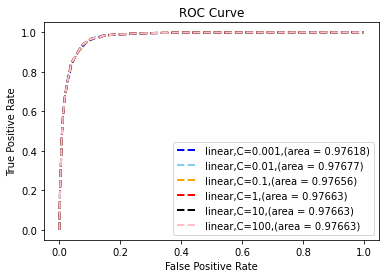
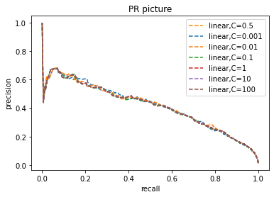
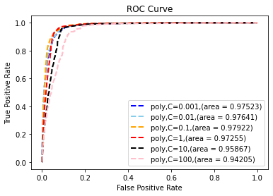
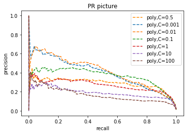
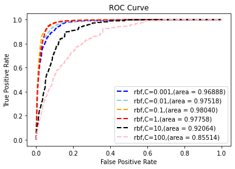
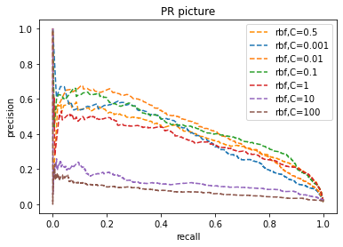
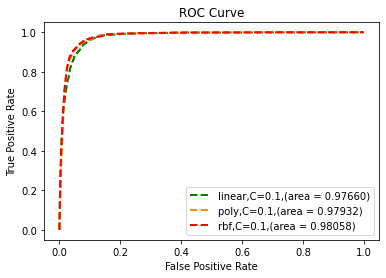

```python
#数据编码处理
from sklearn import svm
import numpy as np
from sklearn.preprocessing import StandardScaler  # 归一化
from sklearn.metrics import precision_recall_curve
from sklearn.metrics import roc_curve, auc  ###计算roc和auc
import matplotlib.pyplot as plt
import mpl_toolkits.axes_grid1.inset_locator as isl
import warnings
warnings.filterwarnings("ignore", category=Warning)
import linecache
import random
def get_line(file, nums_line):  #方便获取后续第几行数据
    return linecache.getline(file, nums_line+1).strip()
def DataSet_positive(filename):
    fr = open(filename)
    length = len(fr.readlines())
    dataSet = [[] for i in range(length)]
    labelSet = []
    for i in range(length):
        data = get_line(filename,i)
        for j in range(len(data)):
            if data[j] == 'A' or data[j] == 'a':
                dataSet[i].extend((1,0,0,0))
            elif data[j] == 'C' or data[j] == 'c':
                dataSet[i].extend((0,1,0,0))
            elif data[j] == 'T' or data[j] == 't':
                dataSet[i].extend((0,0,1,0))
            elif data[j] == 'G' or data[j] == 'g':
                dataSet[i].extend((0,0,0,1))
        labelSet.append(1)
    fr.close()
    return dataSet, labelSet

def DataSet_negative(filename):
    fr = open(filename)
    length = len(fr.readlines())
    dataSet = [[] for i in range(length)]
    labelSet = []
    for i in range(length):
        data = get_line(filename,i)
        for j in range(len(data)):
            if data[j] == 'A' or data[j] == 'a':
                dataSet[i].extend((1,0,0,0))
            elif data[j] == 'C' or data[j] == 'c':
                dataSet[i].extend((0,1,0,0))
            elif data[j] == 'T' or data[j] == 't':
                dataSet[i].extend((0,0,1,0))
            elif data[j] == 'G' or data[j] == 'g':
                dataSet[i].extend((0,0,0,1))
        labelSet.append(0)
    fr.close()
    return dataSet, labelSet
```


```python
%%time
#训练数据：
x1 , y1 = DataSet_positive("C:\\Users\\Alan‘s Lenovo\\Desktop\\donor_seq_training.txt")
x2 , y2 = DataSet_negative("C:\\Users\\Alan‘s Lenovo\\Desktop\\non_donor_seq_GC_training.txt")
x2 = random.sample(x2, 2381) #平衡阳性和阴性数据
y2 = random.sample(y2, 2381) 
x = x1 + x2
y = y1 + y2
x = np.array(x) #特征向量
y = np.array(y) #label
scaler = StandardScaler()  # 归一化操作
x = scaler.fit_transform(x)
#测试数据
a1 , b1 = DataSet_positive("C:\\Users\\Alan‘s Lenovo\\Desktop\\donor_seq_testing.txt")
a2 , b2 = DataSet_negative("C:\\Users\\Alan‘s Lenovo\\Desktop\\non_donor_seq_GC_testing.txt")
a = a1 + a2
b = b1 + b2
a = np.array(a)
b = np.array(b)
scaler = StandardScaler()  # 归一化操作
a = scaler.fit_transform(a)
```

    Wall time: 4.53 s
    


```python
%%time
from tqdm import tqdm
C = [0.001,0.01,0.1,1,10,100]
co = ["blue","skyblue","orange","red","black","pink"]
maxscore = 0
maxc = 0
for i in tqdm(range(6)):
    model_linear = svm.SVC(C = C[i], kernel='linear',probability=True)
    model_linear.fit(x, y)
    y_score = model_linear.fit(x,y).decision_function(a)
    fpr,tpr,threshold = roc_curve(b, y_score) ###计算真正率和假正率
    roc_auc = auc(fpr, tpr)
    plt.plot(fpr, tpr, 'k--', label='linear,C={0},(area = {1:.5f})'.format(C[i],roc_auc),lw=2,color = co[i])
    plt.xlim([-0.05, 1.05])  # 设置x、y轴的上下限，以免和边缘重合，更好的观察图像的整体
    plt.ylim([-0.05, 1.05])
    plt.xlabel('False Positive Rate')
    plt.ylabel('True Positive Rate')
    plt.title('ROC Curve')
    plt.legend(loc="lower right")
    if roc_auc >= maxscore:
        maxscore = roc_auc
        maxc = C[i]
```

    100%|████████████████████████████████████████████████████████████████████████████████████| 6/6 [02:27<00:00, 24.60s/it]
    

    Wall time: 2min 27s
    


    

    


```python
maxscore,maxc #最大的ROC面积与对应的C值
```


    (0.9767719604656457, 0.01)


```python
model_linear = svm.SVC(C=0.5, kernel='linear',probability=True)
model_linear.fit(x, y)
model_linear1 = svm.SVC(C=1e-3, kernel='linear',probability=True)
model_linear1.fit(x, y)
model_linear2 = svm.SVC(C=1e-2, kernel='linear',probability=True)
model_linear2.fit(x, y)
model_linear3 = svm.SVC(C=1e-1, kernel='linear',probability=True)
model_linear3.fit(x, y)
model_linear4 = svm.SVC(C=1, kernel='linear',probability=True)
model_linear4.fit(x,y)
model_linear5 = svm.SVC(C=10, kernel='linear',probability=True)
model_linear5.fit(x, y)
model_linear6 = svm.SVC(C=100, kernel='linear',probability=True)
model_linear6.fit(x, y)
y_score = model_linear.fit(x,y).decision_function(a)
precision, recall, thresholds = precision_recall_curve(b, y_score)
y_score1 = model_linear1.fit(x,y).decision_function(a)
precision1, recall1, thresholds1 = precision_recall_curve(b, y_score1)
y_score2 = model_linear2.fit(x,y).decision_function(a)
precision2, recall2, thresholds2 = precision_recall_curve(b, y_score2)
y_score3 = model_linear3.fit(x,y).decision_function(a)
precision3, recall3, thresholds3 = precision_recall_curve(b, y_score3)
y_score4 = model_linear4.fit(x,y).decision_function(a)
precision4, recall4, thresholds4 = precision_recall_curve(b, y_score4)
y_score5 = model_linear5.fit(x,y).decision_function(a)
precision5, recall5, thresholds5 = precision_recall_curve(b, y_score5)
y_score6 = model_linear6.fit(x,y).decision_function(a)
precision6, recall6, thresholds6 = precision_recall_curve(b, y_score6)
pr, ax = plt.subplots(1, 1)
ax.plot(recall,precision, '--', label="linear,C=0.5",color = "darkorange")
ax.plot(recall1,precision1, '--', label="linear,C=0.001")
ax.plot(recall2,precision2, '--', label="linear,C=0.01")
ax.plot(recall3,precision3, '--', label="linear,C=0.1")
ax.plot(recall4,precision4, '--', label="linear,C=1")
ax.plot(recall5,precision5, '--', label="linear,C=10")
ax.plot(recall6,precision6, '--', label="linear,C=100")
ax.set_title("PR picture")
ax.set_xlabel("recall")
ax.set_ylabel("precision")
ax.legend(loc="best")
```


    <matplotlib.legend.Legend at 0x222f0a97eb0>


    

    


```python
%%time
from tqdm import tqdm
C = [0.001,0.01,0.1,1,10,100]
co = ["blue","skyblue","orange","red","black","pink"]
maxscore = 0
maxc = 0
for i in tqdm(range(6)):
    model_poly = svm.SVC(C = C[i], kernel='poly',probability=True,degree = 3)
    model_poly.fit(x, y)
    y_score = model_poly.fit(x,y).decision_function(a)
    fpr,tpr,threshold = roc_curve(b, y_score) ###计算真正率和假正率
    roc_auc = auc(fpr, tpr)
    plt.plot(fpr, tpr, 'k--', label='poly,C={0},(area = {1:.5f})'.format(C[i],roc_auc),lw=2,color = co[i])
    plt.xlim([-0.05, 1.05])  # 设置x、y轴的上下限，以免和边缘重合，更好的观察图像的整体
    plt.ylim([-0.05, 1.05])
    plt.xlabel('False Positive Rate')
    plt.ylabel('True Positive Rate')
    plt.title('ROC Curve')
    plt.legend(loc="lower right")
    if roc_auc >= maxscore:
        maxscore = roc_auc
        maxc = C[i]
```

    100%|████████████████████████████████████████████████████████████████████████████████████| 6/6 [01:42<00:00, 17.06s/it]
    

    Wall time: 1min 42s
    


    

    


```python
model_poly = svm.SVC(C=0.5, kernel='poly',probability=True,degree=3)
model_poly.fit(x, y)
model_poly1 = svm.SVC(C=0.001, kernel='poly',probability=True,degree=3)
model_poly1.fit(x, y)
model_poly2 = svm.SVC(C=0.01, kernel='poly',probability=True,degree=3)
model_poly2.fit(x, y)
model_poly3 = svm.SVC(C=0.1, kernel='poly',probability=True,degree=3)
model_poly3.fit(x, y)
model_poly4 = svm.SVC(C=1, kernel='poly',probability=True,degree=3)
model_poly4.fit(x, y)
model_poly5 = svm.SVC(C=10, kernel='poly',probability=True,degree=3)
model_poly5.fit(x, y)
model_poly6 = svm.SVC(C=100, kernel='poly',probability=True,degree=3)
model_poly6.fit(x, y)
y_score = model_poly.fit(x,y).decision_function(a)
precision, recall, thresholds = precision_recall_curve(b, y_score)
y_score1 = model_poly1.fit(x,y).decision_function(a)
precision1, recall1, thresholds1 = precision_recall_curve(b, y_score1)
y_score2 = model_poly2.fit(x,y).decision_function(a)
precision2, recall2, thresholds2 = precision_recall_curve(b, y_score2)
y_score3 = model_poly3.fit(x,y).decision_function(a)
precision3, recall3, thresholds3 = precision_recall_curve(b, y_score3)
y_score4 = model_poly4.fit(x,y).decision_function(a)
precision4, recall4, thresholds4 = precision_recall_curve(b, y_score4)
y_score5 = model_poly5.fit(x,y).decision_function(a)
precision5, recall5, thresholds5 = precision_recall_curve(b, y_score5)
y_score6 = model_poly6.fit(x,y).decision_function(a)
precision6, recall6, thresholds6 = precision_recall_curve(b, y_score6)
pr, ax = plt.subplots(1, 1)
ax.plot(recall,precision, '--', label="poly,C=0.5",color = "darkorange")
ax.plot(recall1,precision1, '--', label="poly,C=0.001")
ax.plot(recall2,precision2, '--', label="poly,C=0.01")
ax.plot(recall3,precision3, '--', label="poly,C=0.1")
ax.plot(recall4,precision4, '--', label="poly,C=1")
ax.plot(recall5,precision5, '--', label="poly,C=10")
ax.plot(recall6,precision6, '--', label="poly,C=100")
ax.set_title("PR picture")
ax.set_xlabel("recall")
ax.set_ylabel("precision")
ax.legend(loc="best")
```


    <matplotlib.legend.Legend at 0x222f32f51f0>


    

    


```python
maxscore,maxc #最大的ROC面积与对应的C值
```


    (0.9792205832177414, 0.1)


```python
%%time
from tqdm import tqdm
C = [0.001,0.01,0.1,1,10,100]
co = ["blue","skyblue","orange","red","black","pink"]
maxscore = 0
maxc = 0
for i in tqdm(range(6)):
    model_rbf = svm.SVC(C = C[i], kernel='rbf',probability=True)
    model_rbf.fit(x, y)
    y_score = model_rbf.fit(x,y).decision_function(a)
    fpr,tpr,threshold = roc_curve(b, y_score) ###计算真正率和假正率
    roc_auc = auc(fpr, tpr)
    plt.plot(fpr, tpr, 'k--', label='rbf,C={0},(area = {1:.5f})'.format(C[i],roc_auc),lw=2,color = co[i])
    plt.xlim([-0.05, 1.05])  # 设置x、y轴的上下限，以免和边缘重合，更好的观察图像的整体
    plt.ylim([-0.05, 1.05])
    plt.xlabel('False Positive Rate')
    plt.ylabel('True Positive Rate')
    plt.title('ROC Curve')
    plt.legend(loc="lower right")
    if roc_auc >= maxscore:
        maxscore = roc_auc
        maxc = C[i]
```

    100%|████████████████████████████████████████████████████████████████████████████████████| 6/6 [01:56<00:00, 19.36s/it]
    

    Wall time: 1min 56s
    


    

    


```python
maxscore,maxc #最大的ROC面积与对应的C值
```


    (0.9803991417465407, 0.1)


```python
model_rbf = svm.SVC(C=0.5, kernel='rbf',probability=True)
model_rbf.fit(x, y)
model_rbf1 = svm.SVC(C=0.001, kernel='rbf',probability=True)
model_rbf1.fit(x, y)
model_rbf2 = svm.SVC(C=0.01, kernel='rbf',probability=True)
model_rbf2.fit(x, y)
model_rbf3 = svm.SVC(C=0.1, kernel='rbf',probability=True)
model_rbf3.fit(x, y)
model_rbf4 = svm.SVC(C=1, kernel='rbf',probability=True)
model_rbf4.fit(x, y)
model_rbf5 = svm.SVC(C=10, kernel='rbf',probability=True)
model_rbf5.fit(x, y)
model_rbf6 = svm.SVC(C=100, kernel='rbf',probability=True)
model_rbf6.fit(x, y)

y_score = model_rbf.fit(x,y).decision_function(a)
precision, recall, thresholds = precision_recall_curve(b, y_score)

y_score1 = model_rbf1.fit(x,y).decision_function(a)
precision1, recall1, thresholds1 = precision_recall_curve(b, y_score1)

y_score2 = model_rbf2.fit(x,y).decision_function(a)
precision2, recall2, thresholds2 = precision_recall_curve(b, y_score2)

y_score3 = model_rbf3.fit(x,y).decision_function(a)
precision3, recall3, thresholds3 = precision_recall_curve(b, y_score3)

y_score4 = model_rbf4.fit(x,y).decision_function(a)
precision4, recall4, thresholds4 = precision_recall_curve(b, y_score4)

y_score5 = model_rbf5.fit(x,y).decision_function(a)
precision5, recall5, thresholds5 = precision_recall_curve(b, y_score5)

y_score6 = model_rbf6.fit(x,y).decision_function(a)
precision6, recall6, thresholds6 = precision_recall_curve(b, y_score6)
pr, ax = plt.subplots(1, 1)
ax.plot(recall,precision, '--', label="rbf,C=0.5",color = "darkorange")
ax.plot(recall1,precision1, '--', label="rbf,C=0.001")
ax.plot(recall2,precision2, '--', label="rbf,C=0.01")
ax.plot(recall3,precision3, '--', label="rbf,C=0.1")
ax.plot(recall4,precision4, '--', label="rbf,C=1")
ax.plot(recall5,precision5, '--', label="rbf,C=10")
ax.plot(recall6,precision6, '--', label="rbf,C=100")
ax.set_title("PR picture")
ax.set_xlabel("recall")
ax.set_ylabel("precision")
ax.legend(loc="best")
```


    <matplotlib.legend.Legend at 0x222f0986e50>


    

    


```python
%%time
model_linear = svm.SVC(C = 0.1, kernel='linear',probability=True)
model_linear.fit(x, y)
y_score_linear = model_linear.fit(x,y).decision_function(a)
fpr_linear,tpr_linear,threshold_linear = roc_curve(b, y_score_linear) ###计算真正率和假正率
roc_auc_linear = auc(fpr_linear, tpr_linear)
model_poly = svm.SVC(C = 0.1, kernel='poly',probability=True,degree = 3)
model_poly.fit(x, y)
y_score_poly = model_poly.fit(x,y).decision_function(a)
fpr_poly,tpr_poly,threshold_poly = roc_curve(b, y_score_poly) ###计算真正率和假正率
roc_auc_poly = auc(fpr_poly, tpr_poly)
model_rbf = svm.SVC(C = 0.1, kernel='rbf',probability=True)
model_rbf.fit(x, y)
y_score_rbf = model_rbf.fit(x,y).decision_function(a)
fpr_rbf,tpr_rbf,threshold_rbf = roc_curve(b, y_score_rbf) ###计算真正率和假正率
roc_auc_rbf = auc(fpr_rbf, tpr_rbf)
plt.plot(fpr_linear, tpr_linear, 'k--', label='linear,C=0.1,(area = {0:.5f})'.format(roc_auc_linear),lw=2,color = "green")
plt.plot(fpr_poly, tpr_poly, 'k--', label='poly,C=0.1,(area = {0:.5f})'.format(roc_auc_poly),lw=2,color = "darkorange")
plt.plot(fpr_rbf, tpr_rbf, 'k--', label='rbf,C=0.1,(area = {0:.5f})'.format(roc_auc_rbf),lw=2,color = "red")
plt.xlim([-0.05, 1.05])  # 设置x、y轴的上下限，以免和边缘重合，更好的观察图像的整体
plt.ylim([-0.05, 1.05])
plt.xlabel('False Positive Rate')
plt.ylabel('True Positive Rate')
plt.title('ROC Curve')
plt.legend(loc="lower right")
```

    Wall time: 35.4 s
    


    <matplotlib.legend.Legend at 0x1fe4ed571c0>


    

    


```python

```
